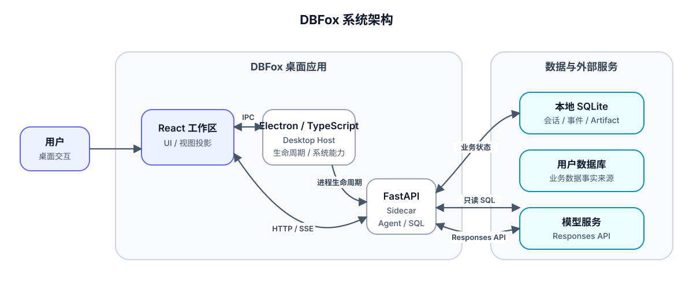

<p align="center">
  
</p>

<h1 align="center">DBFox</h1>

<p align="center"><strong>本地优先、结果可追溯的 AI Agent 工作空间</strong></p>

<p align="center">
  Core 提供最小可信运行时，能力由 DLC 扩展：把目标交给 Agent，它规划步骤、调用工具、
  引用证据并给出可追溯的结果——数据分析是第一个内置能力，而不是全部。
</p>

<p align="center">
  <a href="#项目状态"></a>
  <a href="#平台支持"></a>
  <a href="https://www.electronjs.org/"></a>
  <a href="LICENSE"></a>
</p>

<p align="center">
  <a href="#核心能力">核心能力</a> ·
  <a href="#系统架构">系统架构</a> ·
  <a href="#快速开始">快速开始</a> ·
  <a href="docs/README.md">文档中心</a> ·
  <a href="CONTRIBUTING.md">参与贡献</a> ·
  <a href="AUTHORS.md">作者与正式来源</a>
</p>


## 项目定位

DBFox 采用 **Core + DLC** 的 Agent Harness 架构：Core 只保留最小可信运行时（会话与
Run 生命周期、工具与审批合同、持久化事实源、SSE 恢复、桌面壳），其余能力——数据连接、
SQL 工作台、目录绑定、可视化、GitHub、音乐作曲——都由签名 DLC 以统一合同
（资源视图、Dock 视图、工件渲染器、领域操作）扩展进来。换一句话说：Core 负责
“可信地完成一次 Agent 运行”，DLC 负责“运行能做什么”。

模型不会直接获得数据库连接，也不会将整张表无边界地放入上下文。Agent 只能通过经过
授权的工具访问资源；SQL 在执行前经过方言解析、安全校验和策略检查，查询结果以可追溯
的 Result Artifact（结果制品）保存和引用。

## 项目状态

DBFox 目前处于持续开发阶段。Windows x64、macOS arm64 与 Ubuntu x64 已在各自 GitHub Runner
完成 Frozen Sidecar、Electron 安装包和 packaged runtime/DLC 自动合同。平台代码签名、公证、真实
桌面环境长期运行与候选人工验收仍需按目标平台单独完成，不能把自动合同等同正式发布。

本仓库当前适合：

- 本地开发、架构研究和功能验证；
- Windows、macOS 与 Linux 候选版本构建和自动合同验证；
- Agent、SQL、工具和持久化合同的自动化测试与评测。

在用于重要生产数据前，请先完成目标数据库、模型服务和发布环境对应的验收。

## 核心能力

| 能力 | 当前实现 |
| --- | --- |
| Agent 运行时（Core） | 基于 OpenAI Responses 工具调用合同执行多轮 Agent Turn：计划、工具调用、审批、取消、部分完成与最终回答；事件持久化并支持 SSE 恢复。 |
| 项目工作区（Core） | 项目分组侧栏：每个项目聚合自己的对话与资源，项目管理页盘点各 DLC 配置的资源和移除入口。 |
| 模型服务（Core） | 连接 OpenAI 兼容服务；模型列表从所连服务实时获取，内置中外厂商目录与自定义名称兜底，凭据只进系统凭据库。 |
| 数据能力（Data DLC） | 管理 MySQL、PostgreSQL、SQLite 和 DuckDB 连接，浏览 schema 与目录，多标签 SQL 工作台（安全校验、只读执行、分页、导出），结果以可追溯 Artifact 呈现。 |
| 工作区绑定（Workspace DLC） | 将本地目录绑定到项目，提供文件列举与读取能力。 |
| 更多 DLC | 音乐作曲（Music）、可视化（Visualization）、GitHub 仓库绑定等，按同一扩展合同接入。 |
| 扩展系统 | DLC SDK 定义资源视图、Dock 视图、工件渲染器、领域操作与凭据租约合同；扩展包签名后由桌面壳按摘要装载。 |
| 桌面运行时（Core） | 由 Electron Main 管理 Python Sidecar 生命周期、运行时令牌、窗口状态和系统能力。 |
| 安全与诊断（Core） | 使用系统凭据库、SQL 策略、公开错误合同、共享脱敏规则和受控诊断包。 |

## 系统架构



### 职责边界

| 组件 | 负责 | 不负责 |
| --- | --- | --- |
| React 工作区 | 页面、交互、当前视图投影和流式内容展示 | Sidecar 生命周期、业务事实持久化、数据库凭据 |
| Electron Main | 桌面窗口、系统能力、Sidecar 启停与监控、运行时配置 | Agent 决策、SQL 业务规则、会话内容 |
| FastAPI Sidecar | API、鉴权、Agent Runtime、工具策略、SQL 与 Result 服务 | 桌面窗口和操作系统界面 |
| DLC 扩展 | 领域资源、视图、操作与领域事实（数据、工作区、GitHub 等） | Core 运行时决策、其他 DLC 的资源与凭据 |
| 本地 SQLite | DBFox 会话、事件、工具状态、Artifact 和配置元数据 | 用户业务数据库的事实数据 |
| 用户数据库 | 用户业务数据的事实来源 | DBFox 自身的运行状态 |

### 关键运行链路

1. Electron Main 启动并监控 Python Sidecar，生成本次运行使用的端口和短期令牌。
2. React 通过窄化 preload bridge 取得当前 Runtime 配置，再使用带令牌的 HTTP 与 SSE 访问 Sidecar。
3. Agent 按 Turn 组装有界上下文，请求模型生成文本或工具调用。
4. 工具调用经过输入校验、策略和必要审批；SQL 必须先校验，再走唯一的只读执行链。
5. 工具观察、Artifact、Evidence、消息和公开事件写入本地 SQLite；界面通过实时增量与权威快照保持一致。
6. SSE 中断或应用重启后，客户端从持久化 cursor 和 snapshot 恢复，不把前端内存当作事实来源。

更完整的状态所有权、事务边界和失败语义见[系统总览](docs/architecture/system-overview.md)，功能到代码的对应关系见[功能和代码索引](docs/architecture/implementation-map.md)。

## 技术栈

| 层次 | 主要技术 |
| --- | --- |
| 桌面 Host | Electron、TypeScript、electron-builder |
| 前端 | React 19、TypeScript、Vite、TanStack Query/Table/Virtual、Zustand、Radix UI |
| 后端 | Python 3.12、FastAPI、Pydantic、SQLAlchemy、Alembic |
| Agent | OpenAI Responses API typed events、显式 Turn/Completion/Tool Runtime |
| 数据与 SQL | SQLite、MySQL、PostgreSQL、DuckDB、sqlglot |
| 测试与评测 | pytest、Vitest、Electron packaged smoke、Core/Capability/Composition Bench、GitHub Actions |

## 快速开始

### 环境要求

- Python 3.12；
- Node.js 22.18 或更高版本；

正式候选仍须使用目标平台完成签名、安装和人工运行验收。

### 获取代码并安装依赖

```powershell
git clone https://github.com/trrueee/DBFox.git
Set-Location DBFox

python -m venv .venv
.\.venv\Scripts\Activate.ps1
python -m pip install --require-hashes -r requirements-dev.lock

Set-Location desktop
npm ci
Set-Location ..
```

### 启动开发服务

同时启动 Python API 与 Vite 开发服务器：

```powershell
.\dev.ps1
```

启动完整 Electron 桌面应用：

```powershell
Set-Location desktop
npm run electron:dev
```

首次使用模型能力时，请在应用设置的「模型服务」中配置凭据并选择服务商；默认模型列表从所连服务实时获取，也支持内置精选与自定义名称。API Key 由系统凭据库保存，不应写入仓库、前端 `localStorage` 或 `.env` 文件。

详细的环境配置、Sidecar 构建、安装包生成和故障排查命令见[贡献指南](CONTRIBUTING.md)。

## 工程质量

日常变更至少应运行与修改范围匹配的检查。完整门禁与平台要求以[工程质量门禁](docs/quality/engineering-gates.md)为准。

```powershell
# Python
python -m pytest -q

# Frontend
Set-Location desktop
npm test -- --run
npm run lint
npm run build
npm run typecheck:test

# Electron Main / Preload
npm run test:electron
```

Agent 质量不只通过单元测试判断。仓库同时维护确定性场景、故障注入、工具合同、策略门禁和 opt-in 真实 Provider 评测，详见[Agent 评测方法](docs/quality/agent-evaluation-methodology.md)。

## 项目结构

| 路径 | 内容 |
| --- | --- |
| `desktop/src/` | React 桌面界面、状态、Transport 和工作区功能 |
| `desktop/main/`、`desktop/preload/` | Electron Host、窄化 IPC、原生能力与 Sidecar 生命周期 |
| `desktop/build-resources/` | Electron 平台图标资源 |
| `engine/api/` | FastAPI 路由、请求合同和 HTTP 边界 |
| `engine/agent/` | Coordinator、Run Loop、上下文、Provider、Completion 和持久化仓库 |
| `engine/tools/` | 工具注册、输入合同、策略、审批和执行运行时 |
| `dlcs/` | 系统 DLC：Data（连接、Catalog、SQL 与结果视图）、Workspace（目录绑定）、GitHub、Music、Visualization |
| `sdk/frontend/` | DLC 前端扩展合同（资源视图、Dock 视图、工件渲染器、操作调用）的类型与清单 Schema |
| `engine/migrations/` | DBFox 本地元数据库的 Alembic 迁移 |
| `verification/tests/` | 与产品物理分离的 Agent Core、System、Integration 与 Bench 验证 |
| `verification/bench/` | 与产品分离的 Core/Capability/Composition Bench、通用测量合同与 suite-owned scorer |
| `docs/` | 当前架构、实现指南、规范、质量文档和历史档案 |
| `.github/workflows/` | 持续集成、Agent 评测和发布候选工作流 |

## 文档导航

| 文档 | 内容 |
| --- | --- |
| [文档中心](docs/README.md) | 文档分类、阅读路线、当前与历史资料边界 |
| [系统总览](docs/architecture/system-overview.md) | 进程拓扑、状态所有权、关键不变量和运行链路 |
| [后端代码导览](docs/architecture/backend-owner-guide.md) | 从入口、调用链、数据表和测试理解 Python Engine |
| [后端实现入口](docs/backend/README.md) | Core/DLC、Agent Runtime、Data 能力与验证文档导航 |
| [Agent Runtime](docs/architecture/agent-runtime.md) | Turn、流式输出、完成判断、取消与错误语义 |
| [工具、上下文与记忆](docs/architecture/agent-tool-context-memory-contract.md) | SQL-first 工具、上下文预算、持久化和历史召回 |
| [功能和代码索引](docs/architecture/implementation-map.md) | 功能到代码 Symbol、数据表和测试的索引 |
| [工程质量门禁](docs/quality/engineering-gates.md) | 测试、静态检查、供应链和发布合同 |
| [桌面发布生命周期](docs/architecture/desktop-release-lifecycle.md) | Sidecar、安装、恢复、签名和更新边界 |
| [参与贡献](CONTRIBUTING.md) | 开发环境、变更要求、提交和验证流程 |

历史方案、阶段计划和已关闭评审位于 [`docs/archive/`](docs/archive/README.md)。这些文件只用于追溯决策背景，不代表当前实现。

## 平台支持

| 平台 | 验证状态 | 当前发布边界 |
| --- | --- | --- |
| Windows x64 | 自动合同已通过 Frozen Sidecar、NSIS、鉴权和 packaged smoke | 正式候选仍要求 Authenticode 与安装态验收 |
| macOS arm64 | 自动合同已通过 Frozen Sidecar、DMG/ZIP 和 packaged smoke | Developer ID、公证、Gatekeeper 与人工 GUI 验收待正式候选 |
| Ubuntu x64 | 自动合同已通过 Frozen Sidecar、AppImage 和 xvfb packaged smoke | 目标发行版依赖、包管理器升级路径与人工 GUI 验收待正式候选 |

具体候选版本必须以绑定 commit 的 CI、产物和 smoke 证据为准。源码中存在平台配置不等于该平台已经通过发布验收。

## 正式来源与真伪校验

DBFox 的规范仓库是 [`trrueee/DBFox`](https://github.com/trrueee/DBFox)，正式安装包只通过该仓库的 GitHub Releases 发布。正式 Windows 候选版本要求源提交已通过 GitHub 签名验证，并同时具备 Authenticode、Electron 更新元数据和 GitHub Artifact Attestation。下载后可以运行：

```powershell
gh attestation verify .\DBFox_1.0.3_x64_en-US.msi --repo trrueee/DBFox
```

该命令验证文件摘要是否与规范仓库发布工作流登记的构建来源一致；它不会把第三方 fork 或本地重打包文件认作正式产物。作者、署名义务、历史证明边界和完整校验方式见[作者与正式来源](AUTHORS.md)。

## 安全说明

- 数据库密码、模型 API Key 和 SSH Secret 只进入系统凭据库；
- 正式前端和安装包不得包含开发 Token；
- Agent 数据访问默认经过受约束工具，SQL 必须先校验再执行；
- 日志、错误、事件和诊断包使用统一的公开错误与脱敏合同；
- 不要提交 `.env*`、本地数据库、日志、安装包、Sidecar 二进制或临时测试源码。

发现安全问题时，请勿在公开 Issue 中粘贴凭据、连接串、原始日志或可利用细节。请先通过仓库维护者提供的私密渠道联系。

## 参与贡献

开始修改前请阅读 [CONTRIBUTING.md](CONTRIBUTING.md)。项目优先复用标准库、官方组件和成熟方案，在产生问题的边界修复根因；不使用长期兼容层、猜测式 fallback 或第二套执行链掩盖合同不一致。

提交 Pull Request 时应明确说明变更范围、测试证据、平台边界和未验证事项，并同步更新受影响的当前文档。

## License

DBFox 使用 [MIT License](LICENSE)。允许使用、修改、分发和商业化，但必须保留许可证中的版权与许可声明；MIT 授权不代表衍生版本由 DBFox 维护者发布或认可。项目作者和正式产物来源见 [AUTHORS.md](AUTHORS.md)。
