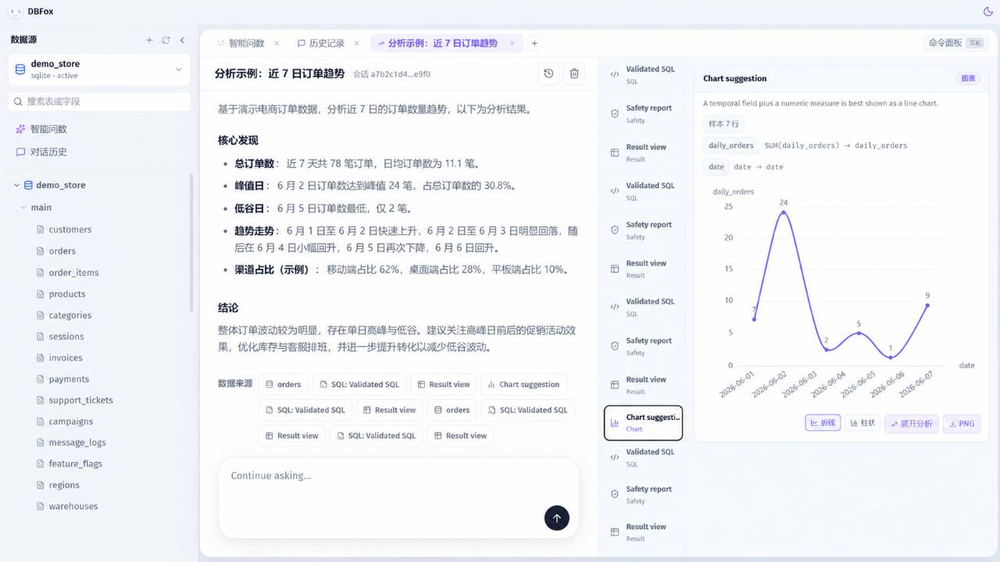
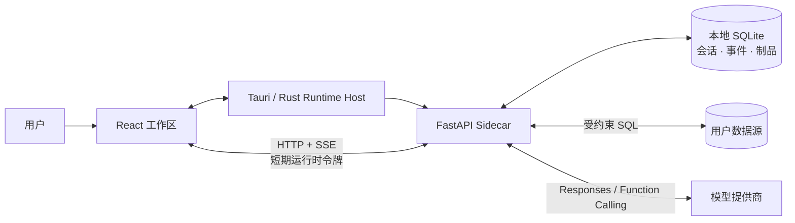

<p align="center">
  
</p>

<h1 align="center">DBFox</h1>

<p align="center"><strong>本地优先、可验证、面向真实数据库工作的 AI 数据分析桌面客户端。</strong></p>

<p align="center">把数据库浏览、SQL 工作台、AI Agent、结果制品与会话记忆放进一个可恢复的桌面工作区。</p>

<p align="center">
  <a href="#项目状态"></a>
  <a href="#平台支持"></a>
  <a href="https://tauri.app/"></a>
  <a href="LICENSE"></a>
</p>

<p align="center">
  <a href="#快速开始">快速开始</a> ·
  <a href="#核心能力">核心能力</a> ·
  <a href="#架构概览">架构概览</a> ·
  <a href="docs/README.md">文档中心</a> ·
  <a href="CONTRIBUTING.md">参与贡献</a>
</p>



## 项目状态

DBFox 正在积极开发中。目前经过真实构建与发布验收的平台是 **Windows x64**。macOS 与 Linux 仅维护静态发布合同，不代表已经完成构建、安装、签名或运行验证；详见[平台支持](#平台支持)。

## 为什么是 DBFox

- **数据库工作台，而不只是聊天窗口**：在同一工作区浏览目录、编写 SQL、查看结果、生成图表并继续分析。
- **SQL-first、证据优先**：模型通过受约束的工具查询数据；可验证结论关联到真实查询结果和持久化制品，不把大量原始行直接塞进上下文。
- **本地优先的安全边界**：连接凭据进入系统凭据库，桌面 Host 管理 Sidecar 生命周期与短期运行时令牌，SQL 在执行前经过只读与策略检查。
- **可恢复且可追溯**：会话、运行事件、工具结果和证据落入耐久存储；SSE 断线后可以按 cursor 恢复，而不是依赖 UI 内存维持事实。

## 核心能力

| 能力 | 说明 |
| --- | --- |
| 数据源与目录 | 管理 MySQL、PostgreSQL、SQLite、DuckDB 连接，浏览 schema、表、字段和关系。 |
| SQL 工作区 | 多标签 SQL 编辑、校验、只读执行、分页结果、导出与查询历史。 |
| AI 数据分析 | 使用 provider-neutral 的原生 function calling，让 Agent 规划、调用工具、观察结果并形成回答。 |
| 结果与可视化 | 将查询结果保存为可引用制品，支持表格、图表、摘要和证据回溯。 |
| 会话与记忆 | 持久化消息、运行和事件；通过受限检索召回历史上下文，不把数据库当作无边界提示词。 |
| 安全与恢复 | OS 凭据库、Production Token 隔离、SQL 安全策略、审批边界、脱敏错误与诊断信息。 |

## 架构概览



职责边界保持单一：Rust 是桌面运行时生命周期权威；Python Sidecar 承载业务 API、Agent 与工具运行时；React 负责呈现和用户交互；SQLite 保存 DBFox 自身的耐久状态，外部数据库仍是业务数据事实来源。

更详细的自顶向下说明见[系统总览](docs/architecture/system-overview.md)与[实现地图](docs/architecture/implementation-map.md)。

## 快速开始

### 环境要求

- Windows 10/11 x64（当前正式验证平台）
- Python 3.12（开发环境）
- Node.js 20.19 或更高版本
- Rust 1.95（运行 Tauri 桌面壳时需要）

### 安装依赖

```powershell
git clone https://github.com/trrueee/DBFox.git
Set-Location DBFox

python -m venv .venv
.\.venv\Scripts\Activate.ps1
python -m pip install --require-hashes -r requirements-dev.lock

Set-Location desktop
npm ci
Set-Location ..
```

### 启动开发环境

同时启动 Python API 与前端开发服务器：

```powershell
.\dev.ps1
```

运行 Tauri 桌面应用：

```powershell
Set-Location desktop
npm run tauri -- dev
```

完整的环境变量、质量检查和构建命令见[贡献指南](CONTRIBUTING.md)。

## 文档

| 从这里开始 | 适合了解 |
| --- | --- |
| [文档中心](docs/README.md) | 文档分类、阅读路线、状态与维护规则 |
| [系统总览](docs/architecture/system-overview.md) | 产品边界、进程拓扑、状态所有权与关键不变量 |
| [实现地图](docs/architecture/implementation-map.md) | 从能力到真实代码入口、数据表和测试的映射 |
| [Agent Runtime](docs/architecture/agent-runtime.md) | Turn、Completion、工具闭环、取消与错误语义 |
| [工具、上下文与记忆](docs/architecture/agent-tool-context-memory-contract.md) | SQL-first 工具设计、上下文预算、持久化与召回 |
| [工程质量门禁](docs/quality/engineering-gates.md) | 测试、静态检查、发布合同和安全门禁 |
| [参与贡献](CONTRIBUTING.md) | 本地开发、变更边界、提交与验证要求 |

历史方案、阶段报告和已关闭评审保存在 [`docs/archive/`](docs/archive/README.md)，仅作为决策背景，不代表当前实现。

## 平台支持

| 平台 | 当前结论 | 发布边界 |
| --- | --- | --- |
| Windows x64 | 已完成真实 Sidecar、安装包与关键运行合同验证 | 当前正式支持目标 |
| macOS | 未真实验证 | 仅静态配置审查；签名、公证、Gatekeeper、安装与 GUI 未验证 |
| Linux | 未真实验证 | 仅静态配置审查；动态依赖、安装、桌面启动与 GUI 未验证 |

在取得对应 Runner、产物与 smoke 证据前，不会把 Windows 的结果外推到其他平台。

## 安全边界

- 不在仓库、前端存储或正式产物中保存数据库密码和开发 Token。
- Provider API Key 与数据源凭据通过系统凭据库管理。
- Agent 数据访问默认走受约束的工具链；SQL 必须先校验再执行。
- 工具错误、日志和诊断包使用公开错误合同与共享脱敏规则。
- 请勿提交 `.env*`、本地数据库、日志、安装包、Sidecar 二进制或临时测试源码。

发现安全问题时，请不要在公开 issue 中粘贴凭据、连接串、日志原文或可利用细节；先使用仓库维护者提供的私密联系渠道。

## 参与贡献

开始修改前，请先阅读 [CONTRIBUTING.md](CONTRIBUTING.md)。DBFox 优先复用标准库、官方组件和成熟方案，并坚持在真实边界修复根因；不通过长期兼容层、猜测式 fallback 或第二套执行链掩盖合同不一致。

## License

DBFox 使用 [MIT License](LICENSE)。
