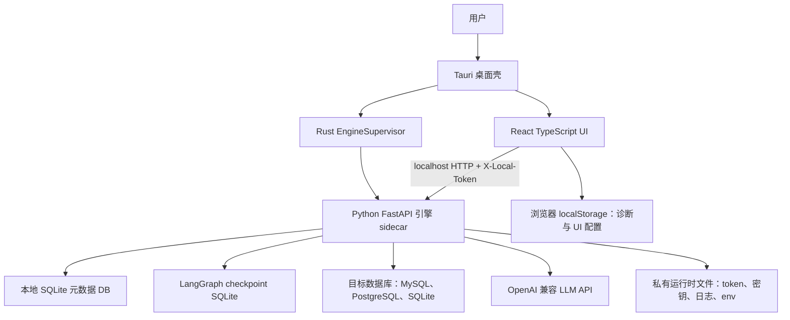
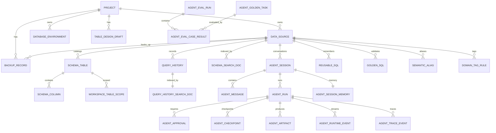
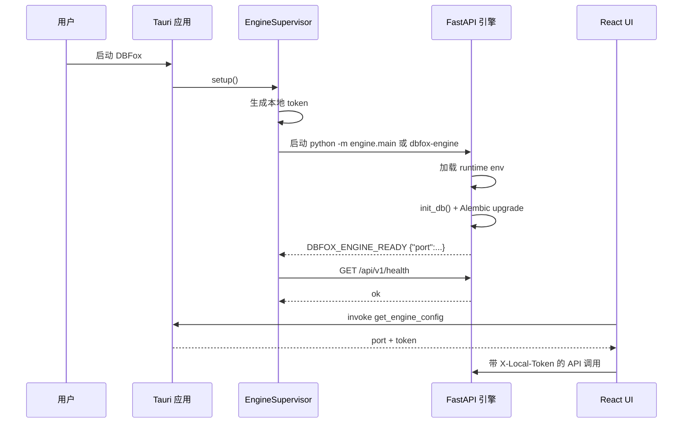
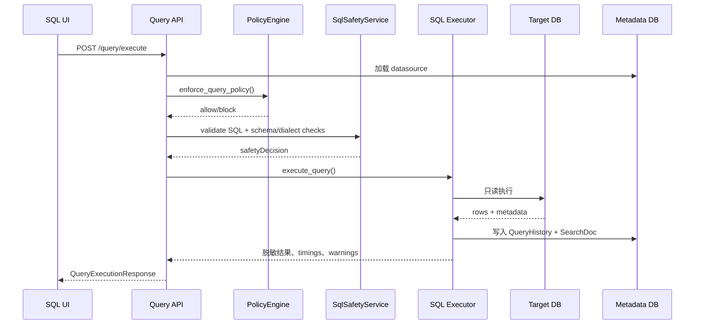
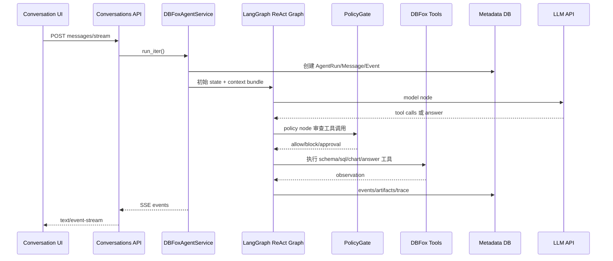
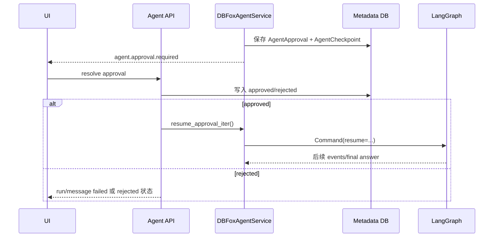
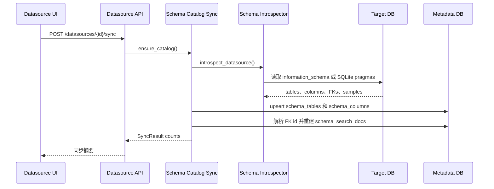

# 架构设计文档：DBFox

生成日期：2026-06-27

证据来源：仓库中的 `engine/`、`desktop/`、`docs/`、`.github/workflows/ci.yml`、`requirements*.txt`、`pyproject.toml`、`desktop/package.json`、`desktop/src-tauri/tauri.conf.json`、`desktop/src-tauri/Cargo.toml`、`build_sidecar.py`，以及通过 CodeGraph 检索到的后端、前端、Tauri 侧车与 Agent 相关源码。

说明：本文档基于当前代码库静态分析和配置文件推断生成。凡缺少明确代码或文档证据的内容，均以“假设”“未知”或“待确认”标记。

## 1. 执行摘要

DBFox 是一个本地优先的 AI 数据库桌面客户端。系统由 Tauri 2 桌面壳、React/TypeScript 前端和 Python FastAPI 本地引擎组成。后端负责本地元数据持久化、目标数据库连接、结构内省、只读 SQL 安全执行、查询与 Agent 历史记录，以及基于 LangGraph 的自然语言数据分析 Agent。

整体架构可概括为“本地桌面模块化单体”：前端和后端在同一个桌面应用内分离部署，通过 localhost HTTP/SSE 通信；Tauri 负责启动和监管 Python sidecar；Python 引擎通过 SQLite 保存本地状态，并连接外部数据库与 OpenAI 兼容 LLM API。

关键模块如下：

- `desktop/src-tauri/src/lib.rs`：Rust `EngineSupervisor`，启动 Python 引擎 sidecar，解析动态端口和本地 token，并暴露给 UI。
- `desktop/src/`：React 桌面工作台，包括数据源树、标签页、SQL 控制台、智能查询、会话、结果制品、诊断和设置。
- `engine/main.py`：FastAPI 本地引擎入口，挂载 `/api/v1` 路由，执行本地 token、CORS、Origin/Referer 和异常处理策略。
- `engine/models.py`：本地元数据模型，覆盖项目、数据源、schema catalog、查询历史、会话、Agent 运行、审批、checkpoint、制品、评测和备份。
- `engine/agent/graph/react_graph.py`：LangGraph ReAct 状态机，包含模型调用、策略检查、工具执行、观察、进度控制、修复、审批和收尾节点。
- `engine/sql/` 与 `engine/policy/`：SQL 解析、安全决策、只读策略、脱敏、执行、取消、结果序列化和 Agent 工具策略。

架构优势包括：清晰的本地安全边界、模块化 API 路由、分层 SQL 安全网关、可迁移的本地元数据模型、流式 Agent 事件机制、较丰富的测试资产。主要风险包括：生产级观测能力有限、发布/签名/自动更新策略未知、LLM base URL 环境变量命名可能漂移、类型检查严格度不均衡、代码中存在 DuckDB 内省路径但依赖未声明。

## 2. 项目概览

| 维度 | 结论 | 证据 |
| --- | --- | --- |
| 产品定位 | 本地桌面数据库客户端，支持数据源管理、schema 浏览、SQL 执行、AI 辅助分析、结果制品与可视化。 | `README.md`、`desktop/src/features/appShell/WorkspaceRouter.tsx`、`engine/api/query.py`、`engine/api/agent.py` |
| 目标用户 | 数据库使用者、数据分析师、开发者、需要访问本地或远程数据库的技术用户。 | 假设：基于 README 能力和 UI 工作台推断；具体用户画像待确认。 |
| 核心能力 | 数据源 CRUD、连接测试、schema 同步、schema 搜索、SQL 验证/执行/解释/取消/历史、AI 会话、Agent 评测、备份恢复、诊断日志。 | `engine/api/__init__.py`、`engine/api/datasources/*`、`engine/api/query.py`、`engine/api/agent.py`、`engine/api/backup.py` |
| 架构摘要 | Tauri 桌面壳启动本地 Python 引擎；React UI 通过 localhost 和 `X-Local-Token` 调用引擎；引擎本地持久化元数据并访问目标数据库/LLM API。 | `desktop/src-tauri/src/lib.rs`、`desktop/src/lib/api/client.ts`、`engine/main.py`、`engine/db.py` |

## 3. 技术栈

### 后端引擎

| 类别 | 技术 | 证据 |
| --- | --- | --- |
| 语言/运行时 | Python 3.12+ | `README.md`、`pyproject.toml`、`.github/workflows/ci.yml` |
| Web 框架 | FastAPI、Uvicorn | `requirements.txt`、`engine/main.py` |
| ORM/迁移 | SQLAlchemy 2、Alembic | `requirements.txt`、`engine/db.py`、`alembic.ini`、`engine/migrations/versions/` |
| 元数据存储 | 默认本地 SQLite，可通过 `DBFOX_DATABASE_URL` 覆盖 | `engine/db.py` |
| 目标数据库驱动 | PyMySQL、psycopg2-binary、Python 标准库 sqlite3 | `requirements.txt`、`engine/datasource.py`、`engine/sql/executor.py` |
| SQL 解析/安全 | sqlglot、自研 TrustGate/Guardrail/PolicyEngine | `requirements.txt`、`engine/sql/safety/service.py`、`engine/policy/engine.py` |
| AI/Agent | LangChain、LangGraph、langchain-openai、langgraph-checkpoint-sqlite | `requirements.txt`、`engine/agent/graph/react_graph.py`、`engine/llm/factory.py` |
| 密钥保护 | cryptography AES-256-GCM、私有 runtime 文件、可选 OS keyring 镜像 | `engine/crypto.py`、`engine/runtime_paths.py` |
| 诊断日志 | 带脱敏能力的 Python rotating file handler | `engine/diagnostics/logs.py` |

### 桌面与前端

| 类别 | 技术 | 证据 |
| --- | --- | --- |
| 桌面壳 | Tauri 2、Rust 2021 | `desktop/src-tauri/Cargo.toml`、`desktop/src-tauri/tauri.conf.json` |
| 前端 | React 19、TypeScript、Vite | `desktop/package.json`、`desktop/src/main.tsx` |
| 状态管理 | Zustand | `desktop/package.json`、`desktop/src/stores/*.ts` |
| UI 基础组件 | Radix UI、本地 `components/ui`、Tailwind CSS、lucide-react | `desktop/package.json`、`desktop/src/components/ui/*` |
| 表格/虚拟滚动 | TanStack Table、TanStack Virtual | `desktop/package.json`、`desktop/src/components/data-grid/*` |
| 编辑器/图表 | Monaco Editor、ECharts | `desktop/package.json`、`desktop/src/components/SqlEditor.tsx`、`desktop/src/features/workspace/artifacts/*` |
| 前端测试 | Vitest、Testing Library、jsdom | `desktop/package.json`、`desktop/vitest.config.ts` |

### 明确的不确定项

| 项 | 状态 |
| --- | --- |
| DuckDB | `engine/environment/schema_introspector.py` 中存在 DuckDB 分支，但 `requirements.txt` 未声明 `duckdb`。标记为待确认。 |
| 生产托管 | 当前代码面向本地桌面/sidecar，远程托管不是当前明确目标。若未来支持共享部署，需要新增鉴权和隔离模型。 |
| 指标与链路追踪 | 代码支持 LangSmith env，但未发现完整 metrics、alerting 或结构化 tracing 后端。 |

## 4. 仓库结构

| 路径 | 职责 |
| --- | --- |
| `engine/` | Python FastAPI 引擎、Agent 运行时、SQL 执行/安全、schema 同步、持久化、策略、评测、测试。 |
| `engine/api/` | 挂载到 `/api/v1` 的版本化 API 路由。 |
| `engine/api/datasources/` | 数据源 CRUD、健康检查、schema 同步/列表/ER、schema 元数据更新。 |
| `engine/agent/` | LangGraph Agent 图、节点、模型调用、进度、修复和工具集成。 |
| `engine/agent_core/` | Agent 数据类型、事件存储、持久化、记忆投影、制品、答案合成。 |
| `engine/environment/` | 数据源解析、schema 内省、schema catalog 同步、数据库映射和 profile 工具。 |
| `engine/sql/` | SQL 解析、方言执行、连接池、安全、结果视图、行序列化、explain。 |
| `engine/policy/` | PolicyEngine、PolicyGate、脱敏、敏感数据处理、确认工作流。 |
| `engine/migrations/` | Alembic 迁移环境和 13 个迁移版本。 |
| `engine/tests/`、`engine/agent/tests/`、`engine/evaluation/tests/` | Python 单元、集成、白盒和评测测试；观察到 110 个测试文件。 |
| `desktop/` | React/Vite 前端和 Tauri 应用。 |
| `desktop/src/` | UI 应用、组件、功能模块、stores、API client、测试。 |
| `desktop/src-tauri/` | Rust sidecar supervisor、Tauri 配置、图标、打包配置。 |
| `desktop/src/__tests__` 与功能/组件 `__tests__` | 前端测试；观察到 108 个 `*.test.ts(x)` 文件。 |
| `docs/` | 已有设计、计划、QA 和图片文档。 |
| `artifacts/` | 评测和运行时/生成制品。 |
| `.github/workflows/ci.yml` | 后端和前端 CI 工作流。 |
| `build_sidecar.py` | PyInstaller sidecar 构建器和 Tauri binary 安装器。 |
| `dev.ps1`、`dev.sh` | 本地开发脚本。 |

`.build_venv/`、`.pytest_cache/`、`.mypy_cache/`、`.dbfox_runtime/`、`desktop/node_modules/`、本地 SQLite DB 和 checkpoint 文件属于生成或本地运行时目录，不视为架构源码模块。

## 5. 高层架构

DBFox 的高层形态是本地桌面模块化单体。UI 与 Python 引擎之间有清晰的 localhost 边界，Tauri 负责本地进程生命周期。

### 架构风格

| 风格 | 证据 |
| --- | --- |
| 带 sidecar 后端的桌面应用 | `desktop/src-tauri/src/lib.rs` 启动 Python 引擎并暴露配置。 |
| 前后端分离 | `desktop/src/lib/api/client.ts` 使用 `BASE_URL = http://127.0.0.1:${ENGINE_PORT}/api/v1`。 |
| 模块化单体后端 | `engine/api/__init__.py` 聚合路由；`engine/models.py` 作为共享 ORM 模型层。 |
| 事件驱动 Agent UI | `engine/api/agent.py` 和 `engine/api/conversations.py` 使用 `text/event-stream`。 |
| 状态机 Agent | `engine/agent/graph/react_graph.py` 构建 `StateGraph(DBFoxAgentState)`。 |
| 本地优先持久化 | `engine/db.py` 默认 SQLite；`engine/runtime_paths.py` 管理运行时路径。 |

### 依赖方向

- `desktop/src` 通过 `desktop/src/lib/api/*` 依赖后端 REST/SSE 合约。
- `desktop/src-tauri` 只负责 sidecar 进程生命周期和配置命令暴露。
- `engine/main.py` 拥有 FastAPI 应用启动流程，并挂载 `engine/api` 下的路由。
- API 路由调用 `engine.datasource`、`engine.environment`、`engine.sql`、`engine.agent`、`engine.policy` 和持久化模块。
- `engine/models.py` 是后端大多数模块共享的 ORM 模型层。
- Agent 节点调用工具运行时和策略网关；工具再调用环境、schema、SQL 服务。

## 6. 组件架构

### 6.1 Tauri 桌面壳

| 方面 | 说明 |
| --- | --- |
| 职责 | 启停 Python 引擎 sidecar，等待 readiness/health，将动态端口和 token 提供给 React。 |
| 关键文件 | `desktop/src-tauri/src/lib.rs`、`desktop/src-tauri/tauri.conf.json`、`desktop/src-tauri/Cargo.toml` |
| 对外接口 | Tauri command `get_engine_config` 返回 `{ port, token }`。 |
| 运行行为 | debug 模式运行 `python -m engine.main`，设置 `DBFOX_ENGINE_PORT=0` 和 `DBFOX_ENGINE_TOKEN`；生产模式查找并启动 `dbfox-engine` sidecar 二进制。 |
| 风险 | sidecar 启动超时时间约 20 秒；生产签名、更新和发布流水线未知。 |

### 6.2 React 桌面 UI

| 方面 | 说明 |
| --- | --- |
| 职责 | 桌面工作台：数据源树、标签页、SQL 控制台、智能查询、会话、制品、诊断、评测、设置。 |
| 关键文件 | `desktop/src/main.tsx`、`desktop/src/App.tsx`、`desktop/src/features/appShell/WorkspaceRouter.tsx` |
| 状态 | Zustand stores：`datasourceStore.ts`、`conversationStore.ts`、`workspaceStore.ts`、`agentStore.ts`。 |
| API client | `desktop/src/lib/api/client.ts` 注入 `X-Local-Token`，处理错误，缓存 GET，并对并发 GET 去重。 |
| 模式 | 功能模块位于 `desktop/src/features/`，可复用 UI 基础组件位于 `desktop/src/components/ui/`。 |

### 6.3 本地引擎 API

| 方面 | 说明 |
| --- | --- |
| 职责 | 为桌面应用提供全部后端能力的本地 HTTP API。 |
| 关键文件 | `engine/main.py`、`engine/api/__init__.py` |
| 版本化 | 所有聚合路由挂载在 `/api/v1`。 |
| 安全 | 非公开路由要求 `X-Local-Token`；打包模式还校验 Origin/Referer。 |
| 生命周期 | 启动时在源码模式写入前端 env 文件，初始化 DB/迁移，输出引擎信息；关闭时释放 SSH tunnel。 |

### 6.4 数据源与 Schema Catalog

| 方面 | 说明 |
| --- | --- |
| 职责 | 数据源 CRUD、凭据加密、连接测试、健康快照、schema 同步、schema 元数据、ER 数据。 |
| 关键文件 | `engine/api/datasources/*.py`、`engine/datasource.py`、`engine/environment/schema_introspector.py`、`engine/environment/schema_catalog_sync.py`、`engine/schema_sync.py` |
| 支持数据库 | MySQL、PostgreSQL、SQLite 在依赖中完整声明；DuckDB 内省代码存在，但依赖声明缺失。 |
| 处理数据 | 数据源连接元数据、加密密码、SSH/SSL 配置、schema tables/columns/FKs/search docs。 |
| 模式 | 实时数据库内省生成 `SchemaInventory`，再 upsert 到本地 metadata catalog。 |

### 6.5 SQL 执行与结果视图

| 方面 | 说明 |
| --- | --- |
| 职责 | SQL 验证、解释、执行、取消、结果序列化/脱敏、查询历史记录、分页/导出结果视图。 |
| 关键文件 | `engine/api/query.py`、`engine/sql/executor.py`、`engine/sql/safety/service.py`、`engine/sql/result_view/service.py`、`engine/query_registry.py` |
| 安全 | PolicyEngine、SqlSafetyService、TrustGate、guardrail、单条 SELECT 验证、方言/schema 验证。 |
| 限制 | 行数、列数、单元格、响应体大小限制集中在 `engine/sql/row_serializer.py`。 |
| 可观测性 | 查询历史记录 connect、guardrail、execute、fetch、serialize、total 等耗时。 |

### 6.6 AI Agent 运行时

| 方面 | 说明 |
| --- | --- |
| 职责 | 通过 ReAct 图和 DBFox 工具完成自然语言数据库分析。 |
| 关键文件 | `engine/agent/app/service.py`、`engine/agent/graph/react_graph.py`、`engine/agent/graph/state.py`、`engine/agent/nodes/*.py`、`engine/tools/dbfox_tools.py` |
| 公共 API | `/agent/run`、`/agent/run/stream`、`/agent/runs/{run_id}/resume`、`/agent/runs/{run_id}/resume/stream`，以及 run/artifact/event/trace/approval/checkpoint API。 |
| 工具模型 | `register_dbfox_tools()` 注册工具，`PolicyGate` 决定是否允许、阻断或要求审批。 |
| 持久化 | Agent session/run/message/event/artifact/approval/checkpoint 存入 metadata DB；LangGraph checkpoint 默认存在独立 SQLite。 |
| 人在回路 | 需要审批时创建 `AgentApproval`、保存 checkpoint、发出等待事件；恢复时使用 LangGraph `Command(resume=...)`。 |

### 6.7 备份、测试数据、评测、诊断

| 组件 | 职责 | 证据 |
| --- | --- | --- |
| Backup API | 创建/列表/获取备份，restore precheck，受策略和确认保护的恢复，恢复后 schema sync。 | `engine/api/backup.py`、`engine/backup.py` |
| 测试数据 | 在只读/生产策略检查和确认后生成测试数据。 | `engine/api/table_design.py`、`engine/test_data/*` |
| Eval | Golden tasks、eval runs/case results、CLI benchmark 导入和运行。 | `engine/api/agent_eval.py`、`engine/scripts/run_agent_eval.py`、`engine/evaluation/*` |
| Diagnostics | 脱敏后的引擎/前端日志通过诊断 API 和 UI 暴露。 | `engine/api/diagnostics.py`、`engine/diagnostics/logs.py`、`desktop/src/lib/diagnostics/clientLog.ts` |

## 7. 数据架构

### 7.1 元数据存储

本地元数据数据库由 SQLAlchemy ORM 管理，默认使用 SQLite。`engine/db.py` 在存在 `DBFOX_DATABASE_URL` 时使用外部配置，否则源码模式使用 `dbfox_local.db`，打包模式使用私有 runtime data 目录。SQLite 会配置 WAL、busy timeout 和 `synchronous=NORMAL`。

`engine/db.py` 中的 `init_db()` 负责：

- 对已有 DB 在迁移前创建物理备份。
- 在 Alembic 操作前配置 SQLite PRAGMA。
- 对空数据库创建 schema 并 stamp 到 head。
- 对旧的无版本 schema 推断 legacy revision。
- 执行 Alembic upgrade 到 head。
- 确保 FTS5 virtual tables 存在。
- 如果迁移失败，从备份恢复。

### 7.2 主要 ORM 实体

| 实体 | 用途 | 关键关系 |
| --- | --- | --- |
| `Project` | 工作区/项目边界。 | 拥有 datasources、environments、backups、drafts。 |
| `DataSource` | 目标数据库连接配置、健康和同步元数据。 | 属于 project；拥有 schema tables、query history、backup、golden/reusable SQL。 |
| `DatabaseEnvironment` | 受管理数据库环境元数据。 | 属于 project；可关联 datasource。 |
| `SchemaTable`、`SchemaColumn` | 本地 schema catalog。 | Datasource 拥有 tables；table 拥有 columns；column 可引用外键表/列。 |
| `SchemaSearchDoc` | schema 元数据全文搜索投影。 | 从 schema tables/columns 构建。 |
| `QueryHistory`、`QueryHistorySearchDoc` | SQL 审计/历史和 FTS 投影。 | 属于 datasource。 |
| `LLMLog` | LLM 请求元数据；默认不保存明文 prompt/response。 | 可选关联 datasource。 |
| `AgentSession`、`AgentMessage`、`AgentRun` | 会话、消息和执行运行持久化。 | Session 拥有 messages/runs/memory。 |
| `AgentApproval`、`AgentCheckpoint` | 人工审批和可恢复图状态。 | 属于 agent run。 |
| `AgentArtifactRecord`、`AgentRuntimeEventRecord`、`AgentTraceEventRecord` | 用户可见制品、流事件、调试 trace。 | 属于 agent run。 |
| `AgentSessionMemory`、`ReusableSQL` | 持久会话记忆和可复用已验证 SQL。 | 按 session/datasource 作用域。 |
| `BackupRecord` | 备份生命周期和恢复元数据。 | 属于 project 和 datasource。 |
| `AgentGoldenTask`、`AgentEvalRun`、`AgentEvalCaseResult` | Agent 评测数据集与结果。 | Eval run 拥有 case results；case result 指向 golden task。 |

### 7.3 ER 图

### 7.4 数据生命周期

| 流程 | 生命周期 |
| --- | --- |
| 数据源 | 通过 `/datasources` 创建；凭据加密保存；连接测试和 schema sync 更新健康/同步字段；删除需要确认，并通过 ORM/DB 约束清理相关 catalog/history。 |
| Schema catalog | 实时内省生成 `SchemaInventory`；同步流程 upsert 表/列，删除过期记录，解析外键，重建搜索文档，可选 AI enrich。 |
| 查询历史 | SQL 执行在独立 audit session 写入 `QueryHistory`，再索引 `QueryHistorySearchDoc`；公开响应对 SQL/文本做脱敏。 |
| Agent run | 会话创建或复用 `AgentSession`；运行过程中流式写入 events、artifacts、approvals、checkpoints；完成后持久化最终回复和 memory projection。 |
| 备份/恢复 | 创建备份时写入 `BackupRecord`；恢复前执行 precheck；恢复受策略和确认保护；恢复后触发 schema sync。 |

### 7.5 校验与序列化

- API 请求/响应主要通过 Pydantic schema 校验。
- 数据源元数据更新对长度、confidence、枚举等做边界校验。
- 查询结果序列化集中处理行/列限制、敏感值脱敏和响应体大小。
- Agent state 由 `DBFoxAgentState` 管理，包含 run identity、数据库上下文、schema/semantic、SQL/safety/execution、工具路由、审批、修复、进度、artifacts/events 和 namespaced projections。

## 8. API 与接口设计

### 8.1 API 组织

`engine/api/__init__.py` 将主要路由挂载到 `/api/v1`：

| 路由域 | 职责 |
| --- | --- |
| `projects` | 项目/工作区管理。 |
| `datasources` | 数据源 CRUD、连接测试、健康、schema、metadata、ER。 |
| `query` | SQL validate、execute、explain、cancel、history。 |
| `agent` | Agent run/resume、stream、artifacts、events、trace、approvals、checkpoints。 |
| `conversations` | 会话、消息、流式智能查询。 |
| `backup` | 备份与恢复。 |
| `table_design` | 表设计、测试数据相关能力。 |
| `semantic` | 语义别名、标签和 workspace table scope。 |
| `agent_eval` | Agent 评测数据集和运行结果。 |
| `diagnostics` | 日志和诊断信息。 |

### 8.2 代表性 REST/SSE 接口

| 接口 | 类型 | 说明 |
| --- | --- | --- |
| `GET /api/v1/health` | REST | 本地引擎健康检查；公开路由。 |
| `POST /api/v1/datasources` | REST | 创建数据源，保存加密凭据和连接配置。 |
| `POST /api/v1/datasources/test` | REST | 测试连接，不一定持久化。 |
| `POST /api/v1/datasources/{id}/sync` | REST | 对目标数据库执行 schema 内省并同步 catalog。 |
| `POST /api/v1/query/validate` | REST | 验证 SQL，并返回安全决策。 |
| `POST /api/v1/query/execute` | REST | 执行受保护 SQL，记录历史，返回结果。 |
| `POST /api/v1/query/cancel` | REST | 取消运行中的查询。 |
| `POST /api/v1/agent/run/stream` | SSE | 流式运行 Agent。 |
| `POST /api/v1/agent/runs/{run_id}/resume/stream` | SSE | 审批后恢复 Agent graph。 |
| `POST /api/v1/conversations/{id}/messages/stream` | SSE | 会话视角的智能查询流。 |
| `GET /api/v1/diagnostics/logs` | REST | 返回脱敏后的诊断日志。 |

### 8.3 认证与授权

- 桌面 UI 调用本地 API 时，`desktop/src/lib/api/client.ts` 自动注入 `X-Local-Token`。
- `engine/main.py` 对非公开路由校验 token。
- frozen/打包模式还校验 `Origin` 与 `Referer`，允许 Tauri 相关 origin 和 localhost。
- `/api/v1/health`、OPTIONS 以及部分公开路径无需 token。
- 当前未发现多用户身份体系；这是本地单用户桌面模型下可接受的设计，但不适合直接扩展为远程共享服务。

### 8.4 错误处理约定

- 后端自定义错误位于 `engine/errors.py` 和 `engine/app/errors.py`。
- `engine/main.py` 注册全局异常处理，将 `DBFoxError` 和未处理异常转换为公开 JSON。
- 前端 `request()` 将失败 HTTP 响应转换为 `ApiError`，包含 status、code、checks。
- SSE 开始后不能再依赖 HTTP 状态码，Agent 路由会发送 `agent.run.failed` 等事件。

## 9. 关键运行时流程

### 9.1 应用启动

### 9.2 SQL 执行

### 9.3 Agent 会话运行

### 9.4 Agent 审批恢复

### 9.5 Schema 同步

## 10. 配置与环境

### 10.1 环境变量

| 变量 | 用途 | 证据 |
| --- | --- | --- |
| `DBFOX_ENGINE_PORT` | 引擎端口；`0` 表示动态端口。 | `engine/main.py`、`desktop/src-tauri/src/lib.rs` |
| `DBFOX_ENGINE_TOKEN` | 打包 sidecar 必需；由 Tauri 传入。 | `engine/engine_runtime/credentials.py`、`desktop/src-tauri/src/lib.rs` |
| `DBFOX_RUNTIME_DIR` | 覆盖私有 runtime 根目录。 | `engine/runtime_paths.py`、`.env.example` |
| `DBFOX_DATABASE_URL` | 覆盖 metadata DB URL。 | `engine/db.py`、`.github/workflows/ci.yml` |
| `DBFOX_DEV_CORS_ORIGINS` | 覆盖开发环境 CORS origins。 | `engine/main.py` |
| `DBFOX_DB_POOL_SIZE`、`DBFOX_DB_MAX_OVERFLOW`、`DBFOX_DB_POOL_RECYCLE_SECONDS`、`DBFOX_DB_POOL_TIMEOUT_SECONDS`、`DBFOX_SQLITE_TIMEOUT_SECONDS` | SQLAlchemy pool 与 SQLite timeout 调优。 | `engine/db.py` |
| `OPENAI_API_KEY`、`QWEN_API_KEY`、`DBFOX_LLM_API_KEY` | LLM API key fallback 顺序。 | `engine/llm/factory.py` |
| `OPENAI_API_BASE` | 代码实际读取的 LLM base URL。 | `engine/llm/factory.py` |
| `OPENAI_BASE_URL` | `.env.example` 中出现，但 `engine/llm/factory.py` 未读取。 | `.env.example`；待确认/风险 |
| `OPENAI_MODEL_NAME` | LLM model fallback。 | `engine/llm/factory.py` |
| `LANGCHAIN_*`、`LANGSMITH_*` | 可选 tracing/env 导出。 | `.env.example`、`build_sidecar.py`、`engine/runtime_env.py` |
| `DBFOX_AGENT_CORE_CHECKPOINTER` | `sqlite` 默认或 `memory`。 | `engine/agent_core/checkpointer.py`、`.env.example` |
| `DBFOX_TESTING` | 测试模式；跳过 LLM credential check，并默认使用 memory checkpoint。 | `engine/api/agent.py`、`engine/agent_core/checkpointer.py` |
| `AGENT_PERSISTENCE_MODE`、`AGENT_PERSIST_RUNTIME_EVENTS` | Agent event 持久化控制。 | `engine/agent/app/service.py`、`.env.example` |
| `AGENT_DB_WRITE_TRACE` | eval/debug 时记录 DB write trace。 | `engine/db.py` |
| `DBFOX_DISABLE_QUERY_HISTORY` | 禁用 query history 写入。 | `engine/sql/executor.py` |
| `DBFOX_ALLOW_LLM_PLAINTEXT_LOGS` | 设置为 `1` 时允许保存 LLM prompt/response 明文。 | `engine/models.py` |
| `DBFOX_MIGRATE_ONLY` | CI migration check 使用。 | `.github/workflows/ci.yml` |

### 10.2 运行时文件

| 文件/区域 | 用途 |
| --- | --- |
| private runtime `auth/.local_token` | 源码模式本地引擎 token。 |
| private runtime `secrets/.secret_key` | 数据源凭据 AES 密钥权威文件。 |
| private runtime `logs/dbfox-engine.log` | 脱敏 rotating engine 诊断日志。 |
| private runtime `config/langsmith.env` | 打包 sidecar 使用的 LangSmith runtime env。 |
| `desktop/.env.local` | 源码模式前端引擎端口/token。 |
| `dbfox_local.db` 或 runtime data DB | 本地 metadata SQLite。 |
| `dbfox_agent_core_checkpoints.sqlite` | LangGraph checkpoint 数据库。 |

### 10.3 本地开发

- Windows：`./dev.ps1`，可选 `backend`、`frontend` 或 `-NoReload`。
- Unix/macOS/Git Bash：`./dev.sh [backend|frontend|both]`。
- 后端手动启动：`python -m engine.main`。
- 前端手动启动：`cd desktop && npm run dev`。
- Tauri dev：`cd desktop && npm run tauri -- dev`。

## 11. 安全架构

### 已实现控制

| 控制 | 实现 |
| --- | --- |
| 本地 API token | `engine/main.py` 校验 `X-Local-Token`；前端 client 自动注入。 |
| 打包模式 origin gate | frozen 模式校验 Tauri origins/referers。 |
| 公开路由最小化 | health route 公开；frozen 模式禁用 docs/OpenAPI/redoc。 |
| 凭据加密 | 数据源/SSH secret 使用 AES-256-GCM，密钥存于私有 runtime 文件，并可镜像到 keyring。 |
| Runtime 私有权限 | Runtime 目录/文件 best-effort 设置 `0700`/`0600`。 |
| SQL 策略 | 全局阻断 DDL/commands；read-only datasource 阻断 DML。 |
| Agent 工具策略 | 未知工具、副作用工具、不可用工具组、非法执行模式、未验证 SQL 会被阻断。 |
| SQL trust gate | SQL 执行需要 TrustGate 安全决策和 safe SQL。 |
| 人工确认 | 数据源删除、restore、测试数据生成、Agent 风险读取可要求审批/确认。 |
| 脱敏 | SQL/history/errors/logs/client diagnostics 会脱敏凭据、token、API key、PII 模式。 |
| LLM 日志 | `LLMLog` 默认丢弃 prompt/response 明文，除非 `DBFOX_ALLOW_LLM_PLAINTEXT_LOGS=1`。 |

### 缺口与待确认

| 缺口 | 影响 |
| --- | --- |
| 未发现多用户认证模型。 | 对本地桌面合理，但不能直接用于远程/共享托管。 |
| CI 未发现依赖漏洞扫描。 | 供应链风险仍依赖人工流程。 |
| CSP 没有 nonce/hash，且允许 `'unsafe-inline'`。 | 对 Tauri/local app 可能可接受，但 Web 加固程度较低。 |
| 本地 token 安全依赖 localhost 边界。 | 同用户本地进程或恶意软件在 token 泄露时可调用本地 API。 |
| `.env` 中 secret 由用户管理。 | 文档应提醒不要提交 `.env`。 |
| `OPENAI_BASE_URL` 与 `OPENAI_API_BASE` 命名不一致。 | 用户可能配置了示例中的变量，但代码不读取。 |

## 12. 错误处理与可观测性

### 错误处理

- 自定义异常定义在 `engine/errors.py`。
- `engine/main.py` 的 FastAPI 全局异常处理将 `DBFoxError` 和未处理异常转换为公开 JSON 响应。
- API 模块常见模式是在失败时 `rollback()` 并重新抛出。
- 前端 `request()` 将失败 HTTP 响应转换为含 status/code/checks 的 `ApiError`。
- Agent streaming 路由在流开始后通过 `agent.run.failed` SSE 事件表示失败。
- 查询取消通过 query registry route 和 SSE disconnect 处理，尽力取消活跃 SQL 执行。

### 可观测性

| 能力 | 实现 | 缺口 |
| --- | --- | --- |
| 引擎日志 | `engine/diagnostics/logs.py` 中 rotating redacting file handler。 | 无结构化日志聚合。 |
| 前端 client log | `desktop/src/lib/diagnostics/clientLog.ts` 中脱敏 localStorage log。 | 仅限本地诊断。 |
| 诊断 API | `/diagnostics/logs` 收集 engine/stdout/stderr/frontend 日志并脱敏。 | 无告警。 |
| Agent trace/events | runtime 和 trace events 持久化到 metadata DB。 | 保留策略未知。 |
| 查询耗时 | QueryHistory 保存 connect/guardrail/execute/fetch/serialize timings。 | 无 metrics exporter。 |
| LangSmith | 存在 env 支持。 | 是否启用依赖外部配置。 |
| 健康检查 | `GET /api/v1/health`。 | 未发现更深层 DB/sidecar 依赖健康接口。 |

## 13. 测试架构

### 测试资产

| 区域 | 证据 |
| --- | --- |
| 后端测试 | `engine/tests`、`engine/agent/tests`、`engine/evaluation/tests` 下 110 个测试文件。 |
| 前端测试 | `desktop/src` 下 108 个 `*.test.ts` 或 `*.test.tsx` 文件。 |
| Rust 测试 | `desktop/src-tauri/src/lib.rs` 中包含 sidecar 路径和 readiness 行为单元测试。 |
| 迁移 | `engine/migrations/versions` 下 13 个迁移版本文件。 |

### 框架与命令

| 命令 | 目的 |
| --- | --- |
| `pytest engine -q` | README 中记录的后端测试。 |
| `python -m pytest engine/tests -q --tb=short` | CI 后端测试。 |
| `python -m mypy engine` | 后端类型检查。 |
| `cd desktop && npm test` | 前端 Vitest 测试。 |
| `cd desktop && npm run lint` | 前端 lint。 |
| `cd desktop && npm run build` | TypeScript 编译加 Vite/Tauri 兼容构建。 |

### 测试配置

- `pyproject.toml` 配置 Python 3.12 mypy 和 pytest markers：`e2e`、`integration`、`slow`、`real_llm`。
- mypy 全局非 strict，并对部分模块 broad ignore，但也有选择性重新启用的模块。
- `desktop/vitest.config.ts` 使用 jsdom、`src/test/setup.ts`、最多 2 workers、30s timeout，并包含 `src/**/__tests__/**/*.{ts,tsx}`。
- CI 会对空 SQLite DB 执行 Alembic upgrade，并做 FastAPI health smoke test。

### 测试缺口

| 缺口 | 影响 |
| --- | --- |
| 未发现 coverage 报告。 | 测试数量多，但覆盖率未知。 |
| 打包桌面 E2E 测试未知。 | Tauri sidecar 启动有单元测试，但安装包 smoke test 未出现在 CI。 |
| 外部真实 DB 测试可能是选择性运行。 | CI 主要运行 `engine/tests`；markers 显示部分外部服务测试不是常规运行。 |
| 真实 LLM 测试依赖环境变量。 | `real_llm` marker 和 LLM credential checks 表明这类测试可选。 |

## 14. 构建与部署架构

### 后端/Sidecar 构建

`build_sidecar.py` 执行以下工作：

1. 生成 dev token 并写入 `desktop/.env.local`。
2. 当存在 LangSmith env 时导出到私有 runtime env 文件。
3. 使用 `.build_venv` 和 PyInstaller onefile 构建引擎二进制。
4. 增加 FastAPI、SQLAlchemy、Alembic、PyMySQL、psycopg2、LangGraph、LangChain、keyring、sqlglot 等动态模块 hidden imports。
5. 打包运行时 engine 文件，同时排除 cache、tests、fixtures 和 DB 文件。
6. 将二进制复制到 `desktop/src-tauri/binaries/`，并按 target triplet 命名。

### 前端构建

- `desktop/package.json` 的 build 命令为 `tsc -b && node ./scripts/build.mjs`。
- `desktop/scripts/build.mjs` 程序化调用 Vite builder，设置 `base: "./"`，并移除 `dist/index.html` 中的 `crossorigin`，以兼容 Tauri custom protocol。
- `desktop/vite.config.ts` 同样使用相对 asset base，并提醒不要手动 chunk 命名，以避免 Tauri custom protocol 下模块解析问题。

### Tauri 打包

- `desktop/src-tauri/tauri.conf.json` 在 Tauri build 前运行 `python ../build_sidecar.py && npm run build`。
- 应用将 `binaries/dbfox-engine` 作为 external binary 打包。
- 默认窗口 1400x900，最小 1024x680，frameless/decorations false。
- CSP 允许连接本地引擎 `http://127.0.0.1:*` 和 `https:`。
- 存在 Windows WiX/NSIS installer 配置。

### CI/CD

`.github/workflows/ci.yml` 包含两个 job：

- Backend：Python 3.12，安装 `requirements-dev.txt`，运行 pytest、mypy、Alembic 空 DB upgrade、FastAPI health smoke test。
- Frontend：Node 22，执行 `npm ci`、ESLint、Vitest、build。

未发现 release publishing、installer signing、auto-update 或 artifact upload 流水线。标记为未知。

## 15. 外部依赖

### 运行时外部系统

| 依赖 | 用途 | 认证 |
| --- | --- | --- |
| MySQL 数据库 | 目标数据源连接、schema 内省、查询执行、备份/恢复。 | 数据源用户名/密码，可选 SSH/SSL。 |
| PostgreSQL 数据库 | 目标数据源连接、schema 内省、查询执行、explain。 | 数据源用户名/密码，可选 SSH/SSL。 |
| SQLite 文件 | 目标数据源连接和本地 metadata store。 | 文件系统访问。 |
| OpenAI 兼容 LLM API | Agent 模型调用、答案合成、LLM test endpoint、可选 schema AI enrich。 | API key、base URL、model。 |
| OS keyring | 加密密钥 best-effort 镜像。 | 当前 OS 用户。 |
| LangSmith | 可选 tracing/config。 | 启用时需要 LangSmith API key。 |
| SSH bastion hosts | 可选数据源 tunnel。 | SSH 用户名/密码或 key/passphrase。 |

### 主要第三方库

| 区域 | 库 |
| --- | --- |
| 后端 web/data | FastAPI、Uvicorn、SQLAlchemy、Alembic、Pydantic、python-dotenv、httpx |
| DB 驱动 | PyMySQL、psycopg2-binary |
| SQL/安全 | sqlglot |
| 安全 | cryptography、keyring、sshtunnel |
| AI | LangChain、LangChain OpenAI、LangGraph、LangGraph SQLite checkpoint |
| 前端 | React、React DOM、Zustand、Radix UI、TanStack Table/Virtual、ECharts、Monaco、React Markdown、GSAP、Zod |
| 桌面 | Tauri、serde、rand |
| 测试/构建 | pytest、mypy、Vitest、ESLint、Testing Library、Vite、TypeScript、PyInstaller |

## 16. 架构决策与权衡

| 决策 | 证据 | 收益 | 权衡/风险 |
| --- | --- | --- | --- |
| 使用本地 sidecar 引擎而非远程后端 | `desktop/src-tauri/src/lib.rs`、`engine/main.py` | 隐私、本地优先、可从用户机器直接访问数据库。 | 本地进程生命周期、localhost 安全、打包复杂度。 |
| UI 和引擎之间使用 HTTP API | `desktop/src/lib/api/client.ts`、`engine/api/__init__.py` | 前后端合约清晰，易测试，支持 SSE。 | 本地 API 必须依赖 token/origin gate 保护。 |
| SQLite metadata DB | `engine/db.py`、`engine/models.py` | 简单本地持久化，易迁移，无服务端依赖。 | 并发/扩展性有限；不少 JSON text 字段缺少 DB 层约束。 |
| 独立 checkpoint SQLite | `engine/agent_core/checkpointer.py` | LangGraph 状态与 app metadata 分离，可按版本 reset。 | 需要管理两个本地 DB 文件；checkpoint 保留策略未知。 |
| 集中 ORM 模型文件 | `engine/models.py` | 单一 schema 来源。 | 文件较大，领域所有权边界容易模糊。 |
| Schema catalog 投影 | `engine/environment/schema_catalog_sync.py` | 避免每次都 live introspection，支持快速搜索/关联。 | catalog 可能过期，需要 sync/refresh。 |
| FTS5 搜索文档 | `engine/models.py`、`engine/db.py`、`engine/environment/schema_catalog_sync.py` | 本地 schema/query 搜索高效。 | SQLite 特定能力。 |
| PolicyEngine + TrustGate + PolicyGate 分层 | `engine/policy/engine.py`、`engine/sql/safety/service.py`、`engine/policy/gate.py` | 对用户 SQL、Agent SQL 和工具调用形成多层防护。 | 复杂度高，需要充足契约测试。 |
| Agent 采用 ReAct graph，无独立 planner | `engine/agent/graph/react_graph.py` | 循环简单，状态机提供步数、修复、审批和收尾保证。 | 模型行为需要进度/防循环控制。 |
| SSE 运行时事件 | `engine/api/agent.py`、`engine/api/conversations.py`、`desktop/src/stores/conversationStore.ts` | UI 响应快，支持增量制品和取消。 | 流错误处理和 resume 逻辑比普通 REST 更复杂。 |
| LLM provider 采用 OpenAI-compatible 抽象 | `engine/llm/providers/openai.py` | 通过一条路径支持 OpenAI/Qwen/DeepSeek/local-compatible API。 | provider 特有行为隐藏在一个抽象后；存在配置命名漂移风险。 |
| Tauri custom protocol 构建修正 | `desktop/scripts/build.mjs`、`desktop/vite.config.ts` | 避免 Tauri protocol 下白屏。 | 构建过程比标准 Vite 更定制。 |

## 17. 风险、缺口与建议

### 优先级 1：高影响

| 风险 | 影响 | 建议 |
| --- | --- | --- |
| LLM base URL 环境变量命名不一致 | `.env.example` 使用 `OPENAI_BASE_URL`，代码读取 `OPENAI_API_BASE`；用户可能配置错误。 | 在 `engine/llm/factory.py` 同时读取两个变量，或统一文档和代码中的标准命名。 |
| 生产级可观测性有限 | 未发现 metrics exporter、默认 tracing、alerting 或结构化日志流水线。 | 增加结构化事件/日志 schema、可选 metrics endpoint，并定义 Agent/query event 保留策略。 |
| mypy broad ignores | 核心 engine/agent/SQL 代码中的类型回归风险较高。 | 逐步收窄 `ignore_errors`，优先覆盖 `engine/sql`、`engine/agent/app`、`engine/api` 和 schema。 |
| 本地 token 暴露模型 | 桌面本地应用合理，但同用户进程在 token 泄露时可能访问 localhost API。 | 保持 token 私有，打包模式每次 sidecar 启动轮换，不记录 token，文档化威胁模型，可考虑短期 token。 |

### 优先级 2：中影响

| 风险 | 影响 | 建议 |
| --- | --- | --- |
| DuckDB 代码存在但依赖未声明 | 相关运行路径可能失败。 | 将 `duckdb` 加入 requirements，或移除/feature-flag DuckDB 支持。 |
| JSON-in-text metadata | 灵活但约束弱，查询和迁移更困难。 | 在边界使用 Pydantic 校验，对高价值 JSON 字段考虑规范化表。 |
| 打包发布工作流未知 | 手工构建可能与 CI 漂移。 | 增加 `build_sidecar.py` smoke 和 Tauri build artifact 校验 job，即使签名仍手工完成。 |
| Query/Agent event 保留策略未知 | 本地 metadata DB 可能无限增长。 | 增加保留设置和 UI/API 清理旧 runs/events/history。 |
| CSP 允许 unsafe inline | Web 加固程度降低。 | 评估是否可移除 inline styles/scripts，或针对 Tauri 使用更受控策略。 |

### 优先级 3：后续加固

| 风险 | 影响 | 建议 |
| --- | --- | --- |
| 未发现文档化 API schema artifact | 前后端 API 变更依赖人工知识。 | 在 dev/CI 生成 OpenAPI artifact，并记录 route ownership。 |
| 备份/恢复细节未在本文完全展开 | 本文仅引用 router 行为，操作性 runbook 仍不足。 | 增加备份/恢复运维文档，列出支持 DB 类型、失败模式和恢复步骤。 |
| 打包应用 E2E 缺口 | 单元测试覆盖较多，但安装后桌面行为仍可能回归。 | 增加 Playwright/Tauri smoke：启动应用、sidecar health、基础 UI 导航。 |

## 18. 附录

### 18.1 重要文件索引

| 主题 | 文件 |
| --- | --- |
| 应用启动/安全 | `engine/main.py`、`engine/engine_runtime/credentials.py`、`desktop/src-tauri/src/lib.rs`、`desktop/src/lib/api/client.ts` |
| 本地持久化 | `engine/db.py`、`engine/models.py`、`engine/migrations/*`、`alembic.ini` |
| Runtime 路径/secret | `engine/runtime_paths.py`、`engine/runtime_env.py`、`engine/crypto.py` |
| 数据源/schema | `engine/api/datasources/*`、`engine/datasource.py`、`engine/environment/schema_introspector.py`、`engine/environment/schema_catalog_sync.py` |
| SQL 执行 | `engine/api/query.py`、`engine/sql/executor.py`、`engine/sql/safety/service.py`、`engine/sql/result_view/service.py` |
| 策略/安全 | `engine/policy/engine.py`、`engine/policy/gate.py`、`engine/policy/redactor.py`、`engine/app/errors.py` |
| Agent 运行时 | `engine/agent/app/service.py`、`engine/agent/graph/react_graph.py`、`engine/agent/graph/state.py`、`engine/tools/dbfox_tools.py`、`engine/api/agent.py` |
| 会话 | `engine/api/conversations.py`、`desktop/src/stores/conversationStore.ts`、`desktop/src/features/conversation/conversationRepository.ts` |
| 前端壳 | `desktop/src/main.tsx`、`desktop/src/App.tsx`、`desktop/src/features/appShell/WorkspaceRouter.tsx`、`desktop/src/stores/*` |
| 构建/打包 | `build_sidecar.py`、`desktop/scripts/build.mjs`、`desktop/vite.config.ts`、`desktop/src-tauri/tauri.conf.json`、`desktop/src-tauri/Cargo.toml` |
| 测试/CI | `pyproject.toml`、`desktop/vitest.config.ts`、`.github/workflows/ci.yml` |

### 18.2 未知项与假设

| 标记 | 项 |
| --- | --- |
| 假设 | 主要用户是工程师、分析师、数据库开发者和技术型数据用户。 |
| 未知 | 正式产品需求、云分发策略、release signing 和 auto-update 模型。 |
| 未知 | 生产监控和告警目标。 |
| 未知 | 查询历史、Agent runs、checkpoints、diagnostics 的长期保留策略。 |
| 待确认 | DuckDB 是否是计划支持的运行时目标。 |
| 待确认 | `OPENAI_BASE_URL` 和 `OPENAI_API_BASE` 哪一个是预期的标准环境变量。 |
| 待确认 | 应用是否会长期保持本地单用户模式，还是未来支持共享/远程部署。 |
