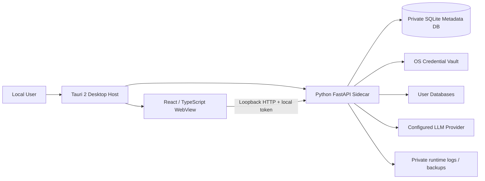
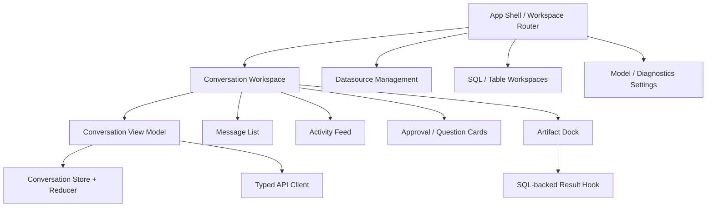
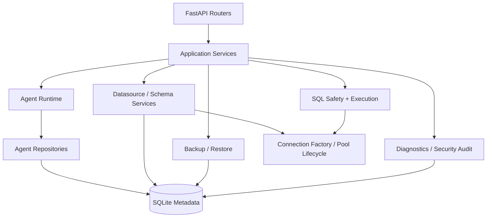
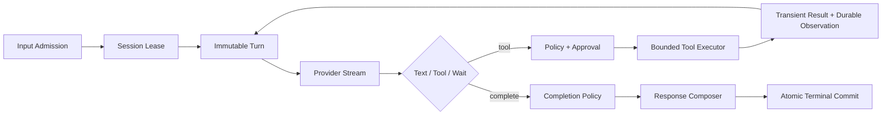
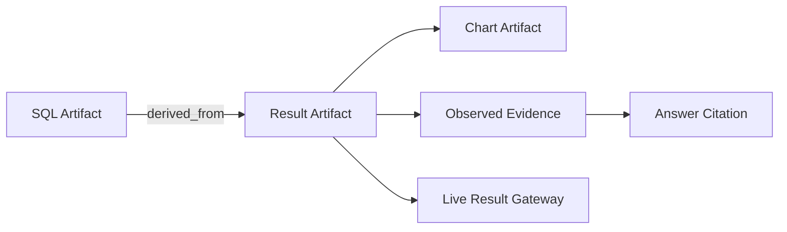

# DBFox 当前系统架构设计

> 文档状态：当前事实源
>
> 最后核验：2026-07-20
>
> 适用版本：当前工作分支，产品版本 1.0.2
>
> 评审口径：只描述当前唯一实现；历史 LangGraph Runtime、旧 Artifact payload 和旧前端协议不属于现行架构。

## 1. 文档用途与事实层级

本文用于产品架构评审、代码评审、故障分析和后续 AI 二次分析。阅读时必须区分四种信息：

| 标记 | 含义 |
|---|---|
| 已实现 | 当前代码、迁移和测试能够验证的行为 |
| 设计约束 | 新代码必须遵守，但不代表存在对应的未来能力 |
| 条件能力 | 只有出现真实产品需求后才实施，当前正确行为可能是拒绝 |
| 未闭环 | 已经是产品目标，但实现或验证仍不足 |

事实优先级为：当前代码与迁移 > 本文 > 专题设计文档 > 历史评审。修复前评审只解释“为什么这样改”，不能覆盖当前事实。

## 2. 产品定位与核心不变量

DBFox 是本地优先的 AI 数据库桌面客户端。它不是远程多租户 SaaS，也不是通用操作系统 Agent。核心目标是让用户以自然语言和 SQL 安全地分析自己的数据库，并获得：

- 可观察的分析过程；
- 可解释、可回到来源的答案；
- 以 SQL 和 Result Artifact 为中心的产品工件；
- 对数据库操作明确的权限、批准、取消和审计边界；
- 刷新、断流或进程重启后仍可恢复的会话事实。

系统必须长期保持以下不变量：

1. SQLite canonical tables 是 Agent 持久事实源；内存、SSE 和前端 Store 都不是。
2. 同一 Session 串行执行，不同 Session 可以并行。
3. Agent 使用自有显式 ReAct Harness，不使用 LangGraph graph/thread/state/checkpoint。
4. Result Artifact 不保存结果行；SQL 只存在于 SQL Artifact。
5. Evidence 保存少量已观察事实与 Artifact locator，不保存结果集。
6. 工具必须经过 Registry、物化、Policy、Approval 和有界执行，不允许模型直接调用任意函数。
7. 实时流可以丢失，committed state 不可以依赖实时流。
8. 凭据只保存于操作系统安全凭据库，元数据库只持有不透明 credential ID。
9. 不通过旧字段读取、双 Runtime 或静默 fallback 掩盖设计错误。

## 3. 部署拓扑

### 3.1 Tauri 桌面主机

Tauri 负责启动和监督 sidecar、分配本地端口、读取启动状态、向 WebView 提供端口与 local token，并处理原生窗口和外部导航。Windows 发布物要求 MSVC Rust 工具链；GNU host 会被显式拒绝，防止桌面二进制与 MSVC sidecar triplet 不一致。

### 3.2 React WebView

前端负责工作区、数据源设置、对话、Activity Feed、Approval/Question 交互和 Artifact Dock。它消费 snapshot、committed event 和 live notification，但不拥有 Run 终态、审批结果或结果集历史。

### 3.3 FastAPI Sidecar

本地引擎拥有业务规则、元数据库、数据库连接、SQL 安全链、Agent Runtime、事件投影、诊断和备份恢复。API 只监听 loopback，并用运行期高熵 token 校验请求。

### 3.4 远程 Web 边界

当前 Web 只是本地引擎的浏览器开发入口，不等于公网部署能力。远程服务化需要独立设计身份、租户隔离、集中密钥、任务调度、数据库连接代理和分布式事件通道，不能直接暴露现有 loopback API。

## 4. 前端架构

### 4.1 状态所有权

| 状态 | 前端载体 | 生命周期 | 是否可作为事实源 |
|---|---|---|---|
| Workspace tab、dock 展开状态、主题 | Workspace/UI Store | 本地 UI 生命周期，可选择持久化 | 否 |
| Conversation snapshot | Conversation Store | 当前会话缓存 | 否，后端 snapshot 才是权威 |
| committed event 投影 | Reducer | cursor 之后的增量 | 否，出现 gap 必须重载 snapshot |
| live token / activity delta | reducer 中短暂投影 | 当前连接 | 否，可丢失、可被 committed event 覆盖 |
| Result 当前页 rows | `useSqlBackedDataView` 组件状态 | 工件打开期间 | 否，不进入 Conversation Store/localStorage |
| 表格筛选、排序、分页 | 组件状态 | 当前视图 | 否 |

### 4.2 对话产品层

对话不是单一 Markdown 列表，而由四个并行产品区域组成：

- Message：用户输入与最终回答；回答支持 Markdown、GFM、sanitization 和 Evidence citation。
- Activity Feed：展示用户可理解的计划、分析、工具、恢复和完成过程，不展示原始调试日志或私有 chain-of-thought。
- Approval/Question：将等待状态作为正式交互，不用 Toast 或隐式重试替代。
- Artifact Dock：展示 SQL、安全检查、Result、Chart、Markdown 等交付物，并支持选择、折叠和按引用加载。

长对话超过阈值后使用虚拟列表。布局位置通过 nonce CSSOM 规则表达，避免 CSP 禁止的动态 inline style。Radix 负责 Dialog/Collapsible 等焦点和键盘交互，Lucide 提供统一图标。

### 4.3 事件归并

前端同时处理两类消息：

- committed event：带 Session sequence/cursor，可重放；
- live item：带稳定 live ID、channel revision 和 correlation，只负责低延迟。

Reducer 拒绝重复 revision；发现跳号或 stream 关闭后，重新获取 canonical snapshot，再从新 cursor 继续。live activity 必须能被后续 committed entity 以稳定 ID 合并，不能生成两份工具或回答。

### 4.4 Result 视图

打开 Result Artifact 后，前端只发送 Artifact ID 和视图参数。`useSqlBackedDataView` 为每次请求创建 AbortController，新请求会取消旧请求；卸载、关闭或禁用视图会释放当前页数据。响应明确显示：

- `consistency`；
- 原始观察时间；
- 当前视图执行时间和 execution ID；
- datasource generation 与 query fingerprint。

## 5. 后端模块架构

### 5.1 API 与中间件

API 统一挂载于 `/api/v1`。关键横切边界包括：

- loopback token 与 frozen Origin/Referer 校验；
- Agent 输入体积限制；
- Pydantic request/response schema；
- 固定错误码和用户安全消息；
- 不把数据库、Provider 或异常原文直接返回给前端。

### 5.2 数据源与连接生命周期

数据源元数据包含 `connection_generation`。任何影响连接的配置或 credential reference 更新都会推进 generation，并在提交后 fence/释放旧连接池和 SSH tunnel。旧 profile 无法在更新后重新创建可复用连接。

支持 MySQL、PostgreSQL、SQLite 和 DuckDB 的相应路径，但不同驱动的取消、只读和 Explain 能力由各自适配器表达，不假设完全一致。

### 5.3 Schema Catalog

Schema 同步从目标数据库内省表、列、主外键和索引，写入 canonical catalog，再构建搜索文档。Agent Context 只按需搜索/检查相关 Schema，不把全库结构一次性放入 Prompt。

### 5.4 SQL 安全与执行

SQL 请求依次经过方言解析、策略、只读/危险语句检查、projection/limit 约束、执行注册和结果序列化。QueryRegistry 为 SQLite、DuckDB、PostgreSQL 和 MySQL 提供各自可用的取消路径；无法硬中断的驱动仍受 deadline 和结算栅栏约束。

### 5.5 Result Gateway

Result Gateway 根据 Result Artifact ID：

1. 校验 Artifact 所属 Session/数据源；
2. 沿 `derived_from` 找到 SQL Artifact；
3. 读取唯一的安全 SQL；
4. 校验 fingerprint 和 datasource generation；
5. 编译分页、筛选、排序或导出 SQL；
6. 实时查询用户数据库；
7. 只将当前响应交给组件或当前 Agent Turn。

## 6. Agent Runtime

Agent 使用显式 ReAct 循环。详细设计见 [Agent Runtime 架构](./architecture/agent-runtime.md)。主链路如下：

关键组成：SessionCoordinator、RunLoop、RunControl、ContextAssembler、PromptAssembler、Model Adapter、Tool Registry/Executor、CompletionPolicy、ResponseComposer 和 Repository 集合。

复杂任务可选使用动态 Task Plan。Plan 是可版本化、用户可见的领域投影，不是固定工作流节点；同一时刻最多一个步骤为 in-progress，要求证据的 completed step 必须引用同 Session Artifact。

## 7. 持久化模型与事务

### 7.1 Canonical entities

| 类别 | 主要实体 | 作用 |
|---|---|---|
| 会话 | AgentSession、AgentSessionInput、AgentMessage | 输入顺序、消息、选择状态、Session Memory |
| 执行 | AgentRun、AgentTurn | 预算、取消、模型决策、终态 |
| 工具 | AgentToolInvocation、AgentObservationRecord | 授权输入、幂等、执行结算、持久摘要 |
| 交互 | AgentApproval、AgentQuestion | 正式暂停与恢复 |
| 产品 | AgentArtifactRecord、AgentEvidenceRecord、AgentTaskPlanRecord | 工件、结论证据、动态计划 |
| 事件 | AgentRuntimeEventRecord | committed 公共事件和 replay cursor |
| 安全 | SecurityAuditRecord | 批准、拒绝、取消、导出、清理等安全动作 |

### 7.2 SQLite single-writer

SQLite 忽略 `SELECT FOR UPDATE` 的行锁语义，因此 Agent 聚合写入先使用短 `BEGIN IMMEDIATE` 获得 writer reservation。sequence、lease token、run version、实体写入和 event append 在短事务中提交；LLM 调用和目标数据库查询永远不占用元数据库写事务。

### 7.3 Lease 与 fencing

Session lease 包含 owner、token 和过期时间。worker 只能使用当前 token 提交；过期 worker 即使继续运行也会在 Repository 边界被拒绝。启动恢复扫描未完成 Run，关闭残留 running Turn，然后依据持久工具状态决定继续、失败或 unknown。

### 7.4 终态原子性

Run 完成时在同一事务提交：最终 Message、Evidence、Session Memory delta、Artifact selection、Run terminal state 和 terminal events。这样不会出现回答存在但 Evidence 丢失、Memory 已写但 Run 失败等半完成状态。

## 8. 事件、Snapshot 与实时流

Runtime Event Log 是产品事件日志，不是外部消息 Outbox。事件类型必须在合同注册表中声明版本和 category，durable payload 递归拒绝 rows、previewRows、preview_rows 和 series。

Event Log 超过阈值后保留最近 2,000 条，并推进 `event_floor_sequence`。客户端 cursor 早于 floor 时 API 返回 `CONVERSATION_SNAPSHOT_REQUIRED`；客户端重新加载由 canonical tables 生成的完整 snapshot。Event Log 可以压缩，因为它不是唯一业务状态存储。

LiveStreamHub 是进程内低延迟通知通道。它不承诺跨进程保存 token；重连后的正确性由 snapshot + replay 保证。SSE 不使用固定 200ms 数据库主轮询。

## 9. Artifact、Evidence 与数据边界

Result Artifact 只保存来源 SQL Artifact ID、fingerprint、datasource generation、columns、row count、returned count、latency、executed time 和 truncated。明确禁止 rows、previewRows、任意单元格以及重复 safeSql。

当前 ReAct step 可以短暂看到有界 Tool Result 来完成分析；Durable Observation 只保存状态、摘要、Artifact IDs、列/行数、耗时、指纹和安全错误。下一轮上下文只注入 Artifact reference；需要数值时重新调用 inspect/query。

Evidence 可以保存少量明确结论值、维度 locator、Artifact ID、fingerprint 和 observedAt。Result 当前重查值与 Evidence 历史观察值可能不同，UI 必须表达这种时态差异。

## 10. 权限、安全与审计

### 10.1 Tool capability

工具显式声明 metadata/database/filesystem/network/subprocess capability 和 execution backend。当前 in-process backend 只接受 metadata read/write 与 database read。filesystem、任意 network、subprocess 和 database write 工具在没有 isolated-process backend 时拒绝注册，不能降级到进程内执行。

### 10.2 Approval

Policy 使用 canonical tool name 和授权后的输入判定风险。需要批准时持久化 Approval 并暂停同一个 Run。用户决定与 invocation/version/generation 绑定，不能批准后替换参数。批准、拒绝、取消和导出进入 SecurityAuditRecord。

### 10.3 Credential 与日志

密码、API key、SSH secret 只进入 OS credential vault。日志、事件、审计和错误都执行 secret-safe redaction。安全审计保留 90 天且最多 20,000 条；诊断包只含近 7 天最多 500 条，清理必须明确确认，清理动作本身继续留痕。

### 10.4 CSP 与外部导航

生产 WebView 使用严格 CSP。外部链接通过受控导航能力打开；Markdown 经过 AST 插件与 sanitize，不允许任意 HTML、脚本或协议进入 WebView。

## 11. 预算、取消和失败语义

RunControl 统一执行 deadline、turn count、tool invocation count、input/output/total token、cost、provider retry 和 repair budget。费用无法定价时按配置 fail closed，而不是把未知成本记为零。

取消贯穿 Run、provider stream、ToolExecutor、Result HTTP request 和数据库 QueryRegistry。取消请求不会把迟到结果结算为成功。ToolExecutor 还约束 timeout、retry、concurrency scope 和输出字节数。

失败按可证明程度分类：

| 情况 | 结算 |
|---|---|
| 模型流在无副作用前中断 | Turn failed，可按预算创建新 Turn |
| 只读幂等工具已知失败 | failed，可按策略重试 |
| 高风险工具被拒绝 | rejected，Agent 可选择安全替代方案 |
| 外部副作用结果无法证明 | unknown，不自动重放 |
| cursor 落后于 event floor | snapshot required |
| datasource generation 改变 | 明确要求重新执行来源 |

## 12. 性能与扩展性

- Session 内串行避免同一上下文的竞态，Session 间由 coordinator 并行。
- 元数据库 WAL 服务并发读取；写事务保持短小。
- Schema 按需检索，避免 Prompt 随数据库规模线性增长。
- Result 分页/筛选/导出直接查询来源数据库，不复制大结果到元数据库。
- 长对话使用虚拟列表，Chart 与重型视图延迟加载。
- 新工具通过 Registry 扩展，新 Provider 通过 Adapter 扩展，新 Artifact 通过描述符与 renderer 扩展；RunLoop 不按工具名硬编码分支。

## 13. 构建、供应链与发布

Python sidecar 由 `build_sidecar.py` 构建，前端由 TypeScript/Vite 构建，桌面安装包由 Tauri/Rust 构建。工程门禁包括：

- 官方 npm registry 与 lock integrity；
- Node/Python/Rust CycloneDX SBOM；
- license gate 和漏洞审计；
- frontend bundle budget；
- Windows/macOS/Linux 候选构建矩阵；
- Alembic 单一 head 与完整迁移链测试。

本机当前只有 Windows GNU Rust toolchain 且缺 `dlltool.exe`，而项目要求 Windows MSVC。因此本机不能提供最终 Tauri Clippy/test 发布证据；正确做法是由 Windows MSVC CI 验证，不放宽工具链契约。

## 14. 测试与当前证据

最后一次完整回归：

- Backend：913 passed，2 skipped；随后新增审计确认专项通过；
- Frontend：76 files / 411 tests passed；随后诊断 API 专项 5 passed；
- mypy：277 source files / 0 issues；
- ESLint、production build、bundle budget：通过；
- Alembic：单一 head `e9f0a1b2c3d4`；
- `git diff --check`：通过。

测试覆盖正常路径、事务并发、lease fencing、事件 gap、provider contract、取消、工具预算、Artifact 数据边界、CSP、前端 reducer、Activity/Approval/Result 交互和供应链合同。

## 15. 条件能力与仍需增强的边界

以下项目不能被误写为当前已有能力：

1. 高权限 isolated-process backend：只有加入文件、任意网络、子进程或写库工具时才实现；当前拒绝注册是正确行为。
2. Provider Route：当前是用户选择的单 OpenAI-compatible adapter；多模型路由、成本优先级和降级披露需要独立领域模型。
3. 评测纵深：仍需扩展 Prompt Injection corpus、cancel latency、crash point、Evidence coverage 和成本/质量联合评分。
4. 远程 Web：需要独立服务端架构，不复用本地 token、SQLite 和 LiveStreamHub 假装可扩展。
5. 发布签名、商店凭据和自动更新：属于发布环境能力，不能仅靠源码测试证明。

## 16. 关键文件索引

| 领域 | 当前入口 |
|---|---|
| 桌面生命周期 | `desktop/src-tauri/src/lib.rs`、`desktop/src/components/EngineStartupGate.tsx` |
| 前端对话 | `desktop/src/features/conversation/workspace/ConversationWorkspace.tsx` |
| 前端状态归并 | `desktop/src/stores/conversationStoreReducer.ts` |
| Activity / Artifact | `ActivityFeed.tsx`、`ArtifactDock.tsx` |
| Result 当前页 | `desktop/src/features/workspace/sqlBacked/useSqlBackedDataView.ts` |
| API | `engine/api/__init__.py`、`engine/api/conversations.py`、`engine/api/agent.py` |
| Agent Harness | `engine/agent/coordinator.py`、`engine/agent/loop.py` |
| Agent persistence | `engine/agent/repositories/` |
| Tool Runtime | `engine/tools/runtime/` |
| Result Gateway | `engine/sql/result_view/service.py` |
| Security Audit | `engine/security/audit.py` |
| Metadata schema | `engine/models.py`、`engine/migrations/` |
