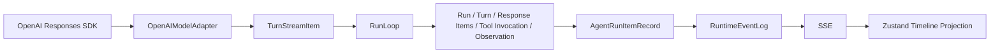

# Agent Runtime Item 协议

> 文档类型：规范参考
>
> 状态：当前
>
> 最后核验：2026-08-06
>
> 适用范围：Provider 响应项、Agent 运行项、SSE 事件和前端投影

本文描述 DBFox 当前生产实现。历史方案见[历史设计](../archive/designs/README.md)，不得作为运行时合同。

## 1. 权威数据链路



- OpenAI SDK 的 typed Responses events 是 Provider 边界；不解析文本形式的 Thought/Action/Observation。
- `OpenAIModelAdapter` 只负责校验 SDK 事件生命周期并转换为 provider-neutral `TurnStreamItem`。
- `RunLoop` 是唯一循环协调者，直接消费模型流、调用工具并决定继续或终止。
- 数据库中的 Run、Turn、原生 Response output Items、Tool Invocation、Observation、Artifact、Approval、Question 和 Plan 是真相源。
- `AgentRunItemRecord` 是面向产品的耐久投影；`RuntimeEventLog` 记录投影变化并为 SSE 恢复提供 sequence 游标。
- 前端只投影 Timeline，不参与驱动 Agent Loop，也不作为后端恢复依据。

## 2. Responses Items 与产品 RunItem

模型一轮的原生 output Items 按完整响应批次保存在 `AgentTurn.response_items_json`，后续 ContextSnapshot 直接复用，不重新拼装一套消息历史。产品 Timeline 使用独立但唯一的公开 RunItem 联合类型：

| RunItem type | 用途 | 关键身份 |
|---|---|---|
| `message` | 用户输入、assistant commentary、assistant final answer | item ID；assistant message 带可选 `phase`、`output_index` 和 stream item ID |
| `function_call` | 工具请求、参数、版本和展示信息 | invocation ID 与 provider `call_id` |
| `function_call_output` | 模型可见输出、摘要、错误和 Artifact 引用 | 与调用相同的 `call_id` |
| `plan` | 多阶段任务的耐久计划 | plan ID 与 version |
| `approval` | 高风险动作的审批中断及决定 | approval ID 与 version |
| `question` | 缺少必要信息时的用户输入中断 | question ID 与 version |

Assistant `message.phase` 是 Provider 提供的可选提示；非空时只允许：

- `commentary`：适合用户阅读的进度说明或公开 reasoning summary；
- `final_answer`：本次 Run 的正式终态回答。

`phase=null` 不是协议错误，也不能由 Adapter 伪造为 `final_answer`。当 Turn 以
`completed` 正常终止、存在非空可展示文本、没有待处理工具调用或继续控制信号，
且流没有中断/协议错误时，无 phase 的消息可以成为最终回答候选。显式
`final_answer` 优先，`commentary` 永不作为最终回答。

不公开私有 chain-of-thought。Provider 的 reasoning summary 只有在适合用户阅读时才投影为 commentary。

每个 RunItem 都有稳定 `id`、`session_id`、`run_id`、可选 `turn_id`、`sequence`、`revision`、`status`、创建时间和完成时间。客户端以 ID 合并、以 revision 拒绝旧更新、以 sequence 排序。

## 3. 工具调用合同

一次工具交互由两个独立 Item 表示：

1. `function_call` 持久化模型给出的 `call_id`、规范工具名、Contract 版本、严格验证后的 arguments 和展示元数据；
2. 执行完成后写入 Observation，并产生使用同一 `call_id` 的 `function_call_output`。

耐久输出 Item 的 `output` 是可恢复的 JSON 摘要，`summary` 是用户可读摘要，较大结果通过 `artifact_refs` 引用。数据工具还可以为当前 Run 生成一个有硬上限的瞬时观察窗口；Prompt 组装时以相同 `call_id` 将它回传给模型，但不得把行值写入 Observation、Artifact、Turn snapshot 或 Session Memory。进程恢复后模型通过 Artifact ID 和 `result_inspect` 重新读取所需页。完整边界见 [Agent Tool、Context 与 Memory 边界合同](./agent-tool-context-memory-contract.md)。工具不得绕过 Registry、Policy、审批、超时、幂等和 Contract 指纹。SQL 执行必须引用已验证的 SQL Artifact，不接受新的裸 SQL。

`request_clarification` 与 `update_plan` 是 Runtime Control Command：它们分别写 Question 和 Plan 状态，不伪装成普通数据库工具。

## 4. 耐久事件与实时增量

耐久事件只有两组：

- Run 生命周期：`run.started`、`run.updated`、`run.completed`、`run.failed`、`run.cancelled`；
- RunItem 生命周期：`run.item.started`、`run.item.updated`、`run.item.completed`、`run.item.failed`、`run.item.cancelled`。

事件 envelope 使用 Session 单调递增的 `sequence`，并携带 `event_id`、`event_version`、Session/Run/Turn 身份、时间和 payload。EventRepository 是事件日志和 RunItem 投影写入的唯一入口；领域状态与对应事件必须在同一数据库事务中提交。

文本流使用非耐久的 `run.item.delta`：

```text
session_id, run_id, turn_id?, item_id, item_type,
field="content", revision, offset, content
```

delta 只能追加到已经开始的耐久 Item。`offset` 必须等于客户端当前文本长度；revision 低于当前值的增量被丢弃。断线恢复不回放 delta，而是先读取 snapshot 中的完整持久内容，再从 durable event cursor 继续。

## 5. Snapshot、恢复与上下文

Conversation snapshot 返回 protocol version、Runs、RunItems、游标和分页信息。恢复流程为：

1. 从数据库读取 snapshot；
2. 前端以 snapshot 替换本地耐久投影；
3. 从 snapshot cursor 之后订阅 SSE；
4. 按 event ID 去重、sequence 排序、RunItem ID/revision 合并；
5. gap 超出保留窗口时重新获取 snapshot。

后端恢复每一轮时从数据库真相源重建 ContextSnapshot。裁剪以完整模型响应批次为单位，不能拆散 `function_call` 与对应 `function_call_output`，也不能用前端状态或进程内缓存补写历史。

## 6. 终态与不变量

- 一个 Session 同时最多有一个活跃 Run；Coordinator 只负责进程内执行租约和唤醒，不是持久状态源。
- 一个模型响应可以产生 commentary、零个或多个 function calls；存在工具调用时，工具结果加入下一轮上下文后继续循环。
- Turn 的 provider-neutral 终止值是封闭枚举 `completed | incomplete | failed | cancelled`；必须恰好收到一次末尾终止事件，只有 `completed` 能进入完成判断。
- 没有工具调用或继续控制信号，并且存在符合上文规则的最终回答候选时，Run 才进入成功终态；`phase` 不是所有 Provider 的必需能力。
- Approval、Question、取消、失败和 lease loss 均先持久化，再向前端发布对应事件。
- 同一职责只有一个公开合同：不存在 `answer.completed`、`activity.updated`、旧 tool 名称映射或第二套自定义聊天消息协议。

## 7. 代码事实源

- SDK 事件适配：`engine/agent/providers/openai.py`
- Turn stream 组装：`engine/agent/turn.py`
- 循环：`engine/agent/loop.py`
- RunItem Schema 与投影：`engine/agent/run_item.py`
- 事件与投影持久化：`engine/agent/repositories/events.py`
- Context 重建：`engine/agent/context.py`
- SSE：`engine/api/conversation_stream.py`
- 前端投影：`desktop/src/stores/conversationStoreReducer.ts`

协议变更必须先修改这些权威类型和专项测试，再重新生成 OpenAPI SDK；不允许用别名、映射或兼容分发器掩盖不一致。
