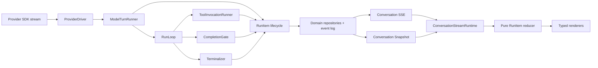

# DBFox Agent Canonical RunItem 架构

> 状态：重构目标合同  
> 日期：2026-07-26  
> 原则：单协议、单身份、单状态来源、前后端原子切换

## 1. 架构决定

DBFox 使用一套 canonical `RunItem` 合同表达用户消息、公开分析摘要、动态计划、工具调用、
审批、提问和最终回答。

```text
Session
  └─ Run
      ├─ user_message
      ├─ reasoning_summary
      ├─ plan
      ├─ tool_call
      ├─ approval
      ├─ question
      └─ answer
```

这不是兼容层，也不是在现有 Activity 上再包一层 DTO。重构完成后：

- 公共 API 不再返回 `messages + turns + activities + approvals + questions` 多套并行结构；
- Snapshot 只返回 `runs + items`，Artifact/Evidence 独立按引用加载；
- SSE 只发送 Run、RunItem 和连接生命周期事件；
- 前端 Store 只保存 `RunItem`，不再把不同事件翻译成 Activity；
- 不保留旧事件名、旧字段、旧 reducer 或 v1 → 新协议适配器；
- 后端和 Desktop 必须作为一个版本整体切换。

## 2. 设计依据

Codex App Server 使用 Thread → Turn → Item，并为 Item 提供
`item/started → item-specific delta → item/completed` 生命周期。Agent message、
reasoning、plan 和 command/tool 是不同 Item，不依靠 UI 判断文本含义。

OpenCode 也将 text、reasoning 和 tool 保存为不同 typed part，并显式维护工具状态。

DBFox 采用这一状态边界，同时保留：

- `plan_update` 动态计划；
- SQL 安全、审批和授权；
- Artifact、Evidence 与回答引用；
- Session lease、Run 恢复和 SSE gap 恢复；
- Completion Evidence Gate。

参考：

- [Codex App Server Item 协议](https://github.com/openai/codex/blob/main/codex-rs/app-server/README.md)
- [Codex Protocol Task/Turn 边界](https://github.com/openai/codex/blob/main/codex-rs/docs/protocol_v1.md)
- [OpenCode typed session parts](https://github.com/anomalyco/opencode/blob/dev/packages/opencode/src/session/processor.ts)

## 3. 唯一运行链路



只有两个架构边界：

1. `ProviderDriver`：把 Provider SDK 流转换为 DBFox 的强类型模型信号；
2. Conversation API：把 canonical RunItem 原样序列化为 Snapshot/SSE。

除此之外不增加路由层、别名层、Activity 投影层或兼容层。

## 4. ProviderDriver 合同

所有 ProviderDriver 必须实现同一个 `ModelStreamEvent` discriminated union：

```python
ModelStreamEvent =
    AnswerStarted
    | AnswerDelta
    | AnswerFinished
    | ReasoningSummaryStarted
    | ReasoningSummaryDelta
    | ReasoningSummaryFinished
    | ToolCallStarted
    | ToolCallArgumentsDelta
    | ToolCallFinished
    | UsageReported
    | ModelFinished
    | ModelFailed
```

规则：

- 不存在 `TEXT_DELTA`；
- 不存在字符串 `channel`；
- 每个 start/delta/finish 使用同一个稳定 `model_item_id`；
- 原始 chain-of-thought 不属于合同，Driver 必须丢弃；
- 只有 Provider 明确标记为公开摘要的内容才能成为 `ReasoningSummary*`；
- Provider 原生区分回答时，Driver 可以逐 token 发送 `AnswerDelta`；
- Provider 不能区分普通文本和工具前文本时，Driver 必须缓冲整个模型 Turn；
- 缓冲 Turn 出现 tool call 时，普通文本不得产生 `Answer*`；
- 缓冲 Turn 没有 tool call 时，Driver 在 Turn 结束后发送一次完整 Answer；
- 不使用关键词、XML 标签、时间窗口、字符长度或首个 chunk 猜测类型；
- 不使用完成后的打字动画伪造流式。

Runtime 不读取 Provider 能力开关，也不包含 Provider 分支。Driver 满足合同，否则不能注册。

## 5. Canonical RunItem 合同

```python
class RunItemType(StrEnum):
    USER_MESSAGE = "user_message"
    REASONING_SUMMARY = "reasoning_summary"
    PLAN = "plan"
    TOOL_CALL = "tool_call"
    APPROVAL = "approval"
    QUESTION = "question"
    ANSWER = "answer"


class RunItemStatus(StrEnum):
    PENDING = "pending"
    IN_PROGRESS = "in_progress"
    WAITING = "waiting"
    COMPLETED = "completed"
    FAILED = "failed"
    CANCELLED = "cancelled"
```

公共 envelope：

```json
{
  "id": "invocation_...",
  "type": "tool_call",
  "session_id": "session_...",
  "run_id": "run_...",
  "turn_id": "turn_...",
  "sequence": 7,
  "revision": 3,
  "status": "in_progress",
  "created_at": "2026-07-26T10:00:00Z",
  "completed_at": null,
  "payload": {}
}
```

约束：

- `id` 由领域实体提供，前端不拼接或解析 ID；
- `sequence` 是同一 Run 内唯一排序依据；
- `revision` 对同一个 Item 单调递增；
- `payload` 按 `type` 使用编译期可穷举的 discriminated union；
- Snapshot 与 SSE 使用完全相同的 Item 结构；
- 未知 Item 类型属于合同错误，不使用通用 Activity 兜底；
- Item 状态由其领域 owner 写入，前端不能重新推断。

## 6. 状态所有权

不创建通用 `agent_run_items` 表，避免复制现有领域状态。每个 Item 只有一个 canonical owner：

| RunItem | Canonical owner | Item ID |
|---|---|---|
| user_message | `AgentMessage(role=user)` | message ID |
| reasoning_summary | `AgentTurn` | turn ID |
| plan | `AgentTaskPlanRecord` | plan ID |
| tool_call | `AgentToolInvocation` | invocation ID |
| approval | `AgentApproval` | approval ID |
| question | `AgentQuestionRequest` | question ID |
| answer | `AgentMessage(role=assistant)` | message ID |

每个 owner 的 Repository 实现自己的 `public_item()`，返回 canonical `RunItem`。Repository
在写入 owner 的同一事务中把这个 Item 写入事件日志。Snapshot 调用同一个
`public_item()`，不存在第二套 Projector。

ToolInvocation 是 Tool Item 身份和状态的唯一 owner。Observation 是完成后的不可变执行
证据，只通过 `observation_id` 被 Invocation 引用；它不再生成第二个产品 Activity，也不拥有
Tool Item 状态。

`public_item()` 只允许结构序列化：

- 不根据工具名选择标题；
- 不根据用户文本选择类型；
- 不把领域状态转换成另一套近义状态；
- 不生成“已完成分析”等推测性摘要；
- 不为前端拼装 `activity:*` 身份。

## 7. 工具展示合同

工具的产品信息属于 Tool 定义：

```python
class ToolPresentation(BaseModel):
    title: str
    category: Literal["explore", "query", "visualize", "manage"]
    visibility: Literal["summary", "details", "developer"]
    progress: Literal["indeterminate", "determinate", "none"]
```

`ToolPresentation` 随 Tool Materialization 冻结到 Invocation。Tool Item 直接携带冻结后的
presentation，删除后端 `_tool_activity_title(tool_name)`、前端 `toolLabel(toolName)` 和
所有工具名映射。

Tool payload：

```text
tool_id
presentation
input_summary?
output_summary?
artifact_refs[]
error?
```

Input/output summary 由工具自己的 typed result 定义产生，不能公开完整结果行、凭据、
异常栈或内部安全对象。

## 8. 事件合同

公共事件只有：

```text
run.started
run.updated
run.item.started
run.item.updated
run.item.delta
run.item.completed
run.item.failed
run.item.cancelled
run.completed
run.failed
run.cancelled
stream.gap
```

规则：

- durable event：started、updated、completed、failed、cancelled；
- ephemeral event：delta；
- 所有 Item 事件携带完整 session/run/turn/item identity；
- `run.item.completed` 携带完整最终 Item，是该 Item 的权威状态；
- 高频 token 不进入 durable event log；
- answer Item 完成、Evidence、Memory delta 和 Run completed 在同一事务提交；
- Run completed 没有 completed answer Item 时属于合同违规；
- 不存在 `answer.completed`、`plan.updated`、`tool.completed` 等并行别名事件。

Delta：

```json
{
  "event": "run.item.delta",
  "session_id": "session_...",
  "run_id": "run_...",
  "turn_id": "turn_...",
  "item_id": "message_...",
  "item_type": "answer",
  "revision": 9,
  "offset": 128,
  "field": "content",
  "content": "……"
}
```

允许流式更新的字段在 schema 中穷举：

- answer：`content`
- reasoning_summary：`sections[n].text`
- tool_call：`progress_text`

不存在任意字符串 channel。

## 9. Answer 与 Completion Gate

```text
AnswerStarted
  → AnswerDelta*
  → AnswerFinished
  → CompletionGate
      ├─ accept → terminal transaction
      └─ reject → item.cancelled → next Turn
```

- answer delta 是 provisional 状态，但拥有正式 assistant message ID；
- Gate 接受后使用同一 ID 完成 Item，不创建第二条消息；
- Gate 拒绝后标记 cancelled，不写入 Session History 或 Memory；
- cancelled answer 默认不在产品 Transcript 展示，只保留开发者 Trace；
- ProviderDriver 无法安全流式时，完整 Answer 在 Gate 接受后一次出现；
- Prompt 只能影响模型行为，不能承担回答分类或完成正确性。

## 10. Snapshot、SSE 与恢复

Snapshot：

```json
{
  "session": {},
  "runs": [],
  "items": [],
  "cursor": 0,
  "pagination": {}
}
```

公共 Snapshot 不再返回 `messages`、`turns`、`activities`、`approvals`、`questions`
等重复集合。用户消息和回答也是 Item。

重连顺序：

```text
snapshot → committed replay → live subscribe
```

Reducer 接受 delta 的必要条件：

1. session/run/item identity 完全匹配；
2. Item 已由 Snapshot 或 `run.item.started` 建立；
3. revision 大于本地 revision；
4. append offset 等于本地字段长度；
5. Run 和 Item 都未终态。

cursor、revision 或 offset 出现 gap 时清空该 Session 的 live buffer，重新加载 Snapshot。
completed Item 覆盖临时 buffer；其后到达的 delta 一律丢弃，不补播动画。

## 11. 前端架构

```text
ConversationStreamRuntime
  └─ snapshot / replay / live / reconnect / gap
      └─ pure RunItem reducer
          ├─ Transcript selector
          ├─ Activity selector
          ├─ Artifact reference selector
          └─ Developer Trace selector
```

Store 只保存：

- sessions；
- runs；
- itemsById；
- itemOrderByRun；
- artifacts/evidence 的按需缓存；
- stream cursor/revision。

不保存 `activities` 派生副本。Selector 按 Item type 选择展示位置：

- `user_message`、`answer` → Transcript；
- `reasoning_summary`、`plan`、`tool_call`、`approval`、`question` → Activity；
- Artifact/Evidence → 独立 Dock 和引用导航。

Renderer 按 Item type 穷举：

- `UserMessageRenderer`
- `AnswerRenderer`
- `ReasoningSummaryRenderer`
- `PlanRenderer`
- `ToolCallRenderer`
- `ApprovalRenderer`
- `QuestionRenderer`

展示规则：

- admission 成功立即插入 user_message Item，不等待 SSE；
- 当前 active Item 突出，历史过程折叠；
- Plan 只有真实 Item revision 变化才更新步骤；
- reasoning summary 为空时不创建 Item；
- 原始 reasoning、model draft、Turn start/finish 不生成 UI 卡片；
- Run 完成后 Activity 降权，Answer 与核心 Artifact 成为主视觉；
- 普通进度使用 `aria-live="polite"`，错误使用 `role="alert"`，更新不抢焦点。

## 12. Artifact 与 Evidence

Artifact 不是 RunItem。Item 只引用 Artifact：

```json
{
  "artifact_id": "artifact_...",
  "role": "primary",
  "relation": "produced",
  "label": "查询结果"
}
```

- primary：Result、Chart、正式 Markdown，可进入 Dock；
- supporting：SQL，只从数据来源入口打开；
- internal：Safety、诊断、内部计划，不进入产品 UI；
- Evidence 点击定位其直接引用的 primary Artifact；
- Item、引用和 Dock 共享同一个 Artifact ID，不复制 Artifact；
- 引用 SQL 不得自动展开一个无关 SQL 控制台。

## 13. 产品活动与开发者 Trace

RunItem 是用户可见的稳定工作单元；Span 是开发者可观测性，两者不能互相代替。

```text
Run Span
  └─ Turn Span
      ├─ Model Span
      ├─ Tool Span
      ├─ Policy / Approval Span
      └─ Terminalizer Span
```

Span 通过 ID 关联 Item，但不会自动生成 Activity。产品 UI 不展示：

- 原始模型事件；
- token、重试和内部策略细节；
- “已确定下一步动作”等无事实来源文案；
- 工具次数形成的伪进度；
- 上一个 Run 的任何迟到内容。

## 14. 原子切换方案

这次重构不采用双写、双读或兼容适配：

1. 在一个变更集中完成 ProviderDriver、RunItem、Repository event、Snapshot、SSE、
   Stream Runtime、Reducer 和 Renderer；
2. 删除旧 `LiveDelta.channel`、`activities`、旧 event type、旧 reducer 分支和工具名映射；
3. 更新所有后端、前端和端到端测试；
4. 打包前终止或取消所有 active Run；
5. 清理不可恢复的旧 runtime event/delta 游标；canonical message、answer、Artifact 和
   Evidence 仍由各自领域表保存并通过新的 `public_item()` 读取；
6. Backend 与 Desktop 同一版本发布；
7. 不保留回退到旧协议的运行路径。需要回退时回退整个应用版本和数据库迁移。

任何阶段只要仍需要同时维护 `activities` 与 `items`，就不算完成。

## 15. 验收合同

### 架构验收

- Runtime 中不存在 `TEXT_DELTA → answer` 通用路径；
- 公共 Snapshot 只有 `runs + items`；
- 前端 Store 不存在独立 activities 集合；
- Runtime 和前端都不存在工具名 → 展示文案映射；
- 不存在 v1 event、alias event 或 compatibility reducer；
- 一个领域实体只产生一个 Item ID；
- 一个 Item 状态只有一个 owner；
- Artifact 不复制为 Item。

### 行为验收

1. 模型先输出普通文本再发 tool call，普通文本不会进入 Answer；
2. typed Answer 实时流式显示，完成后不补播；
3. 无法安全区分的 Provider 输出原子显示，不伪造流式；
4. Gate 拒绝的 Answer 不进入历史、记忆和刷新后的 Snapshot；
5. 用户提交后立即显示 user_message；
6. 上一个 Run 的迟到 delta 不修改当前 Run；
7. 重复、乱序和 gap delta 不产生重复文本；
8. reconnect 后 Item 不重复、不倒退；
9. completed Item 拒绝后续 delta；
10. Plan、Tool、Approval、Question 各只显示一次；
11. Safety/supporting Artifact 不进入主 Dock；
12. Evidence 打开正确 primary Artifact；
13. completed Run 必须拥有 completed Answer；
14. lease lost、cancel、queue overflow、provider disconnect 后可恢复；
15. UI 不展示空 reasoning、原始 chain-of-thought、假进度或失败草稿；
16. 键盘、焦点和实时状态通过无障碍测试。

## 16. 明确禁止

- 关键词 TaskClassifier；
- Prompt 标签解析类型；
- Provider capability 路由；
- v1 → 新协议兼容 Adapter；
- 双写 `activities + items`；
- `answer.completed` 等别名事件；
- 通用字符串 channel；
- 工具名硬编码；
- 前端从文案推断状态；
- current-turn draft 产品展示；
- typewriter 补播；
- 全量 Artifact 自动进入 Dock；
- 原始 chain-of-thought 进入客户端。
