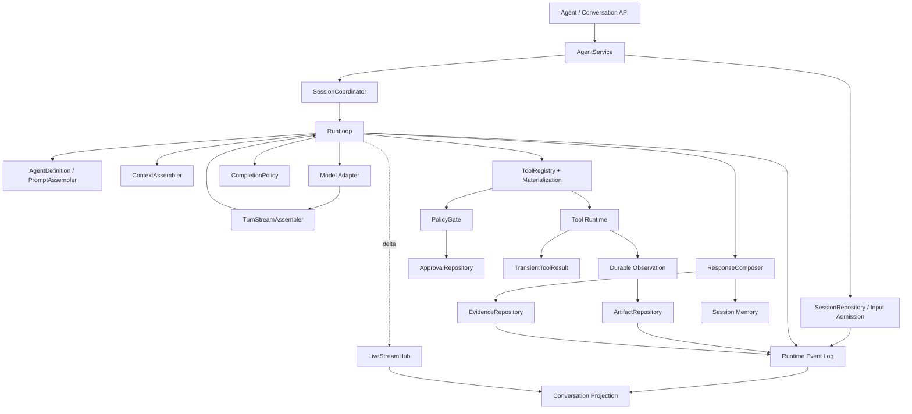
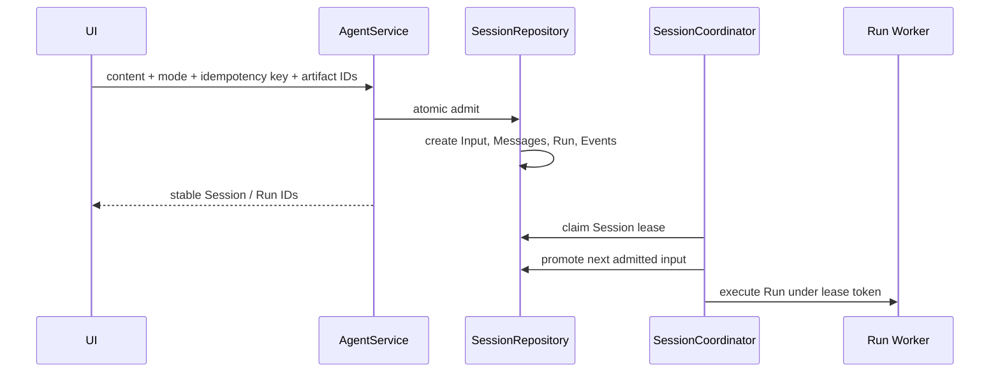
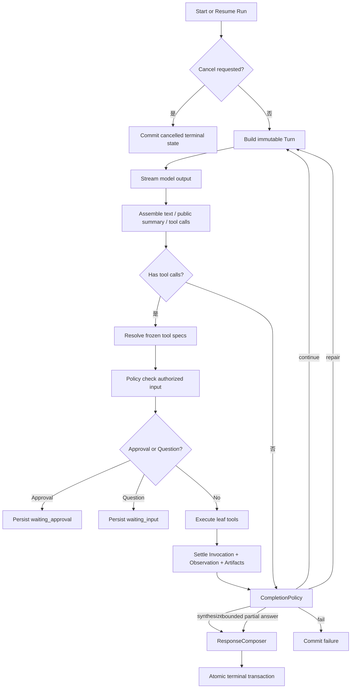
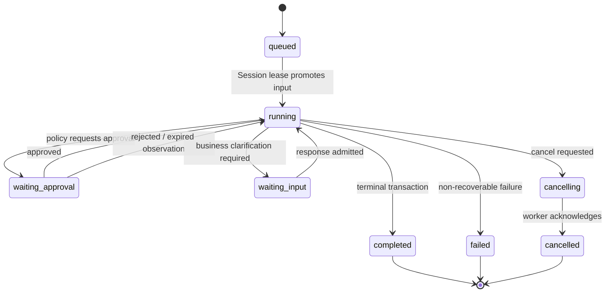
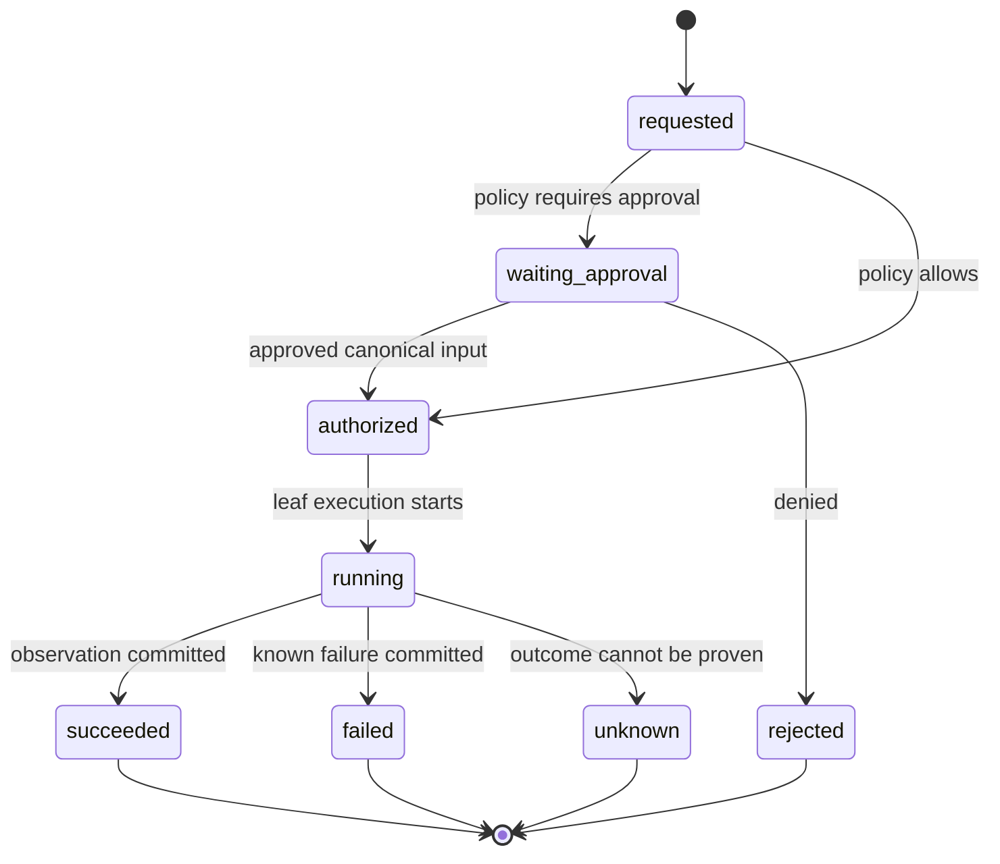
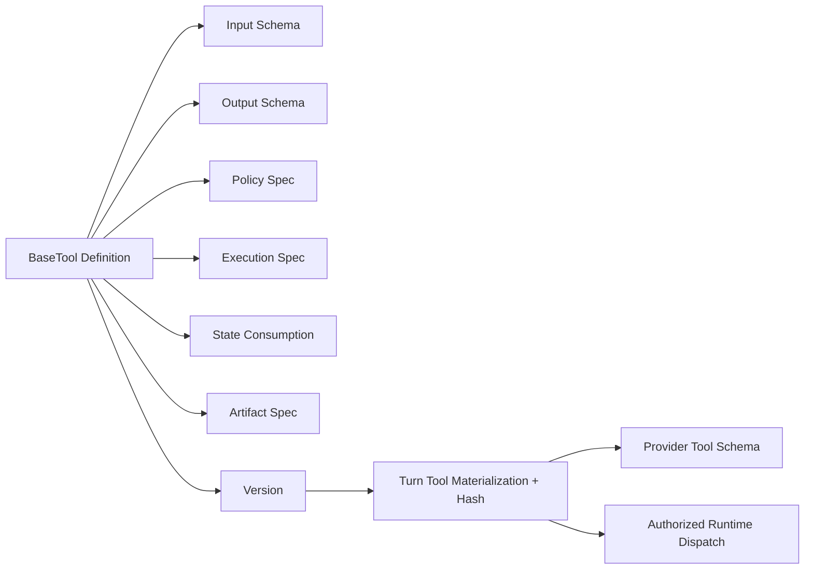
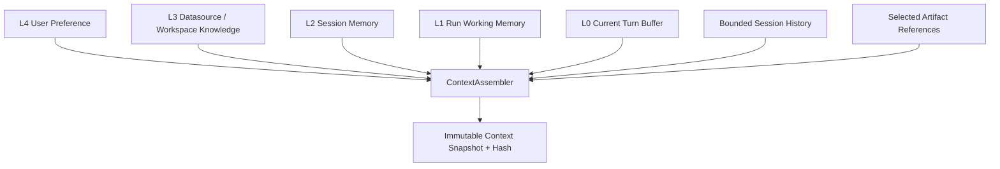
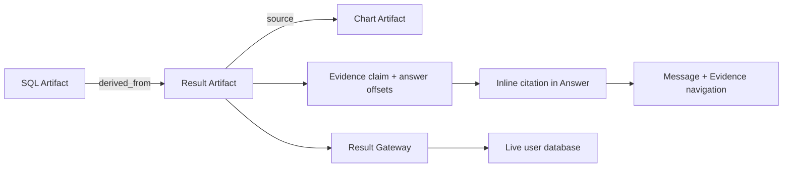
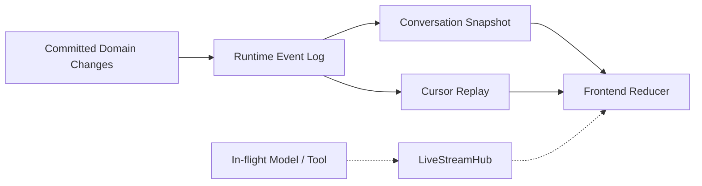
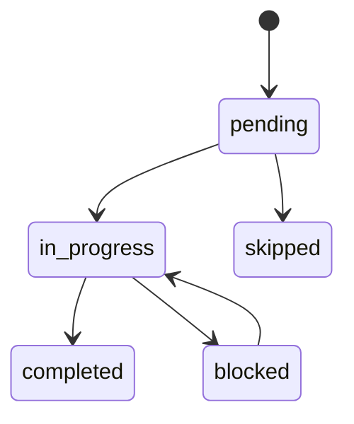

# DBFox Agent Runtime 架构

> 文档状态：当前 Agent 专题事实源
> 最后核验：2026-07-20
> 代码边界：`engine/agent/`、`engine/tools/runtime/`、`engine/agent/repositories/`

## 1. 架构决定

DBFox Agent 使用自有显式 ReAct Harness，不使用 LangGraph 的 Graph、Thread、State 或 Checkpoint。流程由普通领域对象、持久状态机、Repository 和事件协议表达，因此每个中断、工具结算、事务和产品事件都有明确所有者。

参考 OpenCode 的是 Harness 思想：显式循环、工具物化、事件驱动 UI、可中断输入和持久事实；保留 DBFox 自己的数据分析 Prompt、数据库安全链、Evidence、Reference-only Artifact 和 Result Gateway。

## 2. 模块架构



## 3. 聚合与状态所有权

| 聚合/实体 | 职责 |
|---|---|
| Session | 输入顺序、消息顺序、事件顺序、当前选中工件、lease 所有权 |
| SessionInput | 一次接纳的用户输入及 delivery mode、幂等键、消费状态 |
| Run | 一次目标的生命周期、预算、focus、取消和终态 |
| Turn | 一次模型决策；冻结 Prompt、Context 和 Tool Materialization |
| ToolInvocation | 一次工具意图、授权输入、执行和结算状态 |
| Observation | 工具执行后的持久摘要和 Artifact 引用 |
| Artifact | 产品交付物描述和关系，不保存任意结果行 |
| Evidence | Answer claim 到 Artifact 的来源绑定 |
| Approval | 高风险 Invocation 的版本化批准决定 |
| Question | 无法从数据解决的业务澄清请求 |

Session 是并发所有者：同一 Session 同时只有一个有效 worker lease；不同 Session 可以并行运行。旧 worker 的提交必须被 lease token 拒绝。

## 4. 输入接纳与调度



Delivery mode 语义：

- `queue`：创建后续 Run，不影响当前 Run；
- `steer`：在当前 Run 的 Turn 边界消费，改变后续分析方向；
- `respond`：回答当前 Question，并恢复原 Run；
- `cancel_and_replace`：请求当前 Run 取消，再接纳替代目标。

排队中的未来输入不得进入当前 Run 的 Context。

## 5. 显式 ReAct 循环



Provider 的 finish signal 不是最终完成权。Runtime 继续检查：

- 工具是否全部结算；
- 任务类型要求的 Result Artifact 是否存在；
- 复杂分析是否完成覆盖复核；
- 数据事实是否带有效 Artifact 引用；
- 预算是否耗尽以及能否交付部分结果。

## 6. Run 状态机



waiting 状态是持久实体，不依赖进程内 Promise/Future。批准、拒绝或回答后恢复同一个 Run，而不是创建隐藏的新执行链。预算耗尽但存在可验证工作时，CompletionPolicy 可生成带限制说明的 partial answer；持久 Run 仍以 `completed` 结算，因为 `partial` 是回答质量语义，不是当前 RunStatus。

## 7. ToolInvocation 状态机



恢复策略由工具定义：

- 只读、幂等且可重放的工具可使用原 Invocation ID 重试；
- 有外部副作用且无幂等证明的工具不得自动重放；
- 无法证明结果时结算为 `unknown`，由产品请求用户处理。

## 8. 工具定义与物化



一个 Turn 使用冻结的工具 schema 和版本 hash。恢复时必须重用同一物化快照，不能静默切换到新实现。

## 9. Context 与分层记忆



边界：

- L0 可以短暂包含当前工具结果，Turn 结束后释放；
- L1 保存缺失项、预算、Observation 和 Artifact 引用；
- L2 保存有界历史摘要、工作集、未解决问题和最近工件引用；
- L3 按需通过工具读取 Schema、索引和可复用 SQL，不全量注入；
- L4 只保存用户偏好，不保存数据库事实或凭据；
- 所有持久层都禁止结果行和任意敏感单元格副本。

## 10. Artifact、Evidence 与回答



ResponseComposer 只接受当前 Run 产生且可验证的 Result Artifact 引用。最终事务同时提交 Answer Message、Evidence、Memory delta、Run terminal state 和 terminal Events，避免“有回答无证据”或“记忆提前写入”。

## 11. 事件与实时流



- Event Log 是可恢复的唯一公共事实源；
- LiveStreamHub 只提供低延迟 token、公开 reasoning summary 和工具进度；
- live item 必须有稳定 identity，能够被后续 committed event 合并；
- reconnect 顺序是 snapshot → replay → live；sequence gap 触发 snapshot reload；
- 不使用固定 200ms 数据库轮询作为主流式机制。

## 12. 扩展边界

- 新模型提供商实现统一 Model Adapter，输出规范化 `TurnStreamItem`。
- 新工具通过 Registry 注册完整定义，不向 RunLoop 增加工具名判断。
- 新完成策略进入版本化 `AgentDefinition.TaskPolicy`，不增加固定流程节点。
- 新 Artifact 定义描述符、关系、Evidence 定位和前端 renderer，不保存结果副本。
- 新 Activity 必须来自公共事件映射，定义稳定 ID、状态和用户可理解文案。
- 新恢复能力必须先定义持久状态和事务，再增加实时行为。

## 13. RunControl 与预算账本

Run 创建时固定 `RunLimits` 和原始 deadline。恢复后的 worker 继续消费同一预算，不会因重启重新获得完整额度。

| 预算 | 默认值/来源 | 持久消费 | 超限语义 |
|---|---|---|---|
| Turn | 默认 24 | Turn sequence | 有可验证工作则合成受限回答，否则失败 |
| Tool Invocation | 默认 48 | Invocation count | 阻止新工具并进入完成判断 |
| Repair | 默认 4 | `repair_attempt_count` | 不再循环修复 |
| Provider retry | 默认 2 | `provider_retry_count` | 结束 provider 重试 |
| Wall deadline | 默认 900 秒 | Run 创建时间与 deadline | cancel/fail，不接受迟到成功 |
| Token | AgentDefinition 可选 | input/output/total token ledger | 达限停止新 Turn |
| Cost | AgentDefinition 可选 | `consumed_cost_usd` | 无明确价格时 fail closed |

Provider adapter 只负责规范化 stream 和 usage；是否重试、是否还有预算由 RunControl 决定，不能由 SDK 内部不可见重试改变工具调用次数。

终态由公共 `CompletionDisposition` 表达：`complete` 不允许 limitation；`bounded_partial` 必须携带稳定 limitation code。Turn、Tool、Token、Cost、Deadline、Provider 和 Repair 达限时，Runtime 先按任务类型检查是否已有可交付工作：数据任务必须有成功的只读 Result Artifact，Schema 任务必须有成功观察，直接回答必须有正文或成功观察。满足才提交受限回答，否则明确失败，不能把“只生成了 SQL”包装成数据结论。

ProgressGuard 在每个继续边界对 Observation、Artifact 和 Plan 的业务事实生成稳定指纹，排除 record ID、执行时间和 latency 等记录抖动。相同指纹连续达到阈值后停止重复尝试；计数写入 Run 工作状态，因此进程恢复不会重置。已有可交付工作时 limitation 为 `NO_PROGRESS`，否则终态为 `AGENT_NO_PROGRESS`。

Approval 拒绝会形成模型可见 Observation。相同 Run、工具名与授权参数 hash 已被拒绝后，不得通过更换 provider call ID 再次申请；只有拒绝之后正式接纳的 steer 输入可以改变该授权上下文。

## 14. Dynamic Task Plan

Task Plan 只用于真正多步骤任务。简单查询可以直接执行，避免为了“看起来像 Agent”生成空洞计划。



Plan 约束：

- 每个 Run 最多一个当前版本 Plan，更新时 version 递增；
- step ID 在计划调整中保持稳定，不用数组下标表示身份；
- 最多一个 step 为 `in_progress`；
- `evidence_required=true` 的 completed step 必须引用当前 Run 产生的 Artifact；
- `plan.update` 是普通受控工具，Plan 不反向规定 RunLoop 节点顺序；
- `plan.updated` 进入公共事件和 Activity Feed，刷新后由 canonical record 恢复。

## 15. 持久化与恢复语义

### 15.1 Single-writer transaction

Agent Repository 写入前通过 `BEGIN IMMEDIATE` 获取 SQLite writer reservation。读取可变 aggregate、检查 lease/version、修改实体和 append event 都发生在同一短事务。目标数据库访问和 Provider 调用必须位于事务之外。

### 15.2 进程恢复

Coordinator 启动后扫描可继续 Session，并通过新 lease 取得所有权。残留 `running` Turn 被明确结算为 `MODEL_STREAM_INTERRUPTED`，助手 streaming draft 被清空后重新生成；已 committed 的 Message/Artifact/Event 不回滚。

ToolInvocation 恢复按状态和工具契约决定：

| 状态 | 恢复动作 |
|---|---|
| requested / authorized，工具只读幂等 | 可使用原 Invocation ID 执行 |
| waiting_approval | 等待原 Approval，不重新请求第二条 |
| running 且可证明未产生副作用 | 依据恢复策略重试 |
| running 且副作用结果不可证明 | settle `unknown` |
| succeeded / failed / rejected / unknown | 不重复执行 |

### 15.3 终态事务

最终 Answer Message、Evidence、Session Memory delta、selection suggestion、Run completed 和 terminal events 必须原子提交。ResponseComposer 只接受真实 Artifact ID，不能以 semantic key、标题或前端猜测替代。

## 16. Reference-only Artifact 细则

Result Artifact 允许字段：

```json
{
  "sourceSqlArtifactId": "artifact_sql_xxx",
  "queryFingerprint": "...",
  "datasourceGeneration": 3,
  "columns": [],
  "rowCount": 1280,
  "returnedRows": 50,
  "latencyMs": 320,
  "executedAt": "...",
  "truncated": true
}
```

禁止字段：`rows`、`previewRows`、Chart `series`、单元格值和重复 `safeSql`。Durable Event payload 会递归拒绝这类结果字段。

Result Gateway 重新执行时返回 `live_reexecution`、original/view time、view execution ID、generation 和 fingerprint。它表达的是“当前数据库视图”，不是历史快照。Evidence 的 `observedAt` 表达回答当时使用的少量事实，两者必须同时存在，不能互相冒充。

## 17. 权限与 Tool capability

工具定义包含 PolicySpec 与 ExecutionSpec。ExecutionSpec 明确 timeout、idempotent、retryable、max retries、concurrency、max output bytes、backend 和 capabilities。

当前 `in_process` backend 只允许：

- metadata_read；
- metadata_write；
- database_read。

database_write、filesystem_read/write、任意 network 和 subprocess 必须声明 `isolated_process`。当前生产 Registry 未提供该 backend，所以高权限工具注册会失败。这是 fail-closed 产品边界，不是待兼容错误。

Approval 对 canonical input 授权。批准后不能更换 SQL、datasource、generation 或工具版本。拒绝/过期会把 Invocation 结算为 rejected Observation，并让 Agent 继续解释限制或选择更安全方案。

## 18. 事件合同与产品可观察性

Committed event 在 `RUNTIME_EVENT_CONTRACTS` 中声明 schema version 与 category。Event payload 只包含产品实体投影，不包含 Prompt、私有 reasoning、结果行或异常栈。

Activity Feed 的可见过程包括：

- 当前分析目标与动态 Plan；
- 正在检查 Schema 或执行查询；
- Tool succeeded/failed/rejected；
- 等待 Approval/Question；
- 中断恢复、修复和完成摘要；
- 关联 Artifact 快捷入口。

私有 chain-of-thought 不展示。Provider 可输出 `reasoning_summary`，但必须是适合用户阅读的简洁摘要，由协议明确标记，不把原始推理 token 当产品内容。

## 19. 当前验证与开放边界

已验证：Session admission/lease、RunControl、Tool materialization/executor、Approval/Question、Plan、Artifact/Evidence、terminal transaction、event replay/gap、LiveStreamHub、Provider conformance 和前端 Activity/Artifact reducer。

仍需增强但不应伪装为已有：

1. Prompt Injection、crash point、cancel latency、Evidence coverage 和成本质量联合评测；
2. 真实高权限工具出现后的 isolated-process backend；
3. 多 Provider 产品需求出现后的显式 Provider Route；
4. 远程多租户形态需要的 distributed session/queue/event 架构。
