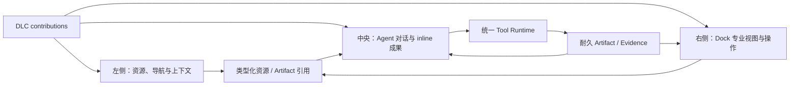
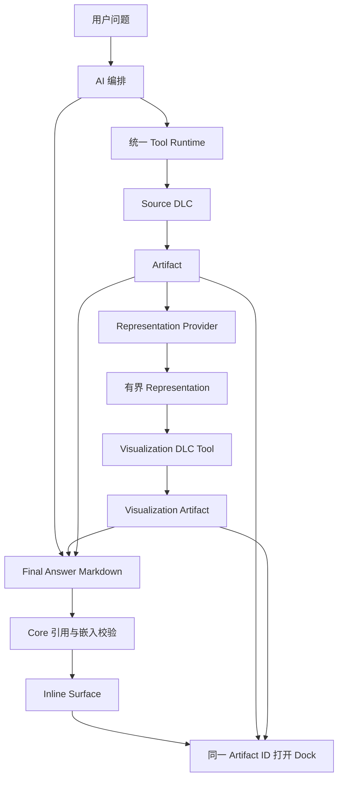

# Artifact、Representation、可视化与 Dock 架构

> 文档类型：架构说明
>
> 状态：已接受
>
> 最后核验：2026-08-28
>
> 适用范围：Agent Core、DLC SDK/Host、Artifact/Evidence、Data Result、Visualization DLC、Final Answer、Desktop Timeline 与 Workspace Dock

本文定义并记录当前生产边界。Representation、reference-only Result、显式 Snapshot、独立
Visualization DLC、块级 Artifact embed、identity-only Dock 和多引用 Composer 已进入生产路径；未完成的体验增强在
“后续专项”中单独列出，不构成另一套协议。

## 0. 产品定义：可插拔 Agent Workbench

DBFox 的最终产品不是“聊天框加一个 Artifact 侧栏”，而是一个由 Core 承载、由 DLC 按领域扩展的
Agent Workbench：



- Core 提供 Conversation、RunLoop、Tool Runtime、Artifact envelope、Evidence、上下文装配、权限、
  contribution registry、通用 Surface 和跨 Surface 联动；
- DLC 插入领域 Tool、Resource、Guidance、Artifact type、Representation Provider、View/Renderer 和
  经校验的 Command；
- 左侧、中央和右侧是同一 Workbench 的三个投影面，不是三个事实源；窗口位置可以变化，语义边界不随
  几何位置变化；
- AI 在统一 Runtime 中使用激活 DLC 的能力，决定何时工作、产生什么成果、如何解释，以及最终回答中
  嵌入哪些成果；
- 用户从左侧选择资源、从 Dock 选择或聚焦成果时，只在明确附加/选择后，使用现有
  `ConversationInputReference`、`selected_artifact_ids` 和授权后的 resource refs 进入下一轮；Core 不读取
  React store、布局树或 Renderer 私有状态来猜上下文；
- 开放字典式 `workspace_context` 不作为新的 DLC 通信总线。已有字段只保留当前兼容范围，新的领域语义
  必须进入类型化 reference、resource、Artifact 或 DLC context contribution 的权威边界。

这使“插入一个 DLC”成为完整产品能力，而不只是注册几个后端 Tool。例如：

| DLC | 插入的工作能力 | 可在 Workbench 中出现的投影 |
| --- | --- | --- |
| Data | 连接、Catalog、SQL 校验/执行、Result、DataFrame representation | 左侧数据资源；正文 SQL/结果/可视化；Dock 中 SQL、表格、profile、血缘与导出 |
| Music | 乐谱生成/修改、结构分析、演奏与导出等领域能力 | 左侧作品/资源；正文片段与解释；Dock 中乐谱、声部、时间轴、播放和演奏控制 |
| Visualization | 安全声明式表达、布局、交互和导出 | 消费任何兼容 Representation；正文轻量呈现；Dock 专业检查与交互 |

Data 不拥有 Workbench，Music 不拥有播放器容器，Visualization 也不拥有 Dock。它们拥有各自领域事实和
行为，并向 Core 的公开插槽贡献专业实现。

### 0.1 成熟 Workbench 设计的采用原则

本设计借鉴而不复制成熟产品的边界：

- VS Code 的 contribution point、namespaced view type、View Container、Command 和延迟激活思想；
- JupyterLab 的 plugin/service token、provider-consumer、可选依赖、renderer plugin、统一 command registry
  和 layout restoration 思想；
- Dockview/FlexLayout 的成熟 tab/group/split/serialization 交互；
- 各领域直接采用成熟 renderer，例如 Data 的 TanStack Table/Virtual、Visualization 的 Vega-Lite/Vega，
  Music 可评估 OpenSheetMusicDisplay/VexFlow
  与 Tone.js/Web Audio。

参考：

- VS Code Workbench：https://code.visualstudio.com/api/extension-capabilities/extending-workbench
- VS Code contribution points：https://code.visualstudio.com/api/references/contribution-points
- JupyterLab extension architecture：https://jupyterlab.readthedocs.io/en/stable/extension/extension_dev.html
- JupyterLab extension points：https://jupyterlab.readthedocs.io/en/stable/extension/extension_points.html
- OpenSheetMusicDisplay：https://opensheetmusicdisplay.github.io/classdoc/classes/OpenSheetMusicDisplay.html
- Tone.js：https://tonejs.github.io/

不直接嵌入 VS Code Extension Host、JupyterLab/Lumino 全套框架或任意 Webview。DBFox 已有冻结 Runtime
snapshot、DLC Host、权限、Tool Runtime 和 React UI；整体引入会制造第二套插件生命周期、依赖注入、
状态与安全模型。成熟方案应在真实边界直接采用：布局引擎负责布局，领域 renderer 负责领域渲染，DBFox
现有 DLC Host 继续是唯一扩展生命周期。

## 1. 目标

本阶段在已完成的前端 UI 重构之后，统一 Core、DLC、Artifact、结果读取、可视化和 Dock：

1. AI 可以在最终回答的任意位置组织“正文—Artifact—正文”，而不是只能把 Artifact 追加在底部；
2. Artifact 保持可追溯、可复用和可观察，不因一种 UI 容器改变事实语义；
3. 同一个 Artifact 可以有多个表示和多个展示 Surface，而不复制领域事实；
4. Data DLC 恢复 reference-only SQL Result 和安全实时重查，显式 Snapshot 才冻结结果值；
5. 新增独立 Visualization DLC，为任何兼容 DLC 提供丰富、美观、可交互的可视化；
6. Dock 是通用 View Container，不是 Artifact、Result 或可视化内容的第二事实源；
7. 新 DLC 可以通过公开合同复用表格、可视化和 Dock，不依赖 Data DLC 的私有服务。

## 2. 非目标

本阶段不做以下事情：

- 不替换 Agent RunLoop、原生 Responses function calling 或统一 RunItem 协议；
- 不新增图表专用 Message、Event、RunItem 或 Streaming Runtime；
- 不让 Core 理解 SQL、line/bar、x/y、Vega、音乐或其他 DLC 领域语义；
- 不把 AI 生成的 JavaScript、React、SQL 或任意 URL 作为可执行可视化规范；
- 不因为 Artifact 可以多视图，就把语义不同的 SQL、执行结果和可视化合并成一个对象；
- 不重做已采用的 Fluent 2、Radix、shadcn、TanStack 和 Agent Elements；Dock layout 只有在成熟引擎
  通过门禁后才整体替换，不自行扩写第二套布局状态机；
- 不维持 ECharts 与 Vega 两套新建图表链路。

## 3. 核心概念

| 概念 | 定义 | 是否耐久 | 所有者 |
| --- | --- | --- | --- |
| Artifact | 有稳定身份、类型、来源和血缘的工作成果 | 是 | Core envelope；payload 归 DLC |
| Evidence | 回答中的具体结论与已观察事实之间的可定位关系 | 是 | Core |
| Representation | 按 Artifact ID 读取同一成果的一种结构化形式 | 否，按需读取 | 对应 DLC Provider |
| View | 使用某个 Representation 的交互呈现及局部状态 | 通常否 | Core UI 或 DLC Renderer |
| Surface | `inline`、`workspace`、`fullscreen` 等放置环境 | 否 | Core UI |
| Snapshot Artifact | 明确冻结一组值和一致性时间点的派生成果 | 是 | 产生快照的 DLC |
| Visualization Artifact | 保存分析表达、布局、交互和来源绑定的派生成果 | 是 | Visualization DLC |
| Dock | 保存 Tab、Target、布局和 View state 的通用容器 | 仅保存 UI 偏好 | Core UI |

判断一个变化是否创建新 Artifact：

1. 事实和语义不变，只改变显示或临时交互：Representation/View；
2. 产生新的分析选择、说明、布局或可引用结论：派生 Artifact；
3. 冻结了新的数据状态：Snapshot Artifact；
4. 只改变放置位置：Surface，不创建对象。

## 4. 权威数据流



AI 是回答作者。Core 提供能力、上下文、权限和校验；DLC 提供领域工具、成果和领域指导；UI 只投影
已经形成的事实。

## 5. Core Runtime 与 Final Answer

### 5.1 保持现有 Runtime

以下生产合同保持不变：

```text
Responses API
  → 原生 function calling
  → RunLoop / Completion
  → 统一 RunItem
  → run.item.delta
  → MessagePayload(content + evidence + artifact_refs)
```

Visualization DLC 与其他 DLC 一样通过正式 Tool contribution 注册。RunLoop 不出现
`if visualization`、`if chart` 或 provider-name 分支。

### 5.2 通用正文嵌入

最终回答继续使用 `content: string`。Core 扩展现有 Artifact citation 标记族，增加块级嵌入：

```markdown
本季度收入增长主要发生在四月至六月。

{{artifact:artifact_visualization_123}}

华东区域贡献最大，原始结果如下。

{{artifact:artifact_result_456}}
```

Core Terminalizer 只做机械校验：

- ID 真实存在且已经完成；
- Artifact 属于允许的 Session/Run/引用范围；
- 当前用户和 Runtime snapshot 可以访问；
- 模型没有伪造、越权或引用已不可用对象；
- 正文标记与 `artifact_refs` 一致；
- 已嵌入对象不再被回答底部 fallback 重复展示。

Core 不决定是否生成可视化、嵌入位置、叙事顺序或 Artifact 重要性。未闭合的流式标记不渲染为
Artifact；标记完整后，Markdown AST 才在原位置调用现有 Artifact Renderer。

### 5.3 AI 如何获得能力上下文

每个 Turn 的有界上下文包含用户显式选择或附加的 Artifact 目录信息；当前 Run 新产生的成果则继续通过
统一 Tool Observation/RunItem 进入后续 Turn：

```text
id
type / schema_version / version
title / summary
受限 provenance（Tool 名称与 Invocation ID）
有界 relations
可用 Representation descriptor
```

目录不包含 Result rows、大型 payload 或 Renderer 配置。AI 需要具体数据时调用 owner Tool 或
Representation-backed inspect Tool。

Core System Policy 只说明通用 authoring 语义：可以引用或嵌入已经观察到的真实 Artifact。Data、
Visualization 和其他领域的使用判断来自各自 `CapabilityGuidanceContribution`。AI 根据用户目标、当前
上下文、工具 Observation 和 Artifact 自主决定是否调用工具以及如何组织回答。

## 6. Artifact 与 Evidence

### 6.1 Artifact envelope

现有通用字段继续作为唯一耐久 envelope：

```text
id / type / schema_version / version / status
session_id / run_id / turn_id
title / summary / semantic_key
payload / payload_ref
resource_refs / provenance / relations / visibility
```

- `payload` 只保存该 Artifact 自身的领域事实；
- `payload_ref` 是可选的大型耐久内容引用，不表示所有 Artifact 都必须物化值；
- `resource_refs` 绑定精确、经授权和 version-fenced 的来源；
- Representation 能力不写入 Artifact，避免保存会随 DLC activation 变化的第二份能力目录。

血缘优先保存 child → parent 的单向权威关系：

```text
Result        --derived_from--> SQL
Visualization --derived_from--> Result 或 Authored Dataset
Snapshot      --derived_from--> Result
```

UI 需要反向关系时查询图，不同步写入成对的镜像边。现有 `validated_by`、`executed_as`、
`visualized_as` 等关系在迁移前必须调查真实调用方；能由单向关系推导的镜像关系应停止新增并制定删除条件。

### 6.2 Evidence 与 Embed 分离

`Embed` 表示“在此处展示”，`Evidence` 表示“此来源支持某项结论”。二者可以引用同一个 Artifact，
但不能互相替代：

- 模型创作的示意图可以嵌入；
- 模型创作内容不能自动成为证明自身事实的独立 Evidence；
- Evidence 继续保存最小观察事实、locator、Artifact ID、fingerprint 和 observed time；
- 当前值与回答时观察值不一致时，UI 必须明确区分。

## 7. 通用 Representation 合同

Representation 是本阶段唯一新增的跨 DLC 平台边界。它解决“多个 DLC 需要复用表格、可视化和其他
读取能力”这一真实变化轴，不是为了形式解耦增加的包装器。

概念合同：

```text
ArtifactRepresentationContribution
  artifact_type
  representation_type        # namespaced，例如 dbfox.dataframe.v1
  provider_version
  describe(artifact)
  read(artifact, bounded_request)
```

Core Host 负责：

- 按 active frozen Runtime snapshot 查找 contribution；
- 加载 canonical Artifact envelope；
- 验证 Session、Run、权限、ResourceRef 和取消；
- 执行 deadline、行数、字节和并发上限；
- 返回统一错误和一致性元数据；
- 不解析 representation-specific payload。

Provider 负责：

- Artifact 是否支持该 Representation；
- 数据如何读取和校验；
- schema、字段、单位和格式元数据；
- 过滤、排序、聚合、采样和导出是否能下推；
- `live_reexecution`、`durable_snapshot` 等一致性语义；
- 来源变化、权限和领域错误。

第一项公共表示是 `dbfox.dataframe.v1`。它是 DLC SDK 的互操作合同，不是 Data DLC 私有类型，也不进入
Agent Core 领域模型。第一版采用有界 columnar JSON：字段元数据与等长 values vector 组成一页，并在
统一 envelope 中返回一致性、原始观察时间、读取时间、read ID、来源版本/指纹、warning 和 notice。
当前不引入 Arrow 第二编码；未来如采用只能作为同一合同的可选编码，不能形成第二 canonical schema。

旧 `ArtifactTableViewProvider`、`ArtifactChartViewProvider` 和 `/page|chart-data` 特例已经被该合同一次性
取代，没有保留双 API。

## 8. Data DLC 与 SQL Backend

### 8.1 所有权

Data DLC 继续拥有：

- ConnectionProfile、DatabaseResource、Catalog；
- SQL 解析、校验、审批和只读执行；
- SQL Artifact、Safety Artifact、Result Artifact；
- `dbfox.dataframe.v1` Provider；
- 分页、筛选、排序、聚合、采样、profile 和导出；
- 数据库错误、取消、generation 和 connection fence。

Data DLC 不再拥有新建 Visualization Artifact、图表语法、图表选择 Guidance 或通用图形 Renderer。

### 8.2 已接受的 Result 语义

新 Result Artifact 恢复 reference-only SQL Backend：

```text
Validated SQL Artifact
        ↓ execute
Result Artifact
  - source SQL Artifact ID
  - query / parameter fingerprint
  - Database ResourceRef + generation
  - columns/schema
  - original execution statistics/time
  - provenance
        ↓ dbfox.dataframe.v1
安全实时重执行、分页、筛选、聚合或导出
```

Result Artifact 不保存 `rows`、`previewRows` 或任意单元格值。Provider 从 Result 的唯一来源关系加载
不可变 SQL Artifact，重新校验 fingerprint、ResourceRef、generation、read-only contract 和允许的 view
操作，再通过 Data DLC 的连接与取消链执行。请求不能回传 datasource ID 或 SQL 作为权威输入。

读取结果标记 `consistency = live_reexecution`，至少携带：

```text
original_executed_at
view_executed_at
source_generation
query_fingerprint
truncated / row_count_known
```

来源变化、资源不可用或 generation 不匹配时明确返回 stale/source-changed；不得静默改查新连接，也
不得在实时读取失败时回退到旧快照冒充当前值。

### 8.3 不可变证据与实时数据

Artifact 不可变表示查询身份、执行描述、血缘和当时观察事实不可被改写，不表示外部数据库永远不变。
回答时的数值证据由 Evidence 的最小事实和 `observed_at` 固定；用户以后打开 Result 时看到的是明确标注
的当前重查结果。需要冻结完整值时，用户或 Agent 显式创建 Snapshot Artifact：

```text
Snapshot Artifact
  - derived_from Result
  - durable payload_ref
  - captured_at
  - row/byte limits and retention
  - consistency = durable_snapshot
```

Snapshot 是新的事实成果，不是 Result 的隐式 storage mode。

### 8.4 历史 UI 动因与当前决定

2026-06 的 Conversation `ArtifactDock` 已提供 `onOpenResultTab`，早期 Result 设计确实同时服务“将工件
打开成独立 Tab”的交互。后续产品收敛为统一 Workspace Dock。历史证据只能说明数据读取、Artifact 和
Tab 曾被耦合，不能证明持久化结果行是唯一正确实现。

本设计把存储语义从容器中剥离：无论 Artifact 打开在旧 Tab、新 Dock、正文 inline 或全屏，Result
都是同一个 reference-only Artifact。Dock 只改变 View 和 Surface，不改变 SQL Backend。

### 8.5 迁移结果

生产 Data DLC 已切换到 Result schema v2 和 `live_reexecution`。`result_inspect/profile`、UI page 和 CSV
export 共用同一个 DataFrame Provider；显式 `dbfox.data.snapshot` 才使用耐久值。旧 Result page/chart
API 已删除，生成 API client 只公开通用 Representation 路由。历史 `dbfox.data.chart` 由 Visualization
DLC 按精确 schema 只读，不提供 SQL fallback 或新建能力。

## 9. 一个 Artifact 多视图

“双视图”思想保留，但必须放在正确层次。

### 9.1 同一 Artifact 的多个 View

以下属于同一个 Artifact 的不同 View：

- Result：Table、profile、临时 chart、raw schema；
- File：rendered preview、source text、metadata；
- Visualization：inline、interactive workspace、data table fallback；
- Snapshot：table、summary、export。

这些 View 不创建新事实，状态保存在 View state 中。用户明确“保存这张图”或 AI 创建了可引用的分析
表达时，临时 chart 才升级为 Visualization Artifact。

### 9.2 相关 Artifact 的组合工作区

SQL 文本和执行结果语义不同：SQL 是查询意图，Result 是某次执行身份。它们应保持两个 Artifact：

```text
SQL Artifact
    ↑ derived_from
Result Artifact
    ↑ derived_from
Visualization Artifact
```

Dock 可以提供一个 relation-aware Artifact Workspace，在同一工作区显示“SQL / Result / Visualization /
Evidence”子视图。这保留用户感知上的“语句与表格双视图”，但不把不同事实塞进一个 Artifact payload。

### 9.3 表格 UI 的所有权

表格不是 Data DLC 的专属 UI。公共边界按以下方式划分：

| 能力 | 所有者 |
| --- | --- |
| `dbfox.dataframe.v1` schema 和互操作合同 | DLC SDK/Host 平台合同 |
| 通用 DataFrame Table View、Grid ARIA、Cell preview、virtualization | Frontend Host/Core UI |
| TanStack Table/Virtual engine 与 Fluent/DBFox presentation | Frontend Host/Core UI |
| Result 数据、字段类型、分页、排序、过滤和聚合 | 提供 Artifact 的 Source DLC |
| 数据库 Schema、SQL、连接、profile、数据库专属动作 | Data DLC |
| Visualization 的 data-table fallback | Visualization DLC 组合 Host Table View |

Data DLC 为 Result Artifact 注册 `dbfox.dataframe.v1`，并声明默认可以使用 Host Table View；它不复制
Grid engine、Cell renderer 或全局表格样式。其他 DLC 提供同一 Representation 后，也能直接获得相同
表格能力，不导入 Data DLC。

当前 `desktop/src/features/workspace/artifacts/table/` 已位于 Host 前端并使用 TanStack Table/Virtual，
方向正确；需要重构的是它对 Data Result 类型和特殊 page API 的耦合，而不是把组件整体搬进 Data DLC。
TanStack Table 官方将其定义为 headless engine，允许应用掌控 DOM、设计系统和受控状态，符合这一
所有权边界：https://tanstack.com/table/v8/docs/overview

## 10. Visualization DLC

新增一方 System DLC `dbfox.visualization`。它只依赖公开 DLC SDK、Artifact envelope 和 Representation
合同，不导入 Data DLC 私有代码。

### 10.1 能力

- 注册 `visualization_create` Tool 和领域 Guidance；
- 读取任意 Artifact 的 `dbfox.dataframe.v1`；
- 创建 durable Visualization Artifact 和 `derived_from` 血缘；
- 校验字段、类型、聚合、排序、布局、交互和数据预算；
- 提供 `inline`、`workspace` Renderer 和数据表 fallback；
- 通过受限 Vega parameter/selection 支持 Tooltip、Legend toggle、zoom/pan、brush、linked views，
  通过声明式 layer/mark 支持 annotation，并提供 PNG/SVG export；
- 允许来源型、模型创作型和纯示意型可视化，并明确 provenance。

### 10.2 可视化文档

Visualization Artifact 保存受限声明式文档，不保存来源 Result rows：

```text
VisualizationDocument
  grammar / version
  source_bindings
  blocks
    - metric
    - chart
    - table
    - text
  constrained layout
  annotations / highlights
  interaction bindings
```

- 图形默认使用 Vega-Lite；高级场景使用经过更严格策略限制的 Vega；
- KPI、标题、说明、Toolbar、Error 和布局外壳使用现有 React/Fluent/Radix 组件；
- 完整 Result 检查继续打开 Host 的 TanStack DataFrame View；Visualization 文档内的有界 table block 和
  无障碍 fallback 使用语义化只读表格，不另建分页/筛选状态机；
- 模型不能提供任意 CSS、JS、React、网络 loader 或可执行 ECharts option；
- Renderer 使用命名数据集注入有界数据，禁止 `data.url` 和大型内联 `values`；
- 严格 CSP 使用官方 interpreter，卸载时释放 View、listener 和 timer；
- 新建图表链不再使用 ECharts，旧 Chart schema 只做精确历史读取并制定退出条件。

### 10.3 无外部数据来源

AI 可以根据知识创建解释性可视化，但不能把它伪装成外部证据。Visualization DLC 将小型模型输入
物化为有界 `dbfox.visualization.authored_dataset` Artifact：

```text
provenance = model_knowledge | user_provided
bounded scalar records
```

一次 `visualization_create` 会原子地产生 supporting `authored_dataset` 与 schema-v2 Visualization；后者
只保存 Artifact source binding，并通过 RFC 6901 同批次草稿引用和 `derived_from` 指向前者。历史 schema-v1
inline 文档只读兼容，不再由新 Tool 创建。该数据集可以被检查或 Embed，但 Core Evidence 规则不会把模型
自产内容自动视为独立来源。大型数据不能通过 authored dataset 绕过 Data/Result Backend。

### 10.4 受控交互

图内交互使用经过校验的 Vega parameter/selection/signal。当前 schema-v2 允许 point/interval、scale/legend
binding，以及有界 checkbox/range/radio/select 控件；禁止 DOM selector、外部 element 和任意回调。

当前跨边界动作只有两个 Host 明确提供的通用动作：从 Visualization 打开已授权的 source Artifact，以及从
Core Artifact Dock 把 Artifact identity 加入 Composer。以下 action 名称是后续若加入模型声明式动作时的
保留白名单，不是当前 schema 可接受的字段：

```text
open_artifact
open_representation
set_parameter
inspect_rows
request_drilldown
```

未来若实现这些 intent，Core/DLC Host 必须验证 target、权限、ResourceRef、参数和预算后执行。当前 Spec
不能声明它们，也不能直接调用 API、运行 SQL或修改 Zustand Store。

## 11. Dock

Dock 是 Core-owned View Container。权威 Tab envelope 保持通用：

```text
viewKey
viewType
target { type: object, object: { kind, id, version? }, authority?, locator? }
title
stateKey
project/conversation scope
```

Dock Store 可以保存：

- 打开顺序、活动 Tab、折叠和 Pane 大小；
- View 的列宽、排序、临时筛选、缩放和 Inspector 开合；
- 指向 Artifact、Conversation 或实际展示对象的 canonical target。对象 target 的 `object` 必须描述 Tab
  正在展示的对象；`authority`/`locator` 只提供重新读取所需的权威边界，不能用父资源冒充展示对象。

Dock Store 不保存：

- Artifact payload/envelope 副本；
- Result rows、Visualization spec 或文件内容；
- provenance、relations 或 status 的裁剪镜像；
- DLC 领域状态和第二套错误状态。

Artifact Tab 按 ID 从 canonical conversation/artifact query 读取完整 envelope，再根据 Artifact type 和可用
Representation 选择 View contribution。正文中的“在 Dock 查看”打开同一 Artifact ID，不创建第二个对象。

Dock 可以组合相关 Artifact，但组合只是 relation-aware navigation。SQL/Result/Visualization 仍有独立身份。

### 11.1 成熟 Dock 引擎调查

当前 `react-resizable-panels + Radix Tabs` 是成熟组合，适合固定左右分栏和单组 Tabs；它没有提供完整的
浏览器/IDE 式 tab 拖拽、分组拆分、浮动、popout 和布局序列化。如果产品目标只保持固定右栏，应继续
复用当前组合；如果目标是可重排的多视图分析工作区，应直接采用成熟 Dock layout engine，不继续扩写
自研 tab/layout 状态机。

| 候选 | 成熟能力 | 与 DBFox 的匹配 | 决策 |
| --- | --- | --- | --- |
| Dockview | React；tabs/groups、拖拽、split、floating、popout、serialization、browser-like tab reorder；core zero dependency | 最接近 VS Code/浏览器式 Workbench；可自定义 tab 和 panel | **优先 ADOPT 候选** |
| FlexLayout | React；多 tabset、drag/dock、maximize、overflow、popout、JSON model、ARIA/keyboard | 能力完整；JSON model 和 DBFox Store 的唯一权威需要谨慎切换 | **第二候选** |
| Lumino DockPanel | JupyterLab 使用的 widgets/layouts/messaging 工具集，包含 DockPanel/DataGrid | 经过大型产品验证，但会引入另一套 widget/layout 世界和 React 适配边界 | **REJECT 当前范围** |
| Golden Layout | drag/drop、stack、popout、save/restore、theme | 通用但 React 集成和当前主分支稳定性不如前两项 | **REJECT 当前范围** |
| 当前 Radix Tabs + resizable panels | 已采用、无新依赖、视觉和状态已验证 | 固定右栏优秀；继续加入多组拖拽会走向自研布局引擎 | **KEEP 固定模式；不自行扩写 IDE 模式** |

官方能力入口：

- Dockview：https://dockview.dev/docs/overview/introduction/
- Dockview core model：https://dockview.dev/docs/core/overview/
- FlexLayout：https://github.com/caplin/FlexLayout
- Lumino：https://github.com/jupyterlab/lumino
- Golden Layout：https://github.com/golden-layout/golden-layout

### 11.2 Dockview 采用边界

2026-08-28 评估结论：Project/Conversation 作用域、贡献命名空间、canonical target、projection epoch 和
DLC deactivate 已稳定；但当前产品合同仍是“固定右栏、单 Tab 组”，没有 split/floating/popout 的已接受
需求。因此本阶段不引入 Dockview，也不迁移布局状态。继续使用 Radix Tabs + resizable panels；只有多组
可重排分析工作区成为已接受需求时，才执行下面的整体验证和替换门禁，不能为了预留未来能力提前双写。

在实现阶段通过 Electron/CSP、键盘、缩放、主题、卸载和 DLC 动态注册验证后，如果 Dockview 达到门禁，
应直接替换 Dock 内部的 Tabs/layout 组合；不能同时保留 Dockview model 与 `workspaceStore` 的镜像布局树。

CSP 验收必须以 DBFox 当前策略为准：inline style element 禁止；style attribute 只供经审计的成熟
renderer 使用。不得为了布局库扩大该例外，DBFox/DLC 业务代码仍禁止任意 inline layout；也不得长期
维护私有 fork 或大面积运行时样式兼容层。候选库必须能通过官方扩展点，或一个位于 Host
渲染边界、职责单一且可测试的窄适配工作；否则淘汰。FlexLayout 已明确记录 ARIA 与键盘能力，Dockview
的同等能力必须通过实际键盘、读屏与焦点恢复测试证明，不能只按功能列表判断。

采用后的唯一状态边界：

```text
Dockview layout model
  = Dock 的 tab/group/split/floating 顺序和活动状态

Panel identity
  = viewType + target identity + stateKey + scope

DockViewRegistry
  = viewType → contribution/renderer

Artifact Repository / Query
  = Artifact envelope 和内容
```

Dockview serialization 只持久化经过校验的 UI preference 和 panel identity，不保存 Artifact payload、Result
rows、Visualization spec、credential 或 DLC 私有状态。原 `workspaceStore` 中与 Dockview 重复的 tab/group
布局字段在切换时删除；保留 Project/Conversation scope 等不属于 layout engine 的 Host 状态。

Popout/floating 只有通过 Electron BrowserWindow、sandbox、token、CSP、焦点恢复和 DLC asset protocol 的
专项验证后才能启用。验证前显式关闭，不用不安全 fallback 模拟。

## 12. 错误、取消和一致性

Core Representation 边界使用通用公开错误：

```text
NOT_FOUND
FORBIDDEN
UNSUPPORTED_REPRESENTATION
SOURCE_UNAVAILABLE
SOURCE_CHANGED
STALE
INVALID_REQUEST
DEADLINE_EXCEEDED
CANCELLED
PROVIDER_FAILURE
```

DLC 将领域错误映射为公开错误并保留安全的内部诊断。Inline 使用紧凑错误和“在 Dock 查看/重试”；
workspace 显示来源、恢复动作和 request ID。两者读取同一错误事实，不能各自维护失败状态机。

Representation read、可视化数据加载和 export 都必须接受 AbortSignal/取消、deadline 和 generation
fence。未来若加入数据点级 drill-down，也必须沿用同一取消、授权和预算边界。断线或 Renderer 重挂载
不得自动重放非幂等动作。

## 13. 安全、性能与可访问性

- Representation 和 Visualization 使用行数、字节、字段、节点、图层、transform、时间和并发预算；
- 大数据优先在 source provider 侧过滤、聚合、采样或 downsample；
- 不把 Result rows 放入 Artifact、Event、Observation、Memory、Conversation Store 或 localStorage；
- 图表不加载外部 URL、图片、字体或脚本；
- 可视化颜色不是唯一编码，提供单位、图例、精确交互详情、键盘路径和文字摘要；
- 图表提供数据表 fallback，空、加载、错误和 stale 都有明确状态；
- Heavy renderer 按 DLC chunk 延迟加载，卸载后释放资源；
- inline 以阅读稳定性为优先，workspace 才开放高密度控制；
- UI 直接使用[现行 UI 设计与开发规范](../quality/ui-design-and-development.md)和 Fluent 2 tokens。

## 14. 当前实现状态

当前生产路径已经完成以下收敛：

1. Core 使用通用 `ArtifactRepresentationContribution`，没有 Table/Chart Provider 或领域 API；
2. Data Result 为 reference-only `live_reexecution`，Snapshot 才拥有冻结值；
3. Data 不再提供 `chart_create`，新可视化只由 `dbfox.visualization` 创建；
4. Visualization 使用离线 vendored Vega-Lite/Vega、CSP interpreter、命名数据集和拒绝网络的 loader；
   tooltip 走 Vega View 官方回调并投影为 DLC 内的可访问详情区，不引入会注入 style/写 inline 定位的运行时；
5. Final Answer 使用 standalone `{{artifact:artifact_id}}` 标记在 Markdown AST 中精确嵌入同一 Artifact；
6. CompletionPolicy、Terminalizer 和 ResponseComposer 校验 Artifact 真实存在、可观察、范围合法且不重复；
7. Timeline 对已嵌入 Artifact 去重，未嵌入成果仍使用原有 fallback；
8. Dock 只保存 Artifact identity 与选中 View ID，Renderer 读取 canonical envelope；
9. Host 的通用 DataFrame Table View 使用 TanStack Table/Virtual；DLC Renderer 负责领域视图；
10. 历史 `dbfox.data.chart` 只由 Visualization DLC 精确只读，不存在旧创建链或 ECharts 生产依赖。
11. 新 Visualization schema-v2 不保存 source rows；模型知识/用户数据被物化为独立、可读取 DataFrame 的
    supporting `authored_dataset` Artifact；
12. Dock Artifact 可用通用动作附加到 Composer；Composer 保存最多 12 个去重、可移除的 typed reference，
    attached Artifact 会进入下一 Turn 的受限 Artifact/Representation 目录；
13. Visualization 支持 metric/chart/table/text 组合、无数据状态、可访问表格、受限缩放/刷选/图例/输入参数，
    Representation 读取重试共用 AbortSignal 生命周期。

当前仍需作为独立产品增强评估的是可拖拽多组 Dock 布局，以及数据点级 drill-down/模型声明式跨 Artifact
action。两者不得改变本文的 Artifact、Representation、权限或上下文合同。

## 15. 已实施的迁移顺序

### 阶段 A：合同和反证测试

- 固化本文、UI 规范、术语和文档替代关系；
- 为现有 snapshot/live、Dock copy、底部 append 和 chart hard-code 建立失败基线；
- 确认历史 Artifact schema、调用方和数据保留范围。

### 阶段 B：Representation 平台边界

- 在 DLC SDK/Host 建立通用 contribution；
- 用 `dbfox.dataframe.v1` 迁移现有 Result table；
- 一次性替换特殊 page/chart API 和生成前端 client；
- Core 只保留 auth、budget、cancel 和 dispatch。

### 阶段 C：Data SQL Backend

- 新 Result schema 切换 reference-only `live_reexecution`；
- inspect/profile/page/export 走同一 provider；
- 把 durable row store 收敛为显式 Snapshot ownership；
- 迁移历史 snapshot-backed Result，禁止失败 fallback。

### 阶段 D：Dock 与多视图

- 删除 `artifactDockStore` 的 Artifact 内容副本；
- Tab 只保存 target identity 和 View state；
- Artifact Workspace 通过多 View 与已校验 relation/source 导航 SQL、Result、Visualization 和 Evidence；
- inline 与 Dock 共用同一 Artifact ID；
- 左侧资源和 Dock 成果通过现有 typed reference 显式附加到 Composer，显示可移除的 context chip；
- 不把 active tab、布局树或 Renderer 私有状态自动倾倒进 `workspace_context`；
- 用户触发的领域动作进入 DLC Command/Operation 或统一 Tool Runtime，不由 UI store 直接模拟 Agent 状态。

### 阶段 E：Visualization DLC

- 建立 package、Tool、Guidance、Artifact schema 和安全验证；
- 接入 Vega-Lite、受限 Vega、CSP interpreter 和命名数据；
- 实现 inline/workspace、受限 Vega 交互参数、组合 table block、表格 fallback 和导出；
- 停止创建旧 Data Chart Artifact。

### 阶段 F：Final Answer Embed

- 扩展引用解析、Terminalizer 校验和 Markdown AST；
- 支持 AI 自主穿插编排；
- 去除已嵌入 Artifact 的底部重复；
- 加入伪造 ID、跨 Run、流式半标记和 Renderer unavailable 测试。

每个阶段完成后直接删除被替代的生产路径。只有历史耐久 Artifact 读取可以按 schema version 保留，且
不得承载新业务逻辑。

## 16. 调研结果与后续专项

- `dbfox.dataframe.v1` 采用有界 columnar JSON 作为第一版规范合同；当前需求不引入 Arrow 第二编码；
- 图形采用 Vega-Lite 6.4.3 为默认语法、Vega 6.4.0 为受限高级语法、Vega Interpreter 2.3.2 满足严格
  CSP，所有包固定版本并随签名 DLC 离线打包；
- 历史 Chart schema 采用 Visualization DLC 内精确只读 Renderer，不保留创建 Tool、旧 Representation
  或 ECharts；删除条件是产品确认不再需要读取该 schema 的耐久 Artifact；
- model-authored dataset 只允许 `model_knowledge` 或 `user_provided` 的有界标量行，并明确事实来源，不能
  自动成为数据库 Evidence；
- Representation HTTP 采用 typed operation body，JSON read 与 stream 分开，避免响应类型双义；
- 固定右栏继续采用 Radix Tabs 与 resizable panels。Dockview/FlexLayout 只有在真实 Electron/CSP、键盘、
  缩放、主题、动态 DLC、序列化和卸载 fixture 通过后才整体替换，不与现有 layout store 双写；
- Frontend activation 使用 epoch/generation fence；贡献 ID 由 owner namespace 约束，Core ID 预留；DLC
  disable/deactivate 会释放模块状态、样式并从所有 Workbench 清除失效 View；
- 新领域 DLC 仍需分别调查成熟 Renderer。例如 Music 应分别验证 MusicXML 排版、MIDI/音频调度、许可、
  离线资产、CSP、可访问性和卸载，不能用一套自研 Canvas 承担全部职责。

## 17. 验证范围

至少覆盖：

- Core：embed 解析、伪造 ID、权限、Run scope、流式半标记、去重和 fallback；
- SDK/Host：重复注册、snapshot lifecycle、DLC disable、unsupported representation、budget 和 cancel；
- Data：SQL fingerprint、generation、分页/筛选/聚合下推、stale、无结果行持久化和显式 Snapshot；
- Visualization：Schema、字段、外部 URL、表达式、预算、参数 binding、CSP、卸载和可访问性；
- Dock：只保存 identity、同 ID 联动、多视图、关闭焦点、Project/Conversation scope 和未知 Renderer；
- Runtime：Tool 仍走统一 Invocation/Observation，RunLoop、RunItem 和 SSE 协议无图表分支；
- UI：Light/Dark/High Contrast、中文/英文、125%/150%/200%、窄窗、reduced-motion 和表格 fallback；
- 文档：所有“当前”说明与生产 `consistency`、API 和 Artifact schema 一致。

## 18. 采用与拒绝决定

采用：

- 复用现有 `MessagePayload + artifact_refs + Markdown AST + ArtifactRenderer(mode)`；
- 复用现有 `ConversationInputReference + selected_artifact_ids + resource refs + DLC context contributor`
  构成 Workbench 到 Agent 的显式上下文链；
- 以通用 Representation 作为跨 DLC 数据表示边界；
- Data DLC 提供 DataFrame，独立 Visualization DLC 消费；
- Vega-Lite 默认、受限 Vega 高级、React 产品布局、TanStack 表格；
- Dock 只保存容器与导航状态；
- Result 实时重查，Snapshot 显式建模。

拒绝：

- 新 `ResponseComposition`、Presentation aggregate 或图表 RunItem；
- Core 内 Data/Chart 分支；
- Visualization DLC 强制依赖 Data DLC；
- 新建第二套 Workbench plugin runtime，或直接嵌入 VS Code/JupyterLab 的完整扩展宿主；
- 把 Dock/左侧的任意 UI store、布局状态或 renderer state 自动注入模型上下文；
- 将正文图和 Dock 图保存为两个 Artifact；
- ECharts/Vega 长期双新建链；
- 模型生成任意 JS/React/ECharts option；
- 默认 Result 快照与失败时静默 snapshot fallback；
- Dock/Frontend Store 保存 Artifact 内容副本。

重新评估条件：真实需求证明通用 Representation 无法表达非表格跨 DLC 互操作，或 Vega 在严格 CSP、
离线 Electron、性能和可访问性验证中无法达到门禁。重新评估必须先提供运行证据，不能只以迁移成本为由。
