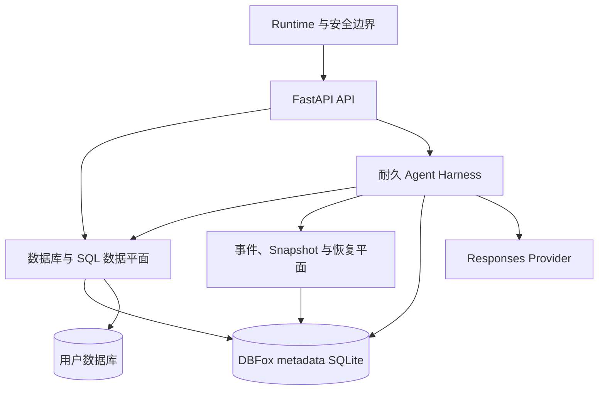
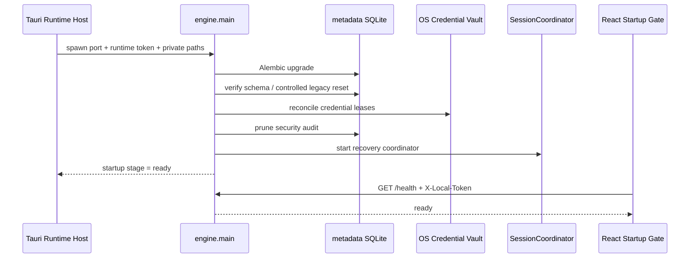
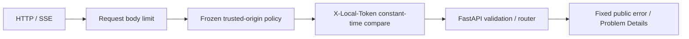
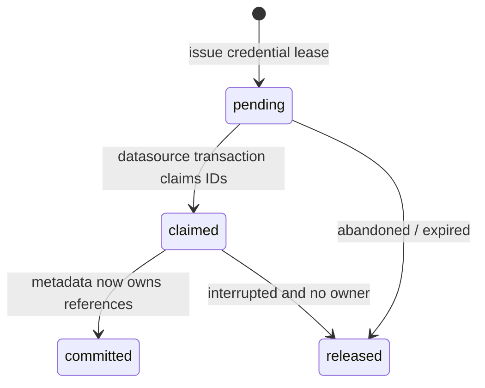
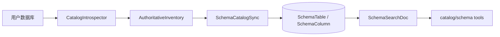
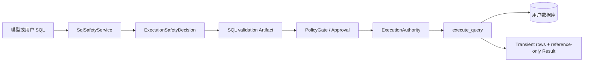
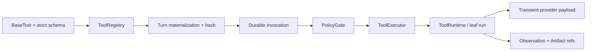

# DBFox 后端代码导览

> 文档类型：实现指南
>
> 状态：当前
>
> 最后核验：2026-08-16
>
> 适用范围：`engine/` 当前生产实现、迁移与自动化测试
>
> 面向读者：了解产品目标和关键设计，但不熟悉具体代码的项目所有者、维护者和新贡献者

这份文档解决的是“怎样正确理解并进入 DBFox 后端”，不是重新定义一套架构。涉及状态机、安全合同和数据边界时，以下文档仍是权威事实：

- [后端架构](./backend.md)
- [功能模块与执行管线](./implementation-map.md)
- [Agent Runtime](./agent-runtime.md)
- [数据、SQL 与结果链](./data-sql-results.md)
- [Tool、Context 与 Memory 边界](./agent-tool-context-memory-contract.md)
- [错误边界合同](./error-boundary-contract.md)

本导览把这些合同映射到真实入口、核心 Symbol、持久实体和测试。阅读时不必从 `engine/` 第一行看到最后一行；先建立心智模型，再沿具体链路下钻。

如果你需要的不只是全局地图，而是逐条链路、事务边界、失败路径、调试方法和扩展步骤，请继续阅读[后端实现手册](../backend/README.md)。本文件是“卷 0”，多卷手册按 Runtime、持久化、数据源、SQL、Agent、工具、记忆/事件和测试拆开讲解。

---

## 1. 先用一句话理解后端

DBFox 后端是一个由桌面 Host 管理的本地 FastAPI Engine：它使用 SQLite 保存 DBFox 自身的耐久状态，通过受控连接访问用户数据库，通过 OpenAI Responses 风格的原生 function calling 驱动显式 Agent 循环，并把回答、工具、证据和进度投影成可以断线恢复的事件流。

这里有两个完全不同的数据库概念：

| 数据库 | 保存什么 | 谁是事实源 | 不能保存什么 |
| --- | --- | --- | --- |
| DBFox metadata SQLite | 项目、数据源配置、凭据引用、Schema Catalog、会话、Run、Turn、工具调用、事件、Artifact、审计 | DBFox 后端 | 明文密码、Provider API Key、任意完整查询结果集 |
| 用户数据源 | 用户真实业务表和查询结果 | MySQL、PostgreSQL、SQLite 或 DuckDB | DBFox 内部 Agent 状态 |

模型不是事实源，React 也不是事实源。模型提出动作和解释结果；React 展示后端投影；耐久状态与用户数据库分别保有各自领域内的真相。

---

## 2. 四个互锁的后端系统



### 2.1 Runtime 与安全边界

负责 Engine 初始化、迁移、短期本地 Token、请求鉴权、错误收敛、进程关闭和资源清理。它决定“请求能不能进入系统”，不决定 Agent 业务结果。

### 2.2 数据库与 SQL 数据平面

负责凭据、连接 generation、连接池/隧道、Schema Catalog、SQL 校验、只读执行、取消、分页、图表数据和导出。它决定“数据怎样被安全读取”，模型不能绕过它直接访问数据库。

### 2.3 耐久 Agent Harness

负责输入接纳、Session 内串行、Run/Turn、Provider stream、原生工具调用、审批、预算、完成判断、回答和记忆。它是显式循环，不是隐藏 Graph，也不依赖 HTTP 连接活着才能继续运行。

### 2.4 事件、Snapshot 与恢复平面

负责先提交后发布的公共事件、Canonical RunItem、低延迟 live delta、cursor replay 和进程恢复。它决定“用户刷新或断线后怎样看到同一个事实”。

理解任何功能时，都先问它属于哪一块，以及跨过了哪些边界。

---

## 3. 技术栈：哪些直接复用，哪些是 DBFox 领域实现

| 能力 | 采用方案 | DBFox 自己负责的部分 |
| --- | --- | --- |
| HTTP API | FastAPI、Pydantic | 本地鉴权、中间件顺序、RFC 9457 错误合同、业务路由 |
| ORM 与迁移 | SQLAlchemy 2、Alembic | 聚合事务、SQLite writer 规则、迁移恢复合同 |
| Metadata DB | Python SQLite / SQLAlchemy | WAL 配置、短事务、lease fencing、事件序列 |
| Provider | OpenAI Python SDK Responses API | provider-neutral Turn Item、完成语义、预算和错误分类 |
| HTTP Client | HTTPX | LLM endpoint 策略、DNS 解析固定、client 生命周期 |
| 工具合同 | Pydantic strict schemas + Responses function calling | Registry、物化快照、Policy、Invocation、Observation |
| SQL 解析与安全 | SQLGlot、SQLAlchemy/驱动参数绑定 | DBFox 只读策略、ExecutionAuthority、Artifact 血缘 |
| 凭据 | OS keyring | opaque credential ID、Credential Lease Saga |
| 测试 | Pytest | SQLite Harness、契约测试、边界 sentinel、opt-in 真实 Provider 测试 |

DBFox 自研部分主要表达产品特有的不变量：证据优先、reference-only Result、Session lease、可恢复工具调用、数据不进入耐久 Prompt。它们不是为了替代成熟库，而是把成熟库组合成 DBFox 的领域语义。

---

## 4. `engine/` 目录地图

| 目录/文件 | 主要职责 | 从哪里开始看 |
| --- | --- | --- |
| `engine/main.py` | FastAPI app、lifespan、中间件、全局错误和 health | `lifespan`、`verify_local_access_token` |
| `engine/db.py` | metadata engine、SQLite pragmas、Alembic、SessionLocal | `initialize_metadata_database` |
| `engine/models.py` | 当前 ORM 持久实体 | `DataSource`、`AgentSession`、`AgentRun` |
| `engine/api/` | HTTP/SSE 边界；验证、DTO 和命令接纳 | `engine/api/__init__.py` |
| `engine/app/` | 请求大小与公开错误目录 | `safe_errors.py` |
| `engine/engine_runtime/` | frozen/source Runtime 凭据规则 | `RuntimeCredentialPolicy` |
| `engine/connectivity/` | 规范连接模型、Factory、Pool/Tunnel 生命周期 | `ConnectionProfile`、`ConnectionFactory` |
| `engine/environment/` | 数据库内省、权威 Catalog 同步、ER 投影 | `SchemaCatalogSync` |
| `engine/sql/` | 方言、解析、安全、执行、结果视图和导出 | `SqlSafetyService`、`ResultViewService` |
| `engine/tools/runtime/` | 通用工具合同、注册、验证、执行和输出限制 | `BaseTool`、`ToolRuntime`、`ToolExecutor` |
| `engine/tools/builtin/` | DBFox 向模型开放的产品工具 | `register_dbfox_tools` |
| `engine/tools/db/` | Catalog/Preview/SQL 的叶子数据能力 | `sql_execution.py` |
| `engine/agent/` | Session、Run、Turn、Context、Provider、完成、终态 | `SessionCoordinator`、`RunLoop` |
| `engine/agent/repositories/` | Agent 聚合的短事务和事件提交 | `SessionRepository`、`RunRepository` |
| `engine/llm/` | LLM 配置、endpoint 策略、HTTP client 和 SDK 构造 | `config.py`、`http_clients.py` |
| `engine/security/` | Vault、Credential Lease、审计、受控 Runtime Reset | `credential_vault.py` |
| `engine/policy/` | 工具授权、ExecutionAuthority、确认和脱敏 | `PolicyGate` |
| `engine/diagnostics/` | 结构化、脱敏、有界日志 | `logs.py` |
| `engine/migrations/` | metadata schema 的唯一演进链 | `versions/` |
| `engine/tests/` | API、SQL、连接、安全、迁移和架构测试 | 按功能寻找 `test_*.py` |
| `engine/agent/tests/` | Harness、Repository、Provider、上下文和恢复测试 | `harness/test_sqlite_scenarios.py` |

`schemas/` 是 HTTP DTO，`models.py` 是持久模型，`agent/*.py` 中的 Pydantic/Enum 是领域运行模型。这三类模型处在不同边界，不应为字段相似就互相替代，也不应再新增一套镜像 DTO。

---

## 5. 链路一：Engine 怎样启动并变成 Ready

### 5.1 完整顺序



### 5.2 精确代码入口

| 阶段 | Symbol | 位置 | 说明 |
| --- | --- | --- | --- |
| Python 入口 | `app`, `lifespan` | `engine/main.py` | app 初始化与依赖顺序 |
| Token 解析 | `get_or_create_local_token` | `engine/main.py` | 委托 RuntimeCredentialPolicy |
| Token 策略 | `RuntimeCredentialPolicy.resolve_token` | `engine/engine_runtime/credentials.py` | frozen 模式要求 Host 注入；source 模式可使用本地开发凭据 |
| 元数据库初始化 | `initialize_metadata_database` | `engine/db.py` | Alembic → verify → 受控 legacy reset → verify |
| SQLite 设置 | `configure_sqlite_pragmas` | `engine/db.py` | WAL、busy timeout、NORMAL、secure delete |
| 凭据恢复 | `reconcile_credential_leases` | `engine/security/credential_lease.py` | 处理进程中断留下的 pending/claimed lease |
| Agent 恢复 | `SessionCoordinator.start` | `engine/agent/coordinator.py` | 扫描可继续 Session，不创建第二耐久队列 |
| 停机清理 | `lifespan` finally | `engine/main.py` | 停 Coordinator、连接资源、LLM clients |

### 5.3 Ready 的准确含义

Ready 表示 metadata migration、凭据租约恢复、审计维护和 Coordinator 启动已经完成。它不表示某个外部数据源可连接，也不表示 Provider Key 有效；这些是独立的产品状态。

### 5.4 失败语义

任一启动阶段失败都不会发布 Ready。Rust Host 保有 Sidecar 生命周期和 generation；前端只读取 Host 状态并展示可操作错误，不自己猜端口、不复用旧 Token，也不另启 Python 进程。

---

## 6. 链路二：HTTP 请求怎样通过本地安全边界

所有业务路由位于 `engine/api/__init__.py` 的 `/api/v1` 下。根状态和 `/health` 同样经过 Token 边界。



| 边界 | Symbol | 位置 |
| --- | --- | --- |
| 请求体限制 | `AgentInputRequestBodyLimitMiddleware` | `engine/app/request_limits.py` |
| Origin + Token | `verify_local_access_token` | `engine/main.py` |
| RFC 9457 响应 | `problem_response` | `engine/problem_details.py` |
| 固定错误目录 | `FixedErrorCode`, `fixed_error_detail` | `engine/app/safe_errors.py` |
| HTTP/Validation/DBFox/未知异常 | app exception handlers | `engine/main.py` |

安全上最重要的一点：`DBFoxError.message` 不是天然可信的公开文本。驱动、Provider、Vault、远端响应和异常链中的字符串只能转换成固定错误码与固定公开消息。只有明确设计为可展示输入纠正的边界可以返回受控文本。

### API 功能入口

| 功能 | Router 文件 | 主要入口 |
| --- | --- | --- |
| Project | `engine/api/projects.py` | `/projects` |
| Credential | `engine/api/credentials.py` | `/credentials`、lease release |
| Datasource | `engine/api/datasources/` | CRUD、test、health、sync、schema |
| SQL Console | `engine/api/query.py` | validate、explain、cancel、history |
| Conversation | `engine/api/conversation_*.py` | create、input、approval、question、cancel、stream |
| Agent Result | `engine/api/agent_results.py` | artifact page、chart-data、export |
| LLM Test | `engine/api/agent.py` | `/agent/llm/test` |
| Backup | `engine/api/backup.py` | create、precheck、restore |
| Diagnostics | `engine/api/diagnostics.py` | logs、clear、security audit clear |

Router 的职责是：鉴权后验证输入、调用领域服务/Repository、提交明确事务、返回协议对象。不要把 Agent 循环、SQL 拼接、Vault 细节或跨资源恢复逻辑写进 Router。

---

## 7. 链路三：metadata SQLite、迁移与事务

### 7.1 Schema 所有权

Alembic 是 metadata schema 的唯一所有者。`initialize_metadata_database` 明确不使用 `create_all`、猜表、自动 stamp 或旁路恢复。当前迁移保持单一 head；新增持久字段必须同时提交迁移、ORM、事务语义和恢复测试。

### 7.2 为什么使用 `BEGIN IMMEDIATE`

SQLite WAL 可以让读者与写者并行，但仍只有一个 writer。普通 `SELECT FOR UPDATE` 在 SQLite 上不起作用，因此 Agent 聚合在读取可变状态前调用：

- `engine/agent/repositories/write_transaction.py::begin_agent_write`

它为 SQLite 执行一个短 `BEGIN IMMEDIATE`，先取得 writer reservation，再检查 lease/version、更新实体和追加事件。Provider 网络调用、用户数据库查询和工具外部调用都必须发生在 metadata 写事务之外。

### 7.3 主要持久实体

| 领域 | ORM 实体（`engine/models.py`） | 意义 |
| --- | --- | --- |
| 工作区 | `Project`、`DataSource` | 项目与规范数据源配置 |
| 凭据恢复 | `CredentialLeaseRecord` | OS Vault 写入与 metadata 引用之间的 Saga |
| Catalog | `SchemaTable`、`SchemaColumn`、`SchemaSearchDoc` | 权威结构快照与检索投影 |
| SQL | `QueryHistory`、`QueryHistorySearchDoc` | 查询历史与搜索索引 |
| Session | `AgentSession`、`AgentSessionInput`、`AgentMessage` | 会话聚合、输入队列、消息 |
| Runtime | `AgentRun`、`AgentTurn` | 一次目标和一次模型决策 |
| Tool | `AgentToolInvocation`、`AgentObservationRecord` | 工具意图与耐久结算 |
| Product | `AgentArtifactRecord`、`AgentEvidenceRecord`、`AgentTaskPlanRecord` | 工件、引用证据、计划 |
| Interaction | `AgentApproval`、`AgentQuestionRequest` | 等待用户的正式状态 |
| Projection | `AgentEventRecord`、`AgentRunItemRecord` | cursor replay 与 canonical UI items |
| Memory | `AgentSessionMemory`、`AgentMessageSearchDoc` | generation-scoped memory 与会话检索 |
| Security | `SecurityAuditRecord` | 结构化安全动作 |

### 7.4 事务原则

一次业务动作不等于一个超长事务。典型 Agent Run 会经历多个短事务：输入接纳、Turn 开始、工具意图、工具结算、终态提交。进程可以在事务之间中断，但每个已提交事务内部不允许出现半状态。

---

## 8. 链路四：凭据、数据源和连接 generation

### 8.1 为什么数据库里不存密码

UI 提交秘密后，`KeyringCredentialVault` 写入 OS 原生凭据库，metadata 只保存不透明 credential ID。`CredentialLeaseSaga` 处理“秘密已写 Vault，但数据源 metadata 尚未提交”这类跨系统事务：



核心入口：

- `engine/security/credential_vault.py::KeyringCredentialVault`
- `engine/security/credential_lease.py::CredentialLeaseSaga`
- `engine/api/credentials.py::enroll_credentials`
- `engine/api/datasources/crud.py`

### 8.2 连接规范模型

`ConnectionProfile` 是解析后的唯一规范连接模型。`ConnectionFactory` 根据它创建 SQLite、DuckDB、MySQL 或 PostgreSQL 的受控 connection scope，并统一读取 Vault、SSH/TLS、只读事务和 pool。

`DatasourceResourceLifecycle` 使用 `datasource_id + connection_generation + profile fingerprint` 管理资源。配置改变后 generation 前进，旧 pool、tunnel、审批和 Result source 被 fence；不能因为字段后来改回原值就复用旧资源。

| Symbol | 位置 | 职责 |
| --- | --- | --- |
| `ConnectionProfile` | `engine/connectivity/profile.py` | 规范字段、fingerprint、resource key |
| `ConnectionFactory` | `engine/connectivity/factory.py` | 唯一连接创建边界 |
| `DatasourceResourceLifecycle` | `engine/connectivity/lifecycle.py` | replace、retire、close |
| `ConnectionResources` | `engine/connectivity/resources.py` | Pool/Tunnel 资源实现 |

SSH 配置存在但建立失败时必须 fail closed，不能静默改成直连。API、Catalog、SQL、预览和备份也不能各自复制一条连接实现。

---

## 9. 链路五：Schema Catalog 怎样成为 Agent 的目录



`CatalogIntrospector` 先构造完整 `AuthoritativeInventory`，`SchemaCatalogSync.sync_authoritative` 再在事务中替换 datasource-scoped Catalog，并在同一短事务中原子递增 `DataSource.catalog_revision`。AI enrichment 在核心发布事务提交后按批次运行，LLM 调用不持有写事务。探查失败不是“数据库为空”：失败只能记录脱敏状态，不递增 revision，必须保留上一个完整 Catalog。

模型不会拿到整个数据库结构。它按成本逐步调用：

1. `catalog_overview`：知道规模和同步状态；
2. `schema_list` / `schema_search`：缩小候选；
3. `schema_inspect`：查看明确对象；
4. 必要时 `catalog_refresh`：显式更新权威快照。

核心位置：

- `engine/environment/catalog_introspector.py::CatalogIntrospector`
- `engine/environment/authoritative_inventory.py::AuthoritativeInventory`
- `engine/environment/schema_catalog_sync.py::SchemaCatalogSync`
- `engine/tools/builtin/catalog.py`
- `engine/tools/db/search.py`

---

## 10. 链路六：SQL 从模型文本变成可执行查询

### 10.1 唯一正式链



Agent 必须先调用 `sql_validate`，再调用 `sql_execute_readonly`。后者拒绝缺少安全决定、被阻断的 SQL、缺少审批的确认项，以及 generation 不匹配的权威。

### 10.2 核心 Symbol

| Symbol | 位置 | 说明 |
| --- | --- | --- |
| `DialectContext` | `engine/sql/dialect_context.py` | datasource 对应的规范 SQL 方言 |
| `SqlSafetyService` | `engine/sql/safety/service.py` | 所有来源复用的安全判定 |
| `ExecutionAuthority` | `engine/policy/authority.py` | 把批准绑定到工具、参数、SQL 与 generation |
| `PolicyGate` | `engine/policy/gate.py` | capability、环境、工具和审批规则 |
| `sql_validate` | `engine/tools/db/sql_execution.py` | Agent 校验叶子能力 |
| `sql_execute_readonly` | 同上 | 只消费已验证决定 |
| `execute_query` | `engine/sql/executor.py` | 注册、原生执行、历史、取消和有界输出 |
| `QueryRegistry` | `engine/query_registry.py` | execution ID 与方言取消句柄 |

值必须使用 SQLAlchemy/驱动参数绑定；只有标识符可以走方言感知 AST/quoting 路径。不要通过 f-string、字符串 join 或“先转义再拼接”处理模型值、筛选值和搜索词。

### 10.3 大结果为什么不直接给模型

一次 Tool Result 可以短暂携带少量、脱敏、结构化 rows，让模型完成当前推理；完整结果留在用户数据库。耐久 Result Artifact 只保存来源、指纹、列、行数、截断和时间等描述。

模型继续分析时使用：

- `result_inspect`：读取有界页；
- `result_profile`：在后端计算分布；
- 更精确的 SQL：聚合、过滤、排序和 Top N；
- `chart_create`：引用 Result Artifact 形成展示规格。

这样既避免上下文爆炸，也避免把用户数据复制进 metadata、日志、Event 和 Memory。

### 10.4 Result Gateway

`ResultViewService` 只接受 Artifact ID 和 page/sort/filter/search/export 参数。它重新解析 SQL Artifact、fingerprint、generation 和列白名单，再生成外层查询。当前返回的是 `live_reexecution` 视图，不是假装成历史快照。

主要入口：

- `engine/sql/result_view/service.py::ResultViewService`
- `engine/sql/result_view/compiler.py::ResultViewCompiler`
- `engine/api/agent_results.py`
- `engine/sql/execution/streaming_executor.py`

---

## 11. 链路七：一条用户消息怎样完成一次 Agent Run

### 11.1 端到端顺序

```mermaid
sequenceDiagram
  participant UI
  participant API as Conversation API
  participant Repo as SessionRepository
  participant Coord as SessionCoordinator
  participant Loop as RunLoop
  participant Provider as OpenAIModelAdapter
  participant Tool as ToolDispatcher
  participant Meta as metadata SQLite

  UI->>API: content + delivery mode + idempotency key
  API->>Repo: admit()
  Repo->>Meta: Input + Messages + Run + Events
  API->>Coord: wake(session_id)
  Coord->>Repo: claim lease + promote next input
  Coord->>Loop: execute(lease, run_id)
  Loop->>Meta: consume steer + freeze Context/Tools/Prompt
  Loop->>Provider: stream Responses items
  alt provider asks for tools
    Loop->>Tool: persist intent → policy → execute → settle
    Tool->>Meta: Invocation + Observation + Artifact + Events
    Loop->>Provider: next Turn with matching function output
  else completed answer candidate
    Loop->>Meta: Answer + Evidence + Memory + terminal state + Events
  end
```

### 11.2 输入接纳不是直接启动线程

`engine/api/conversation_commands.py::admit_conversation_input`：

1. 校验 Session、Datasource 和 LLM preferences；
2. `SessionRepository.admit` 在一个短事务内创建 `AgentSessionInput`、user/assistant Message、queued Run 和初始事件；
3. commit 后调用 `SessionCoordinator.wake`；
4. 返回稳定 ID、cursor 和 stream path。

`wake` 只是有界内存提示。真正等待执行的工作在数据库中，因此进程重启、提示丢失或 HTTP 断开都不会丢掉已接纳 Run。

### 11.3 Coordinator 为什么按 Session 串行

`SessionCoordinator` 最多并行多个 Session，但同一 Session 同时只有一个有效 lease。`SessionRepository.claim/heartbeat/release` 管理 owner、token 和 expiry；`RunRepository`、Tool/Approval/Question Repository 在写入时重新检查 lease token。

旧 worker 即使迟到返回，也不能覆盖新 worker 已提交的状态。这叫 fencing，不是只依靠线程锁。

### 11.4 RunLoop 每轮做什么

`engine/agent/loop.py::RunLoop.execute` 的真实顺序：

1. 恢复 RunControl、预算和未结算工具；
2. 检查取消、deadline、lease；
3. `_prepare_turn` 消费本 Run steer，并构建不可变 Context；
4. 按允许 group 物化并 hash 工具；
5. 组装 Prompt，持久化 Turn snapshot/hash；
6. 调用 Provider，流式归一化 item；
7. 有 tool call：进入 ToolDispatcher；
8. 无 tool call：由 CompletionPolicy 判断继续、修复、完成、部分完成或失败；
9. Terminalizer 原子提交终态。

### 11.5 Provider 边界

`OpenAIModelAdapter` 位于 `engine/agent/providers/openai.py`。它忠实把 Responses stream 转为 provider-neutral `TurnStreamItem`，保留可选 `phase`、function `call_id`、usage、terminal event 和错误分类。

它不做这些事：

- 不根据提供商名称改工具名；
- 不伪造 `phase=final_answer`；
- 不用文本关键词猜任务是否完成；
- 不替 Runtime 决定重试预算；
- 不把 incomplete/failed/cancelled 当 completed。

`TurnTermination` 是封闭枚举；只有正常 `completed` 且没有未完成工具动作的可展示文本，才可能成为无 phase 的最终回答候选。

### 11.6 完成不是看一个 finish reason

`CompletionPolicy.evaluate` 还检查：

- 是否有 tool call 等待结算；
- 是否有正常完成的 answer candidate；
- 失败工具是否需要 repair turn；
- 引用 Artifact 是否来自耐久 Observation；
- 多个 Result Artifact 是否有明确 inline citation；
- turn budget 到达时是否可以诚实提交 bounded partial。

最终 `Terminalizer.complete` 与 `RunRepository.complete` 在一个事务中提交回答、Evidence、Memory delta、Plan terminal、Run terminal 和事件，避免“页面有答案但数据库没完成”或“Memory 写了但回答失败”。

---

## 12. 链路八：工具调用为什么分成多层

这些层不是重复包装，而是分别对应真实边界：



| 层 | 负责什么 | 不负责什么 |
| --- | --- | --- |
| `BaseTool` | 输入/输出 schema、policy、execution spec、presentation、版本 | Session 状态机 |
| `ToolRegistry` | 唯一 Tool ID、owner ID、重复拒绝和 serving 前 freeze | Provider 名称映射 |
| materialization | 冻结本 Turn 可用工具与 hash | 动态切换旧调用的实现 |
| `ToolDispatcher` | Invocation、Policy、Approval、ExecutionAuthority、结算编排 | 具体 SQL/业务实现 |
| `ToolExecutor` | timeout、retry-safe、scope concurrency、cancel、output bytes | 判断 SQL 是否安全 |
| `ToolRuntime` | strict 输入、明确 ToolRunContext、叶子调用、安全失败 | 反射任意 Python 函数 |
| Observation projector | 瞬时 provider payload 与耐久摘要的边界 | 保存完整 rows |

### 当前产品工具

生产组合入口是 `engine/tools/builtin/registry.py::register_dbfox_tools`（短期 facade），内部已拆为 `register_core_functions`、`register_conversation_functions`、`register_data_extension` 三个 owner-scoped 注册函数，并在返回前 freeze：

| 组 | 工具 |
| --- | --- |
| 控制 | `request_clarification`、`update_plan` |
| 会话召回 | `conversation_search`、`conversation_read` |
| Catalog | `catalog_overview`、`catalog_refresh`、`schema_list`、`schema_search`、`schema_inspect` |
| 数据/SQL | `data_preview`、`sql_validate`、`sql_execute_readonly` |
| 结果 | `result_inspect`、`result_profile`、`chart_create` |

function call 和 function call output 必须使用同一个 provider `call_id`。Tool ID 是 Registry、Provider、Policy、Invocation、Observation 和测试共同使用的唯一标识，不再维护“内部名/外部名”双轨。

### 恢复规则

- 只读、幂等且显式 `retry_safe`：可使用原 Invocation ID 恢复；
- waiting approval/question：等待原实体，不重复创建；
- 副作用结果不能证明：结算 `unknown`；
- succeeded/failed/rejected/cancelled/unknown：不再执行。

“网络失败就重试”不是通用规则。只有工具合同、幂等性、绝对 deadline 和预算共同允许时才重试。

---

## 13. 链路九：Context、Memory 与历史召回

这三个词容易混淆：

| 概念 | 生命周期 | 内容 | 事实源 |
| --- | --- | --- | --- |
| Context Snapshot | 单个 Turn，冻结并带 hash | 当前请求、有限历史、steer、Observation、Artifact 引用、Memory 投影 | 当时的 canonical DB 状态 |
| Session Memory | 跨 Run、generation/revision-scoped | working set、稳定上下文、Evidence 引用；v4 typed envelope + Catalog reducer | `AgentSessionMemory` + `engine/agent/memory_v4.py` |
| Conversation Archive | 完整已完成消息档案 | 当前 Session 的历史 user/completed assistant 消息 | `AgentMessage` + search index |

### 13.1 ContextAssembler 的输入

`engine/agent/context.py::ContextAssembler.build` 组装：

- `current_request`：本 Run 原始用户请求，单独放置；
- `consumed_steers`：只包含已在 Turn 边界消费的 steer；
- `messages`：有限的较早 user 和 completed assistant 历史；
- `response_batches`：已经结算的 provider response items；
- `observations`：耐久工具摘要与 Artifact 引用；
- `selected_artifacts`：用户选择的引用；
- `session_memory`：与当前 datasource generation 匹配的稳定状态；
- `previous_run_outcome`：紧邻的上次失败、取消或有界部分完成结果；
- `conversation_archive`：总量、已加载量、遗漏量和搜索能力；
- `sources`：每项上下文的来源与是否纳入。

当前请求不混进普通历史，queued future input 不进入当前 Run，失败 assistant draft 不进入下一 Run。这样模型不会把两次用户问题误认为一次复合请求。

### 13.2 Memory 的边界

Session Memory 不复制最近完整问答，因为 canonical messages 已经提供这部分历史。它也不保存模型生成的 `verified_claims`；Artifact 引用证明来源存在，不自动证明模型措辞正确。

Datasource generation 或 `catalog_revision` 变化后，旧 working set 和 Evidence 引用会被过滤；Memory v4 Catalog reducer 在 revision 变化时确定性重置 revision-scoped state。需要旧数据时应重新查询，而不是把旧值当作当前事实。

### 13.3 历史对话工具

长会话超出 active history window 时，模型可以调用：

- `conversation_search`：在当前 Session 内通过 FTS5 trigram/受限 literal scan 找候选；
- `conversation_read`：按稳定 message sequence 分页读取。

实现入口：

- `engine/agent/conversation_recall.py::ConversationRecallService`
- `engine/tools/builtin/conversation.py::ConversationSearchTool`
- `engine/tools/builtin/conversation.py::ConversationReadTool`
- `engine/models.py::AgentMessageSearchDoc`

工具输出可以在当前 Turn 供模型查看，但耐久 Observation 只保存结构性事实和有界摘要，不把完整召回文本再次复制到 Memory。

---

## 14. 链路十：事件、SSE、刷新与恢复

### 14.1 两种流

| 流 | 是否耐久 | 内容 | 丢失后怎么办 |
| --- | --- | --- | --- |
| Runtime Event Log | 是 | Run/Item/Plan/Approval/Question/Artifact 的公共投影 | cursor replay；过旧则重新加载 snapshot |
| LiveStreamHub | 否 | token delta、公开 reasoning summary、工具进度 | 不补 token；使用 committed item 恢复产品状态 |

### 14.2 提交顺序

`EventRepository.append_locked` 在同一个 agent write transaction 中：

1. 增加 Session event sequence；
2. upsert canonical `AgentRunItemRecord`；
3. 校验 event payload contract；
4. 写 `AgentEventRecord`；
5. 标记 commit notification。

Event 不是先发再写。前端看到的 committed event 必须对应已提交业务状态。

### 14.3 Snapshot 与 SSE

- `engine/agent/projection.py::conversation_snapshot` 从 canonical tables 读取 Run 和 RunItem，并返回 cursor；
- `engine/api/conversation_stream.py::conversation_stream` 先订阅 commit/live，再按 cursor 读取耐久 Event；
- live queue 溢出、sequence gap 或 replay floor 过旧时关闭流，让客户端重新取 snapshot；
- 15 秒 keep-alive 只证明连接存在，不证明 Run 正在工作；
- 断开 SSE 不取消 Run。

这条链把“实时体验”和“恢复正确性”分开：LiveStreamHub 优化延迟，SQLite Event/RunItem 保证事实。

---

## 15. 取消、失败和进程恢复

### 15.1 取消

取消命令先持久化 `cancel_requested/cancelling` 和公共事件，再通知正在运行的 Provider、Tool 或 Query。RunLoop 在显式 checkpoint 检查取消；迟到成功不能覆盖 cancelled。

### 15.2 Provider stream 中断

残留 running Turn 在恢复时结算为 `MODEL_STREAM_INTERRUPTED`，未完成 assistant draft 被清理或标记为非完成；已提交的 Tool Observation、Artifact、Message 和 Event 不回滚。

### 15.3 工具中断

恢复由 Tool recovery policy 决定，而不是统一重放。不可证明副作用的调用进入 `unknown`，产品必须向用户呈现不确定性。

### 15.4 Coordinator 恢复

启动后 `SessionCoordinator` 扫描数据库中的 recoverable Session，取得新 lease 后继续。内存 wake hint 丢失不会丢工作；数据库状态才是耐久队列。

---

## 16. 备份、诊断、安全审计与 Runtime Reset

### 16.1 Backup/Restore

`engine/backup.py` 的 Backup 绑定 datasource generation、profile fingerprint 和 checksum。Restore 先恢复到隔离数据库并验证，再 compare-and-swap 切换；并发配置变化导致冲突，而不是覆盖当前来源。

### 16.2 Diagnostics

`engine/diagnostics/logs.py` 输出结构化、轮转、有界、脱敏日志。诊断日志与 `SecurityAuditRecord` 是两套不同事实：前者排障，后者记录批准、拒绝、取消、导出和审计清理等安全动作。

### 16.3 Runtime Reset

`engine/security/runtime_reset.py` 只操作 private runtime root 下经过路径身份、链接/reparse point 和固定 artifact family 校验的目标。它不是通用文件删除 API，不能接受用户任意路径。

---

## 17. 怎样安全修改后端

### 17.1 新增 API

1. 在 `engine/schemas/` 定义严格请求/响应模型；
2. 在合适 `engine/api/` Router 验证和接纳命令；
3. 业务规则进入 service/domain/repository；
4. 错误进入 `FixedErrorCode` 公共目录；
5. 更新 OpenAPI 合同与生成客户端；
6. 增加 API、安全和错误 sentinel 测试。

不要让 Router 直接执行长 Provider/数据库调用并持有 metadata 写事务。

### 17.2 新增 Agent 工具

1. 明确是否真的需要模型工具；后端可确定完成的聚合/分页优先做成结果服务；
2. 在 `engine/tools/builtin/contracts.py` 定义 strict input/output；
3. 实现 `BaseTool`，声明 group、version、capability、policy、execution spec、recovery；
4. 按能力归属在 `register_core_functions` / `register_conversation_functions` / `register_data_extension` 中注册，并保持 `register_dbfox_tools` facade 的 materialization parity；
5. 定义瞬时 provider payload 与耐久 Observation 投影；
6. 如产生 Artifact，定义类型、关系和 reference-only payload；
7. 增加 materialization、Policy、Runtime、RunLoop 和恢复测试。

不要新增工具别名 mapper、Provider 特例或第二套函数调用协议。

### 17.3 修改 Context 或 Memory

先回答：内容属于当前 Turn、当前 Run、Session 稳定状态还是完整 Archive？它是否包含结果行、秘密、失败草稿、未来输入或旧 generation 数据？

修改点通常是 `ContextAssembler`、`PromptAssembler`、`RunRepository._write_memory` 和 recall tools。必须增加“不重复注入”“不泄漏结果值”“失败草稿不进入历史”“generation 过滤”和长会话 Harness 测试。

### 17.4 新增持久实体/字段

1. 定义谁拥有写事务；
2. 修改 ORM；
3. 新增 Alembic migration，保持单 head；
4. 定义进程在提交前后中断的恢复行为；
5. 定义事件/投影是否需要更新；
6. 增加迁移、Repository、并发和恢复测试。

不要使用 `create_all`、运行时猜字段或兼容 fallback 修补旧数据库。

### 17.5 新增 Provider

只有真实产品需要时才实现统一 `ModelAdapter`，输出现有 `TurnStreamItem`。Adapter 只转换 SDK 原生事件；完成、预算、工具结算、重试和证据仍由 RunLoop/CompletionPolicy 所有。

### 17.6 新增数据库方言

必须同时覆盖 `ConnectionProfile/Factory`、DialectContext、SQLGlot 方言、安全规则、原生只读事务、取消、Catalog introspection、参数绑定、Result Gateway、导出和真实集成测试。只做到“能 connect”不等于支持该数据库。

---

## 18. 常见错误理解

| 误解 | 正确理解 |
| --- | --- |
| SSE 断了，Agent 就停了 | Run 独立于 HTTP/SSE；断线只影响实时展示 |
| Memory 应该保存所有聊天和查询结果 | 完整聊天在 canonical messages；结果在用户 DB/Artifact 引用；Memory 只存稳定投影 |
| 模型返回了文本就完成 | 还需正常 terminal、无待结算工具、完成候选和 Evidence 检查 |
| Tool 成功结果应完整写 Observation | 当前 Turn 可短暂看有界 payload；耐久 Observation 不保存 rows |
| SQLite 里有事件就可以 Event Sourcing 重建一切 | Snapshot 从 canonical tables 读取；Event 是公共 replay 日志，不是全部领域状态唯一重建源 |
| Approval 只是 UI 弹窗 | 它是绑定 Invocation、canonical input、version 和 generation 的耐久授权实体 |
| 重试能提高稳定性 | 只有幂等、retry-safe、预算和 deadline 都允许时才安全 |
| `DBFoxError` 的 message 可以展示 | 基类 message 默认不可信；公开消息来自 fixed catalog |
| 数据源配置改回原值可继续用旧结果 | generation 已变化，旧资源和 Artifact 必须失效 |

---

## 19. 测试地图与可信度边界

当前后端有两类主要测试目录：

- `engine/tests/`：API、连接、SQL、安全、迁移、备份、诊断与工程合同；
- `engine/agent/tests/`：Session/Run/Turn、Provider、工具、Context、Memory、事件、取消和恢复。

### 推荐分层命令

```powershell
# 某一模块快速反馈
python -m pytest -q engine/agent/tests/test_run_loop.py
python -m pytest -q engine/tests/test_db_tools.py

# Agent 确定性闭环
python -m pytest -q engine/agent/tests/harness/test_sqlite_scenarios.py
python -m pytest -q engine/agent/tests/test_conversation_recall_harness.py

# 后端全量
python -m pytest -q

# 静态类型
python -m mypy engine

# 迁移单 head
python -m alembic heads
```

### 关键测试索引

| 合同 | 测试 |
| --- | --- |
| Runtime Token / startup | `engine/tests/test_runtime_credentials.py`、`test_startup.py` |
| 全局错误不泄漏 | `engine/tests/test_global_error_boundary.py`、`test_public_errors.py` |
| 凭据与 Lease Saga | `engine/tests/test_credential_vault.py`、`test_credentials_api.py` |
| 连接 generation | `engine/tests/test_datasource_resource_lifecycle.py` |
| Catalog 权威同步 | `engine/tests/test_authoritative_schema_sync.py` |
| SQL 安全与参数绑定 | `engine/tests/test_sql_safety_service.py`、`test_bound_parameters.py` |
| Result Gateway | `engine/tests/test_result_view_service.py`、`test_agent_results_api.py` |
| Session lease/调度 | `engine/agent/tests/test_session_coordinator.py`、`test_session_repository.py` |
| Provider Responses | `engine/agent/tests/test_openai_model_adapter.py` |
| Tool function calling | `engine/agent/tests/test_tool_materialization.py`、`engine/tests/test_tool_runtime.py` |
| Context/Memory | `engine/agent/tests/test_context_assembler.py`、`test_context_memory.py` |
| Conversation recall | `engine/agent/tests/test_conversation_recall.py`、`test_conversation_recall_harness.py` |
| 原子终态 | `engine/agent/tests/test_terminal_transaction.py` |
| SSE/backpressure | `engine/tests/test_conversation_stream_backpressure.py` |
| 确定性完整闭环 | `engine/agent/tests/harness/test_sqlite_scenarios.py` |
| 真实 Provider opt-in | `engine/agent/tests/test_real_responses_contract.py` |

自动化测试可以证明确定性合同，但不能替代外部系统证据。真实 Provider、MySQL/PostgreSQL 权限和取消、SSH/TLS、驱动动态链接、OS keyring、安装态 Sidecar 都需要受控集成测试。`test_real_responses_contract.py` 是 opt-in，不应在没有真实凭据时伪装通过。

---

## 20. 推荐阅读路线

### 第一次：先建立全局图（约 45 分钟）

1. 本文第 1～4 节；
2. `engine/main.py::lifespan`；
3. `engine/db.py::initialize_metadata_database`；
4. [后端架构](./backend.md)第 2、6、10 节。

目标：知道进程、数据库、Agent 和用户数据源分别由谁拥有。

### 第二次：理解数据安全（约 60 分钟）

1. 本文第 8～10 节；
2. `ConnectionProfile` 与 `ConnectionFactory`；
3. `SqlSafetyService`；
4. `sql_validate` → `sql_execute_readonly`；
5. `ResultViewService`；
6. [数据、SQL 与结果链](./data-sql-results.md)。

目标：知道为什么模型不能直接拿数据库连接，为什么结果只保存引用。

### 第三次：理解 Agent Harness（约 90 分钟）

1. `admit_conversation_input`；
2. `SessionRepository.admit/claim/promote_next_input`；
3. `SessionCoordinator._drain_session`；
4. `RunLoop.execute/_prepare_turn`；
5. `OpenAIModelAdapter`；
6. `ToolDispatcher`；
7. `CompletionPolicy.evaluate`；
8. `Terminalizer.complete`。

目标：能讲清一条消息怎样持久化、调用模型、调用工具并原子完成。

### 第四次：理解记忆与恢复（约 60 分钟）

1. `ContextAssembler.build/_messages/_memory`；
2. `ConversationRecallService`；
3. `EventRepository.append_locked`；
4. `conversation_snapshot`；
5. `conversation_stream`；
6. [Tool、Context 与 Memory 边界](./agent-tool-context-memory-contract.md)。

目标：能区分 active context、Session Memory、Conversation Archive、Event 和 live delta。

### 第五次：用测试反向学习（约 60 分钟）

按第 19 节的关键测试索引，先读测试名字与断言，再回到实现。对于 Vibecoding 项目，这是比只读生产代码更可靠的学习方式：测试直接说明哪些行为是必须保持的不变量。

---

## 21. 项目所有者的日常检查清单

评审一个后端改动时，不需要先懂每行代码，先问这些问题：

1. 这项状态的唯一事实源在哪里？
2. 是否把外部网络/数据库调用放进了 metadata 写事务？
3. 是否引入第二队列、第二 SQL 链、第二 Tool 协议或双写？
4. Provider、驱动或 Vault 原始错误是否跨过公开边界？
5. 是否把结果行、秘密或失败草稿写进 Artifact/Event/Memory？
6. 取消、超时、进程崩溃发生在副作用前后时分别怎样结算？
7. 非幂等动作是否可能被自动重放？
8. Approval 是否绑定到 canonical input、版本和 generation？
9. 新字段是否有迁移、事务所有者和恢复测试？
10. 自动化测试证明的是确定性合同，还是确实有真实外部系统证据？

如果这十个问题有明确答案，即使不熟悉所有实现细节，也能判断改动是否保持 DBFox 的核心设计。

---

## 22. 快速 Symbol 索引

| 想找什么 | 首选 Symbol | 文件 |
| --- | --- | --- |
| Engine 启动 | `lifespan` | `engine/main.py` |
| 本地 Token | `RuntimeCredentialPolicy` | `engine/engine_runtime/credentials.py` |
| 全局错误 | `FixedErrorCode` | `engine/app/safe_errors.py` |
| Metadata 初始化 | `initialize_metadata_database` | `engine/db.py` |
| SQLite writer | `begin_agent_write` | `engine/agent/repositories/write_transaction.py` |
| OS 凭据 | `KeyringCredentialVault` | `engine/security/credential_vault.py` |
| 凭据 Saga | `CredentialLeaseSaga` | `engine/security/credential_lease.py` |
| 连接模型 | `ConnectionProfile` | `engine/connectivity/profile.py` |
| 连接创建 | `ConnectionFactory` | `engine/connectivity/factory.py` |
| Catalog | `SchemaCatalogSync` | `engine/environment/schema_catalog_sync.py` |
| SQL 安全 | `SqlSafetyService` | `engine/sql/safety/service.py` |
| SQL 执行 | `execute_query` | `engine/sql/executor.py` |
| Result Gateway | `ResultViewService` | `engine/sql/result_view/service.py` |
| 输入接纳 | `SessionRepository.admit` | `engine/agent/repositories/session.py` |
| 调度 | `SessionCoordinator` | `engine/agent/coordinator.py` |
| Agent 循环 | `RunLoop` | `engine/agent/loop.py` |
| Provider | `OpenAIModelAdapter` | `engine/agent/providers/openai.py` |
| Context | `ContextAssembler` | `engine/agent/context.py` |
| Memory v4 models/reducer | `fold_catalog` / typed envelope | `engine/agent/memory_v4.py` |
| Memory v4 projection | `project_session_memory` / `rebuild_session_memory`（terminal boundary / shadow write / fail-soft / compare-strict-repair） | `engine/agent/memory_projection.py` |
| Memory v4 context read | `ContextAssembler._memory_v4`（`DBFOX_MEMORY_V4_CONTEXT=1`，resource fence + prior digest） | `engine/agent/context.py` |
| Tool 注册 | `register_core_functions` / `register_conversation_functions` / `register_data_extension` / `register_dbfox_tools` facade | `engine/tools/builtin/registry.py` |
| Tool 编排 | `ToolDispatcher` | `engine/agent/tool_dispatcher.py` |
| Tool 叶子运行 | `ToolRuntime` | `engine/tools/runtime/runtime.py` |
| Tool 执行限制 | `ToolExecutor` | `engine/tools/runtime/executor.py` |
| Artifact 合同 | `ArtifactDraft` / `Artifact` / `validate_artifact_payload`（open type + `schema_version`） | `engine/agent/artifact.py` |
| Artifact 持久化 | `ArtifactRepository` | `engine/agent/repositories/artifact.py` |
| 完成判断 | `CompletionPolicy` + `DataResultCitationConstraint` | `engine/agent/completion.py` |
| 原子终态 | `Terminalizer` | `engine/agent/terminalizer.py` |
| 历史召回 | `ConversationRecallService` | `engine/agent/conversation_recall.py` |
| 事件提交 | `EventRepository` | `engine/agent/repositories/events.py` |
| Snapshot | `conversation_snapshot` | `engine/agent/projection.py` |
| SSE | `conversation_stream` | `engine/api/conversation_stream.py` |
