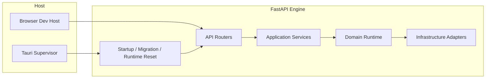
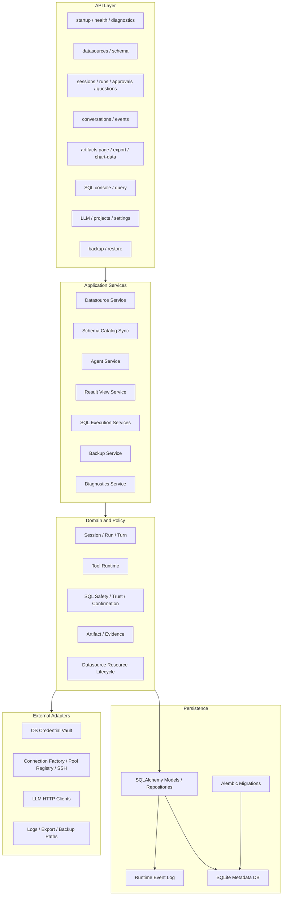
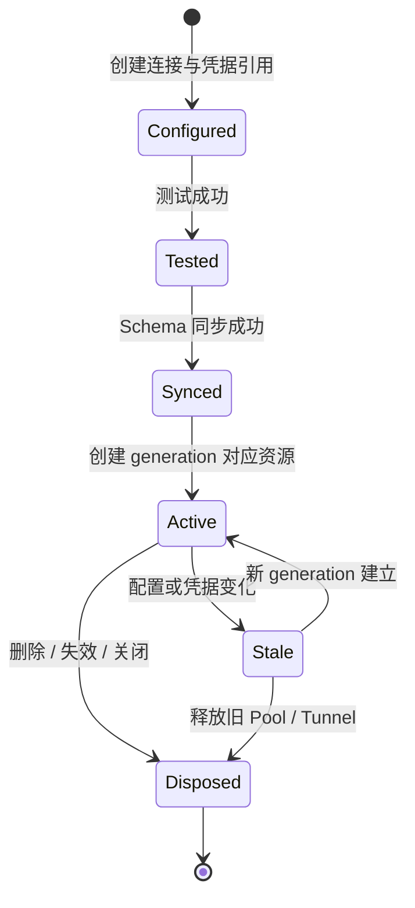
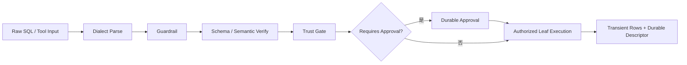
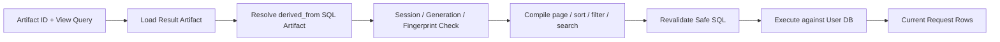
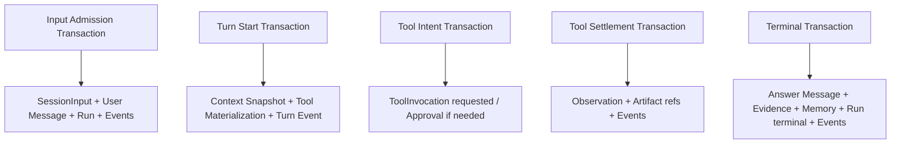
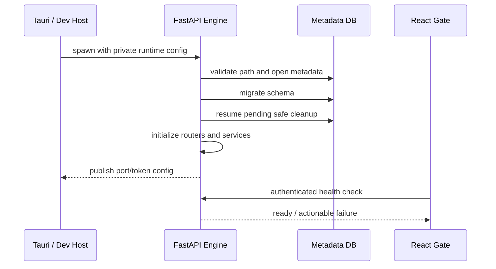
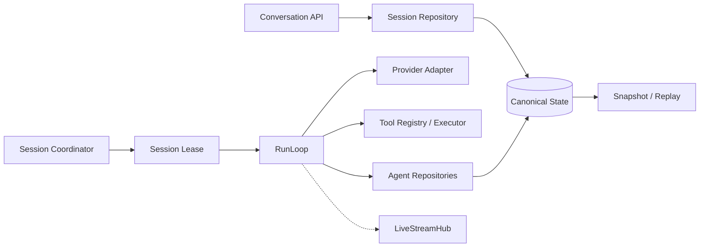

# DBFox 后端架构

> 文档状态：当前后端专题事实源
>
> 最后核验：2026-07-20

## 1. 运行形态

后端是本地 FastAPI 引擎。桌面模式由 Tauri 启动和监督 sidecar；Web 开发模式直接启动同一引擎。两种模式共享 API、领域服务和持久化契约，差异只位于进程生命周期和桌面系统能力。

## 2. 后端分层

依赖方向必须由外向内：API 可以调用 application/domain；domain 通过接口使用基础设施；Repository 和 Adapter 不反向依赖 FastAPI 或前端协议。

## 3. 数据源资源生命周期

资源键由 `datasource_id + generation + profile fingerprint` 构成。更新连接时先提交新 generation，再释放旧 generation 的连接池、SSH 隧道和缓存；旧 Result Artifact 必须通过 generation 校验拒绝继续读取。

凭据规则：

- 元数据库只保存 credential ID；
- 密码和 API Key 进入系统原生 Keyring；
- 测试连接允许短暂使用请求密钥，但不得写日志或普通配置；
- 删除或替换凭据后清理不再引用的安全存储记录。

## 4. SQL 安全执行链

核心约束：

- 实际执行只能使用经过 Policy 固化的 `authorized_input`；
- Approval 展示的 SQL、批准后的 SQL 和叶子执行 SQL 必须具有同一 hash；
- 只读分析、手工 SQL 和 Artifact Result Gateway 复用同一安全决策模型；
- 导出使用流式执行、边界大小和截止时间，不允许无界 `fetchall`。

## 5. Reference-only Result Gateway

Result Artifact 持久化边界：

- 保存：`sourceSqlArtifactId`、`queryFingerprint`、`datasourceGeneration`、列描述、行数、耗时、执行时间、截断状态；
- 不保存：结果行、预览行、图表 series、重复 SQL；
- Chart Artifact 只保存来源 Result Artifact ID 和展示规格。

## 6. 持久化与事务边界

这些事务之间允许进程中断，但每个事务内部不能产生半状态。恢复逻辑只读取已提交状态，不从日志、浏览器缓存或未提交流增量猜测结果。

## 7. 启动、迁移与恢复

Runtime reset 只能操作应用私有目录下的固定路径，并通过持久 pending/completed marker 恢复。备份恢复必须区分元数据库事实与外部用户数据库，不能把外部结果数据复制进元数据库。

## 8. 安全边界

- API 错误通过安全错误映射返回产品原因，不回传内部异常和连接字符串。
- HTTP 请求限制正文大小、字段长度、分页规模、超时和并发资源。
- 诊断日志执行凭据、URL、SQL 参数和结果值脱敏，并有大小和轮转上限。
- LLM endpoint 经过目标策略校验，防止本地地址、凭据 URL 和不受控跳转。
- 文件导出、备份、日志和 runtime reset 都以解析后的受控根目录为边界。
- CSP、Tauri capability 和外部导航共同约束桌面 WebView 权限。

## 9. 扩展边界

- 新数据库通过 `ConnectionProfile`、方言、工厂和受控资源 scope 扩展。
- 新 API 只负责验证、鉴权和 DTO 转换，业务规则进入 service/domain。
- 新持久实体必须同时定义迁移、Repository、事务所有者和恢复语义。
- 新外部调用必须定义超时、取消、脱敏、重试和幂等边界。
- 新 Result 操作必须以 Artifact ID 为入口，不重新接受前端传入 SQL。

## 10. Agent 集成边界

后端 Agent 不是 API Router 内的一段模型调用。Conversation API 只负责接纳命令、读取 snapshot、跟随事件和解析 Approval/Question；SessionCoordinator 与 RunLoop 在 HTTP 连接之外继续执行。

关键约束：

- HTTP/SSE 断开不取消 Run；
- Router 不直接修改 Run/Turn/Invocation 终态；
- Provider 和目标数据库调用位于 metadata 写事务之外；
- Repository 提交必须携带当前 Session lease token；
- Tool Result rows 只能短暂进入当前 ReAct step。

## 11. 并发与一致性

SQLite WAL 允许读写并行，但一次只有一个 writer。Agent aggregate 使用 `BEGIN IMMEDIATE` 在读取可变状态前获得 writer reservation。Session 内通过 lease 串行，Session 间可以并行执行外部调用，并在各自短事务内结算。

| 一致性对象 | 机制 |
|---|---|
| Session sequence | single-writer transaction |
| Run terminal | version + lease fencing |
| Tool exactly-once intent | stable Invocation ID + input hash |
| Approval | expected version + canonical input binding |
| Datasource resource | connection generation + profile fingerprint |
| Event replay | Session sequence + event floor |
| Restore cutover | expected generation compare-and-swap |

## 12. 事件、审计与可观测性

Runtime Event Log 保存版本化公共事件，不保存结果行和调试栈。Snapshot 从 canonical tables 投影；Event Log 达到阈值后保留最近 2,000 条并推进 replay floor。

SecurityAuditRecord 与普通诊断日志分离：前者记录安全动作和结果，后者用于故障排查。审计保留 90 天/20,000 条，诊断导出只包含近 7 天/500 条。两者都执行秘密与结果数据脱敏。

## 13. 性能与资源限制

- API 限制请求体、分页大小和导出规模；
- Run 有 wall deadline、token、cost、turn、tool 和 retry budgets；
- ToolExecutor 限制 timeout、retries、concurrency 与 output bytes；
- QueryRegistry 支持各数据库可用的取消能力；
- Schema 按 datasource 同步并按需检索；
- Result 采用分页/流式导出，不在 metadata 中复制结果集；
- pool/tunnel 都有 generation 生命周期和进程关闭清理。

## 14. 测试与发布证据

后端测试覆盖 migration、SQLite writer 并发、lease、RunControl、ToolExecutor、Provider contract、Artifact 边界、Result Gateway、取消、备份恢复、错误脱敏和审计生命周期。最后一次完整回归为 913 passed、2 skipped；之后新增审计确认专项通过。

发布还需要 Windows MSVC、macOS 和 Linux 候选构建证据。源码架构全绿不等于缺少签名或平台构建时可以发布正式安装包。

## 15. 条件能力

- 高权限工具出现前交付 isolated-process backend；
- 多模型成为产品能力时建立 Provider Route aggregate；
- 公网部署时重新设计身份、租户、任务和事件架构；
- 发布渠道确定后补签名、商店凭据和自动更新。
