# DBFox 数据、SQL 与结果链

> 文档类型：架构说明
>
> 状态：当前
>
> 最后核验：2026-08-16
>
> 适用范围：数据源连接、目录、SQL 安全、执行、分页和结果制品
>
> 代码边界：`engine/connectivity/`、`engine/environment/`、`engine/sql/`、`engine/tools/db/`、`engine/api/agent_results.py`

## 1. 目标和边界

DBFox 将用户数据源视为独立数据平面。模型负责提出分析意图和选择工具，后端负责连接、Catalog、SQL 安全、执行、分页和血缘；完整数据集既不是 Prompt，也不是 Session Memory。

支持的数据源是 MySQL、PostgreSQL、SQLite 和 DuckDB。数据库密码、SSH/TLS 私钥与口令由 OS credential vault 持有，业务表只保存不透明 credential ID 和非秘密连接配置。

## 2. 端到端链路

```mermaid
flowchart LR
  USER["用户或 Agent"] --> CATALOG["Catalog tools"]
  CATALOG --> META["SQLite Schema Catalog"]
  META --> VALIDATE["sql_validate"]
  VALIDATE --> DECISION["Safety decision / SQL Artifact"]
  DECISION --> EXECUTE["sql_execute_readonly"]
  EXECUTE --> FACTORY["ConnectionFactory"]
  FACTORY --> SOURCE["External datasource"]
  SOURCE --> REGISTRY["QueryRegistry / Result backend"]
  REGISTRY --> ARTIFACT["Reference-only Result Artifact"]
  ARTIFACT --> VIEW["inspect / profile / page / chart / export"]
  VIEW --> USER
```

## 3. 连接所有权

- `ConnectionProfile` 是解析后的规范连接模型；平台或调用方不维护第二份字段映射。
- `ConnectionFactory` 是数据源连接、SSH/TLS 和方言资源的统一边界；配置了 SSH 时失败必须 fail closed，不能静默直连。
- 数据源 generation 用于使旧连接、旧审批和旧执行权威失效。
- 连接池和隧道由受控生命周期关闭；API、Catalog、预览和 SQL 执行不得各自建立独立连接路径。

关键实现：`engine/connectivity/profile.py`、`engine/connectivity/factory.py`、`engine/connectivity/lifecycle.py`、`engine/security/credential_vault.py`。

## 4. Schema Catalog

`SchemaCatalogSync` 只接受完整的 `AuthoritativeInventory`。成功快照在一个事务内更新表、列、外键和搜索文档，并在同一事务内用 SQL 原子递增 `DataSource.catalog_revision`；探查失败只记录固定、脱敏的失败状态，不递增 revision，也不得把“无法探查”解释为权威空目录并删除现有 Catalog。Catalog Tool 的 output 与 Observation facts 冻结执行时 revision。

Catalog 工具分工：

- `catalog_overview`：低成本判断目录规模和同步状态；
- `catalog_refresh`：显式刷新权威快照；
- `schema_list`：按范围枚举对象；
- `schema_search`：按名称和语义查找候选；
- `schema_inspect`：检查已明确选中的对象。

模型应先缩小范围再检查对象，不能把整个大型 Schema 一次性放入上下文。

## 5. SQL 安全与执行

模型生成的 SQL 必须经过同一条链：

1. `sql_validate` 解析方言上下文，并由 `SqlSafetyService` 生成执行决定；
2. 决定包含规范 SQL、风险、阻断原因、确认要求和 datasource generation；
3. Tool Runtime 物化不可变验证证据；
4. `sql_execute_readonly` 只消费已结算的安全决定和执行权威；
5. 方言执行器进入原生只读事务，并应用 deadline、取消、行数/字节上限和审计。

内部查询值使用 SQLAlchemy/驱动参数绑定，不能把用户值或模型值拼入 SQL 字符串。只有标识符可经过方言感知的 AST/identifier 路径处理；EXPLAIN、预览、结果读取和导出不得建立旁路。

关键实现：`engine/sql/safety/`、`engine/tools/db/sql_execution.py`、`engine/sql/executor.py`、`engine/sql/execution/`、`engine/policy/authority.py`。

## 6. 大结果和 Artifact

当前 Turn 可以接收有界 Tool Result 以完成推理，但耐久状态只保存：

- 查询/结果 Artifact ID 和关系；
- datasource generation、指纹、列结构、行数、截断和耗时；
- 经 Schema/AST 投影后的安全血缘；
- 固定错误码和有界摘要。

明确不持久化完整 rows、`previewRows`、任意单元格副本或重复 SQL。模型需要继续观察时使用：

- `result_inspect`：分页或按投影读取有界结果；
- `result_profile`：在后端计算分布和统计；
- `chart_create`：引用 Result Artifact 生成图表定义。

前端分页、筛选、排序、图表和导出只提交 Artifact ID 与视图参数。后端解析 datasource、SQL、generation、权限和血缘，避免客户端成为权威来源。

Artifact wire contract：`type` 为 string，`schema_version` 独立表达 payload schema 版本；现有 `sql/safety/result_view/chart` 固定为 schema v1，`version` 继续表示 semantic-key 工作产品版本。新 Extension type 必须 namespaced；未知历史 type/version 保留 envelope 并 fail-soft，未知新写入拒绝。前端 generated client 已同步 `schema_version`。

## 7. 失败和安全语义

- 驱动、隧道、Vault、SQL 和数据内容中的任意异常文本都不可信，只能映射到固定公开错误。
- 被取消、超时、连接 generation 变化或结果不完整的执行不能生成成功 Artifact。
- 非幂等操作不因 Runtime 重启或网络结果不明而自动重放。
- 日志、Tool Observation、Provider output、持久化和 UI 使用同一脱敏合同。
- 导出必须复用执行 deadline、取消、权限、脱敏和受控临时文件生命周期。

## 8. 验证入口

- 连接边界：`verification/tests/system/test_connectivity_boundary.py`
- Catalog 权威同步：`verification/tests/system/test_authoritative_schema_sync.py`、`verification/tests/system/test_schema_catalog_sync.py`
- SQL 工具与安全：`verification/tests/system/test_db_tools.py`、`verification/tests/system/test_sql_safety_service.py`
- Result API：`verification/tests/system/test_agent_results_api.py`
- 跨边界合同：`verification/tests/system/test_engineering_contracts.py` 及对应 Agent Harness 场景集

真实数据库、SSH/TLS、驱动动态链接和大结果性能仍需在目标平台/数据源执行受控集成验收；确定性单元测试不替代这些证据。
