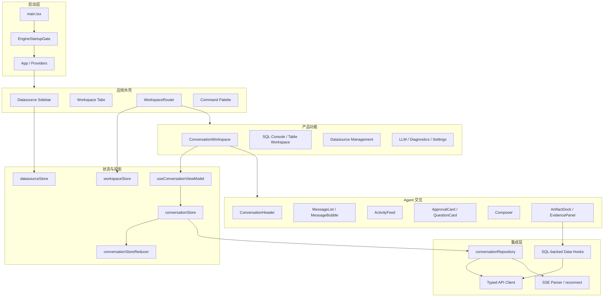
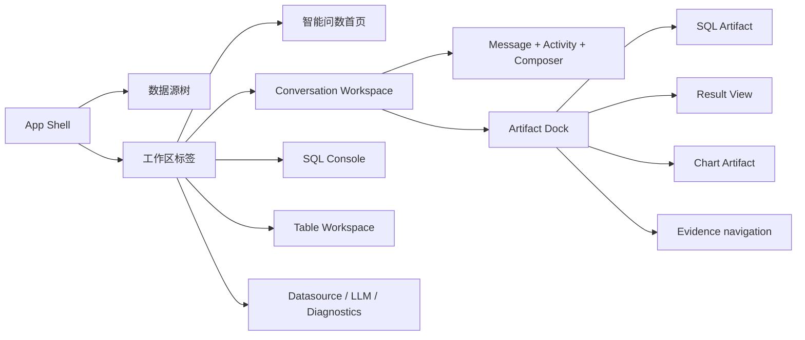
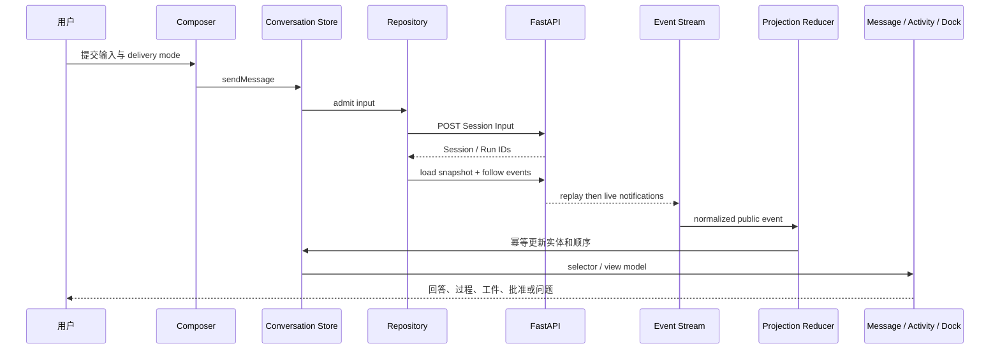
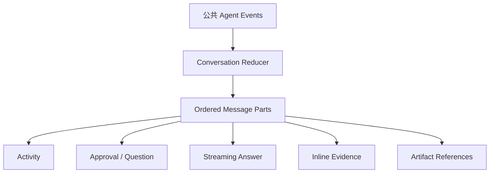
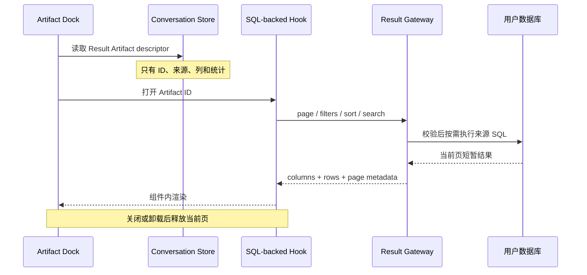

# DBFox 前端架构

> 文档状态：当前前端专题事实源
>
> 最后核验：2026-07-20

## 1. 设计目标

前端是 Agent 公共事实的产品投影，而不是第二套 Runtime。它负责工作区导航、流式呈现、人机中断交互、工件浏览和当前页查询结果，但不自行决定 Run、Approval、Evidence 或 Artifact 的权威状态。

## 2. 分层架构

## 3. 工作区组件关系

布局原则：

- 左侧是数据库环境导航；中间是会话和过程；右侧是当前工件。
- 工件区属于 Conversation Workspace，不作为独立事实源。
- 窄窗口允许工件区折叠并保存布局状态，但不能丢失选中 Artifact ID。
- 设置页复用统一 scaffold，状态色只表达状态，品牌色只表达选中和主操作。

## 4. 会话数据流

恢复顺序固定为：

1. 加载 Conversation Snapshot；
2. 从 snapshot cursor 重放已提交事件；
3. 切换到 live 通知；
4. 发现 sequence gap 时放弃局部猜测，重新加载 snapshot。

## 5. Message Parts 与过程呈现

设计约束：

- Activity Feed 展示产品动作和公开 reasoning summary，不展示私有 chain-of-thought。
- live 活动与 snapshot 活动使用稳定 ID，刷新后不得生成重复步骤。
- Approval/Question 在待处理时固定靠近 Composer；处理后成为只读历史部分。
- Answer 使用增量合并和平滑显示；终态消息以持久投影为准。
- Citation 由 Markdown AST 插件解析为句内 Evidence 按钮，不依赖字符串后处理。
- Markdown 不解析通用 raw HTML；GFM、Citation 和安全换行都在 AST 层处理，最终仍经过 sanitize。
- Live envelope 使用 `live_id + channel_revision + operation`；正常流为 `append`，重连先接收 `replace` 快照再继续 append，避免首段缺失或重复。

## 6. Artifact Dock 与 SQL-backed 数据

Result Gateway 的页面响应同时携带 `originalExecutedAt` 与 `viewExecutedAt`。UI 必须并列显示“分析取数”和“当前重查”，并说明当前表格不是历史快照；Evidence 的 `observedAt` 仍代表回答当时的最小事实。

禁止进入 Conversation Store、localStorage、IndexedDB 或 SSE Artifact 事件的字段：

- `rows`
- `previewRows`
- Chart `series`
- 任意结果单元格副本

## 7. 状态边界

| 状态类型 | 所有者 | 示例 |
|---|---|---|
| 导航状态 | `workspaceStore` | 活动标签、标签顺序、工件区布局 |
| 数据源导航状态 | `datasourceStore` | 当前数据源、Schema 树、同步状态 |
| 会话公共投影 | `conversationStore` | Message、Run、Activity、Artifact、Evidence |
| 组合视图 | `useConversationViewModel` | 当前 Run、排序后的消息和工件 |
| 当前页面数据 | 组件/SQL-backed hook | Result 当前页、Chart 当前序列 |
| 服务端事实 | FastAPI + 元数据库 | Run 状态、Approval、Artifact 关系、Event sequence |

## 8. 扩展边界

- 新工作区类型通过 `WorkspaceRouter` 和 workspace type 注册，不向 App 添加业务分支。
- 新 Artifact 类型通过统一 Artifact model、renderer 和 dock projection 扩展。
- 新公共事件先定义后端契约和 reducer，再增加视图；视图不得解析原始调试事件。
- 新流式 channel 必须定义去重身份、持久化替代物和断流恢复语义。
- 通用视觉能力进入 `components/ui` 或 `components/settings`，业务状态留在 feature 内。

## 9. 视觉系统与交互语义

前端使用语义 Token 表达 background、panel、border、text、focus、brand 和 status。品牌主色为紫色，数据强调可使用青色；warning/success/danger 只表达状态，狐狸品牌不依赖橙色。

交互状态必须一致：

- 主操作、选中 Tab、focus ring 使用品牌语义；
- warning/success 不能同时出现在同一操作的最终状态；
- disabled 必须说明原因，不能只有低透明度；
- loading 使用产品动作描述，不暴露内部健康检查或技术码；
- 点击区域至少 28–32px，辅助文字不低于 12px。

## 10. 可访问性

Radix 负责 Dialog、Tabs、Collapsible 等焦点管理。自定义列表、Activity、Artifact 和数据表必须提供 role、accessible name、键盘操作和清晰 focus。动画尊重 `prefers-reduced-motion`。

Approval/Question 属于阻塞性交互：待处理卡靠近 Composer，并且屏幕阅读器能获知风险、状态和可执行动作；处理后变为只读历史，不从 DOM 无痕消失。

## 11. 性能策略

- 长对话超过阈值后使用 TanStack Virtual；
- 动态虚拟位置写入 nonce CSSOM，不违反 CSP；
- SSE event 先批处理再进入 reducer，避免 token 级全树重渲染；
- streaming text 使用平滑展示，但 committed Message 到达后立即归并；
- Chart/ECharts 和重型 Artifact renderer 延迟加载；
- Result 新请求取消旧请求，过期 response 通过 sequence 丢弃；
- bundle budget 分别约束 initial entry 和 deferred chart chunk。

## 12. 错误、取消与恢复

API error 先映射为用户可理解文案，技术 detail 留在诊断。EngineStartupGate 区分 starting/ready/failed/stopped，失败提供重试和诊断入口。

组件卸载、来源变化和用户取消会传播 AbortSignal。AbortError 不显示为业务失败。SSE 关闭不等于 Run 失败，UI 会重载 snapshot 或继续跟随；只有 committed terminal state 能显示最终完成/失败/取消。

收到 committed `run.cancelled` 后，Reducer 将该 Run 尚未结算的 pending/running/waiting Activity 统一投影为 cancelled，并保留已产生的回答草稿、步骤和 Artifact。取消不是失败，也不删除已有产品成果。

## 13. 测试策略

前端测试分为：

- reducer/event contract：去重、gap、correlation、Plan、Approval、Artifact；
- product interaction：Composer、Activity、Question、Artifact Dock、SQL-backed table；
- accessibility：焦点、role、label、键盘、reduced motion；
- security：CSP、sanitize、外部导航、secret-safe error；
- engineering：TypeScript、ESLint、production build、bundle budget。

最后一次完整回归为 76 files / 411 tests passed；production build 和 bundle budget 通过。

## 14. 关键文件

| 领域 | 文件 |
|---|---|
| 启动 | `desktop/src/components/EngineStartupGate.tsx` |
| Workspace | `desktop/src/features/appShell/WorkspaceRouter.tsx` |
| Conversation | `desktop/src/features/conversation/workspace/ConversationWorkspace.tsx` |
| Reducer | `desktop/src/stores/conversationStoreReducer.ts` |
| Stream | `desktop/src/features/conversation/conversationRepository.ts` |
| Activity | `desktop/src/features/conversation/workspace/ActivityFeed.tsx` |
| Artifact Dock | `desktop/src/features/conversation/workspace/ArtifactDock.tsx` |
| Result state | `desktop/src/features/workspace/sqlBacked/useSqlBackedDataView.ts` |
| Tokens | `desktop/src/styles/tokens.css` |
