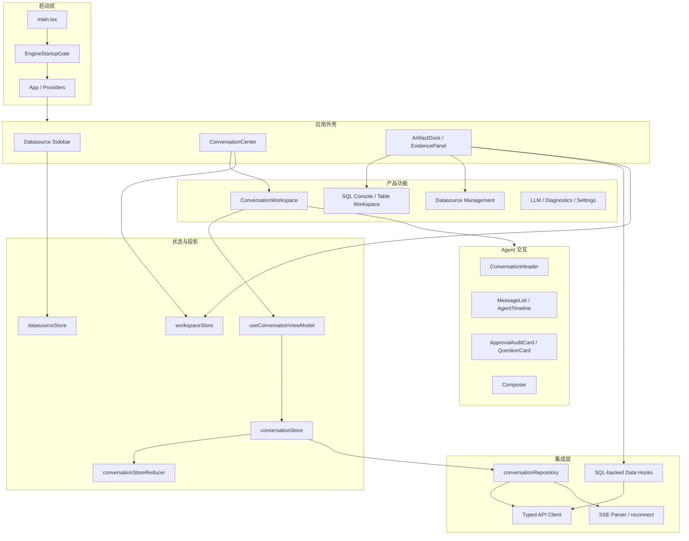
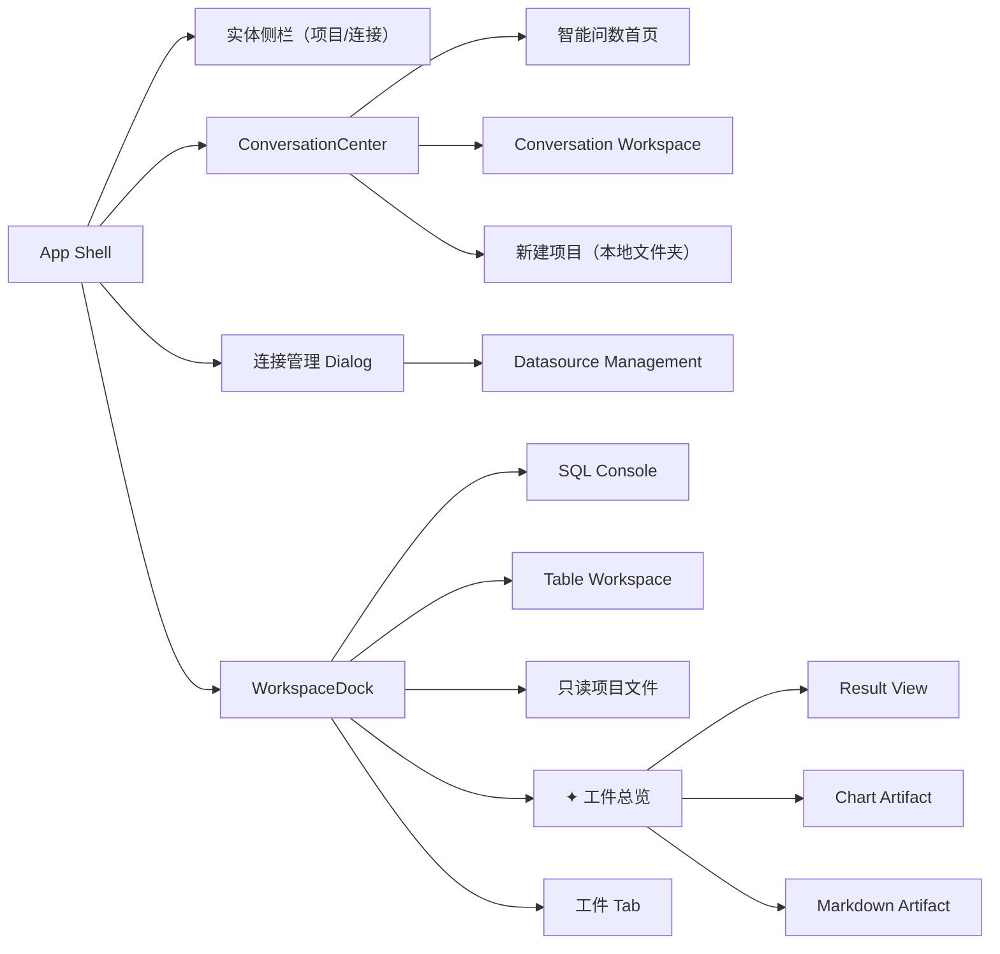
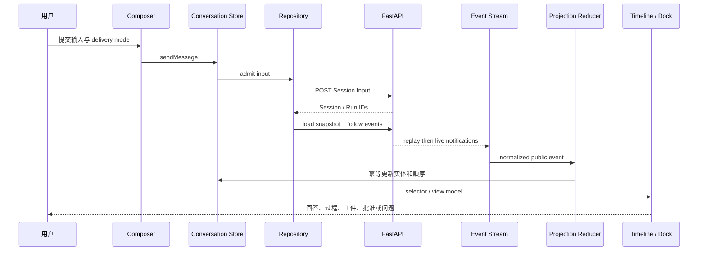
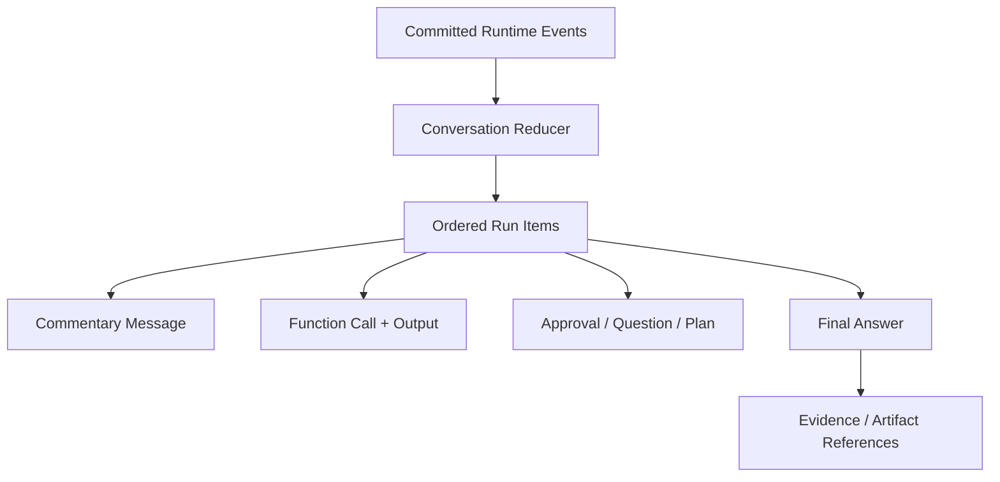
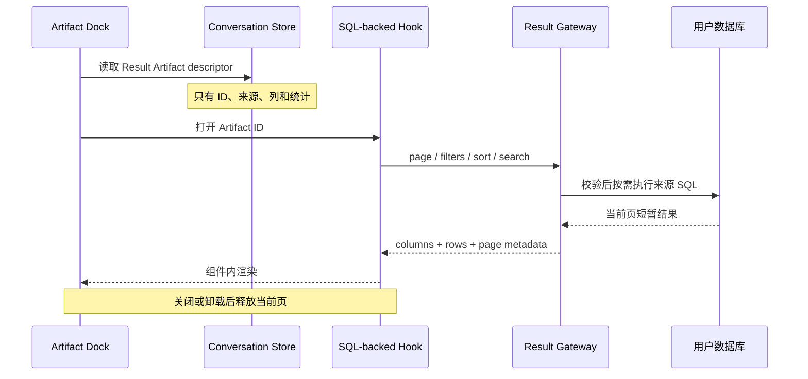

# DBFox 前端架构

> 文档类型：架构说明
>
> 状态：当前
>
> 最后核验：2026-08-16
>
> 适用范围：`desktop/src/` 的工作区、传输、状态和用户交互
>
> 目标实施基线：已接受的 [Workbench Shell 与 Workspace Dock](./workbench-shell-workspace-dock.md) 和 [迁移规范](./workbench-shell-migration-guide.md)。本文继续描述当前迁移中的实现；两文档冲突时，当前代码与测试是第一事实源，已接受 ADR 是目标合同。

## 1. 设计目标

前端是 Agent 公共事实的产品投影，而不是第二套 Runtime。它负责工作区导航、流式呈现、人机中断交互、工件浏览和当前页查询结果，但不自行决定 Run、Approval、Evidence 或 Artifact 的权威状态。

## 2. 分层架构

```mermaid
flowchart TB
  subgraph Boot["启动层"]
    MAIN["main.tsx"]
    GATE["EngineStartupGate"]
    APP["App / Providers"]
  end

  subgraph Shell["应用外壳"]
    SIDEBAR["Datasource Sidebar"]
    CENTER["ConversationCenter"]
    DOCK["WorkspaceDock"]
  end

  subgraph Features["产品功能"]
    CONV["ConversationWorkspace"]
    SQL["SQL Console / Table Workspace"]
    DS["Datasource Management"]
    SETTINGS["LLM / Diagnostics / Settings"]
  end

  subgraph Conversation["Agent 交互"]
    HEADER["ConversationHeader"]
    MESSAGES["MessageList / AgentTimeline"]
    INTERRUPT["ApprovalAuditCard / QuestionCard"]
    COMPOSER["Composer"]
    DOCK["ArtifactDock / EvidencePanel"]
  end

  subgraph State["状态与投影"]
    WORKSPACE["workspaceStore"]
    DATASOURCE["datasourceStore"]
    STORE["conversationStore"]
    REDUCER["conversationStoreReducer"]
    VM["useConversationViewModel"]
  end

  subgraph Integration["集成层"]
    REPO["conversationRepository"]
    API["Typed API Client"]
    SSE["SSE Parser / reconnect"]
    RESULT["SQL-backed Data Hooks"]
  end

  MAIN --> GATE --> APP --> Shell
  CENTER --> CONV
  DOCK --> SQL
  DOCK --> DS
  CONV --> Conversation
  CONV --> VM
  VM --> STORE
  STORE --> REDUCER
  STORE --> REPO
  REPO --> API
  REPO --> SSE
  DOCK --> RESULT --> API
  CENTER --> WORKSPACE
  DOCK --> WORKSPACE
  SIDEBAR --> DATASOURCE
```

## 3. 工作区组件关系

```mermaid
flowchart LR
  APP["App Shell"] --> TREE["实体侧栏（项目/连接）"]
  APP --> CENTER["ConversationCenter"]
  APP --> DOCK["WorkspaceDock"]
  APP --> MODAL["连接管理 Dialog"]

  CENTER --> HOME["智能问数首页"]
  CENTER --> CONV["Conversation Workspace"]
  CENTER --> PROJECT["新建项目（本地文件夹）"]

  MODAL --> DS["Datasource Management"]

  DOCK --> SQL["SQL Console"]
  DOCK --> TABLE["Table Workspace"]
  DOCK --> FILE["只读项目文件"]
  DOCK --> ARTIFACTS["✦ 工件总览"]
  DOCK --> ARTIFACT["工件 Tab"]

  ARTIFACTS --> RESULT["Result View"]
  ARTIFACTS --> CHART["Chart Artifact"]
  ARTIFACTS --> NOTE["Markdown Artifact"]
```

布局原则：

- 左侧是实体导航：顶层「项目/连接」胶囊切换。项目行内是「对话/文件」子胶囊，连接行内是「对话/数据库」子胶囊；下方内容随当前实体子模式直接切换，不再出现“对话列表/文件/数据库对象树”这类分区标题。项目图标使用 Folder 激活/非激活两态，连接使用官方数据库图标，当前数据库节点使用数据源品牌图标。
- 中间只放对话与「新建项目」表单。新建项目由 Electron preload 的 `pickProjectFolder` 弹出系统文件夹选择器，自动用文件夹名作为项目名，并把 `workspace_root` 写入 Project API；表单提交后回到智能问数首页。
- 新建连接采用 Navicat 式 `Dialog` 弹窗承载 `DataSourcesPage`，不再让数据源管理页占满中间对话区；旧 `centerMode === "datasource"` 分支和 `openDatasourceCenter`/`centerDatasourceMode` Shell 状态已删除，命令面板的「管理连接」动作改为打开该 Dialog。
- 项目「文件」子模式通过 Electron preload 的 `listProjectFolder` 逐层懒加载本地目录（跳过 `.git`、`node_modules`、`target` 等重目录），点击文本文件用 `readProjectFile` 读取（UTF-8、≤ 1 MiB），并在 Dock 打开只读 `dbfox.workspace.file` 视图；文件内容不进入 Shell Store。
- 顶部不再显示项目名与连接状态。
- 右侧 `WorkspaceDock` 是统一 Tab 容器：SQL 控制台、表详情、只读项目文件、工件总览和工件 Tab 都在这里。项目文件 Tab 按 `projectId` 对当前 Project 可见，切换 Project 后其他 Project 的文件 Tab 隐藏。
- Shell/View 状态已分 owner：`workspaceStore` 只保存 Shell identity/layout 和通用 `openDockTab`/`updateDockTab`；SQL draft/entries 归 `sqlConsoleStore`，表选择/表子页归 `tableWorkspaceStore`，工件/文件 Dock 打开动作归 `artifactDockStore`/`workspaceFileStore`。`WorkspaceDockTabKind` 是开放 string，未知 view 走统一 fallback。
- 对话历史只保留在左侧项目卡内的对话列表；不再提供独立的「历史记录」入口，也不再作为 Dock Tab。
- 「✦ 工件」Tab 的内容是 `ArtifactDock` 的列表 + 预览结构，工件事实仍属于 Conversation Store 与后端制品，不作为独立事实源。
- Dock 可展开/收起；窄窗口下保持对话可用，打开或关闭 Dock 不丢失选中 Artifact ID。
- 设置页复用统一 scaffold，状态色只表达状态，品牌色只表达选中和主操作。
- 旧 `WorkspaceTabs` / `WorkspaceRouter` 及其测试已删除；`AppCommandPalette` 保留并由 `Ctrl/Cmd+K` 接线到新 Shell actions（`showSmartQueryHome` / 连接管理 Dialog / `openDockTable`），历史页命令不再存在。`workspaceStore` 的 legacy `tabs` 状态、`openXxxTab()` actions、`openSqlConsole` 与 `_tabSeq` 已删除。`ConversationWorkspace` 已不再拥有内部 `ArtifactDock` layout container，工件只在右栏 Dock 渲染。`ContextDrawer` 改收 `WorkspaceDockTab`，`WorkspaceTab`/`WorkspaceTabType` legacy 类型已从生产路径移除。

## 4. 会话数据流

```mermaid
sequenceDiagram
  participant User as 用户
  participant Composer as Composer
  participant Store as Conversation Store
  participant Repo as Repository
  participant API as FastAPI
  participant SSE as Event Stream
  participant Reducer as Projection Reducer
  participant View as Timeline / Dock

  User->>Composer: 提交输入与 delivery mode
  Composer->>Store: sendMessage
  Store->>Repo: admit input
  Repo->>API: POST Session Input
  API-->>Repo: Session / Run IDs
  Repo->>API: load snapshot + follow events
  API-->>SSE: replay then live notifications
  SSE->>Reducer: normalized public event
  Reducer->>Store: 幂等更新实体和顺序
  Store->>View: selector / view model
  View-->>User: 回答、过程、工件、批准或问题
```

恢复顺序固定为：

1. 加载 Conversation Snapshot；
2. 从 snapshot cursor 重放已提交事件；
3. 切换到 live 通知；
4. 发现 sequence gap 时放弃局部猜测，重新加载 snapshot。

## 5. Responses Items 与过程呈现

```mermaid
flowchart TB
  EVENT["Committed Runtime Events"] --> REDUCER["Conversation Reducer"]
  REDUCER --> ITEMS["Ordered Run Items"]
  ITEMS --> COMMENTARY["Commentary Message"]
  ITEMS --> TOOL["Function Call + Output"]
  ITEMS --> APPROVAL["Approval / Question / Plan"]
  ITEMS --> ANSWER["Final Answer"]
  ANSWER --> CITE["Evidence / Artifact References"]
```

设计约束：

- Agent Timeline 按服务端 sequence 展示 commentary、工具调用、工具结果、Plan、Approval、Question 和 final answer，不展示私有 chain-of-thought。
- live Item 与 snapshot Item 使用稳定 ID 和 revision，刷新后不得生成重复步骤。
- Approval/Question 在待处理时固定靠近 Composer；处理后成为只读历史部分。
- Answer 使用增量合并和平滑显示；终态消息以持久投影为准。
- Citation 由 Markdown AST 插件解析为句内 Evidence 按钮，不依赖字符串后处理。
- Markdown 不解析通用 raw HTML；GFM、Citation 和安全换行都在 AST 层处理，最终仍经过 sanitize。
- Live delta 使用稳定的 `item_id + revision + offset` 追加到已开始的 RunItem；断线后以 snapshot 的完整持久内容为准，再从 durable event cursor 继续，避免首段缺失或重复。

## 6. Artifact Dock 与 SQL-backed 数据

```mermaid
sequenceDiagram
  participant Dock as Artifact Dock
  participant Store as Conversation Store
  participant Hook as SQL-backed Hook
  participant API as Result Gateway
  participant DB as 用户数据库

  Dock->>Store: 读取 Result Artifact descriptor
  Note over Store: 只有 ID、来源、列和统计
  Dock->>Hook: 打开 Artifact ID
  Hook->>API: page / filters / sort / search
  API->>DB: 校验后按需执行来源 SQL
  DB-->>API: 当前页短暂结果
  API-->>Hook: columns + rows + page metadata
  Hook-->>Dock: 组件内渲染
  Note over Hook,Dock: 关闭或卸载后释放当前页
```

Result Gateway 的页面响应同时携带 `originalExecutedAt` 与 `viewExecutedAt`。UI 必须并列显示“分析取数”和“当前重查”，并说明当前表格不是历史快照；Evidence 的 `observedAt` 仍代表回答当时的最小事实。

禁止进入 Conversation Store、localStorage、IndexedDB 或 SSE Artifact 事件的字段：

- `rows`
- `previewRows`
- Chart `series`
- 任意结果单元格副本

### 6.1 数据单元格展示合同

表数据预览与 Result Artifact 复用 `CellValuePreview` 作为只读值展示入口。它只负责把当前页已有值投影为适合网格阅读的形式，不改变数据库值、不回写数据，也不建立第二份结果缓存。完整交互、分类和验收规范见[数据网格与值查看规范](../specs/data-grid.md)。

| 值类型 | 网格表现 | 按需查看 | 安全边界 |
|---|---|---|---|
| `NULL`、布尔、数字、日期 | 固定的紧凑语义样式 | 不额外加载 | 保留原始复制文本 |
| JSON 对象或数组 | 类型与成员数摘要 | 结构树和格式化详情 | 只解析合法对象或数组；无效 JSON 按普通文本显示 |
| 长文本或多行文本 | 类型标签与单行截断摘要 | 有界悬浮预览；点击打开完整 Value Viewer | 保留原始换行；网格不展开整段内容 |
| 普通 HTTPS URL | 省略显示并带外部链接图标 | 点击先进入 Value Viewer，再由明确动作交给 Electron shell boundary | 只允许 HTTPS；前后端边界重复校验 |
| HTTPS 图片 URL | 图片类型入口，不自动请求远端 | 稳定悬浮约 400ms 后快速预览；点击在应用内完整查看；可再次选择外部打开 | 仅识别受支持图片后缀或已知图片处理参数；使用 `no-referrer`；失败显示固定状态 |
| 二进制 | 仅在二进制列中识别后端 `<binary>` 占位 | Viewer 解释原始字节未进入当前合同 | 不把普通字符串 `<binary>` 当占位，不伪造预览或下载 |

图片预览只放宽 CSP 的 `img-src` 到 HTTPS，不放宽 `connect-src`，也不经过临时文件、下载目录或自建图片代理。数据库中的 URL 只有在稳定悬浮意图成立或用户点击后才创建 ``；掠过单元格或在延迟内移开不会请求远端。固定尺寸悬浮框只约束布局，不承诺减少下载量：没有服务端缩略图合同时，浏览器仍会请求原始图片。`file:`、`javascript:`、HTTP 和其他协议不可点击、不可加载。

该设计沿用 DataGrip/DBeaver 的“紧凑网格 + 按需 Value Viewer”边界：复杂值详情不占用行高，完整内容只在用户选择单元格后出现。当前实现保持只读，不引入它们的单元格编辑、LOB 下载或二进制编辑能力。

设计依据：

- [DataGrip：View data](https://www.jetbrains.com/help/datagrip/tables-view-data.html) 将 JSON、数组、长值和图片放入独立 Value editor，而不是扩大主网格行高；
- [DBeaver：Value Panel](https://dbeaver.com/docs/team-edition/desktop/Value-Panel/) 按 Text、JSON、Binary、Image 等内容类型提供专用查看方式；
- Electron app protocol 的 CSP 只开放应用确实需要的资源来源，因此图片只扩展 `img-src`，不扩展脚本、frame 或通用网络请求能力。

## 7. 状态边界

| 状态类型 | 所有者 | 示例 |
|---|---|---|
| 导航状态 | `workspaceStore` | `activeProjectId`、per-project `projectShell` 与 `mainSurfaceByProject`（ConversationCenter 已消费固定 Main Surface）、中间模式、右栏 Dock 开合与 Tab 顺序、**一个 Project 一个 canonical SQL console state**（`sql-{projectId}`）、Table datasource+table dedup 与 MultiTable canonical sorted set identity、工件区布局；真实 Project list/create 由 `projectsApi` / `useProjectState` 投影 |
| 本机外观偏好 | `ThemeProvider` + localStorage | 主题模式、受控色板、分区字号 |
| 数据源导航状态 | `datasourceStore` | 当前数据源、Schema 树、同步状态 |
| 会话公共投影 | `conversationStore` | Run、Run Item、Artifact、Approval、Question、Plan |
| 组合视图 | `useConversationViewModel` | 当前 Run、排序后的消息和工件 |
| 当前页面数据 | 组件/SQL-backed hook | Result 当前页、Chart 当前序列 |
| 服务端事实 | FastAPI + 元数据库 | Run 状态、Approval、Artifact 关系、Event sequence |

## 8. 扩展边界

- 新工作区类型通过 `WorkspaceDock` 的 Tab kind 与渲染器注册，不向 App 添加业务分支；未来 WebView 等 Tab 只增加 kind。当前 presentation/visibility/render 均已收敛到 `dockViewRegistry.tsx` + `dockViewContent.tsx`（`core.sql-console` / `dbfox.data.table` / `core.artifact` 等），`WorkspaceDock` 只按 contribution 渲染，unknown view 走元数据 fallback。
- 新 Artifact 类型通过统一 Artifact model、renderer 和 dock projection 扩展。
- 新公共事件先定义后端契约和 reducer，再增加视图；视图不得解析原始调试事件。
- 新流式 channel 必须定义去重身份、持久化替代物和断流恢复语义。
- 通用视觉能力进入 `components/ui` 或 `components/settings`，业务状态留在 feature 内。

## 9. 视觉系统与交互语义

前端使用语义 Token 表达 background、panel、border、text、focus、brand 和 status。品牌主色为紫色，数据强调可使用青色；warning/success/danger 只表达状态，狐狸品牌不依赖橙色。

交互状态必须一致：

- 主操作、选中 Tab、focus ring 使用品牌语义；
- warning/success 不能同时出现在同一操作的最终状态；
- disabled 必须说明原因，不能只有低透明度；
- loading 使用产品动作描述，不暴露内部健康检查或技术码；
- 点击区域至少 28–32px，辅助文字不低于 12px。

### 9.1 外观偏好合同

外观设置由 `ThemeProvider` 作为进程内唯一权威，版本化偏好只保存在本机
`dbfox-appearance-v1`。它不进入数据库、会话、诊断包或模型上下文。启动时只对旧的
`dbfox-theme` 明暗值执行一次单向迁移，不保留新旧双写。

- 主题模式为 `system | light | dark`；`system` 通过 React 外部状态订阅跟随操作系统。
- 强调色和中性色来自经过浅色/深色校准的封闭枚举；不接受任意 CSS 或十六进制输入，避免破坏对比度、状态色和焦点环。
- 字号按 UI、数据表、SQL/代码、Agent 对话四个真实阅读场景独立设置，使用受控整数 px：UI 11–16、数据 10–18、代码 11–22、Agent 13–24；组件继续引用语义字号 Token，不保存逐组件覆盖。
- 密度使用 `compact | standard | comfortable` 统一控制工具栏、按钮和主要留白；UI、数据、代码字体家族分别选择受控的本机字体栈。
- Agent 与 SQL/代码行高独立；数据表可配置默认行高、网格线、斑马纹、NULL 呈现和默认主键冻结，不改变手动列固定能力。
- 高对比度、减少动效同时支持显式设置和系统媒体查询；系统 DPI 交给 Electron Chromium，不叠加 CSS zoom。
- 数据源侧栏与 Agent 工件面板把拖拽结果写回同一偏好文档；原生窗口位置与尺寸由官方 Window State 插件独占，不保存第二份窗口坐标。
- 导入/导出使用同一严格 schema，拒绝未知字段与超大文件；结构上不包含 Token、密码、DSN、SQL、会话或日志。
- `ThemeProvider` 只把规范偏好投影为根元素的 `data-*` 属性；`tokens.css` 是色彩和字号的唯一视觉事实来源。
- 设置即时预览并自动保存；重置恢复系统主题、紫色强调、冷灰中性色和标准字号。
- ECharts 在外观投影提交后重新读取同一组 CSS Token，不维护第二份图表主题配置。

这个边界参考成熟桌面工具的“用户设置 + 即时预览”模式和主题系统的受控参数设计，
没有引入新的主题库、任意颜色解析器、兼容 mapper 或组件级持久化。

## 10. 可访问性

Radix 负责 Dialog、Tabs、Collapsible 等焦点管理。自定义列表、Activity、Artifact 和数据表必须提供 role、accessible name、键盘操作和清晰 focus。动画尊重 `prefers-reduced-motion`。

Approval/Question 属于阻塞性交互：待处理卡靠近 Composer，并且屏幕阅读器能获知风险、状态和可执行动作；处理后变为只读历史，不从 DOM 无痕消失。

## 11. 性能策略

- 长对话超过阈值后使用 TanStack Virtual；
- 动态虚拟位置写入 nonce CSSOM，不违反 CSP；
- SSE event 先批处理再进入 reducer，避免 token 级全树重渲染；
- streaming text 使用平滑展示，但 committed Message 到达后立即归并；
- Chart/ECharts 和重型 Artifact renderer 延迟加载；
- Result 新请求取消旧请求，过期 response 通过 sequence 丢弃；
- bundle budget 分别约束 initial entry 和 deferred chart chunk。

## 12. 错误、取消与恢复

API error 先映射为用户可理解文案，技术 detail 留在诊断。EngineStartupGate 区分 starting/ready/failed/stopped，失败提供重试和诊断入口。

组件卸载、来源变化和用户取消会传播 AbortSignal。AbortError 不显示为业务失败。SSE 关闭不等于 Run 失败，UI 会重载 snapshot 或继续跟随；只有 committed terminal state 能显示最终完成/失败/取消。

收到 committed `run.cancelled` 后，Reducer 将该 Run 尚未结算的 pending/running/waiting Activity 统一投影为 cancelled，并保留已产生的回答草稿、步骤和 Artifact。取消不是失败，也不删除已有产品成果。

## 13. 测试策略

前端测试分为：

- reducer/event contract：去重、gap、correlation、Plan、Approval、Question、Artifact；
- product interaction：Composer、Agent Timeline、Question、Artifact Dock、SQL-backed table；
- accessibility：焦点、role、label、键盘、reduced motion；
- security：CSP、sanitize、外部导航、secret-safe error；
- engineering：TypeScript、ESLint、production build、bundle budget。

具体通过数量会随测试增长而变化，不在架构事实文档中固化。当前结果以绑定 commit 的 CI
记录为准；权威命令和门禁范围见[工程质量门禁](../quality/engineering-gates.md)。

## 14. 关键文件

| 领域 | 文件 |
|---|---|
| 启动 | `desktop/src/components/EngineStartupGate.tsx` |
| Workspace Shell | `desktop/src/stores/workspaceStore.ts`、`desktop/src/features/appShell/WorkspaceDock.tsx` |
| Dock Registry | `desktop/src/features/appShell/dockViewRegistry.tsx`、`dockViewContent.tsx` |
| 实体侧栏 | `desktop/src/features/datasource/DataSourceTree.tsx` |
| 新建项目/本地文件 | `desktop/src/features/projects/ProjectCreateForm.tsx`、`useProjectFolderTree.ts`、`desktop/src/lib/projectFolder.ts`、`desktop/main/nativeCapabilities.ts` |
| 连接管理 Dialog | `desktop/src/features/datasource/ConnectionDialog.tsx`、`desktop/src/pages/DataSourcesPage.tsx` |
| 只读项目文件视图 | `desktop/src/features/workspace/WorkspaceFileDock.tsx` |
| Conversation | `desktop/src/features/conversation/workspace/ConversationWorkspace.tsx` |
| Reducer | `desktop/src/stores/conversationStoreReducer.ts` |
| Stream | `desktop/src/features/conversation/conversationStreamRuntime.ts`、`conversationRepository.ts` |
| Timeline | `desktop/src/features/conversation/workspace/MessageList.tsx`、`AgentTimeline.tsx` |
| Artifact Dock | `desktop/src/features/conversation/workspace/ArtifactDock.tsx` |
| Result state | `desktop/src/features/workspace/sqlBacked/useSqlBackedDataView.ts` |
| Tokens | `desktop/src/styles/tokens.css` |
| Appearance contract | `desktop/src/lib/appearance.ts`、`desktop/src/hooks/useTheme.tsx` |
| Appearance settings | `desktop/src/features/settings/AppearanceSettingsPanel.tsx` |
