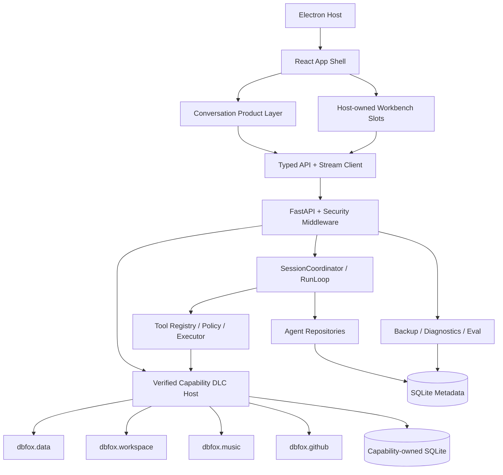
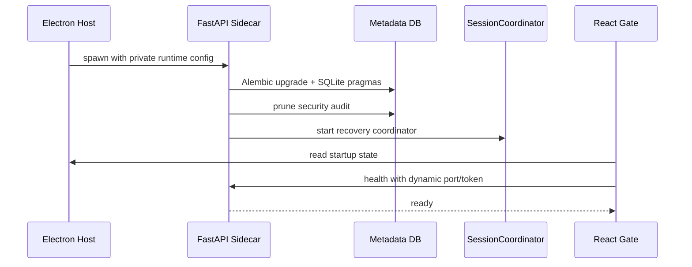
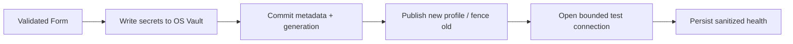
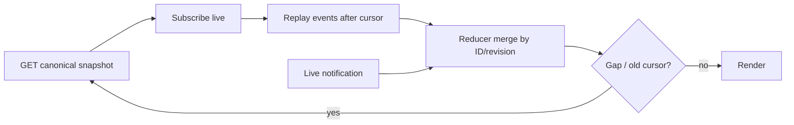

# DBFox 功能和代码索引

> 文档类型：代码索引
>
> 状态：当前
>
> 最后核验：2026-08-25
>
> 适用范围：启动、Agent Core、Capability DLC、Workbench、工具、事件、取消和恢复链路
>
> 配套总览：[当前系统架构](./system-overview.md)

## 1. 分析范围

本文从“入口 → 领域状态 → 副作用 → 持久化 → 产品反馈”的角度描述当前模块和完整执行管线。它不再描述已删除的 LangGraph、Graph node、checkpoint SQLite、旧 `agent_runtime` 或前端 RunTrace。

每条管线都回答六个问题：

1. 谁触发；
2. 哪个模块拥有状态；
3. 哪些输入被信任或重新校验；
4. 哪些副作用发生；
5. 失败、取消和重放如何结算；
6. 用户最终看到什么。

## 2. 模块总图



## 3. 模块职责矩阵

| 模块 | 主要职责 | 主要输入 | 主要输出 | 权威状态 | 禁止承担 |
|---|---|---|---|---|---|
| Electron Host | sidecar 生命周期、端口/token、窗口与外部导航；解析安全的 `DBFOX_ENGINE_FATAL` 启动诊断 | 安装资源、运行参数 | Engine status/config/failure fingerprint | 进程状态 | Agent 业务状态、向 UI 暴露原始 stderr |
| App Shell | `activeProjectId`/per-project `projectShell`、Workspace 路由、Dock view presentation/visibility/render registry（`dockViewRegistry`）、主题、命令与全局错误边界；真实 Project list/create 经 `projectsApi`/`useProjectState` | UI command | tab/workspace | UI Store + Project API 投影 | 推断后端终态 |
| Conversation Product | Message、Activity、Approval、Question、Artifact Dock | snapshot/events/live | 用户可理解过程 | 后端投影的前端缓存 | 原始调试 trace、结果历史 |
| Typed API Client | token、错误映射、AbortSignal、SSE | request DTO | response/event DTO | 无 | 静默 fallback、业务重试 |
| API Middleware | loopback 安全、输入限制、错误边界 | HTTP | 安全 response | 无 | 返回秘密/异常原文 |
| Data System DLC | ConnectionProfile/DatabaseResource、Catalog、SQL safety/execution、Result view、Backup | typed operation + frozen ResourceRef | Data resources/artifacts/views | `dbfox.data/state.sqlite3` + vault refs | 向 Core 泄露 SQL/连接领域状态 |
| Workspace System DLC | workspace binding、路径 containment、file read/search tools | Project binding + frozen `dbfox.workspace.root` | file artifacts/dock views | `dbfox.workspace/state.sqlite3` | 把 workspace root 写回 Project |
| Music System DLC | Score/Audio Resource、不可变 Revision、作曲/转录 Tools、Piano Studio | Project + frozen Music ResourceRef | score/audio artifacts、notation/playback | `dbfox.music/state.sqlite3` + private audio | 向 Core 泄露 Note/Score/Piano 概念 |
| Session Core | input admission、sequence、lease、event | user command | stable IDs/snapshot | canonical tables | 内存 queue 作为事实源 |
| ReAct Harness | Turn、model、tool、completion、response | admitted Run | answer/artifacts/evidence | Run/Turn records | 固定 graph、第二 checkpoint |
| Tool Runtime | owner-aware `ToolKey` 注册、provider wire 物化、授权、有界执行、结算 | tool call | transient result/observation | Invocation/Observation | 任意函数反射调用、跨 DLC 私有 Resource handle |
| Artifact/Evidence | 工件关系、来源、citation；open string type + `schema_version` | tool/response | reference-only products | canonical records | 结果集副本 |
| Event/Live | replay、notification、前端归并 | domain change/token | event/live item | Event Log；live 无持久权威 | 用 live 代替提交 |
| Security Audit | 结构化安全动作、保留和导出 | approval/cancel/export | redacted records | SecurityAuditRecord | secret/result rows |
| Capability Backup/Restore | 由资源 owner 执行备份、校验、隔离恢复和 generation fence | ResourceRef + operation input | owner-specific state/artifact | DLC state + private files | 让 Core 解析业务 dump |
| Verification System | 独立 tests/testkit 与 Core/Capability/Composition Bench | 生产公开边界 + fixtures | score/build evidence | `verification/` + test artifacts | 被产品导入、复制 RunLoop、万能 scorer、把 smoke 当完整验收 |

## 4. 模块详细设计

### 4.1 Electron Host 与 Engine Startup Gate

入口是 TypeScript Electron Main。它校验打包 sidecar manifest/hash、启动隐藏子进程、等待健康状态并通过 preload 向 Renderer 提供动态 port/token。前端 `EngineStartupGate` 展示正常产品加载、失败原因、重试与诊断日志入口。

状态边界：

- Electron Main 拥有 sidecar process handle 和 startup state；
- Python `/health` 只证明引擎已完成初始化；
- React 在 ready 前不发送业务请求；
- Web 开发模式不伪造 Electron 生命周期，只连接开发引擎。

主要失败：端口占用、sidecar 缺失、metadata migration 失败、凭据库不可用、旧进程锁定安装文件。Python 启动失败以 `DBFOX_ENGINE_FATAL {stage, code, fingerprint}` 输出不含异常原文的安全结构；Electron 将完整 stderr 留在 private diagnostics，只向 UI 投影稳定 code/stage/fingerprint。

### 4.2 App Shell 与 Workspace

App Shell 组织 Project/Conversation、Host-owned resource connector slot、固定 Main Surface、Dock registry、命令面板和设置。Resource tree、SQL/Table Dock 与连接 Dialog 由已激活 DLC 贡献；Shell 只保存 focus/layout/tab identity，不复制领域状态。Workbench 以 Conversation（或 new-conversation draft）的稳定 scope 为唯一事实源，Tabs 与 DLC view state 同 scope 隔离。Dock 折叠态是独立 rail layout，Composer 与消息内容列共用版心。左侧资源 focus 只导航；Workbench `Ask DBFox` 通过 Host typed reference 把 parent authority、object 与 locator 原子交给 Composer，不把 table/file/measure 伪装成 Resource。

本地项目文件链路由 `dbfox.workspace` 使用 Host 的 native picker/credential 等窄 OS boundary 并保持有界：

- Project 创建只需名称与可选描述；workspace folder 是创建后的 DLC binding，不是 Project 字段；
- `list_project_folder`：文件树按需读取单层，跳过 `.git`/`node_modules`/`target` 等重目录，最多 600 项；
- `read_project_file`：只读 UTF-8 文本，≤ 1 MiB；二进制/超大/非 UTF-8 返回明确错误；
- `list_project_folder` / `read_project_file` 在 Main 侧 realpath 路径并拒绝不在任何已选择授权根之内的路径（含 symlink 逃逸）；
- 文件内容只进入 `WorkspaceFileDockContent` 的组件内状态，不进入 Shell Store。

Dock 的折叠/恢复属于 UI preference；Artifact 本身、选择关系、Result 数据和项目文件内容不属于 Shell Store。

### 4.3 Conversation Product Layer

Conversation Workspace 将同一 Session 投影为：

- Message List：用户消息和最终回答；
- Activity Feed：计划、分析、工具、恢复、等待和完成；
- ApprovalCard/QuestionCard：正式等待交互；
- ArtifactEvidencePanel：回答 citation 与来源；
- ArtifactDock：SQL、安全、Result、Chart、说明等交付物。

Activity Feed 只使用公共 summary，不暴露 Provider 私有 reasoning。动态 Plan 以步骤状态显示，但不会强迫所有简单任务生成计划。

### 4.4 API Client 与 Reducer

API Client 统一发送 local token、解析固定错误结构并向可取消请求传递 AbortSignal。Conversation stream 使用 event parser；网络重连由 DBFox cursor/snapshot 规则负责，不交给库猜测业务恢复。

Reducer 以 entity ID、event sequence、live revision 和 correlation 幂等更新。任何 sequence gap 都不能靠“继续追加”修补，必须重载 snapshot。

### 4.5 Data DLC、Credential 与 Connection Profile

前端 Data Connector 通过 Credential Broker 将秘密写入 OS vault，DLC state 只保存 opaque credential ref。`ConnectionProfile` 更新推进 `connection_generation`；其下多个 `DatabaseResource` 各自拥有 resource generation。普通网络连接、SSH/TLS 和 SQLite file-backed profile 由 Data DLC provider adapter 验证，Core 不保存镜像。

若资源清理失败，不能先删除旧 credential，否则仍在运行的旧连接无法被安全收尾。旧 profile 在 generation 更新后即使被并发请求持有，也不能创建新的可复用资源。

### 4.6 Data DLC Schema Catalog 与 Search

同步任务从权威数据库内省结构，在 `dbfox.data/state.sqlite3` 更新 table/column/relation/index 元数据并重建搜索文档。同步是 DatabaseResource-scoped；失败保留上一次完整 catalog，避免半同步结构成为 Agent Context。

Agent 通过 schema 工具按问题检索候选表，再按需 inspect；Context 只包含相关摘要和引用。

### 4.7 Data DLC SQL Safety、Execution 与 QueryRegistry

用户 SQL 和 Agent SQL 都必须进入统一安全链。策略根据 datasource read-only、环境和调用来源判定是否允许、需要 Approval 或拒绝。

执行前注册 execution ID，执行后无论成功失败都注销。取消路径：SQLite/DuckDB 调用 interrupt，PostgreSQL 调用 connection cancel，MySQL 使用独立连接 `KILL QUERY`。取消请求已发出不等于数据库立刻停止，所以最终结算仍检查 cancel/deadline。

### 4.8 Data Artifact View Gateway

Core Artifact API 只接受 Artifact ID 与 page/pageSize/sort/filter/search 等通用视图参数，再把 typed view 调用交给该 Artifact owner。Data DLC 解析来源资源、fingerprint/generation 和有界结果页；Core 不理解 SQL 或表结构。

返回 rows 只存在于 HTTP response 和当前组件状态。关闭工件、切换来源或发起新请求会取消并释放旧页面。Chart data 同样按 source Result Artifact 实时加载，Chart Artifact 不复制 series。

### 4.9 Session Core 与 Coordinator

Input admission 在单一短事务中创建 SessionInput、用户/助手 Message、Run 和初始 event，并用 idempotency key 防止重复接纳。Composer 的 typed Workbench Reference 与消息在同一 request 提交；Backend 从 `reference.authority` 派生 initial explicit authority、与 legacy durable intent 一次性 canonicalize 并冻结，Frontend 不双写 `requested_resources`。浏览或打开 Dock 不暗改 Conversation Intent。Coordinator 按 Session 竞争 lease，promote 一个输入并执行 Run。

同一 Session 未来 queue 输入不进入当前 Context；Session 间可以并行。lease 过期后旧 worker 的任何提交都会因 token 不匹配被拒绝。

### 4.10 ReAct Harness

RunLoop 每轮：检查控制面 → 构建不可变 Turn → 流式调用模型 → 结算 Turn → 处理 tool calls → CompletionPolicy → 继续/修复/回答/部分回答/失败。模型等待受 Run deadline、per-Turn、request/connect、first-event 与 stream-idle 五层 watchdog 约束；SDK 尚未返回 stream 对象的等待同样可取消且有界。`waiting_model / streaming_answer / preparing_tool_call / executing_tool / waiting_approval / finalizing` 是 provider-neutral 耐久阶段投影。

Prompt 和 Context 在 Turn 创建时保存 hash；工具 schema 也物化并冻结。Core System Policy 保持 capability-neutral；DLC 的静态 `CapabilityGuidanceContribution` 只按当前 Project resource kind、实际 Tool 和相关 Artifact 激活，Core 合成为单一 system message 并持久化 guidance identity/hash。Project resource directory 在 Turn snapshot 中只保留 32 条摘要、kind counts 与 truncated 标记，完整目录通过只读分页 Tool 查询，不复制到 Input。模型 finish reason 不能直接决定 Run 完成，Runtime 必须检查工具结算、证据、Artifact、覆盖和预算。

### 4.11 Tool Runtime、Policy 与 Approval

Registry 以 `ToolKey(owner_id, local_name)` 注册工具定义、input/output schema、版本、capability、execution spec、状态消费和 Artifact spec。Turn 在 provider 边界确定性生成唯一 wire name 并物化为稳定快照；同 local name 的不同 DLC 不冲突。Platform built-in 显式保留原 wire name。

Resource kind 必须 namespaced；DLC provider/resolver 和 Tool 只能直接使用 `owner_id.*`。跨 capability 由 Agent 编排 Artifact/用户意图，不能把另一个 DLC 的私有 resolver 对象作为隐式 service locator。Installable in-process Tool 只接受 `network`/`filesystem_read`；`filesystem_write` 继续要求尚未开放给 DLC Tool 的 isolated backend。

Project discovery kind 只决定 Tool discoverability，不授予整个 Project。模型直接调用真实领域 Tool；Dispatcher 从 validated selector 或同一 Run Artifact 绑定精确 `(kind,id,version)`，写入 `agent_tool_invocations.resource_refs_json`，随后 Policy、Approval、resolver、retry 与 recovery 都只消费该 Invocation authority。已接纳 Input 不在 Run 中修改，也没有用户可见的 `select_project_resources` 控制步骤。

Policy 对规范化工具名和 canonical input 判定。Approval 与具体 Invocation/version/generation 绑定。ToolExecutor 执行 timeout、retry、concurrency、output bytes 和 cancel；未注册 isolated backend 的高权限 capability 会在注册阶段失败。

### 4.12 Artifact、Observation、Evidence 与 Memory

Transient Tool Result 可以在当前 ReAct step 内含有界 rows；它只在进程内 buffer 中短暂存在。Durable Observation 不含 rows，只保存摘要、Artifact IDs、计数、耗时、指纹和安全错误。

Session Memory 仅保存通用工作集、未解决问题、最近 Artifact/Evidence 引用和有界摘要。Catalog prior objects 不再作为 datasource-shaped Core Memory 投影；Data 上下文由当前 snapshot 中的 DLC context contributor 根据 frozen ResourceRef 按需提供。选中工件进入 Context 时只注入 reference metadata；模型若需具体值必须调用 owner tool。

### 4.13 Event Log、Snapshot 与 LiveStreamHub

领域变更与 committed event 在同一事务提交。Snapshot 从 canonical tables 现算，不从 event 重建全部业务状态。Event Log 保留最近窗口并有 replay floor；旧 cursor 收到 snapshot-required。

LiveStreamHub 承载 token、公开 summary 和工具进度。它是通知优化，不是 durable broker。SSE 顺序为先订阅 live，再 replay committed truth，从而缩小 replay/live 交界丢失窗口。

### 4.14 Security Audit 与 Diagnostics

SecurityAuditRecord 记录批准、拒绝、取消、导出和审计清理。details 递归脱敏并剔除结果负载。启动时执行 90 天/20,000 条保留策略；诊断包只带近 7 天/500 条。

诊断日志按 backend/frontend 分组并脱敏。清空日志与清空审计是不同操作；清空审计需要精确输入确认文字，并留下新的清理记录。

### 4.15 Backup、Restore 与 Runtime Reset

Backup 绑定 datasource generation、profile fingerprint、checksum 和来源库。Restore 先恢复到隔离目标并验证表，再以 generation compare-and-swap 切换 metadata；并发配置变化会导致冲突而非覆盖。

Runtime reset 只允许操作 private runtime root 内经过校验的路径，不接受任意用户路径进行递归清理。

## 5. 核心执行管线

### 5.1 应用启动管线



持久化：migration、恢复扫描产生的状态变更、审计保留。失败：初始化未完成则不进入 ready；UI 显示重试与诊断。并发：Coordinator 在 migration 和 audit prune 后启动。

### 5.2 数据源保存与测试管线



保存成功与测试成功是两个状态，UI 不得同时显示“操作失败”和“连接成功”。更新失败要回滚 metadata 并处理新建 credential；资源切换失败不得删除仍可能被旧连接使用的 credential。

### 5.3 Schema 同步管线

触发：用户同步或 Agent schema refresh tool。输入：datasource ID/generation。输出：完整 catalog、search docs、同步状态。

顺序：获取 profile → 内省到临时结构 → 校验 generation → short transaction 替换 datasource-scoped catalog → rebuild search → 发布状态。网络失败、权限不足或 generation 变化都不得提交半成品。

### 5.4 Agent 输入到完成管线

```mermaid
sequenceDiagram
    participant UI
    participant API as Conversation API
    participant Session as SessionRepository
    participant Loop as RunLoop
    participant Model
    participant Tool as Tool Runtime
    participant Meta as SQLite

    UI->>API: content + mode + artifact IDs + idempotency key
    API->>Session: admit input atomically
    Session-->>UI: Session/Run IDs + cursor
    Loop->>Session: claim lease + promote
    Loop->>Meta: create immutable Turn/context/tool snapshot
    Loop->>Model: stream normalized turn
    Model-->>UI: live public deltas
    alt tool calls
        Loop->>Tool: policy/materialize/execute
        Tool->>Meta: settle invocation/observation/artifacts/events
        Loop->>Model: next Turn with transient result/reference context
    else answer candidate
        Loop->>Loop: completion and evidence review
        Loop->>Meta: answer/evidence/memory/terminal events atomically
    end
    Meta-->>UI: committed replay/snapshot
```

关键不变量：Turn 外不能改变已物化工具；结果行不进入持久 Context；terminal transaction 必须同时完成回答、证据、记忆和状态。

### 5.5 Approval 与 Question 恢复管线

Approval 由 Policy 产生，Question 只用于无法从数据库或工具解决的业务歧义。两者都是 canonical waiting entity。

批准时重新校验 approval status、Invocation、Run version、lease 和 datasource generation；通过后继续同一 Run。拒绝产生 rejected Observation，使 Agent 可以选择安全替代方案；若产品策略明确终止，才取消 Run。Question response 以 `respond` input 进入原 Session，不创建隐藏对话。

### 5.6 Streaming 与重连管线



Heartbeat 只保持连接，不表示 Run 活跃。网络断开不取消 Run。重新连接不会重放 token 级 live 内容，而是用 committed Message 和 Activity 恢复产品状态。

### 5.7 Result 分页、图表与导出管线

入口：`/artifacts/{artifactId}/page|chart-data|export`。请求不包含 datasource ID、safeSql 或 rows。

后端验证 Artifact 关系、SQL 指纹和 generation；视图编译器只允许已知列和操作符；执行结果标记 original/view time。导出是安全审计动作。generation 变化返回“来源已变化，需要重新执行”，不静默运行旧来源。

### 5.8 取消与进程恢复管线

取消命令先把 Run 置为 cancelling 并记录事件/审计，再通知 provider/tool/query；worker 在边界检查 cancel，最终提交 cancelled。迟到的模型或工具结果不能覆盖 cancelled。

进程重启后 Coordinator 获取新 lease，关闭残留 running Turn。对于未完成 Invocation：只读幂等工具可按原 ID 恢复；已知失败保持 failed；副作用未知进入 unknown，不自动重放。

### 5.9 Backup / Restore 管线

Backup：读取绑定 profile → 生成私有文件 → checksum → 持久化来源 generation/fingerprint。Restore：校验文件与来源 → 恢复到隔离数据库 → 验证结构 → compare generation → metadata cutover → fence旧连接。任一验证失败都不会替换当前 datasource。

### 5.10 诊断与审计清理管线

诊断加载汇总脱敏日志、运行环境和受限安全审计。复制诊断包只复制已脱敏 JSON。日志清理截断私有日志文件；审计清理需要用户精确确认，删除旧记录后立即写入 `security.audit.clear`。

## 6. 状态机摘要

### 6.1 Run

`created → queued → running → waiting_approval|waiting_input|cancelling|completed|failed → cancelled`

terminal state 不可逆；cancelled Run 不能完成。预算耗尽但存在可解释交付物时可以生成带限制说明的 partial answer，但当前 RunStatus 仍结算为 `completed`；partial 是回答语义，不是持久状态。

### 6.2 ToolInvocation

`requested → waiting_approval|authorized → running → succeeded|failed|rejected|unknown`

只有 succeeded 可以向当前 Turn 提供成功 Observation；unknown 必须显示不确定性并禁止自动重复副作用。

### 6.3 Plan Step

`pending → in_progress → completed|blocked|skipped`

一个 Plan 最多一个 in_progress；evidenceRequired step 完成必须引用 Artifact。

## 7. 一致性、幂等与并发规则

| 风险 | 机制 |
|---|---|
| 重复发送输入 | idempotency key + admission transaction |
| 两个 worker 执行同 Session | lease token + expiry + fencing |
| SQLite 丢失更新 | `BEGIN IMMEDIATE` + version/sequence checks |
| Provider 重复 tool call | stable Invocation ID + provider call/idempotency identity |
| Approval 后参数变化 | canonical input hash + invocation binding |
| SSE 重复/乱序 | cursor/live revision dedupe + gap reload |
| 数据源更新后旧连接复用 | connection generation + lifecycle fence |
| Result 历史与当前值混淆 | live_reexecution metadata + Evidence observedAt |
| 完成一半 | atomic terminal transaction |

## 8. 用户可观察性与内部诊断的区别

产品可观察性包括：正在分析的目标、动态计划、已检查的 Schema、正在执行的工具、等待批准、查询已完成、结果工件和证据链接。它要求稳定文案、状态和可点击来源。

内部诊断包括：异常栈、SQLAlchemy/driver 日志、provider request fingerprint、lease/version 冲突和性能日志。它只能进入脱敏诊断，不应直接渲染到 Activity Feed。

## 9. 验收清单

- 刷新页面可恢复 Message、Activity、Plan、Approval、Question、Artifact 和 Evidence。
- 断开 SSE 不影响 Run；重连无重复步骤或双回答。
- Artifact/Event/Observation/Memory 中搜索测试敏感单元格值为空。
- Result 只有打开工件后才返回 rows；关闭后前端释放。
- 数据源 generation 改变后 Result 明确拒绝旧来源。
- 高权限工具无 isolated backend 时注册失败。
- cancel 后迟到结果不能完成 Run。
- requiring-evidence Plan step 无 Artifact 时不能完成。
- 迁移单 head、前后端全量、类型、CSP、bundle、SBOM/license 和平台构建门禁有证据。

## 10. 条件扩展路线

- isolated-process backend：在真实高权限工具出现时实现进程协议、filesystem roots、network egress、resource quotas 和 kill/reconcile。
- Provider Route：在真实多模型需求出现时实现能力探测、路由原因、成本预算、fallback 条件和用户披露。
- Remote Web：独立设计服务端身份、tenant、queue、distributed lease、broker 和远程数据库连接。
- Eval depth：持续增加 injection、crash point、cancel latency、evidence coverage 和成本/质量基准。
