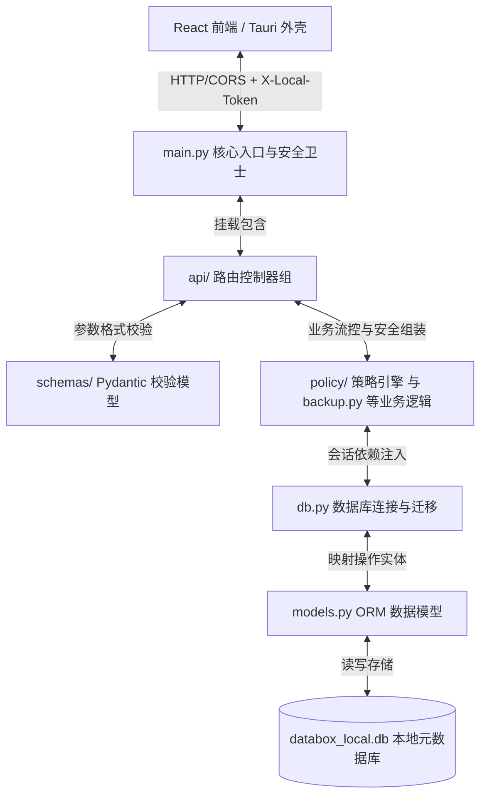

# 🚀 DataBox 后端开发与 Python + FastAPI 核心技术指南

欢迎开启 **DataBox** 的后端学习之旅！本指南专为 **Python 新手**量身定制，通过剖析 DataBox 后端这一现代化、跨平台的异步数据库客户端系统，帮助你快速掌握 **Python 核心语法**、**FastAPI Web 框架**以及 **SQLAlchemy ORM 数据库引擎**。

---

## 🗺️ 第一部分：DataBox 后端架构全景图

DataBox 的后端代码（位于 `engine/` 目录）遵循了现代 Web 应用中**经典的分层架构设计**。每一层职责清晰，通过低耦合的方式协同工作：



### 📂 目录结构与模块说明
当你阅读后台代码时，可以对照下表了解各模块的分工：

| 文件 / 文件夹 | 核心职责 | 初学者必读亮点 |
| :--- | :--- | :--- |
| [main.py](../engine/main.py) | **应用主入口**。配置 FastAPI 应用，设置 CORS，挂载中间件与安全令牌拦截，配置服务生命周期。 | 学习中间件、生命周期钩子和系统启动机制。 |
| [db.py](../engine/db.py) | **数据库物理层**。创建 SQLite 会话工厂，支持程序启动时的备份容灾，并调度 Alembic 表结构自动迁移。 | 学习生成器、连接生命周期管理和高可靠性容灾迁移。 |
| [models.py](../engine/models.py) | **ORM 物理表映射模型**。定义本地保存的数据源、备份记录、大模型日志、设计草稿等表结构和外键关系。 | 学习面向对象设计 (OOP) 与数据库表的对应关系。 |
| `schemas/` | **Pydantic 输入/输出校验模型**。负责在 API 输入时校验前端参数，并统一数据格式输出。 | 学习基于类型注解的数据校验与过滤。 |
| `api/` | **接口路由器 (Controller)**。提供各种 RESTful 接口（如备份管理、数据源管理），处理 HTTP 请求。 | 学习如何通过 Depends 注入数据库会话、抛出 HTTP 异常。 |
| `policy/` | **安全策略引擎**。负责 SQL 安全拦截、数据库只读环境拦截以及关键危险操作的双因子令牌二次确认逻辑。 | 学习如何在业务中进行权限和合规控制。 |

---

## 🐍 第二部分：Python 核心语法深度解密

我们在后台代码中加入的大量中文注释中，提到了许多 Python 核心语法特性。这里为你做进一步系统整理：

### 1. 类型注解 (Type Hints)
Python 是一门动态类型语言，但为了在大型项目中防范类型混乱，Python 3 引入了类型注解。它**不参与运行期强制限制**，但能为 IDE 提供完美的智能代码提示：
* **基础类型**: `project_id: str`
* **联合/可选类型**: `confirm_text: str | None = None`（表示该参数可以是字符串，也可以是 `None`，默认值为 `None`）。
* **泛型容器**: `dict[str, Any]`（代表键是字符串，值是任意类型的字典）；`list[dict[str, str]]`（代表列表里装着键值均为字符串的字典）。

### 2. 装饰器 (Decorators)
装饰器是形如 `@decorator_name` 的语法糖，它本质上是一个 **高阶函数**，用于在不修改原函数代码的前提下，动态地为函数“穿上一件外套”（增加额外功能）：
```python
@app.get("/")
def read_root():
    return {"status": "running"}
```
> [!NOTE]
> 在上面的例子中，`@app.get("/")` 将普通的 `read_root` 函数注册为了 FastAPI 路由系统中的 HTTP GET 请求处理器。

### 3. 异步协程 (Async / Await)
高并发或 I/O 密集型任务（如网络请求、数据库查询）在 Python 中通常使用 `asyncio` 库开发：
* `async def` 定义一个“协程函数”，调用它不会立刻执行，而是返回一个协程对象。
* `await` 必须在 `async def` 函数内部使用，它会暂停当前协程的执行，将 CPU 控制权让给其他任务，等 I/O 操作完成后再继续恢复执行。这极大地提高了后端的吞吐能力！

### 4. 异步上下文管理器 (Lifespan & Context Managers)
在 [main.py](../engine/main.py#L69-L80) 中，我们使用了现代 FastAPI 推荐的生命周期管理语法：
```python
from contextlib import asynccontextmanager

@asynccontextmanager
async def lifespan(application: FastAPI):
    # 【启动时任务】：建立数据库，输出日志
    init_db()
    yield
    # 【停机时任务】：清理 SSH 隧道连接，防止内存和文件占用泄露
    close_all_tunnels()
```
* `yield` 扮演了“分水岭”的角色。它代表在服务启动期间挂起程序，并在程序接受关机信号时继续执行 `yield` 之后的清理逻辑。

---

## ⚡ 第三部分：FastAPI 核心开发精髓

FastAPI 是目前 Python 生态中最炙手可热的 Web 框架。它的三大基石是：**Starlette（负责路由与通信）**、**Pydantic（负责数据定义与校验）** 和 **Depends（依赖注入）**。

### 1. 自动化的数据校验 (Pydantic)
在 schemas/backup.py 中：
```python
from pydantic import BaseModel

class BackupCreateRequest(BaseModel):
    datasource_id: str
    label: str | None = None
    allow_fallback: bool = True
```
当你在 API 接口的参数中声明 `req: BackupCreateRequest` 时，FastAPI 会自动为你做两件事：
1. **自动解析 JSON**: 将前端 POST 上来的 JSON 请求体自动转换并实例化为 Python 里的 `req` 对象。
2. **强制格式拦截**: 如果前端少传了 `datasource_id` 或者 `allow_fallback` 传了非布尔值，FastAPI 会直接拦截请求，返回包含具体哪一行出错的 `422 Unprocessable Entity` 错误，不需要你写任何手动的 `if not datasource_id:` 校验代码！

### 2. 完美的依赖注入 (Depends)
在 [api/backup.py](../engine/api/backup.py#L44-L49) 中：
```python
@router.get("/projects/{project_id}/backups")
def api_list_project_backups(
    project_id: str,
    db: Session = Depends(get_db)  # 注入数据库连接会话
):
    ...
```
`Depends(get_db)` 是极其优雅的依赖注入设计：
* 它告诉 FastAPI：“在执行这个 API 接口前，请先帮我运行一下 `get_db()` 生成器！”
* 运行后产生的数据库连接 `Session` 对象会被自动赋值给本地参数 `db`。
* 接口运行完毕后，即使中途崩溃报错，`get_db` 中的 `finally` 块也会被可靠执行，自动帮你把连接关闭。你完全不用担心数据库连接句柄泄露！

### 3. 灵活的全局异常处理器
接口里一旦发生错误，直接抛出 `DataBoxError`（在 [errors.py](../engine/errors.py) 中定义）即可。FastAPI 在 [main.py](../engine/main.py#L155-L160) 中注册的全局异常捕获器会捕获它并漂亮地格式化为 JSON 错误返回给浏览器：
```python
@app.exception_handler(DataBoxError)
async def databox_error_handler(request: Request, exc: DataBoxError) -> JSONResponse:
    return JSONResponse(
        status_code=400,
        content={"code": exc.code, "message": exc.message},
    )
```

---

## 🗄️ 第四部分：SQLAlchemy ORM 与 Alembic 数据库迁移

### 1. 什么是 ORM（对象关系映射）？
ORM 让你能够**使用面向对象的方式来操作数据库**，不再需要自己拼装危险、难读的 SQL 字符串。
在 [models.py](../engine/models.py) 中：
* `class DataSource(Base):` 代表数据库中的 `data_sources` 表。
* `id = Column(String, primary_key=True)` 代表表中的 `id` 主键字段。
* `project = relationship("Project", back_populates="data_sources")` 声明了与 Project 表的一对多关联关系。你可以直接通过 `datasource.project.name` 来查到对应的项目名字，SQLAlchemy 会在后台自动为你执行 `JOIN` 关联查询！

### 2. SQLAlchemy 核心事务操作
我们常常在业务接口中进行增删改查：
* **查（SELECT）**: `db.query(BackupRecord).filter(BackupRecord.project_id == project_id).all()`
* **增（INSERT）**:
  ```python
  record = BackupRecord(...)
  db.add(record)   # 纳入连接跟踪
  db.commit()      # 物理提交事务，保存落盘
  db.refresh(record) # 重新获取 SQLite 自动赋予的主键 ID 和时间戳
  ```
* **改（UPDATE）**: 直接修改模型属性，然后调用 `db.commit()`：
  ```python
  record.status = "completed"
  db.commit()
  ```
* **删（DELETE）**: `db.delete(record)` 后调用 `db.commit()`。
* **事务安全回滚**:
  ```python
  try:
      # 一系列复杂数据库写操作...
      db.commit()
  except Exception:
      db.rollback() # 发生任何报错，将刚才写入但还没来得及落盘的废弃数据一并撤销，防范脏数据
      raise
  ```

### 3. 元数据库的自动迁移与交接设计
在 [db.py](../engine/db.py#L37-L379) 中，我们展示了一个非常经典的**企业级系统数据库演进方案**：
* 早期产品开发时表结构常常变动，当时直接用手写 SQL 的渐进升级方法（v1 到 v10）来扩容表结构。
* 随着产品稳定性要求变高，正式切换到了专业的迁移框架 **Alembic**。
* 在 `init_db()` 中，系统会在启动时动态检测：
  * 如果检测到老版本的历史标志，说明这是一个旧用户的数据库。先执行手写的 v1 到 v10 的 `ALTER TABLE` 升级，然后通过 Alembic 的 `command.stamp(alembic_cfg, "99b4fdab0781")` 打桩，通知 Alembic 老数据库已经升级到了初始基准线。
  * 接着，统一调度 `command.upgrade(alembic_cfg, "head")` 命令，把表结构优雅地升级到当前代码的最新状态，完成了完美、无感的平滑交接。

> [!TIP]
> 这是一个极为珍贵的底层实现案例。它不仅说明了如何设计向后兼容的升级策略，还展示了如果在升级中途崩盘，如何利用 `shutil.copy2`进行自动容灾还原。

---

## 🛠️ 第五部分：新手上手的最佳实践

当你准备增加一个新的 API 接口或修改已有功能时，可以遵循以下极简步骤：

### 步骤 1：如果有必要，在 `engine/models.py` 中新增/修改模型
新增一个类，继承 `Base`，定义你需要的字段。
> [!NOTE]
> 在实际生产中，定义完新字段后，你可以使用 `alembic revision --autogenerate -m "add some columns"` 命令自动生成表迁移脚本。

### 步骤 2：在 `engine/schemas/` 目录下创建请求/响应校验格式
根据前端需要传递的 JSON 键值对，创建一个继承自 `BaseModel` 的类。

### 步骤 3：在 `engine/api/` 的对应路由文件中编写接口
使用正确的 HTTP 动词修饰器（如 `@router.post`），注入 `db: Session = Depends(get_db)`，并在函数体内利用 ORM 执行你的增删改查业务逻辑。如果参数有校验失败或业务受阻，随时抛出 `DataBoxError` 即可。

### 步骤 4：本地运行与测试
通过运行工作区下的主启动脚本启动后端服务：
```powershell
python start.py
```
它会在本地 `127.0.0.1:18625` 监听请求，并在本地启动自动热重载。你对 Python 代码的每一处修改都会自动生效！

---

> [!IMPORTANT]
> **关于学习方法的一点建议：**
> 不要试图一口气死记硬背所有的 API。可以先在本地通过 `python start.py` 跑起服务，并借助 [api/backup.py](../engine/api/backup.py)，在前端点击备份、恢复，观察终端里的 SQL 执行日志和异常抛出，将**前台行为**、**后台 API 控制器**和**数据库表变化**串联起来。实践是学习 Python 的最快途径！如有任何疑问，随时向我提问，我将陪你一起攻克难关！💪
