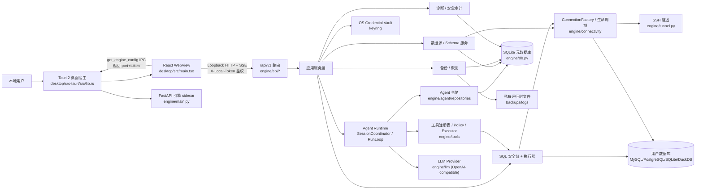
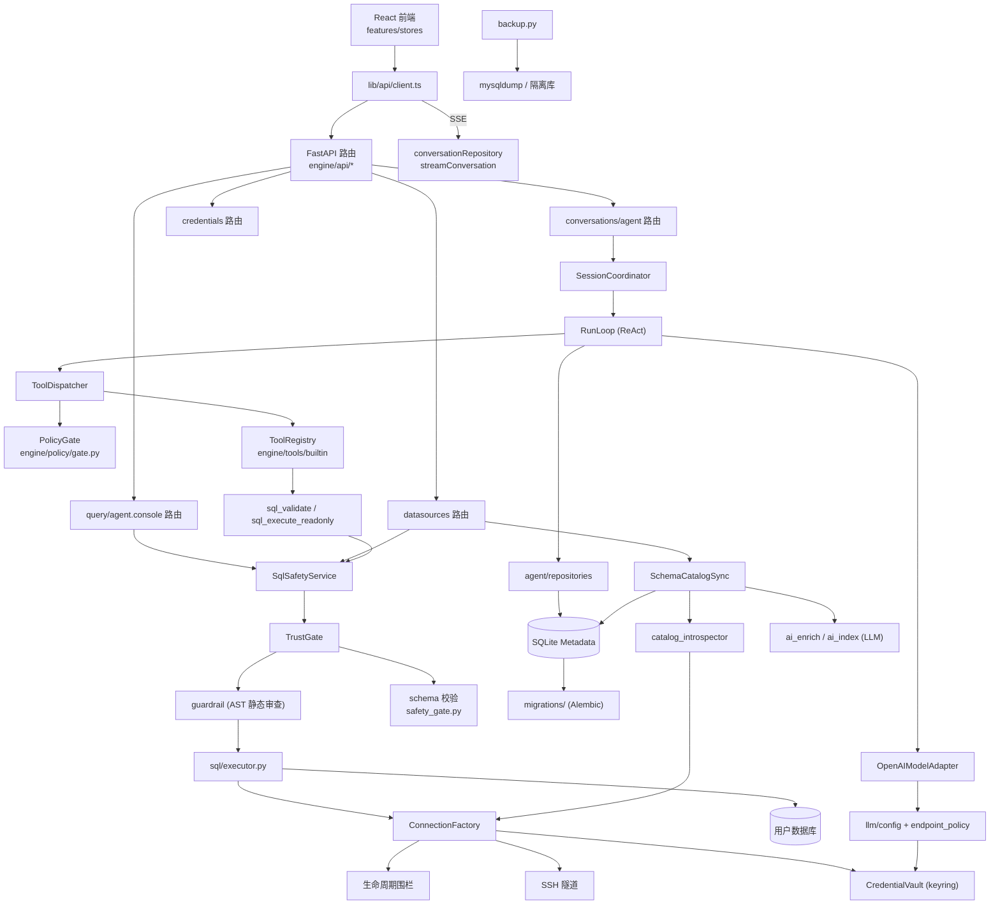
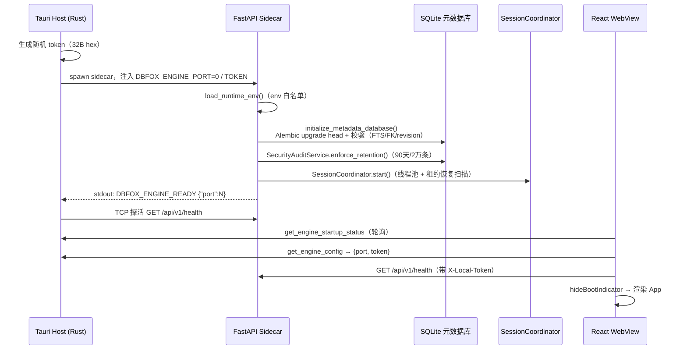
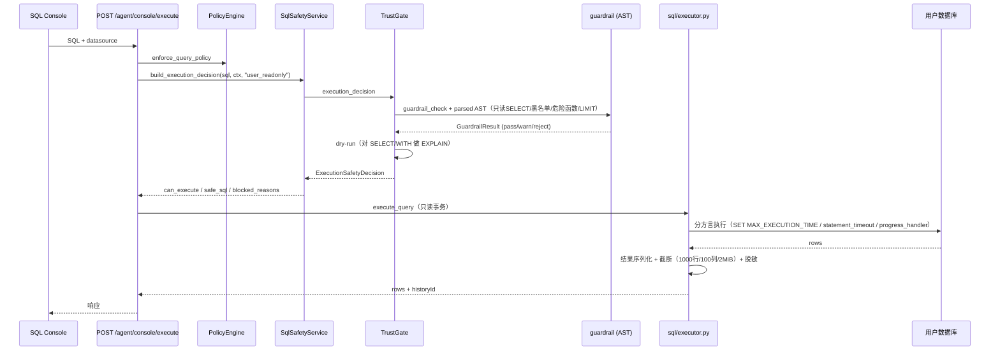
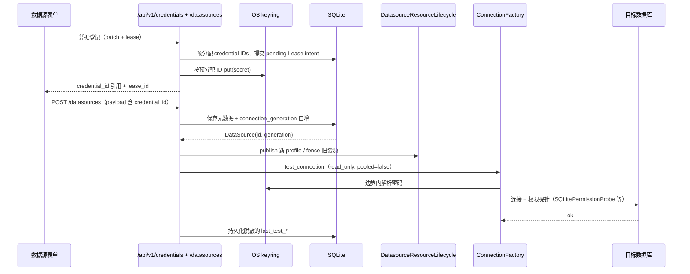
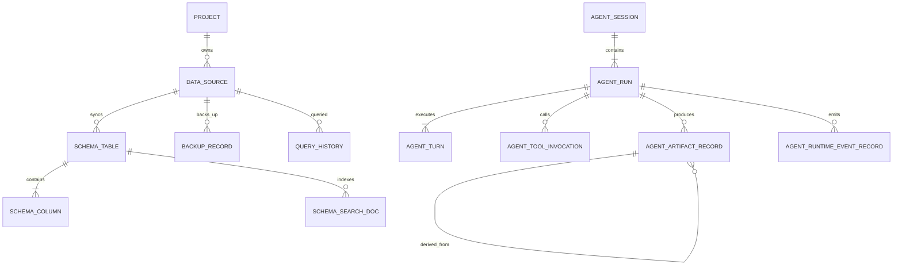

# DBFox 代码仓库架构分析报告

> 2026-07-31 复核：OpenAPI 客户端由 FastAPI `app.openapi()` 临时导出并生成；前端手写 API 文件是 generated SDK 之上的领域 Adapter；SQL Console 的确定性运行由 `engine/agent/console.py` 编排，不进入 ReAct Loop；模型连接诊断与 Agent 主链均验证 Responses API；评测源码由独立分支维护。

> 分析日期：2026-07-31
> 分析基线：分支 `codex/llm-call-interface`，**工作树当前状态**（正处于一次大规模 Agent 重构中间态，详见 §11、§14）。
> 证据标注：【事实】= 直接阅读源码确认（附 `文件:行号`）；【推断】= 基于调用关系的合理推理；【未确认】= 本次分析无法确认。
> 关联文档：[当前系统架构设计](./architecture-design-document.md)、[功能模块与执行管线](./functional-modules-and-execution-pipelines.md)。

---

# 1. 项目摘要

DBFox 是一个**本地优先（Local-First）的 AI 数据库桌面客户端**，面向数据源浏览、SQL 分析、自然语言问数和结果可视化工作流。它将 Tauri 2 桌面壳 + React 19 前端 + Python FastAPI 引擎组合为**模块化单体**，全部运行在本机。核心功能：MySQL/PostgreSQL/SQLite 数据源管理（含 SSH 隧道、只读模式）、Schema 同步与 AI 语义增强、对话式 Agent 生成并安全执行 SQL、SQL 工作台、结果分页/图表/导出、MySQL 备份与隔离恢复。最重要的模块是 **Agent Runtime（显式 ReAct 循环 + 数据库租约调度）** 与 **SQL 安全链（guardrail 六层防线）**。系统强调"可观察、可回源、可恢复、可审计"：SQLite 元数据库为持久事实源，OS keyring 存凭据，SSE 双通道推送，所有破坏性操作留审计。

# 2. 技术栈

| 类别 | 技术 | 用途 | 证据文件 |
| --- | --- | --- | --- |
| 编程语言 | Python 3.12 / TypeScript 5.6+ / Rust 1.95（MSVC） | 后端引擎 / 前端 / Tauri 壳 | `pyproject.toml`、`package.json`、`rust-toolchain.toml` |
| Web 框架 | FastAPI + Uvicorn | 本地引擎 API + SSE | `engine/main.py:163`、`engine/dev_server.py:56-76` |
| 前端框架 | React 19 + Vite 8 | WebView UI | `package.json`、`vite.config.ts` |
| 桌面壳 | Tauri 2（Rust） | sidecar 生命周期、窗口、IPC | `desktop/src-tauri/`、`tauri.conf.json` |
| 数据库（元数据） | SQLite（WAL）+ SQLAlchemy + Alembic | 会话/数据源/目录等持久化 | `engine/db.py:42-43`、`engine/models.py` |
| 数据库（用户数据源） | MySQL / PostgreSQL / SQLite / DuckDB | 被管理的目标库 | `engine/connectivity/`、`engine/sql/dialect/` |
| 凭据存储 | OS 原生 keyring（WinVault/Keychain/SecretService） | LLM key、数据库密码、SSH 秘密 | `engine/security/credential_vault.py:44-67` |
| LLM 服务 | OpenAI-compatible API（Responses API） | Agent 推理、Schema 语义增强 | `engine/llm/providers/openai.py` |
| 状态管理 | Zustand + TanStack Query | 前端导航/会话投影/数据缓存 | `desktop/src/stores/`、`useDatasourceState.ts` |
| 构建工具 | PyInstaller（sidecar）、npm/Vite、Tauri bundler | 引擎打包、前端构建、安装包 | `build_sidecar.py`、`tauri.conf.json:10` |
| 测试工具 | pytest / mypy / Vitest / ESLint / cargo test / OSV、cargo-audit | 后端/前端/Rust 测试与供应链 | `.github/workflows/ci.yml` |
| 部署方式 | 桌面安装包（WiX/NSIS）、CI 只编译不产出安装包 | 本地安装 | `ci.yml:311-365`、`tauri.conf.json:49-58` |
| 消息系统 | 未发现独立 MQ（进程内 LiveStreamHub + SQLite 事件日志） | 低延迟通知 | `engine/agent/events.py:187` |
| 缓存 | 未发现独立缓存层（React Query 前端缓存、连接池 LRU） | 数据层缓存 | `sql/pool_registry.py`、`lib/queryClient.ts` |
| 任务调度 | ThreadPoolExecutor + DB lease（SessionCoordinator） | Agent 执行调度 | `engine/agent/coordinator.py:47` |
| 其他 | Monaco/自研 SQL 高亮、ECharts、xyflow（ER 图）、jieba 分词 | 编辑器/图表/分词 | `package.json`、`ai_index.py` |

# 3. 仓库目录说明

```text
DBFox/
├── engine/                          # Python 后端引擎（FastAPI）
│   ├── main.py                      # 主入口：中间件、异常处理、lifespan、路由挂载
│   ├── db.py                        # SQLite 引擎/会话/Alembic 迁移入口
│   ├── models.py                    # 元数据库 37 个 ORM 模型
│   ├── api/                         # 10 组路由（datasources/query/agent/conversations/backup/...）
│   ├── agent/                       # ★ Agent Runtime（coordinator/loop/repositories/…）
│   ├── tools/                       # 工具注册（builtin/ 13 个工具）与执行框架
│   ├── sql/                         # ★ SQL 安全链（guardrail/trust_gate/executor/dialect/result_view）
│   ├── connectivity/                # 连接工厂/连接池/SSH 隧道/生命周期围栏
│   ├── security/                    # 凭据保险库、安全审计、runtime reset
│   ├── environment/                 # 数据环境/Schema 目录/ER 图
│   ├── llm/                         # LLM 配置、OpenAI provider、端点策略
│   ├── semantic/ + ai_enrich.py + ai_index.py   # 语义链接、LLM 目录增强、FTS 索引
│   ├── backup.py + backup_paths.py  # MySQL 备份/隔离恢复
│   ├── migrations/                  # Alembic 37 个线性迁移
│   ├── runtime_env.py               # env 白名单加载
│   ├── runtime_paths.py             # 私有运行时路径解析
│   └── errors.py + app/safe_errors.py + policy/  # 错误体系与安全策略
├── desktop/                         # 前端 + Tauri 壳
│   ├── src/                         # React 源码
│   │   ├── main.tsx / App.tsx / boot.ts   # 前端入口与应用外壳
│   │   ├── features/                # 会话/assistant/datasource/workspace/appShell/settings
│   │   ├── stores/                  # zustand（workspaceStore/conversationStore/…）
│   │   ├── lib/api/                 # 生成的 API 客户端 + client.ts + SSE 仓库
│   │   ├── components/              # DataTable/ChartPanel/TitleBar/CommandPalette/…
│   │   └── pages/                   # DataSourcesPage 等
│   └── src-tauri/                   # Rust 宿主：lib.rs（sidecar 监督）、tauri.conf.json
├── scripts/dependency_governance.py # SBOM 生成 + 许可证门禁
├── build_sidecar.py                 # PyInstaller 打包引擎为 sidecar
├── dev.ps1 / dev.sh                 # 开发启动脚本
├── requirements*.txt/.lock          # Python 依赖（哈希锁文件）
├── .github/workflows/ci.yml         # 8 个 CI job
└── docs/                            # 架构/设计/计划/QA 文档（事实源）
```

# 4. 系统架构图



**说明**：所有节点均有代码对应。Tauri 宿主通过 `EngineSupervisor`（lib.rs:34-369）启动 sidecar，动态分配端口（`DBFOX_ENGINE_PORT=0`）并用 `DBFOX_ENGINE_READY {port}` stdout 协议握手（lib.rs:474-486）；前端通过 `get_engine_config` IPC 获取 port/token（client.ts:26-34），HTTP 请求统一带 `X-Local-Token` 头（main.py:246-254）。

# 5. 模块依赖图

依赖方向来自真实 import/调用关系：



**注意**：`engine.sql.pool_registry` 被 `engine.connectivity._pools` 反向依赖，二者存在**双向依赖**，通过延迟 import 解耦（factory.py:486-491、lifecycle.py:26-35）【事实】。

# 6. 启动流程图



关键文件：`desktop/src-tauri/src/lib.rs`、`engine/main.py:99-159`（lifespan）、`engine/db.py:302-327`、`engine/agent/coordinator.py:33`、`desktop/src/components/EngineStartupGate.tsx`、`desktop/src/lib/api/client.ts:26-34,84-124`。

# 7. 核心业务流程图

## 7.1 智能问数（Agent 输入 → 完成）★ 最重要的流程

```mermaid
sequenceDiagram
    participant UI as React Conversation
    participant API as POST /conversations/{id}/inputs
    participant SESS as SessionRepository
    participant COORD as SessionCoordinator
    participant LOOP as RunLoop (ReAct)
    participant LLM as LLM Provider
    participant TOOL as ToolDispatcher
    participant META as SQLite

    UI->>API: content + mode + artifact IDs + idempotency_key
    API->>SESS: admit()（短事务：Input/Run/Message/事件）
    SESS-->>UI: Session/Run IDs + SSE stream_path
    SESS->>COORD: coordinator.wake(session_id)
    COORD->>SESS: claim lease（DB 租约栅栏）
    COORD->>LOOP: execute(lease, run_id)
    LOOP->>SESS: start_turn（不可变 Turn + 冻结工具 hash）
    LOOP->>LLM: stream(messages, tools, timeout=remaining)
    LLM-->>UI: live delta（RunItemDelta, 低延迟通道）
    alt 工具调用
        LOOP->>TOOL: request_and_execute
        TOOL->>POLICY: PolicyGate.check（capability/审批）
        TOOL->>META: 持久化 Invocation/Observation/Artifact
        TOOL-->>LOOP: 有界 Tool Result / WAITING_APPROVAL
        LOOP->>LLM: 下一轮 Turn
    else 文本回答
        LOOP->>LOOP: CompletionGate.evaluate（确定性判定）
        LOOP->>META: 原子终态提交（回答+Evidence+Memory+事件）
    end
    META-->>UI: committed replay/snapshot（持久真值）
```

- **起点**：`desktop/src/features/conversation/workspace/Composer.tsx` → `conversationStore.sendMessage`。
- **关键调用链**：`engine/api/conversations.py:357`（admit）→ `engine/agent/repositories/session.py:80` → `engine/agent/coordinator.py:132`（claim）→ `engine/agent/loop.py:150`（ReAct）→ `engine/agent/tool_dispatcher.py:98` → `engine/policy/gate.py:285`。
- **涉及数据**：AgentSession/Run/Turn/ToolInvocation/Observation/Artifact/Event（models.py:553-985）。
- **外部服务**：LLM Provider（OpenAI-compatible）。
- **异常处理**：租约丢失 → RunLeaseLost（loop.py:254-257）；模型重试预算 2 次（control.py:153）；终态原子提交防半完成（terminalizer.py:46）。

## 7.2 SQL 执行安全链（工作台 Console）



- **起点**：`engine/api/agent.py:216`（api_agent_console_execute）——全仓**唯一**能真正执行 SQL 的 HTTP 端点【事实】。
- **安全六层**：`SqlSafetyService → TrustGate → guardrail（静态 AST+防注入）→ schema 缓存校验 → EXPLAIN dry-run → 只读事务边界 → 结果截断/脱敏`（engine/sql/safety/service.py、trust_gate.py:71、guardrail.py:643、executor.py:294）。
- **取消路径**：`POST /query/cancel` → QueryRegistry（query_registry.py:114-198）：SQLite/DuckDB interrupt、Postgres cancel、MySQL 独立连接 KILL QUERY。

## 7.3 数据源保存与连接测试



- **关键点**：浏览器永不取回明文；批量登记先持久化 Lease intent，再写 OS Vault，进程中断后由 Saga reconcile 提交或清理；密码仅在 `ConnectionFactory` 内解析；`ConnectionProfile` 拒绝明文字段；旧连接靠 `connection_generation` 栅栏失效。

## 7.4 MySQL 备份与隔离恢复

- **触发**：`POST /backups` → `create_backup`（backup.py:334-391）→ 原生 `mysqldump` 子进程（backup.py:130-184，staging 文件 + `os.replace` 原子落盘 + sha256 校验）。
- **恢复**：`POST /backups/{id}/restore` → `execute_restore`（backup.py:432-551）：先恢复**隔离目标库**并验证表结构 → `connection_generation+1` 的 compare-and-swap 切换元数据 → `lifecycle.replace` 关旧池。任何一步失败不替换当前数据源【事实】。
- **注意**：README 明确**原地恢复已被禁用**，`restore` 对既有目标固定返回 409 `RESTORE_REQUIRES_ISOLATED_TARGET`（README.md:98）。

# 8. 核心模块详解

## 8.1 FastAPI 应用核心（engine/main.py）
- **路径**：`engine/main.py`
- **职责**：应用装配、安全中间件、异常边界、路由挂载、lifespan。
- **入口**：`python -m engine.main`（main.py:369-382 → `run_engine_server`）。
- **核心函数**：`verify_local_access_token`（:179-257）、`dbfox_error_handler`（:286-320）、`global_unhandled_exception_handler`（:323-345）、`lifespan`（:99-159）、`get_or_create_local_token`（:79-88）。
- **输入/输出**：HTTP 请求 → JSON 响应。
- **依赖**：`engine.db`、`engine.api`、`engine.agent`、`engine.security`、`engine.runtime_env`。
- **代码证据**：token 采用 `secrets.compare_digest` 常数时间比较（:247）；异常响应不信任实例 message/code，静态白名单映射（:61-72）。

## 8.2 Agent Runtime（engine/agent/）★ 核心业务
- **路径**：`engine/agent/`（coordinator.py、loop.py、tool_dispatcher.py、repositories/、completion.py、terminalizer.py、events.py）
- **职责**：会话调度 + 显式 ReAct 执行循环 + 事件投影 + 持久化。
- **核心类**：`SessionCoordinator`（coordinator.py:33，ThreadPoolExecutor max_workers=4）、`RunLoop`（loop.py:117）、`SessionRepository.admit/claim`（session.py:80/278）、`CompletionGate`（completion.py:33）、`Terminalizer`（terminalizer.py:46）、`LiveStreamHub`（events.py:187）。
- **输入**：`POST /conversations/{id}/inputs`；**输出**：SSE 事件流 + SQLite 持久状态。
- **调度模型**：线程池 + 数据库租约栅栏（lease_owner/token/expires_at），同一 Session 串行、不同 Session 并行【事实】。
- **依赖**：`engine.tools`、`engine.llm`、`engine.agent.repositories`、`engine.policy`。
- **被调用方**：`engine/api/conversations.py`、`engine/main.py:134-139`。

## 8.3 工具注册与执行（engine/tools/）
- **路径**：`engine/tools/builtin/registry.py`（当前活跃，工作树新增）、`engine/tools/runtime/`（base/executor/runtime）。
- **职责**：13 个工具的注册、策略裁决、有界执行。
- **工具清单**：`request_clarification`、`update_plan`（control）；`catalog_overview/refresh/list/search/inspect`（catalog）；`data_preview`、`sql_validate`、`sql_execute_readonly`（query）；`result_inspect/profile`、`chart_create`（result）。全部 `risk_level=safe`。
- **核心机制**：每轮 Turn 将工具**物化为稳定快照**（`materialize_tools`，sha256 冻结，materialization.py:64）；`PolicyGate` 规则链裁决（gate.py:266-274）；`ToolExecutor` 限时/重试/输出字节上限（executor.py:61）。
- **关键约束**：`sql_execute_readonly` 只收 **Artifact ID** 不收 SQL 文本，重载验证 Artifact 与 Run 绑定（query.py:227-272）。
- **注意**：CLAUDE.md 提到的 `db.observe/db.search/sql.validate`（点号风格）对应重构前 HEAD 版本，当前工作树已改为下划线风格并调整了工具集【事实】。

## 8.4 SQL 安全链（engine/sql/）
- **路径**：`engine/sql/`（guardrail.py、trust_gate.py、safety/service.py、executor.py、dialect/、result_view/）
- **职责**：SQL 校验、安全审查、只读执行、结果网关。
- **核心类**：`SqlSafetyService`（safety/service.py:17）、`TrustGate`（trust_gate.py:71）、`guardrail_check`（guardrail.py:643）、`ResultViewService`（result_view/service.py:45）、`QueryRegistry`（query_registry.py:28）。
- **数据边界**：Result Artifact 不保存结果行，SQL 只存在于 SQL Artifact【事实】。
- **限制常量**：`MAX_ROWS=1000、MAX_COLUMNS=100、MAX_CELL_CHARS=5000、MAX_RESPONSE_BYTES=2MiB、QUERY_TIMEOUT_MS=30000`（sql/result_limits.py:3-7）。

## 8.5 数据源与连接（engine/connectivity/）
- **路径**：`engine/connectivity/`（factory.py、profile.py、lifecycle.py、resources.py、_pools.py）+ `engine/tunnel.py`。
- **职责**：不可变连接配置、唯一凭据边界、连接池、SSH 隧道自愈、代数围栏。
- **核心类**：`ConnectionFactory`（factory.py:113）、`ConnectionProfile`（profile.py:124）、`DatasourceResourceLifecycle`（lifecycle.py:38）、`TunnelManager`（tunnel.py:131）、`PoolRegistry`（sql/pool_registry.py:33，LRU，MAX_POOLS=16/MAX_CONNECTIONS=64）。

## 8.6 前端应用外壳（desktop/src/）
- **路径**：`desktop/src/App.tsx`、`features/appShell/WorkspaceRouter.tsx`、`stores/workspaceStore.ts`。
- **职责**：无 URL 路由的 tab 式工作区、命令面板、主题、启动门禁。
- **核心 Store**：`workspaceStore`（tab 生命周期 + SQL 控制台状态）、`conversationStore` + `conversationStoreReducer`（SSE 事件去重 + delta 校验拼接）。
- **关键**：`EngineStartupGate`（引擎就绪门禁）、`useSqlBackedDataView`（Result 当前页，AbortController 取消旧请求）。

# 9. 核心数据模型

| 数据模型 | 所在路径 | 主要字段 | 关联关系 | 主要用途 |
| --- | --- | --- | --- | --- |
| `Project` | models.py:39 | name（唯一） | 级联 data_sources/backups | 工作区 |
| `DataSource` | models.py:130 | db_type、host、`password_credential_id`、`ssh_*_credential_id`、**connection_generation**、last_test_* | → Project | 数据源配置与代数栅栏 |
| `SchemaTable`/`SchemaColumn` | models.py:260/:299 | name、ai_description、semantic_tags、is_pii | Table 1—N Column | Schema 目录缓存 |
| `SchemaSearchDoc` | models.py:343 | search_text（FTS5） | → Table/Column | 语义搜索索引 |
| `QueryHistory` | models.py:381 | original_sql、guardrail 结果、耗时 | — | 查询历史 + FTS |
| `AgentSession`/`AgentMessage`/`AgentSessionInput` | models.py:553+ | sequence、state | Session 1—N Message/Input | 会话事实源 |
| `AgentRun`/`AgentTurn` | models.py:553+ | status、budget、prompt_hash | Session 1—N Run 1—N Turn | ReAct 执行记录 |
| `AgentToolInvocation`/`AgentObservationRecord` | models.py:553+ | authorized_input_hash、status | Run 1—N Invocation | 工具调用幂等与结算 |
| `AgentApproval`/`AgentQuestionRequest` | models.py:553+ | status（pending/approved/…） | 绑定 Invocation/Run | 审批与澄清 |
| `AgentArtifactRecord`/`AgentEvidenceRecord` | models.py:553+ | derived_from、fingerprint | SQL→Result→Chart | 工件与证据（无 rows） |
| `AgentRuntimeEventRecord` | models.py:553+ | sequence、type、category | — | 事件日志 + replay cursor |
| `BackupRecord`/`RestoreOperation` | models.py:202/:235 | checksum_sha256、source_connection_generation | → DataSource | 备份/恢复审计 |
| `SecurityAuditRecord` | models.py:988 | action、outcome、redacted details | — | 安全审计 |



# 10. 配置与运行方式

**本地启动**（命令均来自仓库文件）：
```bash
# Windows
./dev.ps1 [backend|frontend|both]        # dev.ps1:19-23
# Unix/Git Bash
./dev.sh [backend|frontend|both]         # dev.sh:9
# 手动
python -m engine.main                     # 后端（必用模块模式，CLAUDE.md）
cd desktop && npm run dev                 # 前端
cd desktop && npm run tauri -- dev        # Tauri 桌面
```

**必要环境变量**：引擎 token 与端口由 Tauri 运行时自动注入；`DBFOX_ENGINE_PORT`（默认 18625）；`.env` 只读 13 个白名单非敏感参数（runtime_env.py:17-33）；**凭据/URL/运行时路径/安全开关禁止写入 `.env`**（README.md:96）。

**默认端口**：后端 18625，前端 5173。

**数据库初始化**：启动 lifespan 自动 Alembic `upgrade head`（engine/db.py:302-327）；元数据库路径 `<runtime>/data/dbfox_local.db`（Windows 为 `%APPDATA%\DBFox`）。

**构建命令**：
```bash
python build_sidecar.py                        # PyInstaller 打包 sidecar（build_sidecar.py）
cd desktop && npm run build                    # 前端构建 + bundle 预算检查
cd desktop && npm run tauri -- build           # 桌面安装包（自动先跑 sidecar）
npm run generate:api                           # 从后端 OpenAPI 生成 TS 客户端
```

**测试命令**：
```bash
pytest engine/tests -q -m "not e2e and not integration and not real_llm"   # 后端
pytest engine/agent/tests -q -m "not e2e and not integration and not real_llm"
cd desktop && npm test && npm run lint         # 前端
cargo test --locked                            # Rust
```

**Docker/部署**：未发现 Docker 配置；部署为桌面安装包（WiX/NSIS），CI 只做编译契约（`--no-bundle`），安装包为人工/带外流程【事实】。

# 11. 设计特点与潜在问题

## 设计优点
- **安全分层严密**：凭据只存 OS keyring + opaque ID（credential_vault.py:77-78）；SQL 六层防线；错误响应不泄露 message/stack；日志/事件/审计统一脱敏；frozen 模式强制 Origin + Token 校验（main.py:197-234）。
- **持久化事实源设计**：SQLite canonical tables 是唯一权威；实时流可丢、committed state 不可丢（架构文档 §2）；事件日志可压缩（不是唯一业务状态）。
- **并发正确性**：租约栅栏 + fencing（session.py:827-838）、`BEGIN IMMEDIATE` 短事务、连接代数围栏（connection_generation）、终态原子提交（terminalizer.py）。
- **可测试性**：后端 900+ 测试、前端 411 测试、CI 覆盖迁移链/供应链/平台矩阵；in-memory vault、隔离 DB URL 等注入点设计良好。
- **可扩展性**：新工具经 Registry 扩展、新 Provider 经 Adapter 扩展、新 Artifact 经描述符扩展，RunLoop 不按工具名硬编码分支。
- **供应链治理**：三端锁文件 + `--require-hashes`、SBOM、许可证门禁、OSV/npm/cargo-audit（ci.yml、dependency_governance.py）。

## 潜在问题

### 高风险
| 问题 | 影响 | 判断依据 | 文件 | 验证方式 |
| --- | --- | --- | --- | --- |
| **文档与工作树漂移**：工具清单、协议说明和 generated 产物必须随注册表与 FastAPI 契约更新 | 误导新开发者，按旧文档写代码会出错 | 新实现为 `engine/tools/builtin/`（下划线命名），CLAUDE.md 已改为当前 13 个函数 | CLAUDE.md、架构约束测试 | 比对工具注册表、文档和生成 diff |

### 中风险
| 问题 | 影响 | 判断依据 | 文件 | 验证方式 |
| --- | --- | --- | --- | --- |
| **重构中间态未提交**：大量新增文件未跟踪（`engine/tools/builtin/`、`terminalizer.py`、`policy/authority.py` 等），大量旧文件已删除但 HEAD 仍存在 | 分支状态不稳定，他人 checkout 会拿到残缺代码 | git status `??` 与 `D` 并存；`agent_runtime/`、`agent_core/` 仅剩 `.pyc` 残留且从未被 git 跟踪 | 工作树 | `git status --short`；确认该分支是否应被提交/丢弃 |
| **连接池注册表目录边界失真** | 所有生产调用者都在 connectivity/tunnel 边界，但实现仍位于 `engine/sql` | `connectivity/_pools.py`、`connectivity/lifecycle.py`、`tunnel.py` 调用 `sql/pool_registry.py`；当前没有反向 import 环 | 相关调用链 | 后续将注册表整体移入 connectivity；不要增加转发兼容层 |

### 低风险
| 问题 | 影响 | 判断依据 | 文件 | 验证方式 |
| --- | --- | --- | --- | --- |

### 暂时无法确认
- keyring 在各平台运行时可用性（代码 fail-closed，本机是否配置原生后端未验证）。
- CI 每周 release-platform-contract 之外，正式安装包发布流程（无 release workflow）。
- `DBFOX_TESTING=1` + `DBFOX_ALLOW_GUARDRAIL_BYPASS=1` 组合的测试环境绕过（safety_gate.py:154-208）在实际生产是否被严格关闭。

# 12. 阅读路线建议

1. **入口与安全边界**：`engine/main.py` → `desktop/src/main.tsx` → `desktop/src-tauri/src/lib.rs`。目的：理解系统如何启动、如何鉴权、token 如何闭环。
2. **数据层**：`engine/db.py` → `engine/models.py` → `engine/migrations/`。目的：掌握元数据库与 37 张表的事实源。
3. **SQL 安全链（核心）**：`engine/sql/guardrail.py` → `trust_gate.py` → `executor.py` → `engine/tools/db/sql_execution.py`。目的：理解"任何 SQL 都必须经过的防线"。
4. **Agent Runtime（核心）**：`engine/agent/coordinator.py` → `loop.py` → `repositories/session.py` → `engine/tools/builtin/registry.py`。目的：理解 ReAct 循环、租约调度、工具执行。
5. **前端会话投影**：`desktop/src/stores/conversationStoreReducer.ts` → `features/conversation/conversationStreamRuntime.ts` → `workspace/AgentTimeline.tsx`。目的：理解 SSE 双通道与 reducer 归并。
6. **基础设施**：`engine/security/credential_vault.py`、`engine/runtime_paths.py`、`engine/connectivity/lifecycle.py`、`.github/workflows/ci.yml`。目的：理解凭据/路径/连接生命周期/质量门禁。

# 13. 关键文件索引

| 文件路径 | 重要程度 | 作用 | 建议阅读原因 |
| --- | ---: | --- | --- |
| `engine/main.py` | 5 | 应用装配/安全中间件/异常边界/lifespan | 理解系统入口与安全模型 |
| `engine/agent/loop.py` | 5 | ReAct 主循环 | Agent 核心执行逻辑 |
| `engine/agent/repositories/session.py` | 5 | 会话聚合写入/租约栅栏 | 并发正确性关键 |
| `engine/sql/guardrail.py` | 5 | SQL 只读安全门 | 安全防线第一层 |
| `engine/sql/executor.py` | 5 | 安全执行主流程 | SQL 执行链路核心 |
| `engine/tools/builtin/registry.py` | 5 | 工具注册（13 个） | 新工具扩展入口 |
| `engine/tools/db/sql_execution.py` | 5 | sql_validate/sql_execute_readonly | Agent SQL 执行链 |
| `engine/connectivity/factory.py` | 5 | 唯一凭据解析边界 | 数据源连接安全 |
| `engine/models.py` | 4 | 37 个 ORM 模型 | 数据模型事实源 |
| `engine/db.py` | 4 | SQLite 引擎/Alembic 初始化 | 元数据库启动 |
| `engine/security/credential_vault.py` | 4 | OS keyring 凭据 | 凭据安全 |
| `engine/agent/coordinator.py` | 4 | 会话调度器 | 线程池 + 租约 |
| `engine/policy/gate.py` | 4 | 工具策略裁决 | 权限边界 |
| `desktop/src-tauri/src/lib.rs` | 4 | sidecar 监督/端口 token | 桌面宿主 |
| `desktop/src/lib/api/client.ts` | 4 | API 客户端配置/SSE | 前后端协议 |
| `desktop/src/stores/conversationStoreReducer.ts` | 4 | SSE 事件归并 | 前端一致性 |
| `engine/backup.py` | 3 | MySQL 备份/隔离恢复 | 数据安全 |
| `build_sidecar.py` | 3 | PyInstaller sidecar 打包 | 构建链路 |
| `.github/workflows/ci.yml` | 3 | 8 个 CI job | 质量门禁 |
| `docs/architecture-design-document.md` | 4 | 权威架构文档 | 与代码交叉校验 |

# 14. 待确认事项

## 已关闭（本次分析已由代码确认）

| 原待确认项 | 结论 | 证据 |
| --- | --- | --- |
| 请求体限制阈值 | **512KB**，仅限 2 个端点，超限 413 | `engine/app/request_limits.py:9,62-70` |
| MySQL/Postgres 池参数 | pool_size=5 / max_overflow=10 / recycle=1800 / timeout=10，密码仅在 creator 短闭包内解析 | `engine/connectivity/_pools.py:80-123` |
| 权限探针具体探测 | MySQL `SHOW GRANTS FOR CURRENT_USER()` 提取写权限判定 readonly | `engine/sql/permissions/mysql.py:21-48` |
| backup_paths 路径规则 | 私有目录限定 + 拒绝 symlink/reparse + `O_NOFOLLOW` + `(st_dev,st_ino)` 比对防 TOCTOU | `engine/backup_paths.py:63-204` |
| SSE 流实现 | 双线程 fanout + 有界队列(512) + 先重放 DB 真值再 live + event_id=sequence + 15s keep-alive | `engine/api/conversations.py:594-681` |
| 前端流运行时 | `RunLifecycleController`（每会话单 Run + AbortController）+ `streamEventBatcher`（rAF 批处理）+ flush-before-snapshot | `runLifecycleController.ts`、`streamEventBatcher.ts`、`conversationStreamRuntime.ts:47-106` |
| schemas 层结构 | Pydantic 请求模型按领域分文件 | `engine/schemas/__init__.py` |
| `.local_token` | 当前 sidecar 认证文件，不是仓库根遗留入口 | `engine/main.py:74`、`engine/runtime_credentials.py` |
| `SqlEditor.tsx` / `engine/llm/structured.py` | 文件及对应未使用依赖已不存在 | 源码与依赖清单检索 |

## 仍开放（无法仅凭代码确认）

1. **工作树重构范围与去向**（优先级最高）：分支 `codex/llm-call-interface` 有大量未跟踪新文件与已删除旧文件（`agent/skills/`、`tools/dbfox_tools.py`、`memory/`），旧 `agent_runtime/`、`agent_core/` 仅剩 `.pyc` 残留。需确认：重构是否完成、何时提交、残留是否应清理。
2. **文档持续校验**：CLAUDE.md 工具链已更新；仍应通过架构测试防止注册表、协议文档和 generated 契约再次漂移。
3. **`.env.local` 开发流程**：干净检出上 `./dev.ps1 both` 是否真实可用，还是必须先 `python build_sidecar.py --token-only`。
4. **CI 发布闭环**：8 个 job 均 `--no-bundle`，正式安装包由什么流程产出（人工？私有 CI？）。
5. **keyring 可用性**：目标机器上 OS 原生 keyring 后端是否可用（fail-closed 意味着不可用则功能全禁）。
6. **测试环境绕过开关**：`DBFOX_TESTING`/`DBFOX_ALLOW_GUARDRAIL_BYPASS` 在生产是否被严格控制。

---

# 附录 A：缺口核查深度细节（2026-07-31 补充）

以下是对主报告"待确认项"的逐项源码核验记录，全部为【事实】。

## A.1 请求体限制（engine/app/request_limits.py）
- `MAX_AGENT_INPUT_REQUEST_BYTES = 512 * 1024`（:9）。
- 仅 `POST /api/v1/conversations/{id}/inputs` 与 `POST /api/v1/agent/console/execute` 受限（:62-70）。
- 先查 `Content-Length`，无头则边读边计数，超限立即 413 `REQUEST_BODY_TOO_LARGE`（:29-43, 83-98）。

## A.2 连接池（engine/connectivity/_pools.py）
- 池参数：pool_size=5 / max_overflow=10 / recycle=1800 / timeout=10.0；MySQL 额外 read/write_timeout=30（:80-87, 116-123）。
- 密码只在 `creator` 闭包短调用内从 vault 解析（:77, 113）；`_without_password` 强制拒绝带密码的连接参数（:53-57）；长驻 QueuePool creator 永不捕获明文（模块 docstring :1-7）。
- 池 key 不含 secret，含 `managed_resource_key + dialect + host + port`（:22-37）。

## A.3 Schema 权限探针（engine/sql/permissions/）
- `PermissionProbe` 抽象基类 + `PermissionReport{readonly, writable_privileges, warnings, evidence}`（base.py:10-21）。
- MySQL：`SHOW GRANTS FOR CURRENT_USER()` → 提取写权限（INSERT/UPDATE/DELETE/CREATE/DROP/ALTER/TRIGGER/ALL PRIVILEGES）→ 有写权限即 readonly=False 并附中文安全提示（mysql.py:9-48）。
- Postgres/SQLite 各有实现；SQLite 需 `database_path`（`__init__.py:21-35`）。

## A.4 备份路径安全（engine/backup_paths.py）
- `absolute_lexical_path` 拒绝 `..`、空段、Windows 非法字符（:45-60）。
- `require_private_directory` 逐级 lstat 拒绝符号链接与 reparse point（:37-42, 63-80）。
- `open_existing_regular_file` 用 `O_NOFOLLOW` + `fstat` 前后 `(st_dev, st_ino)` 比对防 TOCTOU（:185-204）。
- 文件名白名单正则 + 三段式相对路径（project/datasource/时间戳.sql）（:94-121）。
- 全部路径限定在 `<runtime>/backups/` 私有目录内（:90-91）。

## A.5 SSE 流（engine/api/conversations.py:594-681）
- 双线程 fanout：commit 订阅线程 + live 订阅线程（:604-635），写入有界队列 maxsize=512（:599）。
- 主循环先重放 durable SQL 真值（list_events 按游标，limit=500），再消费 live 信号（:645-668）。
- **commit 通知不携带 payload**，循环总是重放 DB 事件（:669）——直接保证"实时流可丢、committed state 不可丢"。
- `event_id` = DB sequence（:653），客户端可用 `Last-Event-ID`/`after_sequence` 续传（:469-471）。
- 15 秒 keep-alive（:659）；live 队列满或 `LiveStreamGap` → 关闭流，客户端强制重载 snapshot（:621-635）。

## A.6 前端流运行时
- `RunLifecycleController`（runLifecycleController.ts:11-38）：每会话至多一个活跃 Run，`start` 先 stop 旧连接，`isCurrent` 用对象同一性 + abort 状态双重判断。
- `streamEventBatcher`（streamEventBatcher.ts:11-18）：`requestAnimationFrame` 批处理，无 rAF 环境回退 `setTimeout 16ms`。
- `ConversationStreamRuntime.follow`（conversationStreamRuntime.ts:47-106）：`stream → 指数退避(250ms→4s) → flush live → 拉权威 snapshot → 判断可追踪性`；**先 flush 后 snapshot** 防过期 delta 覆盖终态。

## A.7 补充确认的安全细节
- **SQLite 写追踪**为可选调试开关（`AGENT_DB_WRITE_TRACE=true`），生产默认关闭（db.py:149-201）。
- **迁移的 SQLite 特化**：关 FK → `BEGIN IMMEDIATE` → 内存快照 → 迁移 → 校验 FK → 失败从快照恢复；跨进程文件锁互斥（`engine/migrations/env.py`、`sqlite_mutex.py`）。
- **结果限制常量**：MAX_ROWS=1000 / MAX_COLUMNS=100 / MAX_CELL_CHARS=5000 / MAX_RESPONSE_BYTES=2MiB / QUERY_TIMEOUT_MS=30000（sql/result_limits.py:3-7）。
- **恢复 CAS 双保险**：`BackupSourceMismatchError` + `connection_generation+1` compare-and-swap（backup.py:451-463, 499-511）。
