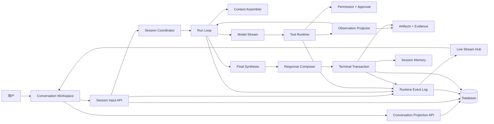
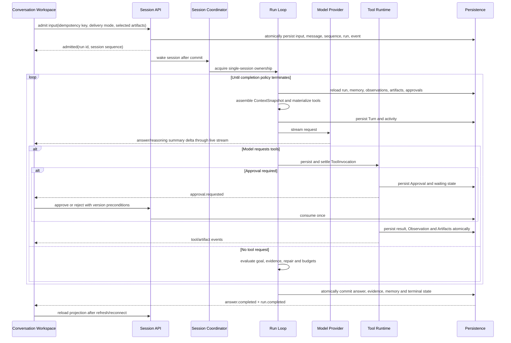
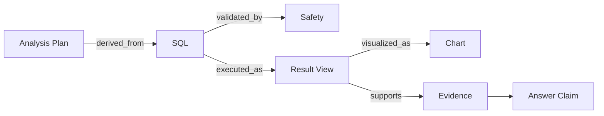

# DBFox Agent 技术与交互设计

状态：已实现并通过验收
适用范围：桌面端、Web、Agent、工具、流式、持久化与评测

关联文档：

- [产品与运行规范](../specs/agent.md)
- [实施任务](../plans/agent.md)
- [架构链路评审](../reviews/agent-architecture-review.md)
- [能力资产清单](../reviews/agent-capability-inventory.md)

## 1. 设计原则

这次工作不是从空白创建一个通用 Agent 框架，而是把 DBFox 已经具备、但分散在不同实现中的可靠能力重新收拢为唯一生产链路。

每项能力必须归入以下三类之一：

1. **直接继承**：接口和语义已经正确，只补齐测试或接线；
2. **抽取重组**：行为正确，但被 Graph、旧响应模型或前端推断绑住，需要移入稳定领域边界；
3. **明确淘汰**：重复状态源、空壳接口、启发式投影和已经失效的执行路径。

设计不以“代码更新”作为完成标准，而以用户从输入到证据化回答的纵向闭环作为完成标准。

## 2. 来源与取舍

### 2.1 DBFox 1.0.1

从 `53e3774b6b32dd9fcefecd4cb391ff31b0d67392` 提取行为，不复制 Graph 结构：

| 能力 | 决定 | 进入新实现的位置 |
|---|---|---|
| Policy → Tool → Observe → Progress → Repair → Answer | 抽取重组 | `RunLoop`、`CompletionPolicy`、`ObservationProjector` |
| SQL 验证、修复与再次执行 | 直接继承语义 | 工具策略与 `CompletionPolicy` |
| Tool observation 回灌 | 抽取重组 | 持久化 `Observation` + 下一 Turn context |
| 最终答案独立合成 | 直接继承语义 | `FinalSynthesis` |
| Turn/session memory | 抽取重组 | `ContextAssembler`、`SessionMemory` |
| SQL/Safety/Result/Chart 工件链 | 直接继承并强化 ID | `ArtifactRepository`、`EvidenceRepository` |
| LangGraph nodes/edges/state/checkpointer | 淘汰 | 不进入生产实现 |

### 2.2 当前工作树

保留已经解决真实可靠性问题的基础：

| 基础 | 决定 |
|---|---|
| `BaseTool`、`ToolSpec`、`ToolPolicy`、`ToolExecutionSpec`、`ToolStateSpec`、`ArtifactSpec` | 作为统一工具定义基础 |
| Run 状态版本检查和取消栅栏 | 纳入 `RunRepository` |
| Supervisor 使用独立数据库 Session | 保留执行隔离原则 |
| Approval 原子消费 | 纳入 `ApprovalRepository` |
| datasource generation fence | 保留在物化和 leaf 执行双边界 |
| 查询中断、结果服务、脱敏 | 保持现有边界 |
| 事务事件 | 收敛为 `RuntimeEventLog` |
| 重复 Agent 类型、空 memory/response 接口、前端工件启发式 | 淘汰 |

### 2.3 OpenCode

采用其显式 session loop、每轮重载持久状态、自然 tool-call/tool-result 循环和动态工具物化；不采用只依赖进程内 runner、Deferred 或 finish reason 的持久性假设。源码参考 [OpenCode repository](https://github.com/anomalyco/opencode)。

### 2.4 成熟产品公开设计

线上资料用于验证边界，不替代 DBFox 领域设计：

- [Codex app](https://openai.com/index/introducing-the-codex-app/) 将长任务、线程历史、过程监督和结果审阅作为一体化工作区；DBFox 采用“对话 + 活动 + 工件”的工作区结构。
- [Claude Code permissions](https://code.claude.com/docs/en/permissions) 将 allow/ask/deny、工作区范围和 sandbox 分层；DBFox 采用策略判定与执行隔离的双层防御，但按数据库风险重新定义动作。
- [Claude Code checkpointing](https://code.claude.com/docs/en/checkpointing) 区分会话回退与版本控制；DBFox 同样区分 Agent 恢复状态、数据库事务和用户数据变更，绝不把 checkpoint 当数据库回滚。
- [Claude Code memory](https://code.claude.com/docs/en/memory) 使用常驻索引与按需主题内容；DBFox 借鉴“摘要常驻、细节按需”，但数据库事实必须携带数据源版本与 provenance。
- [Gemini CLI tools](https://github.com/google-gemini/gemini-cli/blob/main/docs/reference/tools.md) 在工具执行前经过策略并展示具体动作；DBFox 的 Approval 同样展示安全参数摘要和影响范围。
- [Gemini CLI session commands](https://github.com/google-gemini/gemini-cli/blob/main/docs/reference/commands.md) 将自动保存、恢复、rewind 作为显式产品能力；DBFox 要求刷新/重连恢复，但不承诺撤销已经提交的外部数据库副作用。
- [OpenCode tools](https://opencode.ai/docs/tools) 将内置、自定义与 MCP 工具归入统一注册和权限模型；DBFox 采用统一 `ToolDefinition`，并增加 datasource generation、恢复策略和 Artifact 声明。

## 3. 目标系统



权威状态始终在数据库；`LiveStreamHub` 只负责低延迟通知和暂态 delta。前端通过事件 reducer 获得即时状态，通过会话投影恢复完整状态。

## 4. 完整纵向链路



链路中任何一个箭头都必须有契约测试。不存在由前端补猜、由日志补偿或由内存对象兜底的隐藏箭头。

## 5. 模块边界与命名

最终生产目录使用稳定领域名：

```text
engine/agent/
  definition.py
  session.py
  run.py
  turn.py
  context.py
  memory.py
  prompt.py
  completion.py
  observation.py
  approval.py
  question.py
  artifact.py
  evidence.py
  response.py
  events.py
  repositories/
  providers/

engine/tools/
  runtime/
  builtin/
  registry.py

desktop/src/features/conversation/
  conversationRepository.ts
  conversationReducer.ts
  conversationStream.ts
  workspace/
    ConversationWorkspace.tsx
    ActivityFeed.tsx
    MessageBubble.tsx
    ArtifactDock.tsx
    EvidenceList.tsx
    ApprovalCard.tsx
    QuestionCard.tsx
    Composer.tsx
```

`engine/agent/` 是唯一 Agent 领域包。现有 `engine/agent_core`、`engine/agent_runtime` 和 Graph 节点中的有效逻辑按职责进入上述模块，随后原目录整体删除；不建立转发层或长期别名。

`engine/tools/runtime/` 是稳定的工具执行领域名，可继续使用；它不是阶段性 Runtime 名称。

## 6. 聚合与状态所有权

### 6.1 Session aggregate

Session 拥有：输入序列、消息顺序、当前 Run、交付队列、ContextEpoch、固定/选中工件和会话摘要。所有改变使用单调 `session_sequence`。

同一 Session 单写者保证顺序；单写者租约丢失后，新所有者从数据库继续。不同 Session 不共享锁。

### 6.2 Run aggregate

Run 状态：

```text
created → queued → running ↔ waiting_approval
                         ↔ waiting_input
                         ↘ cancelling → cancelled
              running → completed | failed
```

所有状态转换校验 `run_version`。终态不可逆。`cancel_requested` 是持久事实，worker 在模型 Turn、工具执行和事务提交前检查。

### 6.3 Turn

Turn 在启动时冻结：AgentDefinition、模型参数、PromptBundle、ContextSnapshot、ToolMaterialization 和预算切片。provider retry 可产生 attempt，但不能暗中改变工具和权限集合。

Provider 通过 `ModelAdapter` 归一化为以下 Turn stream item：`text_delta`、`reasoning_summary_delta`、`tool_call_start`、`tool_call_delta`、`tool_call_end`、`usage`、`finish` 和 `error`。`TurnStreamAssembler` 按 `turn_id + channel + offset` 组装 draft 和 tool calls，校验完整参数后才允许进入 ToolInvocation。原始 provider chunk 不是领域事件，也不能直接进入前端 reducer。

热 delta 直接送入 LiveStreamHub；Turn 完成、暂停或失败时，已组装 message parts、usage、finish signal 和安全的 provider diagnostic 在短事务中结算。不能为了持久化每个 token 阻塞 provider stream。

### 6.4 Session ownership

SessionCoordinator 使用数据库租约而不是进程内 map 作为唯一所有权：`lease_owner`、单调递增 `lease_token`、`expires_at`。输入接纳不需要持有租约；worker claim 成功后才能推进 Run。

每个修改 Session/Run 的 worker 事务同时校验 `lease_token` 和 `run_version`。heartbeat 只延长当前 token；租约过期后新 owner 获得更大的 token，旧 worker 的迟到提交被 fencing 拒绝。单进程桌面端也使用同一语义，只是通常不会发生竞争。

### 6.5 ToolInvocation

ToolInvocation 是独立 durable entity；`requested` 在副作用之前提交。其终态必须包含 tool identity/version、input hash、permission decision、approval、result reference、Observation 和恢复结论。

### 6.6 Durable pause

`waiting_approval` 和 `waiting_input` 都是持久 Run 状态，而不是通用 checkpoint 文件或进程内 future。等待对象分别由 Approval 和 QuestionRequest 保存原因、版本、过期条件与恢复目标。恢复总是在新的 Turn 边界发生。

## 7. 显式 RunLoop

```python
while True:
    run = run_repository.reload(run_id)
    cancellation.raise_if_requested(run)
    limits.check(run)

    context = context_assembler.build(run)
    tools = tool_registry.materialize(run.agent, context, run.permissions)
    turn = turn_repository.start(run, context.snapshot, tools.snapshot)

    provider_stream = model_adapter.stream(turn, context.messages, tools.schemas)
    model_result = turn_stream_assembler.consume(turn, provider_stream)
    turn_repository.settle(turn, model_result)

    if model_result.tool_calls:
        for call in model_result.tool_calls:
            invocation = tool_runtime.request(turn, call, tools)
            tool_runtime.settle(invocation)
        continue

    decision = completion_policy.evaluate(run, context, model_result)
    if decision.kind in {"continue", "repair"}:
        run_repository.record_focus(run, decision)
        continue
    if decision.kind == "ask_user":
        question_repository.request(run, turn, decision)
        run_repository.wait_for_input(run, decision)
        return

    candidate = final_synthesis.create(run, context, model_result)
    response = response_composer.validate_and_compose(candidate, context)
    run_repository.complete(response)
    return
```

这是领域循环，不是可配置工作流 DSL。新增工具、模型或工件不需要增加固定节点；新增确定性安全阶段时通过服务边界和 policy 扩展。

## 8. AgentDefinition 与 Prompt

`AgentDefinition` 从版本化配置加载，并在 Run 上固化版本和哈希。Prompt 由 `PromptAssembler` 按权限层组合：

1. 产品和安全 System Prompt；
2. AgentDefinition 的数据分析行为；
3. 工具协议和输出要求；
4. ContextSnapshot 中的会话、Schema、工件与记忆；
5. 当前用户输入。

用户内容、数据库内容、工具输出和长期记忆均不得提升到 system 权限层。Prompt 变更必须通过 Golden Scenario 和 prompt snapshot 测试。

System Prompt 保留 DBFox 的核心：主动分析、验证假设、在证据不足时继续探索、修复可恢复错误、用工件和证据支撑结论。完成由 `CompletionPolicy` 二次约束，不能只靠提示词期待模型自律。

## 9. Context 与记忆

`ContextAssembler` 读取多个版本化来源并生成不可变 `ContextSnapshot`：

- 当前输入和 delivery metadata；
- Session 近期消息与 ContextEpoch；
- Run goal、focus、Observations 和修复历史；
- 用户显式选中/固定的 Artifacts；
- datasource/schema/catalog 版本；
- Workspace memory 和用户偏好。

每个来源记录 included/excluded reason、token cost、source version 和 provenance。组装顺序确定，超预算时按 policy 裁剪，不能由数据库返回顺序偶然决定。

Session 压缩产生新的 ContextEpoch，不改写原消息。Workspace memory 的数据库事实带 generation/catalog version；失效后不进入模型事实区。长期记忆写回先生成 candidate，经过确定性分类、去敏和作用域校验后提交。

## 10. 工具注册、物化与执行

现有 `BaseTool` 和各 Spec 为 canonical definition。`ToolRegistry` 聚合内置、插件和 MCP adapter，统一产生 `ToolDefinition`。

每 Turn 物化过程：

```text
registered definitions
→ agent allowlist
→ provider capability
→ datasource capability/generation
→ user/organization permission
→ execution-mode restriction
→ immutable ToolMaterialization
```

执行分为 control plane 与 leaf：

- control plane 负责解析、权限、Approval、持久化、幂等、超时、取消、结果限制和恢复；
- leaf 只执行被授权的具体动作，并再次校验 datasource generation 和执行边界。

工具输出经过 `ObservationProjector` 转成模型可见摘要、结构化事实、Artifact candidates 和错误分类。原始大结果进入 Result service，不进入事件或下一轮 Prompt。

## 11. Permission 与 Approval

策略结果统一为：

```text
allow | ask | deny
```

判定输入包括工具、参数摘要、数据源环境、只读状态、用户/组织规则、Run mode 和风险。deny 优先于 ask，ask 优先于 allow。

Approval 是会话中的一等对象，不是临时弹窗。卡片展示：

- Agent 想做什么；
- 为什么需要；
- 数据源、环境和影响范围；
- 脱敏后的关键参数或 SQL；
- 风险与可逆性；
- 允许一次、拒绝，以及策略允许时的会话级授权。

批准时校验 approval/version/invocation/datasource generation/expiration。任何不一致都重新评估，不沿用旧批准。

### 11.1 QuestionRequest

QuestionRequest 处理业务澄清和方案选择，不承担权限批准。它持久化 question、reason、options、free-text policy、Run/Turn/version、expiration 和恢复 context reference。

用户回答时，在一个事务中写入正式用户消息、消费 QuestionRequest、追加 `question.resolved` 并将原 Run 恢复为 `running`。过期、重复或版本不匹配的回答不会恢复 Run。

## 12. Artifact 与 Evidence

### 12.1 身份

Artifact ID 在创建时生成且永不更换；semantic key 用于同一语义成果的版本关系，不能替代 ID。每个 Artifact 包含 provenance、producer invocation、payload reference、bounded preview、状态和依赖关系。

SQL 链示例：



### 12.2 Evidence

Evidence 引用 `artifact_id + locator + claim_id`。locator 可以是列、指标、行键、单元格范围或 SQL 片段。`ResponseComposer` 在终态事务前验证每条 Evidence 可解析；无效证据不能静默降级为前端字符串猜测。

### 12.3 选择

Artifact selection 是持久化会话状态。自动策略只在“用户从未显式选择且出现首个主要结果”时建议一次；用户选择拥有更高优先级。前端 `ArtifactDock` 不再通过类型和最新时间自行决定业务选择。

## 13. 最终合成与原子完成

`FinalSynthesis` 让模型基于最终 Context 生成结构化 `AnswerCandidate`，其中包含 claims、evidence refs、caveats、recommendations 和 follow-ups。

`ResponseComposer` 是确定性边界：

- 校验 schema、Artifact/Evidence 引用和敏感信息；
- 生成 assistant message blocks；
- 确定默认展开工件建议；
- 生成 Session memory delta；
- 生成 `answer.completed` 与 terminal payload。

以下对象在一个数据库事务中提交：assistant message、answer、evidence、artifact final states、memory delta、Run terminal state、Session projection 和 terminal events。失败时全部回滚，Run 保持可恢复的非终态。

## 14. 事件、流式与恢复

### 14.1 两条通道，一个事实源

- `RuntimeEventLog`：事务内写入的权威领域事件，支持 replay 和页面恢复；
- `LiveStreamHub`：首 token、reasoning summary delta、tool progress 的低延迟扇出。

Live delta 使用 `(run_id, turn_id, channel, offset)` 去重；领域事件使用 Session `sequence` 排序。`answer.delta` 定期合并到持久 message draft，`answer.completed` 校验最终文本哈希。

`RuntimeEventProjector` 是领域状态到公开事件协议的唯一映射边界。它把 Run、Turn、ToolInvocation、Approval、QuestionRequest、Observation、Artifact、Evidence 和 Answer 的变化投影成版本化 payload；映射采用穷尽测试，API 和前端不得各自再造事件含义。

SSE 连接顺序：先建立通知订阅，再读取 cursor 后的 EventLog，再接收通知并按 sequence/offset 去重，避免查询与订阅之间的丢失窗口。

### 14.2 首 token

输入接纳事务只创建最小必要记录并提交，不等待重放。热连接直接接收 LiveStreamHub delta，因此 Transactional EventLog 不会天然拖慢首 token；重放只发生在首次连接、重连或发现 sequence gap 时。

### 14.3 不使用固定轮询

主链路由 commit notification 唤醒。轮询只允许作为进程恢复扫描和通知设施故障时的低频保底，不能作为 200ms 主循环。

## 15. 持久化设计

核心表（名称以现有数据库规范复核后确定）：

```text
sessions
session_inputs
messages
runs
turns
tool_invocations
approvals
question_requests
observations
artifacts
artifact_relations
evidence
context_epochs
context_snapshots
runtime_events
```

`runtime_events` 是领域事件日志，不称为 Outbox。只有未来确实向外部 broker 投递消息时，才增加独立 Outbox。

仓储遵循以下约束：

- SQLAlchemy transaction 是业务原子性边界；
- 所有外部 provider/tool 调用在数据库事务之外执行；
- 副作用前持久化 intent，副作用后通过幂等 key 结算；
- JSON 只保存扩展 payload，身份、状态、顺序、外键和查询条件使用明确列；
- payload、preview、event 和 context source 有尺寸限制；
- 后台保留策略不会删除仍被 Evidence 或固定 Session 引用的 Artifact。

不在第一版引入通用工作流引擎。当前领域循环、数据库 CAS、恢复扫描和 ToolInvocation 幂等足以表达 DBFox；若未来出现跨日外部编排、数百活动或多服务补偿，再用实际负载评估 Temporal 等 durable execution 库，而不是预先套一层框架。

### 15.1 成熟库边界

优先加强已有成熟库的正确用法，不为同一职责再包一层自有框架：

| 职责 | 采用 | 边界 |
|---|---|---|
| HTTP/SSE | FastAPI、Starlette/Uvicorn | 传输与连接生命周期，不拥有 Agent 状态 |
| 数据事务与 schema revision | SQLAlchemy、Alembic | 聚合事务、CAS、索引和升级；ORM 对象不跨外部调用 |
| 后端协议校验 | Pydantic | API/event/tool schema，不负责业务流程 |
| SQL 解析与方言 | sqlglot | 解析、规范化和安全分析，不替代数据库执行器 |
| Provider | 官方 OpenAI SDK 及独立 adapter | 流式和 tool-call parts，不拥有完成策略 |
| 前端协议校验 | Zod | 在网络边界验证公开事件 |
| 可访问交互 | React、Radix UI | Approval/Question/Popover/Dialog 的焦点与键盘语义 |
| 大结果呈现 | TanStack Table/Virtual | 表格与虚拟化，不承担 Artifact 状态推断 |

移除 LangGraph、LangChain Agent 和 LangSmith 的生产依赖；如仍需内部 trace，使用现有遥测接口或开放标准 exporter，不能反向影响领域协议。

## 16. 前端交互设计

### 16.1 工作区布局

桌面宽屏采用三块稳定区域：左侧数据源与会话导航；中间对话、Activity 和 Composer；右侧 Artifact Dock。窄屏将 Artifact Dock 变为可回退的侧层，但 Evidence 点击仍定位同一 Artifact。

视觉沿用 DBFox 已确认的品牌体系：浅色品牌紫 `#6554D9`、深色品牌紫 `#A79BFF`、数据青 `#55D4CF`。狐狸品牌不使用橙色；警告黄、危险红、成功绿只表达状态。线上通用模板给出的蓝/橙配色不采用。

### 16.2 Activity Feed

Activity 是动态语义事件，不是固定七步向导。默认只显示一行工作叙事和当前状态：

```text
正在检查订单与退款数据
已验证查询 · 2.1s
查询失败，正在调整日期字段
需要批准：将在生产只读库执行查询
已取得 1,248 行结果，正在汇总结论
```

展开后展示安全摘要、耗时、工具、关联 Artifact 和错误恢复，不展示隐藏 chain-of-thought、完整 Prompt 或原始凭据。运行中 Activity 就地更新，完成后折叠为可审计摘要。

### 16.3 消息与流式

- 输入接纳立即出现用户消息与运行状态；
- 首文本前显示真实 Activity；
- answer delta 按短时间窗口或语义块合并渲染，避免每 token 重排；
- 工具卡与回答可交错，但最终回答保持独立清晰；
- 中断后保留已持久文本，标记“正在恢复”，而非清空重来；
- 失败展示产品原因、可行动建议和诊断引用，不直接暴露异常栈。

### 16.4 Artifact Dock

SQL 执行后，SQL、Safety、ResultView 作为关联工件立即进入右侧。主要结果可由后端事件建议展开；用户点击后固定选择。列表按 Run/关系分组，不把所有工件压成无语义时间排序。

Artifact preview 支持：查看完整结果、在 SQL 控制台打开、复制、生成图表、固定到上下文。失败工件保留并关联修复版本，使用户看见过程而不是只看到最后一次成功。

### 16.5 Evidence

回答中的事实结论附近显示 Evidence chip，例如“订单数 1,248 · 结果 1”。hover/focus 给出摘要，点击打开右侧精确定位。Evidence 状态包括可用、数据源版本过期、结果已清理；状态不只靠颜色。

### 16.6 Approval

Approval Card 出现在导致暂停的 Activity 后，并在 Composer 上方固定主要操作。批准/拒绝后卡片保留决策记录。危险动作的主按钮不使用品牌紫伪装成普通动作；使用状态色、清晰动词和影响说明。

### 16.7 Question

Question Card 与 Approval 在视觉和语义上明确区分。它展示 Agent 缺少的业务信息、提问原因、可选项和自由输入；回答后保留用户决定，并在同一 Run 的下一项 Activity 中显示“已按该口径继续”。

### 16.8 输入期间控制

运行中 Composer 支持：

- `queue`：作为下一条任务；
- `steer`：在安全 Turn 边界补充当前分析；
- `cancel_and_replace`：停止当前 Run 后改用新目标。

界面根据当前阶段说明交付方式，不让用户猜测“发送”会发生什么。

### 16.9 状态管理与可访问性

`conversationReducer` 是客户端唯一状态投影器，输入为会话快照和有序事件。组件不自行推断 Run、Approval、Artifact 或 Evidence 的业务状态。

动态更新使用合适的 `aria-live`，焦点在 Approval、错误和新打开 Artifact 间可预测移动；所有图标按钮点击区至少 28–32px；正文 14px、工具栏/表格 12–13px、辅助文字不低于 12px；动画 150–300ms 并支持 reduced motion。

## 17. API 契约

最小 API 表面：

```text
POST   /conversations/{id}/inputs
GET    /conversations/{id}
GET    /conversations/{id}/events?after_sequence=
GET    /conversations/{id}/stream?after_sequence=&offsets=
POST   /runs/{id}/cancel
POST   /approvals/{id}/resolve
POST   /questions/{id}/resolve
POST   /conversations/{id}/artifact-selection
GET    /artifacts/{id}
GET    /artifacts/{id}/payload
```

桌面端和 Web 调用同一领域协议。桌面 IPC 只负责进程/地址发现和 OS 能力，不改变 Agent 事件语义。

## 18. 失败恢复

| 崩溃位置 | 恢复行为 |
|---|---|
| 输入提交前 | 幂等重试，不存在半条消息 |
| 输入提交后、调度前 | 恢复扫描发现未消费输入并唤醒 |
| Turn stream 中 | 保留已合并 draft；按 provider 能力重开 Turn 或失败结算 |
| Tool intent 后、执行前 | 按 recovery policy 安全重试 |
| 工具执行中 | reconcile；不能确认时标为 unknown 并请求用户决策 |
| 工具完成后、结算前 | 使用 idempotency key 查询/重放结算 |
| waiting approval | 重启后继续等待，版本和过期校验不变 |
| waiting input | QuestionRequest 保留，回答后从新 Turn 恢复原 Run |
| terminal transaction 中 | 事务回滚，Run 仍可恢复，不出现有回答无证据 |
| 客户端断线 | LiveStreamHub 重连 + EventLog gap replay |

故障注入测试覆盖表中每一行。

## 19. 安全边界

- 默认数据库分析工具只读；写操作必须由独立 ToolDefinition 声明；
- 凭据只在连接边界解析，不进入 Prompt、事件、Artifact preview 或日志；
- 所有 SQL 执行绑定 datasource generation 和环境；
- 工具输出先限长、去敏，再用于 Observation；
- 插件/MCP 工具不因注册成功自动获得权限；
- Permission 决定 Agent 能否请求，leaf/sandbox 决定动作实际能做什么；
- prompt injection 内容始终处于非特权上下文；
- Approval 不能扩大组织 deny 规则。

## 20. 可观测性分层

产品可观察过程与内部遥测分开：

| 层 | 面向对象 | 内容 |
|---|---|---|
| Activity | 用户 | 目标、工具、修复、批准、证据汇总 |
| Diagnostic reference | 支持人员 | 稳定错误码、关联 ID、脱敏摘要 |
| Telemetry | 开发/运维 | trace、latency、token、cost、retries、queue time |
| Audit | 管理员 | permission、approval、tool side effect、actor |

Activity 不通过读取 debug trace 生成；它是领域事件的正式投影。

## 21. 性能策略

- 输入接纳事务保持小而固定；
- provider stream 不等待 EventLog 每 token 提交；
- answer draft 按时间/字节阈值批量合并；
- RuntimeEventLog 只写有产品或恢复价值的事件；
- tool progress 限频；
- Artifact 大 payload 独立存储和分页；
- Session 投影避免全量事件重建日常页面；EventLog 用于 gap replay 和审计；
- 使用指标验证首 Activity、首 token、首 Artifact、完成时间和重连恢复。

## 22. 测试与评测结构

### 22.1 契约测试

- 事件 schema 和 reducer；
- Repository 状态转换与事务；
- ToolDefinition → ToolMaterialization；
- Approval preconditions；
- QuestionRequest 的单次消费与恢复；
- Artifact/Evidence locator；
- ResponseComposer 原子完成。

### 22.2 故障与并发测试

- 同 Session 并发输入；
- 重复 wake 和重复 approval；
- cancel 与工具完成竞争；
- datasource generation 变化；
- provider/SSE/数据库断线；
- 每个 Tool recovery policy 的崩溃点。

### 22.3 Golden Scenario

从 1.0.1 的完整体验提取，不按旧代码断言：Schema 探索、SQL 验证/执行、错误修复、深入分析、Artifact/Evidence、下一轮引用、Approval、刷新恢复和取消替换。

评测既判断答案正确，也判断是否过早结束、证据覆盖、无效工具重复、权限违规和用户可理解程度。

## 23. 切换与删除

开发期间可以按模块逐步完成，但合入生产前只有一个入口：

1. 先以契约测试固定现有正确行为；
2. 将有效逻辑抽入稳定模块；
3. 完成一条从输入到 UI 恢复的纵向路径；
4. 将生产路由一次性指向唯一实现；
5. 删除 LangGraph 依赖、Graph/node/checkpointer 代码、旧包、双类型和前端启发式；
6. 全仓验证没有第二执行入口和阶段性命名。

不提供兼容层、双写、运行开关或长期 shadow runtime。必要的数据 schema revision 只转换持久结构，不保留第二套领域语义。

## 24. 明确不采用

- 不采用固定 Graph 节点描述动态分析过程；
- 不创建通用工作流 DSL；
- 不把 provider finish reason 当完成策略；
- 不把 SSE/进程内队列当持久事实；
- 不把所有 token 都写成数据库事件；
- 不把 debug trace 当用户过程；
- 不由前端猜 Artifact/Evidence/Run 关系；
- 不使用“临时、新版、兼容”等生产命名；
- 不为了框架完整度引入与 DBFox 当前负载无关的分布式组件。

## 25. 架构评审门槛

进入开发前必须确认：

- 本文纵向链路没有未定义的状态所有者；
- 1.0.1、当前工作树和 OpenCode 的采用/淘汰项无遗漏；
- 前端每个状态都有后端事实来源；
- RuntimeEventProjector 对公开协议的映射是唯一且穷尽的；
- 每个外部副作用都有 intent、permission、approval、idempotency 和 recovery；
- Answer、Artifact、Evidence 和 Memory 的提交关系明确；
- 流式低延迟与持久恢复没有混为同一机制；
- 删除范围足以保证只有一条生产 Runtime；
- Golden Scenario 能覆盖用户所说的“过程可观察、结果可解释”。

## 26. Reference-only Artifact 实现设计

### 26.1 持久 descriptor

Result Artifact descriptor 固定为 `sourceSqlArtifactId`、`queryFingerprint`、`datasourceGeneration`、`columns`、`rowCount`、`returnedRows`、`latencyMs`、`executedAt`、`truncated`、关系和 provenance。SQL 文本只由来源 SQL Artifact 持有。Chart payload 固定为 `sourceResultArtifactId`、`chartType`、`x`、`y`、`aggregation`、`title`，坐标标签由前端从字段名派生。两者均不得包含结果行或 series。

### 26.2 Result Gateway

公开接口以 Result/Chart Artifact ID 为资源标识。Result Gateway 在服务端解析 Artifact → Run → datasource、Artifact relation → SQL Artifact → safe SQL，校验 datasource generation 和查询指纹后编译分页、筛选、排序或导出 SQL。前端传入的仅为页面操作，不传 datasource 或 SQL。

`derived_from` relation 是来源身份的权威记录，descriptor 中的 `sourceSqlArtifactId` / `sourceResultArtifactId` 只用于公开描述并必须与 relation 完全一致。缺失、多条或不一致一律拒绝，不从字段猜测或回退。

### 26.3 瞬时工具结果

SQL 工具执行后，原始结果只进入 RunLoop 的一次性 transient observation，供紧邻的模型回合分析。一次性结果不得写入 ToolInvocation、Observation、Runtime Event、Artifact 或 Turn snapshot；消费后立即释放。若进程在消费前崩溃，恢复路径根据 Result Artifact ID 重新执行，而不是恢复结果行。

恢复时 Runtime 从 SQL Artifact 与其 `validated_by` Safety Artifact 重建可执行状态；需要具体数据时由模型调用 `artifact.inspect` 经过同一 Result Gateway 重新读取。Durable Observation 使用工具级白名单，不保存 `safeSql`、任意结果列值或完整工具输出。

### 26.4 前端加载

Artifact 事件和 snapshot 只投影 descriptor。用户选中 Result Artifact 时，视图以 Artifact ID 加载第一页；分页数据仅属于视图局部状态。Chart 以 Chart Artifact ID 请求临时 series。关闭视图、切换工件或卸载工作区后释放数据。

### 26.5 Evidence 与变化语义

Evidence 保存可解释的最小 claim snapshot 与 locator，但不复制结果表。每条 Evidence 携带 query fingerprint 和 observedAt。数据源 generation 不一致返回稳定错误并要求重新执行；不自动把旧 Evidence 绑定到新数据。
