# 功能模块与执行管线拆解分析文档：DBFox

生成日期：2026-06-27

证据来源：完整项目代码库、CodeGraph 索引、`engine/`、`desktop/`、`desktop/src-tauri/`、`.github/workflows/ci.yml`、`requirements*.txt`、`pyproject.toml`、`desktop/package.json`、`build_sidecar.py`、`engine/migrations/versions/`、后端和前端测试目录。

不确定性标记：凡代码中没有明确证据的内容，本文使用 `未知`、`假设`、`待确认` 或 `根据代码推断` 标记。

## 1. 文档目标与分析范围

本文档关注 DBFox 的功能模块、执行管线、调用链、数据流、状态流、边界条件、风险和可维护性。它不是高层架构概览，不重复描述“有哪些技术栈”，而是回答工程接手时更直接的问题：入口在哪里、谁调用谁、数据写到哪里、失败如何处理、哪些路径最复杂、哪些模块需要优先测试或重构。

本文档不关注 UI 视觉风格、产品路线、商业需求、部署运营手册、未在仓库中出现的云服务拓扑。对于发布签名、自动更新、正式产品 persona、生产监控平台等没有代码证据的内容，统一标为 `未知` 或 `待确认`。

分析范围包括：

- 后端：`engine/main.py`、`engine/api/*`、`engine/datasource.py`、`engine/environment/*`、`engine/sql/*`、`engine/policy/*`、`engine/agent/*`、`engine/agent_core/*`、`engine/models.py`、`engine/db.py`。
- 前端：`desktop/src/main.tsx`、`desktop/src/App.tsx`、`desktop/src/features/*`、`desktop/src/stores/*`、`desktop/src/lib/api/*`。
- 桌面 sidecar：`desktop/src-tauri/src/lib.rs`、`desktop/src-tauri/tauri.conf.json`、`desktop/src-tauri/Cargo.toml`。
- 构建和 CI：`build_sidecar.py`、`desktop/scripts/build.mjs`、`desktop/vite.config.ts`、`.github/workflows/ci.yml`。
- 测试：`engine/tests`、`engine/agent/tests`、`engine/evaluation/tests`、`desktop/src/**/__tests__`、`desktop/src/**/*.test.ts(x)`。
- 数据迁移：`engine/migrations/versions/` 下 13 个迁移版本。

分析方法：

1. 优先使用 CodeGraph 查看真实源码、符号关系和调用关系。
2. 对不可由 CodeGraph 覆盖的配置、测试清单、CI 文件使用文件索引和配置文件证据。
3. 对执行管线按入口、参数、校验、服务调用、持久化、副作用、错误处理、返回值和可观测性拆解。
4. 对缺少明确证据的能力不做肯定性描述，只给出风险或待确认项。

## 2. 功能模块总览

| 模块名称 | 所属层级 | 主要职责 | 关键入口文件 | 主要依赖 | 对外接口 | 复杂度 | 风险等级 |
| ---- | ---- | ---- | ------ | ---- | ---- | --- | ---- |
| Tauri Sidecar Runtime | Desktop Runtime | 启动/停止 Python 引擎，生成 token，解析 readiness，向 UI 暴露端口/token。 | `desktop/src-tauri/src/lib.rs` | Rust `Command`、Tauri command、FastAPI health | `get_engine_config` | 中 | 中 |
| Frontend App Shell | UI 模块 | 应用壳、数据源树、工作区标签页、命令面板、上下文菜单、诊断入口。 | `desktop/src/App.tsx`、`desktop/src/features/appShell/WorkspaceRouter.tsx` | Zustand stores、API client、feature pages | React components、tab actions | 中 | 中 |
| Frontend API Client | UI/Data Access | 封装 localhost API、注入 `X-Local-Token`、health retry、SSE helper 入口。 | `desktop/src/lib/api/client.ts`、`desktop/src/lib/api/*.ts` | Tauri `get_engine_config`、fetch | `request()`、`waitEngineHealth()` | 中 | 高 |
| Frontend State Stores | UI State | 管理数据源、会话、Agent 草稿、工作区标签页和运行状态。 | `desktop/src/stores/*.ts` | API client、SSE repository、workspace components | store actions | 高 | 高 |
| Engine API Router | API 模块 | 聚合 `/api/v1` 路由，承接前端请求并分发到服务/领域模块。 | `engine/api/__init__.py`、`engine/main.py` | FastAPI、DB session、各业务模块 | REST、SSE | 中 | 中 |
| Project/Semantic Workspace | API/Domain | 项目、workspace table scope、语义范围选择。 | `engine/api/projects.py`、`engine/api/semantic.py` | `engine.models`、SQLAlchemy | `/projects`、`/semantic/table-scope` | 低 | 中 |
| Datasource Management | API/Service/Domain | 数据源 CRUD、连接测试、凭据加密、SSH/SSL、健康快照、连接释放。 | `engine/api/datasources/*.py`、`engine/datasource.py` | `engine.crypto`、DB drivers、SSH tunnel | `/datasources/*` | 高 | 高 |
| Schema Catalog Sync | Pipeline/Data Access | 目标库内省、schema tables/columns upsert、FK 解析、FTS search docs 重建、AI enrich。 | `engine/environment/schema_catalog_sync.py`、`engine/environment/schema_introspector.py` | SQLAlchemy、目标 DB、`engine.ai_index`、可选 LLM | `ensure_catalog()`、`POST /datasources/{id}/sync` | 高 | 高 |
| SQL Execution and Result View | API/Service/Pipeline | SQL validate/execute/explain/cancel/history、结果序列化、分页/导出视图。 | `engine/api/query.py`、`engine/sql/executor.py`、`engine/sql/result_view/service.py` | PolicyEngine、SqlSafetyService、DB drivers、QueryRegistry | `/query/*`、result view APIs | 高 | 高 |
| Policy/Security/Redaction | Security/Policy | 本地 token、origin gate、SQL/工具策略、敏感数据脱敏、确认策略。 | `engine/main.py`、`engine/policy/*.py`、`engine/sql/safety/service.py` | sqlglot、sensitivity rules、TrustGate | middleware、`PolicyEngine`、`PolicyGate` | 高 | 高 |
| Agent Runtime | Agent/Workflow | LangGraph ReAct 图、模型调用、工具调用、审批中断、checkpoint、事件流、制品。 | `engine/agent/app/service.py`、`engine/agent/graph/react_graph.py` | LangGraph、LangChain、PolicyGate、tools、metadata DB | `/agent/*`、SSE events | 很高 | 高 |
| Conversation Workspace | UI/API/Agent facade | 会话 CRUD、消息流、前端会话状态归一化、审批恢复、制品展示。 | `engine/api/conversations.py`、`desktop/src/stores/conversationStore.ts`、`desktop/src/features/conversation/*` | Agent Runtime、SSE、stores | `/conversations/*`、stream events | 高 | 高 |
| Backup/Test Data/Table Design | API/Pipeline | 备份/恢复、恢复前检查、测试数据生成、表设计相关能力。 | `engine/api/backup.py`、`engine/api/table_design.py`、`engine/test_data/*` | PolicyEngine、datasource/schema sync、target DB | `/backups/*`、table design APIs | 中 | 高 |
| Diagnostics/Observability | Observability | 引擎日志、前端日志、诊断聚合、清理日志。 | `engine/api/diagnostics.py`、`engine/diagnostics/logs.py`、`desktop/src/lib/diagnostics/*` | redactor、runtime paths、localStorage | `/diagnostics/logs` | 中 | 中 |
| Agent Eval | Test/Pipeline | Golden task、eval run、case result、Agent benchmark。 | `engine/api/agent_eval.py`、`engine/evaluation/*`、`engine/scripts/run_agent_eval.py` | Agent runtime、metadata DB | `/agent-eval/*`、CLI script | 中 | 中 |
| Build/CI/Test Infrastructure | Build/Test | sidecar 打包、前端构建、Tauri 打包、CI 后端/前端检查。 | `build_sidecar.py`、`.github/workflows/ci.yml`、`desktop/scripts/build.mjs` | PyInstaller、Vite、Tauri、pytest、Vitest | build scripts、GitHub Actions | 中 | 中 |

## 3. 模块依赖关系图

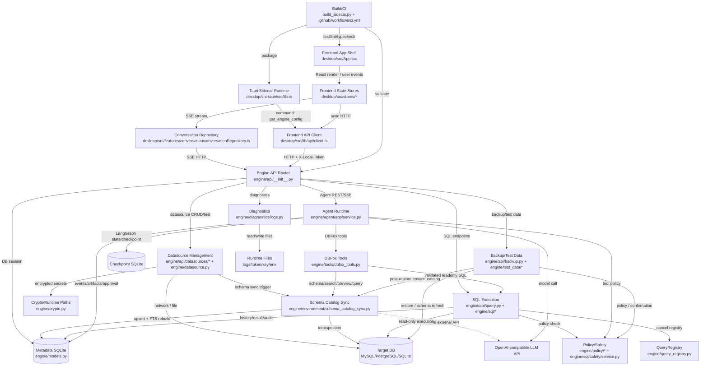
```mermaid
flowchart TD
  Tauri["Tauri Sidecar Runtime<br/>desktop/src-tauri/src/lib.rs"] -->|"command: get_engine_config"| Client["Frontend API Client<br/>desktop/src/lib/api/client.ts"]
  App["Frontend App Shell<br/>desktop/src/App.tsx"] -->|"React render / user events"| Stores["Frontend State Stores<br/>desktop/src/stores/*"]
  Stores -->|"sync HTTP"| Client
  Stores -->|"SSE stream"| ConvRepo["Conversation Repository<br/>desktop/src/features/conversation/conversationRepository.ts"]
  ConvRepo -->|"SSE HTTP"| API["Engine API Router<br/>engine/api/__init__.py"]
  Client -->|"HTTP + X-Local-Token"| API

  API -->|"DB session"| MetaDB[("Metadata SQLite<br/>engine/models.py")]
  API -->|"datasource CRUD/test"| Datasource["Datasource Management<br/>engine/api/datasources/* + engine/datasource.py"]
  API -->|"SQL endpoints"| SQL["SQL Execution<br/>engine/api/query.py + engine/sql/*"]
  API -->|"Agent REST/SSE"| Agent["Agent Runtime<br/>engine/agent/app/service.py"]
  API -->|"backup/test data"| Backup["Backup/Test Data<br/>engine/api/backup.py + engine/test_data/*"]
  API -->|"diagnostics"| Diag["Diagnostics<br/>engine/diagnostics/logs.py"]

  Datasource -->|"encrypted secrets"| Crypto["Crypto/Runtime Paths<br/>engine/crypto.py"]
  Datasource -->|"network / file"| TargetDB[("Target DB<br/>MySQL/PostgreSQL/SQLite")]
  Datasource -->|"schema sync trigger"| Schema["Schema Catalog Sync<br/>engine/environment/schema_catalog_sync.py"]
  Schema -->|"introspection"| TargetDB
  Schema -->|"upsert + FTS rebuild"| MetaDB
  Schema -.->|"optional external API"| LLM["OpenAI-compatible LLM API"]

  SQL -->|"policy check"| Policy["Policy/Safety<br/>engine/policy/* + engine/sql/safety/service.py"]
  SQL -->|"read-only execution"| TargetDB
  SQL -->|"history/result/audit"| MetaDB
  SQL -->|"cancel registry"| QueryRegistry["QueryRegistry<br/>engine/query_registry.py"]

  Agent -->|"LangGraph state/checkpoint"| CheckpointDB[("Checkpoint SQLite")]
  Agent -->|"tool policy"| Policy
  Agent -->|"DBFox tools"| Tools["DBFox Tools<br/>engine/tools/dbfox_tools.py"]
  Tools -->|"schema/search/preview/query"| Schema
  Tools -->|"validated readonly SQL"| SQL
  Agent -->|"model call"| LLM
  Agent -->|"events/artifacts/approval"| MetaDB

  Backup -->|"policy / confirmation"| Policy
  Backup -->|"restore / schema refresh"| TargetDB
  Backup -->|"post-restore ensure_catalog"| Schema

  Diag -->|"read/write files"| RuntimeFiles["Runtime Files<br/>logs/token/key/env"]

  Build["Build/CI<br/>build_sidecar.py + .github/workflows/ci.yml"] -->|"package"| Tauri
  Build -->|"validate"| API
  Build -->|"test/lint/typecheck"| App

  %% 潜在耦合点：
  %% 1. Agent Tools 同时依赖 SQL、Schema、Policy，属于高耦合业务核心。
  %% 2. Frontend stores 同时管理 UI 状态和远程副作用，变更 API 时需要同步更新。
  %% 3. Metadata model 是多模块共享核心，迁移影响面大。
```

图例：实线表示同步调用或直接依赖；标注为 SSE 的边表示事件流；圆柱表示数据库或持久化系统；虚线表示可选外部 API 调用或条件分支。未发现明确的源码级循环依赖，但 `Agent Runtime -> Tools -> SQL/Schema -> Metadata` 与 `Conversation/API -> Agent Runtime -> Metadata` 形成较强的业务耦合，属于重构和测试重点。

## 4. 每个功能模块的详细拆解

## 4.1 模块名称：`Tauri Sidecar Runtime`

### 4.1.1 模块定位

该模块位于桌面运行时层，负责在 Tauri 应用启动时启动 Python FastAPI 引擎 sidecar，并将动态端口和本地 token 暴露给 React 前端。它不负责业务 API、SQL 执行或 UI 状态；它只管理引擎进程生命周期和 readiness/health。

协作模块：`desktop/src/lib/api/client.ts` 通过 Tauri command 获取引擎配置；`engine/main.py` 输出 readiness 并提供 `/api/v1/health`。

### 4.1.2 关键代码文件

| 文件 / 目录 | 作用 | 关键类 / 函数 / 组件 | 备注 |
| ------- | -- | ------------- | -- |
| `desktop/src-tauri/src/lib.rs` | sidecar 进程监管、token 生成、ready/health 等待、Tauri command。 | `EngineSupervisor`、`PythonEngine`、`get_engine_config`、`spawn_python_engine`、`wait_for_engine_ready`、`wait_for_engine_health` | CodeGraph 显示 `EngineSupervisor::start()` 串联启动、读 stdout、health probe。 |
| `desktop/src-tauri/tauri.conf.json` | Tauri build/runtime 配置。 | `beforeBuildCommand`、`externalBin` | 打包时依赖 `build_sidecar.py` 生成 sidecar。 |
| `desktop/src-tauri/Cargo.toml` | Rust 依赖和 edition。 | Tauri 2、serde、rand | token 由 `rand` 生成。 |

### 4.1.3 对外接口

| 接口名称 | 类型 | 输入 | 输出 | 调用方 | 副作用 |
| ---- | -- | -- | -- | --- | --- |
| `get_engine_config` | Tauri command | 无显式业务输入；读取 `PythonEngine` state | `{ port, token }` 或错误字符串 | `desktop/src/lib/api/client.ts` | 无写入；依赖 sidecar ready 状态 |
| `EngineSupervisor::start` | runtime entry | 生成 token，读取环境/打包路径 | `EngineSupervisor` | Tauri `run()` | 启动子进程、写 sidecar 错误日志 |
| `stop_python_engine` | runtime cleanup | `PythonEngine` | 无 | window close/drop | kill child process，Windows 使用 `taskkill /T /F` |

### 4.1.4 内部结构

| 子组件 | 职责 | 输入 | 输出 | 依赖 |
| --- | -- | -- | -- | -- |
| token 生成 | 生成 32 字节随机 hex token。 | OS RNG | token 字符串 | `rand` |
| sidecar spawn | debug 下启动 Python，prod 下查找 binary。 | token、运行模式 | child process | `std::process::Command` |
| readiness parser | 从 stdout 解析 `DBFOX_ENGINE_READY {"port":...}`。 | stdout lines | port | serde JSON |
| health probe | 调用 `/api/v1/health`。 | port | ready/错误 | local HTTP |
| cleanup | 停止子进程。 | child pid | 进程结束 | OS process API |

### 4.1.5 核心执行流程

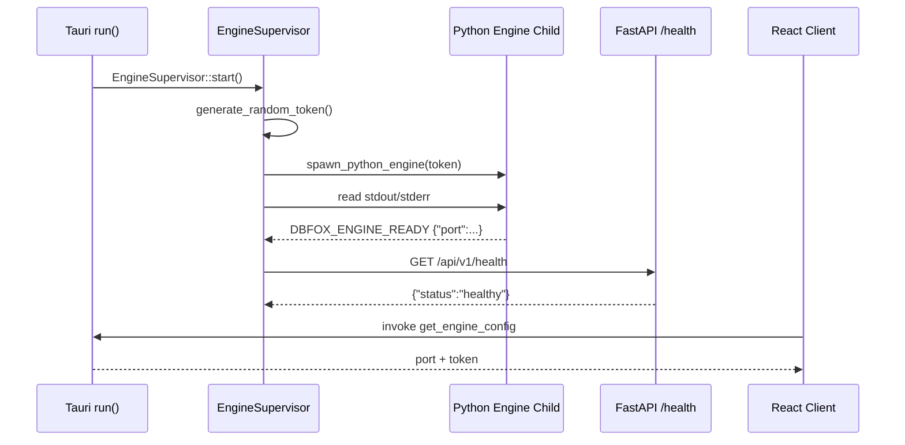
```mermaid
sequenceDiagram
  participant Tauri as Tauri run()
  participant Sup as EngineSupervisor
  participant Child as Python Engine Child
  participant Engine as FastAPI /health
  participant UI as React Client

  Tauri->>Sup: EngineSupervisor::start()
  Sup->>Sup: generate_random_token()
  Sup->>Child: spawn_python_engine(token)
  Sup->>Child: read stdout/stderr
  Child-->>Sup: DBFOX_ENGINE_READY {"port":...}
  Sup->>Engine: GET /api/v1/health
  Engine-->>Sup: {"status":"healthy"}
  UI->>Tauri: invoke get_engine_config
  Tauri-->>UI: port + token
```

流程说明：入口是 `desktop/src-tauri/src/lib.rs::run()`；`EngineSupervisor::start()` 生成 token 并启动 child；stdout reader 等待 ready 行；随后 health probe 确认引擎可用；`get_engine_config` 只在 `ready=true` 且 `port` 存在时返回配置。

### 4.1.6 数据流分析

- 输入数据：运行模式、sidecar 路径、随机 token、child stdout。
- 中间状态：`EngineSupervisor.child`、`port`、`token`、`ready`、`error`。
- 输出数据：前端可用的 `{ port, token }`。
- 持久化数据：失败时写临时 `dbfox-sidecar.log`。
- 敏感数据：token 是敏感数据；不应进入普通日志。

### 4.1.7 状态变化分析

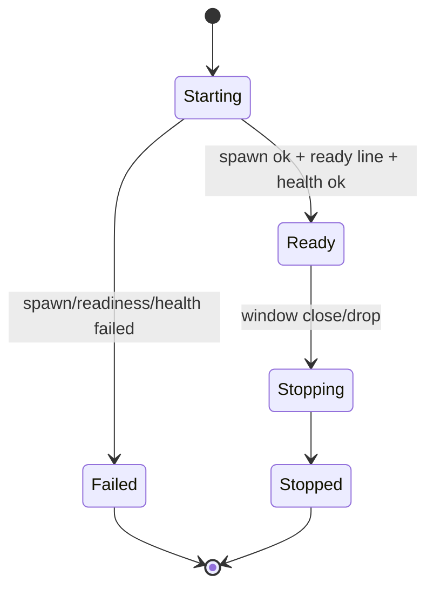
```mermaid
stateDiagram-v2
  [*] --> Starting
  Starting --> Ready: spawn ok + ready line + health ok
  Starting --> Failed: spawn/readiness/health failed
  Ready --> Stopping: window close/drop
  Stopping --> Stopped
  Failed --> [*]
  Stopped --> [*]
```

状态字段在 `EngineSupervisor` 中体现：`child`、`port`、`ready`、`error`。取消/关闭通过 `stop_python_engine` 触发；没有 retry 证据。

### 4.1.8 错误处理与边界情况

| 场景 | 当前处理 | 风险 |
| --- | --- | --- |
| spawn 失败 | `error` 写入 supervisor，`get_engine_config` 返回错误。 | 前端只能感知引擎不可用。 |
| stdout 未捕获 | 写 sidecar 错误日志，停止 child。 | 依赖日志排查。 |
| 20 秒 readiness/health 超时 | 停止 child，记录错误。 | 慢机器或首次迁移可能误判失败。 |
| window close | 尝试 kill child。 | Windows `taskkill` 强杀，事务中的引擎操作可能被中断。 |

### 4.1.9 安全与权限

需要本地 token，但授权边界由 `engine/main.py` 实施。Tauri 负责生成 token 并只通过 command 提供给前端。根据代码推断：如果前端 env 或内存被同用户进程读取，localhost API 仍可能被调用。

### 4.1.10 性能与扩展性

启动时间受 Python 引擎、Alembic 迁移、PyInstaller 解包和 health probe 影响。当前启动等待约 20 秒，缺少 retry/backoff 证据。该模块是单进程本地运行时，不追求横向扩展。

### 4.1.11 测试覆盖情况

| 测试文件 | 覆盖内容 | 测试类型 | 缺口 |
| ---- | ---- | ---- | -- |
| `desktop/src-tauri/src/lib.rs` | sidecar 路径候选、ready parse、config 返回等 Rust 单元测试。 | 单元 | 打包安装后的真实 sidecar 启动 smoke test 未在 CI 中发现。 |
| `engine/tests/test_build_sidecar.py` | sidecar 构建脚本行为。 | 单元/构建 | 未覆盖所有目标平台二进制运行。 |
| `engine/tests/test_startup.py`、`engine/tests/test_runtime_credentials.py` | 后端 token/runtime credential。 | 后端单元 | Tauri 与 Python 端到端联动测试未知。 |

### 4.1.12 模块风险与改进建议

| 风险 / 问题 | 影响 | 建议 | 优先级 |
| ------- | -- | -- | --- |
| readiness/health 超时固定 | 首次迁移或慢机器可能启动失败 | 将超时配置化，并区分 migration 阶段日志 | P2 |
| 发布/签名/更新流水线未知 | 打包质量依赖人工 | 增加 Tauri packaged smoke CI 或 release checklist | P2 |
| token 生命周期只在本地进程内保护 | 同用户本地进程仍可能攻击 | 文档化 threat model，避免任何日志泄露 token | P1 |

## 4.2 模块名称：`Frontend App Shell`

### 4.2.1 模块定位

该模块位于 UI 层，是用户可见工作台入口。`desktop/src/App.tsx` 初始化 client logging、datasource store、conversation store，并组合数据源树、工作区标签、右侧抽屉、命令面板和上下文菜单。`WorkspaceRouter` 根据 tab 类型渲染 SQL、表、会话、诊断、Agent eval、artifact result 等页面。

它不直接执行数据库逻辑，不直接保存后端元数据；它通过 stores 和 API client 间接触发后端能力。

### 4.2.2 关键代码文件

| 文件 / 目录 | 作用 | 关键类 / 函数 / 组件 | 备注 |
| ------- | -- | ------------- | -- |
| `desktop/src/main.tsx` | React bootstrap，等待引擎 health。 | `initEngineConfig()`、`waitEngineHealth()`、providers | 启动 UI 前依赖 engine ready。 |
| `desktop/src/App.tsx` | 应用壳和全局交互。 | `App`、store 初始化、快捷键、布局 | CodeGraph 显示 mount 时调用 `loadDatasources()` 和 `initConversations()`。 |
| `desktop/src/features/appShell/WorkspaceRouter.tsx` | tab 类型到页面组件的分发。 | `WorkspaceRouter` | 包含 smart-query、sql、table、multi-table、diagnostics 等分支。 |
| `desktop/src/features/datasource/*` | 数据源树和数据源 UI。 | `DataSourceTree` | 依赖 datasource store。 |
| `desktop/src/features/workspace/*` | SQL、结果、表预览、多表工作区、制品。 | `SqlConsoleTab`、`QueryResultTab`、`ArtifactRenderer` | 连接 query API 和 artifact view。 |

### 4.2.3 对外接口

| 接口名称 | 类型 | 输入 | 输出 | 调用方 | 副作用 |
| ---- | -- | -- | -- | --- | --- |
| `App` | React component | 全局 store state、用户事件 | app shell DOM | Tauri/React root | 初始化 stores、安装日志 |
| `WorkspaceRouter` | React component | `activeTab`、`showToast` | 对应 workspace page | `App` | 打开结果/SQL tab 等 UI 副作用 |
| `useAppCommands` | hook | tables、actions | command items | `App` | 命令面板触发 workspace actions |

### 4.2.4 内部结构

| 子组件 | 职责 | 输入 | 输出 | 依赖 |
| --- | -- | -- | -- | -- |
| DataSourceTree | 浏览数据源/表，触发打开表或刷新 schema。 | datasource state | 树 UI 事件 | `datasourceStore` |
| WorkspaceTabs | 标签页导航。 | workspace tabs | active tab | `workspaceStore` |
| WorkspaceRouter | 页面分发。 | active tab type | page component | feature pages |
| CommandPalette | 全局命令入口。 | command items | action callback | `useAppCommands` |
| ContextDrawer | 表属性/AI suggest 抽屉。 | active tab | side panel | workspace state |

### 4.2.5 核心执行流程

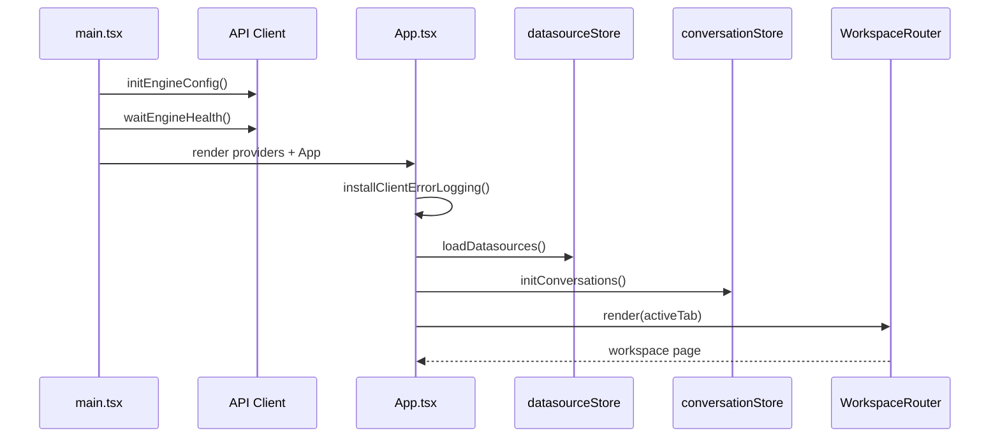
```mermaid
sequenceDiagram
  participant Main as main.tsx
  participant Client as API Client
  participant App as App.tsx
  participant DS as datasourceStore
  participant Conv as conversationStore
  participant Router as WorkspaceRouter

  Main->>Client: initEngineConfig()
  Main->>Client: waitEngineHealth()
  Main->>App: render providers + App
  App->>App: installClientErrorLogging()
  App->>DS: loadDatasources()
  App->>Conv: initConversations()
  App->>Router: render(activeTab)
  Router-->>App: workspace page
```

### 4.2.6 数据流分析

- 输入数据：用户点击、键盘快捷键、store state、API 响应。
- 中间状态：active tab、selected tables、right drawer、command palette、context menu。
- 输出数据：React UI、toast、workspace tab actions。
- 持久化数据：UI 层主要依赖 stores；持久化由后端 API 完成。
- 敏感数据：不直接处理数据库密码；LLM key 可能经 LLM config/UI 进入 API 请求，需避免进入诊断日志。

### 4.2.7 状态变化分析

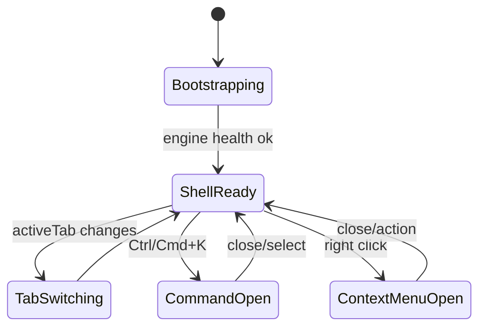
```mermaid
stateDiagram-v2
  [*] --> Bootstrapping
  Bootstrapping --> ShellReady: engine health ok
  ShellReady --> TabSwitching: activeTab changes
  ShellReady --> CommandOpen: Ctrl/Cmd+K
  ShellReady --> ContextMenuOpen: right click
  TabSwitching --> ShellReady
  CommandOpen --> ShellReady: close/select
  ContextMenuOpen --> ShellReady: close/action
```

### 4.2.8 错误处理与边界情况

前端启动阶段如果 `waitEngineHealth` 失败，会抛出 `ApiError("ENGINE_HEALTH_UNAVAILABLE")`；具体错误边界由 `main.tsx` 的 error boundary/providers 承接。workspace 页面层通常通过 toast 暴露错误。对 tab 类型的兜底是 `WorkspaceRouter` 最后返回 `QueryResultTab`，这依赖 activeTab 类型设计，若新增 tab 未接入可能误渲染为结果页。

### 4.2.9 安全与权限

认证由 API client 注入 token。UI 层需要避免将 token、API key、密码写入日志。诊断日志已有前端 client log redaction，但具体覆盖范围应以 `desktop/src/lib/diagnostics/clientLog.ts` 为准。

### 4.2.10 性能与扩展性

App shell 使用 Zustand selectors 降低重渲染。数据网格使用 TanStack Table/Virtual。风险集中在大表结果和多 tab 场景；结果展示应持续使用分页/虚拟滚动，不应将大结果一次性塞进全局 state。

### 4.2.11 测试覆盖情况

| 测试文件 | 覆盖内容 | 测试类型 | 缺口 |
| ---- | ---- | ---- | -- |
| `desktop/src/__tests__/appShell.test.ts` | app shell 行为。 | UI 单元 | 真实 Tauri 环境端到端未知。 |
| `desktop/src/features/appShell/__tests__/WorkspaceRouter.test.tsx` | tab 分发。 | UI 单元 | 新 tab 类型需同步加测试。 |
| `desktop/src/stores/__tests__/workspaceStore.test.ts` | tab/store 行为。 | store 单元 | 多窗口/持久化状态未知。 |
| `desktop/src/features/workspace/__tests__/*` | SQL、workspace、artifact 等 UI。 | UI 单元 | 与真实后端 SSE 联动覆盖有限。 |

### 4.2.12 模块风险与改进建议

| 风险 / 问题 | 影响 | 建议 | 优先级 |
| ------- | -- | -- | --- |
| `WorkspaceRouter` 分支随 tab 类型增长 | 新页面可能漏接路由或测试 | 将 tab 类型到组件映射显式表驱动化 | P2 |
| UI store 同时承载状态和副作用 | API 变更影响面大 | 对长流程引入 repository/service 层，stores 保持状态协调 | P2 |
| Tauri 真实环境 E2E 不明确 | 桌面壳、sidecar、WebView 集成可能回归 | 增加启动、health、打开数据源/SQL 页面 smoke | P2 |

## 4.3 模块名称：`Frontend API Client 与 State Stores`

### 4.3.1 模块定位

该模块处于前端数据访问和状态协调层。`desktop/src/lib/api/client.ts` 统一封装本地 API 调用，stores 使用它加载数据源、会话、schema、Agent 事件等。该模块不负责后端业务规则，但直接影响所有前端功能可用性。

### 4.3.2 关键代码文件

| 文件 / 目录 | 作用 | 关键类 / 函数 / 组件 | 备注 |
| ------- | -- | ------------- | -- |
| `desktop/src/lib/api/client.ts` | API 基础 client、engine health、错误模型。 | `waitEngineHealth`、`ApiError`、`request` | CodeGraph 显示 health retry 和 `ApiError`。 |
| `desktop/src/lib/api/datasources.ts` | 数据源 API 封装。 | datasource CRUD 函数 | 被 `datasourceStore` 调用。 |
| `desktop/src/lib/api/query.ts` | 查询 API 封装。 | execute/validate/history/result view | 被 SQL workspace 调用。 |
| `desktop/src/lib/api/agent.ts` | Agent API 封装。 | run/resume/artifact/event APIs | 被 Agent store/UI 调用。 |
| `desktop/src/features/conversation/conversationRepository.ts` | 会话 REST/SSE 封装。 | stream parser、message APIs | `conversationStore` 的主要 IO 层。 |
| `desktop/src/stores/datasourceStore.ts` | 数据源、schema、active datasource 状态。 | `loadDatasources`、`setActiveDatasource`、`refreshSchema` | 切换数据源会释放旧连接池。 |
| `desktop/src/stores/conversationStore.ts` | 会话、消息、run、artifact、approval 状态。 | `initConversations`、`sendMessage`、approval actions | 处理 SSE 批量事件和 abort。 |
| `desktop/src/stores/workspaceStore.ts` | 标签页和工作区动作。 | `openSqlConsole`、`openTableTab`、`closeTab` | UI 路由状态核心。 |

### 4.3.3 对外接口

| 接口名称 | 类型 | 输入 | 输出 | 调用方 | 副作用 |
| ---- | -- | -- | -- | --- | --- |
| `waitEngineHealth` | function | attempts、intervalMs | Promise<void> 或 `ApiError` | `main.tsx` | 轮询 health |
| `request` | function | method、path、body | JSON response | API modules/stores | 注入 token、retry/cache GET |
| `datasourceStore.loadDatasources` | store action | 无 | state update | `App`、UI | HTTP GET |
| `datasourceStore.refreshSchema` | store action | datasource id | state update | DataSourceTree/UI | HTTP POST sync |
| `conversationStore.sendMessage` | store action | conversation id、content、LLM config | streamed state | Conversation UI | SSE、abort controller、message/run/artifact state |
| `conversationRepository.streamMessage` | repository function | message payload | event iterator/callback | conversation store | SSE network stream |

### 4.3.4 内部结构

| 子组件 | 职责 | 输入 | 输出 | 依赖 |
| --- | -- | -- | -- | -- |
| engine config bootstrap | 从 Tauri 获取 port/token。 | Tauri command | client globals | `@tauri-apps/api/core` |
| HTTP request | 构造 URL、header、JSON、错误。 | request options | typed response | fetch |
| SSE parser | 解析 `data:` chunks。 | ReadableStream | runtime events | fetch stream |
| datasource store | 管理 active datasource/schema。 | API responses | Zustand state | datasource API |
| conversation store | 归一化 conversations/messages/runs/artifacts。 | SSE events | Zustand state | conversation repository |
| workspace store | 管理 tabs。 | UI actions | tab state | local state only |

### 4.3.5 核心执行流程

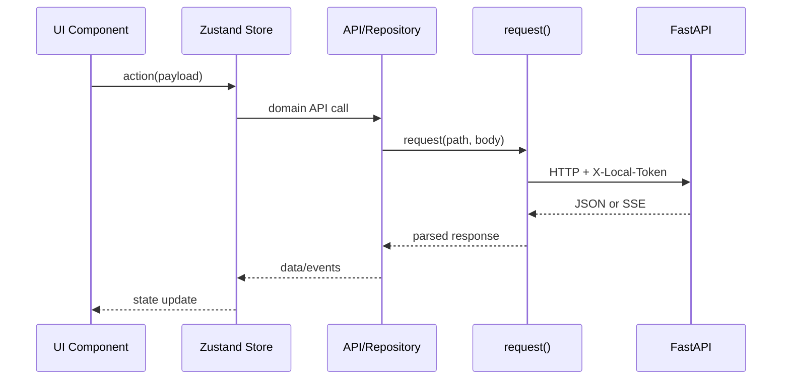
```mermaid
sequenceDiagram
  participant UI as UI Component
  participant Store as Zustand Store
  participant Repo as API/Repository
  participant Client as request()
  participant Engine as FastAPI

  UI->>Store: action(payload)
  Store->>Repo: domain API call
  Repo->>Client: request(path, body)
  Client->>Engine: HTTP + X-Local-Token
  Engine-->>Client: JSON or SSE
  Client-->>Repo: parsed response
  Repo-->>Store: data/events
  Store-->>UI: state update
```

### 4.3.6 数据流分析

- 输入数据：用户操作、active datasource、SQL、conversation message、LLM config。
- 中间状态：loading/error、abort controllers、event batches、normalized entities。
- 输出数据：React state、toast、workspace tab。
- 持久化数据：后端 metadata DB；前端 diagnostics 可能写 localStorage。
- 敏感数据：`X-Local-Token`、LLM API key、数据源连接信息；必须通过 redaction 保护。

### 4.3.7 状态变化分析

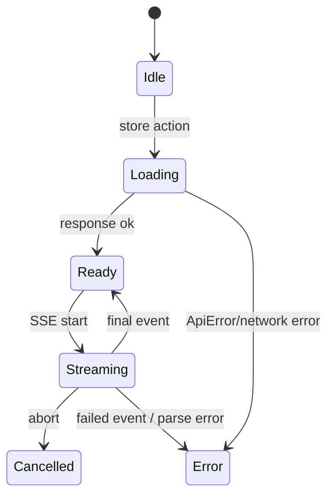
```mermaid
stateDiagram-v2
  [*] --> Idle
  Idle --> Loading: store action
  Loading --> Ready: response ok
  Loading --> Error: ApiError/network error
  Ready --> Streaming: SSE start
  Streaming --> Ready: final event
  Streaming --> Cancelled: abort
  Streaming --> Error: failed event / parse error
```

### 4.3.8 错误处理与边界情况

`ApiError` 承载 status、code、checks、detail。GET 请求存在 retry/cache/dedupe 逻辑（证据在 `desktop/src/lib/api/client.ts`）；SSE 解析失败或后端发送 `agent.run.failed` 时，由 conversation store 更新 run/message 失败状态。边界风险是同一 store 同时处理远程副作用和 UI 状态，异常路径容易遗漏。

### 4.3.9 安全与权限

所有非公开后端路由依赖 `X-Local-Token`。API client 是 token 注入点，因此任何绕过 `request` 的 fetch 都是风险点。SSE repository 也需要携带 token。

### 4.3.10 性能与扩展性

GET dedupe/cache 能减少重复请求；SSE 批量事件处理能减少渲染抖动。大结果数据不应长期放入单一 store；结果视图和导出应走后端 result view 分页/导出。

### 4.3.11 测试覆盖情况

| 测试文件 | 覆盖内容 | 测试类型 | 缺口 |
| ---- | ---- | ---- | -- |
| `desktop/src/lib/api/__tests__/client.test.ts` | health、request、错误处理。 | 单元 | 真实 token/Tauri command 端到端未知。 |
| `desktop/src/lib/api/__tests__/datasources.test.ts` | datasource API contract。 | 单元 | 与真实后端版本漂移需持续 contract test。 |
| `desktop/src/features/conversation/__tests__/conversationRepository.test.ts` | 会话 repository/SSE。 | 单元 | 长连接断开、乱序事件端到端覆盖有限。 |
| `desktop/src/stores/__tests__/conversationStore.test.ts` | 会话 store 状态。 | store 单元 | 审批 resume 和取消竞态建议加强。 |
| `desktop/src/stores/__tests__/datasourceStore.test.ts` | 数据源 store 状态。 | store 单元 | 真实 schema sync 大 catalog 场景未知。 |

### 4.3.12 模块风险与改进建议

| 风险 / 问题 | 影响 | 建议 | 优先级 |
| ------- | -- | -- | --- |
| API 类型与后端 schema 可能漂移 | 前端运行时错误 | 生成 OpenAPI/TS 类型或加强 contract tests | P1 |
| store 处理 SSE、abort、UI 合并逻辑复杂 | 容易出现竞态或状态残留 | 将 stream reducer 抽为纯函数并增加乱序/取消测试 | P1 |
| token 注入点分散风险 | 安全绕过 | 统一所有 fetch/SSE 入口，禁止裸 fetch 访问 API | P1 |

## 4.4 模块名称：`Engine API Router 与 Middleware`

### 4.4.1 模块定位

该模块位于后端 API 层。`engine/main.py` 创建 FastAPI app、注册安全中间件、CORS、异常处理和 lifespan；`engine/api/__init__.py` 将所有业务 router 挂载在 `/api/v1`。

它不实现具体业务规则，只负责统一入口、安全前置、路由分发和错误包装。

### 4.4.2 关键代码文件

| 文件 / 目录 | 作用 | 关键类 / 函数 / 组件 | 备注 |
| ------- | -- | ------------- | -- |
| `engine/main.py` | FastAPI app、lifespan、安全中间件、health/root、异常处理。 | `lifespan`、`verify_local_access_token`、`health` | CodeGraph 显示启动写 env、`init_db()`、关闭 tunnel。 |
| `engine/api/__init__.py` | 路由聚合。 | `router = APIRouter(prefix="/api/v1")` | include projects/datasources/query/agent/backup/table_design/semantic/eval/conversations/diagnostics。 |
| `engine/errors.py`、`engine/app/errors.py` | 统一异常和错误公开化。 | `DBFoxError` 等 | 各 API 模块抛出。 |
| `engine/db.py` | DB session dependency。 | `get_db`、`init_db` | API 层依赖 DB session。 |

### 4.4.3 对外接口

| 接口名称 | 类型 | 输入 | 输出 | 调用方 | 副作用 |
| ---- | -- | -- | -- | --- | --- |
| `/api/v1/health` | REST | 无 | health JSON | Tauri、前端、CI smoke | 无 |
| `verify_local_access_token` | middleware | HTTP request | response 或放行 | 所有请求 | 认证/拒绝 |
| `/api/v1/*` routers | REST/SSE | JSON/query/path/body | JSON/SSE | 前端 | 业务副作用由子模块产生 |
| `lifespan` | app lifecycle | app startup/shutdown | 无 | FastAPI | 写 `.env.local`、init DB、关闭 tunnels |

### 4.4.4 内部结构

| 子组件 | 职责 | 输入 | 输出 | 依赖 |
| --- | -- | -- | -- | -- |
| lifespan startup | 写前端 env、初始化 DB。 | token、port、runtime mode | app ready | `init_db()` |
| token middleware | 校验 `X-Local-Token`。 | request headers | allow/401 | `secrets.compare_digest` |
| origin gate | frozen 模式校验 origin/referer。 | request headers | allow/403 | allowed origins |
| exception handlers | 错误转换为 JSON。 | exception | JSONResponse | `DBFoxError` |
| router aggregation | include routers。 | APIRouter | `/api/v1` API | business routers |

### 4.4.5 核心执行流程

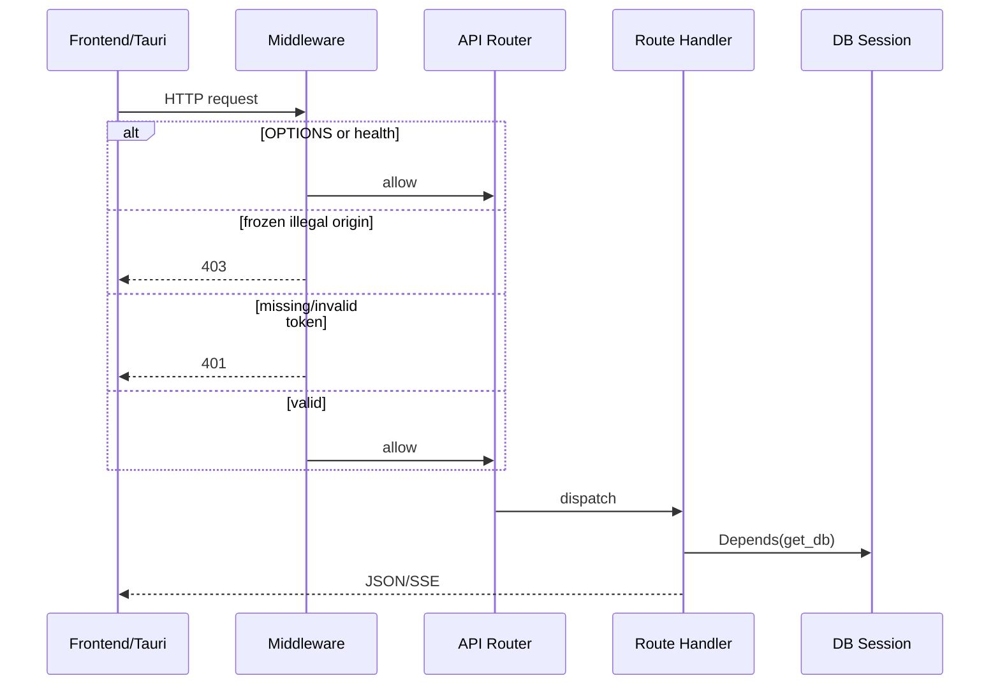
```mermaid
sequenceDiagram
  participant Client as Frontend/Tauri
  participant MW as Middleware
  participant Router as API Router
  participant Handler as Route Handler
  participant DB as DB Session

  Client->>MW: HTTP request
  alt OPTIONS or health
    MW->>Router: allow
  else frozen illegal origin
    MW-->>Client: 403
  else missing/invalid token
    MW-->>Client: 401
  else valid
    MW->>Router: allow
  end
  Router->>Handler: dispatch
  Handler->>DB: Depends(get_db)
  Handler-->>Client: JSON/SSE
```

### 4.4.6 数据流分析

- 输入数据：HTTP headers、path、body、query。
- 中间状态：request validation、DB session、exception context。
- 输出数据：JSONResponse、StreamingResponse。
- 持久化数据：API 子模块写入 metadata DB；middleware 本身不写 DB。
- 敏感数据：token、API key、密码；错误输出应走 public sanitizer。

### 4.4.7 状态变化分析

API 层本身无复杂业务状态；lifespan 状态为 startup -> running -> shutdown。

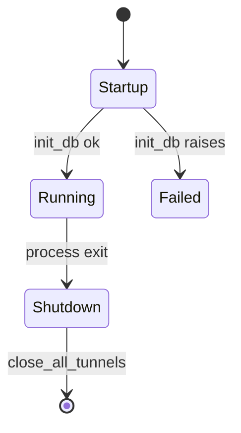
```mermaid
stateDiagram-v2
  [*] --> Startup
  Startup --> Running: init_db ok
  Startup --> Failed: init_db raises
  Running --> Shutdown: process exit
  Shutdown --> [*]: close_all_tunnels
```

### 4.4.8 错误处理与边界情况

非法 token 返回 401；非法 origin 返回 403；frozen 模式下 docs/openapi/redoc 返回 404；业务错误由 route/exception handler 处理。`init_db()` 失败会阻止应用启动，并触发 DB 备份恢复逻辑。

### 4.4.9 安全与权限

该模块是本地 API 安全入口。认证是本地 token；授权细粒度由下游 PolicyEngine、PolicyGate、confirmation 处理。无多用户模型，远程部署需重做鉴权。

### 4.4.10 性能与扩展性

middleware 每请求执行轻量 header 校验。FastAPI app 是本地单用户模型，未体现多实例横向扩展。SQLite metadata DB 和本地 sidecar 是扩展边界。

### 4.4.11 测试覆盖情况

| 测试文件 | 覆盖内容 | 测试类型 | 缺口 |
| ---- | ---- | ---- | -- |
| `engine/tests/test_startup.py` | 启动相关行为。 | 后端单元 | 完整 lifespan + Tauri 联动未知。 |
| `engine/tests/test_runtime_credentials.py` | token/runtime credential。 | 后端单元 | frozen WebView origin 场景端到端未知。 |
| `engine/tests/test_public_errors.py` | 公共错误输出。 | 后端单元 | 所有 route 的错误一致性需持续 contract test。 |
| `.github/workflows/ci.yml` | FastAPI health smoke。 | CI smoke | 仅 health，不覆盖业务路由。 |

### 4.4.12 模块风险与改进建议

| 风险 / 问题 | 影响 | 建议 | 优先级 |
| ------- | -- | -- | --- |
| 本地 token 模型不适合远程共享 | 若未来云化存在越权风险 | 明确 local-only threat model，远程部署另建 authn/authz | P1 |
| frozen origin 规则依赖 WebView 行为 | 平台差异可能误拒绝 | 增加 Tauri E2E 和 origin/referer 回归测试 | P2 |
| route 级错误风格不完全统一 | 前端错误处理复杂 | 统一 `DBFoxError` detail schema 和 contract test | P2 |

## 4.5 模块名称：`Datasource Management`

### 4.5.1 模块定位

该模块负责目标数据库连接配置生命周期：创建、更新、删除、测试连接、健康快照、连接释放、凭据加密、SSH/SSL 参数解析。它位于 API/Service/Domain 交界处，是 SQL、schema sync、backup、Agent 工具的上游基础。

它不负责 SQL 安全执行本身，也不负责 UI 状态；它只提供可连接的数据源定义和连接参数。

### 4.5.2 关键代码文件

| 文件 / 目录 | 作用 | 关键类 / 函数 / 组件 | 备注 |
| ------- | -- | ------------- | -- |
| `engine/api/datasources/__init__.py` | datasources 子路由聚合。 | router include | CodeGraph 测试显示该 API 拆分为 focused route modules。 |
| `engine/api/datasources/crud.py` | 数据源 test/create/list/update/delete/release。 | `api_test_connection`、`api_create_datasource` 等 | 处理加密密码、SSL、delete confirmation、pool release。 |
| `engine/api/datasources/health.py` | 健康检查和快照。 | `api_check_datasource_health` | 保存 latency/version/read-only/table count/warnings。 |
| `engine/datasource.py` | 实际连接测试、连接参数、SSH tunnel、权限探测。 | `test_connection`、`build_connection_params`、`close_all_tunnels` | 支持 MySQL/PostgreSQL/SQLite，代码存在 SSH/SSL 分支。 |
| `engine/crypto.py` | 密码加密/解密。 | `encrypt_password`、`decrypt_password` | AES-256-GCM。 |

### 4.5.3 对外接口

| 接口名称 | 类型 | 输入 | 输出 | 调用方 | 副作用 |
| ---- | -- | -- | -- | --- | --- |
| `POST /datasources/test` | API endpoint | datasource config | connection result | 前端数据源表单 | 可能建立临时连接/SSH tunnel |
| `POST /datasources` | API endpoint | datasource payload | datasource row | 前端 | 写 metadata DB、加密 secret |
| `GET /datasources` | API endpoint | query | datasource list | 前端 store | 读 metadata DB |
| `PATCH /datasources/{id}` | API endpoint | patch payload | updated datasource | 前端 | 更新 DB、可能重置连接 |
| `DELETE /datasources/{id}` | API endpoint | confirmation | ok | 前端 | 删除 datasource、关闭 tunnel/pool |
| `POST /datasources/{id}/health` | API endpoint | datasource id | health snapshot | 前端/诊断 | 更新 health 字段 |
| `release_datasource` | API endpoint/function | datasource id | ok | 前端 active switch | dispose pool |

### 4.5.4 内部结构

| 子组件 | 职责 | 输入 | 输出 | 依赖 |
| --- | -- | -- | -- | -- |
| payload schema | 校验连接字段。 | JSON | Pydantic model | `engine.schemas` |
| secret encryptor | 加密 password/SSH secret。 | plaintext | ciphertext | `engine.crypto` |
| connector | 按 db_type 连接 MySQL/Postgres/SQLite。 | connection params | connection result | PyMySQL/psycopg2/sqlite |
| SSH tunnel manager | 建立/关闭 tunnel。 | SSH config | local forwarded port | `sshtunnel` |
| permission probe | 探测 read-only、server version、table count。 | connection | warnings/snapshot | dialect-specific SQL |
| pool release | 释放 SQL pool。 | datasource id | disposed pool | `engine.sql.pool_manager` |

### 4.5.5 核心执行流程

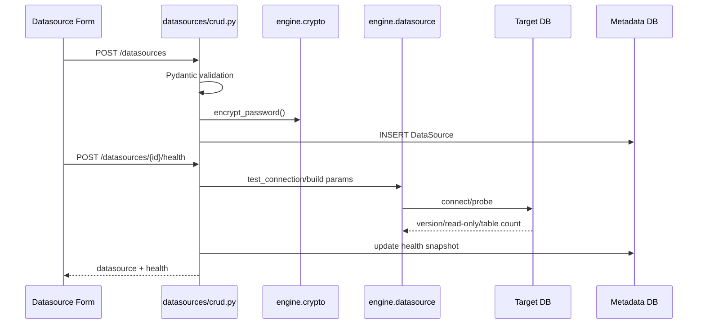
```mermaid
sequenceDiagram
  participant UI as Datasource Form
  participant API as datasources/crud.py
  participant Crypto as engine.crypto
  participant DS as engine.datasource
  participant DB as Target DB
  participant Meta as Metadata DB

  UI->>API: POST /datasources
  API->>API: Pydantic validation
  API->>Crypto: encrypt_password()
  API->>Meta: INSERT DataSource
  UI->>API: POST /datasources/{id}/health
  API->>DS: test_connection/build params
  DS->>DB: connect/probe
  DB-->>DS: version/read-only/table count
  API->>Meta: update health snapshot
  API-->>UI: datasource + health
```

### 4.5.6 数据流分析

- 输入数据：host、port、database、username、password、SSL、SSH、SQLite path。
- 中间状态：connection params、tunnel state、pool state、health result。
- 输出数据：datasource response、health snapshot、warnings。
- 持久化数据：`DataSource` row，encrypted secrets，health/sync metadata。
- 敏感数据：password、SSH password/key/passphrase、SSL paths；必须加密或脱敏。

### 4.5.7 状态变化分析

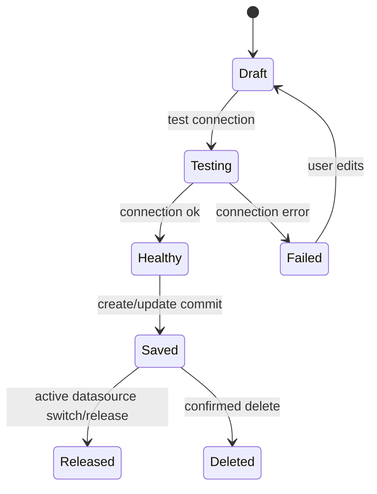
```mermaid
stateDiagram-v2
  [*] --> Draft
  Draft --> Testing: test connection
  Testing --> Healthy: connection ok
  Testing --> Failed: connection error
  Healthy --> Saved: create/update commit
  Failed --> Draft: user edits
  Saved --> Released: active datasource switch/release
  Saved --> Deleted: confirmed delete
```

### 4.5.8 错误处理与边界情况

连接失败通过 `DataSourceConnectionError`/`DBFoxError` 风格返回；健康检查会保存失败状态。delete 需要 confirmation，减少误删。SQLite 使用只读 URI 执行读取。外部 DB 网络超时、SSH 失败、SSL 配置错误是主要边界；代码有 warning 和 error path，但真实网络故障覆盖需依赖测试环境。

### 4.5.9 安全与权限

需要本地 API token。凭据经 AES-256-GCM 加密；密钥在私有 runtime 文件，OS keyring 只是镜像。注入风险主要来自连接参数和后续 SQL，Datasource 模块本身不拼接用户 SQL执行。越权风险来自缺少多用户边界，local-only 模型下接受。

### 4.5.10 性能与扩展性

连接测试和 health probe 是网络 IO；频繁切换数据源会触发 pool release。大规模数据源列表当前通过 metadata DB 查询，问题不大。横向扩展不是目标；扩展新 DB 类型需要修改 datasource、schema introspector、SQL dialect、permission probe 和 UI payload。

### 4.5.11 测试覆盖情况

| 测试文件 | 覆盖内容 | 测试类型 | 缺口 |
| ---- | ---- | ---- | -- |
| `engine/tests/test_datasources_api_structure.py` | datasources API 模块拆分结构。 | 架构/单元 | 不覆盖真实 DB。 |
| `engine/tests/test_datasource_update_api.py` | 更新 API。 | API 单元 | 并发更新未知。 |
| `engine/tests/test_datasource_ssl.py`、`test_datasource_ssl_e2e.py` | SSL 参数。 | 单元/E2E | 真实环境依赖可用性。 |
| `engine/tests/test_permission_probes.py` | 权限探测。 | 单元 | 各 DB 版本差异需持续补充。 |
| `engine/tests/whitebox/test_tunnel_whitebox.py` | tunnel 内部行为。 | 白盒 | SSH 真实联动场景有限。 |
| `desktop/src/lib/api/__tests__/datasources.test.ts`、`desktop/src/stores/__tests__/datasourceStore.test.ts` | 前端 contract/store。 | 前端单元 | 真实后端联动未知。 |

### 4.5.12 模块风险与改进建议

| 风险 / 问题 | 影响 | 建议 | 优先级 |
| ------- | -- | -- | --- |
| 新增 DB 类型改动面大 | 容易漏掉 schema/SQL/permission/UI | 定义 `DatasourceProvider` 抽象和 provider contract tests | P1 |
| SSH/SSL/Pool 状态复杂 | 连接泄露或错误复用 | 强化 release/close 的集成测试和日志 | P2 |
| 凭据生命周期依赖本地文件权限 | 本机安全边界有限 | 文档化密钥备份/轮换和威胁模型 | P2 |

## 4.6 模块名称：`Schema Catalog Sync`

### 4.6.1 模块定位

该模块负责把目标数据库的实时 schema 转换为 DBFox 本地 metadata catalog。它位于 data access/pipeline 层，是 SQL 安全校验、Agent schema context、table UI、semantic search 的共同基础。

它不负责连接配置创建，不负责用户 SQL 执行；它只内省结构并维护 `SchemaTable`、`SchemaColumn`、`SchemaSearchDoc`。

### 4.6.2 关键代码文件

| 文件 / 目录 | 作用 | 关键类 / 函数 / 组件 | 备注 |
| ------- | -- | ------------- | -- |
| `engine/api/datasources/schema.py` | schema sync/list/columns/ER API。 | `api_sync_schema`、table/column endpoints | list tables 在 catalog 为空时会自动 sync。 |
| `engine/environment/schema_introspector.py` | 目标 DB 结构内省。 | `introspect_datasource` | 支持 SQLite/MySQL/PostgreSQL；DuckDB 代码存在但依赖未声明。 |
| `engine/environment/schema_catalog_sync.py` | catalog upsert、FK 解析、search docs 重建。 | `SchemaCatalogSync.sync`、`sync_inventory`、`ensure_catalog`、`rebuild_search_docs` | CodeGraph 显示 `ensure_catalog` 被 backup/table_design/eval 等调用。 |
| `engine/environment/inventory.py` | 内省数据结构。 | `SchemaInventory`、`TableInventory`、`ColumnInventory` | sync 输入模型。 |
| `engine/ai_index.py`、`engine/ai_enrich.py` | search text 和可选 AI enrich。 | `build_table_search_text`、`ai_enrich_catalog` | AI enrich 可选。 |

### 4.6.3 对外接口

| 接口名称 | 类型 | 输入 | 输出 | 调用方 | 副作用 |
| ---- | -- | -- | -- | --- | --- |
| `POST /datasources/{id}/sync` | API endpoint | datasource id、AI enrich 参数 | sync counts | 前端/schema panel | 写 schema catalog/search docs |
| `GET /datasources/{id}/schema/tables` | API endpoint | datasource id | tables | 前端 tree/table UI | catalog 为空时可能触发 sync |
| `GET /schema/tables/{table_id}/columns` | API endpoint | table id | columns | 表详情 UI | 读 metadata DB |
| `GET /schema/er-diagram` | API endpoint | datasource/table scope | ER graph | ER UI | 读 metadata DB |
| `ensure_catalog` | function | db session、datasource id、AI 参数 | `SyncResult` | backup、table_design、Agent/eval | 写 DB，可能调用 LLM |

### 4.6.4 内部结构

| 子组件 | 职责 | 输入 | 输出 | 依赖 |
| --- | -- | -- | -- | -- |
| datasource resolver | 根据 datasource id 解析连接信息。 | metadata DB | params | `engine.datasource` |
| introspector | 从 information_schema/PRAGMA 读取结构。 | target DB | `SchemaInventory` | DB drivers |
| table sync | upsert/delete `SchemaTable`。 | inventory tables | DB rows | SQLAlchemy |
| column sync | upsert/delete `SchemaColumn`。 | inventory columns | DB rows | SQLAlchemy |
| FK resolver | 将 FK 名称解析为 local table/column id。 | inventory FKs | FK fields | metadata DB |
| search doc builder | 重建 `SchemaSearchDoc`。 | tables/columns/AI metadata | FTS docs | `engine.ai_index` |
| AI enrich | 可选补充业务描述。 | schema catalog、LLM config | enriched metadata | LLM API |

### 4.6.5 核心执行流程

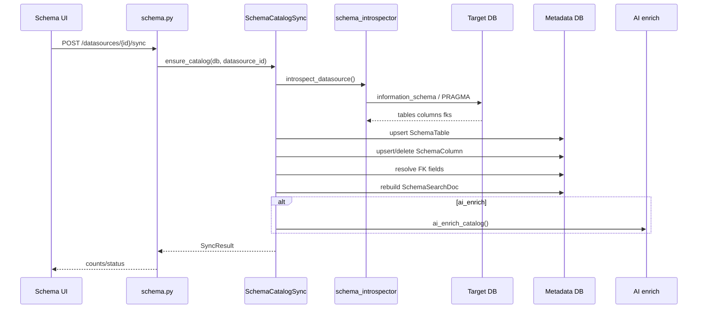
```mermaid
sequenceDiagram
  participant UI as Schema UI
  participant API as schema.py
  participant Sync as SchemaCatalogSync
  participant Intro as schema_introspector
  participant Target as Target DB
  participant Meta as Metadata DB
  participant AI as AI enrich

  UI->>API: POST /datasources/{id}/sync
  API->>Sync: ensure_catalog(db, datasource_id)
  Sync->>Intro: introspect_datasource()
  Intro->>Target: information_schema / PRAGMA
  Target-->>Intro: tables columns fks
  Sync->>Meta: upsert SchemaTable
  Sync->>Meta: upsert/delete SchemaColumn
  Sync->>Meta: resolve FK fields
  Sync->>Meta: rebuild SchemaSearchDoc
  alt ai_enrich
    Sync->>AI: ai_enrich_catalog()
  end
  Sync-->>API: SyncResult
  API-->>UI: counts/status
```

### 4.6.6 数据流分析

- 输入数据：datasource id、目标 DB schema、AI enrich 参数。
- 中间状态：`SchemaInventory`、existing tables/columns map、FK maps、search text。
- 输出数据：sync counts、table/column/ER responses。
- 持久化数据：`SchemaTable`、`SchemaColumn`、`SchemaSearchDoc`、AI metadata fields。
- 缓存数据：本地 catalog 本身是对外部 schema 的投影缓存。
- 敏感数据：schema 名称、表列注释可能包含业务敏感信息；AI enrich 可能把 schema 信息发送到外部 LLM。

### 4.6.7 状态变化分析

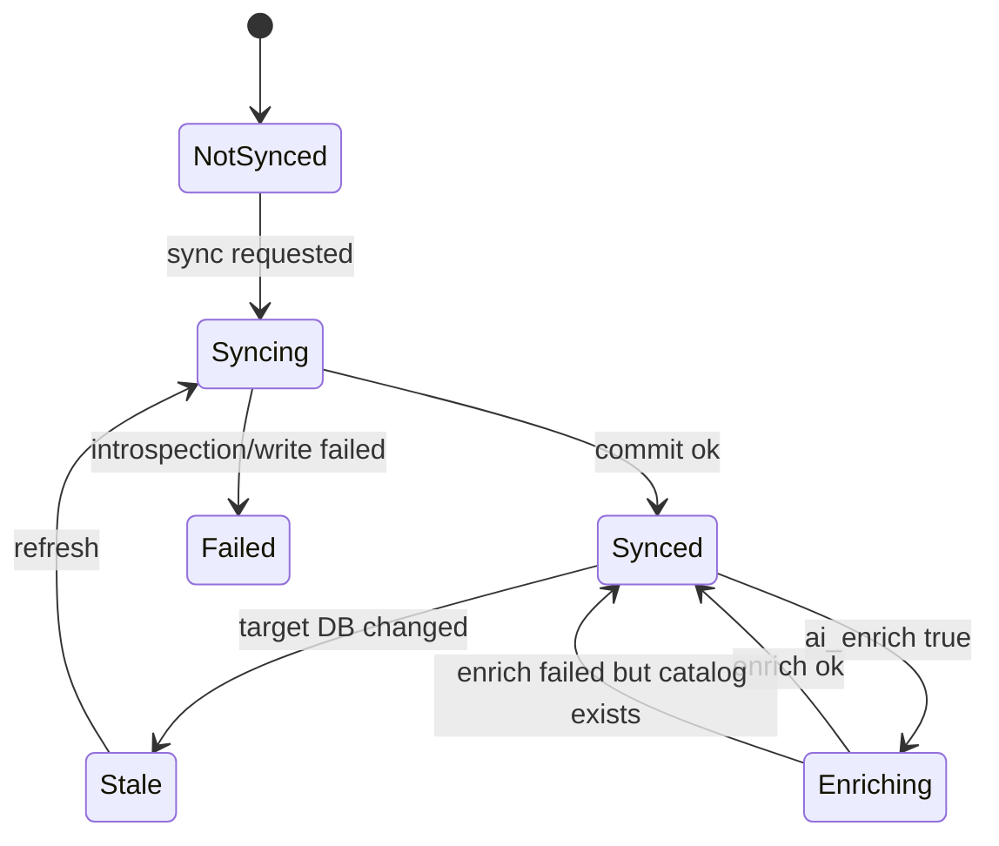
```mermaid
stateDiagram-v2
  [*] --> NotSynced
  NotSynced --> Syncing: sync requested
  Syncing --> Synced: commit ok
  Syncing --> Failed: introspection/write failed
  Synced --> Stale: target DB changed
  Stale --> Syncing: refresh
  Synced --> Enriching: ai_enrich true
  Enriching --> Synced: enrich ok
  Enriching --> Synced: enrich failed but catalog exists
```

### 4.6.8 错误处理与边界情况

内省失败会使 sync 失败；`sync_inventory` 在最后 `db.commit()`，失败前的 SQLAlchemy session 需要上层 rollback。AI enrich 在 catalog commit 之后执行，CodeGraph 源码显示 enrich 结果挂到 `SyncResult`，因此 catalog 基础同步和 enrich 失败应分离看待。DuckDB 支持 `待确认`，因为代码存在但依赖未声明。

### 4.6.9 安全与权限

需要 API token。目标 DB 权限至少需要 schema 读取权限。AI enrich 涉及外部 API 时应明确用户授权和脱敏策略；当前代码证据显示可传 `ai_api_key/api_base/model_name`，但是否对 schema 内容脱敏 `待确认`。

### 4.6.10 性能与扩展性

大 schema 风险高：全量内省、全量 rebuild search docs、FK 二次解析都会随表/列数量增长。当前支持增删改 upsert，但 search docs 是 datasource 粒度 delete/rebuild。对于超大 catalog，建议分页内省、增量 hash、后台任务化。

### 4.6.11 测试覆盖情况

| 测试文件 | 覆盖内容 | 测试类型 | 缺口 |
| ---- | ---- | ---- | -- |
| `engine/tests/test_schema_sync.py` | schema sync 行为。 | 后端单元/集成 | 超大 catalog 性能未知。 |
| `engine/tests/test_schema_introspector.py` | 内省器。 | 单元 | 多数据库版本差异需外部集成测试。 |
| `engine/tests/test_datasource_sync_ai_enrich.py` | sync + AI enrich 交互。 | 单元 | 真实 LLM 行为依赖环境。 |
| `desktop/src/features/workspace/table/__tests__/TableErPane.test.tsx` | ER UI。 | 前端单元 | 与真实 schema API 联动未知。 |

### 4.6.12 模块风险与改进建议

| 风险 / 问题 | 影响 | 建议 | 优先级 |
| ------- | -- | -- | --- |
| `ensure_catalog` 调用方多且副作用重 | backup/table_design/eval 调用时可能触发长时间 sync | 明确调用契约：强制刷新 vs lazy ensure，增加超时/进度事件 | P1 |
| DuckDB 代码与依赖不一致 | 使用该路径会运行失败 | 添加 `duckdb` 依赖或移除/feature-flag | P1 |
| search docs 全量重建 | 大 schema 性能风险 | 使用 schema hash 做增量 rebuild | P2 |

## 4.7 模块名称：`SQL Execution and Result View`

### 4.7.1 模块定位

该模块是 DBFox 的核心数据读取管线。它接收用户或 Agent 生成的 SQL，执行策略检查、安全解析、只读执行、结果序列化、历史审计、取消和结果视图分页/导出。

它不负责生成自然语言答案，也不负责创建数据源；它依赖 datasource、policy、schema catalog 和 DB drivers。

### 4.7.2 关键代码文件

| 文件 / 目录 | 作用 | 关键类 / 函数 / 组件 | 备注 |
| ------- | -- | ------------- | -- |
| `engine/api/query.py` | validate/execute/explain/cancel/history API。 | route handlers | 入口层。 |
| `engine/sql/safety/service.py` | SQL 安全判断。 | `SqlSafetyService` | 单条 SELECT、sqlglot、TrustGate、schema validation。 |
| `engine/policy/engine.py` | 用户 SQL/restore/test data 策略。 | `PolicyEngine` | DDL/commands/DML/read-only/prod 规则。 |
| `engine/sql/executor.py` | SQL 执行主服务。 | `execute_query` | CodeGraph 显示被 6 处调用，有 `engine/tests/test_executor.py` 覆盖。 |
| `engine/sql/dialect/*.py` | MySQL/Postgres/SQLite 方言执行和 explain。 | `_execute_on_mysql_profiled` 等 | 支持超时、取消、序列化。 |
| `engine/sql/row_serializer.py` | 行/列/响应大小限制和脱敏。 | `_fetch_and_serialize` | 防止大结果冲击内存/前端。 |
| `engine/query_registry.py` | 运行中查询注册/取消。 | `QUERY_REGISTRY` | SQLite progress handler、MySQL kill thread 等。 |
| `engine/sql/result_view/service.py` | 结果视图分页/导出。 | `ResultViewService` | 结果 artifact 后续查看。 |

### 4.7.3 对外接口

| 接口名称 | 类型 | 输入 | 输出 | 调用方 | 副作用 |
| ---- | -- | -- | -- | --- | --- |
| `POST /query/validate` | API endpoint | SQL、datasource id | safety decision | SQL UI、Agent tools | 无或读 schema |
| `POST /query/execute` | API endpoint | SQL、datasource id、limit/options | rows、columns、timings、warnings | SQL UI、Agent tools | 写 query history/search doc |
| `POST /query/explain` | API endpoint | SQL、datasource id | explain rows/warnings | SQL UI | 读 target DB |
| `POST /query/cancel` | API endpoint | execution id | cancelled | UI/SSE disconnect | 修改 registry，可能 kill target query |
| `execute_query` | function | db session、datasource、safe SQL | execution result | API、tools、result view | 目标 DB 查询、history |
| `ResultViewService` | service | artifact/source ref、page/export query | page/export data | artifact UI/API | 读 target DB 或 result source |

### 4.7.4 内部结构

| 子组件 | 职责 | 输入 | 输出 | 依赖 |
| --- | -- | -- | -- | -- |
| query API | 路由、Pydantic、DB session。 | request | response | FastAPI |
| policy engine | 环境/read-only/prod 操作策略。 | datasource、operation | allow/block | `engine.policy` |
| SQL safety | SQL parse、SELECT-only、schema/dialect validation。 | raw SQL | safe SQL decision | sqlglot、catalog |
| dialect executor | 连接目标 DB 并执行。 | safe SQL、params | cursor rows | DB drivers |
| serializer | 限制和脱敏结果。 | cursor | rows/columns/truncated | row limits |
| history writer | 记录审计和 FTS。 | SQL/result metadata | QueryHistory | SQLAlchemy |
| cancel registry | 注册并取消执行。 | execution id | cancel flag/kill | driver-specific hooks |

### 4.7.5 核心执行流程

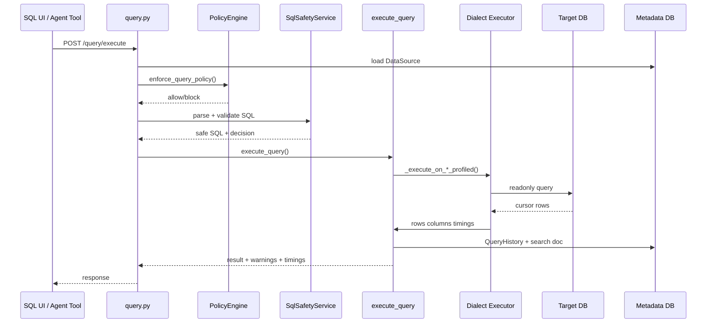
```mermaid
sequenceDiagram
  participant UI as SQL UI / Agent Tool
  participant API as query.py
  participant Policy as PolicyEngine
  participant Safety as SqlSafetyService
  participant Exec as execute_query
  participant Dialect as Dialect Executor
  participant Target as Target DB
  participant Meta as Metadata DB

  UI->>API: POST /query/execute
  API->>Meta: load DataSource
  API->>Policy: enforce_query_policy()
  Policy-->>API: allow/block
  API->>Safety: parse + validate SQL
  Safety-->>API: safe SQL + decision
  API->>Exec: execute_query()
  Exec->>Dialect: _execute_on_*_profiled()
  Dialect->>Target: readonly query
  Target-->>Dialect: cursor rows
  Dialect->>Exec: rows columns timings
  Exec->>Meta: QueryHistory + search doc
  Exec-->>API: result + warnings + timings
  API-->>UI: response
```

### 4.7.6 数据流分析

- 输入数据：raw SQL、datasource id、execution options。
- 中间状态：safe SQL、safety decision、execution id、timings、serialized rows。
- 输出数据：rows、columns、warnings、truncated、safetyDecision、history id。
- 持久化数据：`QueryHistory`、`QueryHistorySearchDoc`，可通过 `DBFOX_DISABLE_QUERY_HISTORY` 禁用。
- 缓存数据：DB connection pool、query registry。
- 敏感数据：SQL 文本、结果行、错误信息，均需脱敏。

### 4.7.7 状态变化分析

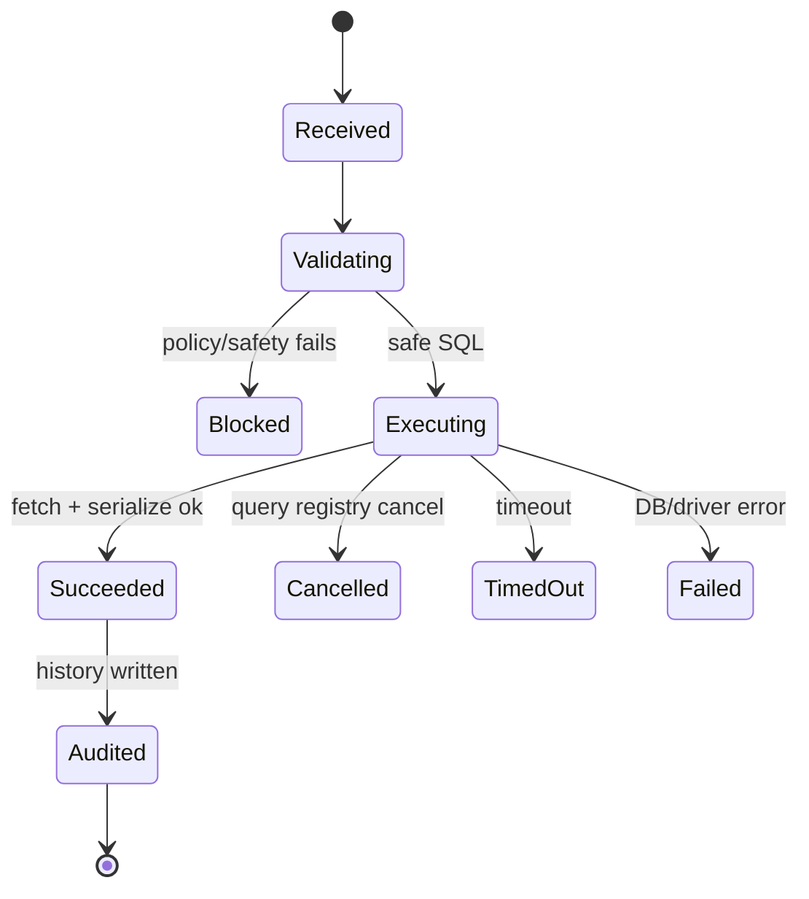
```mermaid
stateDiagram-v2
  [*] --> Received
  Received --> Validating
  Validating --> Blocked: policy/safety fails
  Validating --> Executing: safe SQL
  Executing --> Succeeded: fetch + serialize ok
  Executing --> Cancelled: query registry cancel
  Executing --> TimedOut: timeout
  Executing --> Failed: DB/driver error
  Succeeded --> Audited: history written
  Audited --> [*]
```

### 4.7.8 错误处理与边界情况

非法 SQL 被 safety service 拦截；DDL/commands/DML 根据策略阻断；目标 DB 错误映射为 public error；SQLite 通过 progress handler timeout/cancel；MySQL 设置 `MAX_EXECUTION_TIME` 并识别取消/超时错误；Postgres 细节以 `engine/sql/dialect/postgres.py` 为证据。history 写入应使用独立 audit session，避免执行失败影响主事务。

### 4.7.9 安全与权限

SQL 注入风险主要来自用户 SQL 直接执行；本模块通过 sqlglot、TrustGate、PolicyEngine、只读连接和 schema validation 降低风险。Agent 工具中 `sql.execute_readonly` 根据既有 state 的 `sql.validate` 结果执行，模型不能直接传 raw SQL 执行，这是重要安全边界。

### 4.7.10 性能与扩展性

性能风险包括大查询、全表扫描、大结果序列化、网络 DB 慢响应、连接池耗尽。已有 row/response 限制、timeout、cancel、timings、pool manager。建议对 result view/export 加强流式和批处理，避免大导出占用内存。

### 4.7.11 测试覆盖情况

| 测试文件 | 覆盖内容 | 测试类型 | 缺口 |
| ---- | ---- | ---- | -- |
| `engine/tests/test_executor.py` | `execute_query`、历史等。 | 后端单元 | 外部 DB 长查询/取消集成有限。 |
| `engine/tests/test_sql_safety_service.py` | safety service。 | 单元 | 方言差异需持续补充。 |
| `engine/tests/test_policy_engine.py` | SQL/restore/test data 策略。 | 单元 | 生产环境真实标记联动需补充。 |
| `engine/tests/test_query_registry.py` | 取消注册。 | 单元 | 真实 MySQL/Postgres kill query 集成未知。 |
| `engine/tests/test_result_view_service.py` | result view page/export。 | 单元 | 大导出和内存压力未知。 |
| `engine/tests/whitebox/test_row_serializer_whitebox.py` | 行序列化限制。 | 白盒 | 大对象/二进制类型边界需持续覆盖。 |
| `desktop/src/lib/api/__tests__/agent.test.ts`、`desktop/src/features/workspace/__tests__/SqlConsoleWorkspace.test.tsx` | 前端 query/Agent 交互。 | 前端单元 | 端到端真实 DB 未覆盖。 |

### 4.7.12 模块风险与改进建议

| 风险 / 问题 | 影响 | 建议 | 优先级 |
| ------- | -- | -- | --- |
| SQL 安全链路复杂 | 小改动可能打开绕过路径 | 建立 safety contract matrix：raw -> validate -> execute 不可绕过 | P1 |
| 大结果/导出内存风险 | UI 卡顿或进程内存增长 | 强制分页/流式导出，设置导出大小上限 | P1 |
| 外部 DB cancel 行为方言差异 | 用户取消不一定真正释放 DB 资源 | 增加真实 MySQL/Postgres 取消集成测试 | P2 |

## 4.8 模块名称：`Policy/Security/Redaction`

### 4.8.1 模块定位

该模块横跨 API、SQL、Agent、日志和诊断，负责本地访问控制、业务操作策略、工具调用策略、敏感信息识别和日志/错误脱敏。它是 DBFox 防止误操作、越权读取和敏感泄露的核心横切模块。

### 4.8.2 关键代码文件

| 文件 / 目录 | 作用 | 关键类 / 函数 / 组件 | 备注 |
| ------- | -- | ------------- | -- |
| `engine/main.py` | token 和 origin 中间件。 | `verify_local_access_token` | 本地 API 第一层安全网关。 |
| `engine/policy/engine.py` | SQL、restore、test data 策略。 | `PolicyEngine` | DDL/commands/DML/read-only/prod 规则。 |
| `engine/policy/gate.py` | Agent tool policy。 | `PolicyGate` | unknown tool、side effects、approval required。 |
| `engine/policy/redactor.py` | 脱敏。 | redaction functions | SQL credentials、tokens、API key、PII patterns。 |
| `engine/policy/sensitivity.py` | 敏感字段/表规则。 | sensitivity matchers | 供 SQL/Agent/schema 风险使用。 |
| `engine/sql/safety/service.py` | SQL trust gate。 | `SqlSafetyService` | SQL 级安全决策。 |

### 4.8.3 对外接口

| 接口名称 | 类型 | 输入 | 输出 | 调用方 | 副作用 |
| ---- | -- | -- | -- | --- | --- |
| `verify_local_access_token` | middleware | request | allow/401/403 | FastAPI app | 记录非法 origin warning |
| `PolicyEngine.enforce_query_policy` | function | datasource、SQL/op | allow/block | query API | 无 |
| `PolicyEngine.enforce_restore_policy` | function | datasource/environment | allow/block | backup API | 无 |
| `PolicyGate` | class/service | tool call、agent state | allow/block/approval | Agent policy node | 可能创建 approval state |
| redaction functions | function | text/object | redacted text/object | logs/errors/history | 无或改写输出 |

### 4.8.4 内部结构

| 子组件 | 职责 | 输入 | 输出 | 依赖 |
| --- | -- | -- | -- | -- |
| access middleware | 请求级认证。 | headers | allow/deny | token/origin config |
| operation policy | 判断操作在环境/read-only 下是否允许。 | operation context | decision | datasource metadata |
| SQL trust gate | 判断 SQL 是否安全。 | parsed SQL/schema | safety decision | sqlglot/catalog |
| tool policy gate | 判断 Agent 工具调用。 | tool call/state | allow/block/approval | tool registry |
| redactor | 移除敏感文本。 | SQL/log/error | redacted | regex/sensitivity |
| confirmation | 需要人工确认的操作协议。 | risky operation | confirmation requirement | policy rules |

### 4.8.5 核心执行流程

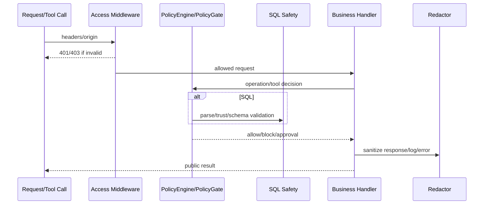
```mermaid
sequenceDiagram
  participant Req as Request/Tool Call
  participant Access as Access Middleware
  participant Policy as PolicyEngine/PolicyGate
  participant Safety as SQL Safety
  participant Handler as Business Handler
  participant Redactor as Redactor

  Req->>Access: headers/origin
  Access-->>Req: 401/403 if invalid
  Access->>Handler: allowed request
  Handler->>Policy: operation/tool decision
  alt SQL
    Policy->>Safety: parse/trust/schema validation
  end
  Policy-->>Handler: allow/block/approval
  Handler->>Redactor: sanitize response/log/error
  Handler-->>Req: public result
```

### 4.8.6 数据流分析

- 输入数据：HTTP headers、tool calls、SQL、datasource env/read-only flags、logs/errors。
- 中间状态：policy decision、approval requirement、safety decision、redacted payload。
- 输出数据：allow/block/approval、public error、redacted logs。
- 持久化数据：Agent approval rows、query history redacted fields、logs。
- 敏感数据：token、API keys、credentials、PII、SQL/result values。

### 4.8.7 状态变化分析

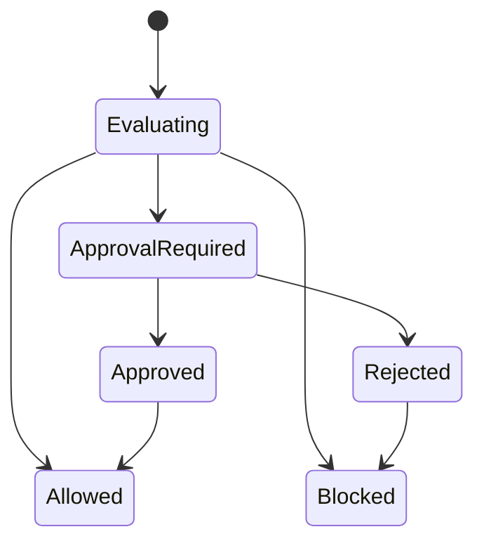
```mermaid
stateDiagram-v2
  [*] --> Evaluating
  Evaluating --> Allowed
  Evaluating --> Blocked
  Evaluating --> ApprovalRequired
  ApprovalRequired --> Approved
  ApprovalRequired --> Rejected
  Approved --> Allowed
  Rejected --> Blocked
```

### 4.8.8 错误处理与边界情况

策略阻断应返回明确 code/message；Agent tool policy 会在 state 中记录 blocked calls 和 consecutive blocks。脱敏失败不应导致业务失败，但如果脱敏覆盖不足会泄露敏感信息。`DBFOX_ALLOW_LLM_PLAINTEXT_LOGS=1` 是明确风险开关。

### 4.8.9 安全与权限

该模块是安全中心。缺口：无多用户鉴权；本地 token 不是完整授权系统。策略更多是“防误操作/防高风险操作”，不是 RBAC。

### 4.8.10 性能与扩展性

策略检查通常轻量；SQL parsing 对复杂 SQL 有 CPU 成本；redaction 对大文本日志/结果有成本。建议避免对超大结果做重复全量正则扫描。

### 4.8.11 测试覆盖情况

| 测试文件 | 覆盖内容 | 测试类型 | 缺口 |
| ---- | ---- | ---- | -- |
| `engine/tests/test_policy_engine.py` | 操作策略。 | 单元 | 新策略需 matrix tests。 |
| `engine/agent/tests/test_policy_gate.py`、`test_policy_node.py` | Agent tool policy。 | 单元 | 复杂 approval + resume 组合需加强。 |
| `engine/tests/test_redactor.py` | 脱敏。 | 单元 | 新敏感类型需持续添加样例。 |
| `engine/tests/whitebox/test_trust_gate_whitebox.py`、`test_safety_gate_whitebox.py` | SQL trust/safety。 | 白盒 | 方言绕过样例需持续扩展。 |
| `engine/tests/test_llm_log_privacy.py` | LLM 日志隐私。 | 单元 | 外部 provider 错误响应脱敏需补充。 |

### 4.8.12 模块风险与改进建议

| 风险 / 问题 | 影响 | 建议 | 优先级 |
| ------- | -- | -- | --- |
| 策略分散在 PolicyEngine、PolicyGate、SqlSafetyService | 修改安全规则时容易遗漏 | 增加统一策略决策文档和 contract tests | P1 |
| 脱敏依赖正则和约定 | 新敏感格式可能漏掉 | 建立红队样例集，加入 CI | P1 |
| 无 RBAC/多用户模型 | 不能直接云化 | 明确 local-only，远程版本单独设计 auth | P1 |

## 4.9 模块名称：`Agent Runtime`

### 4.9.1 模块定位

Agent Runtime 是系统最复杂的工作流模块。它将自然语言问题转换为 LangGraph ReAct 状态机执行：构建上下文、调用 LLM、执行工具、应用策略、观察结果、生成制品、处理审批、保存 checkpoint、流式发送 events。

它不直接由 UI 管理状态；UI 通过 `/agent/*` 或 `/conversations/*` SSE 观察运行状态。

### 4.9.2 关键代码文件

| 文件 / 目录 | 作用 | 关键类 / 函数 / 组件 | 备注 |
| ------- | -- | ------------- | -- |
| `engine/agent/runtime.py` | Agent facade。 | `DBFoxAgentRuntime` | 被 API/eval 调用。 |
| `engine/agent/app/service.py` | Agent 服务主实现。 | `DBFoxAgentService.run_iter`、`resume_approval_iter` | CodeGraph 显示 stream、interrupt、checkpoint、cancel。 |
| `engine/agent/graph/react_graph.py` | LangGraph 图定义。 | `build_dbfox_react_graph` | ReAct 状态机。 |
| `engine/agent/graph/state.py` | Agent state schema。 | `DBFoxAgentState` | 被 14+ 调用，有多项 agent tests 覆盖。 |
| `engine/agent/nodes/*.py` | 图节点。 | model/policy/tool/observe/progress/repair/finalize/approval nodes | Agent 行为分层。 |
| `engine/tools/dbfox_tools.py` | DBFox 工具注册。 | `register_dbfox_tools` | schema/sql/chart/answer 工具。 |
| `engine/agent_core/*` | 持久化、事件、memory、artifact。 | event store、persistence、types | Metadata DB 写入。 |

### 4.9.3 对外接口

| 接口名称 | 类型 | 输入 | 输出 | 调用方 | 副作用 |
| ---- | -- | -- | -- | --- | --- |
| `POST /agent/run` | REST | `AgentRunRequest` | final response | 前端/API/eval | 写 run/message/event/artifact |
| `POST /agent/run/stream` | SSE | `AgentRunRequest` | runtime events | 前端 | 写 DB、调用 LLM/tools |
| `POST /agent/runs/{run_id}/resume/stream` | SSE | approval decision | resumed events | 前端 approval UI | 更新 approval/checkpoint/run |
| `DBFoxAgentService.run_iter` | generator | request | `AgentRuntimeEvent` iterator | runtime facade/API/eval | 持久化、LLM、tools |
| `DBFoxAgentService.resume_approval_iter` | generator | run_id、approval_id、approved | events | API | 更新 approval，恢复 graph |
| `register_dbfox_tools` | function | registry/context | tool registry | Agent service | 注册工具 |

### 4.9.4 内部结构

| 子组件 | 职责 | 输入 | 输出 | 依赖 |
| --- | -- | -- | -- | -- |
| request context | 封装 DB/session/request/registry/event store。 | request | graph config | metadata DB |
| initial state builder | 构建 `DBFoxAgentState`。 | request、datasource、memory | state | context pack、database map |
| LangGraph app | 执行 ReAct 节点。 | state/Command | updates | LangGraph |
| model node | 调用 LLM 生成工具调用/答案。 | messages/context | AI message | LangChain/OpenAI compatible |
| policy node | 审查工具调用。 | pending tool calls | allow/block/approval | `PolicyGate` |
| tool node | 执行 DBFox tools。 | allowed calls | tool results | tool registry |
| observe/progress/repair | 观察结果、判断进度、修复 SQL/上下文。 | state | updates/events | progress judge/repair |
| finalize | 生成最终响应。 | final state | answer/artifacts | response builder |
| persistence/event store | 保存 run、event、artifact、approval、checkpoint。 | events/state | DB rows | metadata DB |

### 4.9.5 核心执行流程

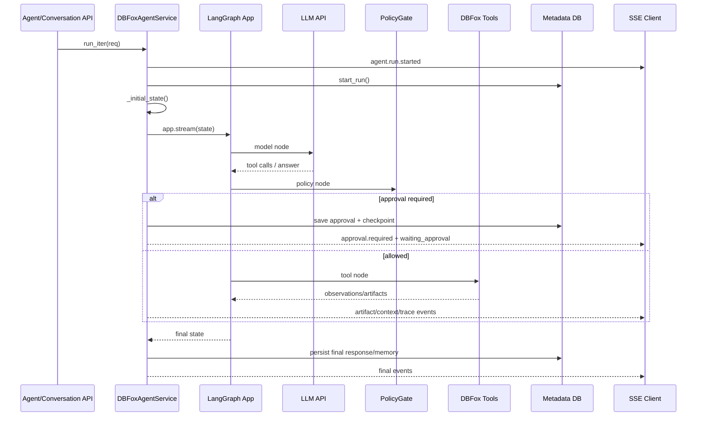
```mermaid
sequenceDiagram
  participant API as Agent/Conversation API
  participant Service as DBFoxAgentService
  participant Graph as LangGraph App
  participant LLM as LLM API
  participant Gate as PolicyGate
  participant Tools as DBFox Tools
  participant Meta as Metadata DB
  participant Client as SSE Client

  API->>Service: run_iter(req)
  Service->>Client: agent.run.started
  Service->>Meta: start_run()
  Service->>Service: _initial_state()
  Service->>Graph: app.stream(state)
  Graph->>LLM: model node
  LLM-->>Graph: tool calls / answer
  Graph->>Gate: policy node
  alt approval required
    Service->>Meta: save approval + checkpoint
    Service-->>Client: approval.required + waiting_approval
  else allowed
    Graph->>Tools: tool node
    Tools-->>Graph: observations/artifacts
    Service-->>Client: artifact/context/trace events
  end
  Graph-->>Service: final state
  Service->>Meta: persist final response/memory
  Service-->>Client: final events
```

### 4.9.6 数据流分析

- 输入数据：question、datasource id、session id、workspace context、LLM config、execute flag。
- 中间状态：`DBFoxAgentState`、messages、tool calls、policy decisions、execution state、artifacts、trace/runtime events、pending approval。
- 输出数据：final answer、follow-up suggestions、artifacts、SSE events。
- 持久化数据：`AgentSession`、`AgentMessage`、`AgentRun`、`AgentRuntimeEventRecord`、`AgentTraceEventRecord`、`AgentArtifactRecord`、`AgentApproval`、`AgentCheckpoint`、memory/reusable SQL。
- 缓存数据：LangGraph checkpoint SQLite、session memory projection。
- 敏感数据：用户问题、schema、SQL、query results、LLM API key、LLM prompt/response；日志默认不保存明文 LLM prompt/response。

### 4.9.7 状态变化分析

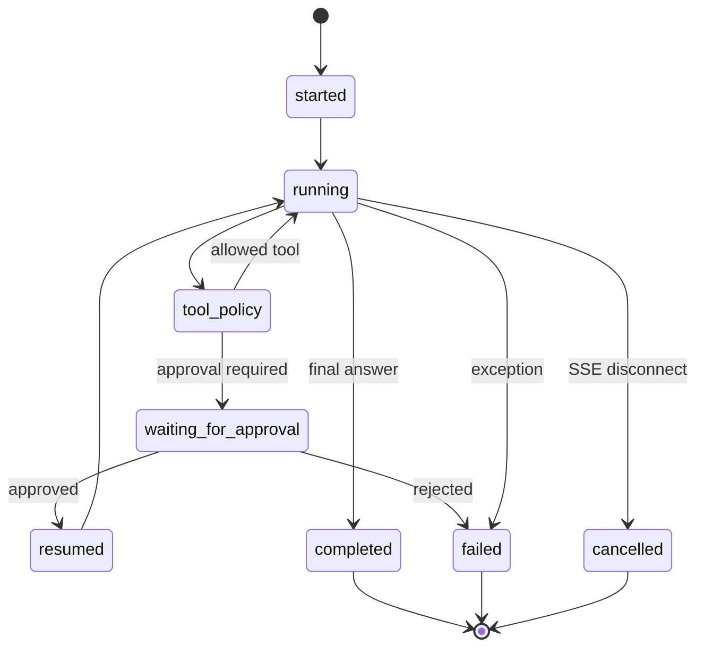
```mermaid
stateDiagram-v2
  [*] --> started
  started --> running
  running --> tool_policy
  tool_policy --> running: allowed tool
  tool_policy --> waiting_for_approval: approval required
  waiting_for_approval --> resumed: approved
  waiting_for_approval --> failed: rejected
  resumed --> running
  running --> completed: final answer
  running --> failed: exception
  running --> cancelled: SSE disconnect
  completed --> [*]
  failed --> [*]
  cancelled --> [*]
```

### 4.9.8 错误处理与边界情况

`run_iter` 捕获 `GeneratorExit`，尝试取消活跃 SQL 并标记 run cancelled；普通异常记录 logger exception，将 state 标记 failed；LangGraph interrupt 后保存 approval checkpoint 并返回 waiting events；resume 时若 approval 不存在或 run mismatch，抛 `DBFoxError`。失败后通过 SSE event 而不只是 HTTP error 通知前端。

### 4.9.9 安全与权限

Agent 工具调用经过 `PolicyGate`，未知工具、副作用工具、非法执行模式、未验证 SQL 被阻断。高风险读取可触发 human-in-loop approval。`sql.execute_readonly` 依赖先前 `sql.validate` 产物，不允许模型直接传 raw SQL 执行。

### 4.9.10 性能与扩展性

性能风险来自 LLM 延迟、多轮工具循环、大 schema context、大结果观察、checkpoint/event 写入。SSE 支持流式反馈和取消。横向扩展不明显：本地单用户、SQLite checkpoint、metadata DB 均绑定本机。

### 4.9.11 测试覆盖情况

| 测试文件 | 覆盖内容 | 测试类型 | 缺口 |
| ---- | ---- | ---- | -- |
| `engine/agent/tests/test_react_graph.py` | LangGraph 图行为。 | 单元/集成 | 真实 LLM 路径可选。 |
| `engine/agent/tests/test_policy_node.py`、`test_policy_gate.py` | 工具策略。 | 单元 | 复杂工具组合需扩展。 |
| `engine/agent/tests/test_approval_node.py` | 审批节点。 | 单元 | 前后端审批端到端需加强。 |
| `engine/agent/tests/test_service_trace_events.py` | service trace events。 | 单元 | 长时间运行/断连场景需补充。 |
| `engine/tests/test_agent_api.py`、`test_conversation_runtime_contract.py` | API/runtime contract。 | API/contract | 真 SSE 浏览器端联动未知。 |
| `engine/agent/tests/test_e2e_qwen.py` | 真实模型 E2E。 | 可选 E2E | 依赖外部 LLM 环境。 |

### 4.9.12 模块风险与改进建议

| 风险 / 问题 | 影响 | 建议 | 优先级 |
| ------- | -- | -- | --- |
| Agent 状态字段多、节点多 | 修改容易破坏状态契约 | 为 `DBFoxAgentState` 建立状态字段 ownership 表和 reducer tests | P1 |
| LLM/tool/policy/checkpoint 组合复杂 | 难以定位失败 | 为每个 run 增加 request/run correlation id 和结构化 trace export | P1 |
| 事件和 checkpoint 保留策略未知 | 本地 DB 膨胀 | 增加 retention policy 和 cleanup API/UI | P2 |

## 4.10 模块名称：`Conversation Workspace`

### 4.10.1 模块定位

该模块是 Agent Runtime 的用户会话外壳。后端 `engine/api/conversations.py` 负责会话 CRUD 和把 message stream 转为 `AgentRunRequest`；前端 conversation repository/store/workspace 负责流式展示消息、run trace、approval、artifact 和数据引用。

### 4.10.2 关键代码文件

| 文件 / 目录 | 作用 | 关键类 / 函数 / 组件 | 备注 |
| ------- | -- | ------------- | -- |
| `engine/api/conversations.py` | 会话 API 和消息 SSE。 | `create_conversation`、`stream_conversation_message` | CodeGraph 显示构建 `AgentRunRequest` 后调用 `DBFoxAgentRuntime(db).run_iter(req)`。 |
| `desktop/src/features/conversation/conversationRepository.ts` | REST/SSE client。 | stream parser | 解析 `data:` chunks。 |
| `desktop/src/stores/conversationStore.ts` | 会话状态。 | `initConversations`、`sendMessage`、approval actions | 归一化 messages/runs/artifacts。 |
| `desktop/src/features/conversation/workspace/*` | 会话 UI。 | `ConversationWorkspace`、`MessageList`、`RunTracePanel`、`ArtifactDock` | 用户交互入口。 |

### 4.10.3 对外接口

| 接口名称 | 类型 | 输入 | 输出 | 调用方 | 副作用 |
| ---- | -- | -- | -- | --- | --- |
| `GET /conversations` | API | 无 | summary list | 前端 store | 读 DB |
| `POST /conversations` | API | datasource id、title、context tables | conversation detail | Smart query/UI | 写 `AgentSession` |
| `PATCH /conversations/{id}` | API | title/context/archived | detail | 前端 | 更新 session |
| `DELETE /conversations/{id}` | API | id | ok | 前端 | 删除 session |
| `POST /conversations/{id}/messages/stream` | SSE | content、LLM config、execute | Agent events | 前端 | 创建 run/messages/events |
| `conversationStore.sendMessage` | store action | content/config | state updates | Conversation UI | SSE、abort、approval |

### 4.10.4 内部结构

| 子组件 | 职责 | 输入 | 输出 | 依赖 |
| --- | -- | -- | -- | -- |
| backend session API | 创建/更新/删除会话。 | request body | detail/summary | `AgentSession` |
| message stream adapter | 将会话消息转换为 Agent request。 | content/session | `AgentRunRequest` | Agent runtime |
| frontend repository | 网络和 SSE parser。 | payload | stream events | API client/fetch |
| conversation store | 合并事件到 normalized state。 | events | messages/runs/artifacts | Zustand |
| workspace UI | 展示聊天、trace、artifact、approval。 | store state | React view | feature components |

### 4.10.5 核心执行流程

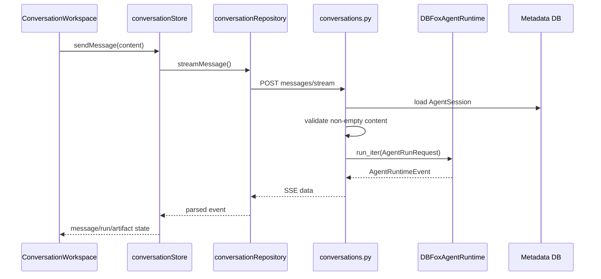
```mermaid
sequenceDiagram
  participant UI as ConversationWorkspace
  participant Store as conversationStore
  participant Repo as conversationRepository
  participant API as conversations.py
  participant Agent as DBFoxAgentRuntime
  participant Meta as Metadata DB

  UI->>Store: sendMessage(content)
  Store->>Repo: streamMessage()
  Repo->>API: POST messages/stream
  API->>Meta: load AgentSession
  API->>API: validate non-empty content
  API->>Agent: run_iter(AgentRunRequest)
  Agent-->>API: AgentRuntimeEvent
  API-->>Repo: SSE data
  Repo-->>Store: parsed event
  Store-->>UI: message/run/artifact state
```

### 4.10.6 数据流分析

- 输入数据：conversation id、message content、context table names、LLM config。
- 中间状态：generated user/assistant message ids、run id、stream event batches、approval status。
- 输出数据：message list、run trace、artifacts、final answer。
- 持久化数据：`AgentSession`、`AgentMessage`、`AgentRun` 等 Agent tables。
- 敏感数据：用户问题、SQL、结果摘要、LLM API key。

### 4.10.7 状态变化分析

```mermaid
stateDiagram-v2
  [*] --> Empty
  Empty --> Active: create conversation
  Active --> Streaming: send message
  Streaming --> WaitingApproval: approval.required
  WaitingApproval --> Streaming: approved + resume
  WaitingApproval --> Failed: rejected
  Streaming --> Completed: final event
  Streaming --> Failed: failed event
  Streaming --> Cancelled: abort/disconnect
  Active --> Archived: patch archived
  Active --> Deleted: delete
```

### 4.10.8 错误处理与边界情况

后端对不存在 conversation 返回 404，对空消息返回 400；stream 内异常会 rollback 并发送 `conversation_stream_error` 的 SSE failed event。前端需处理 SSE 断流、重复事件、approval 已被其他路径 resolved 等竞态。

### 4.10.9 安全与权限

依赖本地 token。会话属于本地 metadata，没有多用户隔离。context table names 来自 session JSON，后端 `_context_table_names_from_session` 会过滤非字符串、空字符串和重复项。

### 4.10.10 性能与扩展性

会话历史、runtime events、trace 和 artifacts 可能增长较快。前端通过批量处理 stream events 降低渲染频率。建议引入分页加载历史 events 和 artifact lazy loading。

### 4.10.11 测试覆盖情况

| 测试文件 | 覆盖内容 | 测试类型 | 缺口 |
| ---- | ---- | ---- | -- |
| `engine/tests/test_conversations.py` | conversation API。 | 后端 API | 长 SSE 断连端到端有限。 |
| `engine/tests/test_conversation_runtime_contract.py` | runtime contract。 | contract | 多 approval 分支需补充。 |
| `engine/tests/test_conversation_rehydration.py` | 会话恢复。 | 后端单元 | 大历史性能未知。 |
| `desktop/src/features/conversation/__tests__/conversationRepository.test.ts` | 前端 repository。 | 单元 | 真实网络 chunk 边界需加强。 |
| `desktop/src/stores/__tests__/conversationStore.test.ts` | store 状态。 | 单元 | 乱序/重复事件测试可增强。 |
| `desktop/src/features/conversation/workspace/__tests__/*` | 会话 UI。 | UI 单元 | 端到端 Agent run 未覆盖。 |

### 4.10.12 模块风险与改进建议

| 风险 / 问题 | 影响 | 建议 | 优先级 |
| ------- | -- | -- | --- |
| SSE 事件状态合并复杂 | UI 可能显示错乱 | 把 event reducer 纯函数化，补乱序/重复/断连测试 | P1 |
| 会话和 Agent persistence 强耦合 | 修改 Agent event schema 影响 UI | 定义稳定的 stream event contract 和版本字段 | P1 |
| 历史数据增长 | 本地 DB/UI 性能下降 | 分页、归档、retention cleanup | P2 |

## 4.11 模块名称：`Backup/Test Data/Table Design/Semantic/Eval`

### 4.11.1 模块定位

这是若干围绕数据操作和治理的功能模块集合：备份恢复、测试数据生成、表设计、workspace table scope、Agent eval。它们不是主查询路径，但会修改目标数据库或本地 metadata，因此风险较高。

### 4.11.2 关键代码文件

| 文件 / 目录 | 作用 | 关键类 / 函数 / 组件 | 备注 |
| ------- | -- | ------------- | -- |
| `engine/api/backup.py`、`engine/backup.py` | 备份/恢复 API 和服务。 | backup list/create/restore/precheck | restore 后调用 `ensure_catalog`。 |
| `engine/api/table_design.py` | 表设计和测试数据入口。 | route handlers | 依赖策略和测试数据模块。 |
| `engine/test_data/*` | 测试数据生成。 | generator、policy、fk_resolver、sqlite_insert_service | 需要 read-only/prod 策略。 |
| `engine/api/semantic.py` | workspace table scope。 | `api_get_table_scope`、`api_update_table_scope` | SemanticAlias CRUD 已被注释说明移除，表仍保留内部用途。 |
| `engine/api/agent_eval.py` | Agent eval API。 | eval task/run/case APIs | 与 `engine/evaluation/*` 协作。 |
| `engine/environment/database_map.py` | Agent 使用的 database intelligence map。 | `DatabaseMapBuilder` | 从 catalog 构建语义/关系/风险视图。 |

### 4.11.3 对外接口

| 接口名称 | 类型 | 输入 | 输出 | 调用方 | 副作用 |
| ---- | -- | -- | -- | --- | --- |
| `/backups/*` | API endpoints | datasource/project/backup id | backup/restore result | 前端 | 写备份记录、目标 DB 恢复 |
| table design APIs | API endpoints | 表设计/测试数据请求 | result | 前端 | 可能修改目标 DB |
| `/semantic/table-scope` | API endpoints | project id、datasource id、table ids | scopes/success | 前端/Agent context | 写 `WorkspaceTableScope` |
| `/agent-eval/*` | API endpoints | golden tasks/eval run | eval results | Eval UI/CLI | 写 eval tables，运行 Agent |
| `DatabaseMapBuilder.build` | function | catalog snapshot | `DatabaseMap` | Agent context | 无写入 |

### 4.11.4 内部结构

| 子组件 | 职责 | 输入 | 输出 | 依赖 |
| --- | -- | -- | -- | -- |
| backup API | 备份/恢复前检查/恢复。 | backup request | backup result | PolicyEngine、target DB |
| test data generator | 生成插入数据。 | schema/table design | inserted rows/result | target DB |
| semantic table scope | 限定 workspace/Agent 可见表。 | table ids | scope rows | metadata DB |
| eval runner | 运行 golden tasks。 | eval config | case results | Agent runtime |
| database map builder | 构建关系、语义、风险视图。 | catalog snapshot | `DatabaseMap` | schema catalog |

### 4.11.5 核心执行流程

```mermaid
sequenceDiagram
  participant UI as UI/Eval CLI
  participant API as backup/table_design/semantic/eval API
  participant Policy as PolicyEngine
  participant Target as Target DB
  participant Schema as Schema Sync
  participant Meta as Metadata DB

  UI->>API: operation request
  API->>Meta: load datasource/project/schema
  API->>Policy: enforce restore/test-data policy
  alt blocked or missing confirmation
    API-->>UI: policy error / confirmation required
  else allowed
    API->>Target: backup/restore/insert/eval query
    API->>Meta: write records/results/scope
    API->>Schema: ensure_catalog() when schema changed
    API-->>UI: result
  end
```

### 4.11.6 数据流分析

- 输入数据：backup ids、table ids、test data definitions、eval tasks。
- 中间状态：policy decision、precheck result、generated rows、eval runtime events。
- 输出数据：backup record、restore result、scope rows、eval case results。
- 持久化数据：`BackupRecord`、`WorkspaceTableScope`、`AgentGoldenTask`、`AgentEvalRun`、`AgentEvalCaseResult`。
- 敏感数据：目标 DB 数据、schema、Agent eval SQL。

### 4.11.7 状态变化分析

```mermaid
stateDiagram-v2
  [*] --> Requested
  Requested --> CheckingPolicy
  CheckingPolicy --> ConfirmationRequired
  ConfirmationRequired --> Running: confirmed
  CheckingPolicy --> Running: allowed
  CheckingPolicy --> Blocked
  Running --> Succeeded
  Running --> Failed
  Succeeded --> Synced: schema changed
  Blocked --> [*]
  Failed --> [*]
  Synced --> [*]
```

### 4.11.8 错误处理与边界情况

restore/test-data 在 production/read-only 环境下会被策略阻断或要求确认。semantic table scope 会检查 project、datasource 和 table 属于关系；否则返回 404/400。eval 依赖 Agent Runtime，外部 LLM 或 DB 失败会影响 case result。

### 4.11.9 安全与权限

这些模块可能修改目标 DB 或改变 Agent 可见范围，必须依赖 token、PolicyEngine 和 confirmation。测试数据/restore 是高风险操作，不应绕过策略。

### 4.11.10 性能与扩展性

backup/restore 和 test data 生成对目标 DB IO 压力较大；eval 可能批量运行 Agent，成本受 LLM/API 限制。建议为长耗时操作引入后台任务化和进度事件。

### 4.11.11 测试覆盖情况

| 测试文件 | 覆盖内容 | 测试类型 | 缺口 |
| ---- | ---- | ---- | -- |
| `engine/tests/test_backup_api.py` | backup API。 | API 单元 | 大库 restore/失败恢复端到端未知。 |
| `engine/tests/test_test_data.py`、`test_test_data_contract.py`、`test_test_data_structure.py` | 测试数据模块。 | 单元/contract | 真实目标 DB 插入覆盖有限。 |
| `engine/tests/test_semantic_layer.py`、`test_semantic_contract.py` | semantic/table scope。 | 单元/contract | UI 联动需持续验证。 |
| `engine/tests/test_agent_eval_api.py`、`test_agent_eval_runner.py`、`engine/evaluation/tests/test_local_runner.py` | eval API/runner。 | API/单元 | 真实 LLM 大批量评测成本和稳定性未知。 |

### 4.11.12 模块风险与改进建议

| 风险 / 问题 | 影响 | 建议 | 优先级 |
| ------- | -- | -- | --- |
| restore/test data 会修改目标 DB | 数据风险 | 保持双确认、dry-run/precheck、环境标签清晰 | P1 |
| 长耗时操作同步 API 化 | UI 超时或用户误判 | 后台 job + progress SSE | P2 |
| eval 依赖真实 Agent/LLM | 结果不稳定、成本高 | 区分 mock eval、local eval、real LLM eval | P2 |

## 4.12 模块名称：`Diagnostics/Observability`

### 4.12.1 模块定位

该模块负责本地诊断，不是生产监控系统。后端收集 engine/stdout/stderr/frontend logs 并脱敏；前端保存 client logs 并提供 diagnostics 页面。

### 4.12.2 关键代码文件

| 文件 / 目录 | 作用 | 关键类 / 函数 / 组件 | 备注 |
| ------- | -- | ------------- | -- |
| `engine/api/diagnostics.py` | 诊断 API。 | `get_diagnostic_logs`、`clear_diagnostic_logs` | CodeGraph 显示读取/清空日志源。 |
| `engine/diagnostics/logs.py` | 日志路径、收集、脱敏。 | `collect_diagnostic_logs`、`diagnostic_log_paths` | redaction policy。 |
| `desktop/src/lib/diagnostics/clientLog.ts` | 前端 client log。 | install/log helpers | localStorage。 |
| `desktop/src/lib/api/diagnostics.ts` | 前端诊断 API。 | `fetchDiagnosticLogs` | Diagnostics page 使用。 |
| `desktop/src/pages/DiagnosticsPage.tsx` | 诊断 UI。 | `DiagnosticsPage` | 查看/清理日志。 |

### 4.12.3 对外接口

| 接口名称 | 类型 | 输入 | 输出 | 调用方 | 副作用 |
| ---- | -- | -- | -- | --- | --- |
| `GET /diagnostics/logs` | API endpoint | `max_lines` | grouped logs | Diagnostics UI | 读日志文件 |
| `POST /diagnostics/logs/clear` | API endpoint | 无 | cleared sources | Diagnostics UI | truncate log files |
| client logger | frontend utility | error/event | local log record | App/API client | 写 localStorage |

### 4.12.4 内部结构

| 子组件 | 职责 | 输入 | 输出 | 依赖 |
| --- | -- | -- | -- | -- |
| backend log handler | 写 engine rotating log。 | log records | file | Python logging |
| log collector | tail 多个日志源。 | paths/max lines | grouped response | filesystem |
| redactor | 脱敏敏感字段。 | log text | redacted text | policy redactor |
| frontend client log | 捕获客户端错误。 | error/event | localStorage records | browser storage |
| diagnostics UI | 展示/清理。 | API response | page | React |

### 4.12.5 核心执行流程

```mermaid
sequenceDiagram
  participant UI as Diagnostics Page
  participant API as diagnostics.py
  participant Logs as diagnostics/logs.py
  participant FS as Runtime Log Files
  participant Redactor as Redaction

  UI->>API: GET /diagnostics/logs?max_lines=N
  API->>Logs: collect_diagnostic_logs()
  Logs->>FS: tail sources
  Logs->>Redactor: redact content
  Logs-->>API: grouped logs
  API-->>UI: logs response
```

### 4.12.6 数据流分析

- 输入数据：engine logs、stdout/stderr、frontend local logs。
- 中间状态：log sources、tail lines、redacted content。
- 输出数据：diagnostic log groups。
- 持久化数据：runtime log files、frontend localStorage。
- 敏感数据：错误文本可能包含 SQL、API key、token、PII；必须脱敏。

### 4.12.7 状态变化分析

```mermaid
stateDiagram-v2
  [*] --> Collecting
  Collecting --> Redacting
  Redacting --> Returned
  Returned --> Cleared: clear logs
  Cleared --> [*]
```

### 4.12.8 错误处理与边界情况

`clear_diagnostic_logs` 对 OSError 直接忽略；读取不存在日志源应返回空内容。风险是静默失败让用户误以为日志已清理。`max_lines` 受 FastAPI Query 限制在 1 到 1000。

### 4.12.9 安全与权限

诊断 API 需要本地 token。日志必须脱敏；如果 redaction 缺漏，会集中泄露敏感信息。清理日志修改本地文件，应避免误清用户自定义日志源。

### 4.12.10 性能与扩展性

只 tail 最多 1000 行，适合本地诊断。无集中式 metrics、trace、alerting。Agent trace/events 存在 metadata DB，但非生产观测系统。

### 4.12.11 测试覆盖情况

| 测试文件 | 覆盖内容 | 测试类型 | 缺口 |
| ---- | ---- | ---- | -- |
| `engine/tests/test_diagnostics.py`、`test_diagnostics_logs.py` | 后端诊断 API/logs。 | 单元 | 大日志文件性能未知。 |
| `desktop/src/lib/diagnostics/__tests__/clientLog.test.ts` | 前端 client log。 | 单元 | 脱敏红队样例可扩展。 |
| `desktop/src/pages/__tests__/DiagnosticsPage.test.tsx` | 诊断页面。 | UI 单元 | 真实 engine/frontend log 聚合端到端未知。 |

### 4.12.12 模块风险与改进建议

| 风险 / 问题 | 影响 | 建议 | 优先级 |
| ------- | -- | -- | --- |
| 日志清理 OSError 静默 | 用户误判问题已处理 | 返回 failed sources，UI 展示部分失败 | P3 |
| 无 metrics/alerting | 难以长期诊断性能问题 | 增加可选 local metrics/timing export | P2 |
| 脱敏覆盖不足风险 | 敏感信息泄露 | 加强 redaction 测试样例集 | P1 |

## 4.13 模块名称：`Build/CI/Test Infrastructure`

### 4.13.1 模块定位

该模块支撑开发、构建、打包和质量门禁。它不是运行时业务模块，但决定 sidecar、frontend、Tauri 包能否稳定交付。

### 4.13.2 关键代码文件

| 文件 / 目录 | 作用 | 关键类 / 函数 / 组件 | 备注 |
| ------- | -- | ------------- | -- |
| `build_sidecar.py` | PyInstaller sidecar 构建。 | target triplet、hidden imports、runtime file staging | Tauri build 前执行。 |
| `desktop/scripts/build.mjs` | Vite build 修正。 | builder、strip crossorigin | 兼容 Tauri custom protocol。 |
| `desktop/vite.config.ts` | Vite dev/build 配置。 | dev server 127.0.0.1:5173、relative base | Tauri dev 依赖。 |
| `.github/workflows/ci.yml` | CI。 | backend/frontend jobs | pytest、mypy、Alembic、health、lint、test、build。 |
| `pyproject.toml` | Python tooling。 | pytest markers、mypy config | mypy 非 strict。 |
| `desktop/package.json` | 前端 scripts/deps。 | `npm test`、`npm run build` | React/Vite/Tauri。 |

### 4.13.3 对外接口

| 接口名称 | 类型 | 输入 | 输出 | 调用方 | 副作用 |
| ---- | -- | -- | -- | --- | --- |
| `python build_sidecar.py` | build command | environment/files | sidecar binary | Tauri build/开发者 | 写 `.build_venv`、`desktop/.env.local`、binaries |
| `npm run build` | build command | TS/Vite source | `dist` | CI/Tauri | 写 frontend dist |
| `npm run tauri -- build` | package command | sidecar + frontend | installer/app | developer/release | 打包 |
| GitHub Actions backend | CI job | repo | pass/fail | PR/commit | pytest/mypy/migrate/smoke |
| GitHub Actions frontend | CI job | repo | pass/fail | PR/commit | npm ci/lint/test/build |

### 4.13.4 内部结构

| 子组件 | 职责 | 输入 | 输出 | 依赖 |
| --- | -- | -- | -- | -- |
| sidecar builder | 构建 Python onefile。 | Python source/requirements | `dbfox-engine-*` | PyInstaller |
| frontend builder | 编译 TS/Vite。 | React source | dist | TypeScript/Vite |
| Tauri packager | 打包桌面 app。 | dist + externalBin | installer/app | Rust/Tauri |
| CI backend | 运行 Python 检查。 | repo | status | GitHub Actions |
| CI frontend | 运行 Node 检查。 | repo | status | GitHub Actions |

### 4.13.5 核心执行流程

```mermaid
sequenceDiagram
  participant Dev as Developer/CI
  participant Sidecar as build_sidecar.py
  participant Vite as frontend build
  participant Tauri as Tauri Build
  participant CI as GitHub Actions

  Dev->>Sidecar: python build_sidecar.py
  Sidecar-->>Dev: dbfox-engine binary
  Dev->>Vite: npm run build
  Vite-->>Dev: dist
  Dev->>Tauri: tauri build
  Tauri-->>Dev: packaged app
  CI->>CI: pytest + mypy + migration + health
  CI->>CI: npm ci + lint + vitest + build
```

### 4.13.6 数据流分析

- 输入数据：source files、env vars、requirements、package lock。
- 中间状态：`.build_venv`、PyInstaller work files、frontend dist。
- 输出数据：sidecar binary、Tauri app/installer、CI status。
- 持久化数据：build artifacts、`desktop/.env.local` dev token。
- 敏感数据：build script exports LangSmith env to private runtime env when present；需避免泄露 env。

### 4.13.7 状态变化分析

```mermaid
stateDiagram-v2
  [*] --> InstallingDeps
  InstallingDeps --> BuildingSidecar
  BuildingSidecar --> BuildingFrontend
  BuildingFrontend --> PackagingTauri
  PackagingTauri --> Succeeded
  InstallingDeps --> Failed
  BuildingSidecar --> Failed
  BuildingFrontend --> Failed
  PackagingTauri --> Failed
```

### 4.13.8 错误处理与边界情况

CI 失败直接阻断。`build_sidecar.py` 需要维护 hidden imports，动态依赖遗漏会导致打包后运行时失败。Vite build 有 Tauri custom protocol 特殊处理，错误配置可能导致白屏。

### 4.13.9 安全与权限

构建过程可能处理 API keys/LangSmith env，应避免输出到日志。CI 未发现依赖漏洞扫描和签名验证。发布签名/自动更新 `未知`。

### 4.13.10 性能与扩展性

PyInstaller onefile 构建耗时较长；CI 分 backend/frontend job 并行。Node 22/Python 3.12 固定，有利于可重复构建。

### 4.13.11 测试覆盖情况

| 测试文件 | 覆盖内容 | 测试类型 | 缺口 |
| ---- | ---- | ---- | -- |
| `.github/workflows/ci.yml` | 后端/前端质量门禁。 | CI | 未发现 release artifact/signing。 |
| `engine/tests/test_build_sidecar.py` | build sidecar 脚本。 | 单元 | 打包二进制真实运行 smoke 有限。 |
| `engine/tests/test_architecture.py` | 架构约束。 | 架构测试 | 新模块边界需持续维护。 |
| `desktop/src/**/*.test.ts(x)` | 前端单元/UI。 | Vitest | Tauri WebView 端到端未知。 |

### 4.13.12 模块风险与改进建议

| 风险 / 问题 | 影响 | 建议 | 优先级 |
| ------- | -- | -- | --- |
| PyInstaller hidden imports 手动维护 | 打包后运行时缺模块 | 增加 packaged sidecar smoke test | P1 |
| release 流水线未知 | 交付质量不可追踪 | 增加 release job/checklist、artifact upload、签名说明 | P2 |
| CI 无依赖漏洞扫描 | 供应链风险 | 增加 pip/npm audit 或 Dependabot 策略 | P2 |

## 5. 核心执行管线拆解

| 管线名称 | 入口 | 终点 | 触发方式 | 关键模块 | 是否异步 | 是否持久化 | 风险等级 |
| ---- | -- | -- | ---- | ---- | ---- | ----- | ---- |
| 应用启动管线 | `desktop/src-tauri/src/lib.rs::run`、`desktop/src/main.tsx` | React app ready | 系统启动 | Tauri Runtime、FastAPI lifespan、API client | 部分异步 | 写 env、DB migration | 高 |
| 本地请求处理管线 | `engine/main.py` middleware | route response | HTTP/SSE 请求 | Middleware、API Router、DB session | 同步/流式 | 取决于路由 | 中 |
| 数据源连接与健康管线 | `/datasources/*` | datasource/health response | 用户操作/API | Datasource、Crypto、Target DB | 同步网络 IO | 写 metadata | 高 |
| Schema 同步管线 | `/datasources/{id}/sync`、`ensure_catalog` | catalog/search docs | 用户操作/内部调用 | Schema Introspector、Catalog Sync | 同步，AI enrich 可外部慢调用 | 写 metadata | 高 |
| SQL 执行管线 | `/query/execute`、Agent tool | rows/history | 用户/Agent | Query API、Policy、Safety、Executor | 同步，可取消 | 写 history | 高 |
| Agent 推理与工具管线 | `/agent/run/stream`、`/conversations/*/messages/stream` | final answer/events | 用户消息/API | Agent Service、LangGraph、PolicyGate、Tools | SSE 异步流 | 写 run/events/artifacts/checkpoints | 高 |
| 审批恢复管线 | `/agent/runs/{run_id}/resume/stream` | resumed final state | 用户审批 | Agent Service、Event Store、LangGraph | SSE 异步流 | 更新 approval/checkpoint/run | 高 |
| 备份恢复/测试数据管线 | `/backups/*`、table design APIs | restore/test result | 用户操作/API | Backup、Policy、Target DB、Schema Sync | 同步 | 写 backup/schema/target DB | 高 |
| 诊断日志管线 | `/diagnostics/logs` | grouped logs | 用户操作/API | Diagnostics、Redactor、FS | 同步 | 读/清文件 | 中 |
| 构建与 CI 管线 | `build_sidecar.py`、CI jobs | binary/dist/status | 构建命令/PR | PyInstaller、Vite、Tauri、pytest/Vitest | CI 异步 | 写 artifacts | 中 |

## 6. 每条管线的详细分析

## 6.1 管线名称：`应用启动管线`

### 6.1.1 管线目标

启动桌面应用、生成本地 token、启动 Python 引擎、完成数据库迁移和健康检查，最后渲染 React 工作台。

### 6.1.2 触发条件

系统启动或 Tauri dev/build 启动。

### 6.1.3 入口代码

- `desktop/src-tauri/src/lib.rs::run`
- `desktop/src-tauri/src/lib.rs::EngineSupervisor::start`
- `engine/main.py::lifespan`
- `desktop/src/main.tsx`
- `desktop/src/lib/api/client.ts::waitEngineHealth`

### 6.1.4 完整调用链

```text
desktop/src-tauri/src/lib.rs::run
  -> EngineSupervisor::start
    -> generate_random_token
    -> spawn_python_engine
      -> python -m engine.main 或 dbfox-engine
        -> engine/main.py::lifespan
          -> _write_frontend_env_file_if_owned
          -> engine/db.py::init_db
            -> MetadataBackupService.backup_sqlite
            -> Alembic command.stamp/upgrade
            -> _ensure_fts5
          -> print DBFOX_ENGINE_READY
    -> wait_for_engine_ready
    -> wait_for_engine_health
desktop/src/main.tsx
  -> initEngineConfig
  -> desktop/src/lib/api/client.ts::waitEngineHealth
  -> render App
    -> desktop/src/App.tsx useEffect
      -> datasourceStore.loadDatasources
      -> conversationStore.initConversations
```

### 6.1.5 输入输出

| 阶段 | 输入 | 输出 | 数据结构 | 备注 |
| -- | -- | -- | ---- | -- |
| Tauri start | app launch | token、child process | `EngineSupervisor` | token 敏感 |
| Engine lifespan | env、DB path | initialized DB | SQLite/Alembic | 可能备份/恢复 |
| Health wait | port | health ok/error | JSON | 公开 health route |
| React bootstrap | port/token | rendered app | React root | 失败抛 `ApiError` |

### 6.1.6 数据流图

```mermaid
flowchart LR
  Launch["App launch"] --> Tauri["Tauri run"]
  Tauri --> Token["Generate token"]
  Tauri --> Sidecar["Spawn Python engine"]
  Sidecar --> InitDB["init_db + migrations"]
  InitDB --> Ready["Ready line + health"]
  Ready --> Config["get_engine_config"]
  Config --> React["React render + stores init"]
```

### 6.1.7 时序图

见 4.1.5 和 4.2.5。

### 6.1.8 状态机

见 4.1.7 和 4.4.7。

### 6.1.9 关键分支

- 成功：spawn -> ready line -> health ok -> UI render。
- 失败：spawn/readiness/health 失败，`get_engine_config` 返回错误。
- DB 迁移失败：`init_db()` 尝试从备份恢复后抛出。
- dev env 写入失败：记录 warning，不阻止启动。

### 6.1.10 持久化与副作用

写 `desktop/.env.local`、metadata SQLite、Alembic version、FTS tables、sidecar temp log；可能创建 DB 备份。

### 6.1.11 异常处理

| 阶段 | 异常类型 | 当前处理方式 | 是否安全 | 改进建议 |
| -- | ---- | ------ | ---- | ---- |
| sidecar spawn | binary/python 不存在 | supervisor error | 是 | UI 显示具体修复建议 |
| DB migration | Alembic/锁/损坏 | 备份恢复后抛出 | 较安全 | 启动 UI 展示迁移失败日志入口 |
| health wait | 超时 | 停止 child | 中 | 配置化超时 |

### 6.1.12 并发、幂等与一致性

启动单实例假设。DB migration 依赖 SQLite 文件锁；Windows 下 `engine.dispose()` 减少锁冲突。重复启动多个实例的行为 `待确认`。

### 6.1.13 可观测性

有 stdout ready、engine logs、sidecar temp log、health check。缺少结构化 startup phase metrics。

### 6.1.14 测试覆盖

`engine/tests/test_db_init.py`、`test_db_init_lifecycle.py`、`test_runtime_credentials.py`、`test_startup.py`、`desktop/src/lib/api/__tests__/client.test.ts`、`desktop/src-tauri/src/lib.rs` Rust tests。

### 6.1.15 管线风险与优化建议

| 风险 | 影响 | 建议 | 优先级 |
| -- | -- | -- | --- |
| 首次迁移超时导致 sidecar 被杀 | 用户无法启动 | 分阶段 readiness：迁移中、ready、failed | P1 |
| 多实例同时迁移未知 | DB 锁/损坏 | 加文件锁或单实例保护 | P2 |

## 6.2 管线名称：`SQL 执行管线`

### 6.2.1 管线目标

安全执行用户或 Agent 提供的只读 SQL，返回结果并记录审计历史。

### 6.2.2 触发条件

SQL console 用户执行、Agent 工具执行、result view 分页/导出。

### 6.2.3 入口代码

- `engine/api/query.py`
- `engine/sql/executor.py::execute_query`
- `engine/tools/dbfox_tools.py::sql.execute_readonly`
- `desktop/src/lib/api/query.ts`

### 6.2.4 完整调用链

```text
desktop SQL UI 或 Agent tool
  -> desktop/src/lib/api/query.ts
    -> engine/api/query.py::execute route
      -> load DataSource from engine/models.py
      -> engine/policy/engine.py::PolicyEngine.enforce_query_policy
      -> engine/sql/safety/service.py::SqlSafetyService
        -> sqlglot parse / TrustGate / schema validation
      -> engine/sql/executor.py::execute_query
        -> engine/sql/dialect/{sqlite,mysql,postgres}.py::_execute_on_*_profiled
          -> Target DB
        -> engine/sql/row_serializer.py::_fetch_and_serialize
        -> write QueryHistory / QueryHistorySearchDoc
      -> response with rows columns timings warnings
```

### 6.2.5 输入输出

| 阶段 | 输入 | 输出 | 数据结构 | 备注 |
| -- | -- | -- | ---- | -- |
| API | SQL、datasource id | request model | Pydantic | raw SQL 敏感 |
| Policy | datasource/op | allow/block | decision | read-only/prod |
| Safety | raw SQL/schema | safe SQL | safety decision | single SELECT |
| Execution | safe SQL | rows/timings | execution result | 支持 cancel/timeout |
| Audit | result metadata | history row | QueryHistory | 可禁用 |

### 6.2.6 数据流图

```mermaid
flowchart LR
  RawSQL["Raw SQL"] --> Policy["PolicyEngine"]
  Policy --> Safety["SqlSafetyService"]
  Safety --> SafeSQL["Safe SQL"]
  SafeSQL --> Executor["execute_query"]
  Executor --> Target[("Target DB")]
  Executor --> Serializer["row_serializer"]
  Serializer --> Response["Rows + columns + warnings"]
  Executor --> History[("QueryHistory")]
```

### 6.2.7 时序图

见 4.7.5。

### 6.2.8 状态机

见 4.7.7。

### 6.2.9 关键分支

- 权限不足：PolicyEngine 阻断。
- SQL 不安全：SqlSafetyService 阻断。
- timeout/cancel：dialect executor 抛 timeout/cancel error。
- history disabled：`DBFOX_DISABLE_QUERY_HISTORY` 跳过写历史。
- fallback：history search 可从 FTS fallback 到 LIKE；执行本身无 fallback。

### 6.2.10 持久化与副作用

目标 DB 只读查询；写 metadata query history/search docs；注册/注销 QueryRegistry；写日志。

### 6.2.11 异常处理

| 阶段 | 异常类型 | 当前处理方式 | 是否安全 | 改进建议 |
| -- | ---- | ------ | ---- | ---- |
| parse | 非法 SQL | safety error | 是 | 返回更清晰修复建议 |
| policy | DDL/DML/prod | block | 是 | 保持矩阵测试 |
| execution | DB driver error | sanitized error | 较安全 | 方言错误标准化 |
| serialization | 大结果/类型异常 | truncate/redact | 中 | 增加二进制/JSON 边界测试 |

### 6.2.12 并发、幂等与一致性

SELECT 查询通常幂等，但目标 DB 数据变化会影响结果。QueryRegistry 支持取消；history 写入是副作用，不影响目标数据。连接池可能存在资源竞争。

### 6.2.13 可观测性

QueryHistory 保存多段 timing；日志记录 executor 警告；无 metrics exporter。

### 6.2.14 测试覆盖

`engine/tests/test_executor.py`、`test_sql_safety_service.py`、`test_policy_engine.py`、`test_query_registry.py`、`test_result_view_service.py`、`engine/tests/whitebox/test_row_serializer_whitebox.py`、`desktop/src/features/workspace/__tests__/SqlConsoleWorkspace.test.tsx`。

### 6.2.15 管线风险与优化建议

| 风险 | 影响 | 建议 | 优先级 |
| -- | -- | -- | --- |
| 安全链路绕过 | 数据泄露/误写 | 禁止任何 API 直接调用 dialect executor，增加架构测试 | P0 |
| 大查询资源占用 | 本地/目标 DB 压力 | 强化默认 limit、流式导出、query cost warning | P1 |

## 6.3 管线名称：`Agent 推理与工具管线`

### 6.3.1 管线目标

将用户自然语言问题转化为可审计、可审批、可恢复的数据库分析过程，并输出答案和制品。

### 6.3.2 触发条件

用户在 smart query/conversation 中发送消息，或 API/eval 调用 Agent run。

### 6.3.3 入口代码

- `engine/api/agent.py`
- `engine/api/conversations.py::stream_conversation_message`
- `engine/agent/runtime.py`
- `engine/agent/app/service.py::run_iter`

### 6.3.4 完整调用链

```text
desktop conversation UI
  -> conversationStore.sendMessage
    -> conversationRepository.streamMessage
      -> engine/api/conversations.py::stream_conversation_message
        -> AgentRunRequest
        -> engine/agent/runtime.py::DBFoxAgentRuntime.run_iter
          -> engine/agent/app/service.py::DBFoxAgentService.run_iter
            -> _initial_state
              -> context bundle / schema context / database map / session memory
            -> engine/agent/graph/react_graph.py::build_dbfox_react_graph
              -> model node
              -> policy node
              -> tool node
              -> observe/progress/repair/finalize nodes
            -> event_store persistence
            -> SSE AgentRuntimeEvent
```

### 6.3.5 输入输出

| 阶段 | 输入 | 输出 | 数据结构 | 备注 |
| -- | -- | -- | ---- | -- |
| Conversation | message、LLM config | `AgentRunRequest` | Pydantic/model | content 非空校验 |
| Initial state | request、catalog、memory | `DBFoxAgentState` | graph state | 字段多 |
| Model | context/messages | tool calls/answer | LangChain message | 外部 LLM |
| Policy/tool | tool calls | observations/artifacts | state updates | 可审批 |
| Finalize | final state | response | `AgentRunResponse` | 写 persistence |

### 6.3.6 数据流图

```mermaid
flowchart LR
  Question["Question"] --> Context["Context Bundle + DatabaseMap"]
  Context --> State["DBFoxAgentState"]
  State --> LLM["LLM"]
  LLM --> Calls["Tool Calls"]
  Calls --> Gate["PolicyGate"]
  Gate -->|allow| Tools["DBFox Tools"]
  Gate -->|approval| Approval[("AgentApproval + Checkpoint")]
  Tools --> Obs["Observations"]
  Obs --> State
  State --> Final["Final Answer + Artifacts"]
  Final --> Events[("Runtime Events / Metadata DB")]
```

### 6.3.7 时序图

见 4.9.5。

### 6.3.8 状态机

见 4.9.7。

### 6.3.9 关键分支

- suggest-only：`execute=false` 时 execution mode 倾向建议。
- tool blocked：PolicyGate 阻断并记录。
- approval required：保存 checkpoint 并等待用户。
- repair：SQL/进度不足触发 repair node。
- cancel：SSE disconnect 触发 run cancelled 和 SQL cancel。
- LLM failure：state failed，SSE failed/final response error。

### 6.3.10 持久化与副作用

写 Agent run/message/event/artifact/approval/checkpoint/memory；调用 LLM 外部 API；可能通过 SQL 工具读取目标 DB；发送 SSE events。

### 6.3.11 异常处理

| 阶段 | 异常类型 | 当前处理方式 | 是否安全 | 改进建议 |
| -- | ---- | ------ | ---- | ---- |
| LLM | API key/model/network | failed state/event | 中 | provider-specific error mapping |
| tool | policy/DB/query error | observation/error event | 较安全 | 工具错误统一 schema |
| approval | missing/mismatch | `DBFoxError` | 是 | 前端提示可恢复动作 |
| disconnect | client abort | cancel run/query | 是 | 增加取消确认和审计 |

### 6.3.12 并发、幂等与一致性

同一 conversation 可能并发触发多 run；是否严格串行 `待确认`。checkpoint 按 session/thread id 存储，重复 resume 通过 approval status 判断。工具执行读取目标 DB，结果非幂等依赖目标数据变化。

### 6.3.13 可观测性

有 runtime events、trace events、artifacts、query history、LLM log metadata。缺少全链路 correlation id 可视化和 metrics。

### 6.3.14 测试覆盖

`engine/agent/tests/*`、`engine/tests/test_agent_api.py`、`test_agent_trace.py`、`test_conversation_runtime_contract.py`、`desktop/src/features/conversation/workspace/__tests__/*`。

### 6.3.15 管线风险与优化建议

| 风险 | 影响 | 建议 | 优先级 |
| -- | -- | -- | --- |
| 状态机复杂且跨多模块 | 回归难定位 | 图节点 contract tests + trace replay | P1 |
| 外部 LLM 不稳定 | 用户体验波动 | provider retry/backoff、错误分类、mock fallback | P2 |
| run/event/checkpoint 保留未知 | DB 膨胀 | retention/cleanup | P2 |

## 6.4 管线名称：`审批恢复管线`

### 6.4.1 管线目标

在 Agent 遇到需要人工确认的工具调用或风险操作时中断图执行，保存 checkpoint，等待用户批准或拒绝，然后恢复或终止。

### 6.4.2 触发条件

Agent policy node 判定 approval required；用户在 UI 点击批准/拒绝。

### 6.4.3 入口代码

- `engine/agent/app/service.py::run_iter`
- `engine/agent/app/service.py::resume_approval_iter`
- `engine/api/agent.py` resume endpoints
- `desktop/src/stores/conversationStore.ts` approval actions

### 6.4.4 完整调用链

```text
Agent graph policy node
  -> LangGraph interrupt
    -> DBFoxAgentService.run_iter snapshot.interrupts
      -> build_approval_checkpoint_draft
      -> event_store.save_checkpoint
      -> emit agent.approval.required / agent.run.waiting_approval
frontend approval UI
  -> resolve approval API
    -> DBFoxAgentService.resume_approval_iter
      -> agent_persistence.get_approval
      -> event_store.resolve_approval
      -> build_dbfox_react_graph
      -> app.stream(Command(resume={decision,note}))
      -> final_events / _finalize_persistence
```

### 6.4.5 输入输出

| 阶段 | 输入 | 输出 | 数据结构 | 备注 |
| -- | -- | -- | ---- | -- |
| interrupt | pending tool/risk | approval draft | `AgentApproval` | pending |
| checkpoint | graph state | checkpoint row | `AgentCheckpoint` | resumable |
| user decision | approved/rejected/note | resolved approval | approval status | idempotency partially by status |
| resume | `Command(resume)` | final events | LangGraph updates | rejected -> failed |

### 6.4.6 数据流图

```mermaid
flowchart LR
  Risk["Risky tool call"] --> Interrupt["LangGraph interrupt"]
  Interrupt --> Approval[("AgentApproval")]
  Interrupt --> Checkpoint[("AgentCheckpoint")]
  Approval --> UI["Approval UI"]
  UI --> Decision["approved/rejected"]
  Decision --> Resume["Command(resume)"]
  Resume --> Graph["Continue graph"]
  Graph --> Final["Final/Failed response"]
```

### 6.4.7 时序图

见 4.9.5 和 4.9.7。

### 6.4.8 状态机

```mermaid
stateDiagram-v2
  [*] --> Pending
  Pending --> Approved: user approves
  Pending --> Rejected: user rejects
  Approved --> Resumed
  Resumed --> Completed
  Resumed --> Failed
  Rejected --> Failed
```

### 6.4.9 关键分支

- approval 不存在：`APPROVAL_NOT_FOUND`。
- approval 与 run 不匹配：`APPROVAL_RUN_MISMATCH`。
- 已 resolved：不会重复 resolve，但仍可根据状态继续处理。
- rejected：final state 标记 failed，error 为 user rejected。

### 6.4.10 持久化与副作用

写 `AgentApproval`、`AgentCheckpoint`、runtime events；批准后可能继续执行工具/SQL；拒绝后更新 run/message 失败状态。

### 6.4.11 异常处理

| 阶段 | 异常类型 | 当前处理方式 | 是否安全 | 改进建议 |
| -- | ---- | ------ | ---- | ---- |
| save checkpoint | DB error | warning + rollback quietly | 中 | 若 checkpoint 保存失败应明确失败而非继续等待 |
| resolve approval | not found/mismatch | `DBFoxError` | 是 | 前端展示可恢复说明 |
| resume stream | exception | failed state/event | 中 | 增加 resume trace |

### 6.4.12 并发、幂等与一致性

并发点击 approve/reject 时依赖 approval status。建议数据库层增加状态条件更新或乐观锁，避免最后写 wins。

### 6.4.13 可观测性

有 approval resolved、run resumed、checkpoint saved events。建议增加审批人/决策时间/原始风险摘要审计字段。

### 6.4.14 测试覆盖

`engine/agent/tests/test_approval_node.py`、`engine/agent/tests/test_policy_gate.py`、`engine/tests/test_agent_api.py`、`desktop/src/stores/__tests__/conversationStore.test.ts`。

### 6.4.15 管线风险与优化建议

| 风险 | 影响 | 建议 | 优先级 |
| -- | -- | -- | --- |
| checkpoint 保存失败后等待状态不可靠 | 用户无法恢复 | checkpoint save 失败应转 failed event | P1 |
| 并发审批竞态 | 审批状态不一致 | 条件更新 `status=pending`，返回冲突 | P2 |

## 6.5 管线名称：`Schema 同步管线`

详见模块 4.6。该管线入口为 `POST /datasources/{id}/sync` 或内部 `ensure_catalog()`；终点是 `SchemaTable`、`SchemaColumn`、`SchemaSearchDoc` 和可选 AI metadata。

### 6.5.1 管线目标

保证本地 catalog 与目标数据库结构尽量一致，为 UI、SQL 安全和 Agent context 提供结构基础。

### 6.5.2 触发条件

用户点击刷新 schema、前端加载 tables 时 catalog 为空、restore/table design 后刷新、eval 或 Agent context 需要 catalog。

### 6.5.3 入口代码

- `engine/api/datasources/schema.py`
- `engine/environment/schema_catalog_sync.py::ensure_catalog`
- `engine/environment/schema_introspector.py::introspect_datasource`

### 6.5.4 完整调用链

```text
engine/api/datasources/schema.py::api_sync_schema
  -> engine/environment/schema_catalog_sync.py::ensure_catalog
    -> SchemaCatalogSync.sync
      -> engine/environment/schema_introspector.py::introspect_datasource
        -> Target DB schema queries
      -> SchemaCatalogSync.sync_inventory
        -> upsert SchemaTable
        -> _sync_columns
        -> resolve foreign keys
        -> rebuild_search_docs
        -> db.commit
        -> optional ai_enrich_catalog
```

### 6.5.5 输入输出

| 阶段 | 输入 | 输出 | 数据结构 | 备注 |
| -- | -- | -- | ---- | -- |
| API | datasource id | sync request | Pydantic | AI 参数可选 |
| Introspection | datasource params | schema inventory | `SchemaInventory` | 目标 DB IO |
| Sync | inventory | rows + counts | `SyncResult` | commit |
| Search | catalog | FTS docs | `SchemaSearchDoc` | 全量 rebuild |

### 6.5.6 数据流图

见 4.6.5。

### 6.5.7 时序图

见 4.6.5。

### 6.5.8 状态机

见 4.6.7。

### 6.5.9 关键分支

AI enrich 开启/关闭；catalog 空时自动 sync；目标 DB 不可达失败；删除过期表/列；FK 解析不到目标时跳过。

### 6.5.10 持久化与副作用

写 schema catalog、search docs、AI metadata；可能调用外部 LLM。

### 6.5.11 异常处理

| 阶段 | 异常类型 | 当前处理方式 | 是否安全 | 改进建议 |
| -- | ---- | ------ | ---- | ---- |
| introspection | DB 权限/网络失败 | 抛错 | 是 | 返回部分诊断建议 |
| DB sync | commit 失败 | 上层 rollback | 中 | 明确事务边界 |
| AI enrich | LLM 失败 | 根据代码推断不应影响基础 catalog | 中 | 文档化 enrich failure contract |

### 6.5.12 并发、幂等与一致性

重复 sync 是 upsert + 删除 stale，接近幂等；并发 sync 同一 datasource 可能出现写冲突或重复 rebuild，缺少显式锁证据。

### 6.5.13 可观测性

logger 记录 sync counts；无进度事件。大 schema 同步建议增加 progress events。

### 6.5.14 测试覆盖

`engine/tests/test_schema_sync.py`、`test_schema_introspector.py`、`test_datasource_sync_ai_enrich.py`。

### 6.5.15 管线风险与优化建议

| 风险 | 影响 | 建议 | 优先级 |
| -- | -- | -- | --- |
| 并发 sync 无显式锁 | catalog 不一致或性能浪费 | datasource 粒度 sync lock | P2 |
| 大 catalog 全量 rebuild | 慢/卡 UI | 后台任务化、增量 search docs | P2 |

## 6.6 管线名称：`备份恢复与测试数据管线`

### 6.6.1 管线目标

为目标数据库提供备份/恢复和测试数据能力，同时通过策略和确认降低误操作风险。

### 6.6.2 触发条件

用户调用 backup/restore/table design/test data API。

### 6.6.3 入口代码

- `engine/api/backup.py`
- `engine/api/table_design.py`
- `engine/test_data/*`

### 6.6.4 完整调用链

```text
frontend backup/table design UI
  -> engine/api/backup.py 或 engine/api/table_design.py
    -> load DataSource / Project / Schema
    -> engine/policy/engine.py::PolicyEngine
    -> confirmation validation
    -> backup/restore/test_data service
      -> Target DB
    -> write BackupRecord / result metadata
    -> engine/environment/schema_catalog_sync.py::ensure_catalog when schema changed
```

### 6.6.5 输入输出

| 阶段 | 输入 | 输出 | 数据结构 | 备注 |
| -- | -- | -- | ---- | -- |
| precheck | datasource/backup id | checks | policy/precheck result | restore 前 |
| policy | operation/env | allow/confirm/block | decision | 高风险 |
| execute | target DB params | backup/restore/result | service result | 修改 DB 可能 |
| sync | datasource id | catalog refreshed | `SyncResult` | restore 后 |

### 6.6.6 数据流图

```mermaid
flowchart LR
  Request["Backup/Restore/Test data request"] --> Policy["PolicyEngine + Confirmation"]
  Policy -->|blocked| Error["Policy error"]
  Policy -->|allowed| Target[("Target DB")]
  Target --> Meta[("BackupRecord / Metadata")]
  Target --> Schema["ensure_catalog after schema change"]
```

### 6.6.7 时序图

见 4.11.5。

### 6.6.8 状态机

见 4.11.7。

### 6.6.9 关键分支

生产/只读环境阻断；缺确认返回 confirmation required；执行失败应保留失败记录；restore 成功后刷新 schema。

### 6.6.10 持久化与副作用

写 backup records、目标 DB 数据、schema catalog、日志。

### 6.6.11 异常处理

| 阶段 | 异常类型 | 当前处理方式 | 是否安全 | 改进建议 |
| -- | ---- | ------ | ---- | ---- |
| policy | prod/read-only | block/confirm | 是 | UI 强提示风险 |
| restore | target DB error | error response | 中 | 补偿/回滚能力待确认 |
| post sync | schema sync error | restore 已完成但 catalog 可能旧 | 中 | 标记 catalog stale |

### 6.6.12 并发、幂等与一致性

restore/test data 非幂等且可能部分成功；是否有完整事务取决于目标 DB 和具体实现，本文标记 `待确认`。建议对高风险操作增加 operation id 和状态表。

### 6.6.13 可观测性

有 BackupRecord 和日志；缺少长任务 progress/metrics。

### 6.6.14 测试覆盖

`engine/tests/test_backup_api.py`、`test_test_data.py`、`test_test_data_contract.py`、`test_test_data_structure.py`。

### 6.6.15 管线风险与优化建议

| 风险 | 影响 | 建议 | 优先级 |
| -- | -- | -- | --- |
| 非幂等且可能部分成功 | 数据风险 | operation journal + precheck + dry-run | P1 |
| 同步 API 执行长操作 | UI 超时 | 后台 job + SSE progress | P2 |

## 6.7 管线名称：`诊断日志管线`

### 6.7.1 管线目标

收集本地后端和前端诊断日志，脱敏后提供给用户排查。

### 6.7.2 触发条件

用户打开 Diagnostics 页面或点击清理日志。

### 6.7.3 入口代码

- `engine/api/diagnostics.py`
- `engine/diagnostics/logs.py`
- `desktop/src/pages/DiagnosticsPage.tsx`

### 6.7.4 完整调用链

```text
desktop/src/pages/DiagnosticsPage.tsx
  -> desktop/src/lib/api/diagnostics.ts
    -> engine/api/diagnostics.py::get_diagnostic_logs
      -> engine/diagnostics/logs.py::diagnostic_log_paths
      -> engine/diagnostics/logs.py::collect_diagnostic_logs
        -> read runtime log files
        -> redaction
      -> response
```

### 6.7.5 输入输出

| 阶段 | 输入 | 输出 | 数据结构 | 备注 |
| -- | -- | -- | ---- | -- |
| UI | max lines | API request | query param | 1-1000 |
| collector | log paths | source contents | log groups | missing file ok |
| redaction | raw text | redacted text | string | 敏感 |

### 6.7.6 数据流图

见 4.12.5。

### 6.7.7 时序图

见 4.12.5。

### 6.7.8 状态机

见 4.12.7。

### 6.7.9 关键分支

日志不存在、读取失败、清理失败、脱敏命中/未命中。

### 6.7.10 持久化与副作用

GET 读文件；POST clear truncate 文件；前端 client log 写 localStorage。

### 6.7.11 异常处理

| 阶段 | 异常类型 | 当前处理方式 | 是否安全 | 改进建议 |
| -- | ---- | ------ | ---- | ---- |
| clear | OSError | 忽略 | 中 | 返回 failed sources |
| read | missing file | 空/跳过 | 是 | 保持 |
| redaction | 漏脱敏 | 无法自动发现 | 否 | 红队测试 |

### 6.7.12 并发、幂等与一致性

重复 GET 幂等；重复 clear 幂等。读取和清理同时发生可能返回部分内容，影响低。

### 6.7.13 可观测性

该管线本身是可观测性入口；缺 metrics。

### 6.7.14 测试覆盖

`engine/tests/test_diagnostics.py`、`engine/tests/test_diagnostics_logs.py`、`desktop/src/pages/__tests__/DiagnosticsPage.test.tsx`、`desktop/src/lib/diagnostics/__tests__/clientLog.test.ts`。

### 6.7.15 管线风险与优化建议

| 风险 | 影响 | 建议 | 优先级 |
| -- | -- | -- | --- |
| 脱敏漏项 | 敏感泄露 | 增加敏感样例测试和手动导出确认 | P1 |

## 6.8 管线名称：`构建与 CI 管线`

### 6.8.1 管线目标

验证后端/前端质量，并生成 Tauri 可打包的 frontend dist 和 Python sidecar binary。

### 6.8.2 触发条件

开发者运行 build 命令；GitHub Actions 在 PR/commit 触发。

### 6.8.3 入口代码

- `.github/workflows/ci.yml`
- `build_sidecar.py`
- `desktop/package.json`
- `desktop/scripts/build.mjs`
- `desktop/src-tauri/tauri.conf.json`

### 6.8.4 完整调用链

```text
GitHub Actions backend job
  -> install requirements-dev.txt
  -> python -m pytest engine/tests -q --tb=short
  -> python -m mypy engine
  -> Alembic empty DB upgrade
  -> FastAPI health smoke
GitHub Actions frontend job
  -> npm ci
  -> npm run lint
  -> npm test
  -> npm run build
Tauri build
  -> desktop/src-tauri/tauri.conf.json beforeBuildCommand
    -> python ../build_sidecar.py
    -> npm run build
```

### 6.8.5 输入输出

| 阶段 | 输入 | 输出 | 数据结构 | 备注 |
| -- | -- | -- | ---- | -- |
| backend CI | Python source | pass/fail | pytest/mypy output | engine/tests only |
| frontend CI | TS source | pass/fail/dist | Vitest/Vite | Node 22 |
| sidecar build | Python source | binary | PyInstaller artifact | hidden imports |
| Tauri package | dist + binary | app/installer | platform artifact | release unknown |

### 6.8.6 数据流图

```mermaid
flowchart LR
  Source["Repo source"] --> BackendCI["pytest + mypy + migration + health"]
  Source --> FrontendCI["lint + vitest + build"]
  Source --> Sidecar["build_sidecar.py"]
  Sidecar --> Binary["dbfox-engine binary"]
  FrontendCI --> Dist["desktop/dist"]
  Binary --> Tauri["Tauri package"]
  Dist --> Tauri
```

### 6.8.7 时序图

见 4.13.5。

### 6.8.8 状态机

见 4.13.7。

### 6.8.9 关键分支

backend/frontend CI 独立；Tauri build 前必须 sidecar build 和 frontend build 成功；release/signing/artifact upload 未发现。

### 6.8.10 持久化与副作用

写 build artifacts、dist、sidecar binary、`.build_venv`、`desktop/.env.local`。

### 6.8.11 异常处理

| 阶段 | 异常类型 | 当前处理方式 | 是否安全 | 改进建议 |
| -- | ---- | ------ | ---- | ---- |
| pytest/mypy/lint/build | check failure | CI fail | 是 | 保持 |
| PyInstaller missing import | packaged runtime fail | build 可能成功但运行失败 | 中 | packaged smoke |
| release | signing/upload missing | 未知 | 中 | release workflow |

### 6.8.12 并发、幂等与一致性

CI job 幂等；本地 build 可能受 `.build_venv`、env、node_modules 影响。建议 clean build smoke。

### 6.8.13 可观测性

CI logs；无 release provenance 证据。

### 6.8.14 测试覆盖

CI 覆盖 backend tests、mypy、migration、health、frontend lint/test/build。测试文件观察到：后端约 100 个 `test_*.py`，Agent/evaluation 另有测试目录；前端 108 个 `*.test.ts(x)`；迁移 13 个版本。

### 6.8.15 管线风险与优化建议

| 风险 | 影响 | 建议 | 优先级 |
| -- | -- | -- | --- |
| CI 不打包 Tauri installer | 打包回归无法提前发现 | 增加 nightly/package smoke | P2 |
| 无依赖漏洞扫描 | 供应链风险 | 增加 audit/Dependabot | P2 |

## 7. 横切关注点分析

### 7.1 认证与鉴权

所有非公开 API 依赖 `engine/main.py` 的 `X-Local-Token` 校验；frozen 模式还依赖 Origin/Referer gate。高风险业务授权不是 RBAC，而是由 `PolicyEngine`、`PolicyGate`、confirmation 和 approval 实施。需要确认的操作包括 datasource delete、restore、test data、Agent 风险读取等。多用户鉴权模型 `未知`，根据代码推断项目当前定位为本地单用户桌面应用。

### 7.2 输入校验

| 层 | 校验形式 | 证据 |
| --- | --- | --- |
| 前端 | 表单、store/action 参数、UI 约束。 | `desktop/src/features/*`、`desktop/src/stores/*` |
| API schema | Pydantic `BaseModel`、FastAPI Query/path validation。 | `engine/api/*.py` |
| Service/domain | 连接测试、policy、confirmation、scope belongs checks。 | `engine/datasource.py`、`engine/policy/*`、`engine/api/semantic.py` |
| SQL parser | sqlglot、single SELECT、安全决策。 | `engine/sql/safety/service.py` |
| Agent tools | tool input/output schema、PolicyGate。 | `engine/tools/sandbox/base.py`、`engine/policy/gate.py` |

### 7.3 错误处理

后端有 `DBFoxError` 和全局 exception handler，但各 route 中仍有 `HTTPException`、rollback/re-raise、SSE failed event 等多种风格。SSE 开始后必须通过事件传错。建议统一错误 code/detail schema，并覆盖 REST 与 SSE。

### 7.4 日志与诊断

日志来源包括 engine rotating log、sidecar temp log、stdout/stderr、frontend localStorage client log、Agent runtime/trace events、QueryHistory timings。脱敏在 `engine/policy/redactor.py` 和 diagnostics collector 中体现。缺口是 metrics、alerting、全链路 correlation id。

### 7.5 数据持久化

| 持久化目标 | 写入模块 |
| --- | --- |
| Metadata SQLite | projects、datasources、schema catalog、query history、Agent sessions/runs/events/artifacts/approvals/checkpoints、backup/eval/semantic。 |
| Checkpoint SQLite | LangGraph checkpoint。 |
| Runtime files | token、secret key、logs、LangSmith env、frontend `.env.local`。 |
| Target DB | SQL 只读查询不写；backup restore/test data/table design 可能写。 |
| Frontend localStorage | client diagnostics 和可能的 UI config。 |

### 7.6 外部依赖

目标 DB、OpenAI-compatible LLM API、OS keyring、SSH bastion、LangSmith、npm/pip package registries。目标 DB 失败影响 datasource/schema/SQL/Agent；LLM 失败影响 Agent、AI enrich、LLM test；keyring 失败应不影响 key file 权威存储；SSH 失败影响 tunnel datasource。

### 7.7 配置与环境变量

关键配置包括 `DBFOX_ENGINE_PORT`、`DBFOX_ENGINE_TOKEN`、`DBFOX_RUNTIME_DIR`、`DBFOX_DATABASE_URL`、`DBFOX_DEV_CORS_ORIGINS`、DB pool/timeout、`OPENAI_API_KEY`、`QWEN_API_KEY`、`DBFOX_LLM_API_KEY`、`OPENAI_API_BASE`、`OPENAI_BASE_URL`、`OPENAI_MODEL_NAME`、`LANGCHAIN_*`、`LANGSMITH_*`、`DBFOX_AGENT_CORE_CHECKPOINTER`、`DBFOX_TESTING`、`AGENT_PERSISTENCE_MODE`、`AGENT_PERSIST_RUNTIME_EVENTS`、`AGENT_DB_WRITE_TRACE`、`DBFOX_DISABLE_QUERY_HISTORY`、`DBFOX_ALLOW_LLM_PLAINTEXT_LOGS`。其中 `OPENAI_BASE_URL` 与 `OPENAI_API_BASE` 命名不一致是 P1 风险。

### 7.8 测试策略

测试组织方式混合：后端按 API/service/domain/policy/whitebox；Agent 单独有 graph/node/service tests；前端按 component/store/API contract；CI 按 backend/frontend job。缺口是 packaged Tauri E2E、真实外部 DB、真实 LLM 稳定性和 release artifact smoke。

## 8. 模块边界与耦合度分析

| 模块 | 当前边界评价 | 耦合对象 | 问题 | 建议 |
| -- | ------ | ---- | -- | -- |
| Tauri Sidecar Runtime | 边界清晰 | engine readiness、frontend config | 超时和错误展示可改进 | 保持小模块，增加 smoke |
| Frontend App Shell | 边界中等 | stores、workspace pages | `WorkspaceRouter` 分支增长 | 显式 tab registry |
| Frontend Stores | 耦合偏高 | API client、repositories、UI events | 状态和副作用混合 | reducer/service 分离 |
| Engine API Router | 边界清晰 | 所有业务 routers | route 错误风格不一 | 统一 API error contract |
| Datasource Management | 边界中等 | crypto、SSH、DB drivers、pool | provider 抽象不足 | 定义 DB provider interface |
| Schema Catalog Sync | 边界较清晰但副作用重 | datasource、target DB、metadata、AI enrich | `ensure_catalog` 名称轻但行为重 | 拆分 ensure/refresh/enrich 语义 |
| SQL Execution | 边界清晰但链路复杂 | policy、safety、executor、history | 绕过风险高 | 架构测试禁止绕过 |
| Policy/Security | 横切耦合高 | API、SQL、Agent、logs | 策略分散 | 建决策矩阵和测试矩阵 |
| Agent Runtime | 高复杂高耦合 | LLM、tools、policy、SQL、schema、metadata | 状态字段和节点多 | 状态 ownership + trace replay |
| Conversation Workspace | 前后端耦合高 | Agent event schema、store、UI | SSE schema 改动影响大 | stream contract 版本化 |
| Backup/Test Data | 风险边界高 | target DB、policy、schema sync | 非幂等/部分成功 | job 化和 operation journal |
| Diagnostics | 边界清晰 | redactor、runtime files、frontend logs | 静默清理失败 | 返回 failed sources |
| Build/CI | 边界清晰 | PyInstaller、Vite、Tauri | release 未闭环 | packaged smoke/release workflow |

## 9. 可维护性分析

- 新增普通 API endpoint：需要修改 `engine/api/<domain>.py` 或新增 router、`engine/api/__init__.py` include、schema/model/service、前端 `desktop/src/lib/api/*.ts`、相关 store/UI、后端和前端 tests。
- 新增数据库类型：需要修改 `engine/datasource.py`、`engine/environment/schema_introspector.py`、`engine/sql/dialect/*`、`engine/sql/pool_manager.py`、permission probes、schema sync tests、SQL safety 方言、前端 datasource payload/form。当前没有统一 provider 抽象，改动面大。
- 新增 Agent 工具：需要修改 `engine/tools/dbfox_tools.py` 或 tools registry、tool schema、`PolicyGate` 工具组/风险配置、Agent state 如需保存新字段、observe/finalize artifact 处理、Agent tests、前端 artifact renderer 如果有新制品类型。
- 修改 API schema：会影响 `desktop/src/lib/api/types.ts`、API wrapper、stores 和 UI。建议生成 OpenAPI/TS 类型或使用 contract tests。
- 修改数据模型：有 Alembic 迁移支持；需更新 `engine/models.py`、migration、schema/API serialization、tests。`engine/db.py::init_db` 有 legacy revision 推断，变更需谨慎。
- 修改管线逻辑：SQL 和 Agent 管线已有较多单元测试，但跨模块端到端仍需补。建议对 SQL safety、Agent approval、schema sync 加 golden flow tests。
- 重复代码/隐式约定：SSE event names、tab type strings、tool names、env var names、artifact types 都是隐式约定；建议集中常量和 contract。
- 魔法字符串：`agent.run.started`、`agent.approval.required`、tab type、tool names、env var names、migration revision inference 中均存在。需要类型化和文档化。
- 隐藏副作用：`ensure_catalog()` 会刷新并 commit catalog；`list tables` 可能自动 sync；`build_sidecar.py` 会写 `.env.local`；Agent run 会写大量 persistence；conversation stream 异常会 rollback。

## 10. 功能扩展示例

| 扩展目标 | 需要修改的模块 | 关键文件 | 风险点 | 推荐实现路径 |
| ---- | ------- | ---- | --- | ------ |
| 新增一种数据库类型 | Datasource、Schema Introspector、SQL Dialect、Permission Probe、Frontend Form、Tests | `engine/datasource.py`、`engine/environment/schema_introspector.py`、`engine/sql/dialect/*`、`desktop/src/lib/datasourcePayload.ts`、`desktop/src/features/datasource-management/*` | 改动面大，SQL safety/permission/cancel 容易漏 | 先抽 provider contract，新增 dialect adapter，写 datasource/schema/query 三类 tests，再接 UI |
| 新增一个 Agent 工具 | Agent tools、PolicyGate、Agent state、Artifacts/UI、Tests | `engine/tools/dbfox_tools.py`、`engine/policy/gate.py`、`engine/agent/graph/state.py`、`engine/agent/nodes/tool_node.py`、`desktop/src/features/workspace/artifacts/*` | 工具越权、未审批、事件/制品 schema 漂移 | 定义 input/output Pydantic schema，默认 safe/suggest-only，补 PolicyGate tests 和 Agent graph tests |
| 新增一个前端工作台页面 | WorkspaceStore、WorkspaceRouter、API wrapper、Page Component、Tests | `desktop/src/stores/workspaceStore.ts`、`desktop/src/features/appShell/WorkspaceRouter.tsx`、`desktop/src/lib/api/*.ts`、`desktop/src/features/<feature>/*` | tab type 漏接、状态泄露、API contract 漂移 | 先新增 tab type 和 store action，再加 router 分支和页面，最后补 `WorkspaceRouter.test.tsx` 与 store tests |

## 11. 重点问题清单

| 优先级 | 问题 | 所属模块 / 管线 | 影响 | 证据文件 | 建议 |
| --- | -- | --------- | -- | ---- | -- |
| P0 | SQL 执行链路一旦被绕过会直接影响数据安全 | SQL Execution / Policy | 可能执行未验证 SQL 或越权操作 | `engine/api/query.py`、`engine/sql/executor.py`、`engine/sql/safety/service.py`、`engine/policy/engine.py` | 增加架构测试，禁止 route/tool 直接调用 dialect executor；保持 validate -> safety -> execute contract |
| P1 | LLM base URL 环境变量命名不一致 | LLM/Config | 用户配置 `.env.example` 中变量但代码不读取 | `.env.example`、`engine/llm/factory.py` | 同时支持 `OPENAI_BASE_URL` 与 `OPENAI_API_BASE` 或统一命名 |
| P1 | DuckDB 代码存在但依赖未声明 | Schema Introspector | 运行到 DuckDB path 会失败 | `engine/environment/schema_introspector.py`、`requirements.txt` | 添加 `duckdb` 依赖或 feature-flag/移除 |
| P1 | Agent 状态机复杂且状态字段多 | Agent Runtime | 回归难定位，审批/恢复/工具路径易破 | `engine/agent/app/service.py`、`engine/agent/graph/state.py`、`engine/agent/graph/react_graph.py` | 状态 ownership 表、trace replay、关键路径 contract tests |
| P1 | SSE event schema 是前后端隐式契约 | Conversation/Agent | 事件改动易导致 UI 状态错乱 | `engine/api/agent.py`、`engine/api/conversations.py`、`desktop/src/stores/conversationStore.ts` | 事件 schema 版本化，集中 TS/Python contract |
| P1 | Restore/test data 非幂等且可能修改目标 DB | Backup/Test Data | 数据破坏风险 | `engine/api/backup.py`、`engine/api/table_design.py`、`engine/test_data/*` | operation journal、dry-run、强确认、恢复后 stale 标记 |
| P1 | 脱敏覆盖不足会集中泄露敏感信息 | Diagnostics/Redaction | token/API key/PII/SQL 泄露 | `engine/policy/redactor.py`、`engine/diagnostics/logs.py`、`desktop/src/lib/diagnostics/clientLog.ts` | 增加红队样例和导出前确认 |
| P2 | `ensure_catalog` 名称轻但副作用重 | Schema Sync | 内部调用可能触发长耗时 refresh/commit/AI enrich | `engine/environment/schema_catalog_sync.py` | 拆分 `refresh_catalog`、`ensure_catalog_exists`、`enrich_catalog` |
| P2 | Packaged Tauri E2E/installer smoke 未发现 | Build/Runtime | 打包后 sidecar 或 WebView 行为可能回归 | `.github/workflows/ci.yml`、`build_sidecar.py`、`desktop/src-tauri/tauri.conf.json` | 增加 packaged smoke 或 nightly build validation |
| P2 | Metrics/alerting 缺失 | Observability | 性能和长流程问题难量化 | `engine/diagnostics/logs.py`、`engine/api/diagnostics.py` | 增加 local metrics/timing export 和 run correlation id |
| P2 | Frontend stores 状态和副作用混合 | Frontend State | 复杂流程竞态、测试成本高 | `desktop/src/stores/conversationStore.ts`、`datasourceStore.ts` | 抽纯 reducer 和 repository/service 分层 |
| P3 | Diagnostics clear 忽略 OSError | Diagnostics | 用户误以为清理成功 | `engine/api/diagnostics.py` | 返回 failed sources |

## 12. 最终总结

项目最核心的模块是 SQL Execution、Datasource Management、Schema Catalog Sync 和 Agent Runtime。SQL Execution 决定数据读取安全；Datasource 和 Schema Catalog 决定目标数据库能否被可靠理解；Agent Runtime 是 AI 能力和复杂工作流的承载层。

最复杂的管线是 Agent 推理与工具管线。它跨越 LLM、LangGraph、PolicyGate、DBFox tools、SQL execution、schema context、metadata persistence、SSE、approval/checkpoint，并且有取消、失败、恢复等分支。

最值得优先测试的路径：

- SQL validate -> safety -> execute -> history -> cancel。
- Agent run -> tool call -> approval required -> resume -> final answer。
- Datasource create/test -> schema sync -> table list。
- Packaged Tauri launch -> sidecar health -> UI API call。

最值得优先重构的模块是 Agent state/event contract 和 datasource provider 抽象。前者降低复杂管线维护成本；后者降低新增数据库类型的改动面。

最容易扩展的模块是前端 workspace 页面和 diagnostics UI，因为已有 feature folder、WorkspaceRouter 和 API wrapper 模式。但新增 tab type 仍需同步 store/router/tests。

最大的架构风险是“本地单体中多个高风险管线共享同一 metadata model 和隐式契约”：SQL 安全、Agent 工具、SSE events、schema catalog、query history、approval checkpoint 一旦契约漂移，问题会跨前端、后端和目标数据库同时出现。

接手项目建议优先阅读：

1. `engine/main.py`、`engine/api/__init__.py`：理解本地 API 入口和安全边界。
2. `desktop/src-tauri/src/lib.rs`、`desktop/src/lib/api/client.ts`：理解 sidecar 和前端如何连接引擎。
3. `engine/models.py`、`engine/db.py`、`engine/migrations/versions/`：理解 metadata schema 和迁移。
4. `engine/api/datasources/*`、`engine/datasource.py`、`engine/environment/schema_catalog_sync.py`：理解数据源与 schema。
5. `engine/api/query.py`、`engine/sql/executor.py`、`engine/sql/safety/service.py`、`engine/policy/engine.py`：理解 SQL 安全执行。
6. `engine/agent/app/service.py`、`engine/agent/graph/react_graph.py`、`engine/agent/graph/state.py`、`engine/tools/dbfox_tools.py`、`engine/policy/gate.py`：理解 Agent 主流程。
7. `desktop/src/App.tsx`、`desktop/src/features/appShell/WorkspaceRouter.tsx`、`desktop/src/stores/*`、`desktop/src/features/conversation/*`：理解前端工作台和会话流。
8. `.github/workflows/ci.yml`、`build_sidecar.py`、`desktop/scripts/build.mjs`：理解质量门禁与打包链路。
