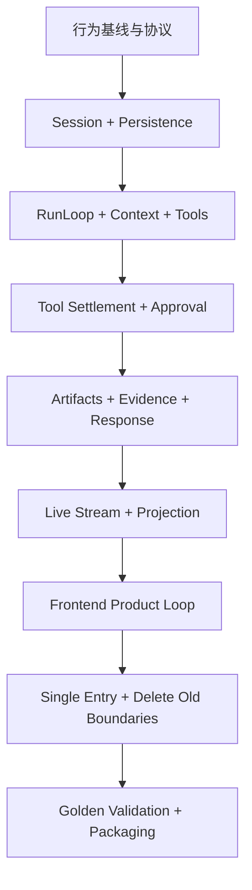

# DBFox Agent 实施任务

状态：实现完成，验收通过
依据：[产品与运行规范](../specs/agent.md) · [技术与交互设计](../designs/agent.md)

实现结果（2026-07-19）：

- 唯一运行链路已收敛到 `engine/agent/` 的 Session、RunLoop、Coordinator、Repository、ModelAdapter 与 Tool Runtime；
- LangGraph、LangChain Agent、旧 `agent_core`、旧 `agent_runtime`、Graph/node/checkpointer 生产边界已删除；
- Session 输入、事件日志、Turn、ToolInvocation、Approval、Question、Observation、Artifact、Evidence、Memory 和 terminal response 已形成同一持久化闭环；
- SSE 使用 replay + commit notification，热增量由 LiveStreamHub 按 turn/channel/offset 推送；
- 前端使用唯一 conversation snapshot/event reducer，并提供 Activity、批准、业务提问、Evidence 和右侧 Artifact Dock；
- 工件公共负载已固定为唯一 camelCase 契约，Artifact 关系和 Evidence 使用真实持久 ID，不保留字段别名或前端选择启发式；
- 验收结果：后端 877 项通过、3 项条件跳过；前端 393 项通过；ESLint、TypeScript、Vite 生产构建和 bundle budget 全部通过。

## 1. 执行规则

- 不从零重写：每个任务先标记继承来源，再抽取、验证或删除。
- 只建立一条生产路径；不增加 Runtime 选择开关、双写、转发层或兼容接口。
- 生产模块只使用稳定领域命名。
- 每个阶段必须交付可运行的纵向切片，不只完成孤立的底层类。
- 删除必须发生在新链路通过 Golden Scenario 之后，但在生产合入之前完成。
- 所有代码任务需在本设计评审通过后开始。

## 2. 阶段零：建立可验证基线

### T0.1 固化行为资产清单

来源：1.0.1、当前工作树、OpenCode。

- 逐项记录 1.0.1 的 Policy、Observe、Progress、Repair、Answer、Finalize、memory、Artifact 行为及当前对应实现；
- 逐项记录当前工作树的 CAS、Supervisor、Approval、generation fence、query cancellation、redaction；
- 标注“直接继承 / 抽取重组 / 淘汰”，并为每项指定最终模块和测试；
- 输出到 `docs/reviews/agent-capability-inventory.md`。

验收：没有能力只写“参考旧版”而缺少代码来源、目标位置和验证方式。

### T0.2 建立 Golden Scenario

修改：`engine/evaluation/agent_eval.py` 及其 schema/cases；新增 `engine/agent/tests/golden/`。

- 深入分析而非一次 SQL 后结束；
- Schema 探索 → SQL → Safety → ResultView → Evidence → Answer；
- SQL 失败 → 读取 Observation → 修复 → 再执行；
- 多轮引用上一轮和选中 Artifact；
- Approval 暂停、拒绝、批准和重启恢复；
- 流式断线、刷新恢复、取消替换；
- 同 Session 排序和不同 Session 并行。

验收：旧行为被描述为产品结果，不依赖 LangGraph 节点名。

### T0.3 固化公共协议

新增：`engine/agent/events.py`、`engine/agent/artifact.py`、`engine/agent/evidence.py` 的协议定义；前端对应 `desktop/src/lib/api/types/agent.ts`。

- 定义版本化 RuntimeEvent、Activity、Artifact、Evidence、Approval、QuestionRequest 和 terminal response schema；
- 实现 `RuntimeEventProjector`，抽取 `engine/agent_runtime/event_mapper.py` 的有效映射并做穷尽测试；
- 建立 Python/TypeScript fixture 契约测试；
- 明确 sequence、offset、ID、大小限制和未知字段策略。

验收：后端 fixture 可以由前端 reducer 消费；不再存在两套 Agent event 类型。

## 3. 阶段一：Session 与持久化核心

### T1.1 建立领域实体和仓储

新增：

```text
engine/agent/session.py
engine/agent/run.py
engine/agent/turn.py
engine/agent/repositories/
```

继承：`engine/agent_runtime/models.py`、`repository.py`、`repository_records.py`、`state_machine.py` 的可靠状态语义。

- 建立 SessionInput、Session sequence、Run、Turn 和 ToolInvocation；
- 迁入 Run version、取消、终态栅栏；
- 定义短事务仓储方法，不让 ORM Session 跨 provider/tool 调用；
- 添加状态转换、并发竞争和事务回滚测试。

验收：同一 Run 不可能出现两个终态；迟到 worker 不能覆盖取消。

### T1.2 输入原子接纳

修改：`engine/api/conversations.py`；收敛 `engine/api/agent.py` 与 `engine/api/agent_runtime.py` 的重复入口。

- 原子写入 SessionInput、用户消息、Session sequence、Run 和 `session.input.admitted`；
- 支持 idempotency key 与 queue/steer/cancel_and_replace；
- commit 后唤醒，不在请求事务中执行 Agent；
- 桌面/Web 使用同一 API 语义。

验收：重复请求不创建重复消息；调度进程退出不丢已接纳输入。

### T1.3 Session Coordinator

新增：`engine/agent/session.py` 中的单 Session 协调职责；抽取 `engine/agent_runtime/supervisor.py` 中的隔离执行和恢复扫描。

- 同 Session 单写、不同 Session 并行；
- 使用数据库 lease owner、单调 lease token 和 expiration，不以进程内 map 作为真相；
- 所有 Session/Run 写入校验 lease token，过期 owner 的迟到提交被 fencing；
- 合并重复 wake；
- 扫描未消费输入和非终态 Run；
- 每个工作单元使用独立数据库 Session；
- 优雅停机先持久取消/释放所有权，再关闭资源。

验收：并发与重启测试无乱序、重复执行或共享 ORM Session；故障注入证明 lease 过期后的旧 worker 无法提交。

### T1.4 Runtime Event Log

新增：`engine/agent/events.py` 与 repository；抽取 `engine/agent_runtime/outbox.py` 的事务事件能力。

- 使用 Session sequence；
- 事件与业务状态同事务；
- 提供 cursor replay 和 commit notification；
- 所有公开 payload 只通过 `RuntimeEventProjector` 产生；
- 将只承担事件日志职责的 Outbox 命名从领域模型中移除。

验收：任意提交点崩溃后，状态与事件不会一有一无。

## 4. 阶段二：显式 Agent 循环

### T2.1 AgentDefinition 与 PromptBundle

新增：`engine/agent/definition.py`、`prompt.py`。

继承：`engine/agent/model/system_prompt.py`、`engine/agent_core/prompts.py`、skills 配置中的数据分析师行为。

- 固化 AgentDefinition version/hash；
- 分离 system 权限内容与非特权上下文；
- 保留主动探索、验证、修复和证据化回答；
- 建立 prompt snapshot 和 injection 边界测试。

验收：Prompt 变更可追踪；数据库文本不能提升到 system 层。

### T2.2 ContextAssembler 与 ContextEpoch

新增：`engine/agent/context.py`、`memory.py`。

继承：`engine/agent/context_pack.py`、`engine/agent_core/context.py`、`memory.py`、`workspace_context.py`、当前 `context_builder.py`。

- 实现 L0–L4 来源和确定性预算；
- 持久 ContextSnapshot 来源、版本、included/excluded reason 和 hash；
- 实现 Session ContextEpoch 压缩；
- datasource/workspace facts 绑定 generation/catalog version；
- 选中 Artifact 由后端上下文正式引用。

验收：下一轮“按地区拆分刚才结果”不依赖前端隐藏拼接。

### T2.3 ToolRegistry 与 ToolMaterialization

修改/新增：`engine/tools/registry.py`，保留 `engine/tools/runtime/`。

继承：现有 `BaseTool`、五类 Spec、built-in tools；移除 `engine/agent/tools/langchain_tools.py` 与 `registry_bridge.py` 的 LangChain/桥接形态。

- 统一内置、插件、MCP adapter；
- 按 Agent、provider、datasource、permission 和 mode 物化；
- 每 Turn 固化工具 snapshot/hash；
- 未物化工具在 leaf 前再次拒绝。

验收：新增工具不需要修改 RunLoop 或前端硬编码流程。

### T2.4 RunLoop 与 Turn

新增：`engine/agent/run.py`、`turn.py`；抽取 Graph 中正确业务行为。

- 实现 load → context → tools → turn → stream → tool/complete 的唯一循环；
- 建立 ModelAdapter 的规范化 stream item 和 TurnStreamAssembler；
- 可靠组装 text、reasoning summary、tool-call 参数、usage、finish 和 provider error；
- 使用 turn/channel/offset 驱动热 delta，原始 provider chunk 不进入领域协议；
- provider finish reason 只作为信号；
- 支持 token/tool/time/cost/repair/retry 预算；
- 支持重复工具与连续错误检测；
- 每 Turn 重载持久状态并检查取消。

验收：不导入 LangGraph/LangChain message types；Golden Scenario 能通过显式循环执行；碎片化 tool-call 和 provider retry 不会重复调用工具或重复文本。

### T2.5 CompletionPolicy、修复与澄清

新增：`engine/agent/completion.py`。

继承：`engine/agent/progress/`、`repair/sql_repair.py`、Graph route 中的成熟判定语义。

- 判断目标覆盖、Evidence、空结果、可修复错误、必要澄清和预算；
- 防止一次 SQL 默认结束；
- 产生 continue/repair/ask_user/synthesize/partial/fail 的结构化决定；
- 记录简洁产品 Activity，不暴露 chain-of-thought。

验收：无证据的数据结论不能完成；达到预算时产生可解释的部分回答。

## 5. 阶段三：工具结算、权限与恢复

### T3.1 Durable ToolInvocation

新增：`engine/agent/observation.py`、repository；修改 `engine/tools/runtime/`。

- 副作用前持久化 invocation intent；
- 每个工具声明 retry_safe/reconcile/never_retry/provider_owned；
- 使用 invocation idempotency key；
- 结果限长、脱敏后落库；
- 生成 Observation 和 Artifact candidates 并原子结算。

验收：故障注入覆盖执行前、执行中、执行后结算前。

### T3.2 PermissionPolicy

新增：`engine/agent/approval.py` 的策略接口；复用现有 ToolPolicy 与 datasource 安全能力。

- allow/ask/deny，deny 优先；
- 工具物化与 leaf 双检查；
- 数据源环境、只读、generation、用户/组织策略进入判定；
- 凭据和敏感参数只出现脱敏摘要。

验收：未物化、过期 generation、组织 deny 均无法被 Approval 绕过。

### T3.3 Approval 生命周期

新增/收敛：`engine/agent/approval.py`、repository、API resolve endpoint。

继承：当前 Approval 原子消费和 version preconditions。

- 持久 requested action、reason、risk、expiration、versions；
- waiting_approval 可重启恢复；
- approve/reject 只能消费一次；
- 恢复到原 ToolInvocation，而不是重新让模型猜调用。

验收：并发批准只有一个成功；拒绝形成 Observation 并回到 Agent。

### T3.4 ObservationProjector

新增：`engine/agent/observation.py`。

继承：`observe_node.py`、工具输出摘要、错误分类和 Artifact 生成语义。

- 生成有界 model summary、facts、error、retryability 和 refs；
- 成功、失败、空结果都进入下一 Turn；
- 大结果只留 Result service reference；
- 保持 Observation sequence。

验收：测试证明下一 Turn 实际收到前一工具 Observation。

### T3.5 QuestionRequest 生命周期

新增：`engine/agent/question.py`、repository 和 resolve API。

- 持久化业务澄清、选项、自由输入规则、Run/Turn/version、expiration 和恢复引用；
- 将 Run 置为 `waiting_input`，不占用 worker 或进程内 future；
- 回答事务写入正式用户消息、单次消费 request、追加事件并恢复原 Run；
- 明确与 Approval 的边界，QuestionRequest 不能授权工具。

验收：刷新/重启后仍可回答；重复、过期和版本冲突的回答不会重复恢复 Run。

## 6. 阶段四：回答、工件、证据与记忆闭环

### T4.1 ArtifactRepository 与关系

新增/收敛：`engine/agent/artifact.py`、repository。

继承：`engine/agent_core/artifacts.py`、`chart_builder.py`、当前会话投影和 1.0.1 Artifact 链。

- 创建即固定 ID；
- semantic key 只负责版本关联；
- 持久 validated_by/executed_as/visualized_as/derived_from/supports；
- bounded preview 与 payload reference 分离；
- 修复版本不覆盖失败历史。

验收：SQL/Safety/ResultView/Chart 的 ID 和关系在流式、终态、刷新后完全一致。

### T4.2 EvidenceRepository

新增：`engine/agent/evidence.py`。

- claim_id + artifact_id + locator；
- locator 解析与失效状态；
- 禁止语义占位符、前缀匹配和前端猜测；
- 清理策略保护被引用 Artifact。

验收：所有完成回答 Evidence 可点击并精确定位。

### T4.3 FinalSynthesis 与 ResponseComposer

新增：`engine/agent/response.py`。

继承：`answer_node.py`、`finalize_node.py`、`engine/agent_core/answer.py` 中正确的答案结构与 finalization 语义。

- 模型生成结构化 AnswerCandidate；
- Composer 校验 schema、Evidence、敏感信息、message blocks；
- 生成 artifact selection suggestion、memory delta、terminal events；
- 一次事务提交 answer/message/evidence/memory/run/session/events。

验收：不能出现“回答完成但工件/证据缺失”或“运行完成但消息仍 streaming”。

### T4.4 Session Memory 写回

修改：`engine/agent/memory.py`。

- 仅从 terminal transaction 写 Session delta；
- Workspace/User memory 先生成 candidate，再经作用域、provenance、敏感信息和失效策略校验；
- 压缩失败保留旧 ContextEpoch；
- Memory 写回不阻断已验证答案，异步层只处理非终态长期候选。

验收：多轮引用稳定；错误数据库事实不会成为无版本的长期记忆。

## 7. 阶段五：低延迟流式与 API 投影

### T5.1 LiveStreamHub

新增：`engine/agent/events.py` 中的 stream hub 接口与实现。

- 推送 answer/reasoning summary delta、tool progress 和 commit notifications；
- delta 使用 turn/channel/offset；
- 不把每 token 写入 RuntimeEventLog；
- 主链路没有固定 200ms 轮询。

验收：热连接首 delta P95 和 provider 基线相比没有事务重放附加等待。

### T5.2 Replay + notification SSE

修改：会话 stream API 与 `desktop/src/features/conversation/conversationStream.ts`（新增）。

- 先订阅、后补 cursor gap；
- 按 sequence/offset 去重；
- 检测 gap 自动 replay；
- 重连不重复文本、Artifact 或 Approval。

验收：在每种 event/delta 边界断线均可恢复。

### T5.3 Conversation projection

收敛：`engine/api/conversations.py`、现有 conversation projection；前端 `conversationRepository.ts`。

- 一次返回 messages、runs、activities、artifacts、evidence、approvals、selection 和 cursor；
- 快照与增量事件使用同一 schema；
- 不要求前端重放全部历史才能打开会话。

验收：刷新后与断线前视觉和选择状态一致。

## 8. 阶段六：前端产品闭环

### T6.1 唯一 conversation reducer

收敛：`desktop/src/stores/conversationStore.ts`、`conversationStoreReducer.ts`、`features/conversation/conversationRepository.ts`。

- snapshot + ordered events 是唯一输入；
- 合并当前 Agent draft/store 的重复职责；
- Run、Activity、Approval、Artifact、Evidence、selection 全部由后端事实投影；
- reducer 对重复、乱序和未知版本事件有明确行为。

验收：组件不读取 raw trace 推断业务状态。

### T6.2 Activity Feed

用 `ActivityFeed.tsx` 替代固定 `RunPhaseStepper.tsx` 和调试感 `RunTracePanel.tsx` 的产品职责；保留内部诊断面板但不混入正常对话。

- 动态理解/探索/工具/修复/批准/证据 Activity；
- 运行时就地更新，完成后摘要折叠；
- 展开显示安全输入摘要、耗时、Artifact；
- reasoning 仅显示安全 summary。

验收：用户能看懂 Agent 进展，同时看不到隐藏 chain-of-thought 或调试 JSON。

### T6.3 Artifact Dock 与 Evidence

修改：`ArtifactDock.tsx`、`ArtifactEvidencePanel.tsx`、`MessageBubble.tsx`、相关 models/tests。

- 删除 latest/type 选择启发式；
- 使用后端 selection/suggestion；
- 按关系和 Run 展示 SQL/Safety/Result/Chart；
- Evidence chip 打开并精确定位 Artifact；
- 失败与修复版本均可审阅。

验收：执行 SQL 后右侧立即展开对应工件；回答证据不会指错结果。

### T6.4 Approval Card

新增：`ApprovalCard.tsx`；替换 MessageBubble 中的零散 Approval 表达。

- 显示目的、原因、环境、影响、脱敏参数和过期状态；
- 对话内记录 + Composer 上方固定操作；
- allow once/reject/可选会话规则；
- 版本冲突后刷新真实状态。

验收：刷新和重启后仍能正确批准；按钮语义和风险视觉清晰。

### T6.5 Question Card

新增：`QuestionCard.tsx`。

- 显示缺少的业务信息、提问原因、选项和自由输入；
- 与 Approval 使用不同文案和视觉语义；
- 回答后保留决定记录，并显示原 Run 已继续；
- 处理过期和版本冲突后的真实状态刷新。

验收：QuestionRequest 不被渲染成普通 assistant 文本，也不会与新的独立用户任务混淆。

### T6.6 Composer delivery controls

修改：`Composer.tsx`。

- 运行中明确 queue/steer/cancel_and_replace；
- 附带 selected artifact IDs；
- 输入接纳即反馈；
- 根据当前 Run 状态说明发送行为。

验收：快速连续输入不丢失、不静默改变当前任务。

### T6.7 流式、响应式与可访问性

修改：`useSmoothedStreamingText.ts`、`conversationWorkspace.css`、组件测试。

- delta 批量平滑合并；
- Activity/Approval/errors 使用合适 aria-live；
- 键盘可操作与焦点恢复；
- 右侧 Dock 窄屏转换；
- 继续使用品牌紫/数据青，狐狸不使用橙色，状态色只表达状态；
- 字号、点击区、reduced motion 符合设计规范。

验收：桌面与 Web 关键断点视觉回归和键盘路径通过。

## 9. 阶段七：删除旧边界与发布

### T7.1 单入口切换

- 生产路由指向新的 Session API 与 RunLoop；
- evaluation、desktop、Web 和后台恢复使用同一入口；
- 不保留环境变量或 feature flag 选择旧路径。

验收：静态搜索和启动测试只发现一个 Run 执行入口。

### T7.2 删除 LangGraph 与重复包

删除：

```text
engine/agent/graph/
engine/agent/nodes/
engine/agent/tools/langchain_tools.py
engine/agent/tools/registry_bridge.py
engine/agent_core/        # 有效逻辑抽取后
engine/agent_runtime/     # 有效逻辑抽取后
```

- 从 `requirements.txt` 删除 LangGraph、LangGraph checkpoint、LangChain Agent 和 LangSmith 生产依赖；
- 删除 Graph state/checkpointer/node tests；
- 将行为测试迁入稳定领域测试；
- 删除重复 Agent response/event/state 类型；
- 删除前端旧 Agent store 和投影启发式。

验收：全仓生产依赖、import 和 bundle 中不存在 LangGraph；没有空转发模块。

### T7.3 数据结构收敛

- 添加必要 schema revision，将现有数据映射到唯一领域结构；
- revision 完成后代码只读取新结构；
- 不做长期双写或旧表 fallback；
- 测试已有会话的可读范围，并明确无法可靠映射的数据处理规则。

验收：安装、升级和空库初始化都得到同一 schema；领域代码无兼容分支。

### T7.4 全链路验收与打包

- Python unit/integration/fault injection；
- TypeScript reducer/component/accessibility；
- Golden Scenario 和 prompt eval；
- 桌面 sidecar 与 Web engine 启动；
- MySQL/PostgreSQL/SQLite 代表场景；
- 流式、重连、Approval、取消、恢复；
- Windows 安装包升级与进程占用检查。

验收：规范第 22、23 节全部通过后才打包发布。

## 10. 依赖顺序



允许同阶段内部并行，但不得绕过公共协议直接让前端绑定临时后端结构，也不得在终态事务完成前宣称 Artifact/Evidence 闭环完成。

## 11. 纵向开发切片

前述阶段描述依赖关系，不代表按水平层一次性完成全部底层模块。实际开发按以下可运行切片推进：

### Slice A：证据化只读分析闭环

跨越 T0.3、T1、T2、T3.1/T3.4、T4、T5 和 T6 的最小必要部分：

- SessionInput 原子接纳；
- 单 Session 显式 RunLoop；
- Schema、SQL validate、readonly execute；
- Durable ToolInvocation 与 Observation；
- SQL、Safety、ResultView；
- 精确 Evidence、流式 Answer 和 terminal transaction；
- snapshot 刷新恢复；
- 下一轮读取 Session History 和 selected Artifact。

验收：完成一条真实数据库 Golden Scenario，前后端不含 Graph adapter、semantic ID fallback 或前端 response composer。

### Slice B：持久暂停与恢复

- Approval approve/reject；
- QuestionRequest respond；
- 工具各 recovery policy；
- Turn/工具故障注入和进程重启恢复。

### Slice C：并发交付与低延迟

- queue/steer/cancel_and_replace；
- 同 Session 串行、跨 Session 有界并行；
- LiveStreamHub、cursor replay、gap/offset 去重；
- 性能和资源边界。

### Slice D：产品收敛与删除

- Activity Feed、Approval/Question Card、Artifact Dock；
- 桌面/Web 同协议验收；
- 删除 LangGraph、重复类型、旧 Runtime 与前端启发式；
- 全链路打包和升级验证。

## 12. 完成定义

只有同时满足以下条件，实施才算完成：

- 一个用户输入只进入一个持久 Run 链路；
- Agent 会主动探索、验证、修复和继续，直到 CompletionPolicy 判定结束；
- 工具调用有权限、Approval、幂等、Observation 和恢复；
- SQL、Safety、ResultView、Chart、Evidence、Answer 的 ID 与关系稳定；
- 前端实时展示产品化过程，并可刷新恢复；
- 下一轮正式使用 Session History 和 selected Artifacts；
- 流式低延迟不依赖固定轮询，断线可 replay；
- 终态回答、证据、记忆和事件原子一致；
- 生产代码无 LangGraph、双 Runtime、兼容层和阶段性命名；
- 桌面/Web、开发/打包环境通过同一套验收。

## 13. Reference-only Artifact 收敛任务

- [x] Result/Chart Artifact 删除结果行与 series，只保留 descriptor 和关系。
- [x] Result Gateway 改为只接收 Artifact ID 和视图参数，后端解析 SQL 与 datasource。
- [x] Durable Observation、Event、Turn Snapshot 和 Session Context 删除结果行。
- [x] RunLoop 增加一次性 transient tool result，保证分析能力且不落库。
- [x] 前端公共协议和 Conversation Store 删除 `rows`、`previewRows`、`series`。
- [x] Result/Chart 视图按 Artifact ID 加载，页面数据仅保留在组件生命周期。
- [x] `derived_from` 关系成为 Result/Chart 来源权威，descriptor 不一致时拒绝执行。
- [x] 增加 `artifact.inspect`，崩溃恢复后按 Artifact ID 重新读取短暂结果。
- [x] Result Gateway 统一为 `/api/v1/artifacts/{id}/page|export|chart-data`，旧 `/agent/artifacts` 路由删除。
- [x] Evidence 持久化查询指纹和观测时间；Result descriptor 固定为九个公开字段。
- [x] 增加敏感值不落库、刷新重载、generation 失效和协议边界测试。
- [x] 后端、前端、Lint、生产构建和 bundle budget 全量通过。
