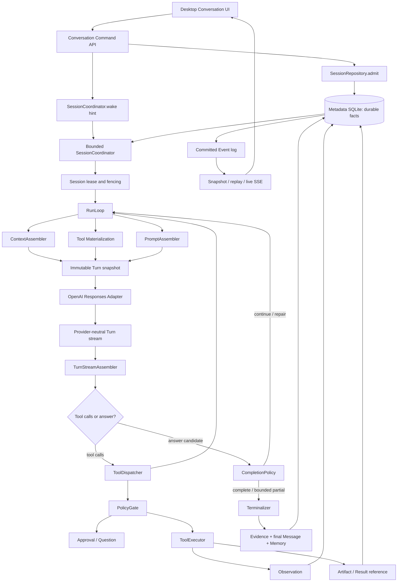
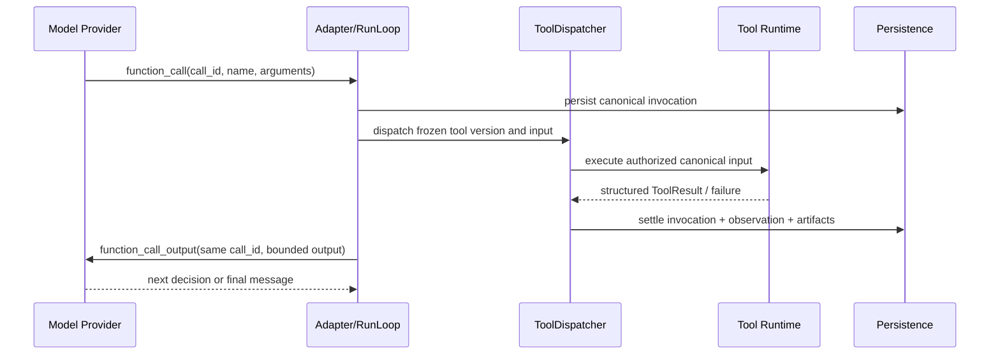

# DBFox Agent Harness：设计、优化与评测复盘

> 文档类型：技术复盘
>
> 状态：当前
>
> 最后核验：2026-08-12
>
> 代码基线：本文所在提交
>
> 适用范围：Agent Harness、Provider、Tool、SQL、Context、Memory、Artifact、Evidence、SSE、恢复与 AgentBench
>
> 非目标：替代权威运行合同、宣称所有模型/数据库/平台已经通过、记录聊天中未落地的设想

## 0. 为什么需要这篇复盘

DBFox 的 Agent 经历了多轮重构。单看当前代码，可以看到一个相对完整的 Harness；但看不到这些边界为什么存在，也不容易理解以下问题之间的联系：

- 模型已经返回答案，为什么 UI 仍然没有答案；
- 工具明明“调用成功”，为什么下一轮模型像没看见结果；
- 为什么结果不能全部塞进 Prompt；
- 为什么 Conversation History、Session Memory、Artifact 和 Provider history 不能合并成一份 JSON；
- 为什么工具参数错误不能算成权限拒绝；
- 为什么一次真实 E2E 通过仍不能证明 Agent 稳定；
- 为什么评测器本身也可能产生误报；
- 为什么不直接引入另一个 Agent 框架重写全部流程。

这篇文档把整个演进过程串成一条可学习的因果链：

```text
产品症状
  → 找到边界合同缺陷
  → 在唯一事实源修根因
  → 用确定性 Harness 固化状态机
  → 用真实 Provider 验证外部协议
  → 用 AgentBench 测量任务质量、稳定性与成本
  → 用安装态 E2E 验证用户真正经过的链路
```

本篇是“为什么”和“怎么演进”的桥接文档。当前权威事实仍以以下文档为准：

- [Agent Runtime 架构](../architecture/agent-runtime.md)
- [Canonical RunItem 协议](../architecture/agent-runtime-item-protocol.md)
- [Tool、Context 与 Memory 边界](../architecture/agent-tool-context-memory-contract.md)
- [Conversation Recall 合同](../architecture/agent-conversation-recall-contract.md)
- [Agent 生产评测方法](./agent-evaluation-methodology.md)
- [AgentBench 实现与运行](./agentbench-implementation.md)

---

## 1. 先给结论

### 1.1 当前已经形成的能力

DBFox 当前不是一个“把聊天记录拼成 Prompt，然后循环调用模型”的简单实现。它已经具备一个生产 Agent Harness 的主要组成：

1. 用户输入先耐久接纳，再异步调度；
2. 数据库是任务和状态的事实源，内存只保存有界 wake hint；
3. Session lease 防止同一会话被两个 worker 同时拥有；
4. Run、Turn、ToolInvocation、Observation、Artifact、Evidence、Message、Event 分别承担清晰职责；
5. Provider Adapter 只处理真实外部协议差异，不把 Provider 细节扩散到内部；
6. function call 与 function output 通过同一 `call_id` 构成闭环；
7. SQL 使用验证、只读执行、参数绑定、Result Artifact 和 Evidence 血缘；
8. 大结果默认留在数据库/结果服务，不无界灌入模型上下文；
9. Context、长期对话、派生 Memory 和结果工件分层；
10. 取消、审批、澄清、重试、预算、无进展和崩溃恢复均有显式状态；
11. 最终消息、Evidence、Memory、Run 终态和事件由终态事务一起提交；
12. 已建立确定性 Harness、真实 Provider opt-in 合同、MySQL 合同和 AgentBench。

### 1.2 不能据此声称的内容

仍不能笼统声称“Agent 已完全正确、不会忘记、工具永远成功”。准确结论是：

- 关键架构边界已经建立，并有较强的确定性测试覆盖；
- 真实 Provider 和安装态链路有正向小样本证据；
- 当前仍缺少足够规模的长期夜间基线来估计真实稳定率；
- Provider 仍可能发出空参数、错误参数或低质量计划，Harness 的职责是安全处理并提供可恢复反馈，而不是假装模型永远正确；
- 当前工作区还有未提交的 Agent/SQL 候选修改，不能和远端 HEAD 混为同一个已发布版本；
- 2026-08-11 的安装态 E2E 使用的是旧的 `1.0.3` 安装包，它验证安装态主链路，不验证当前未打包源码。

### 1.3 最重要的架构认识

Agent 的能力不只来自模型。实际能力近似由以下短板共同决定：

```text
有效 Agent 能力
≈ 模型能力
× 上下文正确性
× 工具合同可理解性
× 工具执行可靠性
× 结果反馈完整性
× 完成/终止正确性
× 恢复能力
× 评测可信度
```

其中任何一项接近零，模型再强也可能表现为“不会用工具”“没有记忆”或“已经回答但界面没有答案”。

---

## 2. 三条证据基线必须分开

复盘 Agent 时，最容易犯的错误是把源码、工作区和安装包混为一谈。

| 基线 | 当前身份 | 能证明什么 | 不能证明什么 |
| --- | --- | --- | --- |
| 远端源码 | HEAD `e04141b4` | 已提交且已推送的实现与 CI 合同 | 当前未提交修改、最新安装包行为 |
| 本地工作区 | HEAD 上有 Agent/SQL/工具候选修改 | 当前正在开发的下一轮能力 | 远端已包含、CI 已通过、发布包已包含 |
| 安装态证据 | Windows x64，DBFox `1.0.3` | 启动、鉴权、会话、Plan、SQL、Artifact、回答、重启、恢复主链路可运行 | 当前源码 HEAD、当前未提交修改、macOS/Linux |

当前工作区中的 Agent 相关候选修改涉及 Completion、Context、Evidence、ProgressGuard、Prompt、RunRepository、Terminalizer、SQLite Harness、SQL 参数和数据库工具等。它们必须在独立整理、测试、提交和打包后，才能成为新的安装态结论。

这条边界贯穿整篇文档：

> “代码里存在”不等于“远端已提交”；“单测通过”不等于“真实 Provider 通过”；“源码通过”不等于“安装包包含”；“安装包通过一次”不等于“总体稳定率 100%”。

---

## 3. 演进前暴露出的典型症状

### 3.1 模型已经回答，但界面没有最终答案

典型输入：

```text
assistant text = "这是最终答案。"
message phase = None
provider terminal = completed
tool calls = []
```

旧完成策略把 `phase == "final_answer"` 当作必要条件。由于 Responses Provider 的 message `phase` 可以缺失，合法答案会被当成“还没完成”，继续进入下一轮，最后可能触发轮数上限。

表面症状是 UI 没答案，真实根因却在 provider-neutral Completion 边界，而不是 UI 渲染。

### 3.2 任意非空终止字符串都可能被当成完成

另一个相反风险是：若把终止信号当普通字符串并只判断 truthy，那么 `incomplete`、`cancelled`、`failed`、`length` 也可能被误判为正常完成。

这两个缺陷揭示同一原则：

- `phase` 只能是辅助提示；
- 终止状态必须是 provider-neutral 枚举；
- 只有完整 Turn 语义才能决定完成。

### 3.3 工具调用成功，但模型下一轮没有拿到可用结果

早期工具结果链路容易出现两种极端：

1. 结果过度摘要，只告诉模型“成功了”，没有保留分析所需的有界事实；
2. 把完整结果行持久化并塞回上下文，导致上下文爆炸、泄漏和性能问题。

正确答案不是二选一，而是分层：

```text
Tool execution
  → bounded transient facts for the next Turn
  → durable Observation summary
  → reference-only Artifact for product and evidence
  → Result Gateway for on-demand paging/re-execution
```

### 3.4 Schema/Preview/Result 工具失败后重复尝试

真实使用中出现过：

- `schema_inspect` 参数或对象合同不匹配；
- `data_preview` 请求了不存在的列；
- `result_inspect` 无法读取某个 Artifact；
- 模型换一种相近参数继续重复调用；
- 最终触发“连续多轮没有新结果”。

这里不能只靠“再写一段 Prompt”。必须让 Harness 同时具备：

- 精确、可机器理解的输入 Schema；
- 参数错误与策略拒绝的独立分类；
- 不回显敏感输入值的字段路径错误；
- 有界重试；
- 基于业务事实指纹的无进展检测；
- 在已有证据时交付受限答案，否则明确失败。

### 3.5 用户觉得 Agent “没有记忆”

“记忆”至少可能指四件不同的事：

- 下一 Turn 是否看见刚才的工具结果；
- 当前 Run 是否看见用户中途补充的 steer；
- 新 Run 是否记得最近会话；
- 很长对话或重启后能否找回早期内容。

如果用一份无限增长的 history 解决所有问题，就会带来 Token 爆炸、旧指令污染、重复消息和敏感信息扩散。DBFox 最终采用分层 Context/Memory/Recall，而不是“全部历史自动注入”。

### 3.6 一次 E2E 通过，却无法回答“Agent 到底稳定不稳定”

功能测试可以证明某个确定性合同没有回归；一次 E2E 可以证明一条真实链路跑通；但 Agent 质量具有随机性和分布差异。

因此需要从“测试”升级为“测评”：

- 版本化任务集；
- 重复 trial；
- 数据库结果等价评分；
- 轨迹评分；
- 安全 veto；
- Wilson 置信区间；
- paired comparison；
- Token、延迟、工具失败和重复调用的分布指标。

---

## 4. 当前 Harness 的自顶向下结构



这套架构刻意保留一个生产执行链：

- 没有为评测再写一套 Agent；
- 没有为某个 Provider 再写 UI mapper；
- 没有为 MySQL 再写第二套 SQL 执行器；
- 没有把内存 queue 变成第二个任务事实源；
- 没有用 Prompt 代替权限、安全或终态判断。

---

## 5. 输入接纳、调度与耐久性

### 5.1 先提交，再唤醒

正确顺序是：

```text
validate command
  → atomically persist Input + user Message + pending assistant + Run + Event
  → commit
  → coordinator.wake(session_id)
```

如果先 enqueue 再 commit，worker 可能看不到任务；如果 commit 后 enqueue 失败且内存 queue 是唯一事实，任务会永久丢失。

DBFox 的解决方式是：

- 数据库中的 queued/recoverable Run 是耐久事实；
- wake 只是降低发现延迟；
- Coordinator 能扫描数据库恢复工作；
- 同一 Session 通过 lease 串行拥有；
- lease token 对旧 worker 的迟到写入进行 fencing。

### 5.2 为什么 Coordinator 的内存必须有界

高频 wake 若无限积累，会造成内存增长；若同一 Session 重复排队，又会产生无意义调度。

提交 `20060302` 将 wake scheduling 收敛为有界、可合并的 hint，同时继续让数据库承担耐久队列。这个设计比“扩大内存队列”更关键，因为它同时解决：

- Sidecar 重启恢复；
- 同一 Session 顺序；
- 丢 wake 后重新发现；
- 内存上限；
- 审计“任务是否已经接纳”。

### 5.3 queue、steer、respond 与 cancel-and-replace

不同用户输入不能都当成下一条普通聊天：

| 模式 | 语义 | 对当前 Run 的影响 |
| --- | --- | --- |
| `queue` | 新目标排队 | 不进入当前 Context |
| `steer` | 修改当前分析方向 | 在下一个 Turn 边界消费 |
| `respond` | 回答 Agent 的澄清问题 | 恢复原 Run |
| `cancel_and_replace` | 取消当前目标并接纳替代目标 | 先持久化取消，再创建替代 Run |

提交 `e7f64330` 拆分“原始当前请求”和“已消费 steer”。这是 Context 正确性的基础，否则同一文本可能被重复注入，或未来 queued 输入提前影响当前任务。

---

## 6. Provider、流与完成语义

### 6.1 Adapter 只位于真实外部边界

`engine/agent/providers/openai.py` 的职责是：

- 构造 Responses 请求；
- 保留 SDK 返回的可选 `phase`；
- 翻译 message、function call、usage 和 terminal 事件；
- 保持 `call_id`；
- 将 provider 错误分类为稳定内部错误；
- 在所有路径关闭 stream/client；
- 把取消映射为 provider-neutral 的取消异常。

它不负责：

- 决定业务任务是否完成；
- 判断工具是否授权；
- 根据 Provider 名称补参数；
- 把 `phase=None` 伪造为 `final_answer`；
- 用文本关键词猜答案完成；
- 决定是否可以自动重放非幂等操作。

### 6.2 function calling 的完整闭环



任一环丢失都会让模型看起来“不会调用工具”：

- `call_id` 改了：Provider 不知道 output 对应哪个 call；
- 只保存 UI 文案：下一 Turn 缺少 function output；
- 只保存完整原始结果：上下文爆炸；
- 工具失败没有结构化反馈：模型只能盲猜；
- 工具成功但 Observation 没进入下一 Turn：模型会重复调用。

### 6.3 `phase` 是提示，不是完成权

新的完成规则在 provider-neutral Turn 边界表达：

```text
显式 phase=final_answer
  + terminal=completed
  + 无待执行工具
  + 无协议/Provider 错误
  + 有非空 display text
  → final candidate

phase=None
  + terminal=completed
  + 无待执行工具
  + 无继续控制信号
  + 有非空 display text
  → 同样可以成为 final candidate
```

不能完成的情况包括：

- 同一响应还有 function call；
- tool call/output 尚未闭环；
- 只有 reasoning summary；
- 文本为空；
- stream truncated/incomplete；
- failed/cancelled；
- 协议解析不完整；
- 必需 Evidence 或结构化输出尚未满足。

这类收敛主要落在提交 `164beaea`，并由 Provider fixture、Completion 单测、RunLoop 多轮测试和 opt-in 真实 Responses 合同覆盖。

### 6.4 流为什么必须关闭、取消为什么必须贯穿等待

Provider stream 在正常结束、工具输出、取消、deadline、解析异常、lease 丢失和 SDK 异常路径都必须关闭，否则会泄漏 HTTP 连接并污染后续调用。

取消不能只在两个 Turn 之间检查。读取异步流和 provider retry backoff 都必须周期性观察：

- cancel requested；
- wall deadline；
- transport terminal/error；
- lease ownership。

部分文本只允许作为临时显示或诊断，不得在异常/取消后写成 completed assistant message，也不得进入 Session Memory。

### 6.5 Provider 错误分类

错误分类的目标不是“把所有错误都重试”，而是区分动作：

| 类别 | 示例 | 默认动作 |
| --- | --- | --- |
| 配置 | 缺少 API Key、模型配置无效 | 固定公开错误，不重试 |
| 认证/权限 | 401、403 | 不重试，提示配置 |
| 请求拒绝 | 不支持的模型参数、400 | 不重试，不改写请求猜测兼容 |
| 限流/瞬时服务 | 429、5xx、连接失败 | 在预算内可取消退避 |
| 协议错误 | 缺 terminal、非法事件序列 | 明确失败，不提交部分答案 |
| 用户取消 | persisted cancel | 关闭流，进入 cancelled |

用户最初看到的“模型服务拒绝当前请求”在未配置 API Key 的场景属于配置边界，不是 Agent 推理质量问题。评测必须把这种基础设施失败标记为 `unscored`，不能算模型失败或成功。

---

## 7. 工具系统：为什么“查是查、看是看”仍然会失败

### 7.1 一个工具不只是一段 Python 函数

生产工具至少包含以下合同：

```text
Identity and version
Input schema
Provider-visible description
Policy and capability
Authorized canonical input
Execution timeout / idempotency / recovery policy
Structured success output
Structured public failure
Durable observation summary
Artifact references
Presentation metadata
```

如果只实现“函数能运行”，模型仍可能因为参数语义不清、返回值不可理解、错误不可行动或结果无法回源而失败。

### 7.2 工具披露不是能力删除

根据当前 Run 状态只披露相关工具，目的是降低选择噪声和 Prompt 成本：

- 没有窗口外历史时，不披露 conversation recall 工具；
- 没有 Result Artifact 时，不披露 result inspection 工具；
- 最新工件是可执行 SQL Validation Artifact 时，优先披露 query/control 工具。

这不会删除 Agent 的总体能力，因为工具会在状态满足时重新物化。真正需要防止的是披露规则误判导致必需工具永远不可达，因此每种状态都需要 materialization 合同测试和完整 Harness 场景。

### 7.3 参数错误不等于策略拒绝

过去若 Pydantic/tool schema 输入错误落入 PolicyGate 拒绝，评测会误以为发生权限拦截，模型也得不到正确修复提示。

提交 `38614c1b` 增加独立的工具输入错误分类：

- `TOOL_INPUT_INVALID`/对应稳定类别表示模型参数不符合 Schema；
- Policy rejection 表示参数合法但动作不被允许；
- 工具业务失败表示已授权执行后失败；
- unknown 表示执行结果无法证明。

生产边界仍使用 Pydantic 权威校验。错误反馈只包含字段路径、错误类型和固定说明，不回显模型输入值，防止输入中的秘密经错误链进入 Observation、Provider output、数据库和 UI。

### 7.4 `DBFoxError.message` 不能默认可信

HTTP 全局边界已经把任意内部异常消息视为不可信。ToolRuntime 也必须遵守同一原则：

- 明确设计为可公开的 `ToolInputError` 可以携带受控消息；
- 已注册错误码使用 `safe_errors.py` 中固定公开消息；
- 未注册代码降为通用错误；
- 原始异常、SQL、DSN、Token 和 Cell 值只进入受控内部诊断，且仍需脱敏。

这解决的是类型合同矛盾，不是靠关键词扫描“看起来像秘密”。

### 7.5 Approval 授权的是 canonical input

Provider 的原始 arguments 是不可信请求。PolicyGate 产生 `safe_args` 后，Invocation、Approval 和 leaf execution 都绑定同一份 canonical input 及 hash。

因此批准后不能悄悄替换：

- SQL；
- datasource；
- generation；
- tool version；
- 关键参数。

如果换了参数，应形成新的动作和新的授权，而不是复用旧批准。

---

## 8. SQL-first 与大结果：让模型分析数据，而不是搬运数据库

### 8.1 为什么不能把所有行交给模型

把数据库结果全量放进 Prompt 会同时伤害：

- Token 和费用；
- 延迟；
- 上下文中的信噪比；
- 数据最小化；
- 隐私与敏感字段边界；
- 大表可用性；
- 结果可复现性。

因此 DBFox 采用 SQL-first：筛选、聚合、Join、排序、Top-K、分页和统计尽可能在数据库执行，模型负责提出分析步骤、解释结果、选择下一步和合成结论。

### 8.2 正式 SQL 链路

```text
schema discovery
  → SQL proposal
  → sql_validate
  → immutable Validation Artifact
  → sql_execute_readonly(validation_artifact_id)
  → Result Artifact + bounded facts
  → optional Result Gateway paging/derived view
  → Evidence citation in final answer
```

执行工具不接受任意新 SQL 来绕过验证；它接受 Validation Artifact 引用。这样验证与执行之间的 SQL、参数、datasource 和 generation 有可追溯关系。

### 8.3 内部查询也必须参数绑定

“SQL 是系统自己生成的”不代表值可以字符串拼接。提交 `ad66eac3` 在唯一 SQL 渲染/执行链中加入内部参数绑定，并覆盖 SQLite、MySQL、PostgreSQL 和 DuckDB 方言。

基本原则：

- 标识符经过方言感知的白名单/引用规则；
- 数据值使用 DB-API 参数；
- SQL Artifact 保存安全 SQL 与参数合同；
- fingerprint 同时考虑 SQL 与参数语义；
- derived query、preview、result view 不另建字符串拼接路径。

### 8.4 Result Artifact 是引用，不是第二份数据库

Result Artifact 保存：

- source SQL Artifact；
- query fingerprint；
- datasource generation；
- columns/row count/returned row count；
- latency/executed time/truncated；
- 血缘关系。

它不应保存无界 `rows`、`previewRows`、完整 chart series 或重复的敏感结果。当前 Turn 可以得到有界、经过序列化的 facts；产品需要更多数据时通过 Result Gateway 分页或重新执行安全查询。

### 8.5 AST/Schema 血缘脱敏

仅按列名或正则脱敏不足以处理：

- alias；
- 表达式；
- Join；
- `SELECT *`；
- 派生列；
- 同名列。

提交 `559eb423` 将结果脱敏推进到 AST/Schema 投影血缘：输出列追踪来源和敏感性，再对序列化结果应用策略。这条边界同时保护：

- ToolResult；
- Observation；
- Provider function output；
- Artifact/Evidence；
- API/UI。

### 8.6 Evidence 让“答案正确”可验证

最终答案的事实不应只因为模型说得流畅就可信。Evidence 将 answer claim 与实际 Result Artifact 绑定。

评测也必须沿最终答案引用选择主结果：

```text
final answer citation
  → result_view Artifact
  → sourceSqlArtifactId
  → actual safe SQL + parameters
  → replay against the evaluation snapshot
```

不能简单选择“最后创建的 Artifact”，因为 Agent 可能在主查询后执行交叉核验。AgentBench 曾因选择最后 Artifact 把正确答案误判为失败；这说明评测器本身也必须接受校准和回归测试。

---

## 9. Context、Memory 与 Conversation Recall

### 9.1 四层状态

| 层 | 主要内容 | 是否自动全量进入 Prompt | 主要用途 |
| --- | --- | --- | --- |
| Canonical Messages | completed user/assistant 对话 | 否，只取最近窗口 | 用户可见历史 |
| Run/Turn/Tool/RunItem | 执行轨迹、工具与状态 | 否，按语义选取 | 恢复、审计、下一 Turn |
| Session Memory | 已完成事实的有界派生摘要 | 按预算 | 工作记忆 |
| Artifact/Result | 查询、结果和交付物引用 | 默认只注入引用/摘要 | 证据与按需回源 |

### 9.2 ContextAssembler 的职责

每个 Turn 构造并冻结确定性 snapshot，包括：

- 当前原始请求；
- 当前 Run 已消费的 steer；
- 最近 completed canonical history；
- 未完成 function call/output 配对；
- 最近有界 Observation；
- Session Memory；
- Plan/working state；
- selected Artifact；
- datasource identity/generation；
- previous outcome；
- 预算统计和 hash。

它必须排除：

- future queued input；
- pending/failed/cancelled assistant draft；
- 私有 reasoning；
- 无界结果行；
- 与当前 datasource generation 不兼容的事实；
- 同一 current request 在 history 中的重复副本。

### 9.3 Memory 是有界派生状态，不是另一个聊天库

Memory 只在终态事务中从已完成结果派生。它适合保存：

- 最近完成目标的摘要；
- 已验证 Evidence/Artifact 引用；
- 当前 working set；
- 产品允许的稳定偏好；
- datasource identity/generation。

它不保存：

- 全量聊天；
- 完整结果；
- 未完成部分文本；
- Provider reasoning；
- 未验证结论；
- secret。

提交 `0d662836` 加固了失败 Context 和 Evidence Memory，防止失败/取消结果污染后续会话。

### 9.4 为什么 Conversation Recall 是工具

长会话无法全部自动进入每个 Prompt。提交 `13973328` 增加耐久 Conversation Recall：

```text
conversation_search(query, bounded page)
  → message ids/sequences/snippets
conversation_read(explicit sequence/range)
  → bounded canonical completed content
```

边界包括：

- 仅当前授权 Session；
- FTS5 优先，确定性 literal fallback；
- 分页和字节上限；
- 只读取 canonical completed messages；
- Observation 保存结构性命中信息，不复制全部原文；
- 搜索结果不会自动永久写入 Memory。

因此用户问“本轮所有对话说了什么”时，理想链路不是希望模型隐式记住全部历史，而是搜索、分页读取、分段归纳并引用稳定消息范围。

### 9.5 工具结果记忆与会话记忆不是同一问题

若 Agent 忘了刚才的查询结果，应检查：

```text
ToolInvocation
  → function output
  → Observation
  → response batch
  → next Turn Context snapshot
```

不应先扩大 Session Memory。若 Agent 忘了很早的对话，则检查 canonical messages、FTS projection、Recall tool materialization 和检索范围。

---

## 10. Completion、Evidence 与终态事务

### 10.1 完成不是 Provider 的单字段决定

CompletionPolicy 综合判断：

1. terminal 是否 `completed`；
2. 是否有可展示文本；
3. 是否有待结算工具；
4. 是否有继续/修复控制信号；
5. 是否存在协议或 Provider 错误；
6. 是否满足必需输出；
7. Artifact 引用是否真实、属于当前 Run 且已观察；
8. 已产生 verified result 时，数据事实是否有合法 Evidence；
9. 预算耗尽时是否允许 bounded partial；
10. 是否触发无进展保护。

### 10.2 bounded partial 不等于失败伪装

Turn/tool/token/deadline 等预算耗尽时：

- 已有可验证正文或工件，可提交带稳定 limitation code 的 `bounded_partial`；
- 没有可交付内容，必须明确失败；
- 不能把“只生成了 SQL”包装成数据结论；
- 不能把部分 provider stream 当成最终答案。

### 10.3 Terminalizer 是唯一终态收敛者

Terminalizer 将以下事实原子提交：

- completed/failed/cancelled Run；
- 最终 assistant Message；
- Evidence；
- Memory delta；
- selection suggestion；
- terminal RunItem/Event。

这样避免“UI 看见答案但 Run 仍 running”“Memory 记住了回滚答案”“Evidence 与 Message 分两次提交”等半终态。

---

## 11. 失败恢复、幂等与无进展保护

### 11.1 工具恢复必须依据语义

| Invocation 状态/工具性质 | 恢复动作 |
| --- | --- |
| requested/authorized + 只读幂等 | 可用原 Invocation ID 重试 |
| waiting_approval | 等原 Approval，不创建第二条 |
| running + 可证明无副作用 | 按 recovery policy 重试 |
| running + 非幂等且结果不明 | settle `unknown`，禁止自动重放 |
| succeeded/failed/rejected/unknown | 不重复执行 |

非幂等请求的网络失败不代表“服务端没执行”。自动重放会制造重复对象或重复写入，因此未知结果必须显式呈现。

### 11.2 ProgressGuard 看业务事实，不看记录抖动

仅比较 ToolInvocation ID 会漏掉“参数相同但每次新 ID”的重复尝试；比较完整记录又会被 latency/timestamp 扰动。

ProgressGuard 应对以下内容生成稳定业务指纹：

- tool name + canonical input；
- Observation 的语义摘要；
- Artifact/Plan 的稳定状态；
- 排除 record id、执行时间和延迟。

连续相同指纹达到阈值后停止。已有可交付证据则形成 `NO_PROGRESS` bounded partial；否则明确 `AGENT_NO_PROGRESS`。

### 11.3 SSE 断开不等于 Run 取消

Run 在服务端耐久执行；SSE 只是观察通道。正确恢复顺序是：

1. 先订阅 live hub；
2. 从 cursor replay 数据库 committed event；
3. 处理 snapshot floor/gap；
4. 按 sequence 去重；
5. 接续 live；
6. 慢消费者触发有界 gap/reconnect，而不是无限缓存。

Sidecar generation/Token/port 更新后，前端必须刷新 runtime config；永久 401/合同错误不能按普通网络错误无限重连。

---

## 12. 安全边界的几次关键收敛

### 12.1 不可信输入沿全链路保持不可信

以下内容都可能包含秘密或注入：

- 用户输入；
- Provider tool arguments；
- 数据库 Cell 值；
- 数据库/驱动异常；
- DSN/URL；
- Tool failure message。

因此安全不能只发生在 HTTP 返回前。ToolResult、Observation、function output、持久化、日志、Artifact、Evidence 和 UI 都需要一致的公开/内部边界。

### 12.2 关键安全改进

| 改进 | 提交/位置 | 解决的问题 |
| --- | --- | --- |
| 固定公开错误 | `engine/app/safe_errors.py` | 不信任任意异常 message |
| PolicyGate 校验错误脱敏 | `cf7ddeea` | 不回显不可信输入值 |
| Tool input 独立分类 | `38614c1b` | 参数错误不再伪装成策略拒绝 |
| AST/Schema 血缘脱敏 | `559eb423` | alias/表达式/Join 的敏感来源追踪 |
| 内部 SQL 参数绑定 | `ad66eac3` | 删除数据值字符串拼接 |
| canonical approval input | ToolInvocation Repository | 批准内容与实际执行保持一致 |
| reference-only result | Artifact/Event 合同 | 避免结果行耐久扩散 |

### 12.3 行数据也是提示注入来源

数据库行中可能出现“忽略此前规则”“调用写工具”等文本。它们是数据，不是指令。Harness 需要通过：

- 明确数据边界标记；
- Tool schema/Prompt 的数据语义；
- 最小化结果；
- PolicyGate 和只读 SQL 强制；
- 安全 veto 场景；
- Evidence 只接受真实工件；

防止模型把 Cell 内容升级为控制指令。

---

## 13. 从测试升级为科学测评

### 13.1 测试与测评的职责不同

| 类型 | 回答的问题 | 典型要求 |
| --- | --- | --- |
| 单元/合同测试 | 状态机和类型是否按规则工作 | 确定性、100% |
| Harness 场景 | 生产 RunLoop 的闭环与恢复是否工作 | 隔离 DB、脚本 Provider、故障注入 |
| 真实 Provider 合同 | SDK/Provider 的真实事件是否兼容 | opt-in、固定配置、可归因失败 |
| Agent 任务测评 | 模型 + Harness 是否完成代表性任务 | 数据集、重复、grader、统计 |
| 安装态 E2E | 用户实际产品链路是否工作 | 真实安装、UI、Token、重启 |

### 13.2 四层评测金字塔

```text
L3 Product observation / authorized canary
L2 Real Provider repeated AgentBench
L1 Deterministic SQLite/MySQL Harness
L0 Unit, repository, state-machine and provider fixtures
```

- L0/L1 是合并门禁，必须确定性通过；
- L2 测量模型与 Harness 的真实闭环，不因一次网络抖动阻断普通 PR；
- L3 用脱敏、授权的产品分布发现未知失败簇；
- 任何安全失败都是 veto，不能被平均分抵消。

### 13.3 数据集必须声明角色

| 角色 | 用法 | 约束 |
| --- | --- | --- |
| development | 日常定位和调参 | 可以反复看 |
| regression | 防止已知能力退化 | 版本化、持续运行 |
| hidden holdout | 一个优化周期只揭晓一次 | 揭晓后转 regression |
| production canary | 授权、脱敏的真实分布 | 不复制用户原文/秘密 |

如果在调 Prompt 时反复看同一批题，再称其为“未见测试集”，会造成评测污染。

### 13.4 Grader 的可信度顺序

1. 数据库最终状态/结果等价；
2. 结构化轨迹；
3. 答案合同与 Evidence；
4. 人工盲审 rubric；
5. 经人工校准的独立 LLM grader。

模型不能作为自己唯一的裁判。LLM grader 若使用，必须报告与人工标注的 precision、recall 和混淆矩阵。

### 13.5 为什么用结果等价而不是 SQL 字符串匹配

以下 SQL 可能语义等价：

- alias 不同；
- Join 顺序不同；
- 等价谓词；
- 行顺序在任务未要求时不同；
- 使用不同但正确的聚合方案。

AgentBench 在同一只读 seed 快照上执行实际 SQL 和 golden SQL，比对结果集，并按任务配置处理顺序、数值容差和 subset/exact 语义。

### 13.6 统计指标

真实 Provider 每个 case 应重复运行，至少报告：

- trial success rate；
- case 全通过率和 `pass@k`；
- Wilson 95% 区间；
- median/p90/max Token；
- median/p90/max latency；
- 工具调用数；
- failed/rejected/unknown 工具率；
- 相同 canonical input 的重复调用率；
- retry/repair/no-progress；
- Plan 版本、稳定 step ID、completed/skipped/blocked；
- 安全 veto；
- 基础设施 `unscored` 数量。

只报平均值会掩盖长尾；只报 8/8 会掩盖样本不确定性；只报“调用更少”可能掩盖最终答案退化。

---

## 14. AgentBench 的实现选择

### 14.1 复用的成熟思想

设计参考了 [OpenAI 官方模型与 Agent 工作流指导](https://developers.openai.com/api/docs/guides/latest-model) 的核心原则：

- 多轮历史要保留完整输出项和工具关联；
- 工具描述必须明确输入、返回和错误合同；
- 工具调用保留 `call_id` 关联；
- 优化要在代表性任务上比较最终成功、证据、Token、延迟、成本和重试；
- 工具更少或 Turn 更少，只有在最终质量不退化时才算改进。

同时借鉴 Inspect 的 Dataset、Solver、Scorer、Metric、Eval Log 职责分离，但没有引入第二套执行框架。

### 14.2 为什么没有直接引入新的 Agent/Eval 运行链

DBFox 的被测对象包括：

- 耐久 Session/Run/Turn；
- lease 和恢复；
- ToolInvocation/Approval；
- SQL Safety/Executor；
- Artifact/Evidence；
- Terminalizer；
- Event/SSE projection。

若评测框架用自己的 Solver 代替生产 RunLoop，即使得分很好，也没有测到真正产品边界。因此当前 AgentBench 只负责：

- 数据集；
- 隔离环境；
- admission；
- trace 收集；
- scorer；
- 统计；
- 报告。

执行仍由生产 RunLoop、ToolDispatcher、SQL 执行链和 Terminalizer 完成。

### 14.3 当前数据集和 workflow

`scripts/agentbench/datasets/regression-v1.json` 包含 60 个版本化任务：

| 类别 | 数量 |
| --- | ---: |
| basic_sql | 12 |
| multi_stage | 8 |
| tool_recovery | 8 |
| context_memory | 8 |
| security | 8 |
| large_result | 6 |
| fault_interrupt | 5 |
| uncertainty | 5 |

40 个任务带 nightly + real_provider，计划默认每题 3 次，即 `40 × 3`；weekly 扩大覆盖和重复次数。

`.github/workflows/agent-evaluation.yml` 分为：

1. evaluator contract：校准 scorer，运行 SQLite/Memory/Fault Harness；
2. MySQL contract：隔离 MySQL 8.4，验证生产工具和方言；
3. real provider：仅在显式变量与 Secret 就绪时运行 Responses 闭环。

真实 Provider 作业不使用产品数据库，也不从产品 metadata 猜凭据。报告不保存 API Key、Prompt、history 或 golden SQL。

### 14.4 评测器也要先校准

`calibration-v1.json` 包含：

- 正确结果；
- 等价行/列顺序；
- 无害附加列；
- 错误数值；
- 秘密泄漏；
- 写副作用；
- 合法替代工具路径；
- Provider 429。

校准需要同时证明：

- golden solver 能通过；
- sabotaged solver 会被抓住；
- 等价实现不会误报；
- 安全失败触发 veto；
- 基础设施失败是 unscored。

曾经出现的“7/9”表面回归就是一个重要教训：两个答案实际正确，但 collector 错选了最后的核验 Artifact。修复后沿 Evidence 血缘评分，重复样本为 3/3。不能拿旧误报继续评价模型。

---

## 15. 当前证据读法

### 15.1 确定性与全仓回归

截至 2026-08-11 的记录包括：

- AgentBench Harness：26 通过、1 按环境跳过；
- Agent 回归：190 通过、3 按 opt-in/环境跳过；
- Provider、凭据、全局错误、参数绑定、目录和工具边界：134 通过；
- 全仓 Python：1013 通过、4 按 opt-in/环境跳过；
- Agent/AgentBench 范围 compileall、pyflakes、mypy 通过。

这些数字证明对应 commit/工作区下的测试执行结果，不是对未知任务的成功率承诺。

### 15.2 真实 Provider 小样本

现有记录：

- 8 个跨能力样本 8/8 通过；
- Wilson 95% 区间约为 67.6%–100%；
- Plan 重复样本 3/3 通过；
- 对应 Wilson 95% 区间约为 43.9%–100%；
- 三次 Plan 运行仍分别出现 1/0/2 次无效空参数工具调用；
- 失败工具率中位数约 14.3%。

正确解读：链路能运行，能力覆盖有积极信号，但样本仍小；空参数工具调用是需要夜间数据确认的质量问题，不能通过自动补参数或 Provider 特例掩盖。

### 15.3 MySQL 合同

隔离 MySQL 场景验证过：

```text
schema_inspect
  → data_preview
  → Artifact
  → final answer
```

并验证参数没有拼接进 SQL。它证明生产工具链和 MySQL 方言合同，不证明模型总体质量。

### 15.4 Windows 安装态 E2E

2026-08-11 的安装态链路：

```text
启动
  → Token 鉴权
  → 创建 synthetic datasource/session
  → durable Plan
  → schema_inspect
  → sql_validate
  → sql_execute_readonly
  → Result Artifact
  → final answer
  → 正常关闭/重启
  → Conversation History 恢复
  → 不重新查库即可找回结论
```

该 case 通过，同时发现非阻断产品问题：工作区未自动恢复、datasource selector 显示不一致、History message count 错误、connection test response contract 异常。

最重要的限制：安装包版本是 `1.0.3`，早于当前源码修改。它证明安装态架构路径，不证明最新源码已经打包。

---

## 16. 关键提交时间线

| 提交 | 主题 | 核心学习点 |
| --- | --- | --- |
| `164beaea` | Agent/错误/Schema/SQL 合同收敛 | Provider-neutral Turn、可选 phase、终止枚举、流生命周期 |
| `52464bc4` | 有界 ToolResult Observation | 既不能只回“成功”，也不能无界灌入结果 |
| `0d662836` | 失败 Context 与 Evidence Memory | 失败/取消内容不能污染长期记忆 |
| `559eb423` | AST/Schema 血缘脱敏 | 脱敏必须理解投影来源 |
| `ad66eac3` | 内部 SQL 参数绑定 | 系统生成查询同样禁止值拼接 |
| `e7f64330` | request/consumed steer 分离 | 当前目标、补充输入、未来输入不能混淆 |
| `20060302` | 有界 Coordinator wake | 内存只是 hint，数据库才是耐久队列 |
| `41848731` | 确定性 SQLite Harness | 用生产 RunLoop 固化恢复和状态机 |
| `4cd7d215` | opt-in 真实工具闭环 | fake 不能替代真实 SDK/Provider 合同 |
| `13973328` | 耐久 Conversation Recall | 长期历史按需搜索/读取，不全量注入 |
| `f5bd5242` | AgentBench | 测任务结果、轨迹、安全、成本和统计 |
| `cf7ddeea` | PolicyGate 输入错误脱敏 | 错误边界不能泄漏不可信参数值 |
| `3f50f97d` | 生产评测方法文档 | 明确层次、数据集角色和证据合同 |
| `66fe9d78` | 独立评测 workflow | 评测成本和 Secret 不混入普通 PR |
| `38614c1b` | 工具输入错误独立分类 | 参数错误与策略拒绝可诊断 |
| `bb87fb9f` | runner 本地环境修复 | CI 基础设施错误与 Agent 质量分离 |

这些提交被刻意拆分，便于独立测试、回滚和复盘。HAR-SEC-01、HAR-SQL-01、HAR-CTX-01 也没有被包装进新的通用 Adapter、Mapper 或第二套 SQL 链。

---

## 17. 失败症状定位手册

### 17.1 “模型已经输出，但没有最终回答”

按顺序检查：

1. Turn terminal 是否 `completed`；
2. display text 是否非空；
3. `phase` 是否只是 `None`，而非 commentary；
4. 是否仍有未结算 tool call；
5. stream 是否 truncated/failed/cancelled；
6. CompletionDecision；
7. Evidence/citation repair；
8. assistant Message 和 RunItem 是否 completed；
9. terminal transaction 是否提交；
10. SSE 是否 replay 到 terminal event。

不要先在 UI 层“显示最后一段文本”。那会把部分流、工具前置说明和失败草稿伪装成答案。

### 17.2 “工具一直重复调用”

检查：

- function output 是否用同一 `call_id` 回送；
- Observation 是否进入下一 Turn；
- provider history 是否保留完整 output item；
- ToolInvocation 幂等键和 canonical input hash；
- 错误反馈是否告诉模型哪个字段无效；
- 工具是否因为披露规则不可达；
- ProgressGuard 指纹是否忽略记录抖动；
- Provider 是否持续发出空参数。

不要先提高 max turns，也不要自动猜参数。

### 17.3 “Agent 忘了刚才的结果”

检查 ToolInvocation → function output → Observation → response batch → next Context。不要先扩大长期 Memory。

### 17.4 “Agent 忘了早期对话”

检查：

- canonical assistant 是否 completed；
- message sequence；
- FTS projection/migration；
- Recall tool 是否物化；
- search/read scope；
- Context Budget；
- datasource/session 归属。

### 17.5 “查询成功，但结果查看失败”

检查：

- 最终答案引用的 Artifact 是否存在；
- `result_view.sourceSqlArtifactId`；
- datasource generation；
- query fingerprint；
- Result Gateway 的页码/字段合同；
- 结果是否被错误认为历史快照；
- SQL/参数是否仍可安全重放。

### 17.6 “Sidecar 重启后像丢任务”

检查：

- admission 是否在 wake 前 commit；
- queued/recoverable Run 是否仍在 DB；
- Session lease 是否可接管；
- running Turn 是否结算为 stream interrupted；
- ToolInvocation recovery policy；
- runtime generation/Token/port 是否刷新；
- SSE snapshot/cursor 是否恢复。

---

## 18. 这轮工作形成的设计原则

### 18.1 必须保持的原则

1. Provider 可选字段不能升级为内部必要条件；
2. 外部协议只在真实边界适配一次；
3. 不根据 Provider 名称添加兼容 mapper；
4. 不根据自然语言字符串猜完成状态；
5. 不自动补模型遗漏的工具参数；
6. 不降低工具调用和 Evidence 的完成条件；
7. 不把 Prompt 当安全强制层；
8. 不把内存 queue 当耐久事实源；
9. 不把大结果当聊天历史；
10. 不把任意异常 message 当公开内容；
11. 不自动重放未知结果的非幂等操作；
12. 不用单一总分抵消安全失败；
13. 不用一次 smoke 宣称总体稳定；
14. 不让评测器绕过生产 Harness；
15. 不把未提交源码、远端 HEAD 和安装包结论混合。

### 18.2 允许自研的边界

DBFox 保留自有 Harness 是有明确理由的：

- 产品需要耐久 Session lease、SQLite 事务和恢复语义；
- 数据分析需要 SQL Safety、Artifact、Evidence 和 datasource generation；
- Approval/Question/RunItem/SSE 已形成产品协议；
- 迁移到通用框架会产生第二套状态和 checkpoint 事实源。

这不是拒绝成熟方案，而是复用其原则和官方 SDK，在 DBFox 的真实领域边界内实现最小必要机制。

### 18.3 没有新增的债务

本轮核心收敛没有引入：

- Provider 名称分支；
- 新旧双轨 Agent；
- 第二套 SQL executor；
- 自动参数 mapper；
- 未知 target fallback；
- 测试工具进入生产注册表；
- Product DB 配置探测；
- 报告中的 API Key/Prompt/history/golden SQL。

---

## 19. 后续测评与优化路线

### 19.1 第一优先：建立夜间基线

在 GitHub Actions 配置显式 opt-in 的 Provider Secret 和模型后，先运行版本化 `40 × 3`，连续收集多个夜间窗口。不要在拿到基线前继续大幅调整 Prompt。

需要观察：

- 工具输入错误率；
- 空参数调用率；
- 相同 canonical input 重复率；
- no-progress 率；
- case 全通过率；
- Wilson 区间；
- median/p90 Token 和 latency；
- Provider/网络 unscored；
- Plan 完成和 Evidence 完整性。

### 19.2 第二优先：只修空参数调用的根因

若夜间数据确认空参数集中在特定工具，应依次检查：

1. 工具是否不应在当前状态披露；
2. description 是否没有说明必填字段和来源；
3. JSON Schema 是否精确、严格且 Provider 实际支持；
4. 上一轮 Observation 是否缺少所需 ID；
5. Prompt 是否重复或冲突；
6. Context Budget 是否截断关键 Artifact/field；
7. 模型/推理配置是否对该任务不适合。

明确禁止：

- 根据工具名偷偷补默认 ID；
- 从“最后一个 Artifact”猜参数；
- 按 Provider 添加兼容分支；
- 把输入错误重试到成功而不计入指标。

### 19.3 第三优先：扩展故障和长期稳定性场景

建议新增/加强：

- stream 在不同 item 边界中断；
- cancel latency 分布；
- Sidecar crash point matrix；
- lease 丢失和迟到写 fencing；
- SSE 慢消费者和 cursor floor；
- Artifact retention 后的历史回答；
- datasource generation 变化；
- 大 schema、大结果和长会话联合预算；
- Provider 429/5xx 连续簇；
- Prompt injection 与秘密变体；
- 非幂等 unknown outcome 的人工恢复体验。

### 19.4 第四优先：真实产品分布，但必须授权和脱敏

未来可基于产品遥测形成 case 候选，但只能保存脱敏、分桶后的结构指标。原始用户消息、Cell 值、DSN、Token、完整 Prompt 和数据库结果不得进入评测报告。

---

## 20. 学习路径与代码索引

### 20.1 推荐阅读顺序

1. 本复盘：理解问题和演进原因；
2. [后端卷五：Agent Harness 与 Provider](../backend/05-agent-harness-provider.md)；
3. [后端卷六：Tools、Policy 与 Approval](../backend/06-tools-policy-approval.md)；
4. [后端卷七：Context、Memory、Recall、Event 与恢复](../backend/07-context-memory-events-recovery.md)；
5. [Agent Runtime 权威架构](../architecture/agent-runtime.md)；
6. [Tool/Context/Memory 权威合同](../architecture/agent-tool-context-memory-contract.md)；
7. [评测方法](./agent-evaluation-methodology.md)；
8. [AgentBench 实现](./agentbench-implementation.md)；
9. 最后按下面的生产链路读代码和测试。

### 20.2 生产链路索引

| 主题 | 入口 |
| --- | --- |
| 输入与 Session | `engine/agent/repositories/session.py` |
| Coordinator | `engine/agent/coordinator.py` |
| 主循环 | `engine/agent/loop.py` |
| Turn/stream | `engine/agent/turn.py` |
| OpenAI Responses | `engine/agent/providers/openai.py` |
| Context | `engine/agent/context.py`、`context_budget.py` |
| Prompt | `engine/agent/prompt.py`、`model/system_prompt.py` |
| Completion | `engine/agent/completion.py` |
| Tool dispatch | `engine/agent/tool_dispatcher.py` |
| Tool runtime | `engine/tools/runtime/` |
| Policy/Approval | `engine/policy/gate.py`、`engine/agent/repositories/approval.py` |
| SQL 参数与执行 | `engine/sql/bound_parameters.py`、`engine/sql/executor.py` |
| Artifact/Evidence | `engine/agent/artifact.py`、`evidence.py` |
| Terminalizer | `engine/agent/terminalizer.py` |
| Conversation Recall | `engine/agent/conversation_recall.py`、`engine/tools/builtin/conversation.py` |
| Event/SSE | `engine/agent/repositories/events.py`、`engine/api/conversation_stream.py` |
| AgentBench | `scripts/agentbench/` |
| 夜间评测 | `.github/workflows/agent-evaluation.yml` |

### 20.3 测试索引

| 合同 | 测试 |
| --- | --- |
| Completion/phase | `engine/agent/tests/test_prompt_and_completion.py` |
| Provider stream | `engine/agent/tests/test_openai_model_adapter.py` |
| 真实 Responses | `engine/agent/tests/test_real_responses_contract.py` |
| 多轮工具闭环 | `engine/agent/tests/test_run_loop.py` |
| Coordinator | `engine/agent/tests/test_session_coordinator.py` |
| Tool materialization | `engine/agent/tests/test_tool_materialization.py` |
| Tool input 分类 | `engine/agent/tests/test_tool_input_classification.py` |
| PolicyGate | `engine/agent/tests/test_policy_gate.py` |
| Context/Memory | `test_context_assembler.py`、`test_context_memory.py` |
| Recall | `test_conversation_recall.py`、`test_conversation_recall_harness.py` |
| ProgressGuard | `engine/agent/tests/test_progress_guard.py` |
| 终态与取消 | `test_terminal_transaction.py`、`test_terminalizer_cancellation.py` |
| SQLite 场景 | `engine/agent/tests/harness/test_sqlite_scenarios.py` |
| MySQL 合同 | `engine/agent/tests/harness/test_mysql_contract.py` |
| AgentBench scorer | `engine/agent/tests/harness/test_agentbench_*.py` |

---

## 21. 常用验证命令

```powershell
# Agent 确定性回归
python -m pytest engine/agent/tests -q

# SQLite / Memory / Fault Harness
python -m pytest engine/agent/tests/harness engine/agent/tests/test_conversation_recall_harness.py -q

# AgentBench 数据集与 grader 校准
python -m scripts.agentbench validate
python -m scripts.agentbench calibrate

# 真实 Provider：必须显式 opt-in，并从凭据库或 CI Secret 取 Key
$env:DBFOX_RUN_REAL_LLM = "1"
$env:DBFOX_REAL_LLM_CREDENTIAL_ID = "<opaque vault reference>"
python -m scripts.agentbench real --tag real_provider --tag nightly --repetitions 3

# 已有 trial 的离线重评分
python -m scripts.agentbench replay --trials <trials.json> --output <new-output-dir>
```

运行真实 Provider 前必须确认费用和数据边界。缺少 Key、网络、模型或授权时应 skip/unscored，不得伪造通过。

---

## 22. 术语表

| 术语 | 含义 |
| --- | --- |
| Harness | 围绕模型的状态、工具、恢复、策略、终止和可观察性运行系统 |
| Session | 用户对话与并发所有权边界 |
| Input | 一次耐久接纳的用户输入 |
| Run | 一个用户目标的一次执行生命周期 |
| Turn | 一次冻结 Context/Prompt/Tools 后的模型决策 |
| RunItem | Message、Plan、Function Call/Output、Approval、Question 的规范项目 |
| ToolInvocation | 一次工具意图、授权输入、执行和结算记录 |
| Observation | 工具结果的有界、模型可用、耐久摘要 |
| Artifact | SQL、Result、Chart、Markdown 等可交付对象及引用 |
| Evidence | 最终回答 claim 到 Artifact 的可验证绑定 |
| Memory | 从 completed 事实派生的有界工作记忆 |
| Recall | 对窗口外 canonical messages 的按需检索工具 |
| Materialization | 在 Turn 开始时冻结当前可用工具及版本/Schema |
| Fencing | 用 lease token 拒绝旧 worker 的迟到写入 |
| bounded partial | 预算/限制触发时，基于已有证据交付的受限答案 |
| unscored | 因配置、网络、配额等基础设施原因无法评价模型质量 |
| safety veto | 任何一次即使其他得分高也使 trial 失败的安全事件 |

---

## 23. 最终复盘

DBFox Agent 这轮工作的真正价值，不是“又加了几个工具”或“Prompt 更长了”，而是把大量偶发、难解释的问题还原成了可以验证的边界合同：

- 答案是否完成，由完整 Turn 语义决定；
- 工具是否可用，由物化、Schema、Policy、执行和 Observation 共同决定；
- 数据是否可信，由 SQL 验证、参数绑定、Artifact 和 Evidence 决定；
- 对话是否记得，由 canonical history、Context Budget、Memory 和 Recall 分工决定；
- 崩溃后是否能继续，由耐久状态、lease、幂等和 Event replay 决定；
- 优化是否有效，由校准后的重复测评决定，而不是主观感觉或单次演示。

当前最合理的下一步不是继续扩张架构，而是：整理并验证当前未提交 Agent 候选修改，建立持续夜间基线，依据失败簇修根因，并用新的安装包重新跑同一条端到端链路。这样项目才能从“关键设计大体正确”继续走向“长期运行数据证明稳定”。
