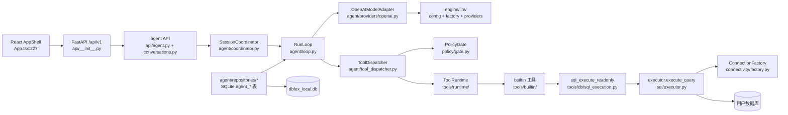
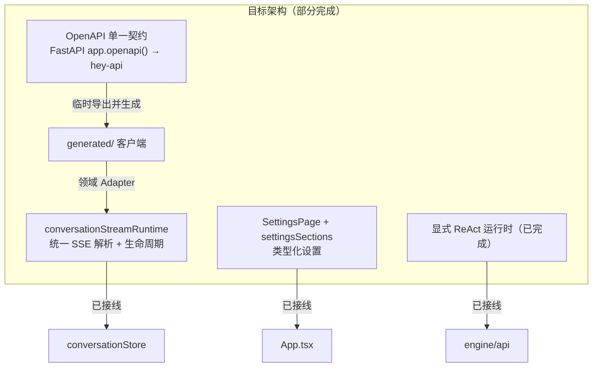
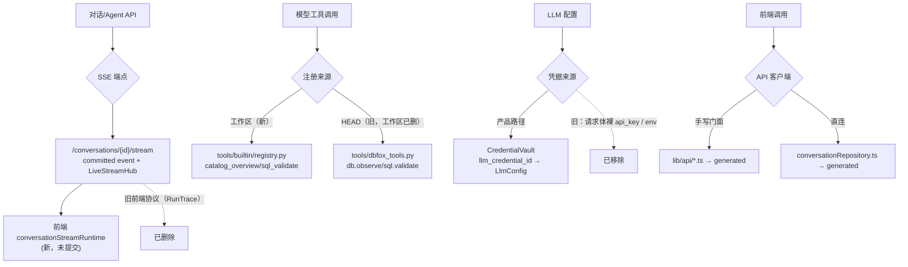

# DBFox 架构与代码考古分析报告

> 分析日期：2026-07-31 ｜ 分支快照：`codex/llm-call-interface`（含大量未提交工作区改动） ｜ 证据来源：真实入口、路由注册、import 依赖、测试断言、git 历史、迁移文件、构建/CI 配置
>
> 方法说明：本报告基于静态代码考古。区分"已确认事实 / 高可信推断 / 低可信推断 / 待团队确认"。
>
> **复核更正**：本报告保留最初工作树的考古快照，不作为规范性架构定义。后续源码复核确认：OpenAPI 契约由 FastAPI `app.openapi()` 临时导出后交给 `@hey-api/openapi-ts`，无需提交静态 `openapi.json`；`lib/api/*.ts` 与 `conversationRepository.ts` 是 generated SDK 之上的领域 Adapter，不是第二套 HTTP 客户端；SQL Console 是确定性产品命令，现由独立 Application Service 编排，不经过 ReAct Loop；本分支评测源码已删除，评测由专门分支维护。

---

## 1. 执行摘要

**当前项目的真实主线**：DBFox 正处于一次**彻底的自定义运行时重构的中途**。2026-07-21 提交 `75df80a9` 删除了全部 LangGraph 运行时（`engine/agent_core/`、`engine/agent/graph/`、`engine/agent/nodes/`），当前主线是**显式 ReAct Harness**（`engine/agent/coordinator.py` + `engine/agent/loop.py` + `engine/agent/repositories/`），LLM 调用统一走 `engine/llm/`（vault 凭据 + 单一工厂），SQL 执行统一走 `engine/sql/executor.py` 安全链。`test_agent_architecture.py` 用测试锁死了这条边界（禁止 langgraph/agent_core/agent_runtime 引用）。

**最严重的三个架构问题**：

1. **当前分支是一次"未提交的巨型重构"**：374 个文件、+15982/−27712 行改动全部停留在工作区。工具注册表已从 `dbfox_tools.py` 换成 `builtin/registry.py`、工具名从 `db.observe` 改为 `catalog_overview`、前端新增 openapi-ts 生成管线——但**没有任何提交**。任何分支合并/回滚都会引发巨大返工，且开发主线在 commit 层面不可见。
2. **文档严重失真**：`CLAUDE.md` 仍引用已删除的 `engine/tools/dbfox_tools.py`、已不存在的 `result_analysis.yaml`/`schema_exploration.yaml`、已废弃的工具名 `db.observe`/`sql.validate`/`chart.suggest`/`answer.synthesize`/`escalate.tool_group`。`llm-call-interface` spec（2026-07-05）仍引用已删除的 `engine/agent/graph/context.py`、`engine/agent_core/answer.py`，且提议的 `resolve_support_llm_config_from_env()`/`create_chat_model()`/`LlmCallOptions` 接口未实现、`source="support_env"` 已改成 `"test"`。
3. **前端契约分层需要写清楚**：`desktop/src/lib/api/generated/` 是唯一 HTTP 契约层；`lib/api/*.ts` 与 `conversationRepository.ts` 负责 Blob、领域归一化和 DBFox SSE 恢复语义。自定义 SSE 使用 `Last-Event-ID` 和运行边界解析，属于必要协议实现。

**最容易误导开发的旧代码/名称**：CLAUDE.md 的工具名清单（照旧路径找会撞上已删除文件）；`engine/sql/compiler/` 与 `engine/sql/dialect/` 的"双编译层"表象（实际 `compiler/` 只剩 `projection_constraint.py`，不是重复）；空壳目录 `agent_core/`、`agent_runtime/`、`agent/graph/`、`agent/nodes/`、`agent/planning/`、`agent/extensions/`、`agent/skills/`。

**最容易返工的区域**：前端对话流式状态层（`conversationStreamRuntime.ts`/`runLifecycleController.ts` 全新未提交）、设置 UI（三世代并存）、`engine/datasource.py` 兼容门面、schema/语义相关 4 个模块（`ai_enrich`/`ai_index`/`environment/`/`semantic/`）。

**当前最需要做的治理动作**：① 按可独立回滚的功能边界提交当前工作区；② 保持 CLAUDE.md、架构约束和工具注册表一致；③ 在 CI 中重新导出 OpenAPI 并校验 generated 产物；④ 用架构测试固化 Runtime、Tool、Context 和前端投影边界。

---

## 2. 当前架构状态评级

| 维度 | 评分 | 说明 |
| --- | --: | --- |
| 主线清晰度 | 2/5 | 目标主线明确（显式 ReAct + llm + executor 安全链），但当前分支 374 文件未提交，主线在 git 层不可见 |
| 模块边界清晰度 | 3/5 | `engine/agent/`、`engine/llm/`、`engine/sql/` 边界清楚，但 `datasource.py` 兼容门面、`schemas/` 退化、多个空壳目录干扰 |
| 架构一致性 | 3/5 | 旧 LangGraph 已彻底删除且有测试锁死；但工具链删除未提交、前端双轨 API 客户端并存 |
| 重复代码风险 | 3/5 | 后端重复少（已大量收敛）；前端 API 客户端双轨 + 设置 UI 三世代 + schema/语义四模块重叠 |
| 遗留代码风险 | 4/5 | 空壳目录、`structured.py` LangChain 封装、旧迁移表（`agent_runtime_*` 仅存在于历史迁移）、`executor_guardrail_bypass_helper.py` 等 |
| 迁移完成度 | 2/5 | LangGraph→ReAct **已完成**；工具链、前端流式、openapi-ts 生成管线**正在迁移且未提交** |
| 测试保护程度 | 4/5 | 913 后端 + 411 前端测试；有 `test_agent_architecture.py` 架构宪法；但工具链删除对应的旧测试仍大量存在 |
| 文档可信度 | 2/5 | `architecture-design-document.md`/`functional-modules...md`（07-20 核验）可信；`CLAUDE.md`、`llm-call-interface` spec 失真 |
| 开发返工风险 | 2/5 | 未提交巨型 diff + 文档失真 + 双轨并存 → 高误改风险 |
| 结果不一致风险 | 3/5 | `api/agent.py` 有绕过 coordinator 的直接 ORM 路径；openapi 生成不可复现；工具名新旧不一致 |

---

## 3. 当前真实主线

**正式入口**
- 后端：`engine/main.py`（`python -m engine.main`，模块模式）→ `engine/api/__init__.py:13` 聚合 11 个路由
- 前端：`desktop/src/main.tsx` → `App.tsx`（React 19 + zustand + TanStack Query）
- 桌面壳：`desktop/src-tauri/src/lib.rs`（sidecar 启动/端口分配）+ `EngineStartupGate.tsx`

**核心调用链（已确认）**

**当前核心模块**（证据：`engine/main.py:134-138` 启动、`engine/api/__init__.py` 路由、`test_agent_architecture.py` 断言）
- Agent：`engine/agent/{coordinator,loop,turn,runners,terminalizer,tool_dispatcher,repositories}/*`
- LLM：`engine/llm/{config,factory,endpoint_policy,http_clients,providers/openai}.py`
- SQL 安全链：`engine/sql/{guardrail,trust_gate,safety,executor,result_view}/` + `engine/policy/`
- 工具：`engine/tools/{builtin,db,runtime,materialization}/`
- 前端：`features/conversation/`（新流式）、`features/settings/`（新设置）、`stores/conversationStore.ts`、`lib/api/*.ts`（包装 generated SDK）

**正式数据模型**：`engine/models.py` 中 `agent_sessions/agent_runs/agent_turns/agent_tool_invocations/agent_observations/agent_approvals/agent_artifacts/agent_evidence/agent_events/agent_run_items/agent_task_plans` 等（`test_agent_architecture.py:38-46` 强制存在、禁止 `agent_runtime_*`）。

**正式基础设施**：SQLite WAL + `BEGIN IMMEDIATE` 单写者（`agent/repositories/write_transaction.py`）、OS 凭据 vault（`security/credential_vault.py`）、`query_registry.py` 取消注册、LiveStreamHub + committed event log。

**正式测试路径**：`engine/tests/`（核心回归）+ `engine/agent/tests/`（确定性 Agent 测试）+ `desktop`（npm test）。CI 六作业均在 ubuntu-24.04（`.github/workflows/ci.yml`）。

**非主线但仍存在**：`engine/ai_enrich.py`、`engine/ai_index.py`（schema AI 增强，仍被 `schema_catalog_sync.py` 调用但非主链路）、`engine/semantic/`（别名解析，向量召回已移除）、`engine/schemas/`（退化为 API 响应模型层）、`desktop/src/pages/DataSourcesPage.tsx`、`DiagnosticsPage.tsx`。

---

## 4. 目标架构候选

代码中体现的目标方向（均来自 2026-07 的 spec + 未提交工作区）：

| 候选 | 状态 | 证据 |
| --- | --- | --- |
| **openapi-ts 生成 API 客户端** | 已生成、已接入传输层、可复现 | `generate-api.mjs` 先调用 `engine.scripts.export_openapi` 导出临时契约，再生成 `lib/api/generated/`；静态 `openapi.json` 不作为仓库真相源 |
| **前端对话流式运行时** | 新代码，已接入 conversationStore | `features/conversation/{conversationStreamRuntime,conversationState,conversationWireSchema,runLifecycleController}.ts`（未跟踪）+ 对应新测试 |
| **设置页重构** | 大部分完成 | `features/settings/SettingsPage.tsx` 由 `App.tsx:227` 直接渲染；旧 `SettingsDialog`/`LlmConfigWorkspaceTab` 已删 |
| **新设置状态类型** | 未跟踪 | `types/settings.ts`、`features/settings/settingsSections.ts` |
| **`engine/llm/config.py`（vault 版）** | 已实现 | `engine/llm/config.py:82` `resolve_product_llm_config_from_credential` |
| **`engine/tools/builtin/registry.py` 新工具链** | 已实现但删除未提交 | `register_dbfox_tools()` 13 工具；`dbfox_tools.py`/`db_tools.py` 仍标记 D |
| **canonical RunItem / 新快照协议** | 已实现 | `engine/agent/run_item.py`、`projection.py`（protocol_version: 2）、`docs/architecture/agent-runtime-item-protocol.md`（未跟踪） |
| **Agent 可观测（timeline）** | 已实现 | `desktop/.../AgentTimeline.tsx`（未跟踪） |

**仍需治理的区域**：`components/settings/SettingsScaffold.tsx` 的命名与职责、未提交的工具链删除，以及生成契约在 CI 中的差异校验。手写 API 文件只有在重新实现 fetch、鉴权或 Schema 时才属于重复；薄领域 Adapter 应保留。

---

## 5. 新旧架构对照

| 能力 | 旧实现 | 新实现 | 当前使用方 | 迁移状态 | 建议 |
| -- | --- | --- | ----- | ---- | -- |
| Agent 运行时 | LangGraph：`engine/agent_core/` + `agent/graph/react_graph.py` + `agent/nodes/*`（StateGraph/InMemorySaver） | 显式 ReAct：`engine/agent/coordinator.py`+`loop.py`+`repositories/` | `engine/main.py:134`、`api/conversations.py` | **已完成并已清理**（`75df80a9` 删除，`test_agent_architecture.py` 锁定） | 勿再引入 langgraph |
| Agent 持久化 | `agent_runtime_runs/checkpoints/approvals/outbox_events`（迁移 `8d9e0f1a2b3c`） | `agent_sessions/runs/turns/tool_invocations/...`（models.py） | 全部新代码 | **已完成**（`test_agent_architecture.py:45` 禁止旧表） | 历史迁移表仅供旧库升级参考 |
| LLM 配置 | 各处散落：`get_chat_model()` 混 env、`SettingsDialog` 本地存 key、`_check_llm_credentials` 读 `OPENAI_API_KEY` | `engine/llm/config.py` vault 解析 + `factory.py` 单一工厂 + `endpoint_policy`/`http_clients` | `agent/loop.py`、`api/agent.py`、`schema_catalog_sync.py`、`ai_enrich.py` | **大部分完成**（spec 中 `support_env`/`LlmCallOptions` 未实现，属文档漂移） | 补 spec 或标记 spec 过期 |
| 工具注册 | `engine/tools/dbfox_tools.py` 内联 BaseTool + `db_tools.py` re-export（点号名 `db.observe`） | `tools/builtin/registry.py`（`catalog_overview`/`schema_search`/`sql_validate`…）+ `tools/runtime/` + `tools/db/` | `engine/agent`（ToolDispatcher→ToolRuntime） | **已开始，删除未提交** | 提交删除，更新 CLAUDE.md |
| 前端设置 | `SettingsDialog.tsx`（对话框）、`LlmConfigWorkspaceTab.tsx`（工作区页） | `features/settings/SettingsPage` + `ModelSettingsPanel` + `SettingsSidebar` | `App.tsx:227` | **已完成但未清理**（`components/settings/SettingsScaffold.tsx` 残留） | 重命名/归并原语组件 |
| 前端 API 客户端 | 纯手写 `lib/api/*.ts` | hey-api generated SDK + 手写门面包装 | 全前端 | **双轨运行** | 定唯一契约源，恢复 openapi.json |
| 前端查询动作 | `lib/query-actions/`（chart/export/explain/limit/timeout processors + registry） | `features/workspace/sqlBacked/useSqlBackedDataView.ts` + 后端 ResultViewService | 新数据视图 | **已完成并清理**（整目录删除） | 确认无残留引用 |
| 数据源状态 | `stores/datasourceStore.ts` | `stores/datasourceSelectionStore.ts` + `features/datasource/useDatasourceState.ts` | `App.tsx` | **已完成并清理** | 无 |
| Eval 前端 | `pages/AgentEvalPage.tsx` | 无（后端 eval 保留） | 无 | **已删除** | 确认无入口需求 |

---

## 6. 重复实现清单

| 编号 | 业务能力 | 实现 A | 实现 B | 重复类型 | 当前主线 | 风险 | 建议 |
| -- | ---- | ---- | ---- | ---- | ---- | -- | -- |
| 1 | 前端 LLM 设置 UI | `components/LlmConfigPanel.tsx`（表单） | `features/settings/ModelSettingsPanel.tsx`（壳） | 同一能力的不同实现（分层） | A 被 B 调用（`ModelSettingsPanel.tsx:13`），B 是主线 | 低——已收敛 | 保持，勿再建第三层 |
| 2 | 设置原语 | `components/settings/SettingsScaffold.tsx` | `features/settings/SettingsPage.tsx` | 新旧版本并存 | SettingsPage 是主线；Scaffold 只剩原语（`SettingsStatus`/`SettingsToggle`/`SettingsSection` 被 `DataSourceForm.tsx`、`SchemaSyncPanel.tsx`、`DiagnosticsPage.tsx` 使用） | 中——文件名"Scaffold"误导 | 重命名为 `settings-primitives` 或并入 ui/ |
| 3 | 前端 API 调用 | 手写 `lib/api/*.ts` 门面（agent/datasources/query…） | `conversationRepository.ts` 直连 generated SDK | 同一能力的不同实现 | 双轨并存 | 中——两种调用风格，改一处漏一处 | 统一：门面内部都委托 generated，或门面回归为纯类型再导出 |
| 4 | SSE 解析 | `streamEventBatcher.ts` | `conversationStreamRuntime.ts`（新） | 同一能力的不同实现（层叠非重复） | conversationStreamRuntime 依赖 batcher（`conversationStreamRuntime.ts:7`） | 低 | 保持层叠，确认无第三条路径 |
| 5 | SQL 执行 | `engine/sql/executor.py::execute_query()` | `engine/sql/execution/streaming_executor.py` | 同一能力的不同实现 | 两者都真用：普通查询走 executor，导出/流式走 streaming | 低——用途不同 | 保留，补注释说明边界 |
| 6 | schema 目录/语义 | `engine/environment/schema_catalog_sync.py` | `engine/ai_enrich.py` + `engine/ai_index.py` + `engine/semantic/alias.py` | 同一能力的不同实现（职责交叉） | schema_catalog_sync 是主线同步；ai_* 是可选增强；semantic 别名仅精确匹配 | 中——3 个文件都碰"理解数据库"，边界靠口头约定 | 明确 ownership，ai_* 收敛为 schema_catalog_sync 的增强插件 |
| 7 | 连接/数据源访问 | `engine/datasource.py`（兼容门面） | `engine/connectivity/{factory,profile,resources}.py`（底层） | 同一能力的不同实现（门面+实现） | 两者都被广泛调用（`api/datasources/*`、`backup.py`、`sql/*` 用 datasource.py） | 中——门面职责模糊，易新增绕过 | 制定去门面路线，先加废弃注释 |
| 8 | LLM 客户端构建 | `engine/llm/factory.py::create_openai_compatible_client` | `engine/llm/providers/openai.py::create_openai_responses_client` | 表面相似但业务含义不同 | factory 委托 providers（`factory.py` → `providers/openai.py`） | 低——委托非重复 | 保留，补"单一入口"文档 |
| 9 | SQL 方言编译 | `engine/sql/compiler/projection_constraint.py` | `engine/sql/dialect/{mysql,postgres,sqlite,duckdb}.py` | 表面相似但业务含义不同 | `compiler/` 只剩投影约束；`dialect/` 负责方言编译 | 低——非重复 | 可合并到 `dialect/`，低优先 |
| 10 | 表/ER 相关 | `engine/table_design.py`、`engine/semantic/schema_linker.py`、`engine/environment/er_diagram.py`（新） | — | 可能重复但证据不足 | 待确认 | 待确认 | 待调用链确认后再定 |

**逐项补充（关键项）**
- **#3**：相似点——都调 generated SDK 做同一批 HTTP 调用；差异点——门面提供语义方法+类型转换，`conversationRepository` 直连并自己 normalize（`conversationWireSchema.ts`）。调用方：门面被 `features/*`、`stores/*` 用；repository 被 `conversationStore`/`conversationStreamRuntime` 用。合并可行性：**高**（reposirory 应改走门面或成为门面一员）。前置条件：先定契约层归属，避免过度抽象。
- **#6**：合并会造成**过度抽象**（AI 增强是可选能力），建议只收敛 ownership 不合并代码。
- **#7**：合并成本高（10+ 调用点），建议先标记门面为 LEGACY 再逐步替换。

---

## 7. 疑似废弃代码清单

| 路径 | 原用途 | 替代实现 | 当前调用情况 | 置信度 | 建议 |
| -- | --- | ---- | ------ | --- | -- |
| `engine/agent_core/`（空壳） | 旧 LangGraph 运行时（answer/checkpointer/context/state） | `engine/agent/` 显式 ReAct | 仅 `.gitignore`/测试提及；`test_agent_architecture.py` 禁止引用 | **高**（git 已删除，目录残留空壳） | 删除空目录，加 README 说明历史 |
| `engine/agent_runtime/`（含 `tests/__pycache__/*.pyc`） | 早期运行时测试（`test_api_v2`/`test_checkpoints`/`test_runner`/`test_supervisor_recovery`） | 同上有 ReAct | 无 `.py` 源文件，仅残留 `.pyc`；从未进 git | **高** | 删除（注意 `.pyc` 是本地编译残留） |
| `engine/agent/graph/`、`engine/agent/nodes/`、`engine/agent/app/`、`engine/agent/planning/`、`engine/agent/extensions/` | 旧 graph 节点/规划/扩展 | ReAct 内联 turn 循环 | 空壳（仅 `__pycache__`） | **高** | 删除空目录 |
| `engine/agent/skills/builtin/`（空） | CLAUDE.md 声明的 YAML 技能 | 无（skills 机制已移除） | 无文件；CLAUDE.md 引用已失效 | **高**（文档失真） | 更新 CLAUDE.md，删除空目录 |
| `engine/llm/structured.py` | LangChain `with_structured_output()` 薄封装 | 模型直接输出 `TurnStreamItem` | 无产品代码调用（仅测试/兼容） | **中** | 验证后删除或标记 deprecated |
| `engine/sql/executor_guardrail_bypass_helper.py` | 测试旁路 guardrail | 生产无旁路 | 仅测试用（要求 `DBFOX_ALLOW_GUARDRAIL_BYPASS=1`） | **中**——测试专用属合理，但留在 `sql/` 根易被误用 | 移入 `tests/support/` |
| `engine/tools/db_tools.py`、`engine/tools/dbfox_tools.py` | 旧工具注册（工作区已删 D） | `tools/builtin/registry.py` | git status D；若合并前被其他分支恢复会冲突 | **高**（删除已就绪） | **立即提交删除** |
| `engine/schemas/ai.py`（`SQLGenerateRequest`/`SchemaAlterationRequest` 等） | 旧 AI schema | 无（agent 用自己的 Pydantic 模型） | 无生产引用（子代理确认） | **中** | 验证后清理 |
| `desktop/src/lib/api/generated/` | openapi-ts 生成产物 | FastAPI `app.openapi()` | **真被使用**（agent.ts/conversationRepository.ts 引用 sdk.gen） | 低（非废弃） | 保持只生成不手改，并接入 CI 差异校验 |
| 历史迁移 `8d9e0f1a2b3c_agent_runtime_v2.py` 等（agent_runtime_* 表） | 旧 checkpoint/outbox | 新 canonical 表 | 旧库升级路径仍执行（不可删迁移） | 中——迁移不可删除，但表已废弃 | 在迁移头部注释"legacy" |
| `desktop/src/components/settings/SettingsScaffold.tsx` | 原设置脚手架 | `features/settings/` | 原语被 3 处使用，Scaffold 整体无人用 | **中** | 重命名/拆分，勿当整文件删除 |
| `engine/ai_enrich.py`/`ai_index.py` | schema AI 增强 | — | 仍被 `schema_catalog_sync.py` 调用（可选增强） | 低（在用） | 保留，明确归属 |

---

## 8. 架构漂移清单

| 问题 | 原设计意图 | 当前状态 | 影响模块 | 严重程度 | 证据 |
| -- | ----- | ---- | ---- | ---- | -- |
| `engine/schemas/` 退化 | 集中管理 API schema | 被 `engine/agent/` 自己的 Pydantic 模型（`turn.py`/`run_item.py`）架空，只剩 API 响应模型 | schemas、agent、api | 中 | `agent/tests/test_event_contracts.py:12` 是唯一反向引用；`schemas/api_responses.py:7` 反向 import agent |
| `datasource.py` 兼容门面 | 过渡层，应逐步淘汰 | 被 10+ 模块使用，无淘汰计划 | datasource、connectivity、sql、api | 中 | `api/datasources/*`、`backup.py`、`sql/{dry_run,executor,postgres_explain,streaming_executor}.py` 均 import |
| 工具命名体系更换 | `db.observe`/`sql.validate` 点号名 | 改为 `catalog_overview`/`sql_validate` 下划线名，且 `answer.synthesize`/`escalate.tool_group` 消失 | CLAUDE.md、tools、agent prompts | 高 | `tools/builtin/{catalog,query,results}.py` name 字段 vs CLAUDE.md 清单 |
| LLM spec 与实现漂移 | `resolve_support_llm_config_from_env`/`create_chat_model`/`LlmCallOptions`/`source="support_env"` | 未实现；实现改 vault 凭据、`source="product"|"test"` | llm、docs | 中 | `config.py:28` vs spec §Core API |
| 设置 UI 三世代残留 | 对话框→工作区页→设置页 | 旧两代已删，`SettingsScaffold` 原语残留且命名误导 | 前端设置 | 中 | `App.tsx:227` 用 `SettingsPage`；`DataSourceForm.tsx:12` 等用 Scaffold 原语 |
| 前端双轨 API | 手写门面 | generated SDK 成为传输层，门面变包装，`conversationRepository` 直连 | lib/api、conversation | 中 | `agent.ts:9` from `./generated/sdk.gen`；`conversationRepository.ts:1-40` 直连 |
| 数据模型分裂（schema 相关） | 单一 schema 权威 | `ai_enrich`/`ai_index`/`environment/`/`semantic/` 各自触碰 schema 增强 | 同上 | 中 | 三处调用 `resolve_product_llm_config_from_credential` |

> 无法确认原始设计意图的：`engine/agent_runtime/` 何时存在、为何从未提交（只有 `.pyc` 残留）——推测是某次本地实验被放弃，**待团队确认**。

---

## 9. 主线分叉图

- **分叉条件**：`db.observe` vs `catalog_overview` 是**工作区删除未提交**造成的同一分支内双名；前端则是 generated 传输层与领域 Adapter 的正常分层。
- **哪条环境走哪条路径**：开发与生产均走新实现；旧路径仅存在于 `HEAD`（未提交删除前）。
- **默认路径**：新实现（工作区即是运行时真相）。
- **迁移状态**：工具链 = 删除已做未提交；前端 API = 单一 generated 契约 + 多个领域 Adapter。
- **风险点**：若当前分支被回滚/合并冲突，`dbfox_tools.py` 可能复活；若 CI 不重新生成并检查 diff，generated 产物可能与 FastAPI 契约漂移。

---

## 10. 高返工风险区域

| 区域 | 返工原因 | 发生概率 | 影响程度 | 发现难度 | 优先级 | 相关文件 |
| -- | ---- | ---: | ---: | ---: | --- | ---- |
| 当前未提交巨型 diff（374 文件） | 无提交锚点，回滚/合并/冲突难以收敛 | 4 | 5 | 3 | **高** | 工作区全部 |
| 前端对话流式层 | `conversationStreamRuntime`/`runLifecycleController` 全新未提交，与改造中的 `conversationStore` 强耦合 | 4 | 5 | 3 | **高** | `features/conversation/*`、`stores/conversationStore.ts` |
| 工具名新旧不一致 | 开发者按 CLAUDE.md 找 `db.observe`/`dbfox_tools.py`，实际是 `catalog_overview`/`builtin/` | 4 | 3 | 2 | **高** | CLAUDE.md、`tools/` |
| generated 契约漂移 | 生成脚本可复现，但若 CI 不执行差异校验，产物仍可能落后 | 3 | 4 | 3 | **高** | `lib/api/generated/*`、`scripts/generate-api.mjs`、CI |
| schema/语义 4 模块边界 | `ai_enrich`/`ai_index`/`environment`/`semantic` 职责交叉，改 schema 同步可能漏改 | 3 | 3 | 3 | 中 | 上述 + `schema_catalog_sync.py` |
| `datasource.py` 门面 | 新连接逻辑可能同时加到门面与 `connectivity/` | 3 | 3 | 3 | 中 | `engine/datasource.py`、`connectivity/` |
| 设置原语误用 | `SettingsScaffold` 名误导开发者把设置逻辑加进已废弃文件 | 2 | 2 | 3 | 中 | `components/settings/` |
| 前端 Adapter 越界 | 若手写层重新实现普通 HTTP 传输或类型，会与 generated 契约分叉 | 2 | 3 | 3 | 中 | `lib/api/*`、`conversationRepository.ts` |
| SQL Console 应用服务边界 | Console 不应进入 ReAct，但其 Session/Run/Artifact 编排也不应留在 API 路由 | 2 | 3 | 3 | 中 | `engine/agent/console.py`、`engine/api/agent.py` |

**典型返工场景**（高风险 #2）：开发者在当前分支上修改 `conversationStore.ts` 的流式逻辑，但 `conversationStreamRuntime.ts` 是未提交文件——一旦误 `git checkout .` 或重置分支，新运行时整体消失，而 store 中引用它的行还在，导致编译失败，需从零重写。

---

## 11. 结果不对等风险

| 场景 | 位置 | 证据 |
| -- | ---- | -- |
| 开发者按文档找错实现 | 按 CLAUDE.md 的工具名 `db.observe`/`sql.validate` 修改 → 实际运行走 `catalog_overview`/`sql_validate` | `tools/builtin/query.py:141` vs CLAUDE.md:63 |
| 测试覆盖但生产不走该路径 | 旧 `dbfox_tools.py` 相关测试若在其他分支仍在跑，生产已走新 registry | 工作区删除未提交 |
| 修改旧实现而非主线 | 开发者改 `components/settings/SettingsScaffold.tsx`（误以为设置主入口），实际主线是 `features/settings/SettingsPage.tsx` | `App.tsx:227` |
| 新功能只接入部分入口 | `conversationRepository.ts` 直连 generated，而其他功能走门面 → 新增端点在两处都要加 | `conversationRepository.ts:1-40` vs `lib/api/*.ts` |
| 文档描述与实际行为不一致 | LLM spec 描述 `create_chat_model()`/`support_env`；实现为 `create_openai_compatible_client`/`product|test` | `engine/llm/config.py:28` |
| 同一状态多模块写 | `api/agent.py` 直接 ORM 终结 Run，`terminalizer` 也终结 Run → 双重写者，靠状态机约束但无编译期保护 | `api/agent.py:215+`、`agent/terminalizer.py` |
| 构建产物不含新代码 | openapi-ts 生成产物若未纳入构建链（`generate-api.mjs` 手动跑），新端点在生成客户端里不存在 | `scripts/generate-api.mjs` |
| 环境不同进不同逻辑 | `source="product"|"test"` 双态；旧测试 conftest 曾把 `QWEN_API_KEY` 转 `OPENAI_*`（spec 明确要消除，已部分修复） | spec §Runtime Boundaries |

---

## 12. 开发者导航

| 开发任务 | 正确入口 | 核心文件 | 不要修改的位置 | 原因 |
| ---- | ---- | ---- | ------- | -- |
| 新增 API | `engine/api/` 下新增 router 并在 `api/__init__.py:15-24` 挂载 | `engine/api/__init__.py` | `engine/main.py` 顶部 | 路由只经 `include_router(router)` 一处 |
| 修改 Agent 行为 | `engine/agent/loop.py`（turn 循环）、`engine/agent/terminalizer.py`（终态）、`engine/agent/completion.py` | `loop.py:150-278` | `engine/agent_core/`（已删除） | 架构宪法禁止 |
| 修改工具 | `engine/tools/builtin/`（类定义）+ `tools/db/`（实现） | `builtin/registry.py`、`builtin/query.py` | `tools/dbfox_tools.py`（已删） | 新注册只经 `register_dbfox_tools()` |
| 修改 LLM 配置 | `engine/llm/config.py`（解析）+ `factory.py`（构建） | `config.py:82` | `engine/llm/structured.py`（疑似死） | 单一工厂 + vault |
| 修改数据模型 | `engine/models.py` + 新增 `engine/migrations/versions/` 迁移 | `models.py`、`alembic` | 运行时 `Base.create_all()` | foundation 决策：Alembic 唯一权威 |
| 修改前端状态 | `stores/conversationStore.ts`（zustand）+ `conversationStoreReducer.ts`（纯 reducer） | `stores/` | `stores/datasourceStore.ts`（已删） | 迁移完成 |
| 前端流式 | `features/conversation/conversationStreamRuntime.ts` → `conversationRepository.ts` → generated SDK | `conversationStreamRuntime.ts` | 直改 `generated/*.gen.ts` | 生成产物应重新生成 |
| 修改设置 UI | `features/settings/SettingsPage.tsx` + `settingsSections.ts` | `SettingsPage.tsx` | `components/settings/SettingsScaffold.tsx`（仅原语） | 主线已迁移 |
| 修改 SQL 安全 | `engine/sql/guardrail.py`（AST）→ `trust_gate.py` → `safety/service.py` | `sql/safety/service.py` | `executor_guardrail_bypass_helper.py`（测试专用） | 分层边界 |
| 修改连接 | `engine/connectivity/factory.py` + `profile.py` | `connectivity/` | 直接建 driver connection | foundation 决策：单一工厂 |
| 修改前端 API 类型 | `engine/schemas/` + `desktop/scripts/generate-api.mjs` 重新生成 | `openapi-ts.config.ts` | 手改 `types.gen.ts` | 契约单一来源 |

---

## 13. 建议的代码状态标签

| 路径 | 建议标签 | 理由 | 后续动作 |
| -- | ---- | -- | ---- |
| `engine/agent/`、`engine/llm/`、`engine/sql/`、`engine/policy/`、`engine/connectivity/` | **ACTIVE** | 主入口/路由/测试锁定 | 保持 |
| `engine/tools/builtin/`、`engine/tools/runtime/`、`engine/tools/db/` | **ACTIVE** | 新工具链 | 提交删除旧文件 |
| `engine/agent/run_item.py`、`projection.py`、`execution_authority.py` 等新文件 | **ACTIVE**（新） | 已在主链 | 提交 |
| `desktop/src/features/conversation/*`（新流式） | **MIGRATING** | 未提交、刚接入 store | 提交 + 补回归 |
| `desktop/src/lib/api/generated/` | **TARGET** | 唯一 HTTP 契约层，由 FastAPI 动态导出 | 接 CI 差异校验 |
| `desktop/src/lib/api/*.ts`（领域 Adapter） | **ACTIVE** | Blob、错误呈现和领域归一化 | 禁止重新实现普通 HTTP 契约 |
| `engine/datasource.py` | **LEGACY** | 兼容门面 | 标记 + 逐步替换 |
| `engine/ai_enrich.py`、`engine/ai_index.py` | **LEGACY**（在用） | 可选增强 | 明确归属 |
| `engine/llm/structured.py` | **DEAD-CANDIDATE** | 无产品调用 | 验证后删 |
| `engine/sql/executor_guardrail_bypass_helper.py` | **DEAD-CANDIDATE**（测试专用） | 测试旁路 | 移入 tests |
| `engine/agent_core/`、`engine/agent_runtime/`、`engine/agent/{graph,nodes,planning,extensions,app,skills}/` | **DEAD-CANDIDATE**（空壳） | 无源文件 | 删除目录 |
| `engine/schemas/ai.py` | **DEAD-CANDIDATE** | 无引用 | 验证后删 |
| `desktop/src/components/settings/SettingsScaffold.tsx` | **LEGACY** | 仅原语被用 | 重命名 |
| `docs/architecture-design-document.md`、`docs/functional-modules...md` | 文档（可信） | 07-20 核验 | 保持同步 |
| `CLAUDE.md` 工具链段落、`llm-call-interface` spec | 文档（**失真**） | 引用已删文件/旧接口 | 更新或标记过期 |

---

## 14. 渐进式收敛路线图

### 第 0 阶段：先停止继续恶化（本周）
**目标**：让当前分支状态可恢复、新代码不再进错误路径。
- 将工作区 374 文件按功能拆分提交（工具链删除、前端流式、settings 重构、llm 收尾、openapi 管线），每条可独立回滚。
- 直接更新 CLAUDE.md，删除旧工具名、旧 Skills 和旧评测命令，不保留兼容清单。
- 涉及：全仓。收益：主线在 git 层重新可见。风险：提交顺序不当导致中间态不可编译——按"后端→前端→配置"顺序，每步跑 `pytest engine/tests -q` + `npm test`。完成标准：`git status` 接近干净。

### 第 1 阶段：明确真实主线（1–2 周）
- 建立"业务能力→实现→入口→负责人"映射表（本报告 §12 可作为初稿），入 docs/。
- 在 CI 中临时导出 OpenAPI 契约 → 重新生成 → 用 `git diff --exit-code` 校验 generated 产物一致。
- 涉及：docs、desktop/scripts、CI。收益：前端双轨收敛的前提。完成标准：`scripts/generate-api.mjs` 可复现且 CI 校验通过。

### 第 2 阶段：隔离旧实现（3–6 周）
- 给 `engine/datasource.py`、`engine/semantic/`、`engine/ai_*` 打 `# legacy` 头注释并禁止新增调用方（可加 import-linter/architecture test）。
- 将 `executor_guardrail_bypass_helper.py` 移入 `engine/tests/support/`。
- 重命名/拆分 `components/settings/SettingsScaffold.tsx`。
- 涉及：engine/sql、engine/datasource、前端设置。完成标准：遗留模块无新增调用方。

### 第 3 阶段：迁移高价值能力（1–2 个月）
- 前端 API：generated SDK 保持唯一传输契约；领域 Adapter 只允许做归一化、Blob 与 SSE 产品语义。
- 统一工具名/文档：更新 CLAUDE.md，跑一个"工具名全链一致性"测试（Registry name 与文档清单对照）。
- 涉及：desktop/lib/api、CLAUDE.md、tools。完成标准：前端 API 单风格；文档与代码零冲突。

### 第 4 阶段：清理与固化（长期）
- 删除已验证无调用代码（`structured.py`、`schemas/ai.py`、空壳目录）。
- 增加架构约束测试：禁止 `datasource.py` 新增调用方、禁止 `SettingsScaffold` 被新业务引用、`openapi` 一致性 CI。
- 涉及：全仓。完成标准：`test_agent_architecture.py` 扩展为多条约；CI 全绿。

---

## 15. 当前最优先处理的 10 项工作

| 排名 | 工作项 | 原因 | 收益 | 风险 | 工作量 |
| -: | --- | -- | -- | -- | --- |
| 1 | 提交当前工作区改动（拆分提交） | 374 文件未提交=主线不可见、回滚灾难 | 主线可恢复、返工骤降 | 中间态需逐步验证 | 1 天 |
| 2 | 更新 CLAUDE.md 工具名/技能清单 | 文档失真直接误导开发 | 消除最高频误改 | 低 | 0.5 天 |
| 3 | 将临时 OpenAPI 导出与 generated diff 校验接入 CI | 防止生成产物漂移 | 前端契约单一来源 | 生成差异需对齐 | 1 天 |
| 4 | 确认 `agent_runtime/` 实验来源并清理空壳目录 | 空壳+`.pyc` 残留误导 | 目录结构清晰 | 低 | 0.5 天 |
| 5 | 提交并验证工具链删除（`dbfox_tools.py`/`db_tools.py`） | 新旧工具名双轨 | 消除"改错实现" | 需检查 agent prompt 引用 | 0.5 天 |
| 6 | 建立能力→实现→负责人映射表 | 主线无文档锚点 | 新成员/开发者导航 | 低 | 1 天 |
| 7 | 固化 generated/领域 Adapter 边界 | 防止手写层复制传输契约 | 降低返工 | 低 | 1 天 |
| 8 | `datasource.py` 门面打 LEGACY 标记 | 兼容层不断累积 | 阻止新调用方 | 低 | 0.5 天 |
| 9 | 给 spec 文档标过期（llm-call-interface 引用已删路径） | 文档与实现漂移 | 消除"按 spec 找旧代码" | 低 | 0.5 天 |
| 10 | 扩展架构约束测试（工具名一致性、无新门面调用方） | 测试无法保护架构变更 | 防止漂移复发 | 低 | 1–2 天 |

---

## 16. 待确认问题

| 问题 | 为什么代码无法给出答案 | 不确认的风险 | 应由谁回答 | 影响哪些决策 |
| -- | ---- | ---- | ---- | -- |
| `engine/agent_runtime/` 的历史来源？为何从未提交？ | 仅有 `.pyc` 残留，无 git 记录 | 若误删有人依赖会破坏实验 | 早期开发者 | 是否删除空目录 |
| 前端领域 Adapter 允许承担哪些职责？ | generated 已是唯一传输层，但职责边界需要 ADR 固化 | Adapter 可能逐步膨胀 | 前端负责人 | 架构约束测试 |
| `answer.synthesize`/`escalate.tool_group` 是否产品需求已取消？ | 新注册表无此工具，旧代码有 | 若仍需，说明能力缺失 | 产品/架构师 | 工具清单是否补工具 |
| generated 客户端何时校验？ | 生成脚本已由 FastAPI 临时导出契约 | 未接 CI 会产生漂移 | 后端/前端负责人 | CI 门禁设计 |
| 当前分支未提交改动计划何时合入/如何拆分？ | 工作区即真相，git 无记录 | 主线长期不可见 | 开发负责人 | 第 0 阶段节奏 |
| schema AI 增强（ai_enrich/ai_index）是产品主能力还是可选？ | 调用存在但非主链 | ownership 模糊持续返工 | 产品/架构师 | 第 2 阶段归属 |
| 旧 `agent_runtime_*` 迁移对真实旧库用户是否还有意义？ | 仅迁移历史存在 | 若需保留兼容则不能提"表已废弃" | 运维/迁移负责人 | 第 4 阶段清理范围 |
| CI 全在 ubuntu 而 Tauri 发布要求 Windows MSVC，Windows 构建链在哪验证？ | 本机缺 MSVC，架构文档声明由 CI 验证但当前 CI 无 Windows 作业 | 发布证据缺口 | 运维/桌面负责人 | 发布治理 |

---

## 分析限制声明

- **静态分析**：未实际启动服务，动态注册（agent 运行时发现、SSE 实时行为）基于代码推断。
- **工作区快照**：git status 为分析时的快照，未提交改动是"现行主线"判断的最重要依据。
- **可观测数据缺失**：线上实际走哪条路径、事件计费、SSE 流量无法验证。
- **原始设计意图**：仅凭现有文档还原；无法确认处已标注"待确认"。
