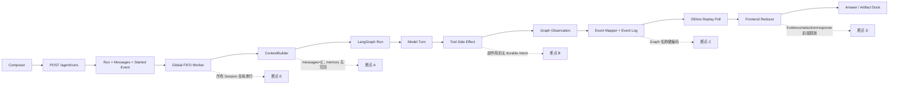
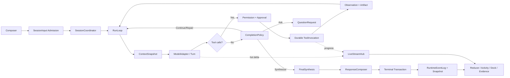

# DBFox Agent 全链路架构评审

> **历史文档，不是当前架构事实。**
> 本文记录 2026-07-19 Runtime 重建前的缺陷、v1.0.1/OpenCode 对照和决策理由。文中 `engine/agent_runtime`、LangGraph、旧测试路径和“尚未开发”结论均为当时证据，当前实现已发生变化。AI 不得用本文判断当前代码；现状见 [Agent Runtime](../architecture/agent-runtime.md) 与 [当前深度评审](./frontend-backend-agent-architecture-deep-review.md)。

历史状态：评审完成，当时尚未进入 Runtime 开发
历史结论：当时工作分支不满足发布条件，需要重建唯一 Agent Harness

关联文档：

- [能力资产清单](./agent-capability-inventory.md)
- [产品与运行规范](../specs/agent.md)
- [技术与交互设计](../designs/agent.md)
- [实施任务](../plans/agent.md)

## 1. 总结结论

当前分支并不是把 DBFox 的 ReAct 业务行为全部删掉了。Graph 内部仍然保留 model → policy → tools → observe → progress → repair/approval/answer 的主体，System Prompt 也基本保留了“主动探索、不要一次查询就结束、用证据回答”的设计。

真正断裂的是 Graph 外层 Harness：

1. 用户输入被原子创建为 Run，但没有成为可排序、可幂等、可 steer 的 SessionInput；
2. 每个 Run 以空消息开始，Session Memory 只有读取没有生产写回；
3. 工具先产生副作用，之后才通过 Graph chunk 写事件，没有 Durable ToolInvocation；
4. provider 的中间 stream 被 model node 聚合，产品只能较晚看到最终 answer delta；
5. Artifact 已存在，但 Evidence 使用 semantic ID，前端再用启发式猜真实工件；
6. 后端没有唯一 ResponseComposer，前端和 evaluation 分别重建最终响应；
7. `running` Run 在进程重启后被直接标记失败；
8. Supervisor 用一个全局线程串行所有 Session；
9. 产品 Activity 由 Graph 节点名、工具名和固定阶段推断，不是稳定领域事实。

所以正确方向不是恢复 v1.0.1，也不是给当前 v2 增加兼容层，而是：提取 v1.0.1 的产品闭环、当前分支的事务基础和 OpenCode 的显式循环，建立 DBFox 自己拥有的唯一 Runtime。

## 2. 当前链路与断点



### 2.1 上游：输入到 Session

当前 `AgentRuntimeCommandService.create_run` 已经能在一次事务内创建 Run、用户/助手消息和首事件，这是可保留的可靠性基础。

但 `desktop/src/stores/conversationStore.ts` 只发送 `recent_agent_run_id`，没有正式发送 `selected_artifact_ids`，也没有 queue/steer/cancel-and-replace/idempotency 语义。后端事件序列以 Run 为边界，不是 Session aggregate sequence。因此快速连续输入、重试请求和运行中追加目标都没有明确所有者。

### 2.2 Context 与记忆

`engine/agent_runtime/context_builder.py` 使用 `thread_id=run_id` 并设置 `messages=[]`。它会读取可选的 Session Memory，但 `AgentMemoryProjectionCoordinator.save_run_projection` 在生产 Runtime 中没有调用者，只有测试调用。

结果是：当前 Run 无法可靠看到真实对话历史；新完成 Run 也不会形成下一轮可用的 Session Memory。前端传一个 `recent_agent_run_id` 不能代替后端拥有的会话上下文和工件引用。

### 2.3 ReAct 与模型 Turn

Graph 的业务顺序本身仍有价值，但它把业务行为、框架 checkpoint、路由和产品事件绑在同一个 State 上。

`model_node.py` 虽然消费 provider stream，却先收集 `text_chunks` 再返回完整 AIMessage。只有 `answer_node.py` 通过 LangGraph stream writer 发最终答案 delta。用户看不到自然发生的 model/tool assembly，只能看到 Graph 完成某节点后映射出来的阶段。

新实现应保留 ReAct 行为，删除 Graph 作为运行所有者。每个 Turn 由 `ModelAdapter` 产生版本化 stream item，`TurnStreamAssembler` 组装 assistant text、reasoning summary 和 tool calls，RunLoop 决定下一步。

### 2.4 工具与副作用

当前 Tool Spec 体系是良好基础，但存在两个架构缺口：

- `ToolExecutionSpec.timeout_seconds/idempotent/retryable` 只是元数据，`ToolRuntime` 没有真正执行这些语义；
- runner 在工具执行完成后才从 Graph update 得知结果，没有在副作用前持久化 ToolInvocation intent。

因此进程可能在“数据库已执行、结算未落库”之间崩溃，重启后无法判断是否可重试。当前选择直接把所有 running Run 标记失败，是这个缺口的结果，不是恢复设计。

### 2.5 Approval 与普通提问

当前 Approval 的原子消费、Run version 和 datasource generation 检查正确，应保留。错误在恢复边界：approve 依赖 LangGraph Command/checkpoint；reject 直接取消整个 Run，Agent 无法收到拒绝 Observation 后改用更安全方案。

普通业务澄清没有 Durable QuestionRequest。缺少时间口径或指标定义时，Agent 只能完成一个“澄清回答”，下一条消息成为无正式恢复关系的新 Run。

### 2.6 Artifact、Evidence 与最终响应

Artifact 模型已经有 SQL、Safety、ResultView、Chart、dependency 和 payload reference，属于当前分支最值得保留的资产。

但 `finalize_node.py` 生成 Evidence 时优先选择 `semantic_id`，`MessageBubble.tsx` 再用 `artifact.id === evidence_id || artifact.semantic_id === evidence_id` 查找。Workspace 和 ArtifactDock 还分别使用“最新已执行 SQL/结果”启发式选择工件。这会造成：

- Evidence 可能打开错误版本；
- 修复前后同 semantic key 的工件无法精确区分；
- 找不到时 UI 错误显示“未执行查询”；
- 用户手动选择会被新的 latest 工件覆盖。

同时，生产后端没有唯一的 ResponseComposer。桌面端 `runtimeSnapshotToResponse` 和 evaluation `_response_from_durable` 各自组合旧 `AgentRunResponse`，终态 Answer、Evidence、Artifact、Message、Memory 和 Events 无法证明来自同一次原子提交。

### 2.7 事件、流式与刷新

当前 repository 将事件和部分 projection 同事务写入，是正确基础。但 API 用固定 200ms 轮询查 committed event；Event Mapper 依赖 `observe/progress/repair` 节点名、固定 phase 和工具名推断。

正确模型应分开：

- `LiveStreamHub`：热连接的 answer/reasoning summary/tool progress 低延迟通知；
- `RuntimeEventLog`：事务事实和断线 replay；
- `RuntimeEventProjector`：领域状态到公共协议的唯一映射；
- conversation snapshot：页面刷新无需重放全部历史。

SSE 应先建立通知订阅，再补 cursor gap；不能把数据库轮询当成实时流。

### 2.8 下游：持久化和恢复

当前 Run CAS、消息 sequence、Approval 原子消费、generation fence、事件事务写入都值得继承。但恢复只覆盖等待 Approval；运行中的 Run 在 `recover_interrupted_runs` 中统一变成 `AGENT_RUNTIME_INTERRUPTED_BY_RESTART`。

完整恢复必须根据持久边界决定：

- Turn 尚未发生外部副作用：可按预算重新开始 Turn；
- ToolInvocation 为 requested：可以领取执行；
- running 且工具 retry_safe：使用同一 idempotency key 重试；
- running 且 reconcile：先对账；
- never_retry 且结果不明：进入 unknown，要求明确处理；
- waiting_approval / waiting_input：保持等待，不占 worker；
- terminal：不得再次执行。

## 3. 优先级结论

### P0：发布阻断

| 编号 | 缺陷 | 用户影响 | 必须满足的修复结果 |
|---|---|---|---|
| P0-1 | running Run 重启后直接失败 | 打包客户端/引擎重启会丢任务连续性 | Turn/ToolInvocation 按 recovery policy 恢复或明确 unknown |
| P0-2 | 工具副作用前无 Durable ToolInvocation | 可能重复执行或永远无法判断结果 | intent → execute → settle，幂等和故障注入 |
| P0-3 | Session 历史为空且 Memory 无生产写回 | “继续刚才分析”不可靠 | 每 Turn 从持久 Session History/Artifact 构建 ContextSnapshot |
| P0-4 | 无唯一 ResponseComposer 和终态事务 | 回答、工件、证据、消息、记忆可能不一致 | 一个 backend composer，一次 terminal transaction |
| P0-5 | Evidence 使用 semantic ID，前端模糊匹配 | 结论可能指向错误证据 | 只接受真实 Artifact ID + locator |
| P0-6 | 一个全局 worker 串行所有会话 | 任一慢查询阻塞全产品 Agent | 同 Session 串行、不同 Session 有界并行 |

### P1：核心能力缺失

| 编号 | 缺陷 | 修复方向 |
|---|---|---|
| P1-1 | provider 中间 stream 被吞，SSE 固定 200ms 轮询 | ModelAdapter + TurnStreamAssembler + LiveStreamHub |
| P1-2 | Approval reject 直接取消 | 拒绝形成 Observation，Agent 可调整方案 |
| P1-3 | 无 SessionInput、幂等和 delivery mode | admission transaction + queue/steer/cancel-and-replace/respond |
| P1-4 | Event Mapper 硬编码 Graph 节点和工具阶段 | 领域 Activity/Event 的穷尽 projector |
| P1-5 | 前后端公共协议重复且前端 unchecked cast | 版本化 schema、Zod 校验和 fixture contract test |
| P1-6 | 无 Durable QuestionRequest | waiting_input、单次消费、原 Run 恢复 |
| P1-7 | ToolExecutionSpec 不执行其契约 | leaf executor 落实 timeout/retry/idempotency/output bound |
| P1-8 | 跨进程 Session 所有权没有 lease/fencing 设计 | 数据库 lease token + expiration；所有提交校验 token |

### P2：产品和维护性问题

| 编号 | 缺陷 | 修复方向 |
|---|---|---|
| P2-1 | 固定 RunPhaseStepper 和“调试细节”进入主产品 | 动态 Activity Feed，诊断面板独立 |
| P2-2 | Workspace/Dock 双重 latest 选择逻辑 | 后端 selection/suggestion，用户选择优先 |
| P2-3 | 重复 Agent 类型和两套 BaseTool 边界 | 收敛为稳定领域包和一个工具抽象 |
| P2-4 | Outbox 实际只承担运行事件日志 | 命名为 RuntimeEventLog；真正外发再建 Message Outbox |
| P2-5 | 终态删除 answer delta、保留策略不明确 | 定义 delta compact、结果 retention 和审计边界 |

## 4. 与 v1.0.1 的关系

v1.0.1 不是应恢复的 Runtime 实现，而是行为规格来源。

它比当前分支完整的部分：

- ResponseBuilder 和 Canvas/Message blocks 形成产品终态；
- memory projection 被接入完成路径；
- Graph thread 以 Session 维持多轮上下文；
- UI 能展示更完整的步骤、结果和工件。

它不应继承的部分：

- SSE generator 直接拥有执行，客户端断线影响 Run；
- event/memory persistence fail-open；
- Graph checkpoint 被当作主要恢复机制；
- Evidence 同样存在 semantic ID/前缀启发式；
- 请求生命周期、运行生命周期和持久化边界混在一起。

因此新 Harness 与 1.0.1 的联系是“行为等价或更完整”，区别是“状态所有权和可靠性由 DBFox 领域模型承担”。

## 5. 与 OpenCode 的关系

OpenCode 证明了不使用 LangGraph 仍能实现完整 ReAct：显式 `while` 循环、每轮读取消息、provider stream、动态工具物化、工具状态 part 和压缩后继续。

DBFox 应采用这些结构思想，但需要额外补上数据库产品特有能力：

- datasource generation 和只读/环境政策；
- Durable ToolInvocation 与数据库副作用对账；
- Artifact/Evidence 精确关系；
- Approval 与 QuestionRequest 的持久暂停；
- Session aggregate sequence 和 terminal transaction；
- 结果集外部存储、保留与失效规则。

LangGraph 不是因为“任何情况下都不好”而删除，而是因为本产品的关键状态已经必须由关系数据库、工具事务和 UI 协议共同拥有。继续让 Graph State 再拥有一份运行真相，会形成双 checkpoint、双事件和难以展开的恢复语义。

## 6. 完整目标链路



这条链路中，每个状态只有一个权威所有者：Session 决定输入顺序，RunLoop 决定执行，ToolInvocation 决定副作用，Artifact/Evidence 决定可解释结果，RuntimeEventLog 决定重放，LiveStreamHub 只负责低延迟通知，前端只做确定性投影。

## 7. 测试复核

本次执行：

```text
python -m pytest \
  engine/agent_runtime/tests/test_supervisor_recovery.py \
  engine/agent_runtime/tests/test_runner.py \
  engine/agent/tests/test_turn_node_memory.py -q

18 passed
```

测试通过不代表链路完整。现有测试主要验证当前实现的局部约定，其中“运行中重启后失败”本身也被当成合法恢复行为。缺少的验收包括：

- 进程在工具执行前、执行中、执行后结算前崩溃；
- 同 Session 并发输入与不同 Session 并行；
- 第二轮真正读取第一轮消息、Evidence 和选中 Artifact；
- terminal transaction 任意写入点回滚；
- provider delta 到 UI 的热路径延迟；
- 断线 gap replay 和 offset 去重；
- Approval reject 后 Agent 改用替代方案；
- QuestionRequest 刷新、重启、过期和重复回答；
- Evidence 精确定位修复前后的 Artifact 版本；
- 桌面和 Web 使用同一公共协议。

## 8. 开发准入结论

架构链路已经具备进入开发所需的状态所有者和边界定义，但不能按“先把所有后端基础类写完，再做前端”的水平分层方式实施。

第一条开发切片必须纵向打通：

```text
SessionInput
→ single-session RunLoop
→ schema/sql tool invocation
→ Observation
→ SQL/Safety/ResultView Artifact
→ Evidence
→ streaming Answer
→ terminal transaction
→ refresh snapshot
→ next-turn history/artifact reference
```

这条切片通过后，再扩展 Approval/Question、并发交付、故障恢复和最终删除旧边界。任何临时 Graph adapter、semantic ID fallback、前端 response composer 或双 Runtime 都不进入生产设计。
