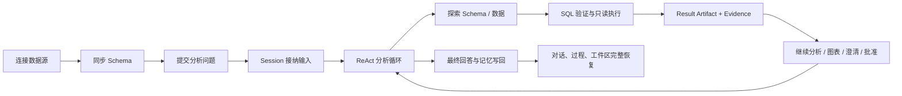
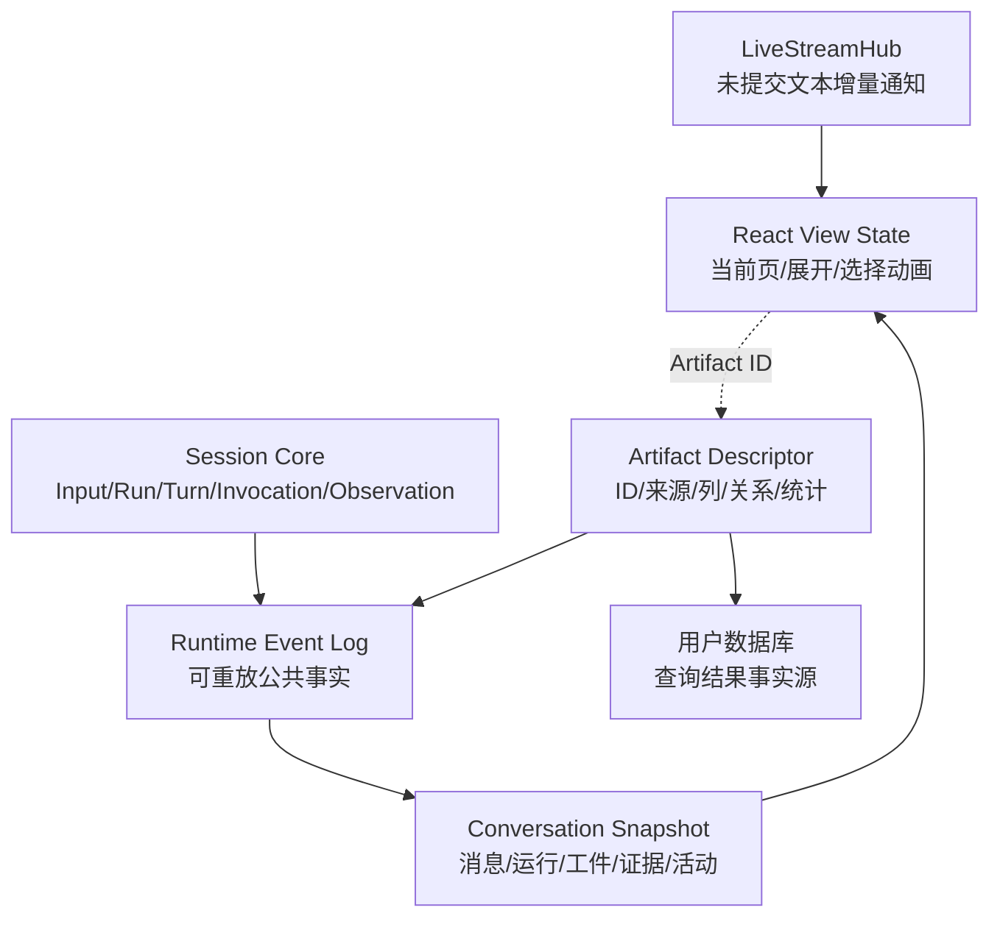

# DBFox Agent 产品系统地图（设计审查第一阶段）

> 日期：2026-07-19
> 范围：当前工作树中的 Agent 产品闭环、数据分析工具、工件与证据、流式交互、持久化与恢复
> 文档角色：产品概念地图。第二阶段取证与整改已完成；当前实现结论见 [深度评审](./frontend-backend-agent-architecture-deep-review.md)。本文中的模块职责仍有效，测试数字和完成状态以当前架构文档为准。

## 1. 产品核心问题

DBFox 不是“把自然语言翻译成一条 SQL”的聊天框，而是一个面向数据库分析的可持续 Agent：它要理解业务问题、探索数据库、验证查询、读取真实结果、继续挖掘、在必要时请求批准或澄清，并交付可解释、可恢复、可继续操作的回答、SQL、结果表、图表和证据。

产品成功必须同时成立：

1. 分析过程可观察，但不能泄露模型私有思维链或退化为调试日志。
2. 结果可解释，每个关键结论可以回到 Evidence、Artifact 和来源 SQL。
3. 工具有明确权限边界；危险动作必须暂停并等待 Approval。
4. Session 可持续，多轮输入会使用历史、记忆和用户选择的工件。
5. 页面刷新、断流或进程重启后，公共状态能够从持久事实恢复。
6. 查询结果采用 Reference-only 边界：结果行不进入 Artifact、Event、Memory 或前端全量缓存。

## 2. 主用户流程

核心业务流包括：

- 首次使用：引擎启动 → 数据源连接 → Schema 同步 → 模型配置 → 进入智能问数。
- 深入分析：问题接纳 → 数据库定向探索 → SQL 安全验证 → 只读执行 → 继续追问或多轮分析 → 证据化回答。
- 人机协作：运行中追加 queue/steer/cancel-and-replace 输入；需要业务信息时发起 Question；需要权限时发起 Approval。
- 工件操作：在对话中看到证据摘要，在右侧工件区查看 SQL、结果和图表；表格筛选、排序、分页和导出都通过 Artifact ID 回查。
- 恢复：刷新页面或 SSE 重连时先读取 Snapshot/Event Log，再接 LiveStream 通知，不依赖浏览器内存恢复事实。

## 3. 运行时与技术形态

- 桌面端：React + TypeScript + Zustand + Tauri。
- 本地引擎：FastAPI + SQLAlchemy + Alembic。
- Agent：自有显式 ReAct RunLoop，不使用 LangGraph。
- 模型：OpenAI-compatible 流式适配层；统一降级为 TurnStreamItem。
- 数据库访问：MySQL、PostgreSQL、SQLite、DuckDB 方言和连接资源边界。
- 持久化：本地元数据库保存 Session、Input、Run、Turn、ToolInvocation、Observation、Artifact、Evidence、Message、Event 和 Memory。
- 实时通道：持久 Runtime Event Log 负责事实重放，LiveStreamHub 负责低延迟增量通知。
- 外部资源：用户数据库、凭据保险库、模型提供商 HTTP API、本地文件/日志、桌面 sidecar 子进程和导出文件。

## 4. 模块地图与设计职责

| 模块 | 产品职责 | 主要实现边界 | 第二阶段需要核验的闭环 |
|---|---|---|---|
| 应用启动与引擎门禁 | 提供正常产品加载、失败重试和诊断入口 | `EngineStartupGate`、Tauri sidecar 生命周期、engine startup API | 打包路径、端口发现、健康检查、失败原因、客户端/Web 行为 |
| 数据源与凭据 | 建立受控连接，不把密码写入日志或普通配置 | datasource API、credential vault、connectivity profile/resources | 新建/修改/重连、generation fencing、连接池释放、错误脱敏 |
| Schema 与环境认知 | 给 Agent 提供可靠的数据库地图和可检索语义 | schema sync、catalog、FTS/AI index、environment tools | 未同步引导、过期识别、大库分页、跨 schema 同名对象 |
| 输入接纳 | 把用户输入原子写入 Session，而不是直接触发临时执行 | SessionRepository、SessionInput、Agent service/API | 幂等键、queue/steer/cancel-and-replace、重复提交、取消竞态 |
| Session 协调 | Session 内串行、Session 间并行，维护 lease 与 aggregate sequence | SessionCoordinator、lease、session repository | lease 超时、同会话双 worker、跨会话并行、选中工件状态 |
| AgentDefinition 与 Prompt | 固化分析师角色、工具边界、完成标准和版本 | AgentDefinition、PromptAssembler、system prompt | 深入分析是否持续、工具说明是否一致、版本是否可追溯 |
| Context 与记忆 | 组装当前问题、历史、选中工件和分层记忆 | ContextAssembler、Session memory、context epoch | L0-L4 是否各有所有者、是否写回、是否把结果行注入上下文 |
| 模型流式适配 | 规范化文本、过程摘要、工具调用和 usage 增量 | OpenAIModelAdapter、TurnStreamItem、TurnStreamAssembler | 首 token、乱序/重复 chunk、工具参数增量、provider 断流 |
| ReAct RunLoop | 根据模型输出反复决策、执行工具和判断完成 | RunLoop、CompletionPolicy、ResponseComposer | 多步循环、最大轮次、部分回答、错误修复、取消响应 |
| 工具注册与物化 | 每个 Turn 冻结可用工具版本和 schema | ToolRegistry、ToolMaterialization、tool specs | 注册唯一性、工具版本漂移、恢复时重用快照、动态扩展 |
| 权限与 Approval | 在叶子执行前再次检查权限并持久暂停 | PolicyGate、ToolInvocation、ApprovalRepository | 主动批准请求、批准后只执行原 invocation、拒绝、重复响应 |
| Question | 业务歧义无法从数据库解决时暂停并询问用户 | question.request、QuestionRepository、QuestionCard | Approval/Question 语义隔离、回答幂等、恢复原 Run |
| 数据分析工具组 | 环境认知、搜索、结构检查、样例读取、SQL 验证、只读执行和图表建议 | `db.*`、`schema.*`、`sql.*`、`chart.suggest` | 输入/输出 schema、状态消费、SQL 安全链、方言一致性 |
| 工具结算与恢复 | 先持久化意图，再执行叶子，最后幂等结算 Observation | ToolInvocationRepository、Observation、recovery policy | 每个崩溃点、不可重试工具、exactly-once 结算、事务边界 |
| Artifact | 保存可引用的产品交付物和关系，不保存结果行副本 | ArtifactRepository、Artifact relation、Artifact ID | SQL→Result→Chart 真实 ID、版本、关系方向、刷新恢复 |
| Result Gateway | 以 Artifact ID 验证来源 SQL，再分页、筛选、排序、导出或生成图表数据 | ResultViewService、artifact page/export/chart-data API | 指纹、generation、列白名单、派生 SQL、超时和数据变化语义 |
| Evidence | 将回答中的主张绑定到真实 Artifact/Locator | EvidenceRepository、ResponseComposer | claim 粒度、来源时间、真实 ID、删除/失效工件、UI 跳转 |
| 最终合成与记忆写回 | 生成有依据的回答，并原子完成 Message/Run/Evidence/Memory | ResponseComposer、RunRepository.complete | 原子性、部分结果、无证据声明、记忆污染、选中工件建议 |
| Runtime Event Log | 保存可重放公共事实，驱动 Snapshot 与前端 reducer | RuntimeEvent、EventRepository、Conversation projection | aggregate sequence、去重、事件映射唯一性、旧字段残留 |
| LiveStreamHub 与 SSE | 让首 token 和过程增量低延迟到达，断线后用 Event Log 补齐 | LiveStreamHub、commit notification、events/SSE API | replay+live 切换窗口、gap、背压、慢消费者、关闭语义 |
| 对话消息与过程体验 | 展示回答流式文字和产品级活动，而非调试 trace | MessageBubble、ActivityFeed、smoothed streaming text | reasoning summary、工具步骤状态、错误/取消、刷新后重建 |
| 工件区与证据交互 | 在右侧稳定选择和展开 SQL、Result、Chart；证据可跳转 | ArtifactDock、ArtifactEvidencePanel、conversation reducer | 后端选择权、关系分组、空/失效工件、窄屏和键盘可达性 |
| 结果表与图表 | 前端只持有当前页或当前图表序列；按 ID 请求后端 | TableArtifactView、ChartArtifactView、SQL-backed hooks | 当前页缓存边界、并发请求、取消、分页、聚合正确性、导出 |
| SQL 工作台 | 手工 SQL 也生成同一套 SQL/Safety/Result Artifact | SqlConsoleWorkspace、console execute API | 与 Agent 工件契约一致、错误显示、Session 归属、按需结果 |
| 诊断与可观测性 | 区分产品活动、运行诊断和安全审计 | Diagnostics、safe logging、evaluation/LangSmith adapter | 不泄露 SQL/密码/结果值、错误码、用户可操作原因 |
| 迁移、备份与恢复 | 维护元数据库契约，并安全处理旧持久数据 | Alembic、backup/restore、runtime reset | 升级/回滚、损坏数据、外部文件边界、Reference-only 清洗 |
| 测试、评测与发布 | 用契约、白盒、黑盒、故障注入和生产构建守住行为 | pytest、Vitest、lint、bundle budget、agent eval | Golden scenario、真实打包、性能基线、跨方言和失败注入 |

## 5. 状态所有权

设计上的所有权边界是：

- 用户数据库拥有结果行；Result Artifact 只保存可验证的查询引用和结构描述。
- Session Core 拥有运行状态；React 不自行推断 Run、Approval 或 Artifact 的权威状态。
- Runtime Event Log 拥有已提交的公共事实；LiveStreamHub 只加速未提交增量，不替代恢复事实源。
- Turn Buffer 可以短暂携带模型本轮需要看到的工具结果，但不得进入 Event、Memory、Snapshot 或 Artifact。
- 前端只缓存当前页和当前图表数据；刷新后通过 Artifact ID 重新读取。

## 6. 最需要保护的高风险路径

第二阶段将优先对以下路径做断点与符合性取证：

1. `输入接纳 → Session lease → Run 启动`：重复请求、并发 worker 或取消竞态可能产生双执行。
2. `sql.validate → approval → sql.execute_readonly`：任何状态串线都可能执行未批准或非当前 SQL。
3. `ToolInvocation requested → running → settled`：进程在任一提交点崩溃时，必须明确恢复或停止策略。
4. `SQL Artifact → Result Artifact → Result Gateway → Chart Artifact`：引用、指纹、datasource generation 或聚合不一致会让证据失真。
5. `最终回答 → Evidence → Message/Run/Memory`：必须在同一终态事务中完成，避免有回答无证据或记忆提前写入。
6. `Event replay → LiveStream`：切换窗口不得丢事件、重复活动或覆盖已提交回答。
7. `凭据 → 连接 → 日志/诊断`：密码、模型密钥、原始 SQL 和敏感结果不能进入不受控日志。
8. `迁移/备份/恢复`：不能重新引入已删除的结果行副本，也不能把外部数据库状态误当作元数据库快照。
9. `桌面打包 → sidecar 启动 → 端口发现`：开发环境通过但安装包无法启动会直接阻断全部产品能力。

## 7. 第二阶段审查输出

确认本系统地图后，第二阶段会逐模块给出：

- `符合 / 部分符合 / 不符合 / 尚无证据` 状态；
- 上游输入、核心处理、下游持久化和前端消费之间的断点；
- 确认缺陷与推测风险的分离；
- 文件、方法和行号证据；
- Top 3～5 高风险问题、完整 Defect Report；
- 白盒与黑盒测试矩阵；
- 不重写正确基础的安全修复顺序。
