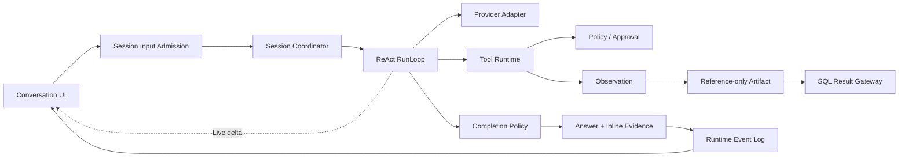

# DBFox Agent 系统验收审查

> 日期：2026-07-20（实施后订正）
> 审查对象：当前工作树的唯一 Agent Runtime、桌面对话产品、SQL-backed 工件、事件与恢复链路
> 结论：核心产品闭环已贯通；未发现会导致回答、证据、工件、批准或刷新恢复彼此失联的 P0 断点。

## 1. 最终架构判断

当前实现不是对 1.0.1 Runtime 的兼容封装，也不是继续维护旧 Graph。它继承了 1.0.1 中正确的产品能力——可见过程、工具驱动分析、证据、工件和数据分析师 Prompt——并以自有 Session/ReAct Runtime 重新建立权威边界。

与 OpenCode 的联系是 Harness 思想，而不是照搬代码：显式循环、工具注册与物化、事件驱动 UI、可中断输入、持久化事实与短暂实时增量。DBFox 保留自己的数据库安全链、Reference-only Artifact、Result Gateway、Datasource Generation 和分析覆盖审查。

## 2. 上游到下游逐段验收

| 链路 | 权威输入 | 权威输出 | 恢复方式 | 结论 |
|---|---|---|---|---|
| 输入接纳 | 用户消息、delivery mode、幂等键、选中 Artifact ID | SessionInput、User Message、Run、Assistant draft | Session aggregate sequence | 已闭环 |
| 调度 | admitted input、Session lease | Session 内单 Run 执行 | 启动扫描 admitted/running；lease fencing | 已闭环 |
| Context | 历史消息、已消费 steer/respond、选中工件引用、Observation、Session Memory | 不可变 ContextSnapshot + hash | 每 Turn 重建 | 已闭环 |
| 模型流 | Prompt、冻结工具 schema | text、公开 reasoning summary、tool-call parts、usage | 未结算 Turn 标记中断后新 Turn 继续 | 已闭环 |
| 工具请求 | provider arguments、冻结物化、PolicyGate | Durable ToolInvocation | 相同 invocation ID 按 recovery policy 结算或重试 | 已闭环 |
| 批准 | Policy 产生的 canonical safe args | Approval + waiting_approval | 版本化 resolve 后恢复原 Run | 已闭环 |
| 澄清 | 无法从数据库解决的业务口径 | QuestionRequest + waiting_input | 回答写成 Run 内 respond input | 已闭环 |
| 工具结算 | 叶子结果 | Durable Observation + TransientToolResult | Observation 唯一绑定 invocation | 已闭环 |
| 工件 | SQL、安全决策、查询描述符和关系 | SQL/Result/Chart Artifact | 按 ID 与关系重建 | 已闭环 |
| 数据读取 | Result Artifact ID + 页/筛选/排序参数 | 当前请求的短暂行数据 | 重新解析 SQL 来源并实时查询 | 已闭环 |
| 完成判断 | TaskPolicy、Observations、Result IDs、analysis.review、引用标记、预算 | continue/repair/synthesize/partial/fail | focus 写入 Run，下一 Turn 重建 | 已闭环 |
| 证据 | 最终回答中的受控 Artifact 引用 | claim-level Evidence + answer offsets | Snapshot 从 Evidence 表恢复 | 已闭环 |
| 终态提交 | AnswerCandidate、Artifacts、Evidence、Memory delta | Message/Run/Evidence/Memory/Event 原子提交 | 事务回滚，不产生半终态 | 已闭环 |
| 实时与刷新 | Event cursor + LiveStream delta | Zustand product projection | Snapshot → replay → live；gap 后重载 | 已闭环 |

## 3. Runtime 模块

### Session Core

- Session 是串行所有者；不同 Session 可并行。
- `queue` 创建后续 Run；`steer` 和 `respond` 只进入当前 Run；`cancel_and_replace` 先停止当前目标再接纳新目标。
- Context 只读取当前输入之前的历史与已消费的 Run 内补充，不会把排队中的未来问题泄漏给当前模型。
- Session lease token 阻止旧 worker 的迟到提交覆盖新 owner。

### ReAct Harness

- 循环为普通领域代码，不存在可配置 Graph 节点或 LangGraph thread/state/checkpoint。
- Provider finish signal 只是输入；Runtime 仍检查工具结算、任务类型、Result Artifact、分析覆盖和内联证据。
- 简单查值、Schema 问题和复杂分析使用不同完成约束；自然语言标记位于版本化 `AgentDefinition.TaskPolicy`，不是散落在节点中的流程分支。
- 复杂趋势、对比、异常、原因等任务必须调用 `analysis.review`，将动态目标绑定到真实 Result Artifact；它是覆盖审查能力，不是完成命令或固定工作流节点。

### Tool Runtime

- `BaseTool` 及其 input/output/policy/execution/state/artifact spec 是唯一工具定义。
- 每 Turn 固化 ToolMaterialization 与 hash，恢复时不会静默切到另一版本工具。
- Provider 原始参数先经过 Policy，持久 ToolInvocation、Approval 和实际叶子执行共用 `authorized_input` 与同一 hash。
- 结果行仅进入一次性 TransientToolResult；Durable Observation 只保存摘要、计数、指纹、Artifact ID 和错误。

### Dynamic Task Plan

- 复杂任务可通过 `plan.update` 创建或调整版本化 Plan；简单任务不被强制规划。
- step ID 稳定且唯一，同一 Plan 最多一个 `in_progress` step。
- `evidence_required` step 只有引用同 Session Artifact 后才能完成。
- Plan 通过 `plan.updated` 进入 Activity Feed；它是 ReAct 的产品投影，不是固定 Graph 或执行节点表。

### 中断与恢复

- waiting approval/input 是正式 Run 状态和独立实体，不依赖进程内 future。
- 只读幂等工具可使用同一 invocation ID 重试；不可证明结果的工具结算为 unknown，不猜测成功。
- 进程在模型流中退出时，旧 Turn 会被标记为 `MODEL_STREAM_INTERRUPTED`，半截回答被清除，Activity 留下恢复记录，再从新 Turn 继续。
- 取消、终态与恢复都受 Session lease 和版本约束。

## 4. Context 与记忆

| 层 | 当前所有者 | 保存内容 | 禁止内容 | 状态 |
|---|---|---|---|---|
| L0 Turn Buffer | TurnStreamAssembler、TransientObservationBuffer | delta、tool-call assembly、当前工具短暂结果 | 持久化结果行、私有思维链 | 完成 |
| L1 Run Working Memory | Run focus、Observation、ToolInvocation、Artifact refs | 当前缺失项、修复结果、预算与覆盖审查 | 任意结果行 | 完成 |
| L2 Session Memory | AgentSessionMemory + ContextEpoch | 最近 8 个 Run 摘要、working set、选中/引用工件、未解决问题 | 结果表、凭据 | 完成 |
| L3 Datasource/Workspace | Schema Catalog、AI Search、别名、可复用 SQL | 带 datasource/catalog/generation 的可检索知识 | 过期数据库事实直接注入 Prompt | 按需工具读取；未做全量预注入 |
| L4 User Preference | 产品设置 | 语言、展示、安全偏好 | 数据库事实与凭据 | 产品设置存在；尚未形成独立 Agent preference projection |

L3 采用按需工具读取是有意边界，可避免把大 Catalog 和旧事实塞入每轮上下文。L4 独立投影仍是后续增强，不影响本轮 Session 产品闭环，但不能宣称已经具备跨工作区长期用户记忆。

## 5. Artifact、Result 与 Evidence

### Reference-only Artifact

Result Artifact 只保存 SQL 来源引用、指纹、datasource generation、列描述、行数、耗时、执行时间和截断状态。它不保存 `rows`、`previewRows`、单元格或重复 `safeSql`。

Chart Artifact 只保存来源 Result Artifact ID 和展示规格，不复制 series。SQL 仅保存在 SQL Artifact，Result 通过 `derived_from` 关系引用。

### Result Gateway

客户端只发送目标 Artifact ID 与视图参数。后端解析 Result → SQL 关系，校验 Session、数据源 generation 和 query fingerprint，再执行分页、筛选、排序、导出或图表数据查询。当前页只存在组件状态，卸载后释放。

### Evidence

模型在具体数据库主张后输出 `{{cite:artifact_xxx}}`。后端只接受本 Run 已产生的 Result Artifact ID，删除伪造引用，并为每个引用创建独立 claim ID、Artifact ID、query fingerprint、observedAt 和回答字符区间。前端将标记渲染为句内编号按钮，点击选择右侧工件。

Evidence 是结论来源，不是结果缓存；需要查看值时仍通过 Result Gateway 重新查询。

## 6. 公共事件、流式与前端产品层

### 两条通道

- Runtime Event Log：事务内提交的公共事实，按 Session sequence 排序，可重放。
- LiveStreamHub：低延迟 answer/reasoning-summary/tool-progress delta，只负责通知，不是真相来源。

客户端恢复顺序为 Snapshot → cursor replay → live。SSE gap 或网络断开后重新加载 Snapshot，再从新 cursor 连接。终态、Approval 和 Question 会主动结束当前跟随；批准、拒绝或回答后重新跟随原 Run。

### Message Parts

Assistant Message 由有序 parts 投影：Activity、Error、Approval/Question、Answer、Inline Evidence、Artifact references。UI 不再根据零散字段并排猜测渲染顺序。

### Activity Feed

- 展示“理解问题、查找表、检查结构、验证 SQL、执行查询、复核覆盖、生成图表、恢复中断”等产品动作。
- 不展示 provider 私有 reasoning；只有显式公开 `reasoning_summary` 可进入 Activity。
- live 与 Snapshot 共用 `activity:{turn}:analysis` / `activity:{invocation}` 身份，刷新不会生成重复步骤。
- 默认显示当前动作，展开后显示时间线、状态、耗时、摘要和关联工件。
- 动画仅用于进行中的加载图标，并尊重 reduced-motion。

### Approval

待批准卡固定在 Composer 上方，显示风险、原因和 canonical SQL，可批准、拒绝、复制或进入 SQL 工作台。处理后在消息历史中变为只读审计卡，显示处理人、时间和备注。

## 7. Prompt 与可解释回答

- System Prompt 保留“主动探索、验证、继续挖掘、不要一次查询就停止”的数据分析师定位。
- Runtime Activity 负责过程展示；Prompt 不再要求把阶段旁白混入最终回答流。
- 禁止暴露私有 chain-of-thought；OpenAI adapter 只接受明确的公开 reasoning summary 字段。
- 数据事实必须使用本 Run 的 Result Artifact 内联引用；无 Result 的 Schema 或产品说明不伪造证据。

## 8. 持久化与评测

- Message、Run、Evidence、Memory 和 terminal Events 在同一事务完成。
- Artifact/Event/Observation/Turn/Memory 中均不允许持久化结果行。
- 同步评测走与产品 API 相同的 Session/RunLoop，不调用旧 Graph 或独立 harness。
- Golden Tasks 已改为当前 `direct/schema/lookup/analytical` 行为、正式工具名和 Reference-only 工件类型。
- 评测从公共 Runtime Events 读取工具、Approval、错误、恢复和阶段耗时，不再读取旧 `step`/`preview` 协议。
- Agent aggregate 写事务先取得 SQLite `BEGIN IMMEDIATE` writer reservation；lease、sequence、实体和 event 在同一短事务结算。
- SecurityAuditRecord 覆盖批准、拒绝、取消、导出和清理，保留 90 天/20,000 条；诊断导出限制为近 7 天/500 条，并递归剔除秘密与结果行。

## 9. 当前无断点，但仍需继续增强的边界

以下不是隐藏的兼容债务，也不阻断本轮闭环：

1. L4 User Preference 尚未形成独立、可审计、可失效的 Agent memory projection。
2. 长查询只有真实驱动/执行器进度时才显示百分比；当前 started/completed 不能用伪动画冒充进度。
3. Evidence 的 metric/dimension/cell locator 只能来自可验证工具输出，不能让模型自由编造。
4. 需要继续增加 Prompt Injection、crash point、cancel latency、Evidence coverage 和成本/质量联合评测。
5. 高权限 isolated-process backend、多 Provider Route 和远程 Web 都是条件能力，只有真实产品需求出现后才建立独立领域边界。

## 10. 验收证据

- Backend 最后一次完整回归：913 passed、2 skipped；随后审计确认专项 9 passed。
- Frontend 最后一次完整回归：76 files / 411 tests passed；随后诊断 API 专项 5 passed。
- mypy：277 个 Python source files、0 issues。
- TypeScript、ESLint、production build 与 bundle budget：通过。
- Alembic 单一 head：`e9f0a1b2c3d4`。
- 架构合同禁止 `langgraph`、旧 Agent Runtime import、durable result rows、非官方 npm registry 和 CSP 违规动态样式。
- Rust metadata 与 format 通过；本机 GNU 环境不能替代 Windows MSVC 的最终 Tauri/Clippy/test 发布证据。

本轮最终判断：主链路已经从“模型调用能跑”提升为“过程可观察、结果可解释、权限可暂停、状态可恢复、数据不越界”的产品 Runtime。后续工作应围绕上述五项增强继续，而不再引入第二套 Runtime、旧字段读取或前端启发式兼容。
