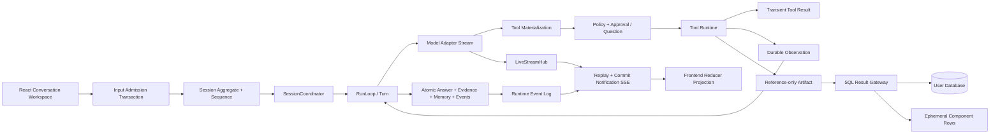

# DBFox 前后端与 Agent 架构逐项全局核验

> 说明：第 0–10 节保留 2026-07-20 修复前的核验基线，便于追溯问题来源；修复后的权威状态见第 11 节，不能再以第 8 节的旧测试结果判断当前工作树。

> 给后续 AI：如果目标是评价当前架构，应先阅读 [当前系统架构](../architecture-design-document.md) 和 [当前深度评审](./frontend-backend-agent-architecture-deep-review.md)，再使用本文第 11 节核对关闭记录；第 0–10 节只用于缺陷溯源。

> 核验日期：2026-07-20
> 核验分支：`codex/llm-call-interface`
> 对照基线：工作区当前实现、测试、CI 契约与《DBFox 前后端与 Agent 架构深度评审》
> 核验性质：只读架构与软件构造评审；本报告未修改产品实现

## 0. 结论先行

DBFox 当前已经形成一条真实可运行的 Agent 产品链路，不是“聊天 UI + 单次 SQL 工具”的原型：输入 Admission、Session 串行调度、Run/Turn、模型流、工具物化、Approval、Observation、Reference-only Artifact、Evidence、Answer、Session Memory、Event replay 和前端投影均有实际代码与测试。

但当前还不能判定为“可无条件打包发布”。最重要的问题不是缺少页面或类型，而是若干声明出来的运行时约束没有被真正执行：

1. SQLite 下的 `SELECT ... FOR UPDATE` 被方言编译器静默移除，Session aggregate sequence、lease claim、Approval resolve 等并没有真正获得行锁；当前也没有统一 single-writer。
2. `RunLimits` 中的总超时、token、费用、provider retry、repair budget 没有进入执行控制；`ToolExecutionSpec` 的超时、重试、并发也没有被 `ToolRuntime` 执行。
3. Result Artifact 的引用式数据边界已经正确，但打开历史 Result 时重新执行 SQL，产品仍没有明确区分“原始证据事实”和“当前实时结果”。
4. 取消、Live/Committed correlation、Result 请求取消仍只完成了部分链路。
5. 当前工作区存在两个已经由自动化测试证实的发布阻断：虚拟列表使用内联 style 违反 CSP 契约；49 个 npm lock 条目来自 `registry.npmmirror.com`，违反锁文件来源策略。

因此，外部评审中“链路完全缺失”的判断不成立；更准确的结论是：**产品闭环已建立，关键执行约束和历史语义仍未闭合。**

本报告对原文中的部署、前端、后端、Agent、数据流、横切能力、技术栈和 15 项待补信息形成 97 条带状态记录：25 条符合、51 条部分符合、20 条不符合、1 条不适用。这里的“部分符合”严格表示已有可验证实现但仍存在边界缺口，不与“尚未实现”混用。

## 1. 核验范围、方法与证据等级

### 1.1 原始文档完整性

原始附件已完整保存为 [frontend-backend-agent-architecture-deep-review.md](./frontend-backend-agent-architecture-deep-review.md)。保存副本与附件在统一换行为 LF 后逐字一致，共 1032 行；完整的 `## 4. Agent 架构` 位于保存副本第 441 行。本文核验对象是这份完整原文，不使用聊天窗口预览或工具输出中的截断片段作为事实来源。

### 1.2 状态定义

| 状态 | 定义 |
|---|---|
| 符合 | 当前代码、测试或 CI 已兑现该要求，未发现关键断点 |
| 部分符合 | 主体已实现，但边界、恢复、产品语义或测试仍不完整 |
| 不符合 | 当前实现明确缺失，或声明与执行不一致 |
| 不适用 | 属于已接受的产品约束，不是当前缺陷 |

### 1.3 证据等级

- A：当前源代码与自动化测试共同证明。
- B：当前源代码证明，但缺少边界/故障测试。
- C：文档或配置声明，运行时没有充分证明。
- D：搜索未发现实现，或测试已证明不满足。

## 2. 项目整体理解与核心路径地图

核心状态所有权基本正确：SQLite 元数据库是 durable truth，LiveStreamHub 只承载短暂增量，前端 Store 是可重建投影，结果行只在 Result Gateway 响应与组件状态中短暂存在。

## 3. 逐项符合性矩阵

### 3.1 整体架构与部署拓扑

| ID | 原评审关注项 | 状态 | 证据与全局结论 |
|---|---|---|---|
| DEP-01 | Python sidecar 是单个可用性单元 | 部分符合 | Tauri 负责启动、健康检查、重启和诊断，但 Engine 仍是单进程可用性单元；符合 local-first 取舍，不具备进程内故障隔离。证据 B：`desktop/src-tauri/src/lib.rs`、`engine/main.py`。 |
| DEP-02 | Agent 可能阻塞 FastAPI 事件循环 | 符合 | `SessionCoordinator` 使用 `ThreadPoolExecutor`，Agent 不在请求协程内长时间运行；API Admission 立即返回。证据 A：`engine/agent/coordinator.py` 与 coordinator/API tests。 |
| DEP-03 | 进程内调度拓扑不明确 | 符合 | 默认 4 worker、同 Session drain 串行、Session 间并行、TTL 120 秒、TTL/3 heartbeat、启动恢复扫描均有实现和测试。证据 A。 |
| DEP-04 | Web 模式边界容易误解 | 部分符合 | 开发服务仅绑定 loopback，生产 frozen 关闭 API docs；但没有一个不可误解的产品能力声明说明 Web 仅为开发/诊断。证据 B。 |
| DEP-05 | Runtime Event Log 与 LiveStreamHub 双源竞态 | 部分符合 | 服务端先订阅 commit/live 再 replay，committed 事件有单调 sequence；但 Live delta 没有独立 live ID/revision，前端未使用 offset 去重。证据 A/B。 |

### 3.2 前端架构

| ID | 原评审关注项 | 状态 | 证据与全局结论 |
|---|---|---|---|
| FE-01 | 状态管理技术与约束未说明 | 符合 | 使用 Zustand，Conversation 以实体索引 + 纯 reducer 投影，Workspace/Datasource 分 Store；结果行不进入 Conversation Store。证据 A。 |
| FE-02 | URL 与 Workspace Store 可能形成双事实源 | 部分符合 | 桌面工作区主要由 Store 驱动，没有完整可分享/恢复的 URL 模型；当前没有明显双写竞态，但 deep-link 与导航所有权未形成正式契约。证据 B。 |
| FE-03 | 流式 token 导致高频重渲染 | 符合 | SSE event 通过 `createStreamEventBatcher` 按 animation frame 批处理后一次 reducer 更新。证据 A。 |
| FE-04 | 长会话缺少虚拟化 | 部分符合 | 50 条以上启用 TanStack Virtual；但实现使用 JSX inline style，当前 CSP 合同测试失败，因此功能存在但违反安全架构。证据 A/D。 |
| FE-05 | Markdown、原始 HTML、链接有 XSS 风险 | 符合 | `react-markdown + remark-gfm + rehype-sanitize`，图片禁用，外链使用 `noopener noreferrer`，外部导航和 `javascript:` 有测试。`rehypeRaw` 可进一步移除以缩小攻击面。证据 A。 |
| FE-06 | Engine token 的前端存储策略 | 符合 | token 由 Tauri runtime config 注入，只保存在模块内存；未进入 localStorage/IndexedDB。证据 A。 |
| FE-07 | datasource generation 跨 Store 同步 | 部分符合 | Datasource schema cache key 包含 generation，Result Gateway 强制 generation fence；Conversation 旧工件不会被前端主动标记 stale，只会在打开时收到 409。证据 A/B。 |

### 3.3 后端架构

| ID | 原评审关注项 | 状态 | 证据与全局结论 |
|---|---|---|---|
| BE-01 | SQLite 并发写与 single-writer | 不符合 | WAL、busy timeout、索引已配置，但 Session Repository 依赖 `with_for_update()`；实际 SQLite SQL 编译结果不含锁子句，也没有统一 `BEGIN IMMEDIATE`/writer queue。证据 A/D。 |
| BE-02 | Result Gateway 历史一致性 | 不符合 | Gateway 正确按 Artifact ID 找 SQL、校验 fingerprint/generation 并重新执行；响应没有 `consistency`、original/view execution time 或 execution ID，无法表达“历史结论 vs 当前数据”。证据 A/D。 |
| BE-03 | 完整认证授权模型 | 部分符合 | local mode 有随机 bearer token、Origin/Referer、loopback、frozen 限制；没有用户/角色/数据源级授权，符合当前单用户桌面范围，但不能直接外推到生产 Web。证据 A。 |
| BE-04 | Runtime Event Log 不等于安全审计 | 部分符合 | QueryHistory、Approval、Backup restore 各自有记录；没有覆盖凭据变更、导出、reset、权限决策的统一 security audit schema、retention 和查询入口。证据 B/D。 |
| BE-05 | 缺少统一重试、熔断、限流 | 部分符合 | 输入大小、连接池、SQL timeout/取消等局部存在；Model/Tool 的声明式 retry/budget 没有执行，provider 无 conformance 级熔断/配额。证据 A/D。 |
| BE-06 | 分页注入与性能 | 部分符合 | sqlglot AST、来源列 allowlist 和派生 SQL 二次校验阻断直接注入；仍使用 OFFSET，且来源查询无排序时未强制确定性排序。证据 A/B。 |
| BE-07 | Metadata schema、索引、唯一约束 | 符合 | Session sequence、event sequence、input idempotency、tool invocation、Observation 等关键唯一约束和索引已存在，WAL/busy timeout 已配置。证据 A。 |

### 3.4 Agent Runtime 与 Harness

以下条目同时覆盖原文 Agent 章节的 8 项优点、10 项风险以及对应改进建议；重复关注点合并到同一个可验证结论中。

| ID | 原评审关注项 | 状态 | 证据与全局结论 |
|---|---|---|---|
| AG-01 | ReAct/Harness 是否形成完整循环 | 符合 | RunLoop 实现 prepare → model stream → tool request/execute → observation → completion/repair → terminal；不是 LangGraph 节点壳。证据 A。 |
| AG-02 | Run/Turn/Tool/Approval 状态持久化与恢复 | 符合 | interrupted Turn 和 ToolInvocation 有恢复路径，waiting 状态持久化，Session 启动扫描存在。证据 A。 |
| AG-03 | Run 总超时、token、cost、provider retry、repair budget | 不符合 | `RunLimits` 定义了这些字段，但 RunLoop 只执行 `max_turns` 和 `max_tool_invocations`；OpenAI client 固定 120 秒、`max_retries=0`。证据 A/D。 |
| AG-04 | ToolExecutionSpec timeout/retry/concurrency | 不符合 | ToolRuntime 直接同步调用 `tool.run()`，没有读取或执行 `timeout_seconds`、`retryable`、`max_retries`、`concurrency`。证据 A/D。 |
| AG-05 | Tool sandbox/capability/网络/文件/subprocess 隔离 | 不符合 | 当前内置工具以数据库只读为主，PolicyGate 会复核 Approval；但运行时没有 capability sandbox、网络出口、文件根或子进程执行器。扩展高风险工具时边界不成立。证据 B/D。 |
| AG-06 | Prompt Injection 分层防护 | 部分符合 | Prompt 明确将 DB/工具/Memory 标为不可信，工具调用只接受结构化 call，Policy 在 leaf 前重检，Observation 有截断/脱敏；缺少 capability sandbox、输出分类器和 injection 评测语料。证据 A/B。 |
| AG-07 | Approval 展示是否足够可授权 | 部分符合 | Approval 有稳定实体、版本冲突、risk、reason、SQL、审计卡；UI 未稳定展示 datasource、canonical hash、参数摘要和影响范围。证据 A/D。 |
| AG-08 | Completion/幻觉控制 | 部分符合 | 分析任务要求 `analysis.review`，Evidence/Result 是完成条件；未对 claim-locator、查询时态、矛盾证据做系统验证。证据 A/B。 |
| AG-09 | Session Memory 治理 | 部分符合 | 只保留最近 8 个 run、摘要、引用 ID 和 working set，不写结果行；stable context 缺少来源、置信度、过期时间和独立大小预算。证据 A/B。 |
| AG-10 | Agent 产品可观测性与评测 | 部分符合 | Activity、公开 reasoning summary、tool stages、Eval runner/golden tasks 已有；预算、费用、provider conformance、prompt injection、恢复路径指标不完整。证据 A/B。 |
| AG-11 | 复杂任务的显式 Task Plan | 不符合 | CompletionPolicy 会记录 focus/missing，但没有版本化 objective、steps、evidenceRequired、completionCheck，也没有 Plan 状态投影。证据 B/D。 |
| AG-12 | 防循环与“无进展”不变量 | 部分符合 | max turns/max tools 能最终截断循环；没有最近 N 次 canonical input/SQL/Observation/plan hash 检测，也没有连续无进展阈值。证据 A/D。 |
| AG-13 | 模型选择、路由与降级 | 不符合 | 只有 OpenAI-compatible adapter 与用户选定配置；无主备路由、能力探测、provider failover、按任务分工。证据 A/D。 |
| AG-14 | Prompt 与 Turn 运行指纹 | 部分符合 | AgentDefinition 有 hash，Context Snapshot 和 Tool Materialization 有冻结边界；未形成包含 prompt/completion/safety/provider/memory retrieval 版本的统一 TurnFingerprint。证据 A/B。 |
| AG-15 | 工具物化与版本冻结 | 符合 | 每个 Turn 固化可见工具和 schema/hash，leaf 前使用冻结 canonical input 与授权输入复核，恢复不会直接相信新的模型参数。证据 A。 |
| AG-16 | ToolInvocation `unknown` 状态 | 符合 | 对崩溃后无法证明结算结果的执行保留 unknown/recovery 语义，避免把不确定副作用自动重放成第二次执行。证据 A。 |
| AG-17 | L0-L4 分层记忆边界 | 部分符合 | Turn/Run/Session/Schema/偏好在代码中有不同载体，结果行和凭据不进持久记忆；尚未形成统一 L0-L4 实体、TTL、provenance、用户查看/删除治理。证据 A/B。 |
| AG-18 | 不强行为结构化数据引入 Vector RAG | 符合 | 当前以 Schema catalog、SQL、Artifact 引用和明确检索工具为主，没有把向量库当成 Agent 必选依赖；符合产品数据形态。证据 B。 |
| AG-19 | Session lease 与 fencing | 部分符合 | lease token、heartbeat、旧 worker fencing 和重启扫描真实存在；但 SQLite 聚合事务没有真实行锁，claim/sequence 的并发前提仍需 single-writer 闭合。证据 A/D。 |
| AG-20 | Provider finish signal 不直接决定完成 | 符合 | model finish 后仍由 CompletionPolicy 检查工具、Evidence、Result、coverage review 和 partial/fail；模型不能单独宣布成功。证据 A。 |

### 3.5 数据流与系统集成

| ID | 原评审关注项 | 状态 | 证据与全局结论 |
|---|---|---|---|
| FLOW-01 | Snapshot、Replay、Live 切换窗口 | 符合 | 服务端先订阅再 replay durable events，以 cursor 拉平竞态；客户端支持 `Last-Event-ID`、snapshot reload 和指数退避。证据 A。 |
| FLOW-02 | Live 与 committed identity | 部分符合 | committed 用 sequence 去重，answer/analysis 由稳定 run/turn ID 最终覆盖；live offset 没进入前端去重，也没有统一 correlation/revision 协议。证据 A/B。 |
| FLOW-03 | LLM 重试导致重复工具调用 | 部分符合 | ToolInvocation 有稳定 ID、provider call/idempotency 唯一约束和恢复状态；provider retry 尚未真正实现，也缺少“流中断后同 tool call”故障注入。证据 A/B。 |
| FLOW-04 | 取消贯穿全链路 | 部分符合 | UI/SSE AbortController、Run cancelling、QueryRegistry 和部分驱动中断存在；RunLoop 只在 Turn 之间检查，模型流和通用 ToolRuntime 没有 cancel token。证据 A/D。 |
| FLOW-05 | Result 分页请求风暴 | 部分符合 | hook 用 request sequence 做 latest-wins，旧响应不会覆盖新状态；旧网络/数据库请求没有 AbortController，仍消耗后端资源。证据 A/D。 |
| FLOW-06 | generation 跨 Store/Runtime/Gateway | 部分符合 | Run 固化 generation、Datasource cache fencing、Gateway 409 均存在；前端缺少统一 stale 投影和主动失效事件。证据 A/B。 |
| FLOW-07 | Observation 成为隐性结果副本 | 符合 | TransientToolResult 与 DurableObservation 已拆分，durable facts 只存摘要/计数/Artifact ID，敏感行边界有测试；Context 只注入引用。证据 A。 |
| FLOW-08 | Terminal Answer/Evidence/Memory/Event 原子性 | 符合 | `RunRepository.complete()` 在同一 DB transaction 中写 Evidence、Answer message、Memory、Run terminal state 和 events，调用者一次 commit；有 terminal transaction 测试。证据 A。 |
| FLOW-09 | Reference-only Artifact + Result Gateway | 符合 | Result 仅存 SQL Artifact 引用、fingerprint、generation、列与统计；分页 API 输入只含 Artifact ID 和视图参数；行只在组件 state。证据 A。 |

### 3.6 安全性

| ID | 原评审风险 | 状态 | 证据与全局结论 |
|---|---|---|---|
| SEC-01 | 恶意网页访问 localhost API | 符合 | Engine 仅 loopback，随机 token 使用 constant-time compare，Origin/Referer 严格校验，CORS 非 wildcard。证据 A。 |
| SEC-02 | token 被前端存储或日志泄露 | 符合 | token 只在进程内存和 Tauri/Engine 私有启动边界，未进入持久化 Store；safe logging 有契约测试。证据 A。 |
| SEC-03 | 数据库内容 Prompt Injection | 部分符合 | 有 untrusted prompt 分区、结构化 tool call 和 Policy recheck；缺少专用红队语料与 capability executor。证据 A/B。 |
| SEC-04 | 高权限数据库账号扩大误操作 | 部分符合 | 默认分析工具和 Result Gateway 是只读安全链，UI 支持只读模式；无法强制远端账号最小权限或 schema allowlist。证据 B。 |
| SEC-05 | SQL parser 多方言/边界覆盖 | 部分符合 | sqlglot、方言上下文、guardrail/trust tests 较完整；存储过程、厂商扩展和未来方言仍需 corpus/conformance。证据 A/B。 |
| SEC-06 | Approval 隐藏参数或上下文 | 部分符合 | 当前展示 risk/reason/SQL，但没有稳定展示 datasource、hash、参数摘要、影响范围。证据 A/D。 |
| SEC-07 | 恶意/超大 Tool output 与 Markdown | 部分符合 | Observation 有大小上限和脱敏，Markdown sanitize，图片禁用；ToolRuntime 没有通用 `maxOutputBytes` enforcement。证据 A/D。 |
| SEC-08 | CSP 与外部导航 | 不符合 | CSP 和外部导航基础设计存在，但当前 `MessageList.tsx` 的 inline style 使 CSP 合同测试明确失败。证据 D。 |

### 3.7 性能与扩展性

| ID | 原评审风险 | 状态 | 证据与全局结论 |
|---|---|---|---|
| PERF-01 | SQLite 写锁竞争 | 不符合 | WAL 只改善读写并发，不能替代 single-writer；聚合写入的行锁假设在 SQLite 无效。证据 A/D。 |
| PERF-02 | Event Log 长期增长 | 不符合 | Snapshot 是按需投影，但没有找到 event retention、归档或 compaction job/policy。证据 D。 |
| PERF-03 | Context 与历史摘要膨胀 | 部分符合 | recent runs 限 8、Observation 有界、Schema 按需；stable context 和长期事件仍无总容量治理。证据 A/B。 |
| PERF-04 | Result Gateway 对大表反复执行 | 部分符合 | 不缓存原始行是正确边界，导出流式；缺少 datasource/result 级并发配额、请求 abort 和明确实时执行成本提示。证据 A/B。 |
| PERF-05 | sidecar 冷启动 | 部分符合 | metadata 初始化和 migration 在启动，模型与数据源连接按需；有 health gate/诊断，但缺少持续冷启动基准与分阶段指标。证据 B。 |
| PERF-06 | SQL Console/Agent/Result 争用连接池 | 部分符合 | 全局 PoolRegistry 有池数/连接总量和 LRU；没有按工作负载隔离或 per-datasource/session/provider 分层配额。证据 A/B。 |
| PERF-07 | 前端 bundle 与长列表 | 部分符合 | 长列表虚拟化、Chart lazy chunk、bundle budget 均存在；当前 CSP 回归阻断虚拟化方案上线。证据 A/D。 |

### 3.8 可维护性与测试

| ID | 原评审建议 | 状态 | 证据与全局结论 |
|---|---|---|---|
| TEST-01 | 领域状态机、lease、幂等测试 | 符合 | Session/Run/Approval/Question/Tool repositories 与 coordinator 均有测试；仍应增加真实 SQLite 并发 writer 测试。证据 A。 |
| TEST-02 | 五类事务故障注入 | 部分符合 | Terminal transaction、恢复、runtime reset 有测试；缺少逐 commit point 的进程 kill/restart 矩阵。证据 A/B。 |
| TEST-03 | 后端投影与前端 reducer 同序列一致 | 部分符合 | 两端各有 projection/reducer tests；没有共享同一 golden event fixture 的跨语言等价测试。证据 A/B。 |
| TEST-04 | OpenAPI/TS client 与 SSE schema 契约 | 部分符合 | 有手写 TS 类型、frontend contract、event protocol version；没有 OpenAPI 自动生成 client 和 breaking-change gate。证据 A/B。 |
| TEST-05 | SQL 安全绕过测试 | 符合 | guardrail、trust gate、derived SQL、readonly execution、方言和 white-box 测试覆盖较强。证据 A。 |
| TEST-06 | Agent 行为评测 | 部分符合 | GoldenTask、Eval runner/API、SQL/工具/Artifact/Approval 评分已存在；缺 prompt injection、费用、取消和恢复维度。证据 A/B。 |
| TEST-07 | Tauri/sidecar 故障 E2E | 部分符合 | 有 startup、build sidecar、诊断和部分 Playwright 工作；未看到 CI 中覆盖睡眠恢复、Keyring 锁定、sidecar crash/upgrade 的完整真实桌面矩阵。证据 B/D。 |
| TEST-08 | 当前工程门禁 | 不符合 | 本次选定后端 176 通过/1 失败，前端 38 通过/1 失败；lint/build 通过。失败均为架构合同，不是偶发业务断言。证据 D。 |

### 3.9 容灾与降级

| ID | 原评审缺口 | 状态 | 证据与全局结论 |
|---|---|---|---|
| DR-01 | Agent/LLM 不可用时产品行为 | 部分符合 | SQL Console、Datasource、Artifact 等不是由 Agent gate 全局阻断；Agent 内可以保留已完成 Activity，但缺少统一 degraded 状态与明确产品说明。证据 B。 |
| DR-02 | Event Log/SQLite 损坏和备份不兼容 | 部分符合 | migration、backup/restore、runtime reset、checksum/generation fence 存在；没有 event-log integrity/repair/compaction 策略。证据 A/B。 |
| DR-03 | LiveStreamHub/SSE 不可用降级 | 不符合 | 当前只有 SSE reconnect + snapshot reload，没有低频 cursor long-poll transport fallback。证据 A/D。 |
| DR-04 | Metadata backup 与 Vault 引用恢复 | 部分符合 | Vault 引用和 metadata 分离且 fail-closed，UI 有 `needs_credentials`；Backup manifest 未完整记录 credential reference 清单与恢复诊断。证据 B。 |
| DR-05 | 诊断包脱敏与用户可见 | 部分符合 | safe error/logging、诊断日志入口存在；缺统一 correlation ID 与可预览的诊断包导出。证据 A/B。 |

### 3.10 技术栈、供应链与演进

| ID | 原评审风险/建议 | 状态 | 证据与全局结论 |
|---|---|---|---|
| TECH-01 | 三语言栈提高团队要求 | 不适用 | 这是 Tauri + Python AI/DB Engine 的显式成本；边界已经集中在 Tauri Host、HTTP/SSE contract，当前无需为减少语言数重写。 |
| TECH-02 | 自研 Runtime 长期维护成本 | 部分符合 | Runtime 职责聚焦 DBFox Run/Turn/Tool/Evidence，没有发展通用 Graph DSL；但预算、sandbox、恢复测试仍需团队持续承担。证据 A/B。 |
| TECH-03 | OpenAI-compatible 不真正统一 | 不符合 | 有统一 adapter 和单 provider 单元测试，但没有 provider conformance suite、路由/降级策略和多端点契约矩阵。证据 A/D。 |
| TECH-04 | Tauri/Keyring 跨平台差异 | 部分符合 | Rust 代码有 Windows/macOS/Linux 分支、Linux sidecar CI 证据；缺签名、Keyring、SSH、安装升级的正式发布矩阵。证据 B。 |
| TECH-05 | SBOM 与 License Gate | 不符合 | CI 有 OSV/npm audit/cargo-audit，但未找到可执行 SBOM 和 license gate；当前 lockfile 还有 49 个镜像源条目并导致 engineering contract 失败。证据 A/D。 |
| TECH-06 | 未来服务端化成本 | 部分符合 | Repository、Publisher、Credential Provider 边界有替换空间；SQLite、进程内 Live hub 和 local token 明确绑定单机语义，服务端化必须是独立里程碑。证据 B。 |

### 3.11 原文“文档需要补充的信息”15 项复核

| ID | 原文待补充项 | 状态 | 当前答案 |
|---|---|---|---|
| DOC-01 | SQLite 表结构、索引、WAL、single-writer | 部分符合 | 表/索引/WAL 已实现；single-writer 未实现，`FOR UPDATE` 在 SQLite 无效。 |
| DOC-02 | lease TTL、续约、fencing、重启扫描 | 符合 | TTL 120s、TTL/3 heartbeat、token fencing、recoverable session scan 均存在。 |
| DOC-03 | SSE handshake、heartbeat、cursor、去重 | 部分符合 | cursor/Last-Event-ID/15s heartbeat/replay handshake 已有；live offset 前端去重与统一 correlation 缺失。 |
| DOC-04 | API token 生命周期与 Origin/CORS | 符合 | 随机生成、Tauri 传递、内存保存、constant-time 校验、loopback origin 均明确。没有在线轮换，但进程重启轮换符合桌面模式。 |
| DOC-05 | Agent Worker 线程/进程/并发 | 符合 | 同进程线程池；同 Session 串行、Session 间并行。 |
| DOC-06 | Model route/fallback/retry/budget | 不符合 | 单 OpenAI-compatible adapter；Run 声明预算没有完整执行，无 conformance/fallback。 |
| DOC-07 | Tool sandbox/网络/文件/subprocess | 不符合 | Policy/Approval 有，capability executor 与 OS 级隔离没有。 |
| DOC-08 | Durable Observation 数据分类 | 符合 | durable 只存摘要/计数/指纹/Artifact ID，结果行保持 transient；有敏感值边界测试。 |
| DOC-09 | Result 历史一致性承诺 | 不符合 | 目前只提供实时重新执行，未在协议/UI 区分时态与可复现性。 |
| DOC-10 | Event retention/Snapshot/compaction | 不符合 | Snapshot projection 有；retention/compaction 没有。 |
| DOC-11 | 审计日志结构与保留期 | 不符合 | 只有分散领域记录，无统一 security audit/retention。 |
| DOC-12 | 端到端取消 | 部分符合 | Run/SQL/SSE 有取消；模型流和通用工具缺 cancel token。 |
| DOC-13 | Agent 自动化评测基准 | 部分符合 | Eval runner/golden tasks 已有；安全、费用、恢复、取消维度不足。 |
| DOC-14 | Web 是否永远只用于开发 | 部分符合 | 当前实现明确 loopback/dev，但产品路线文档未作不可误解的永久/阶段性声明。 |
| DOC-15 | License 与跨平台矩阵 | 不符合 | 漏洞扫描存在；SBOM/license gate 和完整发布矩阵不存在。 |

## 4. 软件构造与可读性亮点

1. **状态所有权清晰。** Durable truth、live notification、frontend projection、ephemeral result rows 的边界已经落实到类型和代码，而不是只写在设计文档。
2. **Session Core 结构完整。** Admission、幂等 key、session/input/event sequence、lease token、heartbeat、恢复扫描形成可读的聚合边界。
3. **Terminal Transaction 正确。** Answer、Evidence、Memory、Run terminal state 和 committed events 在同一事务内结算，避免“有回答无证据”。
4. **Reference-only Artifact 正确。** SQL 只在 SQL Artifact，Result/Chart 只引用来源；Gateway 重新读取并校验 SQL、fingerprint、generation。
5. **前端流模型成熟。** committed events 由 cursor 去重，snapshot 可重建 Store，live draft 最终被 committed payload 覆盖；流更新有 frame batch。
6. **安全基础层扎实。** OS Vault、loopback token、Origin gate、LLM endpoint admission、SQL safety chain、safe error/logging、Markdown sanitize 均有实现。
7. **测试不是装饰。** 本次两个真实回归正是由 CSP 与 lockfile 工程合同捕获，说明质量门禁有效；问题在于当前分支尚未把门禁重新跑绿。

## 5. 高风险问题 Top 5

| 排名 | 问题 | 严重度 | 修复优先级 | 为什么排在这里 |
|---|---|---|---|---|
| 1 | SQLite 聚合写入没有真实串行化 | Critical | P0 | 可能造成 sequence/lease/approval 并发冲突，直接破坏 durable truth。 |
| 2 | Run budget 与 Tool execution spec 是“声明式空壳” | High | P0 | 超时、费用、token、重试、并发没有受控，Agent 可失控或不可取消。 |
| 3 | Result 历史语义未闭合 | High | P0 | Evidence 是历史事实，Result 是当前重执行；UI 不区分会损害可解释性与用户信任。 |
| 4 | Tool sandbox/capability executor 缺失 | High | P0（扩展高风险工具前） | 当前 DB read tools 风险可控，但一旦加入文件、网络、subprocess 或写操作，Policy 无法提供执行级隔离。 |
| 5 | 当前分支两项工程合同失败 | High | P0 发布阻断 | CSP inline style 和非官方 registry lock 均已被测试证实，不能以 lint/build 通过替代。 |

## 6. 深度缺陷报告

### DEF-01 SQLite Session aggregate 存在 lost-update/冲突风险

- **缺陷标题**：`with_for_update()` 在 SQLite 被静默移除，aggregate sequence 与 lease claim 无真实行锁
- **位置**：`engine/agent/repositories/session.py:741`，并影响 `admit`、`claim`、`append_event`、`select_artifact` 等调用点
- **类型与严重程度 | 修复优先级**：并发一致性 / Critical | P0
- **触发条件与可能根因**：API 命令、Session worker、Approval/Question resolve 在不同线程并发写同一 Session；根因是把支持行锁数据库的 SQLAlchemy 语义直接用于 SQLite。实测编译 SQL 不包含 `FOR UPDATE`。
- **影响范围**：event/input/message sequence、lease token、Approval version、Run 状态；唯一约束可能把竞态变成 500/rollback，也可能产生 last-write-wins。
- **建议修复方案**：建立唯一 MetadataWriteCoordinator 或对所有聚合事务使用统一 `BEGIN IMMEDIATE` + 有界 busy retry；不要在 SQLite 路径继续依赖 `FOR UPDATE`。增加 20+ 线程 admission/approval/cancel/append-event 竞态测试，断言 sequence 连续、无重复、fencing 有效。

### DEF-02 RunLimits 未成为运行时控制面

- **缺陷标题**：timeout/token/cost/provider retry/repair budget 只存在于 Pydantic 模型
- **位置**：`engine/agent/run.py:25`、`engine/agent/loop.py:110`、`engine/agent/providers/openai.py:40`
- **类型与严重程度 | 修复优先级**：资源治理与可靠性 / High | P0
- **触发条件与可能根因**：模型慢响应、长上下文、高 token 输出、反复 repair、provider 瞬时失败；根因是 Definition 与 RunLoop 没有统一 BudgetLedger/Deadline。
- **影响范围**：取消时延、费用、卡死恢复、Activity 解释、测试可控性。
- **建议修复方案**：在 Run admission 创建 monotonic deadline 和 BudgetLedger；每个 model/tool 边界前后结算 token/cost/time/attempt；Provider adapter 接收 deadline/cancel signal；超过预算产生稳定 terminal event 和用户可解释原因。

### DEF-03 ToolExecutionSpec 没有被 ToolRuntime 执行

- **缺陷标题**：工具声明的 timeout/retry/concurrency 不影响实际执行
- **位置**：`engine/tools/runtime/base.py:23`、`engine/tools/runtime/runtime.py:40`
- **类型与严重程度 | 修复优先级**：契约失真 / High | P0
- **触发条件与可能根因**：任何工具阻塞、瞬时失败、并行调用或未来高风险工具；根因是 Runtime 仅做输入/输出校验后直接调用 leaf。
- **影响范围**：整个 Tool Registry 的可扩展性、Run 取消、恢复与幂等承诺。
- **建议修复方案**：将 leaf 执行移入受控 ToolExecutor，统一执行 timeout、cancel、retry policy、idempotency class、output limit 和 concurrency semaphore；文件/网络/process 使用独立 capability backend，不在通用 Python 线程里直接运行。

### DEF-04 Result Artifact 缺少执行时态

- **缺陷标题**：历史 Artifact 打开后显示当前重执行数据，但协议未声明 consistency
- **位置**：`engine/sql/result_view/models.py:98`、`engine/sql/result_view/service.py:223`、`desktop/src/features/workspace/sqlBacked/sqlBackedTypes.ts:36`
- **类型与严重程度 | 修复优先级**：产品语义与可解释性 / High | P0
- **触发条件与可能根因**：源数据库数据在原回答后发生变化；设计正确地拒绝缓存结果行，但未把“证据事实”和“实时视图”拆成两种时态。
- **影响范围**：Evidence 引用、历史会话、导出、用户对“可追溯/可复现”的理解。
- **建议修复方案**：保持 reference-only，不回存 rows；ResultPage 增加 `consistency: live_reexecution`、`originalExecutedAt`、`viewExecutedAt`、`viewExecutionId`、generation/fingerprint；UI 明示“当前数据重新查询”，Evidence 继续保存最小历史事实和 locator。必要时提供用户主动创建 Snapshot Artifact 的独立能力，而不是偷偷缓存。

### DEF-05 长会话虚拟化违反 CSP 合同

- **缺陷标题**：TanStack Virtual 通过 JSX inline style 写高度和 translate
- **位置**：`desktop/src/features/conversation/workspace/MessageList.tsx` 的虚拟容器和 row style
- **类型与严重程度 | 修复优先级**：前端安全架构回归 / High | P0 发布阻断
- **触发条件与可能根因**：运行 CSP 合同测试或严格 `style-src`；根因是接入虚拟库时没有经过 nonce/CSS variable/imperative style 边界设计。
- **影响范围**：长会话性能功能、CSP、打包验收。
- **建议修复方案**：不要弱化 CSP 测试。为虚拟布局建立单一受审的 style adapter（例如 nonce style sheet + data key/CSS rule，或经 CSP 允许且被集中审计的 CSSOM 管理层），并把例外收敛到一个模块；禁止任意业务组件恢复 inline style。

### DEF-06 npm lock 来源策略被破坏

- **缺陷标题**：49 个依赖条目解析到 `registry.npmmirror.com`
- **位置**：`desktop/package-lock.json`，首个失败条目约在第 998 行
- **类型与严重程度 | 修复优先级**：供应链可复现性 / High | P0 发布阻断
- **触发条件与可能根因**：在镜像 registry 环境执行 npm install 并提交 lockfile；engineering contract 明确只接受官方 npm registry。
- **影响范围**：CI、依赖来源审计、构建可复现性与发布可信度。
- **建议修复方案**：在显式 `https://registry.npmjs.org` 配置下重新生成/规范 lockfile，复核 diff、integrity 和 overrides；保留并跑绿现有工程合同，不要放宽 allowlist。

### DEF-07 取消与 live delta 幂等仍未端到端闭合

- **缺陷标题**：Run 只在 Turn 边界检查取消，live offset 未被前端消费
- **位置**：`engine/agent/loop.py:122`、`engine/agent/loop.py:242`、`desktop/src/stores/conversationStoreReducer.ts:62`
- **类型与严重程度 | 修复优先级**：交互可靠性 / Medium | P1
- **触发条件与可能根因**：模型长流、工具长执行、SSE 重连或 delta 重复投递；根因是 cancellation token 与 live identity 没有成为公共协议一等字段。
- **影响范围**：停止按钮反馈、重复字符/过程卡片、资源释放。
- **建议修复方案**：公共 live envelope 增加 `live_id/channel_revision/correlation_id`，前端记录 offset；Model/Tool adapter 接收 run cancel token；SSE reconnect 后以 committed snapshot 为准清理 live draft。

## 7. 测试设计矩阵

### 7.1 白盒测试

| 层 | 必测不变量 | 当前覆盖 | 需要补充 |
|---|---|---|---|
| Session Repository | sequence 单调、lease fencing、同 Session 单写 | 单线程/协调器覆盖较好 | 真实 SQLite 多连接并发、BEGIN IMMEDIATE busy retry、API 与 worker 交叉写 |
| RunLoop | 每个预算都有唯一结算点 | turn/tool count | deadline、token、cost、repair、provider retry、cancel during stream |
| Tool Runtime | spec 与执行一致 | input/output contract、安全失败 | timeout/retry/concurrency/output bytes/capability/cancel |
| Event/SSE | subscribe-before-replay 无丢失、live 可替换 | replay/cursor/hub unit tests | live duplicate/out-of-order、queue overflow、commit 与 live 交错 property tests |
| Terminal Transaction | Answer/Evidence/Memory/Event 全有或全无 | 已有 terminal transaction tests | 每个 flush/commit 前 kill + restart fault injection |
| Artifact/Gateway | 不持久化 rows、generation/fingerprint fence | 边界测试较强 | 历史时态 metadata、无排序分页稳定性、并发 request abort |
| Frontend reducer | 相同 event 序列得到相同 projection | reducer tests | 与后端共享 golden fixtures，live+committed correlation/reconnect |
| Security | token/origin/CSP/markdown/lock source | 大部分存在 | 修复当前两项红灯、Prompt Injection corpus、Approval disclosure |

### 7.2 黑盒测试

| 场景 | 操作 | 预期 |
|---|---|---|
| 同 Session 并发命令 | 同时发送 queue/steer/cancel/approval | 无 500；input/event sequence 连续；只一个 lease owner |
| 跨 Session 并发 | 四个 Session 同时长任务 | 相互并行，单 Session 内不重叠，无 SQLite lock 泄漏 |
| 模型长流取消 | 输出中点击停止 | 1 秒级进入 cancelling UI，provider 流关闭，最终 committed cancelled |
| 工具执行中取消 | 慢 SQL/慢工具执行中取消 | Query/Tool 收到 cancel，Observation 记录 cancelled，不生成伪成功 Artifact |
| SSE 临界断线 | live delta 后、commit 前断网并重连 | 文本不重复，snapshot/replay 恢复，Activity/Artifact/Evidence 与刷新后一致 |
| Result 历史变化 | 完成回答后修改源数据再打开工件 | UI 明示 live reexecution；Evidence 保留原 observed fact，不假装相同结果 |
| generation 变化 | 修改数据源连接后打开旧工件 | 前端主动或由 409 明确标记 stale，不展示旧缓存行 |
| 请求风暴 | 快速筛选/排序/翻页 30 次 | 旧请求被 abort，后端并发有界，只有最新响应生效 |
| Prompt Injection | DB 单元格包含“忽略规则并执行写操作” | 仅作为数据展示，不产生未批准工具调用 |
| 打包安全 | frozen app 从恶意网页访问 localhost | 无 token/origin 时拒绝；token 不出现在日志、Storage 或诊断包 |
| 崩溃恢复 | model/tool/terminal 五个断点强杀 sidecar | 不重复副作用、不出现半个 Artifact/Answer，Session 可继续或明确 unknown |
| 供应链复现 | 干净环境只用官方 registry 构建 | lock source/integrity、audit、license、SBOM、bundle 均通过 |

## 8. 本次实际验证结果

| 验证 | 结果 |
|---|---|
| 后端 Agent/API/Result/Security/Engineering 选定套件 | **176 passed, 1 failed**；失败为 npm lock registry contract |
| 前端 Conversation/SSE/Activity/Markdown/Virtual/SQL-backed/CSP 选定套件 | **38 passed, 1 failed**；失败为 MessageList inline style CSP contract |
| `npm run lint` | 通过 |
| `npm run build`（含 TypeScript、Vite、bundle budget） | 通过 |
| SQLite `with_for_update()` 编译验证 | 生成 SQL 不含 `FOR UPDATE`，证明当前锁假设无效 |

通过 lint/build 不能覆盖以上两个合同失败，也不能证明 SQLite 并发正确；当前发布判定应为 **No-Go，修复 P0 后复核**。

## 9. 启发式度量与重构路线图

### 9.1 建议持续度量

| 维度 | 指标 |
|---|---|
| Session 正确性 | sequence conflict、lease claim retry、SQLite busy、fencing rejection |
| Agent 治理 | run duration、turn/tool count、token/cost、repair/retry、cancel latency |
| Streaming | first live delta、first committed event、reconnect、gap、duplicate offset |
| Tool | queue/run latency、timeout、retry、unknown recovery、approval rate |
| Result | page latency、aborted request、stale generation、live reexecution age |
| Product quality | Evidence coverage、unsupported claim、partial/failure reason、artifact open rate |
| Frontend | render commit frequency、virtual list frame time、SSE batch size、bundle budget |
| Security | origin rejection、unsafe endpoint、prompt injection eval、audit coverage、SBOM/license violations |

### 9.2 修复顺序

**P0-A：恢复可发布基线**

1. 修复 CSP virtual list 实现，保持严格 CSP。
2. 在官方 registry 下规范 package-lock，跑绿 engineering contract。
3. 完整重跑 backend/frontend/packaging tests。

**P0-B：闭合 durable truth**

1. 选定并实现 SQLite single-writer 或统一 `BEGIN IMMEDIATE` transaction helper。
2. 给 admission、event append、approval/cancel 并发加真实多连接压力测试。
3. 明确 busy retry、超时和冲突错误协议。

**P0-C：闭合 Agent 控制面**

1. 实现 BudgetLedger + Deadline + CancellationToken。
2. 实现受控 ToolExecutor，兑现 ToolExecutionSpec。
3. 在加入文件/网络/process 工具前完成 capability sandbox。

**P0-D：闭合结果语义**

1. ResultPage 增加 live reexecution metadata。
2. UI 区分 Evidence observed fact 与 live Result。
3. 保持不缓存 rows，不用“兼容旧 payload”稀释边界。

**P1：流、恢复和治理**

1. 固化 live/committed correlation/revision，端到端 cancel。
2. Result latest-wins 升级为真正 abort + 后端并发配额。
3. Event retention/snapshot/compaction，统一 security audit。
4. 共享事件 golden fixtures、crash fault injection、Prompt Injection corpus。

**P2：生态与演进**

1. Provider conformance suite 和路由/降级策略。
2. SBOM、license gate、跨平台发布矩阵。
3. 明确 Web 生产化为独立架构里程碑。

## 10. 最终判定

三条主链的状态如下：

1. **Committed event → 前端投影恢复链：基本完整，live identity 与 transport fallback 需补。**
2. **模型工具意图 → authorized leaf execution：Policy/Approval 完整，但 execution budget 与 sandbox 未闭合。**
3. **数据结论 → Evidence/Artifact/历史语义：引用式数据边界正确，但 live reexecution 与历史事实尚未形成明确产品契约。**

这意味着 DBFox 的方向和大部分核心设计是合理的，不应回退到旧 Runtime，也不需要用兼容层掩盖问题。下一步应当沿现有边界把执行约束做实，并先恢复全绿发布基线。

## 11. 2026-07-20 实施后复核（当前权威状态）

本轮没有增加旧 Runtime、旧 Artifact payload 或双协议读取。修复直接落在当前唯一实现上，并以迁移、类型、事件合同和测试同步收口。

### 11.1 深度缺陷关闭情况

| ID | 当前状态 | 实施结果 |
|---|---|---|
| DEF-01 | **已关闭** | Agent 写事务统一使用 SQLite `BEGIN IMMEDIATE`，admission、sequence、lease、approval、run settlement 在真实多连接并发测试下串行结算。 |
| DEF-02 | **已关闭** | Run 持久化 token/cost/provider retry/repair ledger；原始 deadline、取消、模型超时、工具超时和费用缺少定价时的 fail-closed 均进入运行控制面。 |
| DEF-03 | **已关闭（当前工具集）** | ToolExecutor 执行 timeout/retry/concurrency/output limit/cancel；工具显式声明 capability。进程内仅允许 metadata read/write 与 database read，文件、任意网络、子进程、数据库写必须使用尚未注册的 isolated backend，因此当前会拒绝注册而非降级执行。 |
| DEF-04 | **已关闭** | Result/Chart response 明确 `live_reexecution`、original/view time、view execution ID、generation 与 fingerprint；UI 明示“实时重查”，Evidence 仍保存原观察事实。 |
| DEF-05 | **已关闭** | 长会话虚拟列表改用 CSSOM，不再产生 CSP 禁止的 inline style。 |
| DEF-06 | **已关闭** | npm lock 的 registry 来源统一到官方 registry，并由 engineering contract 持续阻止镜像源回流。 |
| DEF-07 | **已关闭（受底层驱动能力约束）** | live delta 使用稳定 live ID + channel revision + correlation；前端拒绝重复/跳号；模型流、工具与 Result 页面请求均可取消。数据库驱动无法硬中断时仍受 deadline 与并发边界约束，不会结算成迟到成功。 |

### 11.2 原 15 项文档缺口复核

| ID | 当前状态 | 当前设计结论 |
|---|---|---|
| DOC-01 | **符合** | SQLite single-writer、WAL、busy/冲突边界和并发测试已经落实。 |
| DOC-02 | **符合** | lease TTL、heartbeat、fencing、重启扫描保持原设计。 |
| DOC-03 | **符合** | committed cursor 与 live revision 分离；live/committed 通过 message/activity correlation 合并。 |
| DOC-04 | **符合** | token、Origin/CORS 与 loopback 边界不变。 |
| DOC-05 | **符合** | Session 内串行、Session 间并行。 |
| DOC-06 | **部分符合** | provider conformance、timeout、retry budget、token/cost ledger 已有；多模型 fallback 仍应作为显式路由产品能力设计，不能在 adapter 内隐式尝试。 |
| DOC-07 | **部分符合** | 当前产品工具集已有 capability gate 且高权限默认拒绝；真正引入文件/任意网络/子进程/数据库写工具前，必须先交付 isolated-process backend。 |
| DOC-08 | **符合** | Durable Observation 不保存结果行。 |
| DOC-09 | **符合** | Result 是实时重查，Evidence 是 observed fact，两者时态已进入协议和 UI。 |
| DOC-10 | **符合** | Canonical tables 生成完整 snapshot；Event Log 超阈值保留最近 2,000 条并推进 replay floor；旧 cursor 返回 `CONVERSATION_SNAPSHOT_REQUIRED`，前端重载权威快照。 |
| DOC-11 | **符合** | Approval、cancel、export 进入统一 SecurityAuditRecord；秘密与结果行递归剔除；本地保留 90 天且最多 20,000 条，诊断包只导出近 7 天最多 500 条，用户可经明确文字确认清理，清理动作本身继续留痕。 |
| DOC-12 | **符合** | Run、provider stream、ToolExecutor、Result request 均有取消；底层 DB 驱动按其 interrupt 能力执行，始终有 deadline 兜底。 |
| DOC-13 | **部分符合** | 现有 eval 与故障测试覆盖扩大；Prompt Injection corpus、费用质量联合评分仍需补齐。 |
| DOC-14 | **部分符合** | 当前 Web 是 loopback 本地产品入口；若未来远程服务化，必须新建身份、租户、数据库与事件分发架构，不能直接暴露现实现。 |
| DOC-15 | **符合（工程门禁）** | Node/Python/Rust 均生成 CycloneDX SBOM 并执行 license gate；CI 增加 Windows/macOS/Linux 构建矩阵。签名证书与商店发布仍属于发布环境凭据。 |
| AG-11 | **符合** | 复杂任务可建立版本化、用户可见的动态 Task Plan；步骤 ID 稳定、同一时间最多一个执行中步骤，完成且要求证据的步骤必须引用同 Session Artifact。Plan 是 ReAct 的可观测投影，不是固定 graph。 |

### 11.3 当前仍未闭环的产品级设计

以下项目不是兼容问题，也不能用适配器或 fallback 隐藏：

1. **高权限 isolated backend。** 当前正确行为是拒绝注册；只有产品确实加入文件、任意网络、子进程或写库工具时才实现隔离执行器。
2. **Provider Route。** conformance 已有，但多模型路由、降级条件、费用优先级和用户披露必须形成独立领域模型。
3. **评测纵深。** 增加 Prompt Injection、cancel latency、crash point、Evidence coverage、成本与结论质量联合基准。
4. **远程 Web。** 当前不承诺公网部署；远程化必须是独立架构里程碑。

### 11.4 本轮验证证据

| 验证 | 当前结果 |
|---|---|
| Backend 全量（engine/tests、agent、evaluation） | **913 passed, 2 skipped**；新增确认接口测试后专项再次通过 |
| Python 静态类型 | mypy **277 files / 0 issues** |
| Python 字节码编译 | 通过 |
| 数据库迁移 | 单一 head `e9f0a1b2c3d4`；全量回归已覆盖迁移链 |
| Frontend Lint | 通过 |
| Frontend production build + bundle budget | 通过 |
| Frontend 全量 | **76 files / 411 tests passed** |
| Rust metadata / format | 通过 |
| Rust Clippy / test（本机） | **环境阻塞**：当前仅有 `x86_64-pc-windows-gnu` 且缺 `dlltool.exe`；项目按发布契约要求 Windows MSVC。不得通过放宽 GNU 禁令伪造成功，须由 Windows MSVC 发布矩阵提供最终证据。 |

### 11.5 更新后的发布判断

原 P0 No-Go 已解除：durable truth、运行预算、工具执行约束、Result 时态、CSP、供应链与动态 Task Plan 红灯均已关闭。Backend、Frontend、类型检查和 production build 已全绿。当前工作树可以进入候选包验证，但在真正发布前仍必须由 Windows MSVC 完成 Rust/Tauri 构建，并取得三平台 CI 结果；本机 GNU 工具链阻塞是未取得发布证据，不是允许绕过平台契约的理由。
