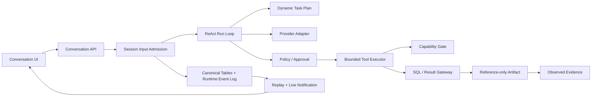

# DBFox 架构整改实施说明

> 文档状态：实施摘要。完整当前设计见 [当前系统架构](../architecture-design-document.md)、[执行管线](../functional-modules-and-execution-pipelines.md) 与 [Agent Runtime](../architecture/agent-runtime.md)。

## 1. 唯一运行链

这条链不依赖 LangGraph thread/state/checkpoint，也没有旧 Runtime fallback。暂停点是领域状态（Approval、Question、cancel、unknown outcome），恢复依据是 canonical tables、lease fencing 和稳定 ToolInvocation ID。

## 2. 状态所有权

| 数据 | 权威所有者 | 明确禁止 |
|---|---|---|
| Session/Run/Turn/Tool/Approval/Question | SQLite canonical tables | 前端推测终态、内存 checkpoint 作为事实源 |
| Committed event | Runtime Event Log | 当成外部消息 Outbox |
| 流式文字 | LiveStreamHub + committed Message | 将 live delta 永久保存为第二份回答 |
| Result rows | 当前 Result Gateway 响应/组件状态 | Artifact、Event、Memory、Conversation Store 缓存 rows |
| SQL | SQL Artifact | Result Artifact 重复保存 safe SQL |
| Evidence | 少量 observed fact + Artifact locator | 保存任意结果页 |
| Security audit | SecurityAuditRecord | 密码、token、完整 SQL 结果、凭据字段 |

## 3. 关键闭环

### 3.1 Durable write

所有 Agent aggregate 写入先取得 SQLite immediate writer reservation。sequence、lease token、run version、event append 和领域记录在同一个短事务中提交；模型与数据库查询不占用该事务。

### 3.2 ReAct 与预算

RunLoop 是动态循环，不是僵硬节点图。每轮可继续、修复、请求工具、等待批准/问题或完成；RunControl 统一约束 deadline、turn/tool、token、cost、provider retry、repair 和 cancel。

### 3.3 Tool boundary

Tool contract 在 Turn 开始时物化；授权输入、hash、idempotency key 与恢复策略持久化。ToolExecutor 执行 timeout、retry、sequential scope、output bytes 和 cancellation。进程内只允许 metadata read/write 与 database read；其余能力没有隔离 backend 时拒绝注册。

### 3.4 Streaming 与恢复

Committed event 使用 Session sequence/cursor；短暂增量使用 live ID/channel revision/correlation。SSE 先订阅通知再 replay SQL truth。Event Log 压缩后推进 replay floor，旧 cursor 得到 snapshot-required，前端重载 canonical snapshot 后继续。

### 3.5 Reference-only Artifact

Result Artifact 只保存来源关系、fingerprint、generation、列描述、行数和执行元数据。分页、筛选、图表数据与导出全部根据 Artifact ID 实时重查；响应明确区分 original observation 与当前 view execution。

### 3.6 Dynamic Task Plan

Task Plan 是复杂任务的可选领域状态和用户可见过程投影，不是每轮强制生成的流程图。Agent 通过 `plan.update` 创建或调整稳定步骤；计划按 Run 版本化，同一时间最多一个步骤处于执行中。要求证据的步骤只有引用同 Session Artifact 后才能完成。刷新后计划从 canonical table 恢复，并通过公共 `plan.updated` 事件进入 Activity Feed。

### 3.7 Security Audit lifecycle

批准、拒绝、取消与导出等安全动作写入结构化 SecurityAuditRecord。详情递归脱敏，并主动剔除 rows、previewRows、series 等结果负载。本地数据库只保留 90 天且最多 20,000 条；诊断包只包含近 7 天最多 500 条。用户清理必须输入明确确认文字，清理完成后保留一条新的清理审计记录。

## 4. 新增工程门禁

- Runtime event type 必须在合同注册表中声明版本和分类。
- Durable event payload 递归拒绝 rows、previewRows、preview_rows、series。
- npm lock 只允许官方 registry 和完整 integrity。
- Node/Python/Rust 依赖生成 CycloneDX SBOM 并做 license gate。
- Windows、macOS、Linux 执行候选发布构建矩阵。
- CSP、virtual list、live reducer、迁移、并发 writer、provider conformance 与 Artifact 数据边界均有自动化测试。

## 5. 后续开发顺序

1. Prompt Injection / crash point / cancel latency / Evidence coverage 评测。
2. 有真实高权限工具需求时再实现 isolated-process backend。
3. 有真实多模型产品需求时建立 Provider Route 聚合，而不是在 adapter 中写隐式 fallback。
4. 远程 Web 作为独立服务端架构，不复用本地 token/SQLite/LiveStreamHub 假装可扩展。
