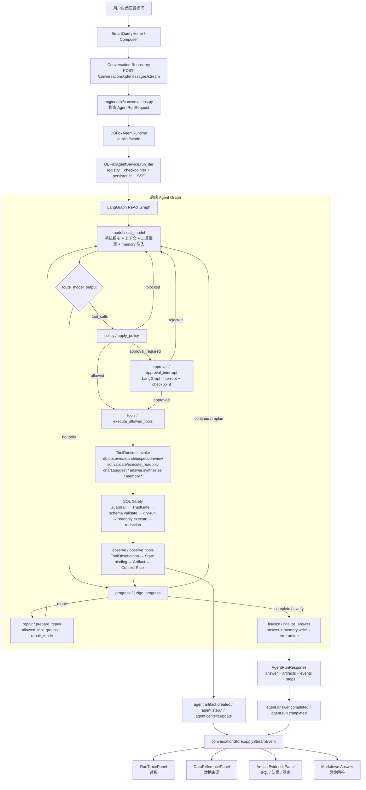

## 一、总体判断

DBFox 的后端 Agent 已经具备“可产品化”的骨架：LangGraph 纯 ReAct loop、ToolPolicy、ToolStateSpec、ArtifactSpec、SQL TrustGate、审批/断点恢复、SSE 事件流都已经存在，但当前更像一个强工具调用器，需要做**局部架构重构**而不是只做微调。
前端交互成熟度低于后端：现在主路径已经切到 `conversationStore + ConversationWorkspace`，但仍并存旧的 `agentStore + agentTimeline` 事件消费路径，导致 Agent 过程呈现、artifact 映射和审批体验不够统一。
当前最大优势是 SQL 安全链路扎实，Guardrail、TrustGate、schema 校验、只读执行、脱敏、审批都已经进入主执行路径。
当前最大短板是“可信过程”没有被产品化：后端有 trace/context/artifact，但前端隐藏 safety/query_plan，并且 timeline 仍偏工具日志。
DBFox 非常适合继续强化为“AI 数据库工作台”，但下一步重点应从“Agent 能跑通”转向“用户能看懂、能信任、能接管”。

---

## 二、Agent 架构图



这条链路目前的主产品路径是 `SmartQueryHomeTab → createAndOpenConversation → sendMessage → /conversations/:id/messages/stream → DBFoxAgentRuntime.run_iter → ConversationWorkspace`，不是旧的 `agentStore.runAgentForTab` 路径。

---

## 三、Agent 设计评审

### 1. Graph / Nodes

**当前设计**
`build_dbfox_react_graph()` 是一个纯 ReAct 图，不设独立 planner：`model → policy → tools → observe → progress → model/repair/finalize`，并额外支持 `approval` interrupt。文件内明确把“规划”下沉为模型输出、工具观察和 progress judge 的组合。

**优点**
结构简单，节点边界大体清楚；`policy` 放在所有工具调用前，`observe` 统一沉淀工具结果，`progress` 判断是否继续、修复或结束，这比传统“LLM 任意调工具”更可控。

**问题**
节点职责已经开始膨胀。`call_model()` 不只是模型调用，还负责 step 上限、post-query grace、system prompt、tool binding、memory 注入、历史压缩；`observe_tools()` 同时做 ToolObservation 校验、state databinding、候选表去重、artifact 生成、context pack 构建。

**改进建议**
把节点拆成“执行节点”和“投影/呈现节点”：
`model` 只负责 LLM 调用；memory/context 由 `context_builder` 统一注入；`observe` 拆成 `bind_tool_state`、`derive_working_memory`、`emit_artifact`、`build_context_pack` 四个纯函数模块。这样可以让 LangGraph 节点保持粗粒度，但内部职责可测试、可替换。

**涉及文件路径**
`engine/agent/graph/react_graph.py`、`engine/agent/nodes/model_node.py`、`engine/agent/nodes/observe_node.py`、`engine/agent/nodes/progress_node.py`、`engine/agent/nodes/finalize_node.py`

---

### 2. State

**当前设计**
`DBFoxAgentState` 是一个大型 TypedDict，覆盖 run ids、messages、workspace/followup context、environment、semantic、db search/inspect/preview、large catalog exploration、SQL、safety、execution、analysis_units、tool routing、approvals、repair、progress、UI artifacts、trace/runtime events 等。

**优点**
所有节点共享一个状态对象，便于 LangGraph checkpoint、resume、debug，也方便前端一次性从 final state 组装 response。

**问题**
状态过大并且层次混杂：执行控制字段、LLM 上下文、工具中间结果、UI artifact、runtime event、legacy 字段都在同一个 state 中。更明显的是 `analysis_units/current_analysis_unit_id` 在 state 中出现了重复定义，说明这个类型已经失去清晰边界。

**改进建议**
拆成四层 state contract：
`RunState`：run_id/status/error/step_count；
`WorkingMemoryState`：schema candidates、semantic_resolution、analysis_units、repair_stats；
`ToolExchangeState`：pending/allowed/blocked/last_tool_results/tool_call_history；
`PresentationState`：artifacts、trace_events、runtime_events、visible_plan、context_summary。
Graph 仍可用一个 TypedDict，但内部字段应按 namespace 分组，例如 `state["run"]`、`state["working"]`、`state["tools"]`、`state["ui"]`，避免节点跨层写入。

**涉及文件路径**
`engine/agent/graph/state.py`、`engine/agent/app/service.py`、`engine/agent/app/event_mapper.py`

---

### 3. Routes

**当前设计**
`routes.py` 把模型输出、policy 结果、approval 结果、progress 结果映射到下一节点。`route_model_output()` 有 tool call 就走 policy，否则交给 progress；`route_after_policy()` 根据 allowed/approval/blocked 选择 tools/approval/model/progress；`route_after_progress()` 根据 complete/clarify/replan/repair 选择 finalize/model/repair。

**优点**
路由函数非常短，Graph 行为可读。把“是否结束”交给 progress judge，而不是让模型直接 final，方向是正确的。

**问题**
progress decision 语义过载：`complete/clarify/replan/repair/continue` 既表达任务状态，又表达控制流，又影响工具组。后续如果增加“需要用户选择口径”“需要澄清业务指标”“需要展示中间结果”等产品态，现有枚举会不够。

**改进建议**
把 progress decision 拆成：
`task_status`: `need_more_evidence | ready_to_answer | blocked | needs_user_input`
`next_action`: `call_model | repair_sql | finalize | request_approval | ask_clarification`
`user_visible_phase`: `understanding | searching_schema | validating_sql | executing | repairing | synthesizing`
前端直接消费 `user_visible_phase`，不要从 tool name 推断 UI 阶段。

**涉及文件路径**
`engine/agent/graph/routes.py`、`engine/agent/nodes/progress_node.py`、`engine/agent/app/event_mapper.py`

---

### 4. Tools

**当前设计**
工具系统有清晰的 `BaseTool`、`ToolSpec`、`ToolPolicy`、`ToolStateSpec`、`ArtifactSpec`，运行时通过 Pydantic input/output 校验、state projection 和 `ToolRuntime.invoke()` 执行。

**优点**
这是后端最成熟的部分之一。工具分组覆盖 `environment/schema/db/result/chart/answer/memory/control/sql`，后续扩展不会完全失控。

**问题**
工具分层还不够产品化。`db.query` 是“一体化安全查询”工具，但被注册为 `visible_to_model=False`，而 `sql.validate + sql.execute_readonly` 又是模型可见的显式链路，二者职责会让维护者困惑：到底推荐 Agent 走一体化查询，还是显式校验再执行？
另一个问题是前端可见的工具名和后端工具名绑定过紧，timeline 里仍需要大量手写 tool label。

**改进建议**
明确三层工具：
`Discovery tools`：`db.observe/search/inspect/preview`；
`SQL lifecycle tools`：`sql.propose`、`sql.validate`、`sql.execute_readonly`、`sql.revise`；
`Presentation tools`：`answer.synthesize`、`chart.suggest`、`memory.write`。
如果保留 `db.query`，应标记为 internal fast path，只允许后端 deterministic fastpath 使用，不要与模型可见的 SQL lifecycle 混用。

**涉及文件路径**
`engine/tools/runtime/base.py`、`engine/tools/runtime/runtime.py`、`engine/tools/runtime/registry.py`、`engine/tools/dbfox_tools.py`、`engine/tools/db/query.py`、`engine/tools/db/sql_execution.py`

---

### 5. Policy / Approval

**当前设计**
`apply_policy()` 读取模型 tool calls，用 `PolicyGate` 判断 allow/block/approval，并强制一轮只执行一个 tool call；如果需要审批，会创建 approval record 并进入 LangGraph interrupt。

**优点**
审批机制是“真实可恢复”的，不只是弹窗：`approval_interrupt()` 会通过 LangGraph interrupt 暂停，审批通过后恢复 allowed tool call。

**问题**
`policy_node` 的“一轮只执行一个工具”与系统提示里的“尽可能同一步发起至少两个 db.search”存在冲突；这会造成模型按 prompt 想批量搜索，policy 又拆成多轮，用户看到的过程会变慢且碎片化。系统提示要求多次 search 的片段在 `system_prompt.py`，policy 的单工具执行在 `policy_node.py`。

**改进建议**
允许同组只读 discovery 工具批量执行，例如多个 `db.search` 可并行，`sql.execute_readonly` 仍保持单次审批/单次执行。Policy 输出应增加 `batch_id`、`tool_group`、`user_reason`，前端展示为“一次搜索了 3 个候选方向”，而不是三条技术日志。

**涉及文件路径**
`engine/agent/nodes/policy_node.py`、`engine/agent/nodes/approval_node.py`、`engine/policy/gate.py`、`engine/agent/model/system_prompt.py`

---

### 6. SQL Safety

**当前设计**
SQL 安全链路完整：`sql.validate()` 生成安全决策，`sql.execute_readonly()` 要求 validated safety，`execute_query()` 统一走安全决策、执行和脱敏。TrustGate 内部做 Guardrail、schema validate、风险评级、确认策略和 dry-run。

**优点**
这是从“AI 生成 SQL”迈向“可信数据库助手”的关键基础。Guardrail 禁止非 SELECT、多语句、危险 schema、危险函数，并自动处理 LIMIT/SELECT * 风险。

**问题**
安全链路后端强，前端弱。`agentBridge.ts` 明确隐藏 `safety` artifact，导致用户看不到“为什么这条 SQL 安全”“是否脱敏”“是否因为环境风险需要确认”。
此外，`/agent/results/page` 里手工构造安全决策用于分页查询，容易绕开完整 TrustGate 语义，至少应该复用 `sql.validate` 或 TrustGate 的分页安全评估路径。

**改进建议**
把 safety 从隐藏 artifact 改成默认折叠的“安全检查卡”：
“只读查询 ✅ / 访问 2 张表 / 未发现危险函数 / 已脱敏 3 个疑似敏感字段 / LIMIT 已自动补充”。
审批时展示风险原因、SQL diff、数据源环境、可取消/复制 SQL/手动执行，而不是只说“存在风险”。

**涉及文件路径**
`engine/sql/guardrail.py`、`engine/sql/trust_gate.py`、`engine/sql/safety_gate.py`、`engine/sql/executor.py`、`engine/tools/db/sql_execution.py`、`desktop/src/features/workspace/agentBridge.ts`、`desktop/src/features/conversation/workspace/ArtifactEvidencePanel.tsx`

---

### 7. Memory

**当前设计**
memory 已经进入 Agent 流程：`model_node` 首轮自动注入 `search_memory_for_planner()` 结果，`finalize_answer()` 在成功后写入 trajectory memory。
memory 类型包括用户偏好、项目规则、成功轨迹、指标定义、schema alias。

**优点**
这不是完全堆功能，至少已经接入了“提问前上下文”和“回答后沉淀”两个关键点。

**问题**
记忆对用户不可见，且注入时机偏粗：主要是首轮模型调用前注入，用户看不到“我参考了上次保存的 GMV 定义”或“我沿用了你上次确认的订单口径”。`memory.write` 也被注册为不可见工具，长期记忆更多依赖 finalize 自动写入。

**改进建议**
前端增加“已参考的业务记忆”小卡：
“沿用记忆：GMV = paid_amount - refund_amount；来自 2026-06-18 的成功查询，点击查看/撤销”。
后端把 memory hit 作为 `context.artifact` 或 `agent.context.update.task_lens` 的一部分输出。

**涉及文件路径**
`engine/agent/memory_bridge.py`、`engine/agent/nodes/model_node.py`、`engine/agent/nodes/finalize_node.py`、`engine/tools/dbfox_tools.py`

---

### 8. Semantic Search

**当前设计**
语义层包括 alias resolver、schema linker、semantic context。`SemanticAliasResolver` 目前是精确关键词匹配，并且文件说明 MVP 中移除了向量召回/公式扩展；`SchemaLinker` 是规则打分：workspace scope、alias、表名/列名/comment/token、FK 扩展。

**优点**
对数据库工作台来说，schema linking 比开放式语义搜索更实际；可解释、可控、成本低。

**问题**
现在“语义搜索”的产品感不足，更像 lexical schema linker。`AgentRunRequest.semantic_mode` 默认是 `"off"`，如果用户期望业务别名/指标定义自动生效，当前默认路径可能不会给出强感知。

**改进建议**
把 semantic 输出产品化为“字段理解卡”：
“我把‘新注册用户’理解为 `users.created_at >= ...`；候选字段：`users.created_at`、`user_profiles.created_at`；选择原因：字段注释/别名/历史查询命中”。
同时把 alias/memory/schema linker 命中统一为 `semantic_resolution` artifact，前端默认折叠展示。

**涉及文件路径**
`engine/semantic/alias.py`、`engine/semantic/schema_linker.py`、`engine/agent/graph/state.py`、`engine/agent/memory_bridge.py`

---

### 9. Artifact

**当前设计**
后端定义了 `AgentArtifact`、presentation mode、artifact types，并能构建 query_plan、sql、safety、result_view、chart、error 等 artifact。

**优点**
artifact 已经有 `semantic_id`、`produced_by_step`、`depends_on`、`presentation`，这是做可解释 AI 工作台的正确基础。

**问题**
存在多个前后端契约错位：

1. 后端会生成 `result_view` artifact，但旧 `agentBridge.mapArtifact()` 没有处理 `result_view`，只处理 `table/chart/sql/...`。
2. 后端 `depends_on` 使用的是 semantic id，例如 `["sql_candidate", "safety_report"]`，而 `ArtifactEvidencePanel.groupedArtifacts()` 用 `sqlArtifact.id` 匹配，容易导致 SQL、结果、图表分组失败。
3. 前端映射了 `insight/recommendation`，但后端 `AgentArtifactType` 并没有这些类型。
4. `safety` 和 `query_plan` 被前端隐藏，削弱可信体验。

**改进建议**
定义一份跨端 artifact contract：
`artifact.id` 是物理 ID；`semantic_id` 是依赖用 ID；`depends_on` 只能引用 semantic_id；前端分组必须同时支持 id/semantic_id。
同时把 artifact 分成三栏：`过程证据`、`可执行产物`、`结果视图`，而不是简单按 type 排序。

**涉及文件路径**
`engine/agent_core/artifacts.py`、`engine/agent_core/types.py`、`engine/agent/app/event_mapper.py`、`desktop/src/features/workspace/agentBridge.ts`、`desktop/src/features/conversation/workspace/ArtifactEvidencePanel.tsx`、`desktop/src/types/agentArtifact.ts`

---

### 10. Final Answer

**当前设计**
`finalize_answer()` 会优先使用 `answer`，否则从最后一条 assistant message 里提取文本；成功时还会把 analysis units 转成 evidence，并尝试写入 trajectory memory。

**优点**
容错强，即使模型没有调用 `answer.synthesize`，也能给用户一个最终文本。

**问题**
作为数据分析助手，最终回答应该强制绑定 evidence。现在 fallback 到最后一条 AI 文本，可能让“有回答但证据不足”的场景看起来像成功。前端 `buildAnswerText()` 也只拼 answer/key_findings/caveats，没有把 evidence 引用转成可点击数据来源。

**改进建议**
把 final answer 分为三种状态：
`grounded_answer`：有 SQL/result evidence；
`partial_answer`：有 schema/search 证据但未执行；
`ungrounded_text`：只允许作为草稿，不标记为 completed。
前端答案每个关键结论旁边应有引用 chip，例如 “来自 SQL #1 · 128 行 · 已脱敏”。

**涉及文件路径**
`engine/agent/nodes/finalize_node.py`、`engine/tools/dbfox_tools.py`、`desktop/src/features/conversation/workspace/MessageBubble.tsx`、`desktop/src/features/conversation/workspace/DataReferencePanel.tsx`

---

## 四、前端交互评审

### 1. Conversation

**当前交互方式**
首页 `SmartQueryHome` 展示 hero、上下文拖拽区和输入框；提交后创建 conversation，打开 QueryResult tab，并通过 `conversationStore.sendMessage()` 走 `/conversations/:id/messages/stream`。

**用户体验问题**
拖拽上下文表看起来很关键，但当前后端 `stream_conversation_message()` 构造 `AgentRunRequest` 时没有把 session 里的 `context_tables_json` 转成 `workspace_context.selected_table_names`，也没有传 `context_tables`。这意味着“拖了表作为问数上下文”可能没有真正影响 Agent。

**美观问题**
首页有品牌感，但发送按钮永久 `animate-pulse`，容易显得玩具化；数据库工具应更克制，只在可提交或生成中使用动效。

**信息层级问题**
用户提问前没有明确告诉用户“当前数据源、已选表、可访问范围、是否会执行 SQL”。这会降低信任。

**改进建议**
输入框上方增加“任务上下文条”：
`数据源：prod_orders · 12 张表可搜索 · 上下文表：orders, users · 将执行只读查询`。
提交前可切换“仅生成 SQL / 执行只读查询”。

**涉及文件路径**
`desktop/src/features/workspace/SmartQueryHome.tsx`、`desktop/src/features/workspace/smartQuery/AskContextDropZone.tsx`、`desktop/src/features/workspace/smartQuery/AskInputBox.tsx`、`desktop/src/stores/conversationStore.ts`、`engine/api/conversations.py`

---

### 2. Agent Timeline

**当前交互方式**
当前 conversation 主路径用 `RunTracePanel` 折叠展示 runtime events；旧路径还有 `agentTimeline.ts` 把 SSE 映射成 user/assistant/tool item。`RunTracePanel` 内置了部分中文工具名，例如“搜索相关表和字段”“校验 SQL 安全性”“执行只读查询”。

**用户体验问题**
它仍是事件日志而不是工作流。`details` 默认在 running/failed 时展开，summary 只是最后事件标题；内部还显示 event count 和 Run ID，这更像调试工具而不是用户可信过程。

**美观问题**
icon 列表紧凑但缺少阶段感，没有“理解问题 → 搜索 schema → 生成 SQL → 安全检查 → 执行 → 总结”的视觉节奏。

**信息层级问题**
工具名被翻译了一部分，但 `eventTitle()` 找不到 label 时仍回退到原始 tool/name/event type。

**改进建议**
Timeline 改为 Stage Timeline：每个阶段只有一行摘要，展开后才显示 tool calls。
例如：
`正在搜索相关表字段 · 命中 4 张表 18 个字段`
展开：`db.search("注册 用户 时间")`、`db.inspect(users)`。

**涉及文件路径**
`desktop/src/features/conversation/workspace/RunTracePanel.tsx`、`desktop/src/features/workspace/agentTimeline.ts`、`engine/agent/app/event_mapper.py`

---

### 3. Artifact Panel

**当前交互方式**
未看到独立右侧 Artifact Panel；当前是回答气泡下方的 `DataReferencePanel` 和 `ArtifactEvidencePanel`，以及“打开为 Tab”的 `TableArtifactView`。`ArtifactEvidencePanel` 把 SQL、表、图表组织在 evidence details 里。

**用户体验问题**
artifact 是回答的证据，但现在被折叠在消息下方，不像一个可持续工作的“右侧结果区”。用户要对比 SQL、结果和图表时，需要在对话里滚动。

**美观问题**
`summary` 文案是英文 `{artifacts.length} evidence items`，与中文产品不一致。

**信息层级问题**
SQL、结果、图表放在同一个 details 里，缺少“可执行 SQL”“结果预览”“安全证明”“图表建议”四类优先级。

**改进建议**
新增右侧 dock：
顶部 tabs：`结果`、`SQL`、`安全`、`图表`、`过程`。
对话里只保留 compact 引用 chip，点击 chip 联动右侧 artifact。

**涉及文件路径**
`desktop/src/features/conversation/workspace/ArtifactEvidencePanel.tsx`、`desktop/src/features/conversation/workspace/DataReferencePanel.tsx`、`desktop/src/features/workspace/artifacts/TableArtifactView.tsx`、`desktop/src/features/workspace/artifacts/ChartArtifactView.tsx`

---

### 4. SQL Console

**当前交互方式**
SQL Console 是独立 tab，支持 F9/Ctrl+Enter 执行、清屏、结果表、warning/notice。

**用户体验问题**
从 Agent SQL 打开 Console 是有入口的，但 Console 与 Agent 的 safety/report/上下文没有联动。用户打开 SQL 后，看不到“这条 SQL 来自哪次 Agent、是否通过安全校验、是否脱敏”。

**美观问题**
Console 有终端感，但和对话里的 SQL 卡片视觉不统一；同一条 SQL 在 Agent card 和 SQL Console 中像两个世界。

**信息层级问题**
执行结果只有行数、耗时、时间；缺少 datasource、schema、是否只读、是否截断/脱敏等可信元信息。

**改进建议**
当从 Agent SQL 打开 Console 时，在编辑器上方显示 provenance bar：
`来自 Agent Run · 已通过只读校验 · 使用表 orders/users · 可安全重新执行`。
支持“回填到对话继续追问”。

**涉及文件路径**
`desktop/src/features/workspace/SqlConsoleWorkspace.tsx`、`desktop/src/features/conversation/workspace/ArtifactEvidencePanel.tsx`、`desktop/src/stores/workspaceStore.ts`

---

### 5. Query Result Table

**当前交互方式**
`TableArtifactView` 已有搜索、排序、复制、导出、打开 Tab、workspace 模式分页等能力。

**用户体验问题**
后端 `result_view` 目前 `storageMode: "payload"`，注释写着“Legacy compatibility, switch to sql_backed later”，而前端 workspace mode 已经为 `sql_backed` 做了分页。也就是说，大结果产品化路径设计了，但后端 artifact 还没接上。

**美观问题**
表格可用，但更像开发者表格。缺少数据类型、NULL/脱敏标识、列宽拖拽、列 pin、数值对齐策略的完整桌面工具质感。

**信息层级问题**
“预览 10 / 共 N 行”有了，但“为什么只返回这些行”“是否 LIMIT 注入”“是否截断”应该与安全/执行元信息联动。

**改进建议**
把结果表头做成数据工作台：
左侧：`128 行 · 14 列 · 412ms · 已脱敏`
右侧：`复制 / 导出 / 打开 SQL / 生成图表 / 保存为数据视图`。

**涉及文件路径**
`desktop/src/features/workspace/artifacts/TableArtifactView.tsx`、`engine/agent_core/artifacts.py`、`engine/api/agent.py`

---

### 6. Chart Panel

**当前交互方式**
有两个图表呈现路径：`ChartArtifactView` 使用 ECharts，支持折线/柱状切换和 PNG 导出；conversation inline 的 `ArtifactEvidencePanel.ChartArtifact` 使用简化 SVG/条形预览。

**用户体验问题**
图表建议还不是“可采纳的分析产物”。用户看不到 Agent 为什么建议这个图、x/y 轴含义、聚合口径、是否适合当前数据分布。

**美观问题**
ECharts 卡片更成熟，但 inline preview 太简化，两个视觉体系割裂。

**信息层级问题**
`agentBridge.mapChartArtifact()` 支持识别 line/bar/pie/scatter/area，但最后只输出 line 或 bar，pie/scatter/area 被降级。

**改进建议**
统一使用 `ChartArtifactView` 的视觉体系；图表卡片增加：
`推荐理由`、`维度`、`指标`、`聚合方式`、`一键固定到工作区`。

**涉及文件路径**
`desktop/src/features/workspace/artifacts/ChartArtifactView.tsx`、`desktop/src/features/conversation/workspace/ArtifactEvidencePanel.tsx`、`desktop/src/features/workspace/agentBridge.ts`

---

### 7. Datasource Tree

**当前交互方式**
`DataSourceTree` 支持数据源选择、刷新、搜索、智能问数/对话历史快捷入口、schema/table 分组、表选中、多选、拖拽。

**用户体验问题**
搜索框 placeholder 写“搜索表或字段”，但当前过滤逻辑只匹配 table_name/table_comment，没有看到列级搜索。
拖拽表到问数上下文是好设计，但如前所述，conversation stream 没把这个上下文带进 AgentRunRequest。

**美观问题**
树整体可用，但层级密度和 DataGrip/DBeaver 相比还缺少专业数据库信息：schema、table type、行数估计、索引、主键、外键、同步状态、连接状态 badge。

**信息层级问题**
“智能问数”和“对话历史”放在数据源树内部，有入口优势，但也会把导航和 schema browsing 混在一起。

**改进建议**
表节点增加轻量 metadata：`PK`、`FK`、`rows~`、`comment` tooltip；右键菜单增加“加入问数上下文”“问这个表”“生成表画像”。

**涉及文件路径**
`desktop/src/features/datasource/DataSourceTree.tsx`、`desktop/src/features/workspace/smartQuery/AskContextDropZone.tsx`、`engine/api/conversations.py`

---

### 8. Workspace Layout

**当前交互方式**
App 采用左侧 DataSourceTree、中间 main surface、右侧 ContextDrawer 的桌面布局；中间用 tab bar 路由 smart-query、conversation、SQL、table、artifact result 等。

**用户体验问题**
问数结果现在主要藏在 conversation message 里，artifact 只能“打开为 Tab”，没有持续可见的右侧结果区。AI 数据库工作台的核心应该是“左 schema / 中对话 / 右证据与结果”的三栏闭环。

**美观问题**
整体 shell 有桌面软件雏形，但 conversation 页面是单栏文档流，和数据库工作台多面板体验还没融合。

**信息层级问题**
SQL Console、结果表、图表、对话是并列 tab，而不是围绕一次 Agent run 的多视图。

**改进建议**
把每个 Agent run 变成一个 workspace canvas：左侧对话，中间 answer/timeline，右侧 artifact dock；打开 result tab 只是放大查看，不是唯一查看方式。

**涉及文件路径**
`desktop/src/App.tsx`、`desktop/src/features/appShell/WorkspaceRouter.tsx`、`desktop/src/features/conversation/workspace/ConversationWorkspace.tsx`

---

### 9. Error / Loading / Empty State

**当前交互方式**
已有基础错误态：未选择数据源、未配置 API Key、SQL 错误、conversation loading、schema loading。

**用户体验问题**
错误态多为技术消息，缺少“下一步怎么做”。例如 SQL 修复时，后端有 repair 事件，但前端应明确告诉用户“字段不存在，正在查找相似字段并重试”。旧 `agentTimeline.ts` 已有部分 normalize，但主 conversation trace 还没有形成统一自然语言层。

**美观问题**
错误卡片基础可用，但缺少风险级别、可恢复性、重试按钮、复制诊断信息等成熟工具交互。

**信息层级问题**
Loading 只是 `Thinking...` 或“正在加载...”，无法让用户判断 Agent 是卡住、在查 schema、在执行 SQL，还是在等待审批。

**改进建议**
定义 8 个用户态：
`理解问题中`、`搜索表字段`、`检查表结构`、`生成 SQL`、`安全校验`、`执行查询`、`修复 SQL`、`整理回答`。
所有 technical event 统一映射到这 8 个状态。

**涉及文件路径**
`desktop/src/features/conversation/workspace/RunTracePanel.tsx`、`desktop/src/features/workspace/agentTimeline.ts`、`desktop/src/stores/conversationStore.ts`、`engine/agent/app/event_mapper.py`

---

### 10. Visual Design System

**当前交互方式**
已有设计 token、Fira Sans/Fira Code、light/dark 变量、badge、table、copilot section 等 CSS 基础。

**用户体验问题**
设计系统没有完全约束组件实现。conversation CSS、App.css、Tailwind utility、inline style 混用，导致局部看起来精致，但整体一致性不足。

**美观问题**
DBFox 有温暖、轻量、AI 原生的品牌方向，但数据库工具的“精密、可信、信息密度”还不够。颜色偏柔和，关键状态如安全/风险/执行/修复没有稳定语义色。

**信息层级问题**
大量 10px/11px 文本、卡片边框、chip 同时出现，容易造成信息噪声；真正重要的 SQL、安全、结果摘要没有足够视觉权重。

**改进建议**
建立 Agent 专用组件规范：`StageStep`、`TrustBadge`、`SQLCard`、`ResultSummaryBar`、`ArtifactDock`、`RepairNotice`、`ApprovalCard`，统一 spacing、icon、tone、折叠规则。

**涉及文件路径**
`desktop/src/index.css`、`desktop/src/App.css`、`desktop/src/features/conversation/workspace/conversationWorkspace.css`、`desktop/src/features/workspace/artifacts/*.tsx`

---

## 五、理想体验重构方案

### 1. 用户提问前

**UI 展示**
输入区上方显示 Context Bar：

> 当前数据源：`prod_analytics` · 已同步 128 张表 · 问数上下文：`orders`, `users` · 模式：执行只读查询

输入框 placeholder：

> 例如：最近 7 天新注册用户中，有多少完成了首单？

右侧小提示：

> DBFox 会先理解表结构，再生成并校验只读 SQL。涉及风险操作会先询问你。

---

### 2. Agent 理解问题时

**Timeline 文案**

> 正在理解你的问题
> 我会寻找“新注册用户”“首单”“最近 7 天”对应的表和字段。

**UI 展示**
一个 compact stage card，左侧 spinner，右侧显示“目标识别”：
`指标：新注册用户首单转化`
`时间范围：最近 7 天`
`需要证据：用户注册时间、订单时间、首单定义`

---

### 3. Agent 查 schema 时

**Timeline 文案**

> 正在搜索相关表字段
> 找到 4 张候选表：`users`、`orders`、`order_items`、`user_profiles`。

**UI 展示**
显示 Schema Match Card：

| 候选                 | 命中原因        |
| ------------------ | ----------- |
| `users.created_at` | 字段名匹配“注册时间” |
| `orders.user_id`   | 可与 users 关联 |
| `orders.paid_at`   | 可判断首单时间     |

按钮：`查看表结构`、`加入上下文`、`排除这张表`

---

### 4. Agent 生成 SQL 时

**Timeline 文案**

> 正在生成查询 SQL
> 我会先按用户注册时间筛选，再找每个用户的首单。

**UI 展示**
SQL Card 默认折叠前 12 行：

标题：`SQL 草案`
badge：`待校验`
说明：`使用 users + orders，按 user_id 关联，按 paid_at 计算首单`

操作：`展开 SQL`、`复制`、`在 Console 打开`

---

### 5. 安全校验时

**Timeline 文案**

> 正在校验 SQL 安全性
> 只允许 SELECT；将自动限制返回行数；敏感字段会脱敏。

**UI 展示**
Trust Card：

* ✅ 只读查询
* ✅ 单条语句
* ✅ 未访问系统 schema
* ⚠️ 自动补充 LIMIT 1000
* 🔒 已识别敏感字段：`email`, `phone`

---

### 6. 执行查询时

**Timeline 文案**

> 正在执行只读查询
> 查询已提交到 `prod_analytics`，等待数据库返回结果。

**UI 展示**
Result Skeleton：表头先出现，顶部显示：

> 执行中 · 已耗时 1.8s · 可取消

按钮：`取消查询`

---

### 7. 查询失败并修复时

**Timeline 文案**

> 查询遇到字段不匹配，正在修复
> `orders.paid_at` 不存在，我正在检查相近字段。

修复后：

> 已找到替代字段 `orders.payment_time`，正在重新校验并执行。

**UI 展示**
Repair Card：

`失败原因：字段不存在`
`原字段：orders.paid_at`
`替代字段：orders.payment_time`
`依据：表结构检查 + 字段注释“支付时间”`

按钮：`查看 diff`、`停止修复`

---

### 8. 查询成功后展示结果

**Timeline 文案**

> 查询完成
> 返回 7 行，耗时 428ms。结果已作为证据附在回答中。

**UI 展示**
右侧 Artifact Dock 自动切到“结果”：

顶部 summary：

> 7 行 · 5 列 · 428ms · 已脱敏 · SQL #1

表格支持搜索、排序、复制、导出、打开为 Tab。

---

### 9. 生成图表和洞察时

**Timeline 文案**

> 正在生成图表建议和关键洞察
> 这个结果适合用折线图展示最近 7 天变化趋势。

**UI 展示**
Chart Suggestion Card：

`推荐图表：折线图`
`X 轴：注册日期`
`Y 轴：首单转化率`
`推荐理由：时间序列 + 单指标趋势`

按钮：`生成图表`、`固定到工作区`、`换成柱状图`

---

### 10. 用户继续追问时

**Composer 文案**

> 继续追问这个结果，例如：“按渠道拆分一下”

**UI 展示**
输入框上方显示 inherited context：

> 将沿用：SQL #1、结果表、users/orders 表结构、最近 7 天时间范围

用户可取消某个上下文 chip。

---

## 六、视觉美观改进建议

### 整体布局

采用三栏：
左侧 `DataSourceTree` 240–320px；中间 Conversation 620–760px；右侧 Artifact Dock 420–560px。
中间对话只承载“问题、阶段摘要、最终回答”，右侧承载“SQL、安全、结果、图表、trace”。

### 左侧数据源树

表节点增加辅助信息：
`orders` 右侧显示 `~12.8M`、`PK`、`3 FK`、`comment` tooltip。
搜索框改为真正支持表/字段搜索；搜索结果高亮命中列。
右键菜单增加：`问这个表`、`加入当前问数上下文`、`生成表画像`、`查看关系图`。

### 中间对话区

回答卡片改成“报告式”：
顶部一句直接结论；中间 key findings；底部 evidence chips。
不要把完整工具过程塞在回答正文上方，过程用 compact stage timeline。

### 右侧 Artifact / 结果区

新增固定 Dock：
Tabs：`结果`、`SQL`、`安全`、`图表`、`过程`。
每次 Agent run 自动选中最重要 artifact：成功时选结果，失败时选修复/错误，审批时选安全。

### SQL 卡片

SQL header：

> SQL #1 · 已校验 · 只读 · 2 张表 · 428ms

SQL body 默认展示前 16 行，长 SQL 可折叠。
增加 SQL diff，用于修复场景：

```diff
- orders.paid_at
+ orders.payment_time
```

### 表格结果

表头 sticky，列类型小 badge：`int`、`datetime`、`text`。
NULL 用浅灰 italic；脱敏字段显示 `***` + lock icon。
数值右对齐，日期统一格式。
底部 status bar 固定显示：`第 1 页 · 50 / 128 行 · 已截断 · 导出 CSV`。

### 图表

Chart Card 顶部展示推荐理由，不只展示图。
支持“应用图表建议”而不是默认渲染所有图。
ECharts 与 inline preview 统一，不要一处是正式图表、一处是手写 mini preview。

### Timeline

阶段名使用自然语言：
`理解问题`、`搜索表字段`、`检查结构`、`生成 SQL`、`安全校验`、`执行查询`、`修复`、`整理回答`。
每阶段只有一行主文案，工具细节折叠。
失败阶段高亮根因和下一步。

### 状态徽章

建立固定语义：
绿色：`已通过`、`只读`、`已完成`
黄色：`需确认`、`已截断`、`字段替换`
红色：`已阻止`、`执行失败`
蓝色：`正在执行`
紫色：`AI 推断`

### 颜色系统

当前 AI violet + data cyan 可以保留，但数据库状态色要更克制。
安全/危险不要用品牌紫，避免“风险也像品牌强调色”。
建议：安全绿、警告 amber、危险 red、执行 blue、AI violet。

### 字体和间距

保留 Fira Sans/Fira Code，但减少 9px/10px 文字。
桌面工具最低正文建议 12px，重要元信息 11px，正文 14–15px。
卡片内距统一：8/12/16 三档；不要混用大量 inline style。

### 动效

只在运行中使用微动效：stage spinner、SQL executing loading bar。
取消发送按钮永久 pulse。
Artifact 出现用 160ms fade/slide；不要让整个界面跳动。

### 暗色模式

当前有 dark token，但 conversation CSS 中大量硬编码白底/Slate 色，需要替换为 token。
特别是 SQL、表格、evidence、trace、chart preview 都要过暗色验收。

### 空状态和错误状态

空状态要引导动作：
“还没有结果。你可以拖一张表到上下文，或直接问：最近 7 天订单趋势。”
错误状态要给恢复动作：
“字段不存在。已找到 3 个相似字段：`payment_time`、`paid_time`、`created_at`。请选择或让 DBFox 自动修复。”

---

## 七、优先级路线图

### 阶段 1：一周内能做的体验修复

| 任务标题                            | 为什么重要                                             | 涉及文件                                                                                             | 预期效果                 | 验收标准                                                                                    |
| ------------------------------- | ------------------------------------------------- | ------------------------------------------------------------------------------------------------ | -------------------- | --------------------------------------------------------------------------------------- |
| 打通问数上下文表                        | 当前拖拽上下文可能没有进入 Agent，用户以为生效但实际未必生效                 | `engine/api/conversations.py`、`desktop/src/stores/conversationStore.ts`、`AskContextDropZone.tsx` | Agent 能优先搜索/检查用户拖入的表 | 拖入 `orders` 后提问，后端 `AgentRunRequest.workspace_context.selected_table_names` 包含 `orders` |
| 修复 `result_view` 前端映射           | 后端主结果 artifact 是 `result_view`，旧映射漏掉会导致结果不显示或分组错乱 | `agentBridge.ts`、`ArtifactEvidencePanel.tsx`、`types/agentArtifact.ts`                            | 查询结果稳定出现在证据区和结果 Tab  | 单测覆盖 `result_view` artifact → 表格预览、打开 Tab、DataReference                                 |
| Safety artifact 改为可见 Trust Card | SQL 安全是最大优势，但现在被隐藏                                | `agentBridge.ts`、`ArtifactEvidencePanel.tsx`、`RunTracePanel.tsx`                                 | 用户能理解为什么 SQL 可执行     | 成功查询后显示“只读/单语句/LIMIT/脱敏”摘要                                                              |
| Timeline 文案去技术化                 | 用户不应看到工具日志为主                                      | `RunTracePanel.tsx`、`agentTimeline.ts`、`event_mapper.py`                                         | 过程变成自然语言阶段           | 运行中只展示 6–8 个阶段，tool calls 折叠                                                            |
| 审批卡片产品化                         | 当前审批信息弱，风险解释不足                                    | `ConversationWorkspace.tsx`、`MessageBubble.tsx`、`agentStore.ts` 或 conversation store             | 风险 SQL 有明确确认 UI      | waiting_approval 时显示 SQL、风险原因、批准/拒绝按钮                                                   |

---

### 阶段 2：两到四周内的 Agent + 前端重构

| 任务标题                            | 为什么重要                                                 | 涉及文件                                                                    | 预期效果               | 验收标准                               |
| ------------------------------- | ----------------------------------------------------- | ----------------------------------------------------------------------- | ------------------ | ---------------------------------- |
| 拆分 Agent State namespaces       | state 过大、重复字段、跨层写入影响维护                                | `state.py`、`service.py`、各 nodes                                         | 节点职责清晰，状态 diff 可读  | state 类型分层；无重复字段；现有 agent tests 通过 |
| 拆分 observe node 内部职责            | observe 现在负责 state/artifact/context 多件事               | `observe_node.py`、`agent_core/databinding.py`、`artifacts.py`            | 工具结果处理可测试          | 每类工具有独立 state binding 单测           |
| 统一 SQL lifecycle 工具             | `db.query` 与 `sql.validate/execute_readonly` 并存造成心智负担 | `dbfox_tools.py`、`db/query.py`、`db/sql_execution.py`、`system_prompt.py` | Agent SQL 路径稳定可解释  | Prompt、visible tools、policy 三者一致   |
| 新增 Artifact Dock                | 对话内 evidence 不足以支撑数据库工作台                              | `ConversationWorkspace.tsx`、新增 `ArtifactDock.tsx`                       | SQL/结果/安全/图表可并排查看  | 成功查询后右侧自动显示结果，点击 evidence chip 联动  |
| 接通 sql_backed result pagination | 大结果必须分页，不应塞进 artifact payload                         | `artifacts.py`、`TableArtifactView.tsx`、`engine/api/agent.py`            | 大结果流畅可用            | 100k 行结果只加载当前页，排序/分页安全可控           |
| Memory/Semantic 可视化             | 业务别名和长期记忆要让用户信任                                       | `memory_bridge.py`、`schema_linker.py`、`RunTracePanel.tsx`               | 用户知道 Agent 参考了什么口径 | Timeline 显示“参考业务记忆/别名”卡片           |

---

### 阶段 3：发布前必须完成的产品化体验

| 任务标题        | 为什么重要                  | 涉及文件                                                                  | 预期效果            | 验收标准                           |
| ----------- | ---------------------- | --------------------------------------------------------------------- | --------------- | ------------------------------ |
| 可信问数黄金路径打磨  | 发布前必须让核心体验顺滑           | 全链路                                      m                             | 用户从提问到结果都能理解和接管 | 10 个典型问题录屏无明显困惑点               |
| SQL 修复闭环    | 数据库问数最常见失败就是字段/类型/方言问题 | `prepare_repair_node.py`、`progress_node.py`、`RunTracePanel.tsx`       | 失败不是终点，而是可理解修复  | 字段不存在、表不存在、类型错误三类自动修复有 UI diff |
| 审批与脱敏审计     | 本地优先数据库工具必须可信          | `policy_node.py`、`approval_node.py`、`executor.py`、前端 ApprovalCard     | 风险操作可追溯         | 审批记录、SQL、用户决定、时间戳可查看           |
| 暗色模式和视觉一致性  | 桌面软件用户高频使用暗色           | `index.css`、`App.css`、`conversationWorkspace.css`、artifact components | 专业工具质感          | light/dark 截图对比通过，无硬编码白底       |
| Eval + 产品遥测 | Agent 产品需要持续评估         | `engine/evaluation/*`、`RunTracePanel`、事件持久化                           | 能知道失败在哪里        | 每次 run 有阶段耗时、失败层、修复次数、最终成功率    |

---

## 八、可直接交给编码模型的任务列表

### 任务 1：将 Smart Query 上下文表传入 AgentRunRequest

**背景**
前端支持拖拽表作为问数上下文，但 conversation stream 构造 `AgentRunRequest` 时没有传入 workspace_context。

**涉及文件**
`engine/api/conversations.py`、`engine/agent_core/types.py`、`desktop/src/features/workspace/smartQuery/AskContextDropZone.tsx`、`desktop/src/stores/conversationStore.ts`

**具体修改要求**
在 `stream_conversation_message()` 中读取 `AgentSession.context_tables_json`，构造 `AgentWorkspaceContext(datasource_id=session.datasource_id, selected_table_names=context_tables)` 并传入 `AgentRunRequest.workspace_context`。
前端发送 follow-up 时保留 conversation context，不要丢失。

**验收标准**
拖拽 `orders` 到上下文后提问，后端 initial state 的 `workspace_context.selected_table_names` 包含 `orders`。
Agent 首轮 schema search 优先考虑 `orders`。

**推荐测试命令**
`pytest engine/tests/test_agent_api.py`
`cd desktop && npm run test`

---

### 任务 2：补齐 `result_view` artifact 的前端映射

**背景**
后端生成 `result_view`，旧 `agentBridge.mapArtifact()` 没有处理，导致旧路径结果视图可能丢失。

**涉及文件**
`desktop/src/features/workspace/agentBridge.ts`、`desktop/src/types/agentArtifact.ts`、`desktop/src/features/workspace/__tests__/agentTimeline.test.ts` 或新增 `agentBridge.test.ts`

**具体修改要求**
新增 `mapResultViewArtifact()`，读取 `previewRows`、`rows`、`rowCount`、`safeSql`、`storageMode`。
`toViewArtifacts()` 支持 `result_view` 并排序到 table/result 优先级。
`DataReferencePanel` 也识别 `result_view` 为 result 引用。

**验收标准**
输入一个 backend `result_view` fixture，前端能渲染表格预览、行数、耗时、截断状态，并可打开为 Tab。

**推荐测试命令**
`cd desktop && npm run test && npm run lint`

---

### 任务 3：把 safety artifact 渲染为 Trust Card

**背景**
SQL 安全是 DBFox 的核心差异化，但现在 `agentBridge.ts` 把 `safety` 隐藏。

**涉及文件**
`desktop/src/features/workspace/agentBridge.ts`、`desktop/src/features/conversation/workspace/ArtifactEvidencePanel.tsx`、`desktop/src/types/agentArtifact.ts`

**具体修改要求**
不要隐藏 `safety`。新增 `SafetyArtifact` 或 `MarkdownArtifact` 映射，展示 `passed/can_execute/requires_confirmation/guardrail_result/schema_warnings_count`。
在 evidence panel 中把 safety card 放在 SQL card 下方，默认折叠。

**验收标准**
每次 SQL 校验后，UI 显示“只读校验/风险/是否需要确认/脱敏或 LIMIT 提示”。
风险查询显示黄色或红色状态，不与成功结果混淆。

**推荐测试命令**
`cd desktop && npm run test && npm run build`

---

### 任务 4：重构 RunTracePanel 为 Stage Timeline

**背景**
当前 trace 是事件日志，缺少用户理解的阶段。

**涉及文件**
`desktop/src/features/conversation/workspace/RunTracePanel.tsx`、`desktop/src/features/workspace/agentTimeline.ts`、`engine/agent/app/event_mapper.py`

**具体修改要求**
定义阶段枚举：`understanding/searching_schema/inspecting/generating_sql/validating/executing/repairing/synthesizing/completed`。
后端事件 mapper 输出 `step.phase`。
前端按 phase 聚合 events，默认只显示阶段摘要，展开后显示工具细节。

**验收标准**
一次正常问数最多显示 8 个阶段；不再默认暴露 Run ID；工具名只在展开调试时出现。

**推荐测试命令**
`cd desktop && npm run test && npm run lint`

---

### 任务 5：新增 ApprovalCard

**背景**
审批是 Agent 安全流程的一部分，但前端主 conversation 路径没有成熟审批卡片。

**涉及文件**
`desktop/src/features/conversation/workspace/MessageBubble.tsx`、`desktop/src/features/conversation/workspace/ConversationWorkspace.tsx`、`desktop/src/stores/conversationStore.ts`、`engine/api/conversations.py`

**具体修改要求**
当 run.status 为 `waiting_approval` 或事件包含 `agent.approval.required` 时，展示 ApprovalCard。
卡片内容包括风险级别、原因、SQL、数据源、操作按钮：`批准执行`、`拒绝`、`复制 SQL`、`在 SQL Console 查看`。
接入 approval resolve/resume API。

**验收标准**
风险 SQL 会暂停并显示审批卡；批准后继续 SSE；拒绝后 run 进入 rejected/failed 且 UI 显示用户拒绝。

**推荐测试命令**
`pytest engine/tests/test_agent_api.py`
`cd desktop && npm run test`

---

### 任务 6：修复 `/agent/results/page` 的安全决策路径

**背景**
结果分页 API 手工构造安全决策，不应绕开完整 SQL safety。

**涉及文件**
`engine/api/agent.py`、`engine/sql/safety_gate.py`、`engine/sql/trust_gate.py`、`engine/tests/test_agent_api.py`

**具体修改要求**
分页查询应调用统一安全校验函数，或新增 `validate_result_page_query()`，只允许对已通过安全校验的 `safeSql` 增加受控 `LIMIT/OFFSET/ORDER BY`。
禁止客户端直接传任意 safeSql 并获得 `can_execute=True`。

**验收标准**
恶意分页 SQL、多语句 SQL、非 SELECT SQL 均被拒绝。
合法 result_view 分页通过。

**推荐测试命令**
`pytest engine/tests/test_agent_api.py`

---

### 任务 7：拆分 `observe_tools()` 内部逻辑

**背景**
`observe_tools()` 同时做状态绑定、artifact、context pack、候选表去重，难维护。

**涉及文件**
`engine/agent/nodes/observe_node.py`、`engine/agent_core/databinding.py`、`engine/agent_core/artifacts.py`

**具体修改要求**
提取：
`bind_observation_to_state()`
`derive_catalog_exploration_state()`
`emit_artifacts_from_observation()`
`rebuild_context_pack()`
每个函数纯输入/输出，不直接改原 state。

**验收标准**
observe node 主函数不超过 80 行；每个 helper 有单测；现有 Agent 流程测试通过。

**推荐测试命令**
`pytest engine/tests/test_architecture.py engine/tests/test_agent_api.py`

---

### 任务 8：统一 artifact dependency contract

**背景**
后端 `depends_on` 多用 semantic id，前端用物理 id 匹配，SQL/结果/图表可能分组失败。

**涉及文件**
`engine/agent_core/artifacts.py`、`desktop/src/features/conversation/workspace/ArtifactEvidencePanel.tsx`、`desktop/src/types/agentArtifact.ts`

**具体修改要求**
约定 `depends_on` 只引用 `semantic_id`。
前端建立 `byId` 和 `bySemanticId` 双索引，分组时同时支持两者。
修正 chart depends_on，确保 chart 能挂到正确 result_view。

**验收标准**
SQL、safety、result_view、chart 在 evidence panel 中被分到同一组。
fixture 覆盖 physical id 与 semantic id 不同的场景。

**推荐测试命令**
`cd desktop && npm run test`

---

### 任务 9：统一 SQL 生命周期工具设计

**背景**
`db.query`、`sql.validate`、`sql.execute_readonly` 语义重叠。

**涉及文件**
`engine/tools/dbfox_tools.py`、`engine/tools/db/query.py`、`engine/tools/db/sql_execution.py`、`engine/agent/model/system_prompt.py`、`engine/agent/nodes/policy_node.py`

**具体修改要求**
明确模型可见工具只保留一个推荐路径：
方案 A：显式 `sql.validate → sql.execute_readonly`；`db.query` 改 internal。
方案 B：`db.query` 作为唯一模型可见查询工具，内部产出 safety + execution。
更新 prompt、policy、tool descriptions 保持一致。

**验收标准**
模型 prompt、tool registry、policy gate 不再互相矛盾。
正常问数只走一种 SQL lifecycle。

**推荐测试命令**
`pytest engine/tests/test_agent_api.py engine/tests/test_architecture.py`

---

### 任务 10：让最终回答绑定 evidence chips

**背景**
最终回答目前没有把 evidence 强制产品化。

**涉及文件**
`engine/agent/nodes/finalize_node.py`、`engine/agent_core/types.py`、`desktop/src/features/conversation/workspace/MessageBubble.tsx`、`DataReferencePanel.tsx`

**具体修改要求**
后端 `AgentAnswer.evidence` 必须引用 artifact semantic_id/id。
前端在关键结论下显示 clickable evidence chips：`SQL #1`、`结果 128 行`、`图表建议`。
没有 result evidence 的回答显示“未执行查询，仅基于 schema 推断”。

**验收标准**
成功执行查询的回答至少有一个 result/sql evidence。
无 evidence 的回答不能显示为普通 completed success 样式。

**推荐测试命令**
`pytest engine/tests/test_agent_api.py`
`cd desktop && npm run test`

---

### 任务 11：统一图表 artifact 类型和渲染

**背景**
前端有 ECharts 正式视图和 inline 手写预览，图表类型还会被降级。

**涉及文件**
`engine/agent_core/artifacts.py`、`desktop/src/features/workspace/agentBridge.ts`、`desktop/src/features/workspace/artifacts/ChartArtifactView.tsx`、`ArtifactEvidencePanel.tsx`

**具体修改要求**
后端 chart artifact 明确输出 `chart_type`、`x`、`y`、`aggregation`、`reason`、`series`。
前端支持 bar/line/pie/scatter 至少四类，conversation inline 复用 ChartArtifactView compact mode。

**验收标准**
pie chart 不再被强制变成 bar。
图表卡显示推荐理由、指标和维度来源。

**推荐测试命令**
`cd desktop && npm run test && npm run build`

---

### 任务 12：整理视觉 token 与暗色模式

**背景**
CSS token 已有，但组件仍混用硬编码颜色、Tailwind utility 和 inline style。

**涉及文件**
`desktop/src/index.css`、`desktop/src/App.css`、`desktop/src/features/conversation/workspace/conversationWorkspace.css`、artifact components

**具体修改要求**
把 conversation/evidence/sql/table/chart 中的硬编码白底、slate、blue 替换为 token。
定义 Agent 专用 token：`--agent-stage-*`、`--trust-safe`、`--trust-warning`、`--trust-danger`。
移除无必要 inline style。

**验收标准**
light/dark 下 Conversation、SQL、Result、Chart、Approval、Error 截图均可读。
无明显白块出现在 dark mode。

**推荐测试命令**
`cd desktop && npm run lint && npm run build`

---

## 九、最终结论

### 1. DBFox 的 Agent 架构现在应该“微调优化”还是“局部重构”？

应该做**局部重构**。
不是推倒重来，因为 LangGraph ReAct、ToolRuntime、Policy、TrustGate、Artifact、SSE/persistence 都是正确方向；但 `State`、`observe node`、SQL 工具分层、artifact contract、progress/event 语义必须重构，否则越加功能越难维护。

### 2. 前端交互现在应该“补细节”还是“重新设计核心工作流”？

应该**重新设计核心工作流**。
现在不是少几个按钮的问题，而是“AI 问数的主体验”还没有形成稳定结构：过程在 trace，证据在 message 下，结果在 artifact tab，安全被隐藏，审批不够产品化，context 还可能没传进 Agent。

### 3. 最值得优先打磨的 5 个体验点

1. **上下文表真正进入 Agent**：拖拽上下文必须影响 schema search 和 SQL 生成。
2. **Stage Timeline 替代工具日志**：让用户看到“理解、搜索、生成 SQL、安全校验、执行、修复、总结”。
3. **Safety / Trust Card 可见**：把只读、风险、脱敏、LIMIT、审批原因讲清楚。
4. **`result_view` / SQL / chart artifact 契约修复**：保证结果稳定展示、可分组、可打开、可追溯。
5. **SQL 修复体验产品化**：失败时展示根因、修复 diff、重试依据，而不是只显示错误。

### 4. 最能体现 DBFox 差异化的 3 个设计方向

1. **可信本地优先数据 Agent**
   每条回答都能追溯 SQL、安全校验、数据结果和脱敏状态；用户能批准、拒绝、复制、改写、重新执行。

2. **业务语义 + 长期记忆的数据库工作台**
   DBFox 不只是查 schema，而是记住“GMV”“新用户”“首单”等业务口径，并在每次问数时可视化说明采用了什么定义。

3. **Chat + SQL + Result + Chart 的一体化工作流**
   不做单纯聊天框，也不做传统 SQL IDE，而是让自然语言、SQL、结果表、图表和修复过程在同一个 Agent canvas 中联动。

   会更好，但**不是把 DBFox 改成僵硬的“先规划完再机械执行”**。最适合 DBFox 的升级路线是：

> **Plan 做控制平面，ReAct 做执行平面。**
> Plan 负责目标拆解、预算、证据要求、重规划边界；ReAct 负责每一步里的灵活探索、调用工具、处理局部异常。

原因很明确：你现在的代码已经是增强型 ReAct，但它自己也承认没有单独 Planner，`react_graph.py` 里写的是 “pure ReAct loop”，并且明确说 “There is no separate Planner — the ReAct loop IS the plan”。 这在简单问数、简单 SQL 场景下没问题，但一旦进入大 Schema、多表 join、空结果排查、语义修复，就会开始依赖模型“脑内记忆路线”。

## 我的判断：应该升级，但要升级成 Plan-lite / Plan-as-State

不要一上来做 Claude Code 那种复杂多层 Planner。DBFox 更适合先做一个**结构化执行计划状态**，而不是多一个很重的 LLM planner 节点。

现在 state 里已经有 `query_plan`、`progress_decision`、`replan_count`、`revision_count`、`visible_plan` 等字段雏形。  但这些还不是一个真正的计划对象。它们更像散落的 hint、UI lens 和 loop counter。

我建议升级成：

```python
class TaskPlan(BaseModel):
    goal: str
    phase: Literal[
        "understand",
        "resolve_schema",
        "draft_sql",
        "verify_sql",
        "execute_sql",
        "analyze_result",
        "answer",
        "repair",
    ]
    steps: list[PlanStep]
    success_criteria: list[SuccessCriterion]
    evidence: list[EvidenceRef]
    replan_count: int = 0
    revision: int = 0
```

然后 graph 不必彻底重写，可以先从现在的：

```text
model -> policy -> tools -> observe -> progress -> model/repair/finalize
```

升级为：

```text
plan/bootstrap
  -> model
  -> policy
  -> tools
  -> observe
  -> progress
  -> plan_update
  -> model/repair/finalize
```

也就是保留 ReAct loop，但每轮 observe 后都让系统更新 `TaskPlan`。

## 为什么升级到 Plan 会更好？

第一，**复杂任务不会靠模型短期记忆硬撑**。

比如用户问：“找出过去 90 天复购率下降最大的产品品类，并解释原因。”
这不是一个 SQL。它至少包含：

1. 找用户、订单、商品、品类表；
2. 确定复购定义；
3. 写聚合 SQL；
4. 验证时间窗口；
5. 检查空结果或异常值；
6. 解释结果。

现在 pure ReAct 能做，但它每一步的目标是隐含在 prompt/history 里的。升级到 Plan 后，每个阶段都有明确状态。

第二，**重规划会更可靠**。

现在代码有 `replan_policy.py`，可以根据 failure layer 计算 replan budget。 但目前 replan 更像 progress judge 给模型一个 recovery hint，而不是“修改计划第 N 步”。升级 Plan 后，replan 可以变成明确操作：

```text
Step 2 resolve_schema failed: orders table not found
Replace step with: search aliases -> inspect candidates -> rebuild join path
```

第三，**大 Schema 场景会更稳**。

DBFox 已经有大库保护：`db.observe` 在表数超过 30 时进入 summary 模式，并提示用 `db.search`、分页和 FK 扩展探索。 但模型仍然要自己决定搜索什么、何时停止、哪些表算足够。Plan 可以把 “Schema Resolution” 固化成一个阶段：

```text
resolve_schema success criteria:
- 找到至少 1 个事实表
- 找到时间字段
- 找到 join path
- 找到用户问题中的核心指标字段
```

这比让模型自由探索更适合企业级数据库。

第四，**SQL 修复会从“重试”变成“有目标的修复”**。

现在 `sql_repair.py` 已经能把错误分成 missing_column、missing_table、syntax_error、empty_result 等，并生成 recovery strategy。 但修复还是主要靠下一轮模型自行理解。Plan 升级后，repair 可以挂到具体失败步骤上：

```text
failed_step = verify_sql
failure_layer = semantic
repair_goal = fix projection only, preserve FROM/JOIN/WHERE
```

这样能避免 LLM 修一个字段名时顺手改坏 join 条件。

第五，**前端体验会明显提升**。

现在事件流已经有 `agent.progress.update`、`agent.context.update`、tool started/completed 等，前端可以拼出一个进度条。 但如果有 Plan，前端就不只是“看到事件”，而是能稳定展示：

```text
✓ 理解问题
✓ 检索 Schema
✓ 生成 SQL
✗ 验证失败：字段不存在
↻ 正在修复 SQL
✓ 执行成功
✓ 生成答案
```

这会接近 Claude Code 那种“我知道 Agent 正在干什么”的体验。

## 但不要升级成 Heavy Planner

我不建议直接加一个大 Planner 节点，让它一次性输出完整计划，然后模型严格执行。DBFox 是数据库 Agent，真实探索过程高度不确定：表名可能不准，字段可能缺失，数据可能为空，JOIN path 可能需要实际 inspect 后才知道。

Heavy Planner 的风险：

1. **计划幻觉**：Planner 可能编出不存在的表和字段。
2. **延迟增加**：多一次大模型调用，每轮还要维护计划。
3. **过度约束**：模型明明发现新证据，却被旧计划绑住。
4. **代码复杂度上升**：Plan、Progress、Repair 三套状态可能互相打架。

所以最佳路线不是 “Planner 取代 ReAct”，而是：

```text
Plan = 任务骨架 + 成功条件 + 预算 + 当前阶段
ReAct = 阶段内执行器
Progress Judge = 验证当前阶段是否完成
Repair = 针对失败阶段做局部修复
```

## 推荐落地顺序

### 第一阶段：Plan-lite，不新增 LLM 调用

先不要加 Planner LLM。直接在后端 deterministic 初始化一个计划：

```python
def bootstrap_plan(question: str) -> TaskPlan:
    return TaskPlan(
        goal=question,
        phase="understand",
        steps=[
            PlanStep(id="understand", objective="理解用户问题和输出要求"),
            PlanStep(id="resolve_schema", objective="定位相关表、字段和 join path"),
            PlanStep(id="draft_sql", objective="生成只读 SQL"),
            PlanStep(id="verify_sql", objective="验证安全、Schema、语义和 dry-run"),
            PlanStep(id="execute_sql", objective="执行已验证 SQL"),
            PlanStep(id="analyze_result", objective="分析结果和异常"),
            PlanStep(id="answer", objective="生成带证据的最终回答"),
        ],
        success_criteria=[
            SuccessCriterion(id="schema", description="SQL 涉及的表和字段已被工具验证"),
            SuccessCriterion(id="sql", description="SQL 通过 TrustGate 和 dry-run"),
            SuccessCriterion(id="answer", description="回答引用执行结果或明确说明失败原因"),
        ],
    )
```

这个阶段收益很高，风险很低。

### 第二阶段：把 Progress Judge 改成 Plan Step Judge

现在 progress judge 直接决定 complete/continue/replan/repair。建议改成：

```python
class StepJudgment(BaseModel):
    step_id: str
    status: Literal["done", "continue", "failed", "needs_repair"]
    missing_evidence: list[str]
    next_step_id: str | None
    repair_instruction: str | None
```

也就是说，progress judge 不再泛泛判断“任务是否完成”，而是判断“当前 plan step 是否完成”。

### 第三阶段：Schema Resolution 变成强制 Plan Step

不要让模型跳过 Schema 探索直接写 SQL。除非 workspace 已经有明确 selected table / active SQL，否则必须先完成：

```text
resolve_schema -> draft_sql
```

`resolve_schema` 完成条件可以是：

```python
schema_pack.confidence >= 0.75
and len(schema_pack.selected_tables) >= 1
and no critical unresolved_terms
```

### 第四阶段：Verification Report 挂到 Plan 上

现在 TrustGate 很强，但 semantic verifier 没真正接入主链路。升级后 `verify_sql` 这一步应该统一产出：

```python
VerificationReport(
    safety_passed=True,
    dry_run_passed=True,
    semantic_violations=[],
    result_status="ready_to_execute",
)
```

只有 `verify_sql` step done，才允许进入 `execute_sql`。

## 最终建议

**是的，升级到 Plan 会更好。**

但正确姿势是：

> **不要做“大脑式 Planner”；做“控制面 Plan”。**
> 让 Plan 成为 Agent 的状态骨架，让 ReAct 继续负责灵活执行。

对 DBFox 来说，最有性价比的版本是：

```text
Structured TaskPlan
+ deterministic bootstrap
+ progress-driven step transition
+ schema resolution as mandatory step
+ verification report as execution gate
+ replan as plan mutation
```

这会比当前 pure ReAct 更稳、更可测、更容易前端展示，也更接近工业级 Data Agent。

是的，**升级到 Plan 会更好**，但你说得对：如果只是把当前 ReAct 外面套一层“固定步骤计划”，会变得非常僵硬，甚至比现在更差。

更正确的设计不是 **Plan 替代 ReAct**，而是：

> **Plan 做控制面，ReAct 做执行面，Verification 做裁判面。**
> Plan 只定义目标、假设、证据、预算和退出条件；具体怎么探索 Schema、怎么修 SQL，仍然允许模型动态决策。

当前 DBFox 的图已经明确是 pure ReAct：`START → model → policy → tools → observe → progress → model/repair/finalize`，并且注释里写着 “There is no separate Planner — the ReAct loop IS the plan”。 所以我建议的不是推翻它，而是把它升级成 **Elastic Plan + Inner ReAct Loop**。

---

# 1. 先回答核心问题：Plan 会不会让 Agent 变僵硬？

会，如果 Plan 被设计成这样：

```text
1. 先列所有表
2. 再选表
3. 再生成 SQL
4. 再校验 SQL
5. 再执行
6. 再回答
```

这种是“流程脚本”，不是智能体计划。它的问题是：

```text
用户问题简单时，步骤太重。
Schema 不确定时，过早锁定路径。
执行失败时，只能回到固定节点，无法局部改计划。
模型被迫按流程走，丧失探索能力。
```

更好的 Plan 应该像 Claude Code 里的 task lens，而不是瀑布式工作流：

```text
我当前认为要完成这个任务，需要证明：
- 用户要的指标是什么
- 哪些表和列能表达这个指标
- Join path 是否可靠
- SQL 是否满足语义
- 执行结果是否足以回答
```

也就是说，Plan 不应该规定“必须先调用哪个工具”，而应该规定：

```text
当前还缺什么证据？
哪些假设已经被验证？
哪些路径已经失败？
继续探索是否值得？
什么时候该重规划、修复或问用户？
```

---

# 2. 我建议的设计名：Elastic Planning，不是 Static Planning

## 一句话架构

```text
Outer Plan Loop:
    维护目标、假设、证据、预算、重规划

Inner ReAct Loop:
    在当前计划项内自由选择工具、观察结果、修正行动

Verification Layer:
    判断当前证据是否足够，SQL 是否安全且语义正确
```

也就是：

```text
plan_bootstrap
   ↓
agenda_select
   ↓
model / policy / tools / observe
   ↓
verify_evidence
   ↓
plan_update
   ↓
model / repair / replan / finalize
```

不是把当前图替换成死流程，而是把现在的 ReAct 环包进一个“软约束计划控制器”。

---

# 3. Plan 的核心原则：计划的是“证据”，不是“步骤”

## 不推荐

```json
{
  "steps": [
    "call db.observe",
    "call db.search",
    "call schema.describe_table",
    "call sql.validate",
    "call sql.execute_readonly"
  ]
}
```

这会僵硬。

## 推荐

```json
{
  "goal": "回答用户关于销售额最高客户的问题",
  "evidence_requirements": [
    {
      "id": "metric_defined",
      "question": "销售额 revenue 如何在库中表达？",
      "status": "unknown"
    },
    {
      "id": "entity_defined",
      "question": "客户 customer 对应哪张表？",
      "status": "unknown"
    },
    {
      "id": "join_path_verified",
      "question": "客户表与订单/金额表之间是否有可靠 join path？",
      "status": "unknown"
    },
    {
      "id": "sql_semantics_verified",
      "question": "SQL 是否按用户意图聚合、排序、过滤？",
      "status": "unknown"
    },
    {
      "id": "result_grounded",
      "question": "执行结果是否足以支撑最终回答？",
      "status": "unknown"
    }
  ]
}
```

然后 ReAct 在每个 evidence requirement 下自由选择工具。

这才是不会僵硬的 Plan。

---

# 4. 目标架构：Plan-Control Plane + ReAct Execution Plane

当前 DBFox 的状态已经有不少可复用字段：`candidate_tables`、`searched_terms`、`exhausted_paths`、`query_plan`、`sql`、`safety`、`execution`、`revision_count`、`replan_count`、`tool_call_history` 等。   所以不是从零开始。

我建议新增一个轻量 Plan 状态，而不是替换现有 state。

```python
# engine/agent/planning/types.py

from __future__ import annotations
from typing import Literal, Any
from pydantic import BaseModel, Field


PlanStatus = Literal[
    "active",
    "blocked",
    "needs_replan",
    "needs_user",
    "completed",
    "failed",
]

EvidenceStatus = Literal[
    "unknown",
    "in_progress",
    "verified",
    "contradicted",
    "not_needed",
]

AgendaStatus = Literal[
    "pending",
    "running",
    "satisfied",
    "blocked",
    "abandoned",
]


class EvidenceRequirement(BaseModel):
    id: str
    question: str
    status: EvidenceStatus = "unknown"

    # 这不是工具列表，而是允许的证据来源类型
    acceptable_sources: list[str] = Field(default_factory=list)
    # e.g. ["schema_search", "schema_inspect", "dry_run", "execution_result"]

    evidence_refs: list[str] = Field(default_factory=list)
    confidence: float = 0.0
    blocking: bool = True


class AgendaItem(BaseModel):
    id: str
    title: str
    intent: Literal[
        "understand_intent",
        "resolve_schema",
        "inspect_data_shape",
        "draft_sql",
        "verify_sql",
        "execute_sql",
        "repair_sql",
        "analyze_result",
        "synthesize_answer",
        "ask_user",
    ]

    status: AgendaStatus = "pending"
    depends_on: list[str] = Field(default_factory=list)
    evidence_ids: list[str] = Field(default_factory=list)

    # 关键：这里是能力范围，不是固定工具顺序
    allowed_tool_groups: list[str] = Field(default_factory=list)

    # 局部预算，防止某个计划项内无限 ReAct
    max_inner_steps: int = 5
    inner_steps_used: int = 0

    notes: list[str] = Field(default_factory=list)


class PlanHypothesis(BaseModel):
    id: str
    statement: str
    status: Literal["open", "supported", "refuted"] = "open"
    evidence_refs: list[str] = Field(default_factory=list)
    confidence: float = 0.0


class TaskPlan(BaseModel):
    id: str
    goal: str
    status: PlanStatus = "active"

    agenda: list[AgendaItem] = Field(default_factory=list)
    evidence: list[EvidenceRequirement] = Field(default_factory=list)
    hypotheses: list[PlanHypothesis] = Field(default_factory=list)

    current_agenda_id: str | None = None

    revision: int = 0
    replan_count: int = 0
    repair_count: int = 0

    # 不是全局硬编码，而是任务级预算
    max_replans: int = 3
    max_repairs: int = 3

    failure_reason: str | None = None
    completion_summary: str | None = None


class PlanPatch(BaseModel):
    reason: str
    add_agenda: list[AgendaItem] = Field(default_factory=list)
    update_agenda: dict[str, dict[str, Any]] = Field(default_factory=dict)
    update_evidence: dict[str, dict[str, Any]] = Field(default_factory=dict)
    update_hypotheses: dict[str, dict[str, Any]] = Field(default_factory=dict)
    set_current_agenda_id: str | None = None
    set_status: PlanStatus | None = None
```

这套模型的关键是：

```text
Plan 不是工具执行清单。
Plan 是 evidence / hypothesis / agenda 的状态机。
```

这样它不会僵硬。

---

# 5. 推荐的新图：不是大改，而是在当前图上加控制节点

当前图是：

```text
START
  ↓
model
  ↓
policy
  ↓
tools
  ↓
observe
  ↓
progress
  ↓
model / repair / finalize
```

我建议升级为：

```text
START
  ↓
plan_bootstrap
  ↓
agenda_select
  ↓
model
  ↓
policy
  ↓
tools
  ↓
observe
  ↓
verify_evidence
  ↓
plan_update
  ↓
agenda_select / repair / finalize
```

也就是说，保留现在的 `model -> policy -> tools -> observe` 内环。当前 `progress_node` 已经负责 fast path、SQL repair fast path、deterministic routing 和 LLM judge。 以后可以把它拆成两层：

```text
verify_evidence:
    判断工具结果是否满足 evidence requirement

plan_update:
    根据 evidence/report 修改 plan
```

## 新图伪代码

```python
# engine/agent/graph/planned_react_graph.py

def build_dbfox_planned_react_graph(*, checkpointer=None):
    graph = StateGraph(DBFoxAgentState)

    graph.add_node("plan_bootstrap", bootstrap_plan)
    graph.add_node("agenda_select", select_next_agenda)
    graph.add_node("model", call_model)
    graph.add_node("policy", apply_policy)
    graph.add_node("tools", execute_allowed_tools)
    graph.add_node("observe", observe_tools)
    graph.add_node("verify_evidence", verify_evidence)
    graph.add_node("plan_update", update_plan)
    graph.add_node("repair", prepare_repair)
    graph.add_node("approval", approval_interrupt)
    graph.add_node("finalize", finalize_answer)

    graph.add_edge(START, "plan_bootstrap")
    graph.add_edge("plan_bootstrap", "agenda_select")
    graph.add_edge("agenda_select", "model")

    graph.add_conditional_edges(
        "model",
        route_model_output,
        {
            "policy": "policy",
            "progress": "verify_evidence",
        },
    )

    graph.add_conditional_edges(
        "policy",
        route_policy_output,
        {
            "tools": "tools",
            "approval": "approval",
            "model": "model",
            "progress": "verify_evidence",
        },
    )

    graph.add_edge("tools", "observe")
    graph.add_edge("observe", "verify_evidence")
    graph.add_edge("verify_evidence", "plan_update")

    graph.add_conditional_edges(
        "plan_update",
        route_plan_update,
        {
            "agenda_select": "agenda_select",
            "model": "model",
            "repair": "repair",
            "finalize": "finalize",
        },
    )

    graph.add_edge("repair", "agenda_select")
    graph.add_edge("finalize", END)

    return graph.compile(checkpointer=checkpointer)
```

---

# 6. `agenda_select` 的作用：动态选择下一件事，而不是死流程

`agenda_select` 不应该简单地按列表顺序取下一步。它应该根据 state 决定当前最有价值的行动。

```python
# engine/agent/planning/agenda.py

def select_next_agenda(state: dict) -> dict:
    plan = TaskPlan.model_validate(state["task_plan"])

    # 1. 如果当前 agenda 还没超预算，继续给 ReAct 内环执行
    current = get_current_agenda(plan)
    if current and current.status == "running":
        if current.inner_steps_used < current.max_inner_steps:
            return {
                "current_agenda": current.model_dump(mode="json"),
                "allowed_tool_groups": current.allowed_tool_groups,
                "trace_events": [{
                    "type": "agent.plan.agenda.selected",
                    "agenda_id": current.id,
                    "title": current.title,
                }],
            }

    # 2. 选一个依赖已满足、证据缺口最大的 agenda
    ready = [
        item for item in plan.agenda
        if item.status == "pending" and dependencies_satisfied(plan, item)
    ]

    if not ready:
        if all_required_evidence_verified(plan):
            plan.status = "completed"
            return {"task_plan": plan.model_dump(mode="json")}
        plan.status = "needs_replan"
        return {"task_plan": plan.model_dump(mode="json")}

    next_item = rank_agenda_items_by_information_gain(plan, ready)[0]
    next_item.status = "running"
    plan.current_agenda_id = next_item.id

    return {
        "task_plan": plan.model_dump(mode="json"),
        "current_agenda": next_item.model_dump(mode="json"),
        "allowed_tool_groups": next_item.allowed_tool_groups,
        "trace_events": [{
            "type": "agent.plan.agenda.selected",
            "agenda_id": next_item.id,
            "title": next_item.title,
            "intent": next_item.intent,
        }],
    }
```

这样 Plan 不是“从第 1 步走到第 6 步”，而是持续问：

```text
当前哪条证据最缺？
哪个 agenda 的信息增益最高？
哪个 agenda 已经陷入循环？
哪个假设被推翻，需要换路线？
```

---

# 7. `plan_bootstrap`：只生成粗计划，不要过度规划

一开始不要让 LLM 规划太细。否则它会凭空发明表名、字段、join path。

推荐 bootstrap 只做三件事：

```text
1. 识别任务类型
2. 建立 evidence requirements
3. 给出初始 agenda，不写具体 SQL
```

```python
# engine/agent/planning/bootstrap_node.py

def bootstrap_plan(state: DBFoxAgentState, config) -> dict:
    question = first_user_text(state.get("messages", []))

    plan = TaskPlan(
        id=f"plan-{state['run_id']}",
        goal=question,
        evidence=[
            EvidenceRequirement(
                id="intent_contract",
                question="用户问题中的实体、指标、过滤条件、排序和输出形式是否明确？",
                acceptable_sources=["user_question", "workspace_context"],
            ),
            EvidenceRequirement(
                id="schema_candidates",
                question="是否找到足以回答问题的候选表和列？",
                acceptable_sources=["db.search", "schema.describe_table", "db.inspect"],
            ),
            EvidenceRequirement(
                id="join_path",
                question="候选表之间的连接路径是否明确且可靠？",
                acceptable_sources=["schema.expand_related_tables", "db.inspect"],
            ),
            EvidenceRequirement(
                id="sql_verified",
                question="SQL 是否通过安全、Schema、语义和 dry-run 校验？",
                acceptable_sources=["sql.verify", "sql.validate"],
            ),
            EvidenceRequirement(
                id="result_grounded",
                question="执行结果是否足以支撑最终回答？",
                acceptable_sources=["sql.execute_readonly", "answer.synthesize"],
            ),
        ],
        agenda=[
            AgendaItem(
                id="a1_intent",
                title="建立用户意图契约",
                intent="understand_intent",
                evidence_ids=["intent_contract"],
                allowed_tool_groups=[],
                max_inner_steps=1,
            ),
            AgendaItem(
                id="a2_schema",
                title="按需解析相关 Schema",
                intent="resolve_schema",
                evidence_ids=["schema_candidates", "join_path"],
                allowed_tool_groups=["environment", "db", "schema", "memory"],
                max_inner_steps=6,
            ),
            AgendaItem(
                id="a3_sql",
                title="生成并验证 SQL",
                intent="verify_sql",
                evidence_ids=["sql_verified"],
                allowed_tool_groups=["sql", "schema", "db"],
                max_inner_steps=4,
            ),
            AgendaItem(
                id="a4_execute",
                title="执行 SQL 并收集结果证据",
                intent="execute_sql",
                evidence_ids=["result_grounded"],
                allowed_tool_groups=["sql", "chart", "answer"],
                max_inner_steps=4,
            ),
            AgendaItem(
                id="a5_answer",
                title="基于证据生成回答",
                intent="synthesize_answer",
                evidence_ids=["result_grounded"],
                allowed_tool_groups=["answer", "chart"],
                max_inner_steps=3,
            ),
        ],
    )

    return {
        "task_plan": plan.model_dump(mode="json"),
        "trace_events": [{
            "type": "agent.plan.created",
            "goal": plan.goal,
            "agenda_count": len(plan.agenda),
            "evidence_count": len(plan.evidence),
        }],
    }
```

注意：这个 Plan 没有说“必须 call db.observe”。它只说 Schema 解析阶段允许使用 `environment/db/schema/memory` 工具。具体是否 `db.search`、`schema.describe_table`、`db.preview`，仍由 ReAct 决定。

---

# 8. `build_system_prompt` 和 `context_builder` 要怎么改？

当前 `model_node.py` 每轮都会塞 system prompt、context message、progress guidance、history，然后调用带工具的模型。 这很好，可以继续保留。

但新增 Plan 后，context message 不应该塞完整 Plan JSON，而应该塞当前 agenda 的“行动边界”。

```python
def build_current_agenda_message(state: dict) -> SystemMessage | None:
    plan_raw = state.get("task_plan")
    current_raw = state.get("current_agenda")

    if not plan_raw or not current_raw:
        return None

    plan = TaskPlan.model_validate(plan_raw)
    current = AgendaItem.model_validate(current_raw)

    evidence_map = {e.id: e for e in plan.evidence}
    evidence_lines = []

    for eid in current.evidence_ids:
        ev = evidence_map.get(eid)
        if not ev:
            continue
        evidence_lines.append(
            f"- {ev.id}: {ev.question} "
            f"(status={ev.status}, confidence={ev.confidence})"
        )

    content = f"""
### Current Agenda

Goal:
{plan.goal}

Current agenda:
- id: {current.id}
- title: {current.title}
- intent: {current.intent}

You are NOT required to follow a fixed tool sequence.
Choose the next action that best satisfies the evidence requirements.

Evidence requirements for this agenda:
{chr(10).join(evidence_lines)}

Allowed tool groups:
{", ".join(current.allowed_tool_groups) or "none"}

Local budget:
{current.inner_steps_used}/{current.max_inner_steps} inner steps used.

Important:
- Do not repeat exhausted searches or failed tool arguments.
- If evidence is insufficient, explore.
- If evidence contradicts the plan, explain the contradiction through tools or final answer.
- If SQL is ready, validate before executing.
"""
    return SystemMessage(content=content.strip())
```

这段提示的重点是：

```text
不是“按计划执行第几步”
而是“当前 agenda 的证据目标是什么”
```

---

# 9. `plan_update`：核心不是 LLM 重新规划，而是 PlanPatch

当前 `progress_node` 里已经有 deterministic fast path、SQL repair fast path 和 LLM judge。 我建议不要完全替换它，而是让它产出 `PlanPatch`。

```python
# engine/agent/planning/update_node.py

def update_plan(state: DBFoxAgentState, config) -> dict:
    plan = TaskPlan.model_validate(state["task_plan"])
    current = get_current_agenda(plan)

    report = build_evidence_report(state, current)
    patch = derive_plan_patch(plan, current, report, state)

    plan = apply_plan_patch(plan, patch)

    return {
        "task_plan": plan.model_dump(mode="json"),
        "current_agenda": get_current_agenda(plan).model_dump(mode="json")
            if get_current_agenda(plan) else None,
        "trace_events": [{
            "type": "agent.plan.updated",
            "reason": patch.reason,
            "revision": plan.revision,
            "status": plan.status,
            "current_agenda_id": plan.current_agenda_id,
        }],
    }
```

## `derive_plan_patch` 的规则可以大部分 deterministic

例如：

```python
def derive_plan_patch(plan, current, report, state) -> PlanPatch:
    # SQL 已验证通过
    if report.sql_verified:
        return PlanPatch(
            reason="SQL verification passed.",
            update_evidence={
                "sql_verified": {
                    "status": "verified",
                    "confidence": 0.95,
                    "evidence_refs": [report.verification_ref],
                }
            },
            update_agenda={
                current.id: {"status": "satisfied"}
            },
            set_current_agenda_id=None,
        )

    # SQL 被语义 verifier 拒绝
    if report.semantic_retryable:
        return PlanPatch(
            reason="SQL violated semantic contract; enter repair agenda.",
            add_agenda=[
                AgendaItem(
                    id=f"repair_{plan.repair_count + 1}",
                    title="修复 SQL 语义错误",
                    intent="repair_sql",
                    evidence_ids=["sql_verified"],
                    allowed_tool_groups=["sql", "schema", "db"],
                    max_inner_steps=4,
                )
            ],
            update_agenda={
                current.id: {"status": "blocked"}
            },
            set_current_agenda_id=f"repair_{plan.repair_count + 1}",
        )

    # Schema 置信度不足
    if report.schema_confidence < 0.7:
        return PlanPatch(
            reason="Schema evidence insufficient; continue schema resolution.",
            update_agenda={
                current.id: {
                    "status": "running",
                    "notes": current.notes + ["Need more schema evidence."]
                }
            },
        )

    # 工具重复/死胡同
    if report.loop_detected:
        return PlanPatch(
            reason="Current agenda is stuck; replan locally.",
            set_status="needs_replan",
        )

    return PlanPatch(reason="Continue current agenda.")
```

关键是：**不是每次失败都让 LLM 重新规划**。只有当 deterministic rules 无法判断时，才调用 LLM 生成 `PlanPatch`。

---

# 10. Replanning 也不要做成大重启，要做成“局部计划补丁”

当前 `replan_policy.py` 只判断预算，没有真正的 plan mutation。 升级后，重规划应该是局部 patch：

```python
class ReplanRequest(BaseModel):
    current_plan: TaskPlan
    failed_agenda: AgendaItem | None
    evidence_summary: dict
    exhausted_paths: list[str]
    last_error: str | None
    remaining_budget: dict


class ReplanResult(BaseModel):
    patch: PlanPatch
    rationale_summary: str
    risk: Literal["low", "medium", "high"]
```

重规划的策略：

```text
不要清空已有证据。
不要重做已验证的 agenda。
只替换失败子路径。
保留 exhausted_paths。
保留 candidate_tables。
保留 successful SQL / execution artifacts。
```

示例：

```text
原假设：
orders + order_items + customers 可以回答销售额问题

失败：
orders.amount 字段不存在

不要重启：
重新 db.observe → db.search → inspect everything

应该局部修补：
- 标记 hypothesis "orders.amount 表达销售额" 为 refuted
- 新增 agenda: search revenue/total/price/payment/invoice
- 保留 customers 表和已有 join path
```

伪代码：

```python
def apply_replan_result(plan: TaskPlan, result: ReplanResult) -> TaskPlan:
    patch = result.patch

    # 局部修改，不重建整个 plan
    plan = apply_plan_patch(plan, patch)
    plan.replan_count += 1
    plan.revision += 1

    if plan.replan_count > plan.max_replans:
        plan.status = "failed"
        plan.failure_reason = "Replan budget exhausted."

    return plan
```

---

# 11. 为了不僵硬，需要引入 Adaptive Planning Tier

并不是所有问题都需要 Plan。

建议新增：

```python
class AgentRunRequest(BaseModel):
    ...
    plan_mode: Literal["off", "light", "deep", "auto"] = "auto"
```

## `auto` 模式规则

```python
def choose_plan_mode(question: str, workspace_context: dict, env_profile: dict) -> str:
    table_count = int(env_profile.get("table_count") or 0)
    q = question.lower()

    simple_markers = [
        "what is", "show me", "list", "count", "多少", "列出", "查看"
    ]

    complex_markers = [
        "compare", "trend", "cohort", "retention",
        "top", "growth", "conversion", "funnel",
        "同比", "环比", "留存", "转化", "趋势", "分组", "排名"
    ]

    if table_count > 100:
        return "deep"

    if any(m in q for m in complex_markers):
        return "light"

    if len(question) < 80 and any(m in q for m in simple_markers):
        return "off"

    return "light"
```

## 三档行为

### `off`

保持当前 ReAct。适合：

```text
“列出 users 表前 10 行”
“这个 SQL 为什么报错？”
“解释一下 customer_id 是什么”
```

### `light`

只创建 evidence requirements，不创建完整 DAG。适合大多数数据问题。

```text
intent → schema evidence → sql verified → result grounded
```

### `deep`

创建 agenda + hypothesis + evidence ledger。适合：

```text
跨多表复杂分析
Schema 上百上千表
需要修复 SQL
需要多轮查询验证
```

这样就不会“所有任务都套大计划”。

---

# 12. DBFox 的 Plan 不应该生成 SQL，而应该生成 Query Contract

当前代码已有 `semantic_contract.py`，可以从问题构建 `QueryContract`，包括 projection、aggregation、negation、set logic、distinct、ordering、scalar filters 等。

这块非常适合并入 Plan。

Plan 不应该说：

```text
生成 SELECT c.name, SUM(o.amount) ...
```

而应该说：

```json
{
  "projection": "customer identity",
  "metric": "sum revenue",
  "aggregation": "group_by customer",
  "ordering": "revenue desc",
  "limit": 10,
  "time_filter": "last 30 days"
}
```

然后 SQL 生成器根据 SchemaPack + QueryContract 写 SQL。

推荐新增：

```python
class IntentContract(BaseModel):
    entities: list[str] = Field(default_factory=list)
    metrics: list[str] = Field(default_factory=list)
    dimensions: list[str] = Field(default_factory=list)
    filters: list[dict] = Field(default_factory=list)
    ordering: list[dict] = Field(default_factory=list)
    limit: int | None = None
    output_shape: Literal["table", "scalar", "chart", "explanation"] = "table"
    ambiguities: list[str] = Field(default_factory=list)
```

然后在 Plan 里引用：

```python
class TaskPlan(BaseModel):
    ...
    intent_contract: IntentContract | None = None
    query_contract: dict | None = None
```

这样 Planner 不会发明 SQL，而是约束 SQL 的语义。

---

# 13. Schema Resolution 也要融入 Plan，但不能被 Plan 固化

当前 DBFox 有大库探索状态：`candidate_tables`、`searched_terms`、`exhausted_paths`。 也有 `db.search`、分页表浏览和 FK 邻接扩展工具。

Plan 层应该只维护 Schema 证据状态：

```python
class SchemaEvidence(BaseModel):
    term: str
    candidates: list[dict]
    selected: list[str] = Field(default_factory=list)
    confidence: float = 0.0
    unresolved: bool = False
```

不要写死：

```text
必须 search "customer"
必须 describe customers
必须 expand orders
```

而是：

```text
需要证明 customer 实体、revenue 指标、time filter 分别映射到哪些表/列。
```

`SchemaResolutionEngine` 可以动态调用：

```text
db.search
schema.describe_table
schema.expand_related_tables
db.preview
memory.search
```

但 Plan 只看结果：

```text
schema_candidates verified?
join_path verified?
metric_column verified?
```

---

# 14. Verification 要成为 Plan 的退出条件

当前 SQL repair fast path 会检查 SQL/execution 失败，然后进入 repair。 但升级后，Plan agenda 的完成不能只看“SQL 执行成功”，还要看：

```text
SQL 是否满足 QueryContract？
是否使用了正确聚合层级？
是否投影了用户要求的列？
是否有 anti-join 错误？
空结果是否合理？
结果是否足以回答？
```

`sql_semantic_verifier.py` 已经有不少规则，比如 projection、distinct、count threshold、anti-join、set logic。 问题是它目前没有进入主 agent 链路。搜索结果显示 `verify_sql_against_contract` 只在 verifier 和测试里出现。

升级后应新增：

```python
class VerificationEvidence(BaseModel):
    safety_passed: bool = False
    schema_passed: bool = False
    semantic_passed: bool = False
    dry_run_passed: bool = False
    execution_passed: bool = False
    result_non_empty_or_explained: bool = False
    issues: list[dict] = Field(default_factory=list)
```

Plan 的 `sql_verified` evidence 只有在这些条件满足时才变成 `verified`。

---

# 15. 具体例子：Plan 如何保持弹性

用户问：

```text
找出最近 30 天销售额最高的 10 个客户。
```

## Bootstrap Plan

```json
{
  "goal": "找出最近 30 天销售额最高的 10 个客户",
  "evidence": [
    {
      "id": "intent_contract",
      "question": "销售额、客户、最近 30 天、Top 10 的语义是否明确？"
    },
    {
      "id": "schema_customer",
      "question": "客户实体对应哪张表？"
    },
    {
      "id": "schema_revenue",
      "question": "销售额字段或计算公式对应哪些表和列？"
    },
    {
      "id": "schema_time",
      "question": "最近 30 天应使用哪个时间字段？"
    },
    {
      "id": "join_path",
      "question": "客户、订单、金额之间是否存在可靠连接路径？"
    },
    {
      "id": "sql_verified",
      "question": "SQL 是否按客户分组、按销售额降序、限制 10 条？"
    },
    {
      "id": "result_grounded",
      "question": "结果是否可以支撑最终回答？"
    }
  ]
}
```

## ReAct 执行时可能路径 A

```text
db.search("customer revenue order")
schema.describe_table("customers")
schema.describe_table("orders")
schema.expand_related_tables("orders")
sql.validate(...)
sql.execute_readonly(...)
answer.synthesize(...)
```

## 也可能路径 B

如果没有 orders：

```text
db.search("invoice payment total")
schema.describe_table("invoices")
schema.describe_table("payments")
schema.expand_related_tables("customers")
...
```

Plan 没有阻止路径 B。它只是说：

```text
schema_revenue 仍未验证，继续找 revenue 的证据。
```

## 如果执行结果为空

僵硬流程会直接回答“没有数据”。

弹性 Plan 会判断：

```text
result_grounded 未满足。
可能是最近 30 天字段错了、时区错了、状态过滤太严、金额字段错了。
新增 agenda: inspect_data_shape
```

然后允许：

```text
db.preview("orders", columns=["created_at", "status", "total_amount"])
```

或者执行更小的 probe query。

这就是 Plan 的价值。

---

# 16. UI 上怎么表现才不会像僵硬流程？

不要展示：

```text
Step 1/6
Step 2/6
Step 3/6
```

这会让用户觉得 Agent 在跑死流程。

应该展示：

```text
目标：找出最近 30 天销售额最高的 10 个客户

当前焦点：
正在确认“销售额”对应的字段

已确认：
- 客户实体：customers
- 时间字段候选：orders.created_at

待确认：
- 金额字段：total_amount / paid_amount / invoice_total
- customers 与 orders 的 join path
```

事件协议可以新增：

```text
agent.plan.created
agent.plan.focus.changed
agent.evidence.verified
agent.evidence.contradicted
agent.hypothesis.refuted
agent.plan.revised
```

这比“正在执行第 3 步”自然得多。

---

# 17. 最小落地版本：不要一次性重构太大

我建议分三步落地。

## Phase 1：Light Plan，不改主图太多

只新增：

```text
task_plan
current_agenda
evidence_ledger
```

在现有 `progress_node` 后面加一个 `plan_update`，或者先把 `enrich_progress_result()` 扩展成 plan updater。

目标：

```text
不改变 ReAct 行为，只让状态里出现计划、证据和当前焦点。
```

产出：

```text
前端能展示 Task Lens 2.0
评测能检查 evidence 是否满足
```

## Phase 2：Agenda-aware ReAct

让 `model_node` 读取 current agenda，并动态限制 tool groups。

当前 service 初始化时给了 `FULL_SAFE_TOOL_GROUPS`，几乎所有安全工具组都默认可用。 Phase 2 可以把 allowed tool groups 改成当前 agenda 控制：

```text
resolve_schema agenda:
    environment, db, schema, memory

verify_sql agenda:
    sql, schema, db

answer agenda:
    answer, chart
```

但仍允许 `escalate.tool_group` 请求额外工具。

## Phase 3：Verification-Oriented Plan

把 `semantic_contract`、`sql_semantic_verifier`、`TrustGate`、`dry_run` 统一成 `VerificationReport`，并让 Plan 只在 report 通过后推进。

目标：

```text
SQL 不只是能跑，而是能证明它回答了用户问题。
```

---

# 18. 最重要的设计约束

如果升级 Plan，我建议强制遵守这些规则：

```text
1. Plan step 不允许绑定具体工具调用序列。
2. Plan 只描述 evidence requirement、hypothesis 和 allowed capability。
3. 每个 agenda 必须有局部预算。
4. 每次 replan 必须是 PlanPatch，不允许整盘重启。
5. 已验证 evidence 不允许被无理由覆盖。
6. Schema 大库场景下，Plan 只能消费 SchemaPack，不消费全量 DDL。
7. SQL 执行 agenda 必须依赖 VerificationReport。
8. UI 展示 current focus 和 evidence，不展示死板 step counter。
```

---

# 19. 最终推荐形态

我不会建议把 DBFox 改成：

```text
Planner -> Executor -> Verifier -> Final
```

这太教科书，也太僵硬。

我建议改成：

```text
Elastic Plan Control Plane
    - goal
    - agenda
    - evidence
    - hypotheses
    - budget
    - plan patches

ReAct Execution Plane
    - model
    - policy
    - tools
    - observe

Verification Plane
    - semantic contract
    - SQL safety
    - schema validation
    - dry-run / explain
    - result grounding
```

一句话：

> **Plan 不应该告诉 Agent 每一步怎么走；Plan 应该告诉 Agent 现在缺什么证据、哪些路已经走不通、什么时候该停、什么时候该换路线。**

这样升级后，DBFox 会比当前 pure ReAct 更稳定、更可解释、更容易评测，但不会牺牲 ReAct 的灵活探索能力。
