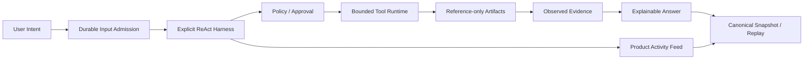

# DBFox 前端、后端与 Agent 架构深度评审

> 评审状态：2026-07-20 当前实现
> 性质：面向外部 AI/架构师的审查材料
> 前置阅读：[当前系统架构](../architecture-design-document.md)、[执行管线](../functional-modules-and-execution-pipelines.md)、[Agent Runtime](../architecture/agent-runtime.md)

## 1. 评审结论

DBFox 已经从“聊天界面 + 模型 + SQL 工具”演进为本地优先、事件驱动、证据绑定的数据分析 Agent 产品。当前主链路完整：

架构方向合理，当前不存在必须回退到 v1.0.1 或重新引入 LangGraph 的理由。过去最严重的断点——双 Runtime、结果行持久化、事件不可靠、工具无预算、SQLite 伪行锁、前端无稳定 correlation——已经关闭。

当前剩余问题主要是条件扩展与验证纵深：高权限隔离执行、多 Provider 路由、远程服务化和更强评测。它们不应通过通用 fallback 或预埋兼容层提前实现。

## 2. 评审方法

本评审使用四级判断：

| 状态 | 判断标准 |
|---|---|
| 符合 | 设计、代码、迁移、测试和产品行为一致 |
| 基本符合 | 主链路成立，仍有明确的非阻断增强项 |
| 条件符合 | 当前范围内正确，但扩大能力前必须补新边界 |
| 不符合 | 当前承诺与实现冲突，或存在上下游断点 |

不把“未来可能需要”自动判为当前缺陷。例如，当前没有 filesystem tool，因此没有 isolated-process backend 时拒绝注册是符合，而不是缺少一个必须空跑的模块。

## 3. 整体架构评审

### 3.1 模块化单体是否合理

判断：**符合。**

Tauri + React + FastAPI sidecar + private SQLite 适合本地数据库客户端：安装和故障域清晰，用户数据不需要经过中心服务，数据库驱动和凭据能留在本机。此阶段拆成微服务会引入本地编排、网络协议和分布式一致性成本，却没有获得真实多租户收益。

需要守住的边界：

- React 不拥有 Agent terminal truth；
- FastAPI Router 不直接拼装跨领域终态；
- Agent Repository 不执行长时间外部调用；
- Event Log 不取代 canonical tables；
- LiveStreamHub 不被当作 durable broker。

### 3.2 本地优先安全模型

判断：**符合。**

引擎只监听 loopback，使用运行期 local token；frozen 环境校验 Origin/Referer。凭据使用 OS vault，metadata 只存 opaque ID。诊断、审计和错误返回有独立脱敏边界。

局限：本模型不具备公网身份和租户隔离。任何远程 Web 计划都必须改变部署与安全模型，而不是简单开放端口。

### 3.3 持久化事实与实时体验

判断：**符合。**

系统正确区分：

- canonical table：可恢复业务事实；
- Runtime Event Log：可重放公共变化；
- snapshot：canonical table 的完整产品投影；
- LiveStreamHub：低延迟通知；
- frontend Store：当前渲染缓存。

这五层若混合，会产生刷新丢失、双回答、幽灵工具或旧状态覆盖；当前通过 sequence、revision、correlation、snapshot-required 和 reducer dedupe 将它们分开。

## 4. 前端架构评审

### 4.1 产品信息架构

判断：**符合。**

Conversation Workspace 将 Answer、Activity、Approval/Question、Artifact/Evidence 分区，符合成熟 Agent 产品的交互规律：过程和结果同时可见，但不把内部调试 trace 倾倒给用户。

Activity Feed 的合理性：

- 展示稳定步骤和工具状态；
- 动态 Plan 只在复杂任务出现；
- 公开 reasoning summary，不展示私有 chain-of-thought；
- 关联 Artifact 可点击；
- waiting 状态有正式卡片而非 Toast。

### 4.2 State 与数据边界

判断：**符合。**

Conversation Store 保存 snapshot/event 投影，不保存 Result rows。Result 当前页只存在 SQL-backed hook；请求可取消，卸载释放。Artifact Dock 保存选择和布局偏好，但 Artifact 内容来自后端。

重点防回归：

- 不把 rows/previewRows/series 加回公共 Artifact type；
- 不把 EventSource message 直接 append 为永久 Message；
- 不根据“最后一个表格”启发式选择 Artifact；
- 不在前端生成 Approval 终态或 Tool succeeded。

### 4.3 SSE 与 Reducer

判断：**符合。**

前端区分 committed cursor 和 live channel revision。稳定 correlation 允许 live token/tool progress 被后续 committed entity 合并。cursor gap 会触发 snapshot reload，不做局部猜测修复。

可增强项：针对超长 Session 继续测量 reducer merge 和 snapshot payload；若未来单会话达到数万实体，可将 store 索引从数组查找升级为 normalized entity map，但当前不应提前牺牲可读性。

### 4.4 组件、可访问性与性能

判断：**基本符合。**

已采用 react-markdown AST/GFM/sanitize、Radix 焦点组件、Lucide、CSP-safe 虚拟布局、lazy Chart 和 bundle budget。Dialog/Collapsible/Approval 等有可访问性测试。

仍应持续做视觉回归，特别是设置页、小窗口、深色主题、长中文表格和 Artifact Dock 三栏密度；这属于设计质量持续工作，不是当前架构断点。

## 5. 后端架构评审

### 5.1 API 边界

判断：**符合。**

FastAPI Router 负责 DTO、依赖和固定错误映射，核心行为进入 service/repository。敏感异常不透传；Result 接口只接收 Artifact ID 和视图参数。

重点防回归：不要为了方便让分页 API 再接收 datasource ID + safeSql；不要让前端提供被后端信任的 generation/fingerprint。

### 5.2 SQLite 并发模型

判断：**符合。**

WAL 只改善读写并发，并不提供 writer serialization。当前 Agent 写事务显式 `BEGIN IMMEDIATE`，在读取可变聚合前取得 writer reservation；lease token、version 和 sequence 再提供领域 fencing。

合理限制：本地 SQLite 只适合单机元数据。若远程服务化，不能把同一文件放到共享盘模拟分布式数据库。

### 5.3 数据源与外部资源生命周期

判断：**符合。**

connection generation 将持久配置与 pool/tunnel 资源绑定。更新后旧 profile 不能重新创建连接。备份与恢复也绑定 generation/fingerprint，避免对错误来源或并发更新执行 cutover。

### 5.4 SQL 与 Result Gateway

判断：**符合。**

SQL safety、dialect、guardrail、QueryRegistry 和 Result compiler 边界清晰。Reference-only Result 消除了元数据库、Event、Memory 和前端 Store 中的大结果副本。

重要权衡：页面刷新会重新查询来源数据库，因此视图值可能变化。这不是 bug；协议通过 original/view time 和 Evidence observedAt 区分“当前数据”与“回答当时证据”。

### 5.5 诊断与审计

判断：**符合。**

SecurityAuditRecord 有明确动作、结果、资源、Session/Run correlation 和脱敏 details；保留 90 天/20,000 条，诊断导出近 7 天/500 条，用户可独立清理并留下清理记录。

## 6. Agent 架构评审

### 6.1 不使用 LangGraph 的决定

判断：**符合当前产品。**

问题不在 LangGraph 本身，而在 DBFox 的关键状态必须同时满足关系事务、工具副作用、产品事件、Approval、Result/Evidence 边界和前端恢复。若 Graph State 再拥有一份 truth，会形成双 checkpoint 和双终态。

显式 RunLoop 的优势：

- Turn、Invocation、Observation 和 terminal transaction 可独立测试；
- Provider stream 与产品事件不受 graph node 边界限制；
- Approval rejection 可作为 Observation 继续推理；
- 恢复策略可以按工具副作用分类；
- 动态计划不等于固定 DAG。

代价：团队必须自行维护 lease、budget、recovery、event contract 和故障注入。当前代码已经承担这些责任，不能只删除框架却不补 Harness。

### 6.2 ReAct 完整性

判断：**符合。**

Input → Turn → Model → Tool → Observation → Completion → Response 的循环完整。Provider finish signal 只是建议；CompletionPolicy 检查数据库任务是否有 readonly Result Observation、分析任务是否做 coverage review、回答是否引用 Result Artifact。

### 6.3 Context 与记忆

判断：**基本符合。**

L0 Turn buffer、L1 Run working state、L2 Session Memory、L3 datasource/schema knowledge 和 L4 user preference 有明确概念边界。结果行与凭据禁止持久化；selected Artifact 只注入 reference。

仍可增强：L4 preference 目前主要分散在产品设置，尚未形成独立的可查看、失效和审计的 Agent Preference projection。这不阻断数据分析主链。

### 6.4 Tool Runtime

判断：**条件符合。**

当前数据库读取工具有完整 Registry、schema、materialization、Policy、Approval、timeout/retry/concurrency/output limit/cancel。in-process capability allowlist 合理。

条件：引入 filesystem/network/subprocess/database-write 前必须实现 isolated-process backend，包括进程 kill、资源额度、文件根、网络出口和 unknown reconciliation。不能只在 ToolSpec 写 capability 而仍在主进程执行。

### 6.5 Task Plan

判断：**符合。**

Plan 是可选、版本化、可见的领域对象。稳定 step ID、单 in-progress 和 Evidence-required completion 防止计划成为装饰文本。`plan.update` 仍是 ReAct 工具，所以 Agent 可动态调整而不是被 DAG 固定。

### 6.6 Artifact 与 Evidence

判断：**符合。**

SQL Artifact 唯一保存 SQL；Result 引用 SQL；Chart 引用 Result；Evidence 引用 Result 并定位少量 claim。ResponseComposer 只接受真实 Artifact ID，终态事务同步提交 Evidence。

### 6.7 Budget、取消与恢复

判断：**符合当前工具集。**

RunControl 执行 turn/tool/repair/provider/token/cost/deadline；ToolExecutor 有独立限制。取消贯穿 provider、tool、Result request 和 QueryRegistry。进程恢复关闭不完整 Turn，工具按幂等/副作用证明分类。

底层驱动不支持硬中断时只能提供 deadline/fencing，而不能承诺数据库立即停止；产品应表达“已请求取消”与“已结算取消”的差异。

## 7. 上下游链路断点检查

| 链路 | 上游输入 | 中间所有者 | 下游输出 | 当前判断 |
|---|---|---|---|---|
| 用户输入 → Run | content/mode/idempotency | SessionRepository | stable Run IDs/events | 完整 |
| Run → Model Turn | context/history/artifact refs | RunLoop/Turn | normalized stream | 完整 |
| Model tool call → 执行 | canonical tool/input | Registry/Policy/Executor | Observation/Artifact | 完整 |
| 高风险调用 → 用户 | Approval | ApprovalRepository/UI | approved/rejected Observation | 完整 |
| Result → 页面 | Result Artifact ID | Result Gateway | current rows | 完整 |
| Result → Answer | transient values + Artifact | Response/Evidence | cited answer | 完整 |
| Event → 刷新恢复 | cursor/snapshot | Event Log/Projection | Store state | 完整 |
| cancel → terminal | command | RunControl/Repository | cancelled event/state | 完整 |
| process crash → resume | canonical state | Coordinator/lease | continued/failed/unknown | 完整，副作用工具受条件限制 |

## 8. 非功能评审

### 8.1 安全

优点：vault、loopback token、Origin、redaction、Approval、capability gate、audit、CSP。开放条件：高权限工具隔离、远程身份、发布签名。

### 8.2 性能

优点：短写事务、Session 间并行、按需 Schema、Result 实时分页、虚拟列表、lazy Chart。风险：超长 Session snapshot、外部数据库慢查询、Provider 长流。对应机制：event compaction、query deadline/cancel、Run deadline。

### 8.3 可靠性

优点：canonical state、lease fencing、atomic terminal、snapshot/replay、generation CAS、migration tests。仍需加强 crash-point fault injection 和真实打包 smoke。

### 8.4 可维护性

优点：领域对象、Repository、ToolSpec、event contract 和 typed frontend 分层。风险：`engine/models.py` 仍较集中，API 和 models 的旧式 SQLAlchemy typing 需要持续约束；不建议在没有实际收益时为“纯洁”拆成大量包。

## 9. 当前开放项

| 项目 | 当前状态 | 何时实施 | 不能采用的捷径 |
|---|---|---|---|
| Prompt Injection / crash / cost-quality eval | 未闭环 | 持续质量阶段 | 只增加几个 happy-path fixture |
| Isolated Tool Backend | 条件能力 | 首个高权限工具前 | 主进程 try/except 充当 sandbox |
| Provider Route | 条件能力 | 多模型成为产品功能时 | adapter 内静默 fallback |
| Remote Web | 独立里程碑 | 公网/多用户需求确认后 | 开放 loopback API |
| Signing/Store/Auto-update | 发布能力 | 正式分发前 | 用本地 debug build 代替发布证据 |

## 10. 供下一位 AI 重点复核的问题

1. 是否存在任何代码路径绕过 `BEGIN IMMEDIATE` 修改 Agent aggregate？
2. 是否存在 Event/Observation/Memory/Artifact 写入 rows、previewRows 或 series？
3. Approval resolve 是否始终绑定 Invocation、version、lease 和 generation？
4. Provider 中断后是否可能重复结算同一 ToolInvocation？
5. live item 和 committed event 是否在所有类型上共享稳定 correlation？
6. Result Gateway 的所有入口是否都只信任 Artifact ID 与受限视图参数？
7. cancel 之后是否有迟到 provider/tool result 能提交 completed？
8. Plan evidence-required step 是否能引用其他 Session Artifact？
9. Security Audit 是否在所有敏感动作覆盖，并且没有 SQL 结果或 secret？
10. Windows MSVC、macOS、Linux 候选构建是否取得真实 CI 证据？

## 11. 最终判断

当前 DBFox 的正确演进方向是继续强化自有 Runtime 的测试、故障注入和产品交互，而不是再加一层 Agent 框架或兼容旧状态。主链已具备过程可观察、结果可解释、权限可暂停、状态可恢复、数据不越界这五个核心属性。

发布判断仍需与架构判断分开：架构 P0 已关闭，不代表缺少 MSVC/Tauri 三平台构建证据时可以直接发布正式安装包。
